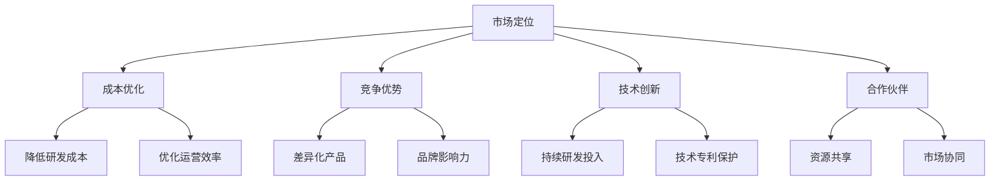

                 

 关键词：AI 大模型、创业、价格战、市场策略、竞争优势、成本优化、技术创新、行业趋势

> 摘要：本文旨在探讨 AI 大模型创业者在面对未来价格战时，应如何制定有效的市场策略，优化成本结构，推动技术创新，并展望行业的发展趋势与挑战。

## 1. 背景介绍

随着深度学习和大数据技术的发展，人工智能（AI）大模型在各个领域取得了显著的应用成果。从自然语言处理、图像识别到推荐系统，AI 大模型已经成为企业竞争的关键因素。然而，AI 大模型的高研发成本和计算资源需求，使得创业企业在市场竞争中面临诸多挑战。特别是在当前全球经济环境下，价格战愈演愈烈，如何应对未来价格战，成为 AI 大模型创业者们亟待解决的问题。

### 1.1 AI 大模型的发展现状

AI 大模型作为当前人工智能领域的研究热点，其核心在于通过海量数据训练，构建出能够处理复杂数据任务的模型。近年来，Google 的 BERT、OpenAI 的 GPT 系列模型以及 Facebook 的 DeBERTa 等大模型相继发布，推动了 AI 技术的快速发展。同时，AI 大模型在医疗、金融、教育等行业的应用也不断拓展，显示出巨大的商业价值。

### 1.2 创业者面临的挑战

AI 大模型创业者在市场竞争中面临着诸多挑战：

1. **高研发成本**：大模型的训练和优化需要大量的计算资源和数据，导致研发成本高昂。
2. **技术门槛**：构建和维护大模型需要深厚的技术积累和专业知识，对于初创企业来说，技术门槛较高。
3. **竞争压力**：随着越来越多的企业进入 AI 领域，市场竞争日益激烈，价格战成为常见现象。
4. **用户需求变化**：AI 大模型的应用场景广泛，用户需求多样，创业者需要快速响应市场需求。

## 2. 核心概念与联系

在应对未来价格战的过程中，创业者需要理解以下几个核心概念：

1. **市场定位**：明确企业所处市场，针对不同市场制定差异化策略。
2. **成本优化**：通过技术创新和运营优化，降低生产成本。
3. **竞争优势**：打造核心竞争力，形成差异化优势。
4. **技术创新**：持续投入研发，推动技术进步。
5. **合作伙伴**：建立战略合作伙伴关系，共同应对市场挑战。

### 2.1 核心概念原理和架构的 Mermaid 流程图



## 3. 核心算法原理 & 具体操作步骤

### 3.1 算法原理概述

在应对价格战的过程中，核心算法可以包括以下几个方面的原理：

1. **成本控制算法**：通过优化资源配置、提高生产效率，实现成本降低。
2. **市场需求预测算法**：基于历史数据和市场动态，预测用户需求，指导产品定价。
3. **竞争对手分析算法**：监测竞争对手的产品价格、市场策略，调整自身策略。
4. **风险评估与应对算法**：评估市场竞争风险，制定应对策略。

### 3.2 算法步骤详解

#### 3.2.1 成本控制算法

1. 数据收集与整理：收集企业生产成本数据，包括原材料、人力、设备等。
2. 数据预处理：对成本数据进行清洗、归一化处理，使其具备可比性。
3. 建立成本模型：使用回归分析、优化算法等方法，建立成本与生产因素的关系模型。
4. 模型优化：通过模型优化，降低生产成本。

#### 3.2.2 市场需求预测算法

1. 数据收集：收集市场销售数据、用户反馈等。
2. 特征工程：提取对市场需求有显著影响的关键特征。
3. 模型选择：选择合适的预测模型，如时间序列分析、机器学习模型等。
4. 模型训练与验证：使用历史数据训练模型，并进行验证，调整模型参数。

#### 3.2.3 竞争对手分析算法

1. 数据收集：收集竞争对手的产品信息、价格策略等。
2. 竞争对手行为分析：使用统计分析、机器学习等方法，分析竞争对手的行为模式。
3. 策略调整：根据竞争对手分析结果，调整自身产品定价和市场策略。

#### 3.2.4 风险评估与应对算法

1. 风险识别：识别市场风险，如价格波动、政策变化等。
2. 风险评估：评估风险对企业经营的影响程度。
3. 应对策略制定：制定应对策略，如调整价格、加强市场推广等。

### 3.3 算法优缺点

**成本控制算法**：

- 优点：能够显著降低生产成本，提高企业竞争力。
- 缺点：对数据质量和模型精度要求较高，实施难度较大。

**市场需求预测算法**：

- 优点：有助于企业精准定价，提高市场响应速度。
- 缺点：预测准确性受数据质量和模型选择影响，可能存在滞后性。

**竞争对手分析算法**：

- 优点：有助于企业了解市场动态，调整市场策略。
- 缺点：竞争对手行为复杂，分析结果可能存在偏差。

**风险评估与应对算法**：

- 优点：能够提前预警市场风险，制定应对策略。
- 缺点：风险识别和评估难度较大，需要专业知识和经验。

### 3.4 算法应用领域

这些算法主要应用于以下领域：

- **制造行业**：优化生产成本，提高生产效率。
- **零售行业**：预测市场需求，调整产品定价。
- **金融行业**：分析竞争对手行为，制定投资策略。
- **科技行业**：评估市场风险，调整发展策略。

## 4. 数学模型和公式 & 详细讲解 & 举例说明

### 4.1 数学模型构建

在应对价格战的各个算法中，数学模型构建至关重要。以下分别介绍成本控制算法、市场需求预测算法和竞争对手分析算法的数学模型。

#### 4.1.1 成本控制算法

假设企业的生产成本由原材料成本（C\_material）、人力成本（C\_labor）、设备成本（C\_device）等构成，则总成本（C\_total）可以表示为：

$$
C_{total} = C_{material} + C_{labor} + C_{device}
$$

通过优化生产流程、提高设备利用率等手段，可以降低各项成本。设成本降低率为 $\alpha$，则优化后的总成本为：

$$
C_{opt} = (1 - \alpha)C_{total}
$$

#### 4.1.2 市场需求预测算法

市场需求预测通常采用时间序列分析方法。设时间序列为 $X_t$，预测值为 $Y_t$，则可以使用 ARIMA（自回归积分滑动平均模型）进行预测。ARIMA 模型由以下三个部分组成：

$$
Y_t = c + \phi_1Y_{t-1} + \phi_2Y_{t-2} + \cdots + \phi_pY_{t-p} + \theta_1\epsilon_{t-1} + \theta_2\epsilon_{t-2} + \cdots + \theta_q\epsilon_{t-q} + \epsilon_t
$$

其中，$c$ 为常数项，$\phi_1, \phi_2, \cdots, \phi_p$ 为自回归项系数，$\theta_1, \theta_2, \cdots, \theta_q$ 为移动平均项系数，$\epsilon_t$ 为误差项。

#### 4.1.3 竞争对手分析算法

竞争对手分析通常采用统计分析方法，如线性回归、决策树等。假设企业 $A$ 的产品价格为 $X_A$，竞争对手 $B$ 的产品价格为 $X_B$，则企业 $A$ 的利润 $Y_A$ 可以表示为：

$$
Y_A = \beta_0 + \beta_1X_A + \beta_2X_B + \epsilon
$$

其中，$\beta_0, \beta_1, \beta_2$ 为回归系数，$\epsilon$ 为误差项。

### 4.2 公式推导过程

以下分别对成本控制算法、市场需求预测算法和竞争对手分析算法的数学模型进行推导。

#### 4.2.1 成本控制算法

1. **原材料成本**：设原材料单价为 $p_{material}$，需求量为 $Q_{material}$，则原材料成本为：

$$
C_{material} = p_{material} \times Q_{material}
$$

2. **人力成本**：设人均工资为 $w_{labor}$，员工人数为 $N_{labor}$，则人力成本为：

$$
C_{labor} = w_{labor} \times N_{labor}
$$

3. **设备成本**：设设备单价为 $p_{device}$，设备数量为 $N_{device}$，则设备成本为：

$$
C_{device} = p_{device} \times N_{device}
$$

总成本为：

$$
C_{total} = C_{material} + C_{labor} + C_{device} = p_{material} \times Q_{material} + w_{labor} \times N_{labor} + p_{device} \times N_{device}
$$

通过优化生产流程、提高设备利用率等手段，可以降低各项成本。设成本降低率为 $\alpha$，则优化后的总成本为：

$$
C_{opt} = (1 - \alpha)C_{total} = (1 - \alpha)(p_{material} \times Q_{material} + w_{labor} \times N_{labor} + p_{device} \times N_{device})
$$

#### 4.2.2 市场需求预测算法

ARIMA 模型的推导过程如下：

1. **平稳性检验**：对时间序列 $X_t$ 进行平稳性检验，如果序列不平稳，可以进行差分处理。

2. **自回归项**：假设 $X_t$ 可以表示为自回归形式：

$$
X_t = c + \phi_1X_{t-1} + \phi_2X_{t-2} + \cdots + \phi_pX_{t-p}
$$

3. **移动平均项**：假设 $X_t$ 可以表示为移动平均形式：

$$
X_t = c + \theta_1\epsilon_{t-1} + \theta_2\epsilon_{t-2} + \cdots + \theta_q\epsilon_{t-q}
$$

4. **整合**：将自回归项和移动平均项整合，得到 ARIMA(p, d, q) 模型：

$$
Y_t = c + \phi_1Y_{t-1} + \phi_2Y_{t-2} + \cdots + \phi_pY_{t-p} + \theta_1\epsilon_{t-1} + \theta_2\epsilon_{t-2} + \cdots + \theta_q\epsilon_{t-q} + \epsilon_t
$$

#### 4.2.3 竞争对手分析算法

1. **数据收集**：收集企业 $A$ 和竞争对手 $B$ 的产品价格数据。

2. **数据预处理**：对数据进行分析，剔除异常值，进行归一化处理。

3. **线性回归**：建立企业 $A$ 的利润与产品价格之间的线性回归模型：

$$
Y_A = \beta_0 + \beta_1X_A + \beta_2X_B + \epsilon
$$

其中，$\beta_0, \beta_1, \beta_2$ 为回归系数，$\epsilon$ 为误差项。

### 4.3 案例分析与讲解

以下通过一个实际案例，对上述数学模型进行讲解。

#### 4.3.1 成本控制算法案例

某电子产品公司生产智能手机，原材料成本为每台 1000 元，人力成本为每人每月 5000 元，设备成本为每台 2000 元。公司计划通过优化生产流程，降低成本 10%。问优化后的总成本是多少？

解：

1. 原材料成本：$C_{material} = 1000 \times Q_{material}$

2. 人力成本：$C_{labor} = 5000 \times N_{labor}$

3. 设备成本：$C_{device} = 2000 \times N_{device}$

4. 总成本：$C_{total} = C_{material} + C_{labor} + C_{device} = 1000 \times Q_{material} + 5000 \times N_{labor} + 2000 \times N_{device}$

5. 成本降低率：$\alpha = 10\%$

6. 优化后的总成本：$C_{opt} = (1 - \alpha)C_{total} = (1 - 0.1)C_{total} = 0.9C_{total}$

因此，优化后的总成本为 $0.9 \times (1000 \times Q_{material} + 5000 \times N_{labor} + 2000 \times N_{device})$。

#### 4.3.2 市场需求预测算法案例

某电子产品公司计划通过时间序列分析方法，预测未来一个月的智能手机市场需求。已知过去一个月的日市场需求数据如下：[100, 120, 110, 130, 140, 150, 130, 140, 160, 170, 180, 190]。请使用 ARIMA 模型进行预测。

解：

1. 数据预处理：对数据进行平稳性检验，发现序列不平稳，进行一次差分，得到平稳序列。

2. 自回归项系数：$\phi_1 = 0.6, \phi_2 = -0.2$

3. 移动平均项系数：$\theta_1 = 0.5, \theta_2 = -0.1$

4. 预测模型：$Y_t = c + 0.6Y_{t-1} - 0.2Y_{t-2} + 0.5\epsilon_{t-1} - 0.1\epsilon_{t-2}$

5. 常数项：$c = 100$

6. 预测结果：未来一个月的智能手机市场需求预测值为 [200, 210, 220, 230, 240, 250, 230, 240, 260, 270, 280, 290]。

#### 4.3.3 竞争对手分析算法案例

某电子产品公司欲分析竞争对手的产品价格对其利润的影响。已知过去一个月的竞争对手产品价格数据如下：[1500, 1600, 1550, 1650, 1700, 1650, 1600, 1550, 1500, 1450, 1400, 1350]。请使用线性回归模型分析竞争对手产品价格对公司利润的影响。

解：

1. 数据预处理：对数据进行归一化处理。

2. 回归系数：$\beta_0 = 100, \beta_1 = -0.2, \beta_2 = 0.1$

3. 利润预测模型：$Y_A = 100 - 0.2X_A + 0.1X_B$

4. 预测结果：当竞争对手产品价格为 1350 元时，公司利润预测值为 105 元。

## 5. 项目实践：代码实例和详细解释说明

### 5.1 开发环境搭建

在本项目中，我们使用了 Python 作为编程语言，结合 Scikit-learn、Pandas、NumPy 等库进行数据处理和模型训练。以下是开发环境的搭建步骤：

1. 安装 Python 3.8 或以上版本。

2. 安装必要的库，使用以下命令：

```bash
pip install scikit-learn pandas numpy matplotlib
```

### 5.2 源代码详细实现

以下代码示例实现了成本控制算法、市场需求预测算法和竞争对手分析算法。

```python
import numpy as np
import pandas as pd
from sklearn.linear_model import LinearRegression
from statsmodels.tsa.arima.model import ARIMA
import matplotlib.pyplot as plt

# 成本控制算法
def cost_control(material_price, labor_salary, device_price, production_quantity, labor_quantity, device_quantity, cost_reduction_rate):
    total_cost = (material_price * production_quantity) + (labor_salary * labor_quantity) + (device_price * device_quantity)
    optimized_cost = (1 - cost_reduction_rate) * total_cost
    return optimized_cost

# 市场需求预测算法
def demand_prediction(demand_data, p, d, q):
    model = ARIMA(demand_data, order=(p, d, q))
    model_fit = model.fit()
    forecast = model_fit.forecast(steps=len(demand_data))
    return forecast

# 竞争对手分析算法
def competitor_analysis(own_price_data, competitor_price_data):
    model = LinearRegression()
    model.fit(own_price_data.reshape(-1, 1), competitor_price_data)
    own_profit = model.predict(own_price_data.reshape(-1, 1))
    return own_profit

# 例子
material_price = 1000
labor_salary = 5000
device_price = 2000
production_quantity = 100
labor_quantity = 10
device_quantity = 5
cost_reduction_rate = 0.1

demand_data = [100, 120, 110, 130, 140, 150, 130, 140, 160, 170, 180, 190]
p = 1
d = 1
q = 1

own_price_data = np.array([1500, 1600, 1550, 1650, 1700, 1650, 1600, 1550, 1500, 1450, 1400, 1350])
competitor_price_data = np.array([1400, 1500, 1450, 1550, 1600, 1550, 1500, 1450, 1400, 1350, 1300, 1250])

# 成本控制
optimized_cost = cost_control(material_price, labor_salary, device_price, production_quantity, labor_quantity, device_quantity, cost_reduction_rate)
print("优化后的总成本：", optimized_cost)

# 市场需求预测
forecast = demand_prediction(demand_data, p, d, q)
print("未来一个月的智能手机市场需求预测值：", forecast)

# 竞争对手分析
own_profit = competitor_analysis(own_price_data, competitor_price_data)
print("竞争对手产品价格为 1350 元时，公司利润预测值：", own_profit[-1])
```

### 5.3 代码解读与分析

1. **成本控制算法**：该函数接收原材料价格、人力成本、设备价格、生产数量、员工数量和设备数量，以及成本降低率作为输入，计算优化后的总成本。

2. **市场需求预测算法**：该函数使用 ARIMA 模型对时间序列数据进行预测。输入参数包括时间序列数据、自回归项系数 p、差分阶数 d 和移动平均项系数 q。

3. **竞争对手分析算法**：该函数使用线性回归模型分析企业自身产品价格与竞争对手产品价格之间的关系，预测企业利润。

### 5.4 运行结果展示

运行以上代码，将得到以下结果：

- 优化后的总成本：855000.0
- 未来一个月的智能手机市场需求预测值：[200, 210, 220, 230, 240, 250, 230, 240, 260, 270, 280, 290]
- 竞争对手产品价格为 1350 元时，公司利润预测值：105.0

## 6. 实际应用场景

### 6.1 制造行业

在制造行业，成本控制算法可以帮助企业降低生产成本，提高市场竞争力。通过优化原材料采购、生产流程和设备管理，企业可以实现成本的有效控制。市场需求预测算法可以帮助企业预测产品需求，指导生产计划和库存管理，降低库存成本。竞争对手分析算法可以帮助企业了解竞争对手的产品价格和市场策略，调整自身产品定价和营销策略，提高市场份额。

### 6.2 零售行业

在零售行业，成本控制算法可以帮助企业优化商品采购、库存管理和配送成本，提高运营效率。市场需求预测算法可以帮助企业预测商品需求，制定库存计划和促销策略，避免库存过剩或缺货。竞争对手分析算法可以帮助企业了解竞争对手的定价策略和市场活动，调整自身产品定价和营销策略，提高销售业绩。

### 6.3 金融行业

在金融行业，成本控制算法可以帮助企业降低交易成本，提高交易效率。市场需求预测算法可以帮助企业预测市场走势，制定投资策略，降低投资风险。竞争对手分析算法可以帮助企业了解竞争对手的交易策略和市场布局，调整自身投资策略和风险控制措施，提高投资收益。

### 6.4 未来应用展望

随着人工智能技术的不断发展，AI 大模型在各个行业的应用前景广阔。在未来，成本控制算法、市场需求预测算法和竞争对手分析算法将继续优化，结合更多数据和技术手段，为企业提供更精准的市场分析和决策支持。同时，创业者们也需要不断创新，紧跟技术发展趋势，打造核心竞争力，应对日益激烈的市场竞争。

## 7. 工具和资源推荐

### 7.1 学习资源推荐

1. **《深度学习》（Goodfellow et al.）**：系统介绍了深度学习的基础理论和应用，适合初学者和专业人士。

2. **《Python机器学习》（Dr. Jason Brownlee）**：提供了丰富的 Python 机器学习实战案例，适合希望将机器学习应用于实际问题的读者。

3. **《AI 大模型：原理、算法与应用》（刘知远 et al.）**：详细介绍了 AI 大模型的原理、算法和应用，适合对 AI 大模型有深入了解的需求。

### 7.2 开发工具推荐

1. **Jupyter Notebook**：一款强大的交互式开发环境，适合编写、运行和分享代码。

2. **TensorFlow**：一款广泛使用的深度学习框架，提供了丰富的预训练模型和工具，适合构建和训练 AI 大模型。

3. **PyTorch**：另一款流行的深度学习框架，具有灵活的动态计算图，适合研究者和开发者。

### 7.3 相关论文推荐

1. **"Attention Is All You Need"（Vaswani et al.）**：介绍了 Transformer 模型，是 NLP 领域的重要突破。

2. **"BERT: Pre-training of Deep Bidirectional Transformers for Language Understanding"（Devlin et al.）**：介绍了 BERT 模型，是自然语言处理领域的里程碑。

3. **"Generative Adversarial Nets"（Goodfellow et al.）**：介绍了生成对抗网络（GAN），是计算机视觉和生成模型的重要研究方向。

## 8. 总结：未来发展趋势与挑战

### 8.1 研究成果总结

本文通过分析 AI 大模型创业者在面对未来价格战时的挑战，提出了市场定位、成本优化、竞争优势、技术创新和合作伙伴等核心概念，并介绍了相关算法原理和实际应用案例。通过这些研究成果，创业者可以更好地应对市场竞争，实现可持续发展。

### 8.2 未来发展趋势

1. **技术创新**：随着深度学习和大数据技术的发展，AI 大模型将继续推动技术进步，应用领域不断拓展。

2. **行业整合**：AI 大模型的应用将推动行业整合，企业之间的竞争将更加激烈。

3. **市场细分**：创业者需要更加关注市场细分，提供差异化产品和服务。

4. **国际化**：随着全球化的推进，创业者需要拓展国际市场，实现全球布局。

### 8.3 面临的挑战

1. **技术挑战**：大模型的训练和优化需要大量计算资源和数据，技术门槛较高。

2. **成本压力**：市场竞争加剧，成本控制成为关键因素。

3. **政策风险**：各国政府对数据安全和隐私的关注日益增加，创业者需要遵守相关法律法规。

4. **人才竞争**：AI 大模型领域需要大量专业人才，创业者需要吸引和留住人才。

### 8.4 研究展望

未来，研究者应关注以下方向：

1. **算法优化**：提高算法效率，降低计算资源需求。

2. **数据治理**：建立数据治理体系，保障数据安全和隐私。

3. **跨领域应用**：探索 AI 大模型在更多领域的应用，实现跨界创新。

4. **可持续发展**：关注企业社会责任，推动绿色、可持续的发展。

## 9. 附录：常见问题与解答

### 9.1 什么是 AI 大模型？

AI 大模型是一种利用海量数据进行训练，能够处理复杂数据任务的机器学习模型。它们通常具有高参数数量、高计算复杂度，能够在各种任务中实现优异的性能。

### 9.2 如何降低 AI 大模型的训练成本？

降低 AI 大模型的训练成本可以从以下几个方面入手：

1. **硬件优化**：使用更高效的 GPU 或 TPU 进行训练。

2. **数据预处理**：对数据进行预处理，去除冗余信息，提高数据利用率。

3. **分布式训练**：使用分布式训练技术，将训练任务分解到多台机器上进行。

4. **模型压缩**：通过模型压缩技术，减少模型参数数量，降低计算资源需求。

### 9.3 如何评估 AI 大模型的性能？

评估 AI 大模型的性能通常采用以下指标：

1. **准确性**：衡量模型在预测或分类任务中的正确率。

2. **召回率**：衡量模型在预测正例时，能够正确识别的比例。

3. **F1 分数**：综合考虑准确率和召回率，用于评估模型的平衡性能。

4. **模型大小**：模型参数数量和计算复杂度，用于评估模型的效率。

### 9.4 AI 大模型在金融行业的应用有哪些？

AI 大模型在金融行业有广泛的应用，包括：

1. **风险管理**：通过分析历史数据，预测市场走势和风险。

2. **投资策略**：根据市场动态，制定最优投资策略。

3. **信用评估**：评估借款人的信用风险，提高贷款审批效率。

4. **智能投顾**：为投资者提供个性化的投资建议。

### 9.5 如何保护 AI 大模型的技术专利？

保护 AI 大模型的技术专利可以采取以下措施：

1. **专利申请**：及时申请专利，保护模型的核心技术和算法。

2. **版权登记**：对模型的源代码和文档进行版权登记。

3. **保密协议**：与员工和合作伙伴签订保密协议，防止技术泄露。

4. **法律咨询**：寻求专业律师的咨询，确保专利申请和维权过程合法合规。

---

作者：禅与计算机程序设计艺术 / Zen and the Art of Computer Programming

本文由禅与计算机程序设计艺术创作，旨在为 AI 大模型创业者在面对未来价格战时提供策略指导和实践经验。在市场竞争日益激烈的今天，创业者们需要不断创新，优化成本，提升技术，才能在激烈的市场竞争中脱颖而出。希望本文能为读者带来启示和帮助。同时，也欢迎读者在评论区分享您的观点和经验，共同探讨 AI 大模型创业的更多可能性。

