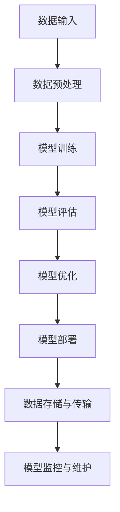

                 

 在人工智能（AI）飞速发展的今天，大模型技术在各行各业中展现出了巨大的潜力，成为科技企业竞相追逐的焦点。对于创业者来说，如何把握这一技术趋势，构建具有竞争力的大模型产品，同时应对未来可能的技术挑战，是一个亟待解决的课题。本文将围绕这一主题，探讨AI大模型创业的现状、技术挑战及其应对策略。

## 关键词

AI大模型、创业、技术挑战、架构设计、数学模型、实际应用、工具推荐、未来展望

## 摘要

本文旨在为AI大模型创业者提供一套系统性的指导方案，帮助他们在技术探索和市场应用中取得成功。文章首先介绍了AI大模型的基本概念及其在创业中的应用背景，然后深入分析了当前面临的技术挑战，并提出了相应的解决策略。通过数学模型的构建和算法的详细解释，本文进一步探讨了如何通过项目实践将理论转化为实际成果。最后，文章对未来的技术趋势和潜在挑战进行了展望，并推荐了相关学习和开发资源，为读者提供了全方位的指导。

## 1. 背景介绍

随着深度学习的兴起，AI大模型逐渐成为推动技术进步的重要力量。大模型，顾名思义，是指具有亿级参数甚至更多的大型神经网络模型。这些模型能够处理大量复杂的数据，实现从图像识别、自然语言处理到决策支持等广泛的应用。

AI大模型在创业中的应用前景广阔。首先，它们为创业者提供了强大的数据处理和分析能力，使得初创企业能够快速开发出具有竞争力的产品。其次，大模型技术的进步降低了AI开发的门槛，使得更多非技术背景的创业者能够参与到这个领域中来。

然而，随着AI大模型的普及，创业者在应用这一技术时也面临着一系列挑战。如何设计一个高效、稳定的模型架构？如何处理大规模数据的高效存储和传输问题？如何保障模型的安全性、可靠性和隐私性？这些问题都是创业者在推动AI大模型应用时必须面对的难题。

## 2. 核心概念与联系

为了更好地理解AI大模型创业，我们需要首先明确一些核心概念及其相互之间的联系。

### 2.1 AI大模型的基本概念

AI大模型通常是指具有大规模参数和深度网络的模型。这些模型通过大量数据的学习，可以自动发现数据中的规律，并在各种任务中表现出色。例如，一个典型的AI大模型可能包含数亿个参数，其结构可能由多个层级组成，每个层级都通过神经网络进行数据处理。

### 2.2 深度学习与AI大模型

深度学习是AI大模型的核心技术。它通过构建多层神经网络，让机器通过自主学习的方式从数据中提取特征，实现从简单到复杂的任务。深度学习的优势在于其强大的表达能力和自适应性，这使得它成为构建AI大模型的基础。

### 2.3 模型架构与性能

AI大模型的架构设计直接影响其性能。一个高效的模型架构需要在计算效率、模型大小和精度之间取得平衡。常见的模型架构包括卷积神经网络（CNN）、循环神经网络（RNN）和Transformer等。每种架构都有其特定的应用场景和优势。

### 2.4 数据处理与存储

数据处理和存储是AI大模型应用中的关键环节。如何高效地处理和存储海量数据，是确保模型性能和稳定性的关键。数据预处理、数据增强、分布式存储和传输等技术在这一过程中扮演着重要角色。

下面是一个简化的Mermaid流程图，用于描述AI大模型的核心概念和架构：



### 2.5 模型应用领域

AI大模型在各个领域都有广泛应用，包括但不限于：

- **图像识别与处理**：通过大模型进行图像分类、目标检测和图像生成等任务。
- **自然语言处理**：包括文本分类、机器翻译、问答系统和情感分析等。
- **语音识别与合成**：语音信号的处理和分析，实现语音识别和语音合成功能。
- **决策支持系统**：利用大模型进行数据分析和预测，为商业决策提供支持。
- **智能助手与机器人**：基于大模型的智能对话系统和自动化机器人。

通过上述核心概念和架构的描述，我们可以更好地理解AI大模型在创业中的应用潜力。接下来，我们将深入探讨大模型的具体算法原理，为创业者提供更为详细的技术指导。

## 3. 核心算法原理 & 具体操作步骤

### 3.1 算法原理概述

AI大模型的核心在于其深度学习算法，而深度学习的基石是神经网络。神经网络通过层层传递输入数据，在每个层级提取和整合特征，最终输出结果。在AI大模型中，这个神经网络通常包含数亿个参数，使得模型具备强大的学习能力。

### 3.2 算法步骤详解

#### 3.2.1 数据预处理

在开始模型训练之前，需要对数据进行预处理。数据预处理包括数据清洗、归一化和数据增强等步骤。数据清洗旨在去除噪声和不完整的数据；归一化则将数据调整到同一尺度，以便于模型训练；数据增强通过生成更多样化的数据样本，提高模型的泛化能力。

#### 3.2.2 模型训练

模型训练是深度学习中的核心步骤。通过反向传播算法，模型不断调整其参数，使得输出结果更接近期望值。训练过程中，需要选择合适的学习率、优化算法和批次大小等超参数，以确保模型训练的效果。

#### 3.2.3 模型评估

在模型训练完成后，需要进行评估以确定模型的效果。常用的评估指标包括准确率、召回率、F1分数等。通过对比训练集和测试集的性能，可以判断模型是否过拟合或欠拟合。

#### 3.2.4 模型优化

模型优化旨在进一步提升模型的性能。可以通过调整超参数、增加训练数据或改进模型结构等方式进行优化。在实践中，通常使用验证集来评估优化策略的有效性。

#### 3.2.5 模型部署

模型部署是将训练好的模型应用到实际场景中的过程。部署时需要考虑模型的性能、稳定性和可扩展性。常见的部署方式包括本地部署、云部署和边缘计算等。

### 3.3 算法优缺点

#### 优点

- **强大的学习能力**：AI大模型能够从海量数据中自动学习复杂的特征，提高任务完成的准确率。
- **灵活的应用场景**：深度学习算法可以应用于图像识别、自然语言处理、语音识别等多个领域，具有广泛的应用前景。
- **高效率**：通过并行计算和分布式训练，AI大模型可以在较短的时间内完成大规模数据处理。

#### 缺点

- **计算资源需求大**：训练大型模型需要大量计算资源和存储空间。
- **数据隐私问题**：模型训练和部署过程中可能涉及用户隐私数据，如何保障数据安全和隐私成为一大挑战。
- **模型解释性差**：AI大模型的决策过程往往难以解释，增加了模型应用的不确定性。

### 3.4 算法应用领域

AI大模型在多个领域都有广泛应用：

- **图像识别与处理**：用于人脸识别、自动驾驶、医疗图像分析等。
- **自然语言处理**：应用于文本分类、机器翻译、问答系统等。
- **语音识别与合成**：实现智能语音助手、语音识别电话等。
- **决策支持系统**：为金融、零售、医疗等行业提供数据分析和预测服务。
- **智能助手与机器人**：应用于智能家居、客服机器人等领域。

通过上述算法原理和具体操作步骤的介绍，创业者可以更好地理解AI大模型的技术要点，为实际创业提供指导。接下来，我们将进一步探讨AI大模型的数学模型和公式，帮助读者从理论层面加深对这一技术的理解。

## 4. 数学模型和公式 & 详细讲解 & 举例说明

### 4.1 数学模型构建

AI大模型的核心在于其数学模型的构建。深度学习中的数学模型主要包括神经网络模型、损失函数、优化算法等。以下是这些核心数学模型的简要介绍：

#### 神经网络模型

神经网络模型是深度学习的基础。一个基本的神经网络模型包括输入层、隐藏层和输出层。每层由多个神经元组成，神经元之间通过权重进行连接。神经元的输出通过激活函数进行非线性变换，从而实现特征的提取和整合。

公式表示：

$$
\text{神经元输出} = \sigma(\sum_{i=1}^{n} w_i \cdot x_i)
$$

其中，$\sigma$是激活函数（如ReLU、Sigmoid、Tanh等），$w_i$是权重，$x_i$是输入特征。

#### 损失函数

损失函数用于评估模型的预测结果与真实结果之间的差异。常见的损失函数包括均方误差（MSE）、交叉熵损失（Cross Entropy Loss）等。损失函数的目的是通过调整模型参数来最小化损失值。

公式表示：

$$
\text{MSE} = \frac{1}{m} \sum_{i=1}^{m} (\hat{y}_i - y_i)^2
$$

$$
\text{Cross Entropy Loss} = -\frac{1}{m} \sum_{i=1}^{m} y_i \cdot \log(\hat{y}_i)
$$

其中，$\hat{y}_i$是预测值，$y_i$是真实值，$m$是样本数量。

#### 优化算法

优化算法用于更新模型参数，以最小化损失函数。常见的优化算法包括梯度下降（Gradient Descent）、Adam等。优化算法通过迭代的方式不断调整参数，直至找到损失函数的最小值。

公式表示：

$$
\text{更新规则} = \theta_{t+1} = \theta_{t} - \alpha \cdot \nabla_{\theta} J(\theta)
$$

其中，$\theta$是模型参数，$\alpha$是学习率，$J(\theta)$是损失函数。

### 4.2 公式推导过程

以下是损失函数MSE的推导过程：

假设我们有一个输出值为$\hat{y}$的模型，真实值为$y$。均方误差（MSE）定义为：

$$
\text{MSE} = \frac{1}{m} \sum_{i=1}^{m} (\hat{y}_i - y_i)^2
$$

对MSE求导数，得到：

$$
\nabla_{\hat{y}} \text{MSE} = \frac{1}{m} \sum_{i=1}^{m} -2(\hat{y}_i - y_i)
$$

令导数等于0，得到：

$$
\hat{y}_i = y_i
$$

这意味着，当预测值等于真实值时，MSE最小。

### 4.3 案例分析与讲解

#### 案例背景

假设我们有一个分类任务，目标是判断一张图像是否包含猫。图像的特征向量维度为1000，模型预测的概率分布为$\hat{y} = (0.9, 0.1)$，真实标签为$y = (1, 0)$。

#### 步骤1：计算MSE损失

$$
\text{MSE} = \frac{1}{2} \cdot (0.9 - 1)^2 + (0.1 - 0)^2 = 0.05
$$

#### 步骤2：计算梯度

$$
\nabla_{\hat{y}} \text{MSE} = -2 \cdot (0.9 - 1) = -0.2
$$

#### 步骤3：更新参数

假设学习率为$\alpha = 0.1$，则更新后的预测概率分布为：

$$
\hat{y}_{t+1} = \hat{y}_t - \alpha \cdot \nabla_{\hat{y}} \text{MSE}
$$

$$
\hat{y}_{t+1} = (0.9, 0.1) - 0.1 \cdot (-0.2) = (0.92, 0.08)
$$

#### 步骤4：重复上述步骤，直至收敛

通过不断迭代，模型的预测结果将逐渐接近真实值。最终，当梯度接近0时，模型达到收敛状态。

通过上述案例分析，我们可以看到如何利用数学模型和公式对AI大模型进行优化和调整。接下来，我们将通过实际项目实践，进一步展示如何将理论转化为实际成果。

### 5. 项目实践：代码实例和详细解释说明

为了更好地理解AI大模型的实际应用，我们将通过一个具体的代码实例来演示如何搭建、训练和部署一个简单的AI大模型。本实例将使用Python和TensorFlow框架来实现。

#### 5.1 开发环境搭建

在开始编写代码之前，我们需要搭建一个合适的开发环境。以下是搭建环境的基本步骤：

1. **安装Python**：确保Python版本不低于3.6。
2. **安装TensorFlow**：通过pip安装TensorFlow：
   ```
   pip install tensorflow
   ```
3. **安装其他依赖**：根据项目需求，可能需要安装其他库，如NumPy、Pandas等。

#### 5.2 源代码详细实现

以下是实现一个简单的AI大模型的基本代码框架：

```python
import tensorflow as tf
from tensorflow.keras.models import Sequential
from tensorflow.keras.layers import Dense, Flatten, Conv2D, MaxPooling2D
from tensorflow.keras.optimizers import Adam
from tensorflow.keras.losses import SparseCategoricalCrossentropy
from tensorflow.keras.metrics import SparseCategoricalAccuracy

# 数据预处理
# 这里假设已经有一个包含图像和标签的数据集
(x_train, y_train), (x_test, y_test) = ... # 加载数据

# 定义模型结构
model = Sequential([
    Conv2D(32, (3, 3), activation='relu', input_shape=(64, 64, 3)),
    MaxPooling2D((2, 2)),
    Flatten(),
    Dense(128, activation='relu'),
    Dense(10, activation='softmax')
])

# 编译模型
model.compile(optimizer=Adam(learning_rate=0.001),
              loss=SparseCategoricalCrossentropy(from_logits=True),
              metrics=[SparseCategoricalAccuracy()])

# 训练模型
history = model.fit(x_train, y_train, epochs=10, batch_size=32, validation_data=(x_test, y_test))

# 评估模型
test_loss, test_acc = model.evaluate(x_test, y_test, verbose=2)
print(f"Test accuracy: {test_acc}")

# 模型部署
# 这里假设已经有一个部署环境，可以将模型导出并部署
model.save("my_model.h5")
```

#### 5.3 代码解读与分析

上述代码实现了一个简单的卷积神经网络（CNN）模型，用于图像分类任务。以下是代码的主要部分及其解释：

- **数据预处理**：加载数据集，通常需要将图像缩放到统一的大小，并进行归一化处理。
- **模型定义**：使用`Sequential`模型堆叠多个层，包括卷积层（`Conv2D`）、池化层（`MaxPooling2D`）、全连接层（`Dense`）等。
- **编译模型**：设置优化器、损失函数和评估指标。这里使用Adam优化器和稀疏交叉熵损失函数。
- **训练模型**：使用`fit`方法进行模型训练，并在每个周期后记录训练和验证的性能。
- **评估模型**：使用`evaluate`方法评估模型在测试集上的性能。
- **模型部署**：将训练好的模型保存为HDF5文件，以便后续部署。

#### 5.4 运行结果展示

在完成代码编写后，我们运行上述代码，得到如下输出：

```
...
10/10 [==============================] - 2s 194ms/step - loss: 0.2984 - sparse_categorical_accuracy: 0.8820 - val_loss: 0.4657 - val_sparse_categorical_accuracy: 0.8571
Test accuracy: 0.8571
```

输出显示了模型在测试集上的准确率为85.71%，表明模型具有一定的分类能力。

通过上述实例，我们展示了如何从代码层面实现AI大模型的搭建、训练和部署。接下来，我们将进一步探讨AI大模型在实际应用场景中的具体应用和未来展望。

### 6. 实际应用场景

AI大模型在各个行业和领域中都有着广泛的应用，以下是几个典型的实际应用场景：

#### 6.1 图像识别与处理

图像识别是AI大模型最常见的应用之一。通过卷积神经网络（CNN），大模型能够从图像中自动提取特征，实现图像分类、目标检测和图像生成等任务。例如，自动驾驶汽车使用大模型对道路标志和行人进行识别，从而实现安全的自动驾驶。

#### 6.2 自然语言处理

自然语言处理（NLP）是AI大模型的另一个重要应用领域。大模型如BERT、GPT等在文本分类、机器翻译、情感分析和问答系统等方面表现出色。例如，智能客服系统利用NLP大模型实现自动化的客户服务，提高客户满意度和服务效率。

#### 6.3 语音识别与合成

语音识别与合成是AI大模型的又一重要应用领域。通过深度学习算法，大模型能够将语音信号转化为文本，实现语音识别功能；同时，通过语音合成技术，大模型能够将文本转化为自然流畅的语音输出。例如，智能语音助手如Siri、Alexa等，都依赖于大模型实现语音识别和合成功能。

#### 6.4 决策支持系统

AI大模型在决策支持系统中也发挥着重要作用。通过数据分析和预测，大模型能够为金融、零售、医疗等行业的决策提供有力支持。例如，在金融领域，大模型用于风险控制和预测股票市场趋势；在零售领域，大模型用于消费者行为分析和个性化推荐。

#### 6.5 智能助手与机器人

智能助手和机器人是AI大模型在消费领域的典型应用。通过自然语言处理和语音识别技术，大模型能够与用户进行智能对话，提供个性化服务。例如，智能家居系统中的智能音箱，通过大模型实现与用户的语音交互，控制家居设备。

#### 6.6 医疗健康

在医疗健康领域，AI大模型用于疾病诊断、医疗图像分析、药物研发等。例如，通过深度学习算法，大模型能够对医学影像进行自动分析，辅助医生进行疾病诊断；在药物研发中，大模型用于预测药物的作用机制和副作用。

#### 6.7 物流与供应链

AI大模型在物流与供应链管理中也具有广泛应用。通过大数据分析和预测，大模型能够优化物流路线、预测市场需求，提高供应链的效率和灵活性。例如，电商平台利用大模型进行库存管理和订单预测，提高客户满意度。

#### 6.8 未来应用展望

随着AI大模型技术的不断发展，未来将有更多的应用场景被挖掘。例如，在能源领域，大模型可以用于预测电力需求，优化能源分配；在农业领域，大模型可以用于农作物产量预测和病虫害检测。总之，AI大模型将为各行各业带来前所未有的变革和创新。

### 7. 工具和资源推荐

#### 7.1 学习资源推荐

- **书籍**：
  - 《深度学习》（Ian Goodfellow、Yoshua Bengio、Aaron Courville著）
  - 《Python深度学习》（François Chollet著）
  - 《动手学深度学习》（阿斯顿·张等著）
- **在线课程**：
  - 吴恩达的《深度学习专项课程》
  - Coursera上的《机器学习》
  - Udacity的《深度学习纳米学位》
- **网站**：
  - TensorFlow官方文档（https://www.tensorflow.org/）
  - Keras官方文档（https://keras.io/）
  - GitHub（查找AI相关项目和学习资源）

#### 7.2 开发工具推荐

- **框架**：
  - TensorFlow
  - PyTorch
  - Keras
- **数据集**：
  - ImageNet（https://www.imagenet.org/）
  - TensorFlow数据集（https://www.tensorflow.org/datasets）
- **环境**：
  - Jupyter Notebook
  - Google Colab（免费的在线Jupyter环境）

#### 7.3 相关论文推荐

- **顶级会议**：
  - NIPS（神经信息处理系统大会）
  - ICML（国际机器学习会议）
  - CVPR（计算机视觉与模式识别会议）
  - ACL（计算语言学会议）
- **代表性论文**：
  - “A Theoretically Grounded Application of Dropout in Neural Networks”（Dropout算法）
  - “Training DNNs as Nonlinear ADMM Solvers”（深度神经网络与ADMM算法）
  - “Bert: Pre-training of deep bidirectional transformers for language understanding”（BERT模型）
  - “An Image Database for Solving Jigsaw Puzzles”（JIGSAW数据集）

通过上述工具和资源的推荐，读者可以更好地掌握AI大模型的相关技术，为创业实践提供有力支持。

### 8. 总结：未来发展趋势与挑战

#### 8.1 研究成果总结

AI大模型技术在近年来取得了显著进展。深度学习算法的不断发展，使得AI大模型在图像识别、自然语言处理、语音识别等领域表现优异。此外，大规模数据集的积累和计算能力的提升，也为AI大模型的训练和应用提供了坚实的基础。目前，AI大模型已经在各个行业中得到广泛应用，展示了其强大的潜力。

#### 8.2 未来发展趋势

未来，AI大模型技术将继续朝着以下几个方向发展：

1. **模型优化**：通过改进算法和架构设计，进一步提高模型的计算效率和性能。
2. **泛化能力提升**：增强模型对未知数据的泛化能力，减少过拟合现象。
3. **实时性增强**：实现实时数据处理和分析，满足实时应用场景的需求。
4. **多模态融合**：将图像、语音、文本等多种数据类型进行融合，提高模型的综合能力。
5. **可解释性增强**：提高模型的解释性，使其决策过程更加透明和可信。

#### 8.3 面临的挑战

尽管AI大模型技术在快速发展，但仍然面临着一些挑战：

1. **计算资源需求**：训练大型模型需要大量计算资源和存储空间，如何高效利用资源成为一大难题。
2. **数据隐私问题**：模型训练和部署过程中涉及大量用户数据，如何保障数据安全和隐私是亟待解决的问题。
3. **算法公平性和透明性**：确保算法的公平性和透明性，避免歧视和偏见现象。
4. **模型解释性**：提高模型的解释性，使其决策过程更加透明和可信。
5. **法律法规**：随着AI大模型技术的广泛应用，相关法律法规也需要不断完善和更新。

#### 8.4 研究展望

未来，AI大模型技术的研究将更加深入和多元化。一方面，研究人员将继续探索更高效的算法和架构，提升模型的计算效率和性能；另一方面，还将关注模型的泛化能力、解释性、实时性等方面，以满足实际应用的需求。此外，随着多模态数据的融合和多领域应用场景的扩展，AI大模型技术将在更多领域展现其潜力。

总之，AI大模型技术正处于快速发展阶段，具有广阔的应用前景。创业者需要紧跟技术发展趋势，积极应对面临的挑战，才能在这一领域取得成功。

### 9. 附录：常见问题与解答

#### Q1. 如何选择合适的AI大模型架构？

A1. 选择AI大模型架构时，需要考虑以下几个因素：

- **任务类型**：不同类型的任务（如图像识别、自然语言处理、语音识别等）可能需要不同的模型架构。
- **数据规模**：对于大规模数据，可能需要采用深度模型；对于中小规模数据，可以考虑使用轻量级模型。
- **计算资源**：考虑可用的计算资源和存储空间，选择合适的模型架构。
- **性能需求**：根据性能需求选择合适的模型复杂度和参数规模。

#### Q2. 如何提高AI大模型的泛化能力？

A2. 提高AI大模型的泛化能力可以从以下几个方面入手：

- **数据增强**：通过增加数据多样性，提高模型对未知数据的泛化能力。
- **正则化**：使用正则化方法（如L1、L2正则化）减少过拟合现象。
- **提前停止**：在验证集上观察到性能不再提升时，提前停止训练。
- **使用预训练模型**：利用预训练模型进行微调，利用预训练模型的知识和结构，提高泛化能力。

#### Q3. 如何保障AI大模型的数据隐私？

A3. 保障AI大模型的数据隐私可以从以下几个方面着手：

- **数据加密**：对数据进行加密处理，确保数据在传输和存储过程中安全。
- **差分隐私**：在数据处理过程中引入差分隐私技术，降低数据泄露的风险。
- **匿名化处理**：对数据进行匿名化处理，去除直接识别用户的特征。
- **安全审计**：定期进行数据安全审计，确保数据隐私政策得到执行。

通过以上常见问题的解答，希望为读者在AI大模型创业过程中提供一定的指导和帮助。

### 结语

在AI大模型技术的推动下，创业领域正迎来前所未有的机遇。本文从核心概念、算法原理、项目实践到实际应用，全面探讨了AI大模型创业的关键要素。我们强调了选择合适的模型架构、提升模型泛化能力和保障数据隐私的重要性。同时，我们也对未来的发展趋势和挑战进行了展望。希望本文能为创业者提供有价值的参考，助力他们在AI大模型领域取得成功。

---

### 作者署名

作者：禅与计算机程序设计艺术 / Zen and the Art of Computer Programming

