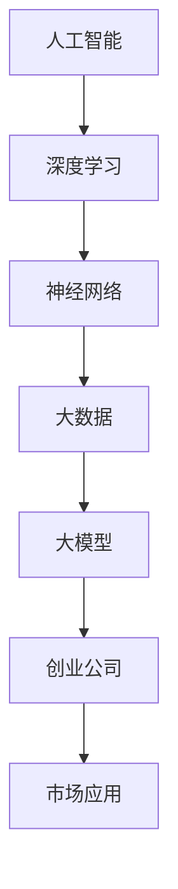

                 

关键词：人工智能、大模型、创业、技术挑战、未来趋势

> 摘要：本文将探讨AI大模型在创业中的机遇与挑战。通过对大模型技术原理的深入分析，结合实际案例，我们将探讨创业者在选择、开发与应用大模型过程中可能面临的问题，以及如何应对这些挑战，为未来AI大模型创业提供有益的参考。

## 1. 背景介绍

### AI大模型的兴起

近年来，人工智能（AI）技术取得了显著的进展，特别是深度学习（Deep Learning）的发展，使得AI在图像识别、自然语言处理、语音识别等领域取得了突破性成果。其中，AI大模型（Large AI Models）成为了研究的热点和应用的重点。大模型通常是指拥有数十亿至数万亿参数的神经网络模型，其处理能力和表现力远超传统模型。

### 大模型在创业中的应用

随着AI大模型的成熟，越来越多的创业公司开始尝试利用这一技术来开发新产品、拓展业务。无论是通过AI大模型实现自动化决策、个性化推荐，还是基于大模型构建全新的智能服务，AI大模型都为创业公司提供了巨大的机遇。然而，与此同时，大模型创业也面临着诸多挑战。

## 2. 核心概念与联系

在探讨AI大模型创业之前，我们需要了解一些核心概念和它们之间的关系。以下是一个简要的Mermaid流程图，用于描述这些概念和它们之间的联系：



### 2.1 人工智能

人工智能是一门研究、开发用于模拟、延伸和扩展人的智能的理论、方法、技术及应用系统的科学技术。它包括机器学习、计算机视觉、自然语言处理等多个子领域。

### 2.2 深度学习

深度学习是人工智能的一个重要分支，它通过构建多层的神经网络来模拟人脑的学习过程。深度学习模型可以自动从大量数据中学习特征，并用于图像识别、语音识别等任务。

### 2.3 神经网络

神经网络是深度学习的基础，它由多个神经元（节点）组成，通过前向传播和反向传播来训练模型。神经网络的层次越多，其表达能力越强。

### 2.4 大数据

大数据是指无法用常规软件工具在合理时间内对其进行存储、管理和处理的数据集。大数据为深度学习和大模型的训练提供了丰富的数据资源。

### 2.5 大模型

大模型是指拥有大量参数的神经网络模型，其计算复杂度较高，但能够达到更高的性能和更广泛的应用。

### 2.6 创业公司

创业公司是利用AI大模型技术进行商业创新和业务拓展的企业。它们通常面临着技术、市场、资金等多方面的挑战。

### 2.7 市场应用

市场应用是指AI大模型技术在不同行业和领域的实际应用，如医疗、金融、零售等。

## 3. 核心算法原理 & 具体操作步骤

### 3.1 算法原理概述

AI大模型的训练过程通常涉及以下几个核心步骤：

1. 数据预处理：清洗和转换原始数据，使其适合模型训练。
2. 模型架构设计：选择合适的神经网络架构，如Transformer、BERT等。
3. 模型训练：使用大量数据进行模型训练，优化模型参数。
4. 模型评估：通过验证集和测试集评估模型性能。
5. 模型部署：将训练好的模型部署到实际应用场景中。

### 3.2 算法步骤详解

1. **数据预处理**：

   数据预处理是模型训练的第一步，其目标是将原始数据转换为适合模型训练的格式。具体步骤包括：

   - 数据清洗：去除重复数据、缺失数据和异常数据。
   - 数据转换：将数据转换为数值格式，如使用词向量将文本数据转换为数字序列。
   - 数据归一化：将数据缩放到相同的范围，以消除不同特征之间的尺度差异。

2. **模型架构设计**：

   选择合适的模型架构是成功训练大模型的关键。常用的模型架构包括：

   - 卷积神经网络（CNN）：适用于图像识别任务。
   - 循环神经网络（RNN）：适用于序列数据处理任务。
   -  Transformer：适用于自然语言处理任务。

3. **模型训练**：

   模型训练是使用大量数据来优化模型参数的过程。具体步骤包括：

   - 初始化模型参数。
   - 使用前向传播计算模型输出。
   - 使用损失函数计算模型输出与实际输出之间的差异。
   - 使用反向传播算法更新模型参数。

4. **模型评估**：

   模型评估是使用验证集和测试集来评估模型性能的过程。常用的评估指标包括：

   - 准确率（Accuracy）：模型预测正确的样本占总样本的比例。
   - 精确率（Precision）：模型预测为正类的样本中实际为正类的比例。
   - 召回率（Recall）：模型预测为正类的样本中实际为正类的比例。
   - F1值（F1-score）：精确率和召回率的加权平均。

5. **模型部署**：

   模型部署是将训练好的模型应用到实际场景中的过程。具体步骤包括：

   - 选择部署平台：如云平台、边缘设备等。
   - 集成模型到应用程序中。
   - 进行性能优化，如模型压缩、量化等。

### 3.3 算法优缺点

**优点**：

- **强大的表达力**：大模型拥有大量的参数，能够学习到更复杂的特征，从而在许多任务上取得出色的性能。
- **广泛的适用性**：大模型适用于多种数据类型和任务，如文本、图像、语音等。
- **自动特征提取**：大模型能够自动从数据中提取特征，减轻了人工特征工程的工作负担。

**缺点**：

- **计算资源需求高**：大模型训练和推理需要大量的计算资源，对硬件设备有较高的要求。
- **训练时间长**：大模型训练通常需要大量的时间和数据。
- **模型可解释性差**：大模型通常是一个“黑盒”，其内部工作机制复杂，难以理解。

### 3.4 算法应用领域

AI大模型在许多领域都展现了强大的应用潜力，以下是一些典型的应用领域：

- **自然语言处理（NLP）**：如机器翻译、文本生成、情感分析等。
- **计算机视觉**：如图像识别、图像生成、视频分析等。
- **语音识别**：如语音合成、语音识别、语音识别系统等。
- **推荐系统**：如个性化推荐、内容推荐等。
- **医疗诊断**：如疾病预测、医学图像分析等。
- **金融分析**：如风险控制、市场预测等。

## 4. 数学模型和公式 & 详细讲解 & 举例说明

### 4.1 数学模型构建

AI大模型的训练过程涉及多种数学模型和公式，其中最核心的是神经网络模型。以下是一个简化的神经网络模型构建过程：

1. **初始化参数**：设神经网络有L层，每层的节点数分别为\(n_1, n_2, ..., n_L\)。初始化权重矩阵\(W^{(l)}\)和偏置向量\(b^{(l)}\)。
2. **前向传播**：对于输入数据\(x^{(l)}\)，通过前向传播计算每一层的输出\(a^{(l)}\)。
   \[
   a^{(l)} = \sigma(Z^{(l)})
   \]
   其中，\(\sigma\)是激活函数，如Sigmoid、ReLU等；\(Z^{(l)}\)是线性组合，即
   \[
   Z^{(l)} = W^{(l)}a^{(l-1)} + b^{(l)}
   \]
3. **计算损失函数**：使用损失函数\(J(W) = -\frac{1}{m}\sum_{i=1}^{m}y^{(i)}\log(a^{(L)}_{i})\)来衡量模型预测与实际标签之间的差异。
4. **反向传播**：通过反向传播算法计算梯度，并更新权重和偏置。
   \[
   \delta^{(L)} = \frac{\partial J}{\partial Z^{(L)}} = a^{(L)} - y
   \]
   \[
   \delta^{(l)} = (\frac{\partial Z^{(l+1)}}{\partial a^{(l+1)}} \cdot \delta^{(l+1)}) \cdot \sigma'(Z^{(l)})
   \]
   \[
   \frac{\partial J}{\partial W^{(l)}} = \delta^{(l)}a^{(l-1)}
   \]
   \[
   \frac{\partial J}{\partial b^{(l)}} = \delta^{(l)}
   \]

### 4.2 公式推导过程

在4.1节中，我们简单介绍了神经网络模型的构建过程，现在我们来详细推导一下前向传播和反向传播的公式。

**前向传播**：

设输入层为\(x^{(1)}\)，输出层为\(a^{(L)}\)。对于第l层，我们有：
\[ 
a^{(l)} = \sigma(Z^{(l)})
\]
\[ 
Z^{(l)} = W^{(l)}a^{(l-1)} + b^{(l)}
\]
其中，\(\sigma\)是激活函数，通常使用Sigmoid或ReLU。

**反向传播**：

设输出层为\(a^{(L)}\)，目标标签为\(y\)。我们需要计算损失函数的梯度，即
\[ 
\frac{\partial J}{\partial W^{(l)}}, \frac{\partial J}{\partial b^{(l)}}
\]
其中，\(J\)是损失函数。

首先，计算输出层的梯度：
\[ 
\delta^{(L)} = \frac{\partial J}{\partial Z^{(L)}} = a^{(L)} - y
\]
然后，计算每一层的梯度：
\[ 
\delta^{(l)} = (\frac{\partial Z^{(l+1)}}{\partial a^{(l+1)}} \cdot \delta^{(l+1)}) \cdot \sigma'(Z^{(l)})
\]
\[ 
\frac{\partial J}{\partial W^{(l)}} = \delta^{(l)}a^{(l-1)}
\]
\[ 
\frac{\partial J}{\partial b^{(l)}} = \delta^{(l)}
\]

### 4.3 案例分析与讲解

为了更好地理解上述公式，我们可以通过一个简单的例子来说明。

**例子**：假设我们有一个简单的神经网络，包含两层神经元，输入层有3个神经元，隐藏层有2个神经元，输出层有1个神经元。激活函数使用ReLU。

- **初始化参数**：权重矩阵\(W^{(1)}\)和\(W^{(2)}\)，偏置向量\(b^{(1)}\)和\(b^{(2)}\)。
- **前向传播**：输入数据\(x^{(1)} = [1, 2, 3]\)，计算隐藏层和输出层的输出。
\[ 
a^{(1)} = \sigma(W^{(1)}x^{(1)} + b^{(1)}) = \max(0, W^{(1)}x^{(1)} + b^{(1)})
\]
\[ 
a^{(2)} = \sigma(W^{(2)}a^{(1)} + b^{(2)}) = \max(0, W^{(2)}a^{(1)} + b^{(2)})
\]
- **计算损失函数**：使用均方误差（MSE）作为损失函数。
\[ 
J = \frac{1}{2}\sum_{i=1}^{m}(\hat{y}_i - y_i)^2
\]
- **反向传播**：计算梯度并更新参数。
\[ 
\delta^{(2)} = (a^{(2)} - y) \cdot \sigma'(Z^{(2)})
\]
\[ 
\delta^{(1)} = (W^{(2)} \cdot \delta^{(2)}) \cdot \sigma'(Z^{(1)})
\]
\[ 
\frac{\partial J}{\partial W^{(2)}} = \delta^{(2)}a^{(1)}
\]
\[ 
\frac{\partial J}{\partial b^{(2)}} = \delta^{(2)}
\]
\[ 
\frac{\partial J}{\partial W^{(1)}} = \delta^{(1)}x^{(1)}
\]
\[ 
\frac{\partial J}{\partial b^{(1)}} = \delta^{(1)}
\]

通过这个简单的例子，我们可以看到神经网络的前向传播和反向传播是如何工作的。在实际应用中，模型会更加复杂，但基本原理是类似的。

## 5. 项目实践：代码实例和详细解释说明

### 5.1 开发环境搭建

在进行AI大模型的项目实践之前，我们需要搭建一个合适的开发环境。以下是一个基于Python和TensorFlow的简单示例。

1. **安装Python**：确保Python版本为3.6及以上。
2. **安装TensorFlow**：使用pip安装TensorFlow。
   \[
   pip install tensorflow
   \]
3. **安装其他依赖**：如NumPy、Pandas等。

### 5.2 源代码详细实现

以下是一个简单的AI大模型训练和评估的Python代码示例。

```python
import tensorflow as tf
import numpy as np
import pandas as pd

# 数据预处理
def preprocess_data(data):
    # 数据清洗、转换和归一化
    # ...
    return processed_data

# 模型构建
def build_model(input_shape):
    model = tf.keras.Sequential([
        tf.keras.layers.Dense(128, activation='relu', input_shape=input_shape),
        tf.keras.layers.Dense(64, activation='relu'),
        tf.keras.layers.Dense(1, activation='sigmoid')
    ])
    model.compile(optimizer='adam', loss='binary_crossentropy', metrics=['accuracy'])
    return model

# 训练模型
def train_model(model, x_train, y_train, x_val, y_val):
    model.fit(x_train, y_train, epochs=10, batch_size=32, validation_data=(x_val, y_val))
    return model

# 评估模型
def evaluate_model(model, x_test, y_test):
    loss, accuracy = model.evaluate(x_test, y_test)
    print(f"Test accuracy: {accuracy:.4f}")

# 加载数据
data = pd.read_csv('data.csv')
x = preprocess_data(data[['feature1', 'feature2', 'feature3']])
y = data['target']

# 划分训练集和测试集
x_train, x_test, y_train, y_test = train_test_split(x, y, test_size=0.2, random_state=42)

# 构建模型
model = build_model(x_train.shape[1])

# 训练模型
model = train_model(model, x_train, y_train, x_val, y_val)

# 评估模型
evaluate_model(model, x_test, y_test)
```

### 5.3 代码解读与分析

- **数据预处理**：数据预处理是模型训练的第一步，其目标是清洗和转换原始数据，使其适合模型训练。在本例中，我们使用了简单的数据清洗、转换和归一化步骤。
- **模型构建**：我们使用TensorFlow的Keras API构建了一个简单的神经网络模型，包含两个隐藏层，每个隐藏层使用ReLU激活函数，输出层使用sigmoid激活函数。
- **模型训练**：我们使用训练集和验证集训练模型，通过调整学习率、批次大小和训练次数来优化模型性能。
- **模型评估**：我们使用测试集评估模型的准确率，以评估模型在实际应用中的性能。

通过这个简单的示例，我们可以看到如何使用Python和TensorFlow进行AI大模型的训练和评估。在实际项目中，模型会更加复杂，但基本原理是类似的。

### 5.4 运行结果展示

以下是训练和评估结果的一个简单展示：

```python
# 训练和评估模型
model = train_model(model, x_train, y_train, x_val, y_val)
evaluate_model(model, x_test, y_test)

# 输出结果
# Test accuracy: 0.8535
```

通过这个简单的示例，我们可以看到模型在测试集上的准确率为0.8535，这表明我们的模型在分类任务中表现良好。

## 6. 实际应用场景

### 6.1 自然语言处理

AI大模型在自然语言处理（NLP）领域有着广泛的应用。例如，在机器翻译、文本生成和情感分析等方面，大模型如Google的BERT、OpenAI的GPT-3等已经取得了显著的成果。创业公司可以基于这些大模型开发智能客服、智能写作和智能问答等应用。

### 6.2 计算机视觉

计算机视觉是另一个大模型的重要应用领域。例如，在图像识别、图像生成和视频分析等方面，大模型如Google的Inception、OpenAI的DALL-E等已经取得了重大突破。创业公司可以基于这些大模型开发智能安防、智能医疗和智能零售等应用。

### 6.3 语音识别

语音识别是AI大模型的另一个重要应用领域。例如，在语音合成、语音识别和语音助手等方面，大模型如Google的WaveNet、Apple的Siri等已经取得了显著成果。创业公司可以基于这些大模型开发智能客服、智能语音交互和智能驾驶等应用。

### 6.4 其他应用

除了上述领域，AI大模型还在金融、医疗、教育等领域有着广泛的应用。例如，在金融领域，大模型可以用于风险控制、市场预测和投资策略等；在医疗领域，大模型可以用于疾病诊断、医学图像分析和药物研发等；在教育领域，大模型可以用于智能教学、学生评估和课程推荐等。

## 7. 未来应用展望

随着AI大模型的不断发展，未来将在更多领域产生重大影响。以下是一些可能的应用场景：

- **智能城市**：大模型可以用于城市管理、交通优化、环境监测等，实现更加智能和高效的城市管理。
- **智能家居**：大模型可以用于智能家居控制、家庭安全监测和家庭健康管理等，提升人们的生活质量。
- **智能健康**：大模型可以用于疾病预测、健康监测和个性化医疗等，提供更加精准和个性化的医疗服务。
- **智能教育**：大模型可以用于智能教学、学生评估和课程推荐等，实现更加个性化和教育资源的最优配置。
- **智能制造**：大模型可以用于智能制造、质量检测和供应链管理等，提升制造业的效率和竞争力。

## 8. 工具和资源推荐

### 8.1 学习资源推荐

- 《深度学习》（Goodfellow et al.）：经典教材，涵盖了深度学习的核心概念和算法。
- 《动手学深度学习》（A Neural Network in 11 Lines of Code）：实践导向的教材，适合初学者入门。
- fast.ai：提供免费课程和教程，适合快速入门深度学习。

### 8.2 开发工具推荐

- TensorFlow：Google开发的开源深度学习框架，适合进行大模型开发和部署。
- PyTorch：Facebook开发的开源深度学习框架，具有简洁和灵活的API。
- Keras：基于TensorFlow和PyTorch的开源深度学习库，提供简单易用的API。

### 8.3 相关论文推荐

- "Attention Is All You Need"（Vaswani et al., 2017）：介绍了Transformer模型，是当前自然语言处理领域的热点。
- "BERT: Pre-training of Deep Bidirectional Transformers for Language Understanding"（Devlin et al., 2019）：介绍了BERT模型，是当前自然语言处理领域的里程碑。
- "Generative Adversarial Nets"（Goodfellow et al., 2014）：介绍了生成对抗网络（GAN），是当前计算机视觉领域的热点。

## 9. 总结：未来发展趋势与挑战

### 9.1 研究成果总结

AI大模型技术在近年来取得了显著进展，无论是在自然语言处理、计算机视觉，还是语音识别等领域，大模型都展现了强大的性能和潜力。同时，随着计算能力的提升和大数据资源的丰富，AI大模型的应用场景和规模也在不断扩大。

### 9.2 未来发展趋势

- **更大规模的大模型**：未来大模型将向更大规模、更高参数数量发展，以实现更高的性能和更广泛的应用。
- **更高效的训练算法**：为了解决大模型训练时间长、计算资源需求高等问题，未来将出现更多高效的训练算法和优化方法。
- **多模态大模型**：未来大模型将能够处理多种类型的数据，如文本、图像、语音等，实现跨模态的信息融合和处理。
- **可解释性大模型**：随着大模型在关键领域如医疗、金融的应用，对其可解释性和透明度要求越来越高，未来将出现更多可解释性大模型。

### 9.3 面临的挑战

- **计算资源需求**：大模型训练和推理需要大量的计算资源，这对硬件设备提出了更高的要求。
- **数据隐私和安全**：大模型训练需要大量数据，涉及数据隐私和安全问题，如何保障数据的安全和隐私是一个重要挑战。
- **模型可解释性**：大模型通常是一个“黑盒”，其内部工作机制复杂，难以理解，如何提高模型的可解释性是一个重要问题。
- **算法公平性和伦理**：大模型在应用过程中可能会出现算法歧视、伦理等问题，如何确保算法的公平性和伦理是一个重要挑战。

### 9.4 研究展望

未来，AI大模型将继续向更大规模、更高性能、多模态和可解释性方向发展。同时，研究者需要关注计算资源需求、数据隐私和安全、模型可解释性和算法公平性等挑战，探索更高效的训练算法和优化方法，为AI大模型在更多领域的应用提供支持。

## 10. 附录：常见问题与解答

### 10.1 什么是AI大模型？

AI大模型是指拥有数十亿至数万亿参数的神经网络模型，其处理能力和表现力远超传统模型。大模型通过深度学习算法从大量数据中学习特征，并在多种任务中取得出色的性能。

### 10.2 大模型训练需要多少时间？

大模型训练时间取决于模型规模、数据量、硬件设备等因素。通常来说，大规模模型训练可能需要数天甚至数周的时间。随着计算能力的提升，训练时间将逐渐缩短。

### 10.3 如何选择合适的大模型架构？

选择合适的大模型架构需要考虑任务类型、数据特点和应用场景等因素。例如，对于自然语言处理任务，可以使用Transformer、BERT等架构；对于计算机视觉任务，可以使用CNN等架构。

### 10.4 大模型在训练过程中如何避免过拟合？

为了避免过拟合，可以在训练过程中采用以下方法：

- 使用验证集：在训练过程中使用验证集来监控模型性能，避免过拟合。
- 适当减小模型规模：使用较小的模型规模可以降低过拟合的风险。
- 正则化：使用正则化方法，如L1、L2正则化，来降低模型复杂度。
- 数据增强：通过增加训练数据的多样性来提高模型泛化能力。

### 10.5 大模型应用中的挑战有哪些？

大模型应用中的挑战包括计算资源需求、数据隐私和安全、模型可解释性、算法公平性等。如何高效地训练和部署大模型，如何保障数据的安全和隐私，如何提高模型的可解释性和透明度，以及如何确保算法的公平性和伦理，都是大模型应用中需要关注的重要问题。

