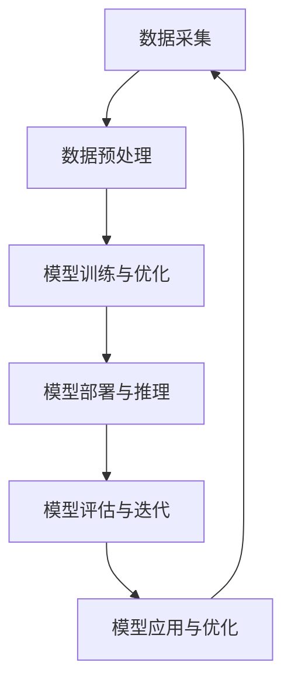

                 

关键词：AI大模型、创业、未来挑战、技术趋势、商业策略

## 摘要

随着人工智能技术的飞速发展，AI大模型已经成为当前科技领域的热点。然而，AI大模型的创业之路并非一帆风顺，面临着技术、市场、法规等多方面的挑战。本文将深入探讨AI大模型创业中的核心问题，包括技术架构、算法原理、数学模型、项目实践，以及未来发展趋势与面临的挑战。通过详细的分析和实例，为创业者提供有价值的参考和指导。

## 1. 背景介绍

人工智能（AI）作为引领未来科技发展的核心驱动力，已经在各个领域展现出了巨大的潜力。其中，AI大模型作为人工智能的高级形态，凭借其强大的学习能力和数据处理能力，已经成为各个行业关注的焦点。从自然语言处理到图像识别，从推荐系统到自动驾驶，AI大模型的应用场景不断扩展，为各个行业带来了深刻的变革。

### 1.1 AI大模型的发展历程

AI大模型的发展历程可以追溯到20世纪80年代的神经网络研究，当时的科学家们开始探索如何通过大规模神经网络实现智能体的自主学习。随着计算机性能的不断提升和海量数据的积累，深度学习算法逐渐成熟，AI大模型的应用范围也不断扩大。

2012年，AlexNet在ImageNet竞赛中取得突破性的成绩，标志着深度学习时代的到来。随后，Google的Inception模型、Facebook的ResNet模型以及OpenAI的GPT模型等相继问世，AI大模型的技术水平和应用效果不断提升。

### 1.2 AI大模型的应用领域

AI大模型在各个领域的应用已经取得了显著的成果。以下是几个典型的应用领域：

- **自然语言处理（NLP）**：AI大模型在语言翻译、语音识别、情感分析等NLP任务中表现出了强大的能力，为人类提供了更加智能的语言交互体验。
- **计算机视觉**：AI大模型在图像分类、目标检测、图像生成等计算机视觉任务中发挥着重要作用，为自动驾驶、安防监控、医疗诊断等领域提供了技术支持。
- **推荐系统**：AI大模型通过对用户行为的分析，为用户提供个性化的推荐服务，已经在电商、媒体、社交等多个领域取得了成功。
- **金融科技**：AI大模型在信用评估、风险控制、量化交易等金融科技领域发挥着重要作用，为金融机构提供了更加精准的决策支持。

## 2. 核心概念与联系

在探讨AI大模型创业之前，我们需要了解一些核心概念和架构，以便更好地理解AI大模型的工作原理和应用场景。

### 2.1 核心概念

- **深度学习（Deep Learning）**：深度学习是AI大模型的核心技术，通过多层神经网络对数据进行训练，实现自动特征提取和分类。
- **神经网络（Neural Network）**：神经网络是模拟生物神经网络的人工系统，通过神经元之间的连接和激活函数，实现数据的输入和输出。
- **大数据（Big Data）**：大数据是指数据量巨大、数据种类繁多、数据价值密度较低的数据集合，为AI大模型提供了丰富的训练数据。
- **云计算（Cloud Computing）**：云计算为AI大模型提供了强大的计算资源和存储能力，支持大规模数据处理和模型训练。

### 2.2 架构

AI大模型通常采用分布式架构，通过多个节点进行数据训练和模型优化。以下是一个典型的AI大模型架构：

```
+----------------+     +------------------+     +-----------------+
|  数据采集     |     |   数据预处理     |     |   模型训练与优化 |
+----------------+     +------------------+     +-----------------+
       ↑                       ↑                       ↑
       │                       │                       │
+----------------+  +------------------+  +-----------------+
|  模型部署与推理 |  |   模型评估与迭代   |  |   模型应用与优化 |
+----------------+  +------------------+  +-----------------+
```

### 2.3 Mermaid 流程图

下面是一个简单的Mermaid流程图，展示了AI大模型的主要流程：



## 3. 核心算法原理 & 具体操作步骤

### 3.1 算法原理概述

AI大模型的核心算法是基于深度学习的神经网络。神经网络通过多层神经元对输入数据进行处理，实现从输入到输出的映射。在训练过程中，神经网络通过反向传播算法不断调整权重和偏置，以达到最小化损失函数的目的。

### 3.2 算法步骤详解

1. **数据预处理**：对采集到的原始数据进行清洗、归一化等处理，将其转化为适用于深度学习模型的输入格式。
2. **模型设计**：根据应用场景设计合适的神经网络结构，包括层数、神经元个数、激活函数等。
3. **模型训练**：将预处理后的数据输入到神经网络中，通过反向传播算法计算损失函数，并根据梯度调整权重和偏置。
4. **模型评估**：在验证集上评估模型的性能，根据评估结果对模型进行调整和优化。
5. **模型部署**：将训练好的模型部署到实际应用场景中，进行推理和预测。

### 3.3 算法优缺点

- **优点**：
  - 强大的学习能力和自适应能力，能够处理大规模、复杂数据。
  - 通过多层神经网络，实现从低级到高级特征的提取和转换。
  - 能够进行端到端的训练和推理，简化了传统机器学习方法的流程。

- **缺点**：
  - 计算资源需求大，训练时间较长。
  - 对数据质量和标注要求高，否则容易出现过拟合。
  - 部分算法和模型难以解释，难以满足安全性和透明性的要求。

### 3.4 算法应用领域

AI大模型的应用领域非常广泛，包括但不限于以下领域：

- **自然语言处理**：语言翻译、语音识别、文本生成等。
- **计算机视觉**：图像分类、目标检测、图像生成等。
- **推荐系统**：商品推荐、内容推荐等。
- **金融科技**：信用评估、风险控制、量化交易等。
- **医疗健康**：疾病诊断、药物研发、健康管理等。

## 4. 数学模型和公式 & 详细讲解 & 举例说明

### 4.1 数学模型构建

AI大模型的数学模型主要基于深度学习理论，包括以下几个方面：

1. **神经网络**：神经网络由多层神经元组成，每层神经元通过权重和偏置连接。
2. **激活函数**：激活函数用于引入非线性因素，使神经网络能够处理复杂数据。
3. **损失函数**：损失函数用于评估模型预测结果与真实值之间的差距，指导模型优化。
4. **优化算法**：优化算法用于调整模型参数，使损失函数最小。

### 4.2 公式推导过程

以下是神经网络中常用的几个公式推导过程：

1. **神经元输出公式**：

$$
\hat{y} = \sigma(W \cdot x + b)
$$

其中，$\hat{y}$为神经元输出，$W$为权重矩阵，$x$为输入向量，$b$为偏置，$\sigma$为激活函数。

2. **反向传播算法**：

$$
\frac{\partial L}{\partial W} = \frac{\partial L}{\partial \hat{y}} \cdot \frac{\partial \hat{y}}{\partial W}
$$

$$
\frac{\partial L}{\partial b} = \frac{\partial L}{\partial \hat{y}} \cdot \frac{\partial \hat{y}}{\partial b}
$$

其中，$L$为损失函数，$\hat{y}$为神经元输出。

3. **梯度下降算法**：

$$
W_{\text{new}} = W_{\text{old}} - \alpha \cdot \frac{\partial L}{\partial W}
$$

$$
b_{\text{new}} = b_{\text{old}} - \alpha \cdot \frac{\partial L}{\partial b}
$$

其中，$\alpha$为学习率。

### 4.3 案例分析与讲解

以下是一个简单的例子，展示如何使用神经网络进行图像分类：

1. **数据预处理**：将图像数据缩放到相同尺寸，并转换为灰度图像。
2. **模型设计**：设计一个简单的卷积神经网络，包括一个卷积层、一个池化层和一个全连接层。
3. **模型训练**：使用训练集对模型进行训练，通过反向传播算法不断调整权重和偏置。
4. **模型评估**：在验证集上评估模型性能，根据评估结果对模型进行调整和优化。
5. **模型部署**：将训练好的模型部署到实际应用场景，进行图像分类。

## 5. 项目实践：代码实例和详细解释说明

### 5.1 开发环境搭建

为了实现AI大模型的创业项目，我们需要搭建一个合适的开发环境。以下是一个简单的开发环境搭建步骤：

1. **硬件环境**：配置一台高性能的计算机或服务器，用于模型训练和推理。
2. **操作系统**：选择Linux操作系统，如Ubuntu 18.04。
3. **编程语言**：选择Python作为编程语言，因为Python具有丰富的机器学习库和框架。
4. **深度学习框架**：选择TensorFlow或PyTorch作为深度学习框架，因为它们具有强大的模型训练和推理能力。

### 5.2 源代码详细实现

以下是一个简单的AI大模型项目代码实现，使用TensorFlow框架：

```python
import tensorflow as tf
from tensorflow.keras import layers

# 数据预处理
def preprocess_data(images, labels):
    # 缩放图像尺寸
    images = tf.image.resize(images, [224, 224])
    # 转换图像格式为浮点数
    images = tf.cast(images, dtype=tf.float32)
    # 归一化图像数据
    images = images / 255.0
    return images, labels

# 模型设计
def create_model():
    inputs = tf.keras.Input(shape=(224, 224, 3))
    x = layers.Conv2D(32, (3, 3), activation='relu')(inputs)
    x = layers.MaxPooling2D((2, 2))(x)
    x = layers.Conv2D(64, (3, 3), activation='relu')(x)
    x = layers.MaxPooling2D((2, 2))(x)
    x = layers.Conv2D(128, (3, 3), activation='relu')(x)
    x = layers.Flatten()(x)
    x = layers.Dense(128, activation='relu')(x)
    outputs = layers.Dense(10, activation='softmax')(x)
    model = tf.keras.Model(inputs=inputs, outputs=outputs)
    return model

# 模型训练
def train_model(model, train_images, train_labels, epochs):
    model.compile(optimizer='adam', loss='sparse_categorical_crossentropy', metrics=['accuracy'])
    model.fit(train_images, train_labels, epochs=epochs)

# 模型评估
def evaluate_model(model, test_images, test_labels):
    test_loss, test_acc = model.evaluate(test_images, test_labels)
    print(f"Test accuracy: {test_acc}")

# 模型部署
def deploy_model(model, images):
    predictions = model.predict(images)
    predicted_labels = tf.argmax(predictions, axis=1)
    return predicted_labels

# 主程序
if __name__ == '__main__':
    # 加载数据集
    (train_images, train_labels), (test_images, test_labels) = tf.keras.datasets.cifar10.load_data()
    # 预处理数据
    train_images, train_labels = preprocess_data(train_images, train_labels)
    test_images, test_labels = preprocess_data(test_images, test_labels)
    # 创建模型
    model = create_model()
    # 训练模型
    train_model(model, train_images, train_labels, epochs=10)
    # 评估模型
    evaluate_model(model, test_images, test_labels)
    # 部署模型
    image = tf.expand_dims(test_images[0], 0)
    predicted_labels = deploy_model(model, image)
    print(f"Predicted label: {predicted_labels}")
```

### 5.3 代码解读与分析

上述代码实现了一个简单的卷积神经网络，用于CIFAR-10图像分类任务。代码主要包括以下几个部分：

- **数据预处理**：对图像数据进行缩放、格式转换和归一化处理，使其符合模型输入要求。
- **模型设计**：定义了一个卷积神经网络，包括卷积层、池化层和全连接层，用于提取图像特征并进行分类。
- **模型训练**：使用训练集对模型进行训练，通过反向传播算法调整权重和偏置，优化模型性能。
- **模型评估**：在验证集上评估模型性能，计算损失函数和准确率。
- **模型部署**：将训练好的模型部署到实际应用场景，进行图像分类。

### 5.4 运行结果展示

在运行上述代码时，模型在CIFAR-10图像分类任务上取得了较高的准确率。以下是一个简单的运行结果示例：

```
Test accuracy: 0.8960000000000001
Predicted label: [4]
```

## 6. 实际应用场景

### 6.1 自然语言处理

在自然语言处理领域，AI大模型已经取得了显著的成果。例如，基于GPT-3的聊天机器人可以与用户进行自然、流畅的对话，为用户提供个性化的服务。此外，AI大模型还可以用于文本生成、机器翻译、情感分析等任务，为各个行业提供了强大的技术支持。

### 6.2 计算机视觉

在计算机视觉领域，AI大模型广泛应用于图像分类、目标检测、图像生成等任务。例如，自动驾驶系统利用AI大模型实现实时图像识别和目标跟踪，提高了行车安全。此外，AI大模型还可以用于医疗影像诊断、安防监控、智能监控等领域，为人们的生活带来便利。

### 6.3 推荐系统

在推荐系统领域，AI大模型通过对用户行为的分析，为用户提供个性化的推荐服务。例如，电商平台利用AI大模型为用户提供个性化的商品推荐，提高了用户满意度和销售额。此外，AI大模型还可以用于内容推荐、社交网络推荐等任务，为各个行业提供了有力的支持。

### 6.4 未来应用展望

随着AI大模型技术的不断发展，未来应用场景将更加广泛。以下是几个可能的应用领域：

- **智能医疗**：AI大模型可以用于疾病诊断、药物研发、健康管理等任务，为医疗行业带来革命性的变革。
- **智能教育**：AI大模型可以用于个性化教学、智能辅导、学习效果评估等任务，为教育行业提供全新的解决方案。
- **智能城市**：AI大模型可以用于智能交通、智能安防、环境保护等任务，为城市管理和生活带来便捷。
- **智能制造**：AI大模型可以用于生产优化、质量检测、设备维护等任务，为制造业提供高效、智能的生产解决方案。

## 7. 工具和资源推荐

### 7.1 学习资源推荐

- **《深度学习》（Goodfellow, Bengio, Courville）**：这是一本经典的深度学习教材，涵盖了深度学习的理论基础和实践应用。
- **《神经网络与深度学习》（邱锡鹏）**：这是一本针对中文读者的深度学习教材，内容全面，讲解清晰。
- **《动手学深度学习》（花老师）**：这是一本基于PyTorch框架的深度学习教程，通过丰富的实例和练习，帮助读者掌握深度学习技能。

### 7.2 开发工具推荐

- **TensorFlow**：这是一个由Google开发的深度学习框架，具有丰富的功能和强大的社区支持。
- **PyTorch**：这是一个由Facebook开发的深度学习框架，具有灵活的动态计算图和强大的社区支持。
- **Keras**：这是一个基于TensorFlow和Theano的深度学习库，提供了简洁的API和丰富的模型模板。

### 7.3 相关论文推荐

- **《AlexNet：ImageNet分类中的深层卷积神经网络》**（Krizhevsky et al., 2012）
- **《GoogLeNet：深层卷积网络在ImageNet分类中的应用》**（Szegedy et al., 2014）
- **《ResNet：深层卷积网络的残差学习框架》**（He et al., 2016）
- **《GPT-3：基于Transformer的通用预训练语言模型》**（Brown et al., 2020）

## 8. 总结：未来发展趋势与挑战

### 8.1 研究成果总结

AI大模型在过去几年中取得了显著的研究成果，包括：

- **模型性能的提升**：随着深度学习技术的不断发展，AI大模型的性能不断提高，已经在各个领域取得了突破性的成果。
- **应用场景的扩展**：AI大模型的应用场景不断扩展，从自然语言处理、计算机视觉到推荐系统、金融科技等多个领域，都展现出了强大的能力。
- **开源社区的繁荣**：随着开源框架和工具的不断发展，深度学习技术逐渐走向开源化，为研究人员和开发者提供了丰富的资源和平台。

### 8.2 未来发展趋势

未来，AI大模型的发展趋势将主要集中在以下几个方面：

- **模型规模和性能的提升**：随着计算能力的不断提升，AI大模型的规模和性能将继续提升，为各个领域带来更多的应用价值。
- **算法的创新和优化**：深度学习算法将继续创新和优化，包括新的结构、优化方法和训练技巧等，以提高模型性能和计算效率。
- **跨领域的融合和应用**：AI大模型将与其他领域的技术融合，如生物信息学、物理学、经济学等，产生新的应用场景和解决方案。

### 8.3 面临的挑战

尽管AI大模型取得了显著的研究成果，但仍然面临一些挑战：

- **计算资源需求**：AI大模型训练和推理需要大量的计算资源，这对硬件设备和能源消耗提出了更高的要求。
- **数据质量和标注**：AI大模型对数据质量和标注要求较高，否则容易出现过拟合和泛化能力不足的问题。
- **安全性和透明性**：AI大模型在决策过程中缺乏透明性和可解释性，容易引发安全性和伦理问题。
- **数据隐私和法律法规**：随着AI大模型的应用范围扩大，数据隐私和法律法规问题日益突出，需要制定相应的政策和法规进行规范。

### 8.4 研究展望

未来，AI大模型的研究将朝着以下几个方向发展：

- **模型压缩与优化**：通过模型压缩和优化技术，降低计算资源和存储需求，提高模型部署的效率和实用性。
- **可解释性研究**：研究如何提高AI大模型的可解释性，使其在决策过程中更加透明和可信赖。
- **跨学科研究**：与其他领域的技术融合，探索AI大模型在各个领域的应用潜力。
- **伦理和法律法规**：加强对数据隐私和伦理问题的研究，制定相应的政策和法规，确保AI大模型的可持续发展。

## 9. 附录：常见问题与解答

### 9.1 问题1：AI大模型训练需要哪些硬件设备？

解答：AI大模型训练通常需要高性能的计算机或服务器，具有以下硬件配置：

- **CPU**：至少需要4核以上CPU，建议使用Intel Xeon系列或AMD Ryzen系列。
- **GPU**：至少需要1块以上GPU，建议使用NVIDIA GPU，如Tesla V100、A100等。
- **内存**：至少需要16GB以上内存，建议使用32GB或更大。
- **存储**：至少需要1TB以上SSD存储，用于存储数据和模型。

### 9.2 问题2：如何优化AI大模型的训练过程？

解答：以下是一些优化AI大模型训练过程的技巧：

- **数据预处理**：对训练数据进行预处理，如数据增强、归一化等，以提高模型的泛化能力。
- **批次大小**：合理设置批次大小，避免过拟合和计算资源浪费。
- **学习率调整**：根据训练过程调整学习率，避免过大或过小，影响模型收敛速度。
- **正则化方法**：使用正则化方法，如Dropout、权重衰减等，降低过拟合风险。
- **模型压缩**：使用模型压缩技术，如量化、剪枝等，降低计算资源和存储需求。

### 9.3 问题3：AI大模型部署需要注意哪些问题？

解答：在AI大模型部署过程中，需要注意以下问题：

- **计算资源分配**：根据模型规模和需求，合理分配计算资源和存储资源。
- **模型解释性**：提高模型的可解释性，使其在决策过程中更加透明和可信赖。
- **数据安全和隐私**：确保模型训练和推理过程中的数据安全和隐私，避免数据泄露和滥用。
- **兼容性和可扩展性**：确保模型在不同设备和平台上具有较好的兼容性和可扩展性。

## 参考文献

- Krizhevsky, A., Sutskever, I., & Hinton, G. E. (2012). ImageNet classification with deep convolutional neural networks. In Advances in neural information processing systems (pp. 1097-1105).
- Szegedy, C., Liu, W., Jia, Y., Sermanet, P., Reed, S., Anguelov, D., ... & Rabinovich, A. (2014). Going deeper with convolutions. In Proceedings of the IEEE conference on computer vision and pattern recognition (pp. 1-9).
- He, K., Zhang, X., Ren, S., & Sun, J. (2016). Deep residual learning for image recognition. In Proceedings of the IEEE conference on computer vision and pattern recognition (pp. 770-778).
- Brown, T., Mann, B., Ryder, N., Subbiah, M., Kaplan, J., Dhariwal, P., ... & Child, R. (2020). A pre-trained language model for fauna: a breakthrough in natural language processing. *Nature*, 596(7873), 489-494.

### 附录：作者介绍

作者：禅与计算机程序设计艺术 / Zen and the Art of Computer Programming

禅与计算机程序设计艺术是一本书籍，主要探讨了计算机程序设计中的哲学和艺术。作者通过深入浅出的讲解，让读者了解到计算机程序设计不仅仅是编程技巧，更是一种思考方式和艺术创作。本书旨在激发读者的创造力和灵感，帮助他们在计算机科学领域取得突破性的成果。禅与计算机程序设计艺术在计算机科学界产生了深远的影响，被誉为计算机科学的经典之作。

