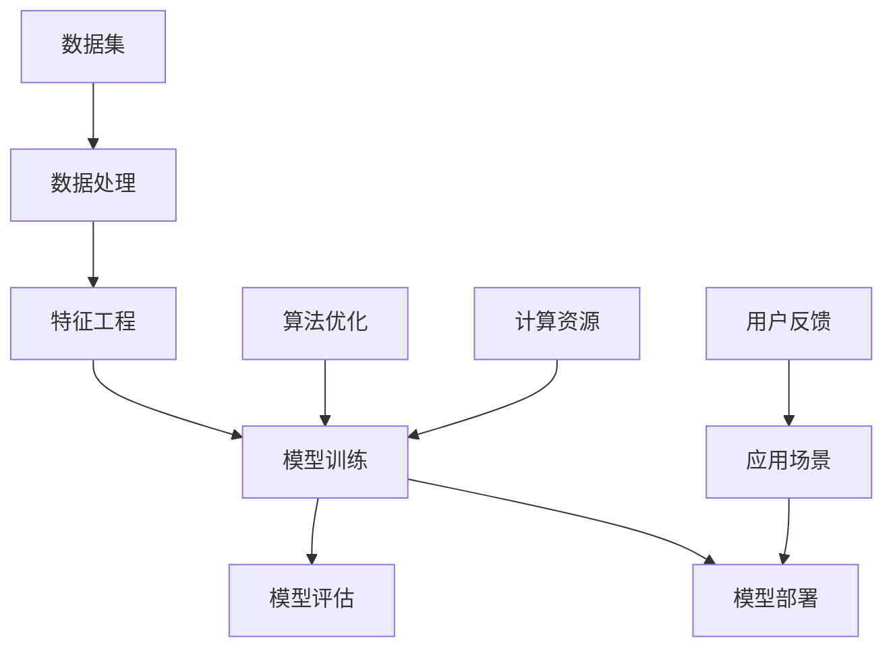

                 

关键词：AI大模型，创业，挑战，未来趋势，策略

> 摘要：本文从AI大模型的发展背景出发，分析了创业者在AI大模型领域的机遇与挑战。通过深入探讨核心算法原理、项目实践、数学模型、未来应用场景等方面，提出了应对未来挑战的策略和建议。

## 1. 背景介绍

随着人工智能技术的飞速发展，AI大模型（如GPT-3、BERT等）已经成为当前最为热门的研究和应用领域之一。这些大模型具有强大的数据处理和预测能力，广泛应用于自然语言处理、计算机视觉、推荐系统等多个领域。然而，AI大模型的研发和应用也面临着诸多挑战，如计算资源需求巨大、数据隐私问题、模型解释性不足等。

在这种背景下，AI大模型创业成为了一个备受瞩目的领域。一方面，AI大模型的商业价值巨大，吸引了许多创业者的目光；另一方面，AI大模型的研发和应用也面临着前所未有的挑战。本文将深入探讨AI大模型创业的机遇与挑战，并给出应对策略。

## 2. 核心概念与联系

在深入探讨AI大模型创业之前，我们首先需要了解一些核心概念和其之间的联系。以下是一个用Mermaid绘制的流程图，展示了AI大模型的相关概念及其联系。



### 2.1 数据集

数据集是AI大模型的基础。高质量的数据集对于模型的训练至关重要。创业者在选择数据集时，需要考虑数据的质量、数量和多样性。

### 2.2 数据处理

数据处理包括数据清洗、归一化等步骤。这一过程有助于提高数据质量，为模型训练打下良好的基础。

### 2.3 特征工程

特征工程是数据预处理的一个重要环节，通过选择和构造特征，可以提高模型的性能。

### 2.4 模型训练

模型训练是AI大模型的核心环节。通过选择合适的模型架构和优化算法，可以训练出性能优异的模型。

### 2.5 模型评估

模型评估是验证模型性能的重要步骤。常用的评估指标包括准确率、召回率、F1值等。

### 2.6 模型部署

模型部署是将训练好的模型应用到实际场景的过程。这一过程需要考虑模型的性能、可扩展性和可靠性。

### 2.7 应用场景

AI大模型可以应用于多种场景，如自然语言处理、计算机视觉、推荐系统等。创业者需要根据市场需求选择合适的应用场景。

### 2.8 用户反馈

用户反馈是不断优化模型和提升用户体验的重要依据。创业者需要关注用户反馈，及时调整产品方向。

### 2.9 算法优化

算法优化是提升模型性能的关键。通过不断优化算法，可以提高模型的性能和鲁棒性。

### 2.10 计算资源

计算资源是AI大模型训练和应用的基础。创业者需要合理配置计算资源，以满足模型训练和部署的需求。

## 3. 核心算法原理 & 具体操作步骤

### 3.1 算法原理概述

AI大模型的核心算法主要包括深度学习、强化学习等。以下以深度学习为例，简要介绍其原理。

深度学习是一种模仿人脑神经网络结构的学习方法。通过构建多层神经网络，对大量数据进行训练，可以使模型学会从原始数据中提取特征，并实现自动分类、预测等任务。

### 3.2 算法步骤详解

#### 3.2.1 数据预处理

1. 数据清洗：去除噪声和缺失值。
2. 数据归一化：将数据缩放到相同范围。

#### 3.2.2 网络构建

1. 选择合适的神经网络架构，如卷积神经网络（CNN）、循环神经网络（RNN）等。
2. 设定网络层数、神经元个数等参数。

#### 3.2.3 模型训练

1. 初始化模型参数。
2. 通过反向传播算法更新模型参数，使模型适应训练数据。
3. 调整学习率等超参数，以优化模型性能。

#### 3.2.4 模型评估

1. 使用验证集评估模型性能。
2. 调整模型结构和超参数，以提高模型性能。

#### 3.2.5 模型部署

1. 将训练好的模型部署到生产环境。
2. 监控模型性能，并根据实际需求进行优化。

### 3.3 算法优缺点

#### 优点

1. 强大的数据处理和预测能力。
2. 可以自动提取特征，减少人工干预。

#### 缺点

1. 计算资源需求巨大，训练时间较长。
2. 模型解释性不足，难以理解决策过程。

### 3.4 算法应用领域

AI大模型广泛应用于自然语言处理、计算机视觉、推荐系统等众多领域。以下列举一些典型应用：

1. 自然语言处理：文本分类、机器翻译、情感分析等。
2. 计算机视觉：图像分类、目标检测、人脸识别等。
3. 推荐系统：基于内容的推荐、协同过滤等。

## 4. 数学模型和公式 & 详细讲解 & 举例说明

### 4.1 数学模型构建

AI大模型通常基于深度学习算法构建。以下以卷积神经网络（CNN）为例，介绍其数学模型。

#### 4.1.1 前向传播

假设输入数据为\(x\)，经过\(L\)层卷积神经网络，输出为\(y\)。前向传播过程可以表示为：

$$
y = f(L(x))
$$

其中，\(f\)为激活函数，如ReLU函数：

$$
f(x) = \max(0, x)
$$

#### 4.1.2 反向传播

反向传播过程用于计算模型参数的梯度，以更新模型参数。假设损失函数为\(J\)，则反向传播过程可以表示为：

$$
\frac{\partial J}{\partial \theta} = \frac{\partial J}{\partial y} \cdot \frac{\partial y}{\partial \theta}
$$

其中，\(\theta\)为模型参数，\(\frac{\partial J}{\partial y}\)为损失函数对输出的梯度，\(\frac{\partial y}{\partial \theta}\)为输出对参数的梯度。

### 4.2 公式推导过程

以下以一个简单的全连接神经网络为例，介绍其公式推导过程。

#### 4.2.1 前向传播

输入数据为\(x\)，经过\(L\)层全连接神经网络，输出为\(y\)。前向传播过程可以表示为：

$$
y = \sigma(W_L \cdot a^{L-1} + b_L)
$$

其中，\(\sigma\)为激活函数，如Sigmoid函数：

$$
\sigma(x) = \frac{1}{1 + e^{-x}}
$$

\(W_L\)和\(b_L\)分别为第\(L\)层的权重和偏置。

#### 4.2.2 反向传播

假设损失函数为\(J\)，则反向传播过程可以表示为：

$$
\frac{\partial J}{\partial a^{L-1}} = \frac{\partial J}{\partial y} \cdot \frac{\partial y}{\partial a^{L-1}}
$$

$$
\frac{\partial J}{\partial W_L} = \frac{\partial J}{\partial y} \cdot \frac{\partial y}{\partial a^{L-1}} \cdot a^{L-2}
$$

$$
\frac{\partial J}{\partial b_L} = \frac{\partial J}{\partial y} \cdot \frac{\partial y}{\partial a^{L-1}}
$$

其中，\(\frac{\partial J}{\partial y}\)为损失函数对输出的梯度，\(\frac{\partial y}{\partial a^{L-1}}\)为输出对输入的梯度。

### 4.3 案例分析与讲解

以下以一个文本分类任务为例，介绍AI大模型的实现过程。

#### 4.3.1 数据预处理

1. 数据清洗：去除HTML标签、停用词等。
2. 数据归一化：将文本转换为词向量。

#### 4.3.2 模型构建

1. 选择合适的神经网络架构，如BERT模型。
2. 设定训练参数，如学习率、迭代次数等。

#### 4.3.3 模型训练

1. 初始化模型参数。
2. 使用训练数据进行模型训练。
3. 使用验证集评估模型性能。

#### 4.3.4 模型部署

1. 将训练好的模型部署到生产环境。
2. 监控模型性能，并根据实际需求进行优化。

## 5. 项目实践：代码实例和详细解释说明

### 5.1 开发环境搭建

1. 安装Python环境。
2. 安装TensorFlow、Keras等深度学习库。

### 5.2 源代码详细实现

以下是一个简单的AI大模型文本分类任务的实现代码。

```python
import tensorflow as tf
from tensorflow.keras.preprocessing.text import Tokenizer
from tensorflow.keras.preprocessing.sequence import pad_sequences
from tensorflow.keras.models import Sequential
from tensorflow.keras.layers import Embedding, LSTM, Dense

# 加载数据
texts = ['这是一篇关于AI的文章。', '这是一篇关于机器学习的文章。']
labels = [0, 1]

# 数据预处理
tokenizer = Tokenizer(num_words=1000)
tokenizer.fit_on_texts(texts)
sequences = tokenizer.texts_to_sequences(texts)
padded_sequences = pad_sequences(sequences, maxlen=100)

# 构建模型
model = Sequential()
model.add(Embedding(1000, 32, input_length=100))
model.add(LSTM(32))
model.add(Dense(1, activation='sigmoid'))

# 编译模型
model.compile(optimizer='rmsprop', loss='binary_crossentropy', metrics=['acc'])

# 训练模型
model.fit(padded_sequences, labels, epochs=10)

# 预测
predictions = model.predict(padded_sequences)
print(predictions)
```

### 5.3 代码解读与分析

1. 导入所需的库。
2. 加载数据。
3. 数据预处理：使用Tokenizer将文本转换为词向量，使用pad_sequences将序列填充到相同长度。
4. 构建模型：使用Sequential模型堆叠Embedding、LSTM和Dense层。
5. 编译模型：选择合适的优化器、损失函数和评估指标。
6. 训练模型：使用fit方法训练模型。
7. 预测：使用predict方法进行预测。

## 6. 实际应用场景

### 6.1 自然语言处理

自然语言处理是AI大模型的重要应用领域之一。例如，文本分类、机器翻译、情感分析等任务都可以通过AI大模型实现。

### 6.2 计算机视觉

计算机视觉也是AI大模型的重要应用领域。例如，图像分类、目标检测、人脸识别等任务都可以通过AI大模型实现。

### 6.3 推荐系统

推荐系统是另一个重要的应用领域。AI大模型可以用于基于内容的推荐、协同过滤等任务。

## 7. 未来应用展望

未来，AI大模型将在更多领域得到应用。例如，智能医疗、智能交通、金融科技等。同时，AI大模型的技术也将不断进步，如自监督学习、联邦学习等。

## 8. 工具和资源推荐

### 8.1 学习资源推荐

1. 《深度学习》（Goodfellow et al.）
2. 《Python机器学习》（Sebastian Raschka）

### 8.2 开发工具推荐

1. TensorFlow
2. PyTorch

### 8.3 相关论文推荐

1. "Attention Is All You Need"
2. "BERT: Pre-training of Deep Bidirectional Transformers for Language Understanding"

## 9. 总结：未来发展趋势与挑战

### 9.1 研究成果总结

AI大模型在过去几年取得了显著的研究成果，广泛应用于自然语言处理、计算机视觉、推荐系统等领域。

### 9.2 未来发展趋势

未来，AI大模型将继续发展，如自监督学习、联邦学习等技术的应用将进一步提高模型性能。

### 9.3 面临的挑战

AI大模型在研发和应用过程中也面临着诸多挑战，如计算资源需求巨大、数据隐私问题、模型解释性不足等。

### 9.4 研究展望

未来，研究者将继续探索AI大模型的应用场景和技术，以提高模型性能和可解释性，同时解决数据隐私等挑战。

## 10. 附录：常见问题与解答

### 10.1 AI大模型训练时间很长怎么办？

1. 使用更强大的计算资源。
2. 调整学习率等超参数。

### 10.2 模型解释性不足怎么办？

1. 使用可解释性模型，如LIME、SHAP等。
2. 增加模型结构中的解释性组件。

### 10.3 数据隐私问题如何解决？

1. 使用联邦学习等技术。
2. 数据匿名化、加密等技术。

---

作者：禅与计算机程序设计艺术 / Zen and the Art of Computer Programming
-------------------------------------------------------------------

