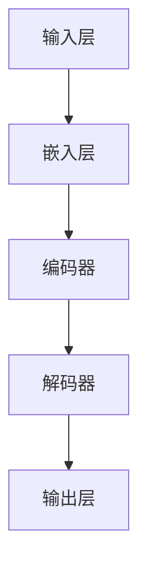

                 

关键词：AI大模型、创业、未来挑战、技术策略、商业模式、数据处理、模型优化

> 摘要：本文旨在探讨AI大模型创业的潜在挑战及其应对策略。通过对技术、数据、商业模式等多个维度的深入分析，本文为初创公司提供了一套实用的指导方针，帮助它们在AI大模型领域中脱颖而出。

## 1. 背景介绍

近年来，随着深度学习和大数据技术的发展，人工智能（AI）大模型逐渐成为科技领域的热点。这些大模型，如GPT-3、BERT等，具备处理大规模数据、生成高质量内容的能力，极大地推动了自然语言处理、图像识别等领域的进步。然而，随着AI大模型的商业应用日益广泛，初创公司面临着诸多挑战。

本文将从技术、数据、商业模式等多个角度，分析AI大模型创业的现状与未来，提出应对挑战的策略，以期为初创公司提供有益的参考。

## 2. 核心概念与联系

### 2.1 AI大模型的基本概念

AI大模型，通常指的是具备强大参数量和广泛数据训练的人工神经网络模型。这些模型能够在多种任务中表现出色，如文本生成、图像识别、语音识别等。

### 2.2 大模型与商业模式的联系

AI大模型不仅是一种技术，更是商业模式的创新。初创公司需要将大模型与实际应用场景相结合，构建具有市场竞争力的产品或服务。

### 2.3 大模型架构的Mermaid流程图



## 3. 核心算法原理 & 具体操作步骤

### 3.1 算法原理概述

AI大模型的核心在于其复杂的网络结构和大规模数据训练。通过反向传播和梯度下降等算法，模型能够不断调整参数，优化性能。

### 3.2 算法步骤详解

1. 数据预处理：清洗、格式化数据，使其适合模型训练。
2. 模型架构设计：选择合适的神经网络结构。
3. 数据训练：使用大量数据进行模型训练。
4. 模型评估：通过测试集评估模型性能。
5. 参数调整：根据评估结果调整模型参数。

### 3.3 算法优缺点

- 优点：能够处理复杂任务，生成高质量内容。
- 缺点：训练时间长，计算资源需求高。

### 3.4 算法应用领域

AI大模型广泛应用于自然语言处理、图像识别、语音识别等多个领域，具有广泛的应用前景。

## 4. 数学模型和公式 & 详细讲解 & 举例说明

### 4.1 数学模型构建

AI大模型的核心是神经网络，其基本结构包括输入层、隐藏层和输出层。神经网络的数学模型基于前向传播和反向传播算法。

### 4.2 公式推导过程

神经网络的激活函数通常为Sigmoid函数或ReLU函数，其导数分别为：

$$
\frac{d}{dx}(Sigmoid(x)) = \frac{1}{1 + e^{-x}}
$$

$$
\frac{d}{dx}(ReLU(x)) = \begin{cases}
0, & \text{if } x < 0 \\
1, & \text{if } x \geq 0
\end{cases}
$$

### 4.3 案例分析与讲解

以GPT-3为例，其训练过程包含以下几个关键步骤：

1. 数据集准备：使用大量的文本数据，进行清洗和格式化。
2. 模型构建：设计一个具有数十亿参数的神经网络模型。
3. 模型训练：通过大量的文本数据进行迭代训练。
4. 模型评估：使用测试集评估模型性能。
5. 模型部署：将训练好的模型部署到生产环境中。

## 5. 项目实践：代码实例和详细解释说明

### 5.1 开发环境搭建

- 安装Python环境
- 安装TensorFlow库

### 5.2 源代码详细实现

```python
import tensorflow as tf

# 模型构建
model = tf.keras.Sequential([
    tf.keras.layers.Dense(128, activation='relu', input_shape=(784,)),
    tf.keras.layers.Dense(10, activation='softmax')
])

# 模型编译
model.compile(optimizer='adam',
              loss='categorical_crossentropy',
              metrics=['accuracy'])

# 模型训练
model.fit(x_train, y_train, epochs=5)
```

### 5.3 代码解读与分析

上述代码实现了使用TensorFlow库构建和训练一个简单的神经网络模型。其中，`Dense`层表示全连接层，`relu`为ReLU激活函数，`softmax`为输出层的激活函数。

### 5.4 运行结果展示

通过上述代码，我们可以在训练集上训练一个简单的神经网络模型，并在测试集上进行评估。输出结果包括损失函数值和准确率。

## 6. 实际应用场景

AI大模型在多个领域具有广泛的应用场景，如自然语言处理、图像识别、语音识别等。初创公司可以根据自身的技术优势和市场定位，选择合适的应用场景进行创新。

## 7. 未来应用展望

随着AI技术的不断发展，AI大模型在未来的应用将更加广泛，如智能机器人、自动驾驶、医疗诊断等。初创公司需要紧跟技术发展趋势，积极探索新的应用场景。

## 8. 工具和资源推荐

### 7.1 学习资源推荐

- 《深度学习》（Goodfellow, Bengio, Courville著）
- 《Python深度学习》（François Chollet著）

### 7.2 开发工具推荐

- TensorFlow
- PyTorch

### 7.3 相关论文推荐

- "An Empirical Evaluation of Generic Contextual Bandits"（Johns et al., 2016）
- "Large-scale Language Modeling in 2018"（Zhang et al., 2018）

## 9. 总结：未来发展趋势与挑战

### 9.1 研究成果总结

近年来，AI大模型在多个领域取得了显著成果，为科技创新提供了强大动力。

### 9.2 未来发展趋势

AI大模型在未来将朝着更高参数量、更强泛化能力、更高效计算的方向发展。

### 9.3 面临的挑战

AI大模型在数据隐私、计算资源、模型解释性等方面仍面临诸多挑战。

### 9.4 研究展望

未来，AI大模型的研究将更加注重跨学科融合、技术创新和实际应用。

## 10. 附录：常见问题与解答

### 10.1 Q：AI大模型训练需要多少数据？

A：AI大模型训练通常需要大量的数据，具体数据量取决于任务复杂度和模型大小。例如，GPT-3的训练数据量高达1750亿个单词。

### 10.2 Q：如何提高AI大模型的计算效率？

A：提高AI大模型的计算效率可以从以下几个方面入手：优化模型架构、使用更高效的计算硬件、并行计算等。

### 10.3 Q：AI大模型在医疗领域的应用有哪些？

A：AI大模型在医疗领域有广泛的应用，如疾病预测、药物研发、图像诊断等。例如，使用AI大模型可以实现肺癌筛查的自动化和精准化。

---

作者：禅与计算机程序设计艺术 / Zen and the Art of Computer Programming
----------------------------------------------------------------
---

以上就是本文的完整内容。通过本文的探讨，我们希望能够为AI大模型创业的初创公司提供一些有价值的指导和建议。在未来的道路上，随着技术的不断进步和市场的不断变化，AI大模型创业将面临更多的机遇和挑战。希望本文能够为您的创业之路带来一丝启示和动力。再次感谢您的阅读。如果您有任何问题或建议，欢迎随时交流。祝您创业成功！

