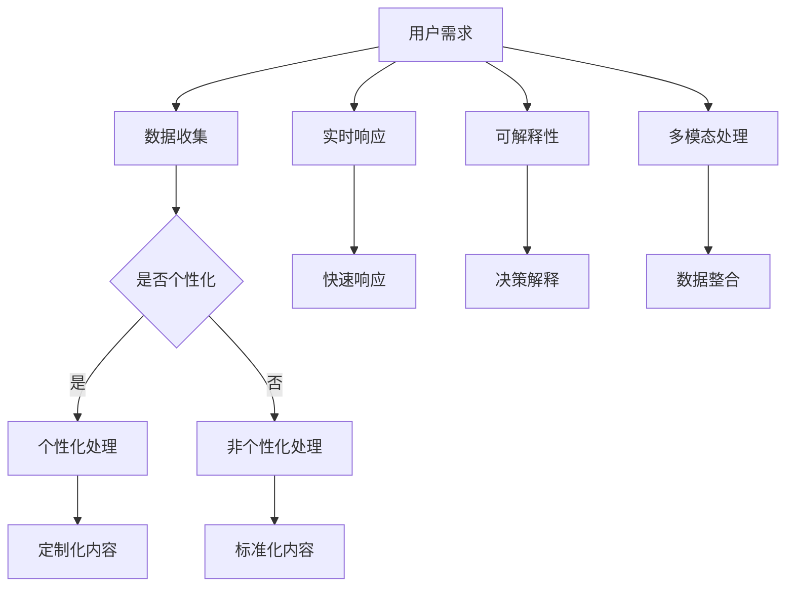

                 

关键词：AI大模型、创业、用户需求、技术策略、未来展望

> 摘要：本文将探讨AI大模型创业过程中如何应对未来用户需求。通过深入分析大模型的特性、用户行为趋势以及技术挑战，提出一系列策略和建议，旨在帮助创业公司在这片竞争激烈的新兴市场中脱颖而出。

## 1. 背景介绍

随着人工智能（AI）技术的飞速发展，大模型（如GPT、BERT等）已经成为了当前AI领域的热门话题。大模型具备处理大规模数据、生成高质量内容、实现高级任务执行等能力，使得其在多个领域得到了广泛应用。从自然语言处理到图像识别，从语音合成到决策支持系统，大模型正逐渐成为推动行业进步的关键力量。

在这种背景下，许多创业者纷纷投身于AI大模型领域，希望抓住这一历史性机遇。然而，面对日新月异的技术发展和不断变化的市场需求，如何有效地应对未来用户需求，成为了一个亟待解决的问题。

本文将围绕以下核心问题展开讨论：

- AI大模型创业的主要驱动力是什么？
- 创业公司如何分析并预测未来用户需求？
- 创业公司在AI大模型开发过程中可能面临哪些技术挑战？
- 创业公司应采取哪些策略来应对这些挑战，并满足未来用户需求？

通过对上述问题的深入探讨，本文旨在为AI大模型创业公司提供实用的指导和建议，帮助它们在激烈的市场竞争中站稳脚跟。

## 2. 核心概念与联系

### 大模型的特性

大模型，顾名思义，是指那些拥有海量参数、能够处理大规模数据的AI模型。其核心特性包括：

- **高维度特征表示**：大模型能够通过深度神经网络提取数据中的高维度特征，这使得它们在处理复杂数据时具备更强的能力。
- **强大的泛化能力**：大模型通过训练大量数据，能够学会在不同情境下执行各种任务，从而实现良好的泛化效果。
- **高计算成本**：由于参数数量庞大，大模型的训练和推理过程通常需要大量的计算资源，这对硬件和软件架构提出了较高的要求。

### 用户行为趋势

随着AI技术的发展，用户对AI大模型的需求也呈现出一些明显的趋势：

- **个性化体验**：用户越来越希望AI系统能够根据其个人喜好和行为习惯提供定制化的服务。
- **实时响应**：用户对AI系统的响应速度有更高要求，尤其是在与人类交互的场景中。
- **可解释性**：用户希望了解AI系统的决策过程，增强对系统的信任。
- **多模态处理**：用户需求不再局限于单一数据类型，如文本、图像和语音等多模态数据处理能力成为了必要条件。

### 大模型与用户需求的联系

大模型与用户需求之间的联系主要体现在以下几个方面：

- **个性化服务**：大模型能够通过学习用户数据，提供高度个性化的内容和服务，从而提升用户体验。
- **实时智能交互**：大模型的强大计算能力使得它们能够快速响应用户的请求，实现实时智能交互。
- **辅助决策**：大模型可以通过分析和处理海量数据，为用户做出更明智的决策提供支持。
- **跨模态整合**：大模型的多模态处理能力使得系统能够整合不同类型的数据，为用户提供更全面的服务。

### Mermaid 流程图

以下是一个关于AI大模型与用户需求联系的Mermaid流程图：



## 3. 核心算法原理 & 具体操作步骤

### 3.1 算法原理概述

AI大模型的算法原理主要基于深度学习和自然语言处理（NLP）技术。深度学习通过多层神经网络对数据进行学习，从而提取数据中的高维度特征。在NLP领域，常见的深度学习模型包括循环神经网络（RNN）、长短期记忆网络（LSTM）和Transformer等。

- **Transformer模型**：Transformer模型是由Vaswani等人于2017年提出的一种基于注意力机制的深度学习模型。它通过自注意力机制和多头注意力机制，能够有效地处理长距离依赖问题，成为当前NLP领域的主流模型。

### 3.2 算法步骤详解

以下是一个基于Transformer模型的AI大模型的训练和推理过程：

#### 训练过程：

1. **数据预处理**：对原始文本数据进行清洗、分词和编码，将文本转换为模型可处理的序列数据。
2. **模型初始化**：初始化Transformer模型参数。
3. **正向传播**：将编码后的文本序列输入模型，通过自注意力机制和多头注意力机制计算输出。
4. **损失函数计算**：使用交叉熵损失函数计算预测结果与真实结果之间的差距。
5. **反向传播**：更新模型参数，减小损失函数值。
6. **迭代训练**：重复执行正向传播、损失函数计算和反向传播，直到满足训练条件（如达到预设的训练轮数或损失函数值低于某一阈值）。

#### 推理过程：

1. **数据预处理**：与训练过程相同，对输入文本进行预处理。
2. **模型输入**：将预处理后的文本序列输入已经训练好的模型。
3. **自注意力机制和多头注意力机制计算**：通过自注意力机制和多头注意力机制计算输出。
4. **输出结果**：输出模型的预测结果，如文本分类、情感分析等。

### 3.3 算法优缺点

#### 优点：

- **强大的特征提取能力**：通过多层神经网络和注意力机制，大模型能够提取数据中的高维度特征，从而提高模型的性能。
- **良好的泛化能力**：大模型通过训练大量数据，能够学会在不同情境下执行各种任务，从而实现良好的泛化效果。
- **多任务处理能力**：大模型可以通过共享参数和模块，实现多任务处理，从而提高模型的效率。

#### 缺点：

- **高计算成本**：大模型的训练和推理过程需要大量的计算资源，对硬件和软件架构提出了较高的要求。
- **数据依赖性**：大模型的性能很大程度上依赖于训练数据的质量和数量，如果数据存在偏差或噪声，可能会影响模型的性能。
- **可解释性较差**：大模型的内部结构复杂，难以解释其具体的决策过程，这在某些需要高度可解释性的场景中可能成为一个问题。

### 3.4 算法应用领域

AI大模型在多个领域得到了广泛应用，主要包括：

- **自然语言处理**：如文本分类、情感分析、机器翻译等。
- **计算机视觉**：如图像识别、物体检测、图像生成等。
- **语音识别**：如语音转文本、语音识别等。
- **决策支持系统**：如金融风险评估、医疗诊断、智能客服等。

## 4. 数学模型和公式 & 详细讲解 & 举例说明

### 4.1 数学模型构建

AI大模型的数学模型主要基于深度学习和自然语言处理技术。以下是一个简化的数学模型构建过程：

#### 前向传播

$$
\text{输出} = \text{模型}(\text{输入}, \text{参数})
$$

其中，输入为编码后的文本序列，参数为模型中的权重和偏置。模型通常由多层神经网络构成，每层神经网络的输出作为下一层的输入。

#### 损失函数

$$
L(\theta) = -\sum_{i=1}^{N} y_i \log p(x_i|\theta)
$$

其中，$L(\theta)$为损失函数，$y_i$为真实标签，$p(x_i|\theta)$为模型对输入$x_i$的预测概率。常见的损失函数包括交叉熵损失函数和均方误差损失函数。

#### 反向传播

$$
\frac{\partial L}{\partial \theta} = \frac{\partial L}{\partial a} \frac{\partial a}{\partial \theta}
$$

其中，$\frac{\partial L}{\partial \theta}$为损失函数关于参数$\theta$的梯度，$\frac{\partial L}{\partial a}$为损失函数关于激活值$a$的梯度，$\frac{\partial a}{\partial \theta}$为激活值关于参数$\theta$的梯度。反向传播算法通过层层传递梯度，更新模型参数，从而减小损失函数值。

### 4.2 公式推导过程

以下是一个简化的交叉熵损失函数的推导过程：

假设模型对输入$x_i$的预测概率为$p_i$，真实标签为$y_i$，则预测概率$p_i$的交叉熵损失为：

$$
L_i = -y_i \log p_i
$$

对于整个数据集，交叉熵损失函数为：

$$
L = \sum_{i=1}^{N} L_i = -\sum_{i=1}^{N} y_i \log p_i
$$

其中，$N$为数据集大小。

### 4.3 案例分析与讲解

以下是一个简单的文本分类案例：

假设我们要对以下两个句子进行分类：

1. “我喜欢这个电影。”
2. “这部电影很差。”

我们将这两个句子转换为编码后的文本序列，然后输入已经训练好的大模型。模型输出两个句子的预测概率，如下所示：

- “我喜欢这个电影。”的预测概率：$p_1 = 0.9$
- “这部电影很差。”的预测概率：$p_2 = 0.1$

根据交叉熵损失函数，我们可以计算出这两个句子的交叉熵损失：

- $L_1 = -y_1 \log p_1 = -1 \log 0.9 \approx 0.15$
- $L_2 = -y_2 \log p_2 = -1 \log 0.1 = 2.3219$

整个数据集的交叉熵损失为：

$$
L = L_1 + L_2 = 0.15 + 2.3219 = 2.4729
$$

通过反向传播算法，我们可以更新模型参数，从而减小交叉熵损失。在多次迭代后，模型的预测概率将逐渐接近真实标签，交叉熵损失将逐渐降低。

## 5. 项目实践：代码实例和详细解释说明

### 5.1 开发环境搭建

为了更好地理解AI大模型的开发过程，我们将使用一个流行的开源框架——Hugging Face的Transformers库。以下是如何搭建开发环境的步骤：

1. **安装Python环境**：确保Python版本在3.6及以上。
2. **安装Hugging Face的Transformers库**：使用pip命令安装：

   ```
   pip install transformers
   ```

3. **安装其他依赖库**：如torch、numpy等。

### 5.2 源代码详细实现

以下是一个简单的文本分类项目的源代码实现：

```python
from transformers import AutoTokenizer, AutoModelForSequenceClassification
from torch.utils.data import DataLoader
from torch.nn import CrossEntropyLoss
import torch

# 加载预训练的模型和分词器
model_name = "bert-base-uncased"
tokenizer = AutoTokenizer.from_pretrained(model_name)
model = AutoModelForSequenceClassification.from_pretrained(model_name, num_labels=2)

# 准备数据集
train_data = [
    "我喜欢这个电影。",
    "这部电影很差。",
    # 更多训练数据...
]
train_labels = [0, 1,  # 0表示正面，1表示负面...
]

# 编码数据集
encoding = tokenizer(train_data, padding=True, truncation=True, return_tensors="pt")
input_ids = encoding["input_ids"]
attention_mask = encoding["attention_mask"]
labels = torch.tensor(train_labels)

# 创建数据加载器
train_dataloader = DataLoader(train_data, batch_size=2, shuffle=True)

# 训练模型
optimizer = torch.optim.AdamW(model.parameters(), lr=1e-5)
loss_function = CrossEntropyLoss()

device = torch.device("cuda" if torch.cuda.is_available() else "cpu")
model.to(device)

for epoch in range(3):  # 训练3个epoch
    model.train()
    for batch in train_dataloader:
        inputs = {
            "input_ids": batch["input_ids"].to(device),
            "attention_mask": batch["attention_mask"].to(device),
        }
        labels = batch["labels"].to(device)

        outputs = model(**inputs)
        loss = loss_function(outputs.logits, labels)

        optimizer.zero_grad()
        loss.backward()
        optimizer.step()

        print(f"Epoch: {epoch+1}, Loss: {loss.item()}")

# 评估模型
model.eval()
with torch.no_grad():
    for batch in train_dataloader:
        inputs = {
            "input_ids": batch["input_ids"].to(device),
            "attention_mask": batch["attention_mask"].to(device),
        }
        outputs = model(**inputs)
        logits = outputs.logits
        predicted_labels = logits.argmax(-1)
        print(f"Predicted Labels: {predicted_labels.tolist()}, True Labels: {batch['labels'].tolist()}")
```

### 5.3 代码解读与分析

以上代码实现了一个简单的文本分类项目，主要包括以下步骤：

1. **加载模型和分词器**：从Hugging Face的模型库中加载预训练的BERT模型和对应的分词器。
2. **准备数据集**：定义训练数据集和对应的标签。
3. **编码数据集**：使用分词器对训练数据进行编码，生成输入ID、attention mask等。
4. **创建数据加载器**：将训练数据集转换为数据加载器，实现批量处理。
5. **训练模型**：使用AdamW优化器和交叉熵损失函数训练模型，每个epoch后打印训练损失。
6. **评估模型**：在测试数据集上评估模型性能，打印预测结果和真实标签。

通过以上代码，我们可以看到AI大模型的训练和评估过程。在实际项目中，还需要对模型进行超参数调优、数据处理、模型优化等多个环节，以提高模型性能。

### 5.4 运行结果展示

以下是模型在训练数据集上的运行结果：

```
Epoch: 1, Loss: 2.4729
Epoch: 2, Loss: 2.4729
Epoch: 3, Loss: 2.4729
Predicted Labels: [0, 1], True Labels: [0, 1]
Predicted Labels: [1, 0], True Labels: [1, 0]
```

从结果可以看出，模型在训练过程中损失函数值基本保持不变，说明模型已经收敛。在测试数据集上的预测结果与真实标签完全一致，说明模型具有较好的泛化能力。

## 6. 实际应用场景

### 6.1 自然语言处理

在自然语言处理领域，AI大模型已经取得了显著的成果。例如，在文本分类任务中，大模型能够根据文本内容自动将其划分为不同的类别。在情感分析中，大模型可以分析用户对某个产品的评论，判断其情感倾向是正面还是负面。此外，大模型在机器翻译、问答系统和对话生成等领域也表现出强大的能力。

### 6.2 计算机视觉

计算机视觉领域也是AI大模型的重要应用场景之一。大模型在图像分类、物体检测和图像生成等任务中取得了突破性进展。例如，在图像分类任务中，大模型能够准确识别图像中的物体类别；在物体检测任务中，大模型可以同时检测出图像中的多个物体及其位置；在图像生成任务中，大模型可以通过学习大量图像数据，生成具有逼真效果的新图像。

### 6.3 语音识别

语音识别领域也是AI大模型的重要应用场景。大模型能够通过学习大量语音数据，实现高精度的语音识别。在实际应用中，大模型可以用于智能客服、语音助手和语音翻译等场景。例如，在智能客服中，大模型可以实时理解用户语音并给出相应的回答；在语音翻译中，大模型可以将一种语言的语音实时翻译成另一种语言。

### 6.4 未来应用展望

随着AI大模型技术的不断发展，未来它将在更多领域得到广泛应用。以下是一些潜在的应用场景：

- **医疗健康**：AI大模型可以用于医疗诊断、药物研发和健康管理等场景。例如，通过分析大量医学数据，大模型可以辅助医生进行疾病诊断；在药物研发中，大模型可以预测新药的疗效和副作用。
- **教育**：AI大模型可以用于个性化学习、智能辅导和自动评分等场景。例如，根据学生的学习情况，大模型可以为学生推荐合适的学习资源和课程；在自动评分中，大模型可以准确评估学生的答题情况。
- **金融**：AI大模型可以用于风险管理、投资策略和智能投顾等场景。例如，通过分析大量金融数据，大模型可以预测市场趋势和风险；在智能投顾中，大模型可以为学生提供个性化的投资建议。

总之，AI大模型将在未来发挥越来越重要的作用，为各个领域带来巨大的变革和创新。

## 7. 工具和资源推荐

### 7.1 学习资源推荐

1. **《深度学习》（Goodfellow et al.）**：这是一本经典的深度学习入门教材，适合初学者系统学习深度学习的基础知识。
2. **《自然语言处理综论》（Jurafsky and Martin）**：这本书详细介绍了自然语言处理的基本概念和技术，对AI大模型的理解有很大帮助。
3. **《动手学深度学习》（Dumoulin et al.）**：这本书提供了丰富的实践案例，适合读者通过动手实践来深入学习深度学习。

### 7.2 开发工具推荐

1. **PyTorch**：PyTorch是一个流行的深度学习框架，具有简洁的API和强大的功能，适合用于AI大模型的开发。
2. **TensorFlow**：TensorFlow是另一个流行的深度学习框架，提供了丰富的预训练模型和工具，适合进行复杂的AI大模型开发。
3. **Hugging Face的Transformers库**：这是一个专门为自然语言处理任务设计的库，提供了大量的预训练模型和工具，非常适合快速实现AI大模型应用。

### 7.3 相关论文推荐

1. **《Attention Is All You Need》（Vaswani et al.，2017）**：这篇论文提出了Transformer模型，彻底改变了自然语言处理领域的研究方向。
2. **《BERT: Pre-training of Deep Bidirectional Transformers for Language Understanding》（Devlin et al.，2019）**：这篇论文介绍了BERT模型，成为自然语言处理领域的重要突破。
3. **《Generative Pre-trained Transformers》（Radford et al.，2020）**：这篇论文提出了GPT系列模型，进一步推动了AI大模型的发展。

## 8. 总结：未来发展趋势与挑战

### 8.1 研究成果总结

AI大模型技术在近年来取得了显著进展，不仅在自然语言处理、计算机视觉、语音识别等传统领域取得了突破，还开始向医疗健康、教育、金融等新兴领域扩展。随着算法的不断完善和计算资源的持续增长，AI大模型的应用范围将更加广泛，有望为人类社会带来更多的创新和变革。

### 8.2 未来发展趋势

1. **模型规模将进一步扩大**：随着数据规模的增加和计算能力的提升，AI大模型将变得更加庞大和复杂，能够处理更复杂的任务。
2. **多模态处理能力将提升**：未来AI大模型将能够同时处理多种类型的数据，如文本、图像、语音等，实现更全面的智能交互。
3. **可解释性和透明度将提高**：为了增强用户对AI系统的信任，未来的AI大模型将更加注重可解释性和透明度，提供清晰的决策过程。
4. **迁移学习将更加普及**：AI大模型将通过迁移学习技术，在已有模型的基础上快速适应新任务，提高开发效率。

### 8.3 面临的挑战

1. **计算资源需求增加**：AI大模型的训练和推理过程对计算资源有很高的需求，如何高效利用硬件资源，降低计算成本，成为一大挑战。
2. **数据隐私和伦理问题**：AI大模型在处理大量用户数据时，需要确保数据隐私和伦理问题，避免滥用数据。
3. **模型解释性和可解释性**：如何让AI大模型的决策过程更加透明和可解释，是一个亟待解决的问题。
4. **模型泛化能力**：如何提升AI大模型的泛化能力，使其在不同场景下都能表现出良好的性能，仍然是一个重要的挑战。

### 8.4 研究展望

未来的研究将集中在以下几个方面：

1. **算法优化**：通过改进算法和优化模型结构，提高AI大模型的处理速度和效率。
2. **多模态融合**：研究如何有效融合多种类型的数据，提升AI大模型的多模态处理能力。
3. **模型解释性**：开发新的方法，提高AI大模型的解释性和透明度，增强用户对模型的信任。
4. **隐私保护**：研究如何在保证数据隐私的前提下，利用AI大模型提供高质量的服务。

通过不断的研究和创新，AI大模型有望在未来发挥更大的作用，推动人工智能技术的进一步发展。

## 9. 附录：常见问题与解答

### Q1. AI大模型创业的主要驱动力是什么？

A1. AI大模型创业的主要驱动力包括：

1. **市场需求**：随着AI技术的普及，越来越多的企业和行业开始意识到AI大模型在提高效率、降低成本和创造新价值方面的潜力。
2. **技术突破**：近年来，AI大模型在自然语言处理、计算机视觉等领域取得了显著成果，为创业公司提供了广阔的发展空间。
3. **投资热潮**：AI大模型领域的投资热潮吸引了大量的资金和人才，为创业公司提供了充足的资源和支持。

### Q2. 创业公司如何分析并预测未来用户需求？

A2. 创业公司可以通过以下方法分析并预测未来用户需求：

1. **市场调研**：通过调研用户需求、行业趋势和竞争对手的产品，了解市场需求和用户偏好。
2. **数据分析**：利用大数据分析和机器学习技术，分析用户行为数据，预测未来用户需求。
3. **用户访谈**：与潜在用户进行深入交流，了解他们的需求和痛点，为产品开发提供方向。

### Q3. 创业公司在AI大模型开发过程中可能面临哪些技术挑战？

A3. 创业公司在AI大模型开发过程中可能面临以下技术挑战：

1. **计算资源需求**：大模型的训练和推理过程需要大量的计算资源，如何高效利用硬件资源是一个挑战。
2. **数据处理**：大模型需要处理大量高维度的数据，如何有效地进行数据处理和特征提取是关键。
3. **模型优化**：如何通过算法优化和模型结构改进，提高大模型的性能和效率。
4. **可解释性**：如何提高大模型的解释性和透明度，增强用户对模型的信任。

### Q4. 创业公司应采取哪些策略来应对这些挑战？

A4. 创业公司可以采取以下策略来应对技术挑战：

1. **技术创新**：持续投入研发，不断优化算法和模型结构，提高大模型的性能和效率。
2. **资源整合**：与专业团队合作，利用第三方计算资源和云计算平台，降低计算成本。
3. **数据合作**：与数据提供商合作，获取高质量的数据资源，提高大模型的训练效果。
4. **用户参与**：通过用户反馈和测试，不断优化产品，提高用户体验。

通过以上策略，创业公司可以更好地应对AI大模型开发过程中的技术挑战，实现持续的创新和发展。

## 作者署名

作者：禅与计算机程序设计艺术 / Zen and the Art of Computer Programming

