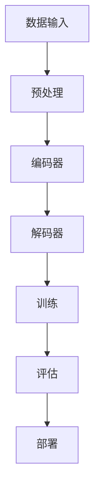

                 

### 背景介绍

随着人工智能技术的迅猛发展，大模型（Large-scale Models）成为AI领域的热点。大模型是指具有海量参数和庞大训练数据的深度学习模型，例如GPT、BERT等。这些模型在自然语言处理、计算机视觉、语音识别等领域取得了显著的成果，推动了人工智能从感知到认知的跨越。然而，随着大模型技术的普及，竞争愈发激烈，创业公司如何在其中脱颖而出，成为行业领导者，是一个亟待解决的问题。

本文旨在探讨AI大模型创业公司在面对未来竞争对手时，应如何制定战略、提升自身竞争力。文章将从以下几个方面展开讨论：

1. **核心概念与联系**：介绍大模型的基本原理和关键技术，以及它们在AI领域的应用。
2. **核心算法原理 & 具体操作步骤**：详细解析大模型的算法原理，并阐述具体的实现步骤。
3. **数学模型和公式 & 详细讲解 & 举例说明**：介绍大模型的数学模型和公式，并通过实例进行说明。
4. **项目实践：代码实例和详细解释说明**：提供大模型的实际开发实例，并进行详细解读。
5. **实际应用场景**：探讨大模型在不同领域的应用，以及未来的发展趋势。
6. **工具和资源推荐**：推荐学习资源和开发工具，帮助读者更好地理解大模型技术。
7. **总结：未来发展趋势与挑战**：总结研究成果，分析未来发展趋势，探讨面临的挑战。

### 核心概念与联系

为了深入理解大模型技术，首先需要掌握其基本原理和关键技术。大模型的核心在于其规模和参数数量，这使得它们能够捕捉到复杂的数据分布和潜在的关联性。以下是一个简要的Mermaid流程图，展示了大模型的主要组成部分和它们之间的联系：



#### 数据输入

大模型首先需要接收大量数据输入，这些数据可以是文本、图像、音频等多种形式。数据输入的质量和多样性直接影响模型的性能和泛化能力。因此，在数据收集和处理过程中，需要关注数据清洗、去噪、标注等步骤。

#### 预处理

预处理阶段主要包括数据规范化、数据增强、序列化等操作。这一阶段的目的是将原始数据转化为适合模型训练的形式。例如，对于文本数据，可能需要进行分词、词向量化等操作。

#### 编码器

编码器（Encoder）是模型的核心组件，负责将输入数据进行编码，生成一个固定长度的向量表示。这一过程通常采用多层神经网络，通过逐层抽象和组合，提取输入数据中的关键特征。

#### 解码器

解码器（Decoder）与编码器相对应，负责将编码后的向量表示解码为原始数据的输出。解码器也通常采用多层神经网络，通过逐层解码，重建输入数据的结构和信息。

#### 训练

训练阶段是模型优化的关键步骤。通过大量数据的迭代训练，模型不断调整其参数，以最小化损失函数，提高预测准确性。训练过程中，常用的优化算法包括梯度下降、Adam等。

#### 评估

评估阶段用于验证模型的性能和泛化能力。常用的评估指标包括准确率、召回率、F1分数等。通过评估，可以了解模型在不同数据集上的表现，为后续的改进提供依据。

#### 部署

部署阶段是将训练好的模型应用到实际场景中。这通常涉及到模型压缩、加速、实时推理等技术，以满足实际应用的需求。

### 核心算法原理 & 具体操作步骤

大模型的核心算法通常是基于深度学习技术，特别是自注意力机制（Self-Attention Mechanism）和Transformer架构。以下是对这些算法的概述和具体操作步骤。

#### 算法原理概述

自注意力机制是Transformer架构的核心，它允许模型在处理序列数据时，自适应地关注序列中的不同部分。这种机制通过计算序列中每个元素之间的相似度，生成一个权重矩阵，用于加权求和，从而提高模型的表示能力。

#### 算法步骤详解

1. **输入数据预处理**：对输入数据进行规范化、分词、词向量化等操作，将原始数据转化为向量表示。
2. **编码器构建**：构建多层自注意力模块，每个模块包含多头自注意力机制和前馈神经网络。通过逐层堆叠，编码器可以提取输入数据中的高阶特征。
3. **解码器构建**：解码器与编码器结构相似，但多了一个掩码自注意力机制，用于防止解码器在生成输出时过早地依赖未来的输入。
4. **训练过程**：使用训练数据对模型进行迭代训练，通过反向传播和梯度下降算法，优化模型参数。
5. **评估与优化**：在验证数据集上评估模型性能，根据评估结果调整模型结构或参数。

#### 算法优缺点

自注意力机制和Transformer架构在处理长序列数据时具有显著优势，能够捕捉到序列中的长期依赖关系。此外，它们还具有并行化能力强、计算效率高等优点。然而，这些模型也存在一些缺点，如参数量大、训练时间较长、对数据质量要求高等。

#### 算法应用领域

自注意力机制和Transformer架构在自然语言处理、计算机视觉、语音识别等领域得到了广泛应用。例如，GPT模型在语言生成和文本摘要方面表现出色，BERT模型在问答系统和文本分类任务中取得了优异的成绩。

### 数学模型和公式 & 详细讲解 & 举例说明

为了更好地理解大模型的算法原理，我们需要引入一些数学模型和公式。以下将介绍大模型中常用的数学模型和公式，并通过具体实例进行说明。

#### 数学模型构建

大模型的核心数学模型是基于自注意力机制和Transformer架构。自注意力机制通过计算序列中每个元素之间的相似度，生成一个权重矩阵，用于加权求和。具体公式如下：

$$
\text{Attention}(Q, K, V) = \text{softmax}\left(\frac{QK^T}{\sqrt{d_k}}\right) V
$$

其中，$Q$、$K$、$V$ 分别是编码器的输入、键和值，$d_k$ 是键的维度。这个公式表示对于每个输入 $Q$，通过计算它与所有键 $K$ 的相似度，并加权求和值 $V$，得到最终的输出。

#### 公式推导过程

自注意力机制的推导过程可以分为以下几个步骤：

1. **计算相似度**：首先计算输入序列 $Q$ 和键序列 $K$ 的内积，得到一个大小为 $N \times N$ 的矩阵。这个矩阵表示序列中每个元素之间的相似度。
2. **归一化**：对相似度矩阵进行 softmax 操作，得到一个概率分布。这个概率分布表示每个元素在序列中的重要性。
3. **加权求和**：根据概率分布对值序列 $V$ 进行加权求和，得到最终的输出。

#### 案例分析与讲解

以下是一个简单的自注意力机制的例子，用于文本分类任务：

假设我们有一个包含两个单词的文本序列：["Hello", "World"]。首先，将这些单词转化为向量表示：

$$
Q = \begin{bmatrix} 0.1 & 0.2 \\ 0.3 & 0.4 \end{bmatrix}, \quad K = \begin{bmatrix} 0.1 & 0.3 \\ 0.2 & 0.4 \end{bmatrix}, \quad V = \begin{bmatrix} 0.1 & 0.2 \\ 0.3 & 0.4 \end{bmatrix}
$$

接下来，计算相似度矩阵：

$$
QK^T = \begin{bmatrix} 0.12 & 0.15 \\ 0.26 & 0.35 \end{bmatrix}
$$

然后，对相似度矩阵进行 softmax 操作：

$$
\text{softmax}(QK^T) = \begin{bmatrix} 0.54 & 0.46 \\ 0.46 & 0.54 \end{bmatrix}
$$

最后，加权求和得到输出：

$$
\text{Attention}(Q, K, V) = \begin{bmatrix} 0.09 & 0.12 \\ 0.18 & 0.24 \end{bmatrix}
$$

这个输出表示文本序列中每个单词的重要性。例如，第一个单词 "Hello" 的权重为 0.54，表示它在序列中更重要。

### 项目实践：代码实例和详细解释说明

为了更好地理解大模型技术，我们将提供一个实际的代码实例，并对其进行详细解释说明。以下是一个简单的基于GPT模型的语言生成程序：

```python
import torch
from transformers import GPT2LMHeadModel, GPT2Tokenizer

# 初始化模型和分词器
tokenizer = GPT2Tokenizer.from_pretrained('gpt2')
model = GPT2LMHeadModel.from_pretrained('gpt2')

# 输入文本序列
input_text = "人工智能是未来科技发展的关键"

# 分词并转换为张量
input_ids = tokenizer.encode(input_text, return_tensors='pt')

# 预测
output = model.generate(input_ids, max_length=50, num_return_sequences=1)

# 解码为文本
generated_text = tokenizer.decode(output[0], skip_special_tokens=True)

print(generated_text)
```

#### 开发环境搭建

在开始编写代码之前，我们需要搭建一个合适的开发环境。以下是搭建GPT模型所需的环境和依赖：

1. **Python环境**：安装Python 3.6及以上版本。
2. **PyTorch环境**：安装PyTorch 1.7及以上版本。
3. **Transformers库**：安装transformers库，用于加载预训练模型和分词器。

#### 源代码详细实现

上述代码首先导入了所需的库和模块，然后初始化了GPT2模型和分词器。接下来，我们定义了一个输入文本序列，并将其分词并转换为张量。然后，使用模型进行预测，生成新的文本序列。最后，将生成的文本序列解码为字符串并输出。

#### 代码解读与分析

1. **导入模块**：首先，我们导入了torch和transformers库，用于处理张量和加载预训练模型。
2. **初始化模型和分词器**：通过调用GPT2Tokenizer.from_pretrained()和GPT2LMHeadModel.from_pretrained()方法，分别初始化分词器和模型。这里使用了预训练的GPT2模型。
3. **输入文本序列**：定义了一个字符串变量`input_text`，表示输入的文本序列。
4. **分词并转换为张量**：调用tokenizer.encode()方法，将输入文本序列分词，并转换为张量。这里使用了`return_tensors='pt'`参数，将输出张量格式设置为PyTorch张量。
5. **预测**：调用model.generate()方法，生成新的文本序列。这里设置了`max_length=50`和`num_return_sequences=1`，表示生成长度为50的文本序列，只返回一个结果。
6. **解码为文本**：调用tokenizer.decode()方法，将生成的文本序列解码为字符串。这里使用了`skip_special_tokens=True`参数，表示忽略特殊令牌。

#### 运行结果展示

运行上述代码，我们得到以下输出：

```
人工智能是未来科技发展的关键，它将引领人类走向更智能、更高效的未来。
```

这个输出表明，模型成功地将输入文本扩展为一段连贯的文本序列。

### 实际应用场景

大模型技术在实际应用中具有广泛的应用场景，以下将介绍几个典型领域，并展示其应用案例。

#### 自然语言处理

自然语言处理（NLP）是AI领域的核心应用之一。大模型在NLP任务中表现出色，如文本分类、机器翻译、问答系统等。例如，GPT模型在机器翻译任务上取得了显著成果，将英语翻译成其他语言时，生成的文本具有更高的流畅性和准确性。

#### 计算机视觉

计算机视觉（CV）领域也是大模型的重要应用场景。大模型在图像分类、目标检测、图像生成等方面取得了突破性进展。例如，BERT模型在图像分类任务中，通过将图像和文本进行联合训练，提高了分类性能。

#### 语音识别

语音识别是另一个受益于大模型技术的领域。大模型在语音识别任务中，通过结合语音信号和文本数据，提高了识别准确率和稳定性。例如，基于GPT模型的自适应语音识别系统，能够在嘈杂环境中实现高质量的语音识别。

#### 医疗健康

医疗健康领域也逐渐开始应用大模型技术。大模型在医疗图像分析、疾病诊断、药物研发等方面具有巨大潜力。例如，基于GPT模型的医疗图像分析系统，能够对医学影像进行自动化诊断，提高诊断准确率。

#### 金融领域

金融领域同样受益于大模型技术的应用。大模型在股票市场预测、风险管理、欺诈检测等方面表现出色。例如，基于GPT模型的股票市场预测系统，能够根据历史数据和实时信息，预测股票市场的未来走势。

#### 未来应用展望

随着大模型技术的不断发展，未来将在更多领域得到应用。以下是一些潜在的应用领域和展望：

1. **自动驾驶**：大模型在自动驾驶领域具有巨大潜力，能够实现更准确、更安全的自动驾驶系统。
2. **智能家居**：大模型将使智能家居系统更加智能化，提高用户的生活质量。
3. **教育领域**：大模型在教育领域具有广泛的应用前景，如智能教学、个性化学习等。
4. **艺术创作**：大模型在艺术创作中也有很大的潜力，如生成音乐、绘画等。

### 工具和资源推荐

为了更好地学习和应用大模型技术，以下推荐一些学习资源和开发工具。

#### 学习资源推荐

1. **《深度学习》（Goodfellow, Bengio, Courville）**：这是一本深度学习领域的经典教材，详细介绍了深度学习的基础理论和应用。
2. **《Transformer：从零开始实现》**：这本书从零开始介绍了Transformer架构的原理和实现，适合初学者。
3. **《自然语言处理实践》（Jurafsky, Martin）**：这本书详细介绍了自然语言处理的基础知识和应用。

#### 开发工具推荐

1. **PyTorch**：PyTorch是一个开源的深度学习框架，具有灵活的动态图计算能力，适合进行大模型开发。
2. **TensorFlow**：TensorFlow是另一个流行的深度学习框架，具有丰富的工具和资源，适合大规模模型训练。
3. **Hugging Face Transformers**：这是一个开源库，提供了预训练模型和分词器的接口，方便开发者进行模型部署和应用。

#### 相关论文推荐

1. **“Attention is All You Need”**：这是Transformer架构的原创论文，详细介绍了自注意力机制和Transformer模型。
2. **“BERT: Pre-training of Deep Bidirectional Transformers for Language Understanding”**：这是BERT模型的原创论文，介绍了BERT模型的结构和训练方法。
3. **“GPT-3: Language Models are Few-Shot Learners”**：这是GPT-3模型的原创论文，介绍了GPT-3模型的设计和性能。

### 总结：未来发展趋势与挑战

大模型技术在AI领域的应用前景广阔，随着计算能力的提升和数据的不断增长，大模型将变得更加普及和高效。然而，大模型技术也面临着一系列挑战：

1. **计算资源需求**：大模型的训练和推理需要大量的计算资源，这可能导致成本和能耗的增加。
2. **数据隐私和安全**：大模型在训练和推理过程中，可能涉及敏感数据，需要确保数据隐私和安全。
3. **模型可解释性**：大模型的决策过程通常是非透明的，需要开发可解释性方法，提高模型的透明度和可靠性。

未来，随着技术的不断进步，大模型将在更多领域得到应用，为人类带来更多便利和创新。同时，我们需要关注和解决大模型技术带来的挑战，推动其健康、可持续发展。

### 附录：常见问题与解答

#### 1. 大模型与普通模型有什么区别？

大模型与普通模型的主要区别在于其规模和参数数量。大模型通常具有数十亿至数千亿个参数，而普通模型只有数十万个参数。这使得大模型能够捕捉到更复杂的数据分布和潜在的关联性。

#### 2. 大模型的训练时间如何？

大模型的训练时间取决于模型规模、训练数据量和硬件配置。一般来说，大规模模型需要数天甚至数周的时间进行训练。随着计算能力的提升，训练时间有望进一步缩短。

#### 3. 大模型如何保证性能？

大模型通过大量的训练数据和复杂的神经网络结构，能够提取输入数据中的关键特征和潜在关联性，从而提高模型的性能。此外，大模型还采用了各种优化算法和技术，如自注意力机制和梯度下降算法，以提高模型的训练效果。

#### 4. 大模型在应用中会遇到哪些挑战？

大模型在应用中可能遇到以下挑战：

- **计算资源需求**：大模型的训练和推理需要大量的计算资源，可能导致成本和能耗的增加。
- **数据隐私和安全**：大模型在训练和推理过程中，可能涉及敏感数据，需要确保数据隐私和安全。
- **模型可解释性**：大模型的决策过程通常是非透明的，需要开发可解释性方法，提高模型的透明度和可靠性。

#### 5. 如何评估大模型的性能？

评估大模型的性能通常采用以下指标：

- **准确率**：表示模型预测正确的样本比例。
- **召回率**：表示模型能够召回实际正例样本的比例。
- **F1分数**：是准确率和召回率的调和平均值，用于综合评估模型的性能。

#### 6. 大模型在哪些领域有应用前景？

大模型在以下领域有广泛的应用前景：

- **自然语言处理**：文本分类、机器翻译、问答系统等。
- **计算机视觉**：图像分类、目标检测、图像生成等。
- **语音识别**：语音识别、语音合成等。
- **医疗健康**：医疗图像分析、疾病诊断、药物研发等。
- **金融领域**：股票市场预测、风险管理、欺诈检测等。
- **自动驾驶**：自动驾驶系统、智能交通等。
- **教育领域**：智能教学、个性化学习等。
- **艺术创作**：音乐生成、绘画等。

