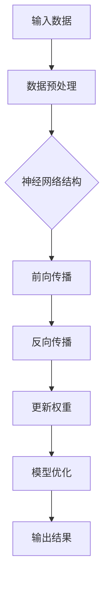
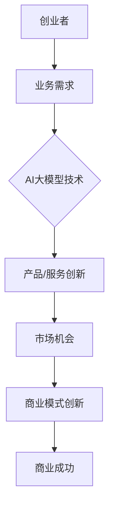
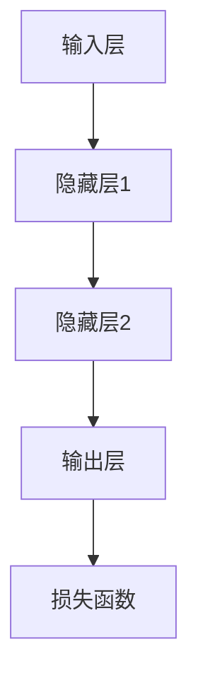
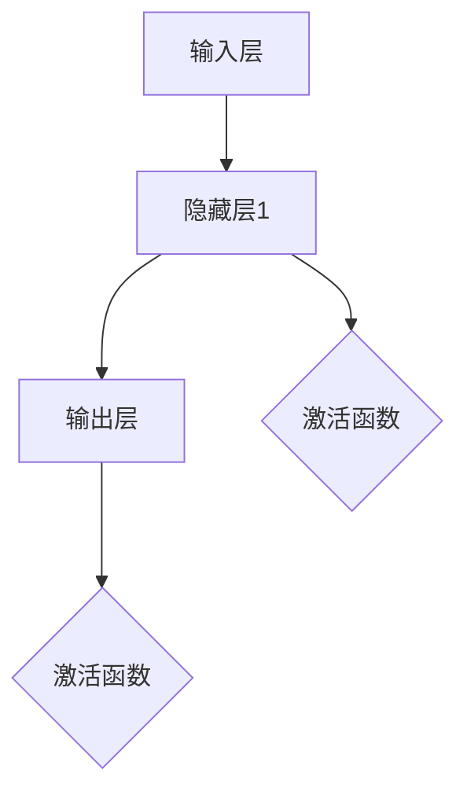

                 

关键词：AI大模型、创业、行业发展趋势、技术挑战、商业模式创新、市场机会

> 摘要：本文旨在探讨AI大模型在创业领域的应用和发展趋势，分析AI大模型在技术、市场、商业模式等方面的挑战和机遇，为创业者提供应对策略和未来展望。

## 1. 背景介绍

### AI大模型的概念

AI大模型，即大型人工智能模型，是指具备强大计算能力和海量数据训练的深度学习模型。近年来，随着计算能力的提升和海量数据的积累，AI大模型在自然语言处理、计算机视觉、语音识别等领域取得了显著的进展。这些模型具有高度的自我学习和推理能力，能够解决复杂的问题，为各行各业带来变革。

### 创业领域的发展

创业领域一直以来都是创新和变革的前沿，随着AI大模型的崛起，越来越多的创业者开始将AI大模型应用于产品和服务中，以期在激烈的市场竞争中脱颖而出。AI大模型在创业领域中的应用，不仅能够提高生产效率，降低成本，还能为企业带来新的商业模式和市场机会。

## 2. 核心概念与联系

### AI大模型原理

AI大模型的核心是基于深度学习的神经网络结构，通过多层非线性变换，实现对数据的自动特征提取和模式识别。以下是AI大模型的基本原理流程图：



### 创业与AI大模型的关系

AI大模型在创业中的应用，可以视为一种技术创新的驱动。创业者通过将AI大模型与自身业务相结合，可以开辟新的市场空间，提升企业的竞争力。以下是AI大模型与创业领域的关系流程图：



## 3. 核心算法原理 & 具体操作步骤

### 3.1 算法原理概述

AI大模型的核心算法是基于深度学习的神经网络。神经网络由多个层次组成，包括输入层、隐藏层和输出层。通过多层非线性变换，神经网络能够自动提取输入数据的特征，并进行模式识别。以下是神经网络的基本原理：



### 3.2 算法步骤详解

1. **数据预处理**：对输入数据进行清洗、标准化等处理，以便神经网络能够更好地学习。
2. **模型构建**：根据业务需求设计神经网络结构，包括输入层、隐藏层和输出层的神经元数量及连接方式。
3. **模型训练**：通过前向传播和反向传播算法，对神经网络进行训练，不断调整权重，使得模型输出更接近真实值。
4. **模型评估**：使用验证集和测试集对模型进行评估，确保模型具有良好的泛化能力。
5. **模型部署**：将训练好的模型部署到生产环境中，为用户提供服务。

### 3.3 算法优缺点

**优点**：
- 高效：能够处理海量数据，提高生产效率。
- 自动化：减少人工干预，降低成本。
- 泛化能力：能够应对不同领域的问题。

**缺点**：
- 计算资源消耗大：训练大模型需要大量计算资源和时间。
- 对数据质量要求高：数据质量问题会直接影响模型性能。

### 3.4 算法应用领域

AI大模型在各个领域都有广泛的应用，包括但不限于：
- 自然语言处理：如机器翻译、文本生成、问答系统等。
- 计算机视觉：如图像识别、目标检测、图像生成等。
- 语音识别：如语音合成、语音识别、语音识别系统等。

## 4. 数学模型和公式 & 详细讲解 & 举例说明

### 4.1 数学模型构建

AI大模型的数学模型主要基于神经网络。以下是神经网络的基本公式：

$$
y = \sigma(W \cdot x + b)
$$

其中，$y$ 为输出，$\sigma$ 为激活函数，$W$ 为权重矩阵，$x$ 为输入，$b$ 为偏置。

### 4.2 公式推导过程

神经网络的推导过程包括以下几个步骤：

1. **前向传播**：计算输入层到隐藏层的输出。
2. **反向传播**：计算输出误差，并更新权重。
3. **激活函数**：将线性组合的输出映射到非线性空间。

### 4.3 案例分析与讲解

以下是一个简单的神经网络案例，用于实现一个简单的图像分类任务。



输入层接收图像数据，经过隐藏层1的线性变换和激活函数，得到隐藏层1的输出。隐藏层1的输出再经过隐藏层2的线性变换和激活函数，得到隐藏层2的输出。最终，隐藏层2的输出经过输出层的线性变换和激活函数，得到分类结果。

## 5. 项目实践：代码实例和详细解释说明

### 5.1 开发环境搭建

在开始编写代码之前，我们需要搭建一个开发环境。这里以Python为例，介绍如何搭建一个简单的AI大模型开发环境。

1. 安装Python：前往 [Python官网](https://www.python.org/) 下载并安装Python。
2. 安装深度学习库：使用pip命令安装TensorFlow或PyTorch。

```bash
pip install tensorflow
```

或

```bash
pip install torch torchvision
```

### 5.2 源代码详细实现

以下是一个简单的AI大模型代码实例，用于实现一个图像分类任务。

```python
import tensorflow as tf
from tensorflow.keras import layers

# 数据预处理
def preprocess_image(image_path):
    image = tf.io.read_file(image_path)
    image = tf.image.decode_jpeg(image, channels=3)
    image = tf.image.resize(image, [224, 224])
    image = image / 255.0
    return image

# 模型构建
def build_model():
    inputs = tf.keras.Input(shape=(224, 224, 3))
    x = layers.Conv2D(32, (3, 3), activation='relu')(inputs)
    x = layers.MaxPooling2D((2, 2))(x)
    x = layers.Conv2D(64, (3, 3), activation='relu')(x)
    x = layers.MaxPooling2D((2, 2))(x)
    x = layers.Conv2D(128, (3, 3), activation='relu')(x)
    x = layers.MaxPooling2D((2, 2))(x)
    x = layers.Flatten()(x)
    x = layers.Dense(128, activation='relu')(x)
    outputs = layers.Dense(10, activation='softmax')(x)
    model = tf.keras.Model(inputs, outputs)
    return model

# 模型训练
def train_model(model, train_data, train_labels, epochs=10):
    model.compile(optimizer='adam', loss='categorical_crossentropy', metrics=['accuracy'])
    model.fit(train_data, train_labels, epochs=epochs)

# 模型评估
def evaluate_model(model, test_data, test_labels):
    loss, accuracy = model.evaluate(test_data, test_labels)
    print(f"Test accuracy: {accuracy:.2f}")

# 模型部署
def deploy_model(model, image_path):
    image = preprocess_image(image_path)
    image = tf.expand_dims(image, 0)
    predictions = model.predict(image)
    predicted_class = tf.argmax(predictions, axis=1)
    print(f"Predicted class: {predicted_class.numpy()}")

# 主函数
def main():
    # 加载数据
    (train_data, train_labels), (test_data, test_labels) = tf.keras.datasets.cifar10.load_data()
    train_data = train_data / 255.0
    test_data = test_data / 255.0

    # 构建模型
    model = build_model()

    # 训练模型
    train_model(model, train_data, train_labels)

    # 评估模型
    evaluate_model(model, test_data, test_labels)

    # 部署模型
    deploy_model(model, "path/to/image.jpg")

if __name__ == "__main__":
    main()
```

### 5.3 代码解读与分析

以上代码是一个简单的图像分类任务，包括数据预处理、模型构建、模型训练、模型评估和模型部署五个部分。

1. **数据预处理**：将图像数据读取为TensorFlow张量，并进行归一化处理。
2. **模型构建**：使用TensorFlow的Keras接口构建一个简单的卷积神经网络，包括卷积层、池化层和全连接层。
3. **模型训练**：使用训练数据对模型进行训练，并编译优化器。
4. **模型评估**：使用测试数据评估模型性能。
5. **模型部署**：使用部署好的模型对新的图像数据进行分类。

## 6. 实际应用场景

### 6.1 教育领域

AI大模型在教育领域的应用前景广阔，如个性化学习、智能评测、智能答疑等。通过AI大模型，学生可以获得定制化的学习内容，提高学习效果。

### 6.2 医疗领域

AI大模型在医疗领域具有巨大的潜力，如疾病预测、疾病诊断、手术规划等。通过AI大模型，可以提高医疗服务的质量和效率。

### 6.3 金融领域

AI大模型在金融领域的应用包括风险管理、信用评估、投资决策等。通过AI大模型，金融机构可以更好地识别风险，提高业务效率。

### 6.4 电商领域

AI大模型在电商领域的应用包括个性化推荐、价格优化、用户行为分析等。通过AI大模型，电商平台可以更好地满足用户需求，提高用户满意度。

## 7. 工具和资源推荐

### 7.1 学习资源推荐

- 《深度学习》（Goodfellow, Bengio, Courville著）：深度学习的经典教材，适合初学者。
- 《Python机器学习》（Sebastian Raschka著）：Python在机器学习领域的入门书籍，适合初学者。

### 7.2 开发工具推荐

- TensorFlow：Google开发的深度学习框架，适合快速搭建和部署模型。
- PyTorch：Facebook开发的深度学习框架，具有较好的灵活性和易用性。

### 7.3 相关论文推荐

- “Deep Learning”（Goodfellow, Bengio, Courville著）：深度学习的综述论文，全面介绍了深度学习的发展和应用。
- “A Theoretical Analysis of the Cramér–Rao Lower Bound for Random Fields”（Marsili et al.，2003）：随机场Cramér-Rao下界的理论分析，对深度学习中的损失函数有重要意义。

## 8. 总结：未来发展趋势与挑战

### 8.1 研究成果总结

AI大模型在各个领域取得了显著的成果，如自然语言处理、计算机视觉、语音识别等。通过AI大模型，我们能够更好地解决复杂问题，提高生产效率，创造新的商业模式。

### 8.2 未来发展趋势

- 计算能力的提升：随着计算能力的不断提升，AI大模型将能够处理更大规模的数据，解决更复杂的问题。
- 数据质量的提高：高质量的数据是AI大模型训练的基础，未来数据质量的提升将有助于模型的性能提升。
- 产业应用的深入：AI大模型将在更多产业领域得到应用，推动产业升级和创新发展。

### 8.3 面临的挑战

- 数据隐私和安全：AI大模型在处理大量数据时，面临数据隐私和安全问题，需要采取有效措施确保数据安全。
- 算法透明性和可解释性：AI大模型具有一定的“黑箱”特性，其决策过程难以解释，需要提高算法的透明性和可解释性。
- 能源消耗：AI大模型训练过程需要大量计算资源，未来需要探索更节能的算法和硬件。

### 8.4 研究展望

未来，AI大模型的研究将重点关注以下几个方向：

- 算法优化：通过改进算法，提高模型训练效率和性能。
- 模型压缩：通过模型压缩技术，降低模型的大小和计算复杂度，提高部署效率。
- 跨领域应用：探索AI大模型在不同领域的应用，推动产业创新发展。

## 9. 附录：常见问题与解答

### 9.1 AI大模型是什么？

AI大模型是指具有强大计算能力和海量数据训练的深度学习模型，如GPT-3、BERT、ViT等。

### 9.2 AI大模型有哪些应用场景？

AI大模型在自然语言处理、计算机视觉、语音识别、医疗、金融、教育等领域都有广泛应用。

### 9.3 如何选择合适的AI大模型？

选择合适的AI大模型需要考虑业务需求、数据量、计算资源等因素。对于通用任务，可以使用预训练模型；对于特定领域，可以选择定制化模型。

### 9.4 AI大模型的训练过程如何进行？

AI大模型的训练过程包括数据预处理、模型构建、模型训练、模型评估和模型部署等步骤。

### 9.5 AI大模型是否具有未来潜力？

是的，AI大模型具有巨大的未来潜力，将在各个领域推动产业升级和创新发展。

