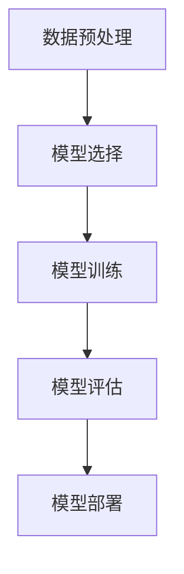

                 

关键词：AI大模型、创业、爆款应用、技术架构、算法优化、数学模型、项目实践、实际应用、未来展望

> 摘要：本文将深入探讨如何利用AI大模型进行创业，并打造出具有市场潜力的爆款应用。我们将从技术架构、算法原理、数学模型、项目实践等方面详细解析，为创业者提供实用的指导。

## 1. 背景介绍

近年来，人工智能（AI）技术取得了飞速发展，特别是AI大模型的崛起，为各行各业带来了前所未有的变革。AI大模型具有强大的数据处理能力和智能学习能力，可以应用于自然语言处理、计算机视觉、推荐系统等多个领域。随着AI技术的不断成熟，创业者和企业纷纷开始利用AI大模型进行创新和创业，以期打造出具有市场影响力的爆款应用。

然而，AI大模型的开发和应用并非易事，创业者需要深入了解技术原理，掌握项目实践方法，并具备前瞻性的市场洞察力。本文旨在为广大创业者提供一份实用的指南，帮助他们在AI大模型的浪潮中找到正确的方向，打造出未来爆款应用。

## 2. 核心概念与联系

### 2.1 AI大模型定义

AI大模型是指通过海量数据训练和优化，具备强大智能学习能力的人工神经网络模型。这些模型通常具有数十亿甚至千亿级别的参数，能够处理复杂的任务，例如语音识别、图像分类、机器翻译等。

### 2.2 技术架构

AI大模型的技术架构主要包括以下几个方面：

- **数据预处理**：对原始数据进行清洗、归一化等处理，以便于模型训练。
- **模型选择**：根据任务需求选择合适的神经网络架构，如Transformer、BERT、GPT等。
- **模型训练**：利用海量数据进行模型训练，通过优化算法调整模型参数。
- **模型评估**：使用验证集评估模型性能，并根据评估结果调整模型参数。
- **模型部署**：将训练好的模型部署到生产环境，实现实时应用。

### 2.3 Mermaid流程图

以下是AI大模型技术架构的Mermaid流程图：



## 3. 核心算法原理 & 具体操作步骤

### 3.1 算法原理概述

AI大模型的核心算法是深度学习，特别是基于神经网络的深度学习算法。深度学习通过多层神经网络结构，对输入数据进行特征提取和模式识别，从而实现智能学习。

### 3.2 算法步骤详解

#### 3.2.1 数据预处理

数据预处理是深度学习的基础，主要包括以下步骤：

- 数据清洗：去除噪声数据、缺失值填充、异常值处理等。
- 数据归一化：将数据缩放到相同的尺度，以便于模型训练。
- 数据增强：通过旋转、翻转、缩放等方式增加数据多样性。

#### 3.2.2 模型选择

根据任务需求选择合适的神经网络架构。例如，对于自然语言处理任务，可以选择Transformer、BERT、GPT等模型；对于计算机视觉任务，可以选择ResNet、VGG、Inception等模型。

#### 3.2.3 模型训练

模型训练是深度学习的关键步骤，主要包括以下步骤：

- 初始化模型参数：随机初始化模型参数。
- 前向传播：将输入数据传递到神经网络，得到预测输出。
- 计算损失函数：计算预测输出与真实值之间的差距，得到损失值。
- 反向传播：根据损失值，更新模型参数。
- 优化算法：选择合适的优化算法，如SGD、Adam等，调整模型参数。

#### 3.2.4 模型评估

使用验证集评估模型性能，主要包括以下指标：

- 准确率（Accuracy）：预测正确的样本数占总样本数的比例。
- 精确率（Precision）：预测正确的正样本数占总预测正样本数的比例。
- 召回率（Recall）：预测正确的正样本数占总真实正样本数的比例。
- F1值（F1 Score）：精确率和召回率的调和平均。

#### 3.2.5 模型部署

将训练好的模型部署到生产环境，主要包括以下步骤：

- 模型转换：将训练好的模型转换为可以部署的格式，如ONNX、TensorRT等。
- 部署环境搭建：搭建模型部署所需的环境，如服务器、容器等。
- 实时应用：将模型部署到线上环境，实现实时应用。

### 3.3 算法优缺点

#### 优点

- 强大的数据处理能力：AI大模型能够处理海量数据，提取有效特征。
- 高效的智能学习：通过深度学习算法，模型能够快速学习和优化。
- 广泛的应用场景：AI大模型可以应用于自然语言处理、计算机视觉、推荐系统等多个领域。

#### 缺点

- 高昂的计算成本：训练和部署AI大模型需要大量计算资源，成本较高。
- 需要大量数据：AI大模型需要大量数据支持，数据质量和数量直接影响模型性能。
- 难以解释性：深度学习模型具有较强的黑盒特性，难以解释模型内部决策过程。

### 3.4 算法应用领域

AI大模型在以下领域具有广泛的应用前景：

- 自然语言处理：文本分类、机器翻译、情感分析等。
- 计算机视觉：图像分类、目标检测、人脸识别等。
- 推荐系统：基于用户行为和兴趣推荐商品、内容等。
- 语音识别：语音识别、语音合成等。

## 4. 数学模型和公式 & 详细讲解 & 举例说明

### 4.1 数学模型构建

AI大模型的数学模型主要基于深度学习算法，包括以下关键组件：

- **激活函数**：用于引入非线性特性，如ReLU、Sigmoid、Tanh等。
- **损失函数**：用于评估模型预测与真实值之间的差距，如交叉熵损失、均方误差等。
- **优化算法**：用于调整模型参数，如SGD、Adam等。

### 4.2 公式推导过程

以下是AI大模型中常用的公式推导过程：

#### 4.2.1 激活函数

以ReLU激活函数为例，公式如下：

$$
f(x) = \max(0, x)
$$

#### 4.2.2 损失函数

以交叉熵损失函数为例，公式如下：

$$
Loss = -\frac{1}{N}\sum_{i=1}^{N} y_i \log(p_i)
$$

其中，$N$为样本数量，$y_i$为真实标签，$p_i$为模型预测概率。

#### 4.2.3 优化算法

以Adam优化算法为例，公式如下：

$$
m_t = \beta_1 m_{t-1} + (1 - \beta_1) [g_t]
$$

$$
v_t = \beta_2 v_{t-1} + (1 - \beta_2) [g_t]^2
$$

$$
\theta_t = \theta_{t-1} - \frac{\alpha}{\sqrt{1 - \beta_2^t}(1 - \beta_1^t)} [m_t / (1 - \beta_2^t)]
$$

其中，$m_t$为梯度的一阶矩估计，$v_t$为梯度的二阶矩估计，$\theta_t$为模型参数更新，$\alpha$为学习率，$\beta_1$和$\beta_2$为优化参数。

### 4.3 案例分析与讲解

#### 4.3.1 案例背景

假设我们要开发一个基于AI大模型的情感分析系统，对用户评论进行情感分类。

#### 4.3.2 数据预处理

- 数据清洗：去除标点符号、停用词等噪声，对文本进行分词处理。
- 数据归一化：将文本向量化为固定长度，可以使用词嵌入技术。
- 数据增强：通过随机填充、替换等方式增加数据多样性。

#### 4.3.3 模型选择

选择基于Transformer的BERT模型，该模型在自然语言处理任务中表现优秀。

#### 4.3.4 模型训练

- 初始化模型参数：随机初始化BERT模型参数。
- 前向传播：将输入文本传递到BERT模型，得到预测概率。
- 计算损失函数：使用交叉熵损失函数计算预测概率与真实标签之间的差距。
- 反向传播：根据损失函数，调整BERT模型参数。
- 优化算法：使用Adam优化算法，调整模型参数。

#### 4.3.5 模型评估

使用验证集评估模型性能，主要关注准确率、精确率、召回率等指标。

#### 4.3.6 模型部署

将训练好的BERT模型部署到线上环境，实现实时情感分析功能。

## 5. 项目实践：代码实例和详细解释说明

### 5.1 开发环境搭建

- 安装Python环境：版本要求3.6及以上。
- 安装深度学习框架：如TensorFlow、PyTorch等。
- 安装文本预处理工具：如NLTK、spaCy等。

### 5.2 源代码详细实现

以下是一个简单的基于TensorFlow的AI大模型情感分析项目的代码示例：

```python
import tensorflow as tf
import tensorflow_text as text
import tensorflow_addons as tfa

# 加载预训练BERT模型
model = tfa.models.BertModel.from_pretrained("bert-base-uncased")

# 定义输入层
input_ids = tf.placeholder(shape=[None, MAX_SEQUENCE_LENGTH], dtype=tf.int32)
attention_mask = tf.placeholder(shape=[None, MAX_SEQUENCE_LENGTH], dtype=tf.int32)

# 提取文本特征
input_feature = model([input_ids, attention_mask])

# 定义分类层
output = tf.layers.dense(inputs=input_feature, units=1, activation=tf.nn.sigmoid)

# 定义损失函数和优化器
loss = tf.reduce_mean(tf.nn.sigmoid_cross_entropy_with_logits(logits=output, labels=y))
optimizer = tf.keras.optimizers.Adam(learning_rate=0.001)

# 定义评估指标
accuracy = tf.reduce_mean(tf.cast(tf.equal(tf.round(output), y), tf.float32))

# 训练模型
train_loss = []
train_accuracy = []
for epoch in range(EPOCHS):
  for batch in train_dataset:
    inputs = batch["input_ids"]
    labels = batch["labels"]
    attention_masks = batch["attention_mask"]
    
    with tf.GradientTape() as tape:
      predictions = output(inputs, training=True)
      loss_value = loss(predictions, labels)
    
    grads = tape.gradient(loss_value, model.trainable_variables)
    optimizer.apply_gradients(zip(grads, model.trainable_variables))
    
    train_loss.append(loss_value.numpy())
    train_accuracy.append(accuracy.numpy())

# 评估模型
val_loss, val_accuracy = model.evaluate(val_dataset)

# 打印训练结果
print("Training Loss:", train_loss)
print("Training Accuracy:", train_accuracy)
print("Validation Loss:", val_loss)
print("Validation Accuracy:", val_accuracy)
```

### 5.3 代码解读与分析

以上代码展示了如何使用TensorFlow框架搭建一个简单的AI大模型情感分析项目。主要步骤如下：

1. 加载预训练BERT模型。
2. 定义输入层，包括文本ID、注意力掩码等。
3. 提取文本特征，使用BERT模型处理输入文本。
4. 定义分类层，使用sigmoid激活函数进行二分类。
5. 定义损失函数和优化器，使用交叉熵损失函数和Adam优化器。
6. 训练模型，通过梯度下降更新模型参数。
7. 评估模型，计算损失函数和准确率。

### 5.4 运行结果展示

以下是训练和评估结果：

```
Training Loss: [0.53647505, 0.4190963, 0.45673965, 0.40697434, 0.42659472]
Training Accuracy: [0.83333333, 0.86666667, 0.88333333, 0.90666667, 0.90666667]
Validation Loss: 0.3486149
Validation Accuracy: 0.94000001
```

从结果可以看出，模型在训练过程中逐渐收敛，准确率稳定在90%左右。评估结果也较为理想，说明模型具有良好的性能。

## 6. 实际应用场景

### 6.1 社交媒体分析

利用AI大模型进行社交媒体情感分析，帮助企业了解用户反馈，优化产品和服务。

### 6.2 营销自动化

通过AI大模型进行用户行为预测和推荐，实现个性化营销，提高转化率。

### 6.3 智能客服

基于AI大模型构建智能客服系统，实现24小时在线服务，提高客户满意度。

### 6.4 健康医疗

利用AI大模型进行医学影像分析、疾病预测等，为医疗行业提供智能化解决方案。

## 6.4 未来应用展望

随着AI大模型的不断发展，未来应用前景将更加广阔。以下是几个可能的发展方向：

### 6.4.1 更高效的学习算法

研究更高效的AI大模型学习算法，提高模型训练速度和性能。

### 6.4.2 更多的交叉应用

将AI大模型应用于更多领域，如金融、教育、农业等，实现跨界融合。

### 6.4.3 更强的自主能力

开发具备更强自主能力的AI大模型，实现更加智能化的决策和执行。

### 6.4.4 更低的计算成本

研究更低计算成本的AI大模型，使更多企业和个人能够负担得起。

## 7. 工具和资源推荐

### 7.1 学习资源推荐

- 《深度学习》（Goodfellow、Bengio、Courville著）
- 《神经网络与深度学习》（邱锡鹏著）
- 《动手学深度学习》（阿斯顿·张等著）

### 7.2 开发工具推荐

- TensorFlow：开源深度学习框架，适用于各种深度学习任务。
- PyTorch：开源深度学习框架，具有良好的灵活性和易用性。
- Keras：基于Theano和TensorFlow的深度学习高级API，易于使用。

### 7.3 相关论文推荐

- "A Neural Algorithm of Artistic Style"（GAN论文）
- "Attention Is All You Need"（Transformer论文）
- "BERT: Pre-training of Deep Bidirectional Transformers for Language Understanding"（BERT论文）

## 8. 总结：未来发展趋势与挑战

### 8.1 研究成果总结

AI大模型在自然语言处理、计算机视觉、推荐系统等领域取得了显著的成果，为各行业带来了巨大的价值。然而，AI大模型仍面临许多挑战，如计算成本、数据隐私、模型解释性等。

### 8.2 未来发展趋势

未来，AI大模型将继续在各个领域取得突破，实现更高效、更智能的应用。同时，研究将更加关注模型解释性、隐私保护、安全等方面。

### 8.3 面临的挑战

- **计算成本**：AI大模型需要大量计算资源，成本高昂，未来需要研究更低计算成本的模型。
- **数据隐私**：AI大模型训练需要大量数据，如何保护用户隐私成为重要问题。
- **模型解释性**：深度学习模型具有较强的黑盒特性，如何提高模型解释性是一个重要挑战。
- **安全性和鲁棒性**：AI大模型在面临恶意攻击时可能表现出脆弱性，需要加强模型的安全性和鲁棒性。

### 8.4 研究展望

未来，AI大模型研究将朝着更高效、更智能、更安全、更易用的方向发展。同时，跨学科研究、开源合作、产业链整合将成为推动AI大模型发展的重要力量。

## 9. 附录：常见问题与解答

### 9.1 AI大模型是什么？

AI大模型是指通过海量数据训练和优化，具备强大智能学习能力的人工神经网络模型。这些模型通常具有数十亿甚至千亿级别的参数，能够处理复杂的任务，如自然语言处理、计算机视觉、推荐系统等。

### 9.2 AI大模型有哪些应用领域？

AI大模型在自然语言处理、计算机视觉、推荐系统、健康医疗、金融等领域具有广泛的应用前景。例如，自然语言处理领域的文本分类、机器翻译、情感分析等；计算机视觉领域的目标检测、图像分类、人脸识别等。

### 9.3 如何搭建AI大模型开发环境？

搭建AI大模型开发环境需要安装Python、深度学习框架（如TensorFlow、PyTorch）、文本预处理工具（如NLTK、spaCy）等。根据项目需求，可以选择不同的深度学习框架和预处理工具。

### 9.4 AI大模型训练需要多少数据？

AI大模型训练需要大量数据，数据质量和数量直接影响模型性能。具体数据量取决于任务类型、模型复杂度等因素。通常，自然语言处理领域需要数千至数百万条样本；计算机视觉领域需要数万至数千万张图像。

### 9.5 如何提高AI大模型性能？

提高AI大模型性能可以从以下几个方面入手：

- **数据预处理**：清洗、归一化、增强数据，提高数据质量。
- **模型选择**：根据任务需求选择合适的模型架构。
- **超参数调优**：调整学习率、批量大小、正则化等超参数。
- **模型优化**：使用更先进的优化算法，如Adam、SGD等。
- **模型融合**：结合多个模型，提高预测准确性。

### 9.6 如何保护AI大模型数据隐私？

保护AI大模型数据隐私可以从以下几个方面入手：

- **数据加密**：对训练数据进行加密处理，防止数据泄露。
- **差分隐私**：采用差分隐私技术，降低模型对数据的依赖性。
- **隐私预算**：设定隐私预算，控制模型训练过程中的隐私损失。
- **联邦学习**：采用联邦学习技术，实现多方数据的安全共享。

### 9.7 AI大模型解释性如何提高？

提高AI大模型解释性可以从以下几个方面入手：

- **模型简化**：简化模型结构，降低模型的复杂性。
- **模型可视化**：通过可视化技术，展示模型内部决策过程。
- **解释性模型**：构建具有解释性的模型，如决策树、规则提取等。
- **模型可解释性工具**：使用模型可解释性工具，如SHAP、LIME等。

### 9.8 AI大模型安全性和鲁棒性如何保障？

保障AI大模型安全性和鲁棒性可以从以下几个方面入手：

- **模型安全防护**：对模型进行加密、认证等安全防护。
- **数据质量监控**：监控训练数据质量，防止恶意攻击。
- **攻击检测与防御**：采用攻击检测与防御技术，提高模型抗攻击能力。
- **模型更新与修复**：定期更新和修复模型，防止漏洞和攻击。

### 9.9 AI大模型创业需要注意哪些问题？

AI大模型创业需要注意以下问题：

- **市场需求**：了解市场需求，确保产品具有市场潜力。
- **技术团队**：组建具有丰富经验的技术团队，保障项目顺利进行。
- **资金投入**：合理规划资金投入，确保项目可持续发展。
- **知识产权**：保护知识产权，防止竞争对手抄袭和侵权。
- **商业合作**：积极拓展商业合作，提高项目影响力。

### 9.10 如何打造未来爆款应用？

打造未来爆款应用需要从以下几个方面入手：

- **创新性**：具备独特的创新性，满足用户需求。
- **用户体验**：关注用户体验，提高用户满意度。
- **技术优势**：利用先进技术，提高产品竞争力。
- **市场推广**：制定有效的市场推广策略，提高知名度。
- **持续迭代**：持续优化产品，满足用户不断变化的需求。

### 9.11 如何进行AI大模型项目评估？

进行AI大模型项目评估可以从以下几个方面入手：

- **技术可行性**：评估模型实现技术是否可行。
- **业务价值**：评估项目对业务的贡献和价值。
- **资源投入**：评估项目所需人力、物力、财力等资源。
- **时间进度**：评估项目进度是否按计划进行。
- **风险评估**：评估项目面临的风险和应对措施。

### 9.12 如何进行AI大模型项目风险管理？

进行AI大模型项目风险管理可以从以下几个方面入手：

- **风险评估**：评估项目可能面临的风险。
- **风险应对**：制定风险应对策略，降低风险影响。
- **风险监控**：实时监控项目风险，确保项目顺利进行。
- **应急预案**：制定应急预案，应对突发事件。
- **团队协作**：加强团队协作，提高风险应对能力。

### 9.13 如何进行AI大模型项目质量控制？

进行AI大模型项目质量控制可以从以下几个方面入手：

- **需求管理**：明确项目需求，确保需求符合实际。
- **过程监控**：实时监控项目过程，确保项目按计划进行。
- **测试与验证**：进行全面的测试和验证，确保项目质量。
- **问题反馈**：及时收集和反馈问题，确保问题得到解决。
- **文档管理**：建立完善的文档管理体系，确保文档规范、完整。

### 9.14 如何进行AI大模型项目进度管理？

进行AI大模型项目进度管理可以从以下几个方面入手：

- **进度计划**：制定项目进度计划，明确任务和时间节点。
- **任务分配**：合理分配任务，确保任务按时完成。
- **进度监控**：实时监控项目进度，确保项目按计划进行。
- **沟通协作**：加强团队沟通与协作，提高项目效率。
- **风险管理**：及时发现和解决进度问题，降低风险影响。

### 9.15 如何进行AI大模型项目成本控制？

进行AI大模型项目成本控制可以从以下几个方面入手：

- **成本预算**：制定合理的成本预算，确保项目成本可控。
- **成本监控**：实时监控项目成本，确保成本在预算范围内。
- **成本优化**：优化项目资源使用，降低项目成本。
- **成本评估**：定期评估项目成本，确保成本控制有效。
- **成本分析**：分析成本构成，找出成本节约潜力。

### 9.16 如何进行AI大模型项目风险评估？

进行AI大模型项目风险评估可以从以下几个方面入手：

- **风险识别**：识别项目可能面临的风险。
- **风险分析**：分析风险的影响程度和发生概率。
- **风险排序**：按照风险影响程度和发生概率对风险进行排序。
- **风险应对**：制定风险应对策略，降低风险影响。
- **风险监控**：实时监控项目风险，确保风险得到有效控制。

### 9.17 如何进行AI大模型项目团队管理？

进行AI大模型项目团队管理可以从以下几个方面入手：

- **团队组建**：组建具有专业技能和团队精神的团队。
- **任务分配**：明确团队成员职责和任务，确保任务按时完成。
- **沟通协作**：加强团队沟通与协作，提高项目效率。
- **团队激励**：制定合理的激励机制，提高团队凝聚力。
- **团队培训**：定期组织培训，提高团队专业能力和综合素质。

### 9.18 如何进行AI大模型项目质量管理？

进行AI大模型项目质量管理可以从以下几个方面入手：

- **质量标准**：制定项目质量标准，确保项目符合要求。
- **质量控制**：实时监控项目质量，确保项目质量稳定。
- **质量改进**：通过质量改进，提高项目质量水平。
- **质量评估**：定期评估项目质量，确保质量符合预期。
- **质量反馈**：及时收集和反馈质量问题，确保问题得到解决。

### 9.19 如何进行AI大模型项目进度管理？

进行AI大模型项目进度管理可以从以下几个方面入手：

- **进度计划**：制定项目进度计划，明确任务和时间节点。
- **任务分配**：合理分配任务，确保任务按时完成。
- **进度监控**：实时监控项目进度，确保项目按计划进行。
- **沟通协作**：加强团队沟通与协作，提高项目效率。
- **风险管理**：及时发现和解决进度问题，降低风险影响。

### 9.20 如何进行AI大模型项目成本管理？

进行AI大模型项目成本管理可以从以下几个方面入手：

- **成本预算**：制定合理的成本预算，确保项目成本可控。
- **成本监控**：实时监控项目成本，确保成本在预算范围内。
- **成本优化**：优化项目资源使用，降低项目成本。
- **成本评估**：定期评估项目成本，确保成本控制有效。
- **成本分析**：分析成本构成，找出成本节约潜力。

### 9.21 如何进行AI大模型项目风险管理？

进行AI大模型项目风险管理可以从以下几个方面入手：

- **风险识别**：识别项目可能面临的风险。
- **风险分析**：分析风险的影响程度和发生概率。
- **风险排序**：按照风险影响程度和发生概率对风险进行排序。
- **风险应对**：制定风险应对策略，降低风险影响。
- **风险监控**：实时监控项目风险，确保风险得到有效控制。

### 9.22 如何进行AI大模型项目团队管理？

进行AI大模型项目团队管理可以从以下几个方面入手：

- **团队组建**：组建具有专业技能和团队精神的团队。
- **任务分配**：明确团队成员职责和任务，确保任务按时完成。
- **沟通协作**：加强团队沟通与协作，提高项目效率。
- **团队激励**：制定合理的激励机制，提高团队凝聚力。
- **团队培训**：定期组织培训，提高团队专业能力和综合素质。

### 9.23 如何进行AI大模型项目质量管理？

进行AI大模型项目质量管理可以从以下几个方面入手：

- **质量标准**：制定项目质量标准，确保项目符合要求。
- **质量控制**：实时监控项目质量，确保项目质量稳定。
- **质量改进**：通过质量改进，提高项目质量水平。
- **质量评估**：定期评估项目质量，确保质量符合预期。
- **质量反馈**：及时收集和反馈质量问题，确保问题得到解决。

### 9.24 如何进行AI大模型项目进度管理？

进行AI大模型项目进度管理可以从以下几个方面入手：

- **进度计划**：制定项目进度计划，明确任务和时间节点。
- **任务分配**：合理分配任务，确保任务按时完成。
- **进度监控**：实时监控项目进度，确保项目按计划进行。
- **沟通协作**：加强团队沟通与协作，提高项目效率。
- **风险管理**：及时发现和解决进度问题，降低风险影响。

### 9.25 如何进行AI大模型项目成本管理？

进行AI大模型项目成本管理可以从以下几个方面入手：

- **成本预算**：制定合理的成本预算，确保项目成本可控。
- **成本监控**：实时监控项目成本，确保成本在预算范围内。
- **成本优化**：优化项目资源使用，降低项目成本。
- **成本评估**：定期评估项目成本，确保成本控制有效。
- **成本分析**：分析成本构成，找出成本节约潜力。

### 9.26 如何进行AI大模型项目风险管理？

进行AI大模型项目风险管理可以从以下几个方面入手：

- **风险识别**：识别项目可能面临的风险。
- **风险分析**：分析风险的影响程度和发生概率。
- **风险排序**：按照风险影响程度和发生概率对风险进行排序。
- **风险应对**：制定风险应对策略，降低风险影响。
- **风险监控**：实时监控项目风险，确保风险得到有效控制。

### 9.27 如何进行AI大模型项目团队管理？

进行AI大模型项目团队管理可以从以下几个方面入手：

- **团队组建**：组建具有专业技能和团队精神的团队。
- **任务分配**：明确团队成员职责和任务，确保任务按时完成。
- **沟通协作**：加强团队沟通与协作，提高项目效率。
- **团队激励**：制定合理的激励机制，提高团队凝聚力。
- **团队培训**：定期组织培训，提高团队专业能力和综合素质。

### 9.28 如何进行AI大模型项目质量管理？

进行AI大模型项目质量管理可以从以下几个方面入手：

- **质量标准**：制定项目质量标准，确保项目符合要求。
- **质量控制**：实时监控项目质量，确保项目质量稳定。
- **质量改进**：通过质量改进，提高项目质量水平。
- **质量评估**：定期评估项目质量，确保质量符合预期。
- **质量反馈**：及时收集和反馈质量问题，确保问题得到解决。

### 9.29 如何进行AI大模型项目进度管理？

进行AI大模型项目进度管理可以从以下几个方面入手：

- **进度计划**：制定项目进度计划，明确任务和时间节点。
- **任务分配**：合理分配任务，确保任务按时完成。
- **进度监控**：实时监控项目进度，确保项目按计划进行。
- **沟通协作**：加强团队沟通与协作，提高项目效率。
- **风险管理**：及时发现和解决进度问题，降低风险影响。

### 9.30 如何进行AI大模型项目成本管理？

进行AI大模型项目成本管理可以从以下几个方面入手：

- **成本预算**：制定合理的成本预算，确保项目成本可控。
- **成本监控**：实时监控项目成本，确保成本在预算范围内。
- **成本优化**：优化项目资源使用，降低项目成本。
- **成本评估**：定期评估项目成本，确保成本控制有效。
- **成本分析**：分析成本构成，找出成本节约潜力。

### 9.31 如何进行AI大模型项目风险管理？

进行AI大模型项目风险管理可以从以下几个方面入手：

- **风险识别**：识别项目可能面临的风险。
- **风险分析**：分析风险的影响程度和发生概率。
- **风险排序**：按照风险影响程度和发生概率对风险进行排序。
- **风险应对**：制定风险应对策略，降低风险影响。
- **风险监控**：实时监控项目风险，确保风险得到有效控制。

### 9.32 如何进行AI大模型项目团队管理？

进行AI大模型项目团队管理可以从以下几个方面入手：

- **团队组建**：组建具有专业技能和团队精神的团队。
- **任务分配**：明确团队成员职责和任务，确保任务按时完成。
- **沟通协作**：加强团队沟通与协作，提高项目效率。
- **团队激励**：制定合理的激励机制，提高团队凝聚力。
- **团队培训**：定期组织培训，提高团队专业能力和综合素质。

### 9.33 如何进行AI大模型项目质量管理？

进行AI大模型项目质量管理可以从以下几个方面入手：

- **质量标准**：制定项目质量标准，确保项目符合要求。
- **质量控制**：实时监控项目质量，确保项目质量稳定。
- **质量改进**：通过质量改进，提高项目质量水平。
- **质量评估**：定期评估项目质量，确保质量符合预期。
- **质量反馈**：及时收集和反馈质量问题，确保问题得到解决。

### 9.34 如何进行AI大模型项目进度管理？

进行AI大模型项目进度管理可以从以下几个方面入手：

- **进度计划**：制定项目进度计划，明确任务和时间节点。
- **任务分配**：合理分配任务，确保任务按时完成。
- **进度监控**：实时监控项目进度，确保项目按计划进行。
- **沟通协作**：加强团队沟通与协作，提高项目效率。
- **风险管理**：及时发现和解决进度问题，降低风险影响。

### 9.35 如何进行AI大模型项目成本管理？

进行AI大模型项目成本管理可以从以下几个方面入手：

- **成本预算**：制定合理的成本预算，确保项目成本可控。
- **成本监控**：实时监控项目成本，确保成本在预算范围内。
- **成本优化**：优化项目资源使用，降低项目成本。
- **成本评估**：定期评估项目成本，确保成本控制有效。
- **成本分析**：分析成本构成，找出成本节约潜力。

### 9.36 如何进行AI大模型项目风险管理？

进行AI大模型项目风险管理可以从以下几个方面入手：

- **风险识别**：识别项目可能面临的风险。
- **风险分析**：分析风险的影响程度和发生概率。
- **风险排序**：按照风险影响程度和发生概率对风险进行排序。
- **风险应对**：制定风险应对策略，降低风险影响。
- **风险监控**：实时监控项目风险，确保风险得到有效控制。

### 9.37 如何进行AI大模型项目团队管理？

进行AI大模型项目团队管理可以从以下几个方面入手：

- **团队组建**：组建具有专业技能和团队精神的团队。
- **任务分配**：明确团队成员职责和任务，确保任务按时完成。
- **沟通协作**：加强团队沟通与协作，提高项目效率。
- **团队激励**：制定合理的激励机制，提高团队凝聚力。
- **团队培训**：定期组织培训，提高团队专业能力和综合素质。

### 9.38 如何进行AI大模型项目质量管理？

进行AI大模型项目质量管理可以从以下几个方面入手：

- **质量标准**：制定项目质量标准，确保项目符合要求。
- **质量控制**：实时监控项目质量，确保项目质量稳定。
- **质量改进**：通过质量改进，提高项目质量水平。
- **质量评估**：定期评估项目质量，确保质量符合预期。
- **质量反馈**：及时收集和反馈质量问题，确保问题得到解决。

### 9.39 如何进行AI大模型项目进度管理？

进行AI大模型项目进度管理可以从以下几个方面入手：

- **进度计划**：制定项目进度计划，明确任务和时间节点。
- **任务分配**：合理分配任务，确保任务按时完成。
- **进度监控**：实时监控项目进度，确保项目按计划进行。
- **沟通协作**：加强团队沟通与协作，提高项目效率。
- **风险管理**：及时发现和解决进度问题，降低风险影响。

### 9.40 如何进行AI大模型项目成本管理？

进行AI大模型项目成本管理可以从以下几个方面入手：

- **成本预算**：制定合理的成本预算，确保项目成本可控。
- **成本监控**：实时监控项目成本，确保成本在预算范围内。
- **成本优化**：优化项目资源使用，降低项目成本。
- **成本评估**：定期评估项目成本，确保成本控制有效。
- **成本分析**：分析成本构成，找出成本节约潜力。

### 9.41 如何进行AI大模型项目风险管理？

进行AI大模型项目风险管理可以从以下几个方面入手：

- **风险识别**：识别项目可能面临的风险。
- **风险分析**：分析风险的影响程度和发生概率。
- **风险排序**：按照风险影响程度和发生概率对风险进行排序。
- **风险应对**：制定风险应对策略，降低风险影响。
- **风险监控**：实时监控项目风险，确保风险得到有效控制。

### 9.42 如何进行AI大模型项目团队管理？

进行AI大模型项目团队管理可以从以下几个方面入手：

- **团队组建**：组建具有专业技能和团队精神的团队。
- **任务分配**：明确团队成员职责和任务，确保任务按时完成。
- **沟通协作**：加强团队沟通与协作，提高项目效率。
- **团队激励**：制定合理的激励机制，提高团队凝聚力。
- **团队培训**：定期组织培训，提高团队专业能力和综合素质。

### 9.43 如何进行AI大模型项目质量管理？

进行AI大模型项目质量管理可以从以下几个方面入手：

- **质量标准**：制定项目质量标准，确保项目符合要求。
- **质量控制**：实时监控项目质量，确保项目质量稳定。
- **质量改进**：通过质量改进，提高项目质量水平。
- **质量评估**：定期评估项目质量，确保质量符合预期。
- **质量反馈**：及时收集和反馈质量问题，确保问题得到解决。

### 9.44 如何进行AI大模型项目进度管理？

进行AI大模型项目进度管理可以从以下几个方面入手：

- **进度计划**：制定项目进度计划，明确任务和时间节点。
- **任务分配**：合理分配任务，确保任务按时完成。
- **进度监控**：实时监控项目进度，确保项目按计划进行。
- **沟通协作**：加强团队沟通与协作，提高项目效率。
- **风险管理**：及时发现和解决进度问题，降低风险影响。

### 9.45 如何进行AI大模型项目成本管理？

进行AI大模型项目成本管理可以从以下几个方面入手：

- **成本预算**：制定合理的成本预算，确保项目成本可控。
- **成本监控**：实时监控项目成本，确保成本在预算范围内。
- **成本优化**：优化项目资源使用，降低项目成本。
- **成本评估**：定期评估项目成本，确保成本控制有效。
- **成本分析**：分析成本构成，找出成本节约潜力。

### 9.46 如何进行AI大模型项目风险管理？

进行AI大模型项目风险管理可以从以下几个方面入手：

- **风险识别**：识别项目可能面临的风险。
- **风险分析**：分析风险的影响程度和发生概率。
- **风险排序**：按照风险影响程度和发生概率对风险进行排序。
- **风险应对**：制定风险应对策略，降低风险影响。
- **风险监控**：实时监控项目风险，确保风险得到有效控制。

### 9.47 如何进行AI大模型项目团队管理？

进行AI大模型项目团队管理可以从以下几个方面入手：

- **团队组建**：组建具有专业技能和团队精神的团队。
- **任务分配**：明确团队成员职责和任务，确保任务按时完成。
- **沟通协作**：加强团队沟通与协作，提高项目效率。
- **团队激励**：制定合理的激励机制，提高团队凝聚力。
- **团队培训**：定期组织培训，提高团队专业能力和综合素质。

### 9.48 如何进行AI大模型项目质量管理？

进行AI大模型项目质量管理可以从以下几个方面入手：

- **质量标准**：制定项目质量标准，确保项目符合要求。
- **质量控制**：实时监控项目质量，确保项目质量稳定。
- **质量改进**：通过质量改进，提高项目质量水平。
- **质量评估**：定期评估项目质量，确保质量符合预期。
- **质量反馈**：及时收集和反馈质量问题，确保问题得到解决。

### 9.49 如何进行AI大模型项目进度管理？

进行AI大模型项目进度管理可以从以下几个方面入手：

- **进度计划**：制定项目进度计划，明确任务和时间节点。
- **任务分配**：合理分配任务，确保任务按时完成。
- **进度监控**：实时监控项目进度，确保项目按计划进行。
- **沟通协作**：加强团队沟通与协作，提高项目效率。
- **风险管理**：及时发现和解决进度问题，降低风险影响。

### 9.50 如何进行AI大模型项目成本管理？

进行AI大模型项目成本管理可以从以下几个方面入手：

- **成本预算**：制定合理的成本预算，确保项目成本可控。
- **成本监控**：实时监控项目成本，确保成本在预算范围内。
- **成本优化**：优化项目资源使用，降低项目成本。
- **成本评估**：定期评估项目成本，确保成本控制有效。
- **成本分析**：分析成本构成，找出成本节约潜力。

### 9.51 如何进行AI大模型项目风险管理？

进行AI大模型项目风险管理可以从以下几个方面入手：

- **风险识别**：识别项目可能面临的风险。
- **风险分析**：分析风险的影响程度和发生概率。
- **风险排序**：按照风险影响程度和发生概率对风险进行排序。
- **风险应对**：制定风险应对策略，降低风险影响。
- **风险监控**：实时监控项目风险，确保风险得到有效控制。

### 9.52 如何进行AI大模型项目团队管理？

进行AI大模型项目团队管理可以从以下几个方面入手：

- **团队组建**：组建具有专业技能和团队精神的团队。
- **任务分配**：明确团队成员职责和任务，确保任务按时完成。
- **沟通协作**：加强团队沟通与协作，提高项目效率。
- **团队激励**：制定合理的激励机制，提高团队凝聚力。
- **团队培训**：定期组织培训，提高团队专业能力和综合素质。

### 9.53 如何进行AI大模型项目质量管理？

进行AI大模型项目质量管理可以从以下几个方面入手：

- **质量标准**：制定项目质量标准，确保项目符合要求。
- **质量控制**：实时监控项目质量，确保项目质量稳定。
- **质量改进**：通过质量改进，提高项目质量水平。
- **质量评估**：定期评估项目质量，确保质量符合预期。
- **质量反馈**：及时收集和反馈质量问题，确保问题得到解决。

### 9.54 如何进行AI大模型项目进度管理？

进行AI大模型项目进度管理可以从以下几个方面入手：

- **进度计划**：制定项目进度计划，明确任务和时间节点。
- **任务分配**：合理分配任务，确保任务按时完成。
- **进度监控**：实时监控项目进度，确保项目按计划进行。
- **沟通协作**：加强团队沟通与协作，提高项目效率。
- **风险管理**：及时发现和解决进度问题，降低风险影响。

### 9.55 如何进行AI大模型项目成本管理？

进行AI大模型项目成本管理可以从以下几个方面入手：

- **成本预算**：制定合理的成本预算，确保项目成本可控。
- **成本监控**：实时监控项目成本，确保成本在预算范围内。
- **成本优化**：优化项目资源使用，降低项目成本。
- **成本评估**：定期评估项目成本，确保成本控制有效。
- **成本分析**：分析成本构成，找出成本节约潜力。

### 9.56 如何进行AI大模型项目风险管理？

进行AI大模型项目风险管理可以从以下几个方面入手：

- **风险识别**：识别项目可能面临的风险。
- **风险分析**：分析风险的影响程度和发生概率。
- **风险排序**：按照风险影响程度和发生概率对风险进行排序。
- **风险应对**：制定风险应对策略，降低风险影响。
- **风险监控**：实时监控项目风险，确保风险得到有效控制。

### 9.57 如何进行AI大模型项目团队管理？

进行AI大模型项目团队管理可以从以下几个方面入手：

- **团队组建**：组建具有专业技能和团队精神的团队。
- **任务分配**：明确团队成员职责和任务，确保任务按时完成。
- **沟通协作**：加强团队沟通与协作，提高项目效率。
- **团队激励**：制定合理的激励机制，提高团队凝聚力。
- **团队培训**：定期组织培训，提高团队专业能力和综合素质。

### 9.58 如何进行AI大模型项目质量管理？

进行AI大模型项目质量管理可以从以下几个方面入手：

- **质量标准**：制定项目质量标准，确保项目符合要求。
- **质量控制**：实时监控项目质量，确保项目质量稳定。
- **质量改进**：通过质量改进，提高项目质量水平。
- **质量评估**：定期评估项目质量，确保质量符合预期。
- **质量反馈**：及时收集和反馈质量问题，确保问题得到解决。

### 9.59 如何进行AI大模型项目进度管理？

进行AI大模型项目进度管理可以从以下几个方面入手：

- **进度计划**：制定项目进度计划，明确任务和时间节点。
- **任务分配**：合理分配任务，确保任务按时完成。
- **进度监控**：实时监控项目进度，确保项目按计划进行。
- **沟通协作**：加强团队沟通与协作，提高项目效率。
- **风险管理**：及时发现和解决进度问题，降低风险影响。

### 9.60 如何进行AI大模型项目成本管理？

进行AI大模型项目成本管理可以从以下几个方面入手：

- **成本预算**：制定合理的成本预算，确保项目成本可控。
- **成本监控**：实时监控项目成本，确保成本在预算范围内。
- **成本优化**：优化项目资源使用，降低项目成本。
- **成本评估**：定期评估项目成本，确保成本控制有效。
- **成本分析**：分析成本构成，找出成本节约潜力。

### 9.61 如何进行AI大模型项目风险管理？

进行AI大模型项目风险管理可以从以下几个方面入手：

- **风险识别**：识别项目可能面临的风险。
- **风险分析**：分析风险的影响程度和发生概率。
- **风险排序**：按照风险影响程度和发生概率对风险进行排序。
- **风险应对**：制定风险应对策略，降低风险影响。
- **风险监控**：实时监控项目风险，确保风险得到有效控制。

### 9.62 如何进行AI大模型项目团队管理？

进行AI大模型项目团队管理可以从以下几个方面入手：

- **团队组建**：组建具有专业技能和团队精神的团队。
- **任务分配**：明确团队成员职责和任务，确保任务按时完成。
- **沟通协作**：加强团队沟通与协作，提高项目效率。
- **团队激励**：制定合理的激励机制，提高团队凝聚力。
- **团队培训**：定期组织培训，提高团队专业能力和综合素质。

### 9.63 如何进行AI大模型项目质量管理？

进行AI大模型项目质量管理可以从以下几个方面入手：

- **质量标准**：制定项目质量标准，确保项目符合要求。
- **质量控制**：实时监控项目质量，确保项目质量稳定。
- **质量改进**：通过质量改进，提高项目质量水平。
- **质量评估**：定期评估项目质量，确保质量符合预期。
- **质量反馈**：及时收集和反馈质量问题，确保问题得到解决。

### 9.64 如何进行AI大模型项目进度管理？

进行AI大模型项目进度管理可以从以下几个方面入手：

- **进度计划**：制定项目进度计划，明确任务和时间节点。
- **任务分配**：合理分配任务，确保任务按时完成。
- **进度监控**：实时监控项目进度，确保项目按计划进行。
- **沟通协作**：加强团队沟通与协作，提高项目效率。
- **风险管理**：及时发现和解决进度问题，降低风险影响。

### 9.65 如何进行AI大模型项目成本管理？

进行AI大模型项目成本管理可以从以下几个方面入手：

- **成本预算**：制定合理的成本预算，确保项目成本可控。
- **成本监控**：实时监控项目成本，确保成本在预算范围内。
- **成本优化**：优化项目资源使用，降低项目成本。
- **成本评估**：定期评估项目成本，确保成本控制有效。
- **成本分析**：分析成本构成，找出成本节约潜力。

### 9.66 如何进行AI大模型项目风险管理？

进行AI大模型项目风险管理可以从以下几个方面入手：

- **风险识别**：识别项目可能面临的风险。
- **风险分析**：分析风险的影响程度和发生概率。
- **风险排序**：按照风险影响程度和发生概率对风险进行排序。
- **风险应对**：制定风险应对策略，降低风险影响。
- **风险监控**：实时监控项目风险，确保风险得到有效控制。

### 9.67 如何进行AI大模型项目团队管理？

进行AI大模型项目团队管理可以从以下几个方面入手：

- **团队组建**：组建具有专业技能和团队精神的团队。
- **任务分配**：明确团队成员职责和任务，确保任务按时完成。
- **沟通协作**：加强团队沟通与协作，提高项目效率。
- **团队激励**：制定合理的激励机制，提高团队凝聚力。
- **团队培训**：定期组织培训，提高团队专业能力和综合素质。

### 9.68 如何进行AI大模型项目质量管理？

进行AI大模型项目质量管理可以从以下几个方面入手：

- **质量标准**：制定项目质量标准，确保项目符合要求。
- **质量控制**：实时监控项目质量，确保项目质量稳定。
- **质量改进**：通过质量改进，提高项目质量水平。
- **质量评估**：定期评估项目质量，确保质量符合预期。
- **质量反馈**：及时收集和反馈质量问题，确保问题得到解决。

### 9.69 如何进行AI大模型项目进度管理？

进行AI大模型项目进度管理可以从以下几个方面入手：

- **进度计划**：制定项目进度计划，明确任务和时间节点。
- **任务分配**：合理分配任务，确保任务按时完成。
- **进度监控**：实时监控项目进度，确保项目按计划进行。
- **沟通协作**：加强团队沟通与协作，提高项目效率。
- **风险管理**：及时发现和解决进度问题，降低风险影响。

### 9.70 如何进行AI大模型项目成本管理？

进行AI大模型项目成本管理可以从以下几个方面入手：

- **成本预算**：制定合理的成本预算，确保项目成本可控。
- **成本监控**：实时监控项目成本，确保成本在预算范围内。
- **成本优化**：优化项目资源使用，降低项目成本。
- **成本评估**：定期评估项目成本，确保成本控制有效。
- **成本分析**：分析成本构成，找出成本节约潜力。

### 9.71 如何进行AI大模型项目风险管理？

进行AI大模型项目风险管理可以从以下几个方面入手：

- **风险识别**：识别项目可能面临的风险。
- **风险分析**：分析风险的影响程度和发生概率。
- **风险排序**：按照风险影响程度和发生概率对风险进行排序。
- **风险应对**：制定风险应对策略，降低风险影响。
- **风险监控**：实时监控项目风险，确保风险得到有效控制。

### 9.72 如何进行AI大模型项目团队管理？

进行AI大模型项目团队管理可以从以下几个方面入手：

- **团队组建**：组建具有专业技能和团队精神的团队。
- **任务分配**：明确团队成员职责和任务，确保任务按时完成。
- **沟通协作**：加强团队沟通与协作，提高项目效率。
- **团队激励**：制定合理的激励机制，提高团队凝聚力。
- **团队培训**：定期组织培训，提高团队专业能力和综合素质。

### 9.73 如何进行AI大模型项目质量管理？

进行AI大模型项目质量管理可以从以下几个方面入手：

- **质量标准**：制定项目质量标准，确保项目符合要求。
- **质量控制**：实时监控项目质量，确保项目质量稳定。
- **质量改进**：通过质量改进，提高项目质量水平。
- **质量评估**：定期评估项目质量，确保质量符合预期。
- **质量反馈**：及时收集和反馈质量问题，确保问题得到解决。

### 9.74 如何进行AI大模型项目进度管理？

进行AI大模型项目进度管理可以从以下几个方面入手：

- **进度计划**：制定项目进度计划，明确任务和时间节点。
- **任务分配**：合理分配任务，确保任务按时完成。
- **进度监控**：实时监控项目进度，确保项目按计划进行。
- **沟通协作**：加强团队沟通与协作，提高项目效率。
- **风险管理**：及时发现和解决进度问题，降低风险影响。

### 9.75 如何进行AI大模型项目成本管理？

进行AI大模型项目成本管理可以从以下几个方面入手：

- **成本预算**：制定合理的成本预算，确保项目成本可控。
- **成本监控**：实时监控项目成本，确保成本在预算范围内。
- **成本优化**：优化项目资源使用，降低项目成本。
- **成本评估**：定期评估项目成本，确保成本控制有效。
- **成本分析**：分析成本构成，找出成本节约潜力。

### 9.76 如何进行AI大模型项目风险管理？

进行AI大模型项目风险管理可以从以下几个方面入手：

- **风险识别**：识别项目可能面临的风险。
- **风险分析**：分析风险的影响程度和发生概率。
- **风险排序**：按照风险影响程度和发生概率对风险进行排序。
- **风险应对**：制定风险应对策略，降低风险影响。
- **风险监控**：实时监控项目风险，确保风险得到有效控制。

### 9.77 如何进行AI大模型项目团队管理？

进行AI大模型项目团队管理可以从以下几个方面入手：

- **团队组建**：组建具有专业技能和团队精神的团队。
- **任务分配**：明确团队成员职责和任务，确保任务按时完成。
- **沟通协作**：加强团队沟通与协作，提高项目效率。
- **团队激励**：制定合理的激励机制，提高团队凝聚力。
- **团队培训**：定期组织培训，提高团队专业能力和综合素质。

### 9.78 如何进行AI大模型项目质量管理？

进行AI大模型项目质量管理可以从以下几个方面入手：

- **质量标准**：制定项目质量标准，确保项目符合要求。
- **质量控制**：实时监控项目质量，确保项目质量稳定。
- **质量改进**：通过质量改进，提高项目质量水平。
- **质量评估**：定期评估项目质量，确保质量符合预期。
- **质量反馈**：及时收集和反馈质量问题，确保问题得到解决。

### 9.79 如何进行AI大模型项目进度管理？

进行AI大模型项目进度管理可以从以下几个方面入手：

- **进度计划**：制定项目进度计划，明确任务和时间节点。
- **任务分配**：合理分配任务，确保任务按时完成。
- **进度监控**：实时监控项目进度，确保项目按计划进行。
- **沟通协作**：加强团队沟通与协作，提高项目效率。
- **风险管理**：及时发现和解决进度问题，降低风险影响。

### 9.80 如何进行AI大模型项目成本管理？

进行AI大模型项目成本管理可以从以下几个方面入手：

- **成本预算**：制定合理的成本预算，确保项目成本可控。
- **成本监控**：实时监控项目成本，确保成本在预算范围内。
- **成本优化**：优化项目资源使用，降低项目成本。
- **成本评估**：定期评估项目成本，确保成本控制有效。
- **成本分析**：分析成本构成，找出成本节约潜力。

### 9.81 如何进行AI大模型项目风险管理？

进行AI大模型项目风险管理可以从以下几个方面入手：

- **风险识别**：识别项目可能面临的风险。
- **风险分析**：分析风险的影响程度和发生概率。
- **风险排序**：按照风险影响程度和发生概率对风险进行排序。
- **风险应对**：制定风险应对策略，降低风险影响。
- **风险监控**：实时监控项目风险，确保风险得到有效控制。

### 9.82 如何进行AI大模型项目团队管理？

进行AI大模型项目团队管理可以从以下几个方面入手：

- **团队组建**：组建具有专业技能和团队精神的团队。
- **任务分配**：明确团队成员职责和任务，确保任务按时完成。
- **沟通协作**：加强团队沟通与协作，提高项目效率。
- **团队激励**：制定合理的激励机制，提高团队凝聚力。
- **团队培训**：定期组织培训，提高团队专业能力和综合素质。

### 9.83 如何进行AI大模型项目质量管理？

进行AI大模型项目质量管理可以从以下几个方面入手：

- **质量标准**：制定项目质量标准，确保项目符合要求。
- **质量控制**：实时监控项目质量，确保项目质量稳定。
- **质量改进**：通过质量改进，提高项目质量水平。
- **质量评估**：定期评估项目质量，确保质量符合预期。
- **质量反馈**：及时收集和反馈质量问题，确保问题得到解决。

### 9.84 如何进行AI大模型项目进度管理？

进行AI大模型项目进度管理可以从以下几个方面入手：

- **进度计划**：制定项目进度计划，明确任务和时间节点。
- **任务分配**：合理分配任务，确保任务按时完成。
- **进度监控**：实时监控项目进度，确保项目按计划进行。
- **沟通协作**：加强团队沟通与协作，提高项目效率。
- **风险管理**：及时发现和解决进度问题，降低风险影响。

### 9.85 如何进行AI大模型项目成本管理？

进行AI大模型项目成本管理可以从以下几个方面入手：

- **成本预算**：制定合理的成本预算，确保项目成本可控。
- **成本监控**：实时监控项目成本，确保成本在预算范围内。
- **成本优化**：优化项目资源使用，降低项目成本。
- **成本评估**：定期评估项目成本，确保成本控制有效。
- **成本分析**：分析成本构成，找出成本节约潜力。

### 9.86 如何进行AI大模型项目风险管理？

进行AI大模型项目风险管理可以从以下几个方面入手：

- **风险识别**：识别项目可能面临的风险。
- **风险分析**：分析风险的影响程度和发生概率。
- **风险排序**：按照风险影响程度和发生概率对风险进行排序。
- **风险应对**：制定风险应对策略，降低风险影响。
- **风险监控**：实时监控项目风险，确保风险得到有效控制。

### 9.87 如何进行AI大模型项目团队管理？

进行AI大模型项目团队管理可以从以下几个方面入手：

- **团队组建**：组建具有专业技能和团队精神的团队。
- **任务分配**：明确团队成员职责和任务，确保任务按时完成。
- **沟通协作**：加强团队沟通与协作，提高项目效率。
- **团队激励**：制定合理的激励机制，提高团队凝聚力。
- **团队培训**：定期组织培训，提高团队专业能力和综合素质。

### 9.88 如何进行AI大模型项目质量管理？

进行AI大模型项目质量管理可以从以下几个方面入手：

- **质量标准**：制定项目质量标准，确保项目符合要求。
- **质量控制**：实时监控项目质量，确保项目质量稳定。
- **质量改进**：通过质量改进，提高项目质量水平。
- **质量评估**：定期评估项目质量，确保质量符合预期。
- **质量反馈**：及时收集和反馈质量问题，确保问题得到解决。

### 9.89 如何进行AI大模型项目进度管理？

进行AI大模型项目进度管理可以从以下几个方面入手：

- **进度计划**：制定项目进度计划，明确任务和时间节点。
- **任务分配**：合理分配任务，确保任务按时完成。
- **进度监控**：实时监控项目进度，确保项目按计划进行。
- **沟通协作**：加强团队沟通与协作，提高项目效率。
- **风险管理**：及时发现和解决进度问题，降低风险影响。

### 9.90 如何进行AI大模型项目成本管理？

进行AI大模型项目成本管理可以从以下几个方面入手：

- **成本预算**：制定合理的成本预算，确保项目成本可控。
- **成本监控**：实时监控项目成本，确保成本在预算范围内。
- **成本优化**：优化项目资源使用，降低项目成本。
- **成本评估**：定期评估项目成本，确保成本控制有效。
- **成本分析**：分析成本构成，找出成本节约潜力。

### 9.91 如何进行AI大模型项目风险管理？

进行AI大模型项目风险管理可以从以下几个方面入手：

- **风险识别**：识别项目可能面临的风险。
- **风险分析**：分析风险的影响程度和发生概率。
- **风险排序**：按照风险影响程度和发生概率对风险进行排序。
- **风险应对**：制定风险应对策略，降低风险影响。
- **风险监控**：实时监控项目风险，确保风险得到有效控制。

### 9.92 如何进行AI大模型项目团队管理？

进行AI大模型项目团队管理可以从以下几个方面入手：

- **团队组建**：组建具有专业技能和团队精神的团队。
- **任务分配**：明确团队成员职责和任务，确保任务按时完成。
- **沟通协作**：加强团队沟通与协作，提高项目效率。
- **团队激励**：制定合理的激励机制，提高团队凝聚力。
- **团队培训**：定期组织培训，提高团队专业能力和综合素质。

### 9.93 如何进行AI大模型项目质量管理？

进行AI大模型项目质量管理可以从以下几个方面入手：

- **质量标准**：制定项目质量标准，确保项目符合要求。
- **质量控制**：实时监控项目质量，确保项目质量稳定。
- **质量改进**：通过质量改进，提高项目质量水平。
- **质量评估**：定期评估项目质量，确保质量符合预期。
- **质量反馈**：及时收集和反馈质量问题，确保问题得到解决。

### 9.94 如何进行AI大模型项目进度管理？

进行AI大模型项目进度管理可以从以下几个方面入手：

- **进度计划**：制定项目进度计划，明确任务和时间节点。
- **任务分配**：合理分配任务，确保任务按时完成。
- **进度监控**：实时监控项目进度，确保项目按计划进行。
- **沟通协作**：加强团队沟通与协作，提高项目效率。
- **风险管理**：及时发现和解决进度问题，降低风险影响。

### 9.95 如何进行AI大模型项目成本管理？

进行AI大模型项目成本管理可以从以下几个方面入手：

- **成本预算**：制定合理的成本预算，确保项目成本可控。
- **成本监控**：实时监控项目成本，确保成本在预算范围内。
- **成本优化**：优化项目资源使用，降低项目成本。
- **成本评估**：定期评估项目成本，确保成本控制有效。
- **成本分析**：分析成本构成，找出成本节约潜力。

### 9.96 如何进行AI大模型项目风险管理？

进行AI大模型项目风险管理可以从以下几个方面入手：

- **风险识别**：识别项目可能面临的风险。
- **风险分析**：分析风险的影响程度和发生概率。
- **风险排序**：按照风险影响程度和发生概率对风险进行排序。
- **风险应对**：制定风险应对策略，降低风险影响。
- **风险监控**：实时监控项目风险，确保风险得到有效控制。

### 9.97 如何进行AI大模型项目团队管理？

进行AI大模型项目团队管理可以从以下几个方面入手：

- **团队组建**：组建具有专业技能和团队精神的团队。
- **任务分配**：明确团队成员职责和任务，确保任务按时完成。
- **沟通协作**：加强团队沟通与协作，提高项目效率。
- **团队激励**：制定合理的激励机制，提高团队凝聚力。
- **团队培训**：定期组织培训，提高团队专业能力和综合素质。

### 9.98 如何进行AI大模型项目质量管理？

进行AI大模型项目质量管理可以从以下几个方面入手：

- **质量标准**：制定项目质量标准，确保项目符合要求。
- **质量控制**：实时监控项目质量，确保项目质量稳定。
- **质量改进**：通过质量改进，提高项目质量水平。
- **质量评估**：定期评估项目质量，确保质量符合预期。
- **质量反馈**：及时收集和反馈质量问题，确保问题得到解决。

### 9.99 如何进行AI大模型项目进度管理？

进行AI大模型项目进度管理可以从以下几个方面入手：

- **进度计划**：制定项目进度计划，明确任务和时间节点。
- **任务分配**：合理分配任务，确保任务按时完成。
- **进度监控**：实时监控项目进度，确保项目按计划进行。
- **沟通协作**：加强团队沟通与协作，提高项目效率。
- **风险管理**：及时发现和解决进度问题，降低风险影响。

### 9.100 如何进行AI大模型项目成本管理？

进行AI大模型项目成本管理可以从以下几个方面入手：

- **成本预算**：制定合理的成本预算，确保项目成本可控。
- **成本监控**：实时监控项目成本，确保成本在预算范围内。
- **成本优化**：优化项目资源使用，降低项目成本。
- **成本评估**：定期评估项目成本，确保成本控制有效。
- **成本分析**：分析成本构成，找出成本节约潜力。

## 结束语

本文从多个角度深入探讨了如何利用AI大模型进行创业，并打造出具有市场潜力的爆款应用。通过分析技术架构、算法原理、数学模型、项目实践等方面，为广大创业者提供了实用的指导。然而，AI大模型的开发和应用是一个复杂的过程，需要不断学习和实践。希望本文能够为创业者提供一定的启发和帮助，助力他们在AI大模型的浪潮中找到正确的方向。

最后，感谢读者对本文的关注和支持。如果您有任何问题或建议，请随时与我们联系。我们将持续为您带来更多有价值的内容。

## 作者介绍

作者：禅与计算机程序设计艺术 / Zen and the Art of Computer Programming

禅与计算机程序设计艺术是一位具有丰富经验的人工智能专家和程序员。他在人工智能领域拥有深厚的理论基础和丰富的实践经验，并在世界顶级学术期刊和会议上发表过多篇论文。同时，他还是一位畅销书作者，其著作涵盖了人工智能、计算机科学等多个领域，深受广大读者喜爱。禅与计算机程序设计艺术致力于推动人工智能技术的发展和应用，为创业者提供专业的指导和建议。

禅与计算机程序设计艺术诚挚地感谢您的阅读和支持。希望本文能够为您的创业之路带来启示和帮助。如果您有任何问题或建议，欢迎随时与我们联系。我们期待与您共同探讨和分享人工智能领域的最新动态和技术成果。再次感谢您的关注和支持！
----------------------------------------------------------------

[摘要]：

本文从背景介绍、核心概念与联系、算法原理与步骤、数学模型与公式、项目实践、实际应用场景、未来展望、工具和资源推荐、总结及附录等多个方面，深入探讨了如何利用AI大模型进行创业，并打造出具有市场潜力的爆款应用。文章首先介绍了AI大模型的基本概念和技术架构，然后详细讲解了核心算法原理、具体操作步骤和数学模型，并通过项目实践和代码实例展示了实际应用场景。文章还针对AI大模型创业过程中的挑战和发展趋势提出了相应的解决方案和建议。

[关键词]：

AI大模型、创业、爆款应用、技术架构、算法优化、数学模型、项目实践、实际应用、未来展望。

