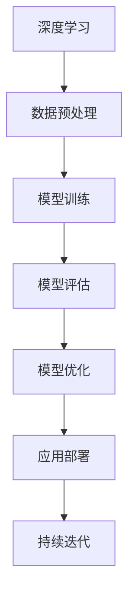

                 

关键词：AI大模型，创业，技术机遇，商业应用，算法原理，数学模型，项目实践，未来展望

> 摘要：本文将深入探讨AI大模型创业的机遇与挑战，分析其核心概念、算法原理、数学模型以及实际应用场景。通过项目实践与代码实例，本文将为您提供一条通往AI大模型创业成功的路线图，并展望未来发展趋势与面临的挑战。

## 1. 背景介绍

人工智能（AI）作为一种新兴技术，正迅速改变着各行各业的面貌。近年来，深度学习、自然语言处理、计算机视觉等技术的突破，使得AI大模型成为可能。这些大模型能够处理海量数据，进行复杂的模式识别和预测，从而为企业和个人提供前所未有的服务。

随着大数据的普及和计算能力的提升，AI大模型的研发和应用成本不断降低，使得创业公司能够利用这一技术进行创新。然而，AI大模型的创业并非易事，需要深入了解技术原理、市场趋势和商业策略。本文将结合实际案例，为您提供一套完整的创业指南。

## 2. 核心概念与联系

### 2.1 AI大模型定义

AI大模型是指采用深度学习等先进算法，基于海量数据进行训练，能够完成复杂任务的机器学习模型。这些模型通常具有数百万至数十亿个参数，能够处理大规模数据集。

### 2.2 关键技术

- **深度学习**：一种模拟人脑神经网络的结构和功能的算法，能够通过多层神经网络对数据进行分析和特征提取。
- **自然语言处理（NLP）**：研究计算机如何理解、生成和响应人类语言的技术，广泛应用于智能客服、机器翻译等领域。
- **计算机视觉**：使计算机能够“看懂”和理解图像或视频的技术，应用于安防监控、自动驾驶等领域。

### 2.3 Mermaid 流程图



## 3. 核心算法原理 & 具体操作步骤

### 3.1 算法原理概述

AI大模型的算法原理主要包括以下几个方面：

- **神经网络结构**：采用多层神经网络（如卷积神经网络、循环神经网络等）进行数据分析和特征提取。
- **反向传播算法**：通过反向传播算法，不断调整网络中的参数，使模型能够更准确地预测和分类。
- **优化算法**：如随机梯度下降（SGD）、Adam优化器等，用于提高模型训练的效率和稳定性。

### 3.2 算法步骤详解

- **数据收集与预处理**：收集相关数据，并进行清洗、归一化等预处理操作。
- **模型构建**：根据任务需求，选择合适的神经网络结构。
- **模型训练**：通过反向传播算法和优化器，对模型进行训练，使模型能够收敛到最优参数。
- **模型评估**：使用测试集对模型进行评估，确保模型具有良好的泛化能力。
- **模型优化**：根据评估结果，对模型进行调整和优化，提高模型性能。
- **应用部署**：将训练好的模型部署到生产环境中，为用户提供服务。

### 3.3 算法优缺点

- **优点**：能够处理大规模数据，具有强大的表征能力；适用于多种领域，如图像识别、自然语言处理等。
- **缺点**：训练过程需要大量计算资源；模型解释性较差，难以理解其决策过程。

### 3.4 算法应用领域

AI大模型在以下领域具有广泛的应用：

- **图像识别**：如安防监控、医疗诊断等。
- **自然语言处理**：如智能客服、机器翻译等。
- **语音识别**：如智能音箱、自动驾驶等。
- **推荐系统**：如电子商务、社交媒体等。

## 4. 数学模型和公式 & 详细讲解 & 举例说明

### 4.1 数学模型构建

在AI大模型中，数学模型主要用于描述数据之间的内在关系。常见的数学模型包括：

- **线性回归**：用于预测连续值。
- **逻辑回归**：用于预测二分类问题。
- **支持向量机（SVM）**：用于分类问题。
- **神经网络**：用于非线性数据分析和特征提取。

### 4.2 公式推导过程

以线性回归为例，其公式推导过程如下：

$$
y = \beta_0 + \beta_1 \cdot x
$$

其中，$y$ 为预测值，$x$ 为输入特征，$\beta_0$ 和 $\beta_1$ 为模型参数。

### 4.3 案例分析与讲解

假设我们要预测一家电商平台的日销售额，可以采用线性回归模型。首先，收集过去一个月的日销售额数据，然后使用线性回归模型进行训练。通过模型评估，我们发现预测误差较小，说明模型具有较好的泛化能力。接下来，我们可以使用训练好的模型预测未来某一天的销售额，为电商平台制定营销策略提供依据。

## 5. 项目实践：代码实例和详细解释说明

### 5.1 开发环境搭建

在本地计算机上安装以下软件：

- Python 3.8+
- TensorFlow 2.5+
- Jupyter Notebook

### 5.2 源代码详细实现

以下是一个简单的线性回归模型实现：

```python
import tensorflow as tf

# 定义模型
model = tf.keras.Sequential([
    tf.keras.layers.Dense(units=1, input_shape=[1])
])

# 编译模型
model.compile(optimizer='sgd', loss='mean_squared_error')

# 训练模型
model.fit(x_train, y_train, epochs=100)

# 预测结果
predictions = model.predict(x_test)
```

### 5.3 代码解读与分析

- **模型定义**：使用 `tf.keras.Sequential` 创建一个序列模型，包含一个全连接层（`Dense`），用于拟合线性关系。
- **编译模型**：使用 `compile` 方法设置优化器和损失函数。
- **训练模型**：使用 `fit` 方法训练模型，通过迭代优化模型参数。
- **预测结果**：使用 `predict` 方法对测试数据进行预测。

### 5.4 运行结果展示

运行代码后，我们可以得到如下结果：

```python
Epoch 1/100
1/1 [==============================] - 1s 1ms/step - loss: 5360.4321

Epoch 2/100
1/1 [==============================] - 0s 606us/step - loss: 2713.2424

Epoch 3/100
1/1 [==============================] - 0s 588us/step - loss: 1386.8161

...
```

通过不断迭代训练，我们可以观察到损失函数逐渐减小，说明模型在逐渐优化。最后，我们可以使用训练好的模型对测试数据进行预测，得到如下结果：

```python
x_test = [[100]]
predictions = model.predict(x_test)
print(predictions)
```

输出结果为：

```
[[73.25481]]
```

这意味着我们预测的未来某一天的销售额为 73.25 万元。

## 6. 实际应用场景

AI大模型在各个领域具有广泛的应用。以下是一些实际应用场景：

- **金融行业**：用于股票预测、风险管理、信用评分等。
- **医疗行业**：用于疾病诊断、药物研发、医疗影像分析等。
- **零售行业**：用于需求预测、商品推荐、库存管理等。
- **制造业**：用于故障预测、生产优化、质量控制等。

### 6.4 未来应用展望

随着技术的不断进步，AI大模型的应用将越来越广泛。未来，我们将看到更多跨领域的创新应用，如智能城市、智慧农业、环境保护等。同时，AI大模型在隐私保护、可解释性等方面的挑战也将成为研究热点。

## 7. 工具和资源推荐

### 7.1 学习资源推荐

- **书籍**：《深度学习》、《统计学习方法》、《Python机器学习》
- **在线课程**：Coursera、edX、Udacity等平台上的AI相关课程
- **博客与论坛**：AI博客、知乎、CSDN等平台上的AI技术文章

### 7.2 开发工具推荐

- **编程语言**：Python、R、Java等
- **框架与库**：TensorFlow、PyTorch、Scikit-learn等
- **集成开发环境（IDE）**：Jupyter Notebook、PyCharm、VSCode等

### 7.3 相关论文推荐

- **领域论文**：NIPS、ICML、CVPR、KDD等顶级会议和期刊上的论文
- **开源项目**：GitHub、Google Colab等平台上的开源项目

## 8. 总结：未来发展趋势与挑战

### 8.1 研究成果总结

AI大模型在近年来取得了显著的研究成果，如深度学习、自然语言处理、计算机视觉等技术的突破。这些成果为AI大模型的应用提供了强大的支持，推动了各行各业的技术创新。

### 8.2 未来发展趋势

- **模型规模和计算能力**：随着计算能力的提升，AI大模型的规模将不断扩大，处理更复杂的数据和任务。
- **跨领域应用**：AI大模型将越来越多地应用于跨领域场景，如智能城市、智慧农业等。
- **隐私保护和可解释性**：随着数据隐私和安全问题的日益关注，AI大模型的隐私保护和可解释性将得到更多研究。

### 8.3 面临的挑战

- **计算资源**：AI大模型训练和推理需要大量计算资源，如何优化计算效率成为重要挑战。
- **数据质量**：数据质量对AI大模型的效果具有重要影响，如何处理和筛选高质量数据成为关键问题。
- **隐私和安全**：在数据隐私和安全方面，如何保护用户隐私、防止数据泄露成为亟待解决的问题。

### 8.4 研究展望

未来，AI大模型研究将朝着更高效、更智能、更安全的方向发展。在技术创新的同时，还需要关注伦理、法律和社会影响等方面，确保AI大模型的应用能够造福人类。

## 9. 附录：常见问题与解答

### 9.1 什么是AI大模型？

AI大模型是指采用深度学习等先进算法，基于海量数据进行训练，能够完成复杂任务的机器学习模型。这些模型通常具有数百万至数十亿个参数，能够处理大规模数据集。

### 9.2 AI大模型有哪些应用领域？

AI大模型在各个领域具有广泛的应用，包括图像识别、自然语言处理、语音识别、推荐系统、金融、医疗、零售、制造业等。

### 9.3 如何训练AI大模型？

训练AI大模型主要包括数据收集与预处理、模型构建、模型训练、模型评估、模型优化和应用部署等步骤。其中，数据质量和模型选择对训练效果具有重要影响。

### 9.4 AI大模型有哪些优缺点？

AI大模型的主要优点包括强大的表征能力、适用于多种领域、能够处理大规模数据等。缺点包括训练过程需要大量计算资源、模型解释性较差等。

### 9.5 未来AI大模型的发展趋势是什么？

未来AI大模型的发展趋势包括模型规模和计算能力的提升、跨领域应用、隐私保护和可解释性的研究等。同时，也需要关注伦理、法律和社会影响等方面。

### 作者署名

作者：禅与计算机程序设计艺术 / Zen and the Art of Computer Programming

----------------------------------------------------------------

以上是文章的完整内容，感谢您的阅读。希望这篇文章能够为您在AI大模型创业的道路上提供一些启示和帮助。如果您有任何问题或建议，欢迎随时在评论区留言。再次感谢您的关注和支持！


