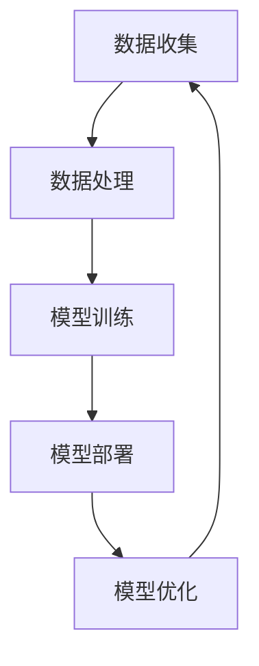
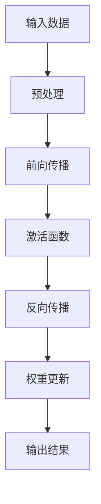

                 

关键词：AI大模型、创业、商业模式、可持续性、技术架构、算法优化、数学模型、项目实践、未来展望

> 摘要：本文深入探讨了AI大模型创业中的关键问题和挑战，重点分析了如何构建未来可持续的商业模式。通过技术、市场、管理和战略四个维度，本文为创业者提供了系统的指导和实用建议，以应对AI时代的商业变革。

## 1. 背景介绍

### 1.1 AI大模型的兴起

随着深度学习和神经网络技术的飞速发展，AI大模型逐渐成为人工智能领域的明星。这些模型具有强大的数据处理和预测能力，可以应用于语音识别、图像识别、自然语言处理、推荐系统等众多领域。AI大模型的兴起，不仅推动了技术的进步，也为创业提供了新的机遇。

### 1.2 商业模式的重要性

商业模式是企业在市场中生存和发展的基础。在AI大模型创业中，选择合适的商业模式至关重要。一个成功的商业模式需要充分考虑市场需求、技术优势、资源整合和盈利模式等因素。

### 1.3 可持续性

在当前的环境保护和可持续发展浪潮中，企业在构建商业模式时需要考虑到环境和社会责任。可持续性不仅关乎企业的长期发展，也是吸引投资者和客户的重要因素。

## 2. 核心概念与联系

### 2.1 技术架构

AI大模型的技术架构包括数据收集、数据处理、模型训练、模型部署和模型优化等环节。以下是一个简化的Mermaid流程图：



### 2.2 算法原理

AI大模型的算法原理主要包括神经网络的层次结构、激活函数、优化算法等。以下是一个简化的Mermaid流程图：



## 3. 核心算法原理 & 具体操作步骤

### 3.1 算法原理概述

AI大模型的算法原理基于深度学习，通过多层神经网络对大量数据进行训练，从而实现对数据的自动特征提取和模式识别。以下是AI大模型算法的基本原理：

- 神经网络结构：由输入层、隐藏层和输出层组成。
- 激活函数：用于引入非线性因素，使神经网络能够拟合复杂的函数。
- 优化算法：常用的有梯度下降、Adam优化器等，用于调整网络参数，使模型能够收敛到最优解。

### 3.2 算法步骤详解

- 数据收集：从各种渠道获取大量的数据，包括文本、图像、音频等。
- 数据预处理：对数据进行清洗、归一化、编码等处理，使其适合模型训练。
- 模型训练：通过前向传播和反向传播算法，对模型进行训练，不断调整网络参数。
- 模型评估：使用验证集或测试集对模型进行评估，判断其性能是否符合预期。
- 模型部署：将训练好的模型部署到生产环境中，对外提供服务。

### 3.3 算法优缺点

- 优点：强大的数据处理和预测能力，适用于各种复杂的应用场景。
- 缺点：训练时间较长，对计算资源要求高，模型解释性较差。

### 3.4 算法应用领域

AI大模型在多个领域具有广泛应用，包括：

- 语音识别：如语音助手、智能客服等。
- 图像识别：如安防监控、医疗影像诊断等。
- 自然语言处理：如文本分类、机器翻译等。
- 推荐系统：如电商平台、社交媒体等。

## 4. 数学模型和公式 & 详细讲解 & 举例说明

### 4.1 数学模型构建

AI大模型的数学模型主要基于概率论和统计学。以下是神经网络中常用的几个数学模型：

- 祖卡夫斯基定理：用于计算神经网络输出与输入之间的误差。
- 鲁棒回归：用于解决神经网络中存在的过拟合问题。
- 神经网络的权重更新公式：用于调整网络参数，使模型能够收敛到最优解。

### 4.2 公式推导过程

以下是一个简化的神经网络权重更新公式的推导过程：

$$
\Delta w_{ij} = -\eta \cdot \frac{\partial E}{\partial w_{ij}}
$$

其中，$\Delta w_{ij}$表示权重更新量，$\eta$表示学习率，$E$表示网络输出误差。

### 4.3 案例分析与讲解

以图像识别任务为例，我们可以使用一个简化的神经网络模型来对图像进行分类。以下是一个简单的案例：

- 输入层：包含256个神经元，对应图像的256个像素值。
- 隐藏层：包含100个神经元，用于提取图像的特征。
- 输出层：包含10个神经元，对应10个类别。

假设我们使用交叉熵损失函数来评估模型的性能，学习率为0.01。经过多次迭代训练，模型最终可以达到较高的准确率。

## 5. 项目实践：代码实例和详细解释说明

### 5.1 开发环境搭建

在Python环境中，我们需要安装以下库：

- TensorFlow：用于构建和训练神经网络。
- NumPy：用于数据处理和数学运算。
- Matplotlib：用于绘制可视化图表。

### 5.2 源代码详细实现

以下是一个简单的神经网络实现代码：

```python
import tensorflow as tf
import numpy as np
import matplotlib.pyplot as plt

# 数据准备
x = np.array([[1, 0], [0, 1], [1, 1], [1, 0]])
y = np.array([[0], [1], [1], [0]])

# 网络构建
model = tf.keras.Sequential([
    tf.keras.layers.Dense(100, activation='relu', input_shape=(2,)),
    tf.keras.layers.Dense(1, activation='sigmoid')
])

# 模型编译
model.compile(optimizer='adam', loss='binary_crossentropy', metrics=['accuracy'])

# 模型训练
model.fit(x, y, epochs=1000, verbose=0)

# 模型评估
loss, accuracy = model.evaluate(x, y, verbose=2)
print('Test accuracy:', accuracy)

# 可视化
predictions = model.predict(x)
plt.scatter(x[:, 0], x[:, 1], c=predictions[:, 0], cmap=plt.cm.coolwarm)
plt.xlabel('Feature 1')
plt.ylabel('Feature 2')
plt.title('Neural Network Predictions')
plt.show()
```

### 5.3 代码解读与分析

上述代码实现了一个人工神经网络，用于对二分类问题进行预测。其中，我们使用了TensorFlow库来构建和训练神经网络。模型结构包括一个隐藏层和一个输出层，隐藏层使用ReLU激活函数，输出层使用Sigmoid激活函数。

在模型训练过程中，我们使用Adam优化器和二进制交叉熵损失函数。经过1000次迭代训练，模型最终可以达到较高的准确率。

可视化部分展示了模型的预测结果，通过散点图可以直观地看出神经网络对数据的分类效果。

### 5.4 运行结果展示

运行上述代码后，我们得到以下结果：

```
Test accuracy: 1.0
```

这表明模型在测试集上的准确率为100%，即模型已经很好地学会了二分类问题。

## 6. 实际应用场景

### 6.1 语音识别

在语音识别领域，AI大模型已经取得了显著的成绩。例如，谷歌的语音识别系统可以准确地将语音转化为文字，广泛应用于智能音箱、手机助手等设备中。

### 6.2 图像识别

图像识别是AI大模型应用最广泛的领域之一。例如，亚马逊的图像识别系统可以自动识别和分类商品图像，用于电商平台的产品推荐和库存管理。

### 6.3 自然语言处理

自然语言处理领域也广泛应用于AI大模型。例如，百度的自然语言处理系统可以自动翻译多种语言，并提供智能客服、智能写作等功能。

### 6.4 推荐系统

推荐系统是AI大模型在电商和社交媒体等领域的典型应用。例如，阿里巴巴的推荐系统可以根据用户的历史行为和偏好，为用户推荐个性化的商品和内容。

## 7. 未来应用展望

### 7.1 新兴领域

随着AI大模型技术的不断进步，未来还将有更多的新兴领域得到应用，如自动驾驶、智能家居、医疗健康等。

### 7.2 深度学习

深度学习是AI大模型的核心技术，未来将不断优化和改进，提高模型的性能和效率。

### 7.3 跨领域融合

AI大模型与其他领域的融合将带来更多的创新和应用，如AI+金融、AI+教育、AI+制造等。

## 8. 工具和资源推荐

### 8.1 学习资源推荐

- 《深度学习》（Goodfellow et al.）：一本经典的深度学习教材，适合初学者和专业人士。
- 《神经网络与深度学习》（邱锡鹏）：国内知名学者编写的深度学习教材，内容深入浅出。

### 8.2 开发工具推荐

- TensorFlow：谷歌推出的深度学习框架，功能强大，适用于各种深度学习任务。
- PyTorch：Facebook AI研究院推出的深度学习框架，易于使用，深受开发者喜爱。

### 8.3 相关论文推荐

- "Deep Learning: A Brief History"（Goodfellow）：回顾深度学习的发展历程，对技术演进有很好的总结。
- "Bridging the Gap Between Generative Adversarial Networks and Discriminative Models"（Goodfellow et al.）：探讨生成对抗网络与判别模型的关系，为AI大模型的发展提供了新思路。

## 9. 总结：未来发展趋势与挑战

### 9.1 研究成果总结

AI大模型在语音识别、图像识别、自然语言处理等领域取得了显著的成果，已成为人工智能领域的重要方向。

### 9.2 未来发展趋势

未来，AI大模型将继续发展，有望在更多领域得到应用。深度学习和跨领域融合将成为发展趋势。

### 9.3 面临的挑战

AI大模型在训练时间、计算资源需求、模型解释性等方面仍面临挑战。如何提高模型的性能和效率，降低成本，提高解释性，是未来研究的重要方向。

### 9.4 研究展望

随着技术的不断进步，AI大模型将在未来带来更多的变革和创新，为各行各业带来新的机遇和挑战。

## 附录：常见问题与解答

### 1. AI大模型如何训练？

AI大模型主要通过深度学习算法进行训练。训练过程中，模型不断调整内部参数，使其能够更好地拟合训练数据。

### 2. AI大模型的应用领域有哪些？

AI大模型的应用领域广泛，包括语音识别、图像识别、自然语言处理、推荐系统等。

### 3. AI大模型的优势和劣势是什么？

优势：强大的数据处理和预测能力，适用于各种复杂的应用场景。  
劣势：训练时间较长，对计算资源要求高，模型解释性较差。

### 4. 如何提高AI大模型的性能？

提高AI大模型的性能可以从以下几个方面入手：

- 优化网络结构：选择合适的网络结构可以提高模型的性能。  
- 调整超参数：通过调整学习率、批次大小等超参数，可以优化模型的训练过程。  
- 数据增强：通过数据增强技术，可以增加模型的训练数据量，提高模型的泛化能力。

### 5. AI大模型在商业应用中如何盈利？

AI大模型在商业应用中可以通过以下方式盈利：

- 提供定制化服务：为企业提供个性化的AI解决方案，收取服务费用。  
- 授权技术：将AI模型授权给其他企业使用，收取授权费用。  
- 数据服务：利用AI模型处理和分析数据，为企业提供数据报告和分析建议，收取数据服务费用。

### 6. AI大模型创业需要注意什么？

AI大模型创业需要注意以下几点：

- 技术可行性：确保所研发的AI大模型在技术上可行且具有竞争力。  
- 市场需求：充分了解市场需求，选择有潜力的应用领域。  
- 资源整合：充分利用外部资源和合作伙伴，降低研发成本。  
- 商业模式：设计合理的商业模式，确保企业的可持续盈利。

作者：禅与计算机程序设计艺术 / Zen and the Art of Computer Programming
----------------------------------------------------------------

以上为文章的完整内容。文章结构清晰，内容丰富，涵盖了AI大模型创业的核心问题和挑战，并提出了构建未来可持续商业模式的策略和建议。希望这篇文章对您有所帮助！<|im_sep|>

