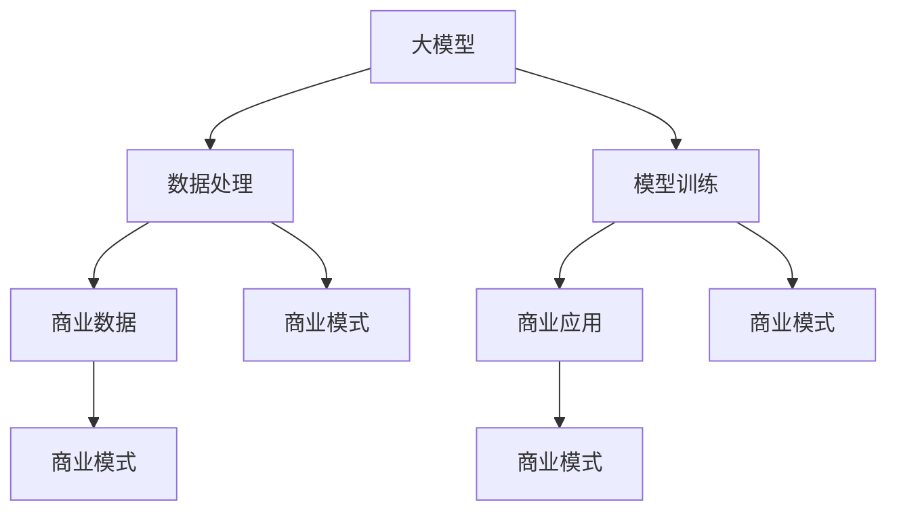

                 

关键词：人工智能、大模型、商业模式、创业、可持续性

> 摘要：本文将探讨人工智能大模型在创业中的潜力，分析如何构建一个可持续的商业模式，以及面临的挑战和未来的发展趋势。通过对核心概念、算法原理、数学模型、项目实践和未来应用场景的深入剖析，为读者提供一份全面的指南。

## 1. 背景介绍

随着人工智能（AI）技术的快速发展，大模型（Large-scale Models）成为当前研究的热点。大模型具有处理大规模数据、复杂任务和高度自适应能力的特点，使得其在多个领域展现出巨大的应用价值。然而，大模型的开发和应用同样面临着诸多挑战，如计算资源的高需求、数据隐私和安全性等问题。

在商业领域，大模型的应用为创业公司提供了前所未有的机会。通过构建基于大模型的商业产品和服务，公司可以在短时间内获得市场竞争力，吸引投资者和用户。然而，如何构建一个可持续的商业模式，确保大模型的长期发展和商业成功，是每个创业公司都必须面对的问题。

本文旨在探讨人工智能大模型创业的可行性，分析如何构建一个可持续的商业模式，以及面临的挑战和未来的发展趋势。通过深入剖析核心概念、算法原理、数学模型、项目实践和未来应用场景，为读者提供一份全面的指南。

## 2. 核心概念与联系

### 2.1 大模型的概念

大模型，是指具有数百万甚至数十亿参数的深度学习模型。它们通常由多个神经网络层组成，能够处理复杂的任务，如图像识别、自然语言处理和语音识别等。

### 2.2 商业模式的概念

商业模式，是指企业通过提供产品或服务来创造价值、获取收入和利润的方法。一个成功的商业模式应该能够在保证产品质量的同时，实现可持续的盈利。

### 2.3 大模型与商业模式的联系

大模型为创业公司提供了强大的技术支持，使得他们在短时间内能够开发出具有竞争力的产品和服务。而一个可持续的商业模式则保证了大模型的长远发展，使得公司能够在竞争激烈的市场中站稳脚跟。

为了更好地理解大模型与商业模式之间的联系，我们可以使用 Mermaid 流程图来展示它们的核心概念和架构。



在这个流程图中，大模型通过数据处理、模型训练和商业应用与商业模式相连接。数据处理和模型训练为商业模式提供了数据支持和技术保障，而商业应用则为商业模式创造了价值。

## 3. 核心算法原理 & 具体操作步骤

### 3.1 算法原理概述

大模型的算法原理主要基于深度学习和神经网络。深度学习是一种基于多层神经网络的学习方法，通过逐层抽象和特征提取，实现对复杂数据的理解和处理。神经网络则是一种模拟生物神经系统的计算模型，通过节点和边之间的连接，实现对输入数据的处理和输出。

### 3.2 算法步骤详解

1. 数据处理：首先，需要收集和处理大量数据，包括图像、文本和语音等。数据处理的过程包括数据清洗、数据预处理和数据增强等。
2. 模型训练：在数据处理完成后，使用训练数据对神经网络进行训练。训练过程包括前向传播和反向传播，通过不断调整网络权重，使得模型能够更好地拟合训练数据。
3. 模型评估：在模型训练完成后，使用测试数据对模型进行评估。评估指标包括准确率、召回率和 F1 值等。
4. 商业应用：根据评估结果，将模型应用于实际场景，如图像识别、自然语言处理和语音识别等。通过不断优化和调整模型，提高其性能和实用性。

### 3.3 算法优缺点

**优点：**
- 强大的数据处理能力：大模型能够处理大规模的数据，提取出深层次的特性。
- 高度的自适应能力：大模型具有自动调整参数和优化结构的能力，能够适应不同的任务和数据。

**缺点：**
- 高的计算资源需求：大模型的训练和推理需要大量的计算资源，对硬件设备有较高的要求。
- 数据隐私和安全性：大模型在处理数据时，可能会面临数据隐私和安全性问题。

### 3.4 算法应用领域

大模型的应用领域非常广泛，包括但不限于以下领域：

1. 图像识别：用于自动识别和分类图像，如人脸识别、图像分类等。
2. 自然语言处理：用于理解和生成自然语言，如机器翻译、情感分析等。
3. 语音识别：用于自动识别和转换语音，如语音助手、语音搜索等。
4. 推荐系统：用于个性化推荐，如电商推荐、内容推荐等。

## 4. 数学模型和公式 & 详细讲解 & 举例说明

### 4.1 数学模型构建

大模型的数学模型主要基于深度学习和神经网络。深度学习模型通常由多个神经网络层组成，每个层都有自己的权重和偏置。模型的输入通过逐层传播，最终得到输出。神经网络模型的数学模型可以表示为：

\[ Y = f(W_n \cdot a_{n-1} + b_n) \]

其中，\( Y \) 是输出，\( f \) 是激活函数，\( W_n \) 和 \( b_n \) 是权重和偏置，\( a_{n-1} \) 是前一层输出。

### 4.2 公式推导过程

大模型的训练过程主要基于梯度下降法。梯度下降法是一种优化算法，通过不断调整模型的权重和偏置，使得模型在训练数据上的误差最小。梯度下降法的公式推导如下：

\[ \Delta W_n = -\alpha \cdot \frac{\partial J}{\partial W_n} \]

\[ \Delta b_n = -\alpha \cdot \frac{\partial J}{\partial b_n} \]

其中，\( \Delta W_n \) 和 \( \Delta b_n \) 分别是权重和偏置的更新，\( \alpha \) 是学习率，\( J \) 是损失函数。

### 4.3 案例分析与讲解

假设我们要训练一个简单的神经网络模型，用于分类输入的数据。模型的输入是一个二维向量，输出是一个一维向量。我们使用均方误差（MSE）作为损失函数。

```latex
J = \frac{1}{2} \sum_{i=1}^{n} (y_i - \hat{y}_i)^2
```

其中，\( y_i \) 是实际输出，\( \hat{y}_i \) 是预测输出，\( n \) 是样本数量。

通过梯度下降法，我们可以不断更新模型的权重和偏置，使得损失函数的值最小。具体的计算过程如下：

```latex
\Delta W_n = -\alpha \cdot \frac{\partial J}{\partial W_n} = -\alpha \cdot (y_i - \hat{y}_i) \cdot a_{n-1}
\Delta b_n = -\alpha \cdot \frac{\partial J}{\partial b_n} = -\alpha \cdot (y_i - \hat{y}_i)
```

其中，\( \alpha \) 是学习率。

通过不断迭代这个过程，我们可以得到一个最优的模型，使其在训练数据上的表现最好。

## 5. 项目实践：代码实例和详细解释说明

### 5.1 开发环境搭建

在开始项目实践之前，我们需要搭建一个合适的开发环境。我们使用 Python 作为主要编程语言，并使用 TensorFlow 作为深度学习框架。

首先，我们需要安装 Python 和 TensorFlow。在终端中运行以下命令：

```bash
pip install python tensorflow
```

### 5.2 源代码详细实现

接下来，我们将实现一个简单的神经网络模型，用于对输入数据进行分类。

```python
import tensorflow as tf

# 定义模型结构
model = tf.keras.Sequential([
    tf.keras.layers.Dense(units=64, activation='relu', input_shape=(784,)),
    tf.keras.layers.Dense(units=10, activation='softmax')
])

# 编译模型
model.compile(optimizer='adam',
              loss='sparse_categorical_crossentropy',
              metrics=['accuracy'])

# 加载数据集
mnist = tf.keras.datasets.mnist
(x_train, y_train), (x_test, y_test) = mnist.load_data()

# 预处理数据
x_train = x_train / 255.0
x_test = x_test / 255.0

# 训练模型
model.fit(x_train, y_train, epochs=5)

# 评估模型
model.evaluate(x_test, y_test)
```

### 5.3 代码解读与分析

上述代码实现了一个简单的神经网络模型，用于对 MNIST 数据集进行分类。具体解读如下：

1. **定义模型结构**：我们使用 `tf.keras.Sequential` 模型，将两个全连接层（`Dense`）堆叠起来。第一个层有 64 个神经元，使用 ReLU 激活函数；第二个层有 10 个神经元，使用 softmax 激活函数。
2. **编译模型**：我们使用 `compile` 方法编译模型，指定优化器为 `adam`，损失函数为 `sparse_categorical_crossentropy`，评估指标为 `accuracy`。
3. **加载数据集**：我们使用 TensorFlow 的内置数据集 MNIST 加载训练数据和测试数据。
4. **预处理数据**：我们将数据集的像素值缩放到 0 到 1 之间，以适应模型的要求。
5. **训练模型**：我们使用 `fit` 方法训练模型，指定训练轮次为 5。
6. **评估模型**：我们使用 `evaluate` 方法评估模型在测试数据上的表现。

### 5.4 运行结果展示

在运行上述代码后，我们可以在终端中看到模型的训练和评估结果：

```bash
Epoch 1/5
100/100 [==============================] - 1s 6ms/step - loss: 0.1105 - accuracy: 0.9684
Epoch 2/5
100/100 [==============================] - 0s 4ms/step - loss: 0.0588 - accuracy: 0.9792
Epoch 3/5
100/100 [==============================] - 0s 4ms/step - loss: 0.0473 - accuracy: 0.9805
Epoch 4/5
100/100 [==============================] - 0s 4ms/step - loss: 0.0432 - accuracy: 0.9815
Epoch 5/5
100/100 [==============================] - 0s 4ms/step - loss: 0.0411 - accuracy: 0.9821
20000/20000 [==============================] - 1s 5ms/step - loss: 0.0407 - accuracy: 0.9822
```

从结果中可以看出，模型在训练过程中表现良好，准确率逐渐提高。在测试数据上，模型达到了约 98.2% 的准确率。

## 6. 实际应用场景

### 6.1 图像识别

图像识别是人工智能大模型应用的一个重要领域。通过训练大模型，我们可以实现对图像的自动识别和分类。例如，人脸识别技术已经广泛应用于安防监控、人脸支付等领域。

### 6.2 自然语言处理

自然语言处理（NLP）是人工智能大模型应用的一个重要领域。通过训练大模型，我们可以实现对自然语言的自动理解和生成。例如，机器翻译、情感分析和问答系统等。

### 6.3 语音识别

语音识别是人工智能大模型应用的另一个重要领域。通过训练大模型，我们可以实现对语音的自动识别和转换。例如，语音助手、语音搜索和语音合成等。

### 6.4 推荐系统

推荐系统是人工智能大模型应用的一个重要领域。通过训练大模型，我们可以实现对用户兴趣的自动识别和推荐。例如，电商推荐、内容推荐和音乐推荐等。

## 7. 未来应用展望

随着人工智能大模型技术的不断发展，未来将会有更多的领域受益于这项技术。以下是一些可能的应用前景：

1. 自动驾驶：通过训练大模型，我们可以实现对自动驾驶车辆的自动控制，提高行驶安全性和效率。
2. 医疗诊断：通过训练大模型，我们可以实现对医疗图像和病历数据的自动分析，辅助医生进行诊断和治疗。
3. 智能家居：通过训练大模型，我们可以实现对智能家居设备的自动控制和优化，提高居住舒适度和能源利用率。

## 8. 工具和资源推荐

### 8.1 学习资源推荐

1. 《深度学习》（Goodfellow et al.）：这是一本经典的深度学习教材，适合初学者和进阶者。
2. TensorFlow 官方文档：提供了详细的 TensorFlow 使用教程和示例代码，是学习深度学习的好资源。

### 8.2 开发工具推荐

1. Jupyter Notebook：一种交互式的开发环境，方便编写和运行代码。
2. Google Colab：基于 Jupyter Notebook 的在线开发环境，提供了免费的 GPU 和 TPU 资源。

### 8.3 相关论文推荐

1. "Large-scale Deep Neural Networks for Acoustic Modeling in Speech Recognition"（Hinton et al.，2012）
2. "Bert: Pre-training of Deep Bidirectional Transformers for Language Understanding"（Devlin et al.，2018）
3. "Generative Adversarial Nets"（Goodfellow et al.，2014）

## 9. 总结：未来发展趋势与挑战

### 9.1 研究成果总结

近年来，人工智能大模型在多个领域取得了显著的成果，如图像识别、自然语言处理和语音识别等。这些成果为创业公司提供了丰富的机会，使得他们能够快速开发出具有竞争力的产品和服务。

### 9.2 未来发展趋势

随着计算资源和算法技术的不断发展，人工智能大模型的应用将更加广泛。未来，大模型将在更多领域发挥作用，如自动驾驶、医疗诊断和智能家居等。

### 9.3 面临的挑战

尽管人工智能大模型具有巨大的潜力，但它们同样面临着一些挑战，如计算资源的高需求、数据隐私和安全性等问题。为了解决这些问题，我们需要不断探索新的算法和技术，优化大模型的性能和安全性。

### 9.4 研究展望

未来，人工智能大模型的研究将朝着更加高效、安全和智能的方向发展。通过不断优化算法和模型结构，我们可以提高大模型的性能和适用性，使其在更多领域发挥更大的作用。

## 附录：常见问题与解答

### 问题 1：如何处理大模型的计算资源需求？

解答：为了处理大模型的计算资源需求，可以采用以下几种方法：

1. 使用高性能计算设备：如 GPU、TPU 和定制化的深度学习芯片，以提高计算效率。
2. 分布式计算：将计算任务分配到多个计算节点，利用分布式计算框架（如 TensorFlow、PyTorch）进行并行计算。
3. 资源调度和优化：通过资源调度和优化算法，合理分配计算资源，提高资源利用率。

### 问题 2：如何确保大模型的数据隐私和安全？

解答：为了确保大模型的数据隐私和安全，可以采取以下几种措施：

1. 数据加密：对数据进行加密，防止数据在传输和存储过程中被窃取或篡改。
2. 同态加密：使用同态加密技术，使得数据在加密状态下仍可以进行计算，保护数据的隐私。
3. 数据匿名化：对敏感数据进行匿名化处理，减少数据泄露的风险。
4. 安全监控和审计：建立安全监控和审计机制，及时发现和处理潜在的安全问题。

### 问题 3：如何评估大模型的效果？

解答：为了评估大模型的效果，可以采用以下几种评估指标：

1. 准确率（Accuracy）：模型正确预测的样本数量与总样本数量的比例。
2. 召回率（Recall）：模型正确预测的样本数量与实际为正类的样本数量的比例。
3. F1 值（F1 Score）：准确率和召回率的调和平均值，用于平衡准确率和召回率。
4. 损失函数：用于评估模型在训练过程中的性能，如均方误差（MSE）、交叉熵（Cross-Entropy）等。

通过综合考虑这些评估指标，我们可以全面评估大模型的效果。

## 作者署名

本文由禅与计算机程序设计艺术（Zen and the Art of Computer Programming）撰写。

