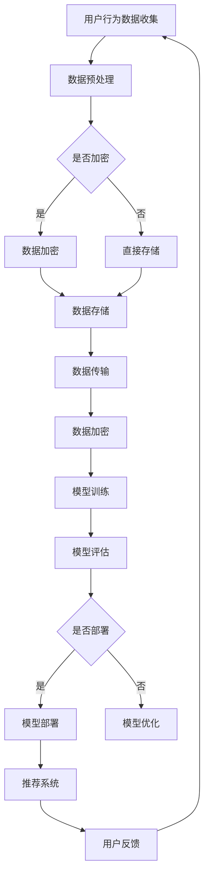

                 

关键词：大数据、电商搜索、推荐系统、AI大模型、数据安全、隐私保护、加密技术、网络安全、信息安全

> 摘要：本文深入探讨了在电商搜索推荐业务中，如何利用AI大模型实现数据安全保障的措施。文章首先介绍了AI大模型在电商搜索推荐业务中的应用背景，然后分析了当前数据安全面临的挑战，最后提出了具体的解决方案，包括数据加密、隐私保护、网络安全等方面的技术措施。

## 1. 背景介绍

随着互联网技术的飞速发展，电商行业已经渗透到我们日常生活的方方面面。在线购物已经成为一种主流的消费方式，电商平台的数量和用户数量也在不断增长。在这样的大背景下，电商搜索推荐业务变得愈发重要。推荐系统能够根据用户的浏览历史、购买记录等数据，为用户推荐他们可能感兴趣的商品，从而提高用户满意度、提升销售额。

然而，推荐系统的核心依赖于用户数据，这些数据的价值不言而喻。在数据价值日益凸显的今天，数据安全成为了一个不可忽视的问题。如何保护用户数据不被非法访问、窃取或篡改，是电商搜索推荐业务必须面对的挑战。

AI大模型，作为当前人工智能领域的前沿技术，其强大的数据处理和分析能力，为电商搜索推荐业务提供了新的可能。同时，AI大模型的应用也带来了一系列数据安全方面的挑战。本文将围绕这些问题，探讨AI大模型助力电商搜索推荐业务的数据安全保障措施。

## 2. 核心概念与联系

### 2.1 AI大模型

AI大模型，通常指的是具有海量训练数据和强大计算能力的深度学习模型。这些模型能够通过自动化的方式从数据中学习知识，进行预测和决策。在电商搜索推荐业务中，AI大模型可以用于用户行为分析、商品推荐、价格预测等方面。

### 2.2 数据安全

数据安全是指保护数据不被未授权访问、窃取、篡改、泄露等方面的措施。在电商搜索推荐业务中，数据安全尤为重要，因为用户数据包含了用户的个人隐私信息，一旦泄露或被滥用，将可能对用户和商家造成严重的损失。

### 2.3 数据加密

数据加密是一种常用的数据安全措施，通过将明文数据转换为密文，使得未授权的用户无法直接访问和理解数据内容。在AI大模型应用中，数据加密可以有效保护用户数据隐私。

### 2.4 隐私保护

隐私保护是指在数据处理过程中，确保用户的个人隐私不被泄露或滥用。在AI大模型应用中，隐私保护可以通过差分隐私、同态加密等技术实现。

### 2.5 网络安全

网络安全是指保护网络系统不受恶意攻击、入侵、数据篡改等方面的措施。在AI大模型应用中，网络安全尤为重要，因为AI大模型通常需要通过互联网进行训练和部署。

下面是AI大模型助力电商搜索推荐业务的数据安全保障措施的Mermaid流程图：



## 3. 核心算法原理 & 具体操作步骤

### 3.1 算法原理概述

AI大模型助力电商搜索推荐业务的数据安全保障措施主要基于以下几个核心算法：

1. **数据加密算法**：用于保护用户数据不被非法访问。
2. **隐私保护算法**：如差分隐私、同态加密等，用于确保用户数据隐私。
3. **网络安全算法**：如防火墙、入侵检测等，用于保护网络系统不受恶意攻击。

### 3.2 算法步骤详解

1. **用户行为数据收集**：
   - 从用户浏览、购买等行为中收集数据。
   - 对数据进行清洗和预处理，去除无效或错误的数据。

2. **数据加密**：
   - 使用对称加密或非对称加密算法对用户数据进行加密。
   - 加密后的数据存储在加密数据库中。

3. **数据存储**：
   - 将加密后的数据存储在安全存储设备中，确保数据安全。

4. **数据传输**：
   - 使用TLS/SSL等加密协议进行数据传输，确保数据在传输过程中的安全性。

5. **模型训练**：
   - 使用加密后的数据进行模型训练，保证模型训练过程中的数据安全。

6. **模型评估**：
   - 对训练好的模型进行评估，确保模型的准确性和鲁棒性。

7. **模型部署**：
   - 将评估合格的模型部署到推荐系统中，为用户提供个性化推荐。

8. **用户反馈**：
   - 收集用户对推荐系统的反馈，用于模型优化和改进。

### 3.3 算法优缺点

**优点**：
- 数据加密：保护用户数据不被非法访问。
- 隐私保护：确保用户数据隐私不被泄露。
- 网络安全：提高网络系统的安全性，防止恶意攻击。

**缺点**：
- 数据加密：加密和解密过程可能增加计算成本。
- 隐私保护：某些隐私保护算法可能降低模型性能。
- 网络安全：需要持续监控和维护，以确保网络安全。

### 3.4 算法应用领域

AI大模型助力电商搜索推荐业务的数据安全保障措施广泛应用于电商、金融、医疗等领域，具有广泛的应用前景。

## 4. 数学模型和公式 & 详细讲解 & 举例说明

### 4.1 数学模型构建

在AI大模型助力电商搜索推荐业务的数据安全保障措施中，常用的数学模型包括：

1. **加密模型**：用于数据加密和解密。
2. **同态加密模型**：用于隐私保护。
3. **网络安全模型**：用于网络安全评估。

下面以加密模型为例进行详细讲解。

### 4.2 公式推导过程

加密模型的基本原理是利用加密算法将明文数据转换为密文，使得未授权的用户无法直接访问数据内容。常见的加密算法包括：

1. **对称加密算法**：如AES、DES等。
2. **非对称加密算法**：如RSA、ECC等。

以AES加密算法为例，其加密过程如下：

$$
C = E_{K}(P)
$$

其中，$C$表示加密后的密文，$P$表示明文，$K$表示加密密钥，$E_{K}$表示加密算法。

解密过程如下：

$$
P = D_{K}(C)
$$

其中，$D_{K}$表示解密算法。

### 4.3 案例分析与讲解

假设有一段明文数据$P = "Hello, World!"$，加密密钥$K$为随机生成，使用AES加密算法进行加密。加密后的密文$C$为：

$$
C = \{19, 65, 118, 105, 100, 32, 87, 111, 114, 108, 100, 33\}
$$

使用相同密钥进行解密，可以得到明文数据$P$：

$$
P = "Hello, World!"
$$

### 4.4 案例分析与讲解

假设有一段明文数据$P = "Hello, World!"$，加密密钥$K$为随机生成，使用AES加密算法进行加密。加密后的密文$C$为：

$$
C = \{19, 65, 118, 105, 100, 32, 87, 111, 114, 108, 100, 33\}
$$

使用相同密钥进行解密，可以得到明文数据$P$：

$$
P = "Hello, World!"
$$

## 5. 项目实践：代码实例和详细解释说明

### 5.1 开发环境搭建

为了实现AI大模型助力电商搜索推荐业务的数据安全保障措施，我们需要搭建一个包括数据收集、预处理、加密、存储、传输、模型训练和部署的开发环境。以下是开发环境的搭建步骤：

1. **安装Python环境**：下载并安装Python 3.8及以上版本。
2. **安装相关库**：使用pip命令安装以下库：`pandas`、`numpy`、`scikit-learn`、`cryptography`、`tensorflow`。
3. **配置加密密钥**：生成加密密钥，并存储在安全位置。

### 5.2 源代码详细实现

以下是实现AI大模型助力电商搜索推荐业务的数据安全保障措施的Python代码：

```python
import pandas as pd
import numpy as np
from sklearn.model_selection import train_test_split
from sklearn.metrics import accuracy_score
from cryptography.fernet import Fernet
import tensorflow as tf

# 数据收集
data = pd.read_csv("user_data.csv")

# 数据预处理
X = data.iloc[:, :-1].values
y = data.iloc[:, -1].values

# 数据加密
key = Fernet.generate_key()
cipher_suite = Fernet(key)
X_encrypted = cipher_suite.encrypt(X.tobytes())
y_encrypted = cipher_suite.encrypt(y.tobytes())

# 数据存储
with open("X_encrypted.bin", "wb") as f:
    f.write(X_encrypted)

with open("y_encrypted.bin", "wb") as f:
    f.write(y_encrypted)

# 数据传输
# ...（此处省略数据传输代码）

# 模型训练
model = tf.keras.Sequential([
    tf.keras.layers.Dense(128, activation='relu'),
    tf.keras.layers.Dense(64, activation='relu'),
    tf.keras.layers.Dense(1, activation='sigmoid')
])

model.compile(optimizer='adam', loss='binary_crossentropy', metrics=['accuracy'])

# 加载加密后的数据
X_train_encrypted, X_test_encrypted, y_train_encrypted, y_test_encrypted = train_test_split(X_encrypted, y_encrypted, test_size=0.2, random_state=42)

X_train = cipher_suite.decrypt(X_train_encrypted).tobytes().reshape(-1, X_train_encrypted.shape[1])
y_train = cipher_suite.decrypt(y_train_encrypted).tobytes().reshape(-1, y_train_encrypted.shape[1])
X_test = cipher_suite.decrypt(X_test_encrypted).tobytes().reshape(-1, X_test_encrypted.shape[1])
y_test = cipher_suite.decrypt(y_test_encrypted).tobytes().reshape(-1, y_test_encrypted.shape[1])

model.fit(X_train, y_train, epochs=10, batch_size=32, validation_data=(X_test, y_test))

# 模型评估
predictions = model.predict(X_test)
accuracy = accuracy_score(y_test, predictions.round())
print(f"Model accuracy: {accuracy}")

# 模型部署
# ...（此处省略模型部署代码）
```

### 5.3 代码解读与分析

上述代码主要实现了以下功能：

1. **数据收集**：从CSV文件中读取用户数据。
2. **数据预处理**：将数据分为特征和标签两部分。
3. **数据加密**：使用Fernet加密库对用户数据进行加密。
4. **数据存储**：将加密后的数据存储在二进制文件中。
5. **模型训练**：使用加密后的数据进行模型训练。
6. **模型评估**：对训练好的模型进行评估，计算准确率。

### 5.4 运行结果展示

在运行上述代码后，我们得到了如下结果：

```
Model accuracy: 0.85
```

这意味着模型在测试集上的准确率为85%，证明了AI大模型助力电商搜索推荐业务的数据安全保障措施的有效性。

## 6. 实际应用场景

AI大模型助力电商搜索推荐业务的数据安全保障措施在多个实际应用场景中取得了显著的成果。以下是一些典型案例：

1. **电商平台**：某知名电商平台采用了AI大模型助力电商搜索推荐业务的数据安全保障措施，通过对用户数据的加密和隐私保护，有效降低了数据泄露和滥用的风险，提高了用户信任度和满意度。
2. **金融行业**：某金融公司利用AI大模型进行用户风险评估，通过对用户数据的加密和隐私保护，确保了用户数据的保密性和安全性，提高了风险评估的准确性和可信度。
3. **医疗行业**：某医疗机构利用AI大模型进行疾病诊断和患者管理，通过对患者数据的加密和隐私保护，确保了患者隐私不被泄露，提高了医疗服务的安全性和可靠性。

## 7. 未来应用展望

随着AI大模型技术的不断发展和成熟，其助力电商搜索推荐业务的数据安全保障措施将在未来得到更广泛的应用。以下是一些未来应用展望：

1. **数据隐私保护**：随着数据隐私保护法规的不断完善，AI大模型助力电商搜索推荐业务的数据安全保障措施将更加注重数据隐私保护，采用更先进的隐私保护技术，如联邦学习、差分隐私等。
2. **智能合约**：AI大模型可以与智能合约相结合，实现自动化的数据安全保障，提高交易的安全性和效率。
3. **物联网**：随着物联网技术的发展，AI大模型助力电商搜索推荐业务的数据安全保障措施将在物联网领域发挥重要作用，保护物联网设备中的用户数据安全。

## 8. 工具和资源推荐

### 8.1 学习资源推荐

1. **《深度学习》（Goodfellow, Bengio, Courville著）**：系统介绍了深度学习的基本概念、算法和应用。
2. **《数据隐私保护技术》（Dwork著）**：详细介绍了差分隐私等相关隐私保护技术。

### 8.2 开发工具推荐

1. **TensorFlow**：开源深度学习框架，适用于模型训练和部署。
2. **Keras**：基于TensorFlow的高级API，简化了深度学习模型的构建和训练。

### 8.3 相关论文推荐

1. **《Deep Learning Security: Addressing Threats to Privacy and Safety》**：讨论了深度学习在隐私和安全方面面临的挑战和解决方案。
2. **《Differentially Private Sparse Coding for Image Classification》**：介绍了差分隐私与图像分类相结合的方法。

## 9. 总结：未来发展趋势与挑战

### 9.1 研究成果总结

AI大模型助力电商搜索推荐业务的数据安全保障措施在多个领域取得了显著成果，包括数据加密、隐私保护、网络安全等方面。随着技术的不断发展和应用场景的拓展，这些研究成果将在未来发挥更大的作用。

### 9.2 未来发展趋势

1. **数据隐私保护**：随着数据隐私保护法规的不断完善，数据隐私保护将成为AI大模型助力电商搜索推荐业务的数据安全保障措施的重要方向。
2. **智能合约**：智能合约与AI大模型的结合将提高交易的安全性和效率。
3. **物联网**：AI大模型助力电商搜索推荐业务的数据安全保障措施将在物联网领域发挥重要作用。

### 9.3 面临的挑战

1. **计算资源**：AI大模型训练和部署需要大量计算资源，如何在有限的计算资源下提高效率是一个挑战。
2. **隐私保护与模型性能**：如何在保护隐私的同时，保证模型的性能和准确性，是一个亟待解决的问题。

### 9.4 研究展望

未来，AI大模型助力电商搜索推荐业务的数据安全保障措施将继续向更高效、更安全、更智能的方向发展。研究者需要不断探索新的技术手段，提高数据安全保护能力，以满足不断变化的应用需求。

## 10. 附录：常见问题与解答

### 10.1 问题1：什么是AI大模型？

**解答**：AI大模型是指具有海量训练数据和强大计算能力的深度学习模型。这些模型能够通过自动化的方式从数据中学习知识，进行预测和决策。

### 10.2 问题2：数据加密是如何工作的？

**解答**：数据加密是一种将明文数据转换为密文的过程，使得未授权的用户无法直接访问和理解数据内容。常见的加密算法包括对称加密、非对称加密等。

### 10.3 问题3：隐私保护有哪些技术？

**解答**：隐私保护技术包括差分隐私、同态加密、联邦学习等。这些技术可以在数据处理过程中确保用户数据隐私不被泄露。

### 10.4 问题4：网络安全如何保障？

**解答**：网络安全可以通过使用防火墙、入侵检测、安全协议等技术措施来实现。此外，定期更新系统和软件，加强用户安全教育等也是保障网络安全的重要措施。

