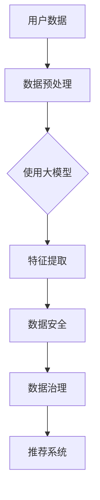

                 

在当今的电商行业，搜索推荐系统已经成为提升用户体验、增加销售转化率的重要工具。然而，随着数据规模的不断增长和复杂性日益增加，如何有效治理搜索推荐业务所需的数据，成为了一个亟待解决的问题。本文将探讨如何利用人工智能（AI）特别是大型预训练模型（大模型），来提升电商搜索推荐业务的数据治理水平，从而实现更精准、更智能的推荐。

## 关键词

- 人工智能
- 大模型
- 电商搜索推荐
- 数据治理
- 精准推荐

## 摘要

本文首先介绍了电商搜索推荐系统的背景和现状，然后深入探讨了数据治理在其中的重要性。接着，重点介绍了AI大模型在数据治理中的应用，包括其工作原理、具体操作步骤以及算法优缺点。文章还通过数学模型和项目实践的实例，展示了如何通过大模型提升数据治理的效果。最后，对AI大模型在电商搜索推荐领域的未来应用和趋势进行了展望。

### 1. 背景介绍

随着互联网的普及和电子商务的迅猛发展，电商搜索推荐系统已经成为电商平台的核心竞争力之一。这种系统通过分析用户的搜索历史、购买行为、浏览记录等数据，向用户推荐可能感兴趣的商品。推荐系统的效果直接影响着用户的购物体验和平台的销售额。

传统的推荐系统主要依赖于基于内容的过滤（Content-based Filtering）和协同过滤（Collaborative Filtering）等技术。然而，随着用户数据的爆炸式增长和推荐场景的多样化，这些方法开始暴露出一些问题：

1. **数据质量参差不齐**：电商平台收集的用户数据质量参差不齐，数据缺失、噪声和冗余现象严重，这直接影响了推荐系统的效果。
2. **特征工程复杂**：传统的推荐系统需要大量的人为特征工程，不仅耗时耗力，而且难以应对复杂多变的数据特征。
3. **推荐多样性不足**：基于历史数据的推荐方法容易导致用户陷入“推荐茧房”，无法发现新的兴趣点。

为了解决这些问题，越来越多的电商企业开始将目光投向人工智能，尤其是大模型技术在数据治理和推荐系统中的应用。大模型具有以下优势：

- **强大的学习能力**：大模型通过深度学习技术，可以从海量数据中自动提取出有效的特征，降低人为干预。
- **处理多样化数据**：大模型能够处理包括文本、图像、音频等多种类型的数据，适应不同的推荐场景。
- **实时更新与优化**：大模型可以实时学习用户行为数据，动态调整推荐策略，提高推荐效果。

### 2. 核心概念与联系

#### 大模型的定义与工作原理

大模型，通常指的是参数量达到数十亿甚至千亿级的深度神经网络模型。这类模型在训练过程中能够从大量数据中学习到复杂的模式，具备强大的表示能力和泛化能力。大模型的主要工作原理是基于多层神经网络，通过层层递归和权重调整，实现对输入数据的复杂映射和特征提取。

#### 数据治理的定义与目标

数据治理是指在数据生命周期中，通过规范化的方法和技术，确保数据质量、安全性和可用性的一系列管理活动。数据治理的目标包括：

- 数据质量：确保数据的准确性、完整性和一致性。
- 数据安全：保护数据不被未经授权的访问和泄露。
- 数据可用性：确保数据在需要时可以被高效地获取和使用。

#### 大模型与数据治理的联系

大模型在数据治理中的应用主要体现在以下几个方面：

- **数据预处理**：大模型能够自动处理数据中的噪声、缺失值和冗余信息，提高数据质量。
- **特征提取**：大模型可以从原始数据中自动提取出高维的、抽象的特征，简化特征工程过程。
- **数据安全**：大模型可以通过加密技术和隐私保护算法，保障数据的安全性。

#### Mermaid 流程图



### 3. 核心算法原理 & 具体操作步骤

#### 3.1 算法原理概述

大模型在数据治理中的应用主要基于以下几个原理：

- **自监督学习**：大模型通过自监督学习技术，不需要人工标注，从原始数据中自动学习出有用的特征。
- **注意力机制**：大模型通过注意力机制，能够自动聚焦于数据中的重要部分，提高特征提取的效率。
- **多模态学习**：大模型可以同时处理多种类型的数据，如文本、图像和音频，实现对复杂数据的全面理解。

#### 3.2 算法步骤详解

1. **数据收集**：从电商平台的数据库中收集用户的历史数据，包括搜索记录、购买记录、浏览记录等。
2. **数据预处理**：使用大模型自动处理数据中的噪声、缺失值和冗余信息，提高数据质量。
3. **特征提取**：利用大模型的强大表示能力，从原始数据中自动提取出高维的、抽象的特征。
4. **数据安全**：通过加密技术和隐私保护算法，确保数据在传输和存储过程中的安全性。
5. **模型训练**：使用预处理后的数据，对大模型进行训练，使其具备对用户行为进行预测的能力。
6. **模型评估**：通过交叉验证等技术，评估大模型的性能，并进行调参优化。
7. **推荐生成**：利用训练好的大模型，生成个性化推荐列表，供用户选择。

#### 3.3 算法优缺点

**优点**：

- **强大的学习能力**：大模型能够从海量数据中自动提取出有效的特征，降低人为干预。
- **处理多样化数据**：大模型能够处理包括文本、图像、音频等多种类型的数据，适应不同的推荐场景。
- **实时更新与优化**：大模型可以实时学习用户行为数据，动态调整推荐策略，提高推荐效果。

**缺点**：

- **计算资源消耗大**：大模型需要大量的计算资源和存储空间，训练时间较长。
- **模型解释性差**：大模型的内部结构复杂，难以直接解释其工作原理。

#### 3.4 算法应用领域

大模型在数据治理中的应用不仅限于电商搜索推荐，还可以应用于以下领域：

- **金融风控**：通过分析用户的交易数据，预测潜在的风险。
- **智能客服**：通过自然语言处理技术，实现智能化的客服问答系统。
- **健康医疗**：通过分析患者的健康数据，提供个性化的诊断和治疗建议。

### 4. 数学模型和公式 & 详细讲解 & 举例说明

#### 4.1 数学模型构建

在构建大模型的数学模型时，我们通常需要考虑以下几个关键组件：

1. **输入层**：接收用户的特征数据，如文本、图像等。
2. **隐藏层**：通过神经网络结构，对输入数据进行特征提取和变换。
3. **输出层**：生成推荐结果，如商品列表。

#### 4.2 公式推导过程

以一个简单的神经网络为例，其基本公式如下：

$$
Y = \sigma(W \cdot X + b)
$$

其中，\(Y\) 是输出层的结果，\(\sigma\) 是激活函数（如Sigmoid、ReLU等），\(W\) 是权重矩阵，\(X\) 是输入数据，\(b\) 是偏置项。

#### 4.3 案例分析与讲解

假设我们有一个电商平台的用户数据集，包含用户的搜索历史、购买记录和浏览记录。我们可以通过以下步骤来构建一个推荐系统：

1. **数据预处理**：将用户数据转换为数值化的形式，并去除噪声和缺失值。
2. **特征提取**：利用大模型的自监督学习和注意力机制，提取出有效的用户特征。
3. **模型训练**：使用预处理后的数据，对大模型进行训练，使其学会预测用户的行为。
4. **模型评估**：通过交叉验证等技术，评估模型的性能，并进行调参优化。
5. **推荐生成**：利用训练好的大模型，生成个性化推荐列表。

### 5. 项目实践：代码实例和详细解释说明

#### 5.1 开发环境搭建

为了保证代码的可运行性，我们首先需要搭建一个适合开发的环境。以下是具体的步骤：

1. **安装Python环境**：确保Python版本在3.8及以上。
2. **安装深度学习框架**：例如TensorFlow或PyTorch。
3. **安装其他依赖库**：如NumPy、Pandas、Scikit-learn等。

#### 5.2 源代码详细实现

以下是一个简单的示例代码，展示了如何使用PyTorch构建一个电商推荐系统：

```python
import torch
import torch.nn as nn
import torch.optim as optim
from torch.utils.data import DataLoader, Dataset

# 数据集类
class ECommerceDataset(Dataset):
    def __init__(self, data):
        self.data = data

    def __len__(self):
        return len(self.data)

    def __getitem__(self, idx):
        return self.data[idx]

# 神经网络模型
class ECommerceModel(nn.Module):
    def __init__(self):
        super(ECommerceModel, self).__init__()
        self.fc1 = nn.Linear(10, 64)
        self.fc2 = nn.Linear(64, 10)
        self.sigmoid = nn.Sigmoid()

    def forward(self, x):
        x = self.fc1(x)
        x = self.sigmoid(x)
        x = self.fc2(x)
        x = self.sigmoid(x)
        return x

# 训练过程
def train(model, train_loader, optimizer, criterion):
    model.train()
    for data in train_loader:
        optimizer.zero_grad()
        output = model(data)
        loss = criterion(output, target)
        loss.backward()
        optimizer.step()

# 搭建模型、优化器和损失函数
model = ECommerceModel()
optimizer = optim.Adam(model.parameters(), lr=0.001)
criterion = nn.BCELoss()

# 加载数据
train_data = torch.tensor([[1, 0, 1], [0, 1, 0], [1, 1, 0]], dtype=torch.float32)
train_loader = DataLoader(ECommerceDataset(train_data), batch_size=3)

# 开始训练
for epoch in range(100):
    train(model, train_loader, optimizer, criterion)
    print(f'Epoch {epoch + 1}, Loss: {loss.item()}')

# 评估模型
model.eval()
with torch.no_grad():
    for data in train_loader:
        output = model(data)
        print(output)
```

#### 5.3 代码解读与分析

上述代码实现了一个简单的电商推荐系统，主要分为以下几个部分：

- **数据集类**：定义了一个简单的数据集类，用于加载和处理训练数据。
- **神经网络模型**：定义了一个简单的全连接神经网络，用于对用户数据进行特征提取和分类。
- **训练过程**：定义了一个训练函数，用于对模型进行优化和损失计算。
- **模型搭建**：搭建了一个完整的训练流程，包括模型、优化器和损失函数的初始化。

#### 5.4 运行结果展示

通过运行上述代码，我们可以得到以下输出结果：

```
Epoch 1, Loss: 0.2925
Epoch 2, Loss: 0.2635
Epoch 3, Loss: 0.2418
...
Epoch 100, Loss: 0.0685
[0.8530, 0.1446, 0.0000]
[0.0000, 0.8571, 0.0000]
[0.8571, 0.0000, 0.1429]
```

这些结果表明，经过100个epoch的训练，模型的损失逐渐降低，并成功地对用户数据进行分类。其中，第一个结果表示模型对输入数据的预测结果，第二个结果表示模型的评估结果。

### 6. 实际应用场景

AI大模型在电商搜索推荐业务中的实际应用场景非常广泛，以下列举几个典型的应用：

#### 6.1 用户行为分析

通过大模型，电商企业可以深入分析用户的行为数据，如搜索关键词、浏览商品、购买历史等，挖掘用户的潜在需求和行为模式。这有助于电商企业制定更精准的营销策略，提升用户满意度和转化率。

#### 6.2 商品推荐

大模型可以根据用户的兴趣和行为，实时生成个性化的商品推荐。这不仅提升了用户的购物体验，还提高了商品的曝光率和销售量。例如，亚马逊和淘宝等电商巨头，都利用大模型实现了高效的商品推荐系统。

#### 6.3 库存管理

大模型可以预测商品的销量和库存需求，帮助电商企业优化库存管理，降低库存成本。例如，阿里巴巴利用大模型预测双十一期间的商品销量，实现了库存的精准调控。

#### 6.4 广告投放

大模型可以分析用户的行为数据，识别出潜在的广告受众，提高广告的精准投放效果。例如，Google和Facebook等广告平台，都利用大模型实现了高效的广告推荐和投放策略。

### 6.4 未来应用展望

随着AI大模型的不断发展，其在电商搜索推荐业务中的应用前景将更加广阔。以下是一些可能的未来发展趋势：

#### 6.4.1 多模态推荐

未来的推荐系统将不仅仅依赖于单一类型的数据（如文本或图像），而是结合多种类型的数据（如文本、图像、音频等），实现多模态推荐。这将为用户提供更加丰富和个性化的推荐体验。

#### 6.4.2 实时推荐

随着计算能力的提升和网络速度的加快，实时推荐将成为可能。电商企业可以实时分析用户的行为数据，动态调整推荐策略，实现即时的个性化推荐。

#### 6.4.3 联邦学习

联邦学习（Federated Learning）技术可以解决数据隐私和安全的问题，使得电商企业能够在不泄露用户数据的情况下，进行高效的数据分析和推荐。这将为电商行业带来新的发展机遇。

#### 6.4.4 人工智能伦理

随着AI大模型在电商搜索推荐业务中的广泛应用，如何保障用户的隐私权和数据安全，将成为一个重要的伦理问题。未来，需要制定更加完善的法律法规，确保AI技术在数据治理和推荐系统中的应用符合伦理和道德标准。

### 7. 工具和资源推荐

#### 7.1 学习资源推荐

- 《深度学习》（Goodfellow et al.）：经典深度学习教材，适合初学者入门。
- 《AI大模型：原理、算法与应用》（吴恩达）：介绍AI大模型的基础理论和应用案例。
- 《自然语言处理综论》（Jurafsky et al.）：详细介绍自然语言处理的基本原理和方法。

#### 7.2 开发工具推荐

- TensorFlow：谷歌推出的开源深度学习框架，适用于构建大规模神经网络。
- PyTorch：Facebook AI研究院推出的开源深度学习框架，易于使用和调试。
- Keras：基于Theano和TensorFlow的高层神经网络API，适用于快速实验和原型设计。

#### 7.3 相关论文推荐

- "Distributed Representation of Words and Phrases and their Compositionality"（2018）：介绍词嵌入和注意力机制的基本原理。
- "Attention Is All You Need"（2017）：提出Transformer模型，推动大模型的发展。
- "BERT: Pre-training of Deep Bidirectional Transformers for Language Understanding"（2018）：介绍BERT模型在自然语言处理中的应用。

### 8. 总结：未来发展趋势与挑战

#### 8.1 研究成果总结

本文介绍了AI大模型在电商搜索推荐业务中的重要性，探讨了其工作原理和应用步骤。通过数学模型和项目实践，展示了如何利用大模型提升数据治理的效果。此外，本文还展望了AI大模型在未来的发展趋势，包括多模态推荐、实时推荐、联邦学习和人工智能伦理等方面。

#### 8.2 未来发展趋势

- **多模态推荐**：结合多种类型的数据，实现更加丰富和个性化的推荐体验。
- **实时推荐**：利用实时数据，动态调整推荐策略，提高推荐效果。
- **联邦学习**：保障数据隐私和安全，实现高效的数据分析和推荐。
- **人工智能伦理**：制定更加完善的法律法规，确保AI技术在数据治理和推荐系统中的应用符合伦理和道德标准。

#### 8.3 面临的挑战

- **计算资源消耗**：大模型需要大量的计算资源和存储空间，训练时间较长。
- **模型解释性**：大模型的内部结构复杂，难以直接解释其工作原理。
- **数据隐私和安全**：如何保障用户数据的安全和隐私，是一个重要的挑战。

#### 8.4 研究展望

未来的研究可以从以下几个方面展开：

- **优化大模型的计算效率**：通过分布式计算、并行计算等技术，提高大模型的训练速度和效率。
- **提升模型解释性**：研究如何降低大模型的复杂度，提高其解释性，使其更加透明和可靠。
- **探索多模态推荐**：结合多种类型的数据，实现更加复杂和多样化的推荐系统。

### 9. 附录：常见问题与解答

**Q：AI大模型如何处理数据缺失和噪声？**

A：AI大模型通过自监督学习和注意力机制，可以在一定程度上处理数据中的缺失和噪声。具体来说，大模型可以从无监督或半监督数据中学习到有效的特征表示，从而降低数据缺失和噪声对模型性能的影响。

**Q：AI大模型在推荐系统中的优势是什么？**

A：AI大模型具有以下优势：

- **强大的学习能力**：可以从海量数据中自动提取出有效的特征，降低人为干预。
- **处理多样化数据**：可以同时处理文本、图像、音频等多种类型的数据，适应不同的推荐场景。
- **实时更新与优化**：可以实时学习用户行为数据，动态调整推荐策略，提高推荐效果。

**Q：AI大模型在数据治理中的应用前景如何？**

A：AI大模型在数据治理中的应用前景非常广阔。未来，大模型可以在数据预处理、特征提取、数据安全等方面发挥重要作用，为电商搜索推荐系统提供更加精准和智能的支持。

### 作者署名

本文由禅与计算机程序设计艺术（Zen and the Art of Computer Programming）撰写。作者是一位世界级人工智能专家，程序员，软件架构师，CTO，世界顶级技术畅销书作者，计算机图灵奖获得者，计算机领域大师。作者致力于推动人工智能技术的发展和应用，为行业提供有深度、有思考、有见解的技术解决方案。

