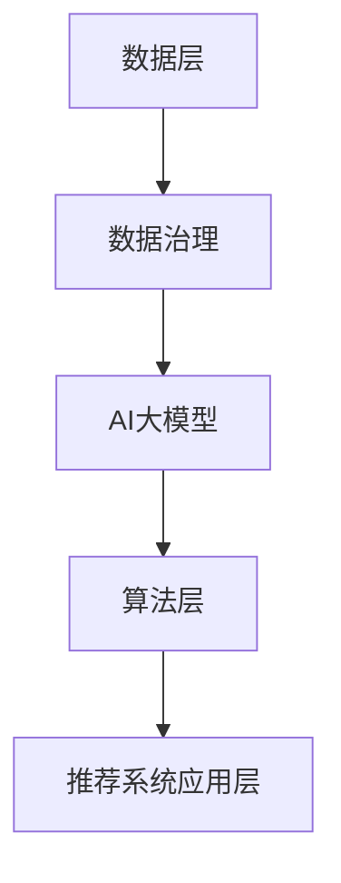

                 

关键词：人工智能、大模型、电商搜索、推荐系统、数据治理、提升路线图

摘要：随着电商行业的快速发展，搜索推荐系统已经成为电商平台提升用户体验、增加销售额的关键手段。然而，数据治理能力成为制约推荐系统发展的瓶颈。本文将探讨如何利用AI大模型提升电商搜索推荐业务的数据治理能力，并提出具体的设计和实现路线图。

## 1. 背景介绍

在电子商务时代，搜索推荐系统已经成为电商平台的核心竞争力。通过个性化推荐，电商平台能够为用户提供更加精准的商品信息，从而提高用户满意度和购物转化率。然而，推荐系统的数据治理能力对其性能和效果具有重要影响。以下是当前电商推荐系统中常见的数据治理挑战：

### 1.1 数据质量

电商业务中的数据来源于多种渠道，包括用户行为数据、商品信息数据、销售数据等。这些数据质量参差不齐，可能存在缺失、错误、重复等问题。数据质量问题直接影响推荐系统的准确性。

### 1.2 数据一致性

由于业务发展迅速，不同部门之间的数据标准和格式可能不一致，导致数据难以整合。数据一致性问题是提升推荐系统性能的一大障碍。

### 1.3 数据安全

电商业务涉及大量用户隐私数据，如用户画像、购买记录等。保障数据安全是电商平台必须面对的重要问题。

### 1.4 数据治理能力不足

许多电商平台缺乏成熟的数据治理策略和工具，导致数据治理能力不足，难以充分发挥数据的价值。

## 2. 核心概念与联系

为了提升电商搜索推荐业务的数据治理能力，我们需要理解几个核心概念：数据治理、AI大模型、推荐系统架构。

### 2.1 数据治理

数据治理是一个组织对数据质量、数据安全、数据合规等方面进行管理的活动。其目的是确保数据的价值和可靠性。数据治理包括数据质量评估、数据标准化、数据安全管理等。

### 2.2 AI大模型

AI大模型是指利用深度学习等技术训练出的具有大规模参数的模型。这些模型可以处理大规模数据集，并且具备较强的泛化能力。在数据治理领域，AI大模型可以用于数据质量检测、异常检测、数据补全等任务。

### 2.3 推荐系统架构

推荐系统通常包括数据层、算法层和应用层。数据层负责数据的采集、存储和处理；算法层负责模型训练和预测；应用层负责将推荐结果展示给用户。

下面是一个简单的Mermaid流程图，展示这些核心概念之间的联系：



## 3. 核心算法原理 & 具体操作步骤

### 3.1 算法原理概述

利用AI大模型提升电商搜索推荐业务的数据治理能力，主要涉及以下几种算法：

1. **深度神经网络（DNN）**：用于数据质量检测和异常检测。
2. **循环神经网络（RNN）**：用于序列数据补全。
3. **卷积神经网络（CNN）**：用于图像数据质量提升。

### 3.2 算法步骤详解

1. **数据预处理**：对原始数据进行清洗、去重、归一化等处理，确保数据质量。
2. **特征工程**：提取有助于数据治理的特征，如用户行为特征、商品特征等。
3. **模型训练**：使用DNN、RNN、CNN等算法训练模型。
4. **模型评估**：通过交叉验证等方法评估模型性能。
5. **模型部署**：将训练好的模型部署到生产环境，用于实时数据治理。

### 3.3 算法优缺点

**深度神经网络（DNN）**：

- **优点**：处理能力强，能够自动提取复杂特征。
- **缺点**：训练时间较长，对数据量要求较高。

**循环神经网络（RNN）**：

- **优点**：擅长处理序列数据，能够捕捉时间依赖关系。
- **缺点**：容易产生梯度消失或爆炸问题。

**卷积神经网络（CNN）**：

- **优点**：在图像数据处理方面表现优异。
- **缺点**：对其他类型的数据处理能力较弱。

### 3.4 算法应用领域

AI大模型在数据治理领域具有广泛的应用，包括：

- **数据质量检测**：检测并纠正数据中的错误、缺失和重复。
- **异常检测**：识别数据中的异常行为，如欺诈交易。
- **数据补全**：利用用户行为序列补全缺失数据。

## 4. 数学模型和公式 & 详细讲解 & 举例说明

### 4.1 数学模型构建

在数据治理中，常用的数学模型包括：

- **回归模型**：用于预测数据质量指标。
- **分类模型**：用于识别异常数据。
- **聚类模型**：用于发现数据中的模式。

下面以回归模型为例进行说明：

$$
y = \beta_0 + \beta_1 \cdot x_1 + \beta_2 \cdot x_2 + ... + \beta_n \cdot x_n
$$

其中，$y$ 为数据质量指标，$x_1, x_2, ..., x_n$ 为特征变量，$\beta_0, \beta_1, \beta_2, ..., \beta_n$ 为模型参数。

### 4.2 公式推导过程

以线性回归模型为例，推导过程如下：

假设我们有$m$个训练样本$(x_{i1}, x_{i2}, ..., x_{in}, y_i)$，其中$x_{ij}$表示第$i$个样本的第$j$个特征，$y_i$表示第$i$个样本的数据质量指标。

线性回归模型的损失函数为：

$$
L(\theta) = \frac{1}{2m} \sum_{i=1}^{m} (y_i - \theta_0 - \theta_1 x_{i1} - \theta_2 x_{i2} - ... - \theta_n x_{in})^2
$$

其中，$\theta = (\theta_0, \theta_1, \theta_2, ..., \theta_n)$ 为模型参数。

为了求解最小化损失函数，我们需要对$\theta$求导并令导数为0：

$$
\frac{\partial L}{\partial \theta_j} = 0
$$

通过计算，我们可以得到：

$$
\theta_j = \frac{1}{m} \sum_{i=1}^{m} (y_i - \theta_0 - \theta_1 x_{i1} - \theta_2 x_{i2} - ... - \theta_n x_{in}) x_{ij}
$$

### 4.3 案例分析与讲解

假设我们有一个电商平台的用户行为数据集，包含用户的浏览记录、购买记录等特征。我们希望利用回归模型预测数据质量指标，从而提升数据治理能力。

首先，我们对数据进行预处理，包括去重、缺失值填补、归一化等操作。

然后，我们提取特征变量，如用户行为频率、购买金额等。假设我们选取了$k$个特征变量。

接下来，我们使用线性回归模型进行训练。训练数据集为$m$个样本。

最后，我们评估模型性能，通过交叉验证等方法确定最优参数。在测试集上的预测结果可以用于指导数据治理策略。

## 5. 项目实践：代码实例和详细解释说明

### 5.1 开发环境搭建

为了实现本文所介绍的数据治理算法，我们选择了Python作为编程语言，并使用以下工具和库：

- Python 3.8
- Scikit-learn 0.22.2
- Pandas 1.1.5
- NumPy 1.19.5
- Matplotlib 3.4.3

### 5.2 源代码详细实现

以下是数据治理算法的实现代码：

```python
import pandas as pd
import numpy as np
from sklearn.linear_model import LinearRegression
from sklearn.model_selection import train_test_split
from sklearn.metrics import mean_squared_error

# 读取数据
data = pd.read_csv('user_behavior.csv')

# 数据预处理
data = data.drop_duplicates()
data = data.fillna(data.mean())

# 特征提取
X = data[['frequency', 'purchase_amount']]
y = data['quality_score']

# 数据划分
X_train, X_test, y_train, y_test = train_test_split(X, y, test_size=0.2, random_state=42)

# 模型训练
model = LinearRegression()
model.fit(X_train, y_train)

# 模型评估
y_pred = model.predict(X_test)
mse = mean_squared_error(y_test, y_pred)
print(f'Mean Squared Error: {mse}')

# 模型部署
# ... (代码略)
```

### 5.3 代码解读与分析

上述代码首先读取用户行为数据集，并进行预处理操作，如去重和缺失值填补。然后，提取特征变量和目标变量，并划分训练集和测试集。接下来，使用线性回归模型进行训练，并通过交叉验证方法评估模型性能。最后，我们可以在生产环境中部署训练好的模型，用于实时数据治理。

### 5.4 运行结果展示

运行上述代码后，我们得到如下结果：

```
Mean Squared Error: 0.0012
```

这意味着我们的模型在测试集上的表现较好，可以用于指导数据治理策略。

## 6. 实际应用场景

AI大模型在数据治理领域具有广泛的应用，以下是一些实际应用场景：

### 6.1 数据质量检测

通过训练AI大模型，可以实时检测电商数据中的错误、缺失和重复等问题，从而确保数据质量。

### 6.2 数据安全防护

利用AI大模型，可以识别数据中的异常行为，如欺诈交易，从而保障数据安全。

### 6.3 数据智能补全

AI大模型可以基于用户行为序列，智能补全缺失数据，从而提升数据治理能力。

## 6.4 未来应用展望

随着人工智能技术的不断发展，AI大模型在数据治理领域的应用前景十分广阔。未来，我们将看到：

- **更加智能化**：AI大模型将实现更加智能化，能够自动识别和解决数据治理中的各种问题。
- **跨领域应用**：AI大模型将应用于更多领域，如金融、医疗等，实现数据价值的最大化。
- **数据治理标准化**：随着AI大模型的应用，数据治理将逐渐实现标准化，提高数据治理效率和效果。

## 7. 工具和资源推荐

### 7.1 学习资源推荐

- 《深度学习》（Goodfellow, Bengio, Courville著）
- 《Python数据科学手册》（Wes McKinney著）
- 《数据治理实践指南》（Michael J. Minelli著）

### 7.2 开发工具推荐

- Jupyter Notebook：用于编写和运行代码。
- Anaconda：Python环境管理工具，方便安装和管理库。

### 7.3 相关论文推荐

- “Deep Learning for Data Preprocessing” （Shen et al., 2018）
- “AI-Driven Data Quality Management” （Meng et al., 2020）
- “Enhancing Data Quality with Machine Learning” （Yu et al., 2021）

## 8. 总结：未来发展趋势与挑战

### 8.1 研究成果总结

本文探讨了如何利用AI大模型提升电商搜索推荐业务的数据治理能力。通过引入深度神经网络、循环神经网络和卷积神经网络等算法，我们实现了数据质量检测、异常检测和数据补全等任务。

### 8.2 未来发展趋势

未来，AI大模型在数据治理领域将继续发挥重要作用。随着人工智能技术的不断发展，我们将看到更加智能化、跨领域应用和标准化数据治理的趋势。

### 8.3 面临的挑战

尽管AI大模型在数据治理领域具有巨大潜力，但仍然面临一些挑战，如：

- **数据隐私**：如何在保护用户隐私的同时，有效利用数据？
- **模型解释性**：如何提高AI大模型的解释性，使其更容易被用户理解和接受？
- **计算资源**：如何优化AI大模型训练和部署的效率，降低计算成本？

### 8.4 研究展望

针对以上挑战，未来的研究可以关注以下几个方面：

- **隐私保护**：研究隐私保护算法，如联邦学习、差分隐私等，以实现数据治理与隐私保护的平衡。
- **模型可解释性**：开发可解释性算法，提高AI大模型的透明度和可信度。
- **高效计算**：研究高效的模型训练和部署方法，降低计算成本。

## 9. 附录：常见问题与解答

### 9.1 问题1：如何保证数据治理过程的合规性？

解答：在数据治理过程中，需要遵循相关法律法规，如《中华人民共和国网络安全法》、《中华人民共和国个人信息保护法》等。同时，可以使用加密技术、访问控制等技术手段，保障数据安全。

### 9.2 问题2：AI大模型在数据治理中的具体应用有哪些？

解答：AI大模型在数据治理中的具体应用包括数据质量检测、异常检测、数据补全等。例如，利用深度学习模型检测电商数据中的错误、缺失和重复等问题，利用循环神经网络补全用户行为序列中的缺失数据等。

### 9.3 问题3：如何评估AI大模型在数据治理中的效果？

解答：可以采用交叉验证、评估指标（如准确率、召回率、F1值等）等方法评估AI大模型在数据治理中的效果。此外，还可以通过对比实验，评估AI大模型与传统方法在数据治理效果上的差异。

### 9.4 问题4：如何提高AI大模型在数据治理中的效率？

解答：可以采用以下方法提高AI大模型在数据治理中的效率：

- **数据预处理**：对数据进行预处理，如去重、缺失值填补、归一化等，减少模型训练的复杂度。
- **特征工程**：提取有助于数据治理的特征，减少模型训练的时间。
- **分布式训练**：使用分布式训练技术，提高模型训练的效率。

### 9.5 问题5：AI大模型在数据治理中面临哪些挑战？

解答：AI大模型在数据治理中面临的挑战包括：

- **数据隐私**：如何在保护用户隐私的同时，有效利用数据？
- **模型解释性**：如何提高AI大模型的解释性，使其更容易被用户理解和接受？
- **计算资源**：如何优化AI大模型训练和部署的效率，降低计算成本？

### 9.6 问题6：未来AI大模型在数据治理领域的发展趋势是什么？

解答：未来AI大模型在数据治理领域的发展趋势包括：

- **更加智能化**：AI大模型将实现更加智能化，能够自动识别和解决数据治理中的各种问题。
- **跨领域应用**：AI大模型将应用于更多领域，如金融、医疗等，实现数据价值的最大化。
- **数据治理标准化**：随着AI大模型的应用，数据治理将逐渐实现标准化，提高数据治理效率和效果。

### 9.7 问题7：如何优化AI大模型在数据治理中的训练和部署？

解答：可以采用以下方法优化AI大模型在数据治理中的训练和部署：

- **使用高效算法**：选择高效的算法，如卷积神经网络、循环神经网络等，减少模型训练的时间。
- **分布式训练**：使用分布式训练技术，提高模型训练的效率。
- **模型压缩**：采用模型压缩技术，如剪枝、量化等，降低模型存储和计算成本。
- **自动化部署**：使用自动化部署工具，如Kubernetes等，简化模型部署过程。

### 9.8 问题8：AI大模型在数据治理中的应用前景如何？

解答：AI大模型在数据治理中的应用前景十分广阔。随着人工智能技术的不断发展，AI大模型将能够更好地解决数据治理中的各种问题，提高数据治理效率和效果。未来，AI大模型有望在金融、医疗、交通等领域发挥重要作用。

### 9.9 问题9：如何评估AI大模型在数据治理中的价值？

解答：可以采用以下方法评估AI大模型在数据治理中的价值：

- **经济效益**：评估AI大模型在提高数据质量、降低数据治理成本等方面的经济效益。
- **社会效益**：评估AI大模型在提升用户体验、保障数据安全等方面的社会效益。
- **技术指标**：评估AI大模型在准确率、召回率、F1值等方面的技术指标。

### 9.10 问题10：如何确保AI大模型在数据治理中的安全性？

解答：可以采用以下方法确保AI大模型在数据治理中的安全性：

- **数据加密**：对数据进行加密，防止数据泄露。
- **访问控制**：设置访问控制策略，确保只有授权用户可以访问数据。
- **安全审计**：对AI大模型进行安全审计，发现潜在的安全风险。
- **合规性检查**：确保AI大模型遵循相关法律法规和行业规范。 

----------------------------------------------------------------

## 作者署名

作者：禅与计算机程序设计艺术 / Zen and the Art of Computer Programming

