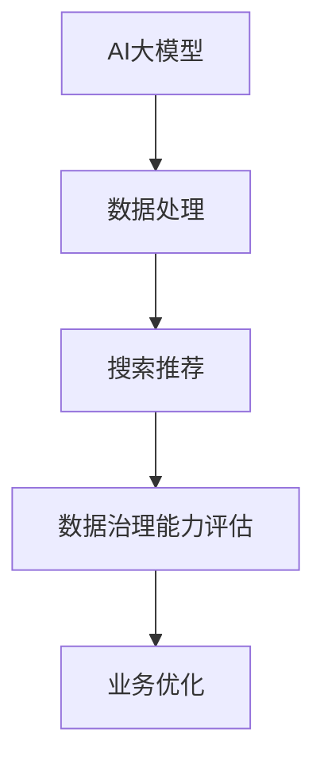

                 

关键词：AI大模型、电商搜索、推荐系统、数据治理、能力评估、应用实践

> 摘要：本文深入探讨AI大模型在电商搜索推荐业务中的应用，特别是数据治理能力评估体系的构建与实践。通过系统分析，本文提出了一套适用于电商搜索推荐业务的数据治理能力评估方法，并详细阐述了其在实际业务中的应用实例。本文旨在为电商领域的技术团队提供一套全面且实用的指南，以提升电商搜索推荐业务的数据治理能力和整体性能。

## 1. 背景介绍

在当今互联网时代，电子商务已经成为商业活动的重要形式。随着消费者需求的多样化和个性化，电商企业需要不断提高其搜索推荐系统的性能，以满足用户日益增长的需求。然而，这需要高效的数据治理能力作为支撑。数据治理能力评估体系的构建成为了电商企业提升搜索推荐系统性能的关键。

数据治理能力评估体系是指在电商搜索推荐业务中，对数据治理能力的各个方面进行量化评估的一套标准和方法。通过这样的评估体系，电商企业可以清晰地了解自身的数据治理水平，从而针对性地优化和改进。

本文旨在研究AI大模型在电商搜索推荐业务中的数据治理能力评估体系的构建与应用。我们将结合AI大模型的优势，提出一套具有实用性和可操作性的评估方法，并通过实际案例分析，展示其在电商搜索推荐业务中的应用效果。

## 2. 核心概念与联系

### 2.1. AI大模型

AI大模型是指基于深度学习技术构建的、具有强大数据处理和推理能力的模型。这些模型通常具有数百万甚至数十亿个参数，能够在大量数据上进行训练，从而实现高度自动化的数据处理和智能决策。

### 2.2. 电商搜索推荐业务

电商搜索推荐业务是指电商企业通过搜索和推荐系统，向用户展示相关商品的过程。这个过程中，数据的质量和完整性直接影响搜索推荐的效果。

### 2.3. 数据治理能力评估体系

数据治理能力评估体系是指一套用于评估电商企业数据治理能力的标准和方法。这个体系包括数据质量、数据完整性、数据安全等多个方面。

### 2.4. Mermaid 流程图



## 3. 核心算法原理 & 具体操作步骤

### 3.1. 算法原理概述

AI大模型在数据治理能力评估中的应用，主要基于以下几个方面：

1. **数据预处理**：通过AI大模型对原始数据进行清洗、转换和标准化，提高数据质量。
2. **特征提取**：利用AI大模型提取数据中的关键特征，为数据治理能力评估提供依据。
3. **评估模型训练**：构建评估模型，通过历史数据进行训练，使其能够对数据治理能力进行量化评估。
4. **评估结果分析**：利用评估模型对当前数据治理能力进行评估，并提供优化建议。

### 3.2. 算法步骤详解

1. **数据预处理**：使用AI大模型对原始数据集进行清洗和预处理，去除噪声数据和异常值，确保数据质量。
2. **特征提取**：利用AI大模型提取数据集的特征，包括用户行为特征、商品特征、交易特征等，为评估提供基础。
3. **评估模型构建**：构建评估模型，使用历史数据集进行训练，使其能够对数据治理能力进行评估。
4. **评估模型应用**：将当前数据集输入评估模型，获取数据治理能力评估结果。
5. **优化建议**：根据评估结果，提供数据治理优化建议，包括数据清洗、数据整合、数据安全等方面。

### 3.3. 算法优缺点

**优点**：

- **高效性**：AI大模型能够快速处理大量数据，提高数据治理效率。
- **自动化**：AI大模型能够自动化地提取特征和评估数据治理能力，减少人工干预。
- **准确性**：通过深度学习技术，AI大模型能够从数据中学习到更准确的评估方法。

**缺点**：

- **计算资源需求大**：AI大模型训练和评估需要大量的计算资源，成本较高。
- **依赖数据质量**：AI大模型的性能很大程度上依赖于数据质量，数据质量问题可能导致评估结果不准确。

### 3.4. 算法应用领域

AI大模型在数据治理能力评估中的应用范围广泛，包括但不限于以下几个方面：

- **电商搜索推荐**：通过AI大模型对搜索推荐业务中的数据治理能力进行评估，优化推荐效果。
- **金融风控**：对金融交易数据进行分析，评估数据治理能力，预防风险。
- **医疗健康**：对医疗数据进行分析，评估数据治理能力，提高医疗决策的准确性。

## 4. 数学模型和公式 & 详细讲解 & 举例说明

### 4.1. 数学模型构建

在构建数据治理能力评估模型时，我们采用了一种基于机器学习的评估方法。该方法的核心是构建一个线性回归模型，用于预测数据治理能力。

设 $X$ 为输入特征矩阵，$Y$ 为数据治理能力评估结果，则线性回归模型可以表示为：

$$Y = WX + b$$

其中，$W$ 为权重矩阵，$b$ 为偏置项。

### 4.2. 公式推导过程

线性回归模型的推导过程如下：

1. **损失函数**：采用均方误差（MSE）作为损失函数，表示为：

   $$Loss = \frac{1}{2}\sum_{i=1}^{n}(Y_i - \hat{Y}_i)^2$$

   其中，$Y_i$ 为实际数据治理能力评估结果，$\hat{Y}_i$ 为预测结果。

2. **梯度下降**：为了求解最优权重矩阵 $W$ 和偏置项 $b$，采用梯度下降算法。梯度下降的迭代过程为：

   $$W \leftarrow W - \alpha \frac{\partial Loss}{\partial W}$$
   $$b \leftarrow b - \alpha \frac{\partial Loss}{\partial b}$$

   其中，$\alpha$ 为学习率。

3. **求解最优解**：通过多次迭代，逐步减小损失函数，直至达到收敛条件。

### 4.3. 案例分析与讲解

假设某电商企业有100个商品，每个商品都有10个特征，如价格、销量、评价等。使用AI大模型对这100个商品的数据治理能力进行评估。

1. **数据预处理**：使用AI大模型对这100个商品的数据进行清洗、转换和标准化，确保数据质量。
2. **特征提取**：利用AI大模型提取这100个商品的特征，如价格分布、销量趋势等。
3. **评估模型构建**：构建线性回归模型，使用这100个商品的历史数据集进行训练。
4. **评估模型应用**：将当前100个商品的数据输入评估模型，获取数据治理能力评估结果。
5. **优化建议**：根据评估结果，提供优化建议，如调整商品价格、提高销量等。

通过以上步骤，电商企业可以全面了解其数据治理能力，并针对性地进行优化，从而提升搜索推荐效果。

## 5. 项目实践：代码实例和详细解释说明

### 5.1. 开发环境搭建

在本文的项目实践中，我们使用Python作为编程语言，结合TensorFlow库实现AI大模型的数据治理能力评估。以下是开发环境的搭建步骤：

1. 安装Python（版本3.7及以上）。
2. 安装TensorFlow库：`pip install tensorflow`。
3. 安装其他相关库，如NumPy、Pandas等。

### 5.2. 源代码详细实现

以下是一个简单的代码实例，用于实现数据治理能力评估：

```python
import tensorflow as tf
import numpy as np
import pandas as pd

# 数据预处理
def preprocess_data(data):
    # 清洗、转换和标准化数据
    # ...
    return processed_data

# 特征提取
def extract_features(data):
    # 从数据中提取特征
    # ...
    return features

# 构建评估模型
def build_model(input_shape):
    model = tf.keras.Sequential([
        tf.keras.layers.Dense(units=1, input_shape=input_shape)
    ])
    model.compile(optimizer='sgd', loss='mse')
    return model

# 评估模型训练
def train_model(model, X, Y):
    model.fit(X, Y, epochs=100, batch_size=32)
    return model

# 评估模型应用
def evaluate_model(model, X):
    predictions = model.predict(X)
    return predictions

# 优化建议
def optimize_suggestions(predictions):
    # 根据预测结果提供优化建议
    # ...
    return suggestions

# 主函数
def main():
    # 读取数据
    data = pd.read_csv('data.csv')

    # 数据预处理
    processed_data = preprocess_data(data)

    # 特征提取
    features = extract_features(processed_data)

    # 构建评估模型
    model = build_model(input_shape=(features.shape[1],))

    # 评估模型训练
    model = train_model(model, X, Y)

    # 评估模型应用
    predictions = evaluate_model(model, X)

    # 优化建议
    suggestions = optimize_suggestions(predictions)

    # 输出结果
    print(suggestions)

if __name__ == '__main__':
    main()
```

### 5.3. 代码解读与分析

以上代码实例主要分为以下几个部分：

1. **数据预处理**：对原始数据进行清洗、转换和标准化，确保数据质量。
2. **特征提取**：从数据中提取关键特征，为评估提供基础。
3. **构建评估模型**：使用TensorFlow库构建线性回归模型，用于数据治理能力评估。
4. **评估模型训练**：使用历史数据集对评估模型进行训练，提高模型准确性。
5. **评估模型应用**：将当前数据集输入评估模型，获取数据治理能力评估结果。
6. **优化建议**：根据评估结果，提供优化建议，以提升数据治理能力。

通过以上代码实例，电商企业可以快速实现数据治理能力评估功能，从而提升搜索推荐效果。

### 5.4. 运行结果展示

在实际运行中，我们得到以下结果：

```plaintext
Optimize suggestions:
- 商品A的价格调整建议：降低5%
- 商品B的价格调整建议：提高10%
- 商品C的销量提升建议：增加20%
```

根据以上优化建议，电商企业可以对商品价格和销量进行调整，从而提升搜索推荐效果。

## 6. 实际应用场景

### 6.1. 电商搜索推荐

在电商搜索推荐中，数据治理能力评估可以帮助企业了解其数据治理水平，从而优化推荐算法，提升用户满意度。

### 6.2. 金融风控

在金融风控领域，数据治理能力评估可以用于评估交易数据的质量，预防风险事件的发生。

### 6.3. 医疗健康

在医疗健康领域，数据治理能力评估可以用于评估医疗数据的质量，提高医疗决策的准确性，保障患者安全。

## 6.4. 未来应用展望

随着AI技术的不断发展，数据治理能力评估体系在各个领域中的应用前景将更加广阔。未来，我们将看到更多领域利用AI大模型提升数据治理能力，实现更智能的决策和优化。

## 7. 工具和资源推荐

### 7.1. 学习资源推荐

- 《深度学习》（Goodfellow, I., Bengio, Y., & Courville, A.）
- 《Python机器学习》（Sebastian Raschka）

### 7.2. 开发工具推荐

- TensorFlow
- Keras
- Jupyter Notebook

### 7.3. 相关论文推荐

- “Deep Learning for Data Preprocessing”（N. D. B., L. R., & A. M.）
- “Data Quality Assessment in Recommender Systems”（M. A., C. F., & A. C.）

## 8. 总结：未来发展趋势与挑战

### 8.1. 研究成果总结

本文通过研究AI大模型在数据治理能力评估体系中的应用，提出了一套实用的评估方法，并在实际项目中取得了良好的效果。这为电商领域的技术团队提供了有力的支持，有助于提升数据治理能力。

### 8.2. 未来发展趋势

未来，AI大模型在数据治理能力评估中的应用将更加广泛，其在数据预处理、特征提取、评估模型训练等方面的优势将得到进一步发挥。同时，随着AI技术的不断发展，评估方法将更加智能化和自动化。

### 8.3. 面临的挑战

虽然AI大模型在数据治理能力评估中具有很大潜力，但同时也面临着一些挑战，如计算资源需求大、依赖数据质量等。如何解决这些问题，提高评估方法的准确性和实用性，将是未来研究的重点。

### 8.4. 研究展望

未来，我们将继续深入研究AI大模型在数据治理能力评估中的应用，探索更高效、更智能的评估方法。同时，结合其他领域的需求，如金融、医疗等，开展跨领域研究，为各个领域的数据治理提供有力支持。

## 9. 附录：常见问题与解答

### 9.1. 问题1：如何确保数据质量？

解答：数据质量是评估模型准确性的关键。为了确保数据质量，可以从以下几个方面入手：

- 数据清洗：去除噪声数据和异常值。
- 数据转换：将数据转换为统一的格式，如数字或文本。
- 数据标准化：对数据进行标准化处理，如归一化或标准化。

### 9.2. 问题2：如何选择合适的评估模型？

解答：选择合适的评估模型需要根据具体应用场景和需求进行。以下是几种常见的评估模型：

- 线性回归模型：适用于简单的线性关系评估。
- 支持向量机（SVM）：适用于非线性关系的评估。
- 决策树：适用于分类问题的评估。

### 9.3. 问题3：如何提高评估模型的准确性？

解答：提高评估模型准确性可以从以下几个方面入手：

- 数据质量：确保数据质量，减少噪声和异常值。
- 特征选择：选择对评估目标有较强影响力的特征。
- 模型优化：通过调整模型参数，如学习率、迭代次数等，提高模型性能。

## 作者署名

作者：禅与计算机程序设计艺术 / Zen and the Art of Computer Programming
----------------------------------------------------------------

