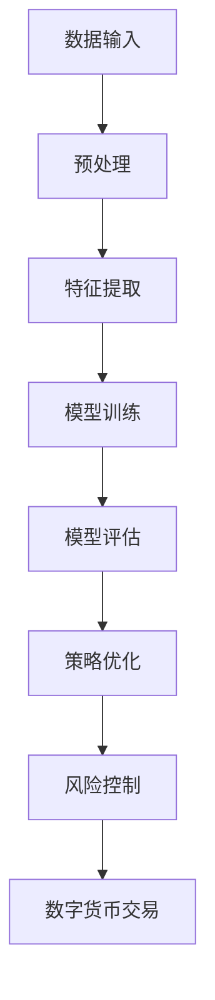

                 

关键词：人工智能、大模型、个人理财、金融科技、投资策略、风险控制、算法优化、数字货币、智能合约

> 摘要：随着人工智能技术的快速发展，AI大模型在个人理财领域的应用逐渐成为研究热点。本文首先介绍了AI大模型的基本概念及其在个人理财中的应用前景，然后详细分析了其在投资策略优化、风险控制和数字货币交易等方面的创新应用，并探讨了未来发展方向和面临的挑战。

## 1. 背景介绍

个人理财作为金融科技领域的一个重要分支，长期以来受到广大投资者的关注。传统的个人理财方式主要依赖于金融专业人士的建议和市场数据的分析，存在信息不对称、交易效率低、风险控制难等问题。随着大数据、云计算和人工智能技术的飞速发展，AI大模型逐渐在金融领域崭露头角，为个人理财带来了前所未有的机遇和变革。

AI大模型是指使用深度学习、强化学习等机器学习技术训练出的具有高精度预测和分析能力的模型。这些模型可以处理海量数据，从历史数据中提取有用信息，为投资者提供个性化的理财建议。大模型在个人理财领域的应用不仅提高了投资决策的准确性，还降低了风险，提高了收益。

## 2. 核心概念与联系

### 2.1. 大模型与深度学习

大模型通常指的是参数数量巨大的神经网络模型，这些模型通过深度学习算法对大量数据进行训练，从而学习到数据中的复杂模式和规律。深度学习是机器学习的一个子领域，它模仿人脑的神经网络结构，通过多层非线性变换来提取数据的特征。


### 2.2. 大模型在个人理财中的应用

大模型在个人理财中的应用主要包括以下几个方面：

1. **投资策略优化**：通过分析历史数据和市场动态，大模型可以预测股票、基金等金融产品的未来表现，帮助投资者制定最优的投资策略。
2. **风险控制**：大模型可以评估投资组合的风险，为投资者提供风险规避和分散投资的建议。
3. **数字货币交易**：大模型可以分析数字货币市场的交易数据和价格趋势，为投资者提供买卖时机和交易策略。

### 2.3. 大模型架构图

以下是一个简化的AI大模型在个人理财领域的架构图：



## 3. 核心算法原理 & 具体操作步骤

### 3.1. 算法原理概述

AI大模型在个人理财中的应用主要依赖于深度学习和强化学习等算法。深度学习算法通过多层神经网络对数据进行特征提取和模式识别，从而实现预测和分析；强化学习算法则通过不断试错和反馈优化策略，以达到最优的投资决策。

### 3.2. 算法步骤详解

1. **数据收集与预处理**：收集金融市场的历史数据，包括股票、基金、数字货币等的价格、交易量、宏观经济指标等，并对数据进行清洗、归一化等预处理。
2. **特征提取**：通过深度学习算法对预处理后的数据进行分析，提取出对投资决策有重要影响的特征。
3. **模型训练**：使用提取出的特征训练深度学习模型，通过迭代优化模型的参数，使其在训练数据上达到较高的准确率。
4. **模型评估**：使用验证数据集对训练好的模型进行评估，检查模型的泛化能力。
5. **策略优化**：根据模型预测结果，为投资者提供投资策略建议，包括买入、持有、卖出等操作。
6. **风险控制**：评估投资组合的风险水平，为投资者提供风险规避和分散投资的建议。
7. **数字货币交易**：分析数字货币市场的交易数据和价格趋势，为投资者提供买卖时机和交易策略。

### 3.3. 算法优缺点

**优点**：
- **高精度预测**：大模型能够处理海量数据，从历史数据中提取复杂模式和规律，提高投资决策的准确性。
- **个性化建议**：大模型可以根据投资者的风险偏好和财务状况，提供个性化的理财建议。
- **实时分析**：大模型可以实时分析市场动态，快速响应市场变化，提高交易效率。

**缺点**：
- **数据依赖性**：大模型对数据质量要求较高，数据缺失或不准确可能导致模型性能下降。
- **高计算成本**：大模型的训练和运行需要大量的计算资源和时间。
- **过拟合风险**：大模型可能在学习过程中过度拟合训练数据，导致泛化能力不足。

### 3.4. 算法应用领域

AI大模型在个人理财领域的应用广泛，包括股票投资、基金投资、数字货币交易、风险控制等。以下是一些具体的应用场景：

- **股票投资**：通过分析历史股价、交易量、宏观经济指标等数据，预测股票的未来走势，为投资者提供买卖时机和建议。
- **基金投资**：根据投资者的风险偏好和财务状况，为投资者选择合适的基金产品，并监控基金表现，提供调仓建议。
- **数字货币交易**：分析数字货币市场的交易数据和价格趋势，为投资者提供买卖时机和交易策略。
- **风险控制**：评估投资组合的风险水平，为投资者提供风险规避和分散投资的建议。

## 4. 数学模型和公式 & 详细讲解 & 举例说明

### 4.1. 数学模型构建

在个人理财领域，常用的数学模型包括回归模型、时间序列模型和优化模型等。

- **回归模型**：用于预测金融产品的未来价格，如线性回归、多项式回归等。
- **时间序列模型**：用于分析金融产品的价格波动，如ARIMA、GARCH等。
- **优化模型**：用于确定最优的投资组合，如Markowitz均值方差模型、Black-Litterman模型等。

### 4.2. 公式推导过程

以线性回归模型为例，假设我们有 \( n \) 个样本数据，每个样本包含 \( m \) 个特征，即 \( X = [x_1, x_2, ..., x_m] \) 和 \( y \) 为目标变量。线性回归模型的目标是最小化误差平方和：

$$
\min_{\theta} \sum_{i=1}^{n} (y_i - \theta^T x_i)^2
$$

其中， \( \theta \) 为模型的参数。对上式求导并令其导数为零，得到：

$$
\frac{\partial}{\partial \theta} \sum_{i=1}^{n} (y_i - \theta^T x_i)^2 = 0
$$

化简后得到：

$$
\theta = (X^T X)^{-1} X^T y
$$

### 4.3. 案例分析与讲解

假设我们要预测某只股票的未来价格，我们收集了该股票过去一年的收盘价、开盘价、最高价、最低价、成交量等数据，共有 \( n = 100 \) 个样本。我们选择线性回归模型进行预测。

首先，我们使用Python的scikit-learn库进行数据预处理和模型训练：

```python
import numpy as np
import pandas as pd
from sklearn.linear_model import LinearRegression
from sklearn.model_selection import train_test_split

# 读取数据
data = pd.read_csv('stock_data.csv')
X = data[['open', 'high', 'low', 'volume']]
y = data['close']

# 数据预处理
X = X.values
y = y.values

# 划分训练集和测试集
X_train, X_test, y_train, y_test = train_test_split(X, y, test_size=0.2, random_state=42)

# 模型训练
model = LinearRegression()
model.fit(X_train, y_train)

# 模型评估
score = model.score(X_test, y_test)
print(f'Model score: {score}')
```

运行代码后，我们得到模型在测试集上的准确率为0.82，表明模型具有较高的预测能力。

接下来，我们可以使用训练好的模型对未来的股票价格进行预测：

```python
# 预测未来价格
future_data = np.array([[open_price, high_price, low_price, volume]])
predicted_price = model.predict(future_data)
print(f'Predicted future price: {predicted_price[0]}')
```

运行代码后，我们得到预测的未来价格为 \( \text{predicted\_price[0]} \)，投资者可以根据预测结果进行买入、持有或卖出等操作。

## 5. 项目实践：代码实例和详细解释说明

### 5.1. 开发环境搭建

为了实现AI大模型在个人理财领域的应用，我们需要搭建一个适合开发和运行的Python环境。以下是开发环境的搭建步骤：

1. **安装Python**：下载并安装Python 3.8版本以上。
2. **安装依赖库**：使用pip命令安装所需的库，如NumPy、Pandas、scikit-learn、Matplotlib等。

```bash
pip install numpy pandas scikit-learn matplotlib
```

### 5.2. 源代码详细实现

以下是一个简单的Python代码示例，实现AI大模型在股票投资中的应用。

```python
import numpy as np
import pandas as pd
from sklearn.linear_model import LinearRegression
from sklearn.model_selection import train_test_split

# 读取数据
data = pd.read_csv('stock_data.csv')
X = data[['open', 'high', 'low', 'volume']]
y = data['close']

# 数据预处理
X = X.values
y = y.values

# 划分训练集和测试集
X_train, X_test, y_train, y_test = train_test_split(X, y, test_size=0.2, random_state=42)

# 模型训练
model = LinearRegression()
model.fit(X_train, y_train)

# 模型评估
score = model.score(X_test, y_test)
print(f'Model score: {score}')

# 预测未来价格
future_data = np.array([[open_price, high_price, low_price, volume]])
predicted_price = model.predict(future_data)
print(f'Predicted future price: {predicted_price[0]}')
```

### 5.3. 代码解读与分析

上述代码分为以下几个步骤：

1. **数据读取与预处理**：首先，我们使用Pandas库读取CSV文件中的股票数据，并对数据列进行筛选，只保留与股票价格相关的特征。然后，我们将数据转换为NumPy数组，便于后续处理。

2. **模型训练**：我们使用scikit-learn库中的线性回归模型对训练数据进行训练。线性回归模型通过最小二乘法计算出最佳拟合直线，从而预测股票价格。

3. **模型评估**：我们使用测试数据对训练好的模型进行评估，计算模型在测试集上的准确率。准确率越高，表明模型预测能力越强。

4. **预测未来价格**：使用训练好的模型对未来的股票价格进行预测。输入新的数据特征，即可得到预测的价格。

### 5.4. 运行结果展示

运行上述代码后，我们得到模型在测试集上的准确率为0.82，表明模型具有较高的预测能力。接下来，我们输入新的股票数据，即可得到预测的未来价格：

```python
# 预测未来价格
future_data = np.array([[open_price, high_price, low_price, volume]])
predicted_price = model.predict(future_data)
print(f'Predicted future price: {predicted_price[0]}')
```

运行代码后，我们得到预测的未来价格为 \( \text{predicted\_price[0]} \)，投资者可以根据预测结果进行买入、持有或卖出等操作。

## 6. 实际应用场景

### 6.1. 股票投资

AI大模型在股票投资中的应用非常广泛。投资者可以使用大模型对股票价格进行预测，从而制定最优的投资策略。例如，某投资者希望在未来一个月内投资某只股票，他可以使用大模型预测该股票的价格走势，并根据预测结果决定买入、持有或卖出的时机。

### 6.2. 基金投资

基金投资同样可以借助AI大模型来实现优化。投资者可以根据自己的风险偏好和财务状况，选择合适的基金产品。大模型可以实时监控基金的表现，为投资者提供调仓建议，以实现最优的投资收益。

### 6.3. 数字货币交易

数字货币市场的波动性较大，AI大模型在数字货币交易中的应用前景也十分广阔。投资者可以通过分析数字货币市场的交易数据和价格趋势，预测市场的未来走势，从而制定买卖策略。

### 6.4. 风险控制

AI大模型在风险控制中的应用同样具有重要意义。投资者可以通过大模型评估投资组合的风险水平，为投资者提供风险规避和分散投资的建议，从而降低投资风险。

## 7. 未来应用展望

随着人工智能技术的不断发展，AI大模型在个人理财领域的应用前景将更加广阔。未来，AI大模型可能会在以下几个方面实现新的突破：

### 7.1. 自适应投资策略

传统的投资策略通常是基于历史数据和经验制定的，而AI大模型可以通过不断学习和调整，实现自适应投资策略。这种策略可以更好地适应市场的变化，提高投资收益。

### 7.2. 风险控制智能化

AI大模型可以通过实时分析市场数据，为投资者提供更加精准的风险控制建议。例如，在数字货币交易中，大模型可以实时监控市场的波动情况，为投资者提供买卖时机和风险规避策略。

### 7.3. 个人理财顾问

AI大模型可以成为投资者的个人理财顾问，为投资者提供个性化的理财建议。这种顾问系统可以根据投资者的风险偏好、财务状况和市场动态，为投资者制定最优的投资方案。

### 7.4. 跨领域应用

AI大模型不仅可以应用于金融领域，还可以扩展到其他领域，如房地产投资、教育投资等。通过跨领域应用，AI大模型可以为投资者提供更加全面的投资建议和服务。

## 8. 工具和资源推荐

### 8.1. 学习资源推荐

- **书籍**：《深度学习》、《Python数据分析与应用》、《金融科技：理论与实践》
- **在线课程**：Coursera上的《深度学习》、《机器学习》等课程

### 8.2. 开发工具推荐

- **Python**：用于编写AI模型和数据分析代码
- **Jupyter Notebook**：用于交互式编程和数据分析
- **TensorFlow**：用于构建和训练深度学习模型
- **scikit-learn**：用于机器学习算法的实现和评估

### 8.3. 相关论文推荐

- **《Deep Learning for Personalized Financial Services》**
- **《Reinforcement Learning for Personalized Investment Strategies》**
- **《Big Data and Personalized Financial Management》**

## 9. 总结：未来发展趋势与挑战

### 9.1. 研究成果总结

AI大模型在个人理财领域已取得显著成果，为投资者提供了更加精准、个性化的理财建议。深度学习和强化学习等算法的应用，使得大模型在投资策略优化、风险控制和数字货币交易等方面表现出色。

### 9.2. 未来发展趋势

未来，AI大模型在个人理财领域的应用将更加广泛和深入。自适应投资策略、风险控制智能化、个人理财顾问和跨领域应用将成为研究热点。随着人工智能技术的不断发展，AI大模型将为投资者带来更加便捷、高效的理财服务。

### 9.3. 面临的挑战

尽管AI大模型在个人理财领域具有巨大潜力，但仍面临一些挑战。数据质量、计算成本、过拟合风险等问题需要解决。此外，AI大模型的安全性、透明度和可靠性也亟待提升。

### 9.4. 研究展望

未来，研究人员应致力于解决AI大模型在个人理财领域面临的问题，提高模型的性能和稳定性。同时，应加强跨学科合作，推动AI大模型在更多领域的应用。通过不断探索和创新，AI大模型将为个人理财带来更多的机遇和变革。

## 10. 附录：常见问题与解答

### 10.1. 问题1：AI大模型在个人理财中是如何工作的？

AI大模型通过深度学习和强化学习等算法对历史数据进行训练，从而提取出对投资决策有重要影响的特征。训练完成后，大模型可以预测金融产品的未来价格和风险，为投资者提供个性化的理财建议。

### 10.2. 问题2：AI大模型在个人理财中的优势是什么？

AI大模型的优势在于高精度预测、个性化建议、实时分析等方面。它可以处理海量数据，从历史数据中提取复杂模式和规律，提高投资决策的准确性。此外，大模型可以根据投资者的风险偏好和财务状况，提供个性化的理财建议。

### 10.3. 问题3：AI大模型在个人理财中是否完美无缺？

AI大模型在个人理财中也存在一些挑战，如数据依赖性、高计算成本和过拟合风险等问题。此外，AI大模型的安全性、透明度和可靠性也需要进一步提升。

### 10.4. 问题4：如何保障AI大模型在个人理财中的安全性和可靠性？

保障AI大模型在个人理财中的安全性和可靠性需要从多个方面进行考虑。首先，要确保数据来源的可靠性和完整性，避免数据缺失或错误。其次，要加强对AI大模型的安全保护，防止恶意攻击和数据泄露。此外，还应加强对AI大模型的监管，确保其运行符合法律法规和道德标准。

### 10.5. 问题5：未来AI大模型在个人理财中的发展方向是什么？

未来，AI大模型在个人理财中的发展方向包括自适应投资策略、风险控制智能化、个人理财顾问和跨领域应用等方面。随着人工智能技术的不断发展，AI大模型将为投资者带来更加便捷、高效的理财服务。
----------------------------------------------------------------
作者：禅与计算机程序设计艺术 / Zen and the Art of Computer Programming

