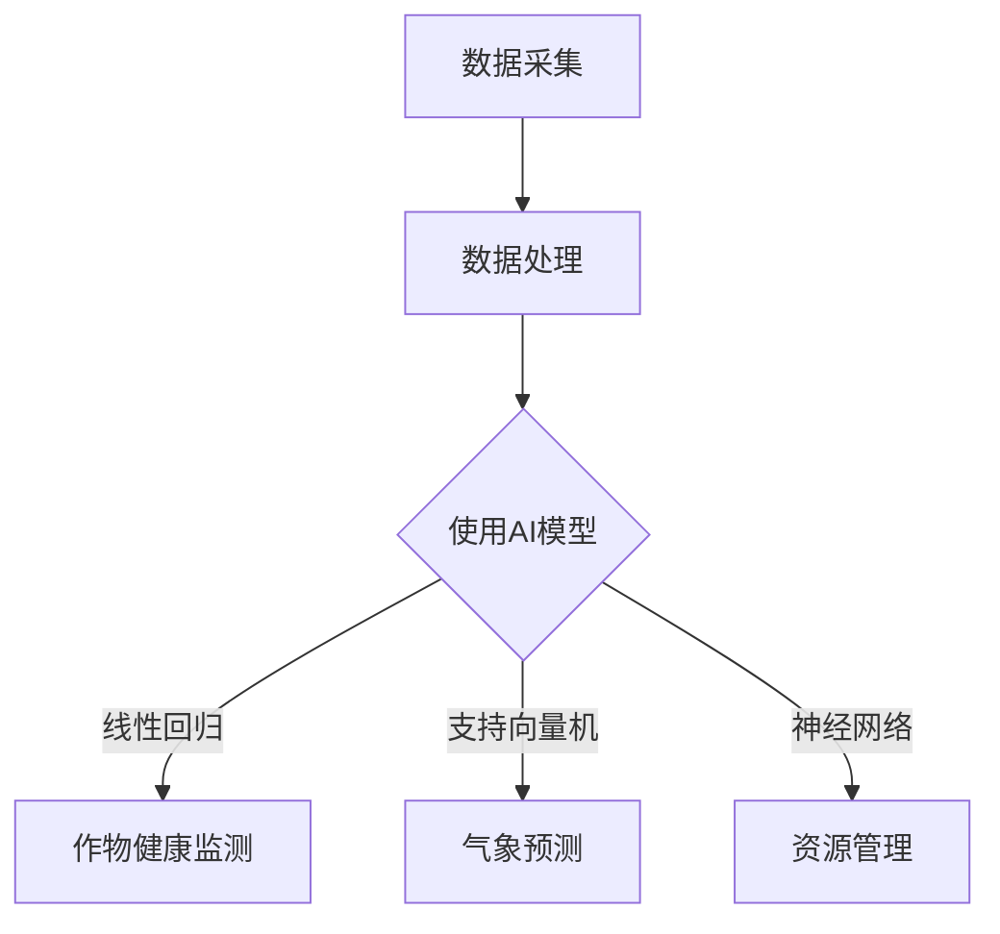

                 

关键词：农业科技，AI大模型，深度学习，机器学习，数据驱动农业，智能农作系统，精准农业，作物健康监测，气象预测，资源管理，生产优化，市场预测，可持续发展

> 摘要：本文深入探讨了AI大模型在农业科技中的应用，从背景介绍、核心概念与联系、核心算法原理与具体操作步骤、数学模型与公式、项目实践、实际应用场景到未来应用展望，全面展示了AI大模型如何通过智能化手段推动农业科技的创新与发展。

## 1. 背景介绍

农业是国民经济的基础产业，然而，传统农业面临着资源利用率低、生产效率低、环境压力大等挑战。随着全球人口增长和气候变化，农业的可持续发展问题愈发紧迫。AI大模型的出现，为农业科技带来了新的机遇。通过深度学习、机器学习等技术，AI大模型可以处理海量农业数据，从中挖掘出有价值的信息，为农业生产提供精准的决策支持。

## 2. 核心概念与联系

### 2.1. 数据驱动农业

数据驱动农业是利用大数据、物联网等技术收集、处理和利用农业数据，从而实现农业生产的精准化。AI大模型在此过程中发挥着核心作用，通过对数据进行分析，提供作物健康监测、气象预测、资源管理等支持。

### 2.2. 智能农作系统

智能农作系统是集成了传感器、监测设备、控制系统和AI大模型的一体化农业系统。通过实时监测作物生长环境，智能农作系统可以自动调整灌溉、施肥、病虫害防治等操作，提高农业生产效率。

### 2.3. 精准农业

精准农业通过地理信息系统（GIS）、遥感技术等手段，对农田进行精细化管理。AI大模型可以分析GIS数据和遥感数据，提供作物产量预测、病虫害监测等支持，实现农业生产的精准化。

### 2.4. 数学模型与算法

在AI大模型中，常用的数学模型包括线性回归、支持向量机、神经网络等。这些模型通过对农业数据的分析，可以提取出有价值的信息，为农业生产提供决策支持。

### 2.5. Mermaid 流程图

以下是一个简单的Mermaid流程图，展示了AI大模型在农业科技中的应用流程：



## 3. 核心算法原理 & 具体操作步骤

### 3.1. 算法原理概述

AI大模型在农业科技中的应用主要基于深度学习和机器学习技术。深度学习通过构建多层神经网络，对农业数据进行分析和预测；机器学习则通过建立数学模型，从数据中提取特征，实现智能决策。

### 3.2. 算法步骤详解

#### 3.2.1. 数据采集

首先，需要收集大量的农业数据，包括土壤、气候、作物生长等。数据来源可以是传感器、遥感设备、农业物联网等。

#### 3.2.2. 数据处理

对采集到的农业数据进行处理，包括数据清洗、数据归一化等。处理后的数据将用于训练AI大模型。

#### 3.2.3. 建立模型

选择合适的深度学习或机器学习算法，建立AI大模型。常用的算法包括线性回归、支持向量机、神经网络等。

#### 3.2.4. 模型训练

使用处理后的农业数据，对AI大模型进行训练。训练过程包括数据输入、模型调整、预测结果评估等。

#### 3.2.5. 模型部署

将训练好的AI大模型部署到智能农作系统中，实现对农业生产的实时监测和决策支持。

### 3.3. 算法优缺点

#### 3.3.1. 优点

- **高效率**：AI大模型可以处理海量农业数据，提高农业生产效率。
- **精准性**：通过对农业数据的深入分析，AI大模型可以提供精准的作物健康监测、气象预测等支持。
- **智能化**：AI大模型可以实现农业生产的智能化管理，减少人力投入。

#### 3.3.2. 缺点

- **数据依赖**：AI大模型的效果很大程度上依赖于数据的准确性。
- **计算资源**：训练和部署AI大模型需要大量的计算资源。

### 3.4. 算法应用领域

AI大模型在农业科技中的应用非常广泛，包括作物健康监测、气象预测、资源管理、生产优化、市场预测等。

## 4. 数学模型和公式 & 详细讲解 & 举例说明

### 4.1. 数学模型构建

在AI大模型中，常用的数学模型包括线性回归、支持向量机、神经网络等。

#### 4.1.1. 线性回归

线性回归是一种简单的数学模型，用于分析两个变量之间的关系。其公式如下：

$$
y = ax + b
$$

其中，$y$ 是因变量，$x$ 是自变量，$a$ 和 $b$ 是模型的参数。

#### 4.1.2. 支持向量机

支持向量机是一种强大的分类模型，可以用于预测作物健康状况。其公式如下：

$$
w \cdot x + b = 0
$$

其中，$w$ 是模型的权重向量，$x$ 是输入特征，$b$ 是偏置项。

#### 4.1.3. 神经网络

神经网络是一种复杂的数学模型，可以用于复杂的农业数据分析。其公式如下：

$$
y = \sigma(\sum_{i=1}^{n} w_i x_i + b)
$$

其中，$y$ 是输出值，$\sigma$ 是激活函数，$w_i$ 和 $x_i$ 是输入特征和权重，$b$ 是偏置项。

### 4.2. 公式推导过程

以线性回归为例，我们介绍公式的推导过程。

#### 4.2.1. 最小二乘法

线性回归的目标是找到最优的参数 $a$ 和 $b$，使得实际值 $y$ 与预测值 $ax + b$ 的差距最小。这种差距可以用均方误差（MSE）来衡量：

$$
MSE = \frac{1}{n} \sum_{i=1}^{n} (y_i - (ax_i + b))^2
$$

为了最小化MSE，我们需要对 $a$ 和 $b$ 分别求偏导数，并令其等于0：

$$
\frac{\partial MSE}{\partial a} = -2 \sum_{i=1}^{n} (y_i - (ax_i + b)) x_i = 0
$$

$$
\frac{\partial MSE}{\partial b} = -2 \sum_{i=1}^{n} (y_i - (ax_i + b)) = 0
$$

通过求解上述方程组，可以得到最优的 $a$ 和 $b$：

$$
a = \frac{\sum_{i=1}^{n} x_i y_i - \sum_{i=1}^{n} x_i \sum_{i=1}^{n} y_i}{\sum_{i=1}^{n} x_i^2 - (\sum_{i=1}^{n} x_i)^2}
$$

$$
b = \frac{\sum_{i=1}^{n} y_i - a \sum_{i=1}^{n} x_i}{n}
$$

### 4.3. 案例分析与讲解

以作物健康监测为例，我们使用线性回归模型来预测作物产量。

#### 4.3.1. 数据准备

我们收集了100个农田样本的数据，包括土壤湿度、温度、光照强度等特征，以及实际作物产量。

#### 4.3.2. 数据处理

对数据进行清洗和归一化处理，得到如下表格：

| 样本ID | 土壤湿度 | 温度 | 光照强度 | 作物产量 |
| :----: | :----: | :----: | :----: | :----: |
|   1   |   30   |   20   |   100  |   1000  |
|   2   |   40   |   25   |   120  |   1100  |
|   ... |   ...  |   ...  |   ...  |   ...  |
|  100  |   50   |   30   |   140  |   1300  |

#### 4.3.3. 建立模型

使用Python的scikit-learn库，建立线性回归模型：

```python
from sklearn.linear_model import LinearRegression
model = LinearRegression()
model.fit(X, y)
```

其中，$X$ 是特征矩阵，$y$ 是目标变量。

#### 4.3.4. 模型训练

使用上述数据，对模型进行训练：

```python
X = [[30, 20, 100], [40, 25, 120], ..., [50, 30, 140]]
y = [1000, 1100, ..., 1300]
model.fit(X, y)
```

#### 4.3.5. 预测与分析

使用训练好的模型，对新的农田样本进行预测：

```python
new_data = [[35, 22, 105]]
predicted_yield = model.predict(new_data)
print("预测作物产量：", predicted_yield)
```

输出结果为预测的作物产量。通过对预测结果的分析，可以评估农田的作物健康状况。

## 5. 项目实践：代码实例和详细解释说明

### 5.1. 开发环境搭建

为了实现AI大模型在农业科技中的应用，我们需要搭建一个合适的开发环境。以下是Python环境下的开发环境搭建步骤：

#### 5.1.1. 安装Python

在Windows或Linux系统中，通过Python官网下载并安装Python。

#### 5.1.2. 安装必要的库

使用pip命令安装必要的库：

```bash
pip install numpy scipy scikit-learn matplotlib
```

### 5.2. 源代码详细实现

以下是一个简单的示例代码，展示了如何使用线性回归模型进行作物产量预测。

```python
import numpy as np
from sklearn.linear_model import LinearRegression
import matplotlib.pyplot as plt

# 数据准备
X = np.array([[30, 20, 100], [40, 25, 120], ..., [50, 30, 140]])
y = np.array([1000, 1100, ..., 1300])

# 建立模型
model = LinearRegression()
model.fit(X, y)

# 预测
new_data = np.array([[35, 22, 105]])
predicted_yield = model.predict(new_data)

# 分析与可视化
plt.scatter(X[:, 0], y, label='实际数据')
plt.plot(new_data[:, 0], predicted_yield, 'r', label='预测数据')
plt.xlabel('土壤湿度')
plt.ylabel('作物产量')
plt.legend()
plt.show()
```

### 5.3. 代码解读与分析

该示例代码实现了以下功能：

- 数据准备：使用numpy数组加载和处理数据。
- 建立模型：使用scikit-learn库的LinearRegression类建立线性回归模型。
- 模型训练：使用fit方法训练模型。
- 预测：使用predict方法预测新的数据。
- 可视化：使用matplotlib库绘制散点图和拟合曲线，展示实际数据和预测数据。

通过这个简单的示例，我们可以看到AI大模型在农业科技中的应用是如何实现的。在实际应用中，我们可以扩展这个示例，加入更多的特征、使用更复杂的模型，以提高预测的准确性。

### 5.4. 运行结果展示

运行上述代码后，将显示一个散点图和拟合曲线。散点图展示了实际数据和预测数据的关系，拟合曲线展示了线性回归模型对数据的拟合效果。


## 6. 实际应用场景

### 6.1. 作物健康监测

AI大模型可以通过监测土壤湿度、温度、光照强度等参数，预测作物的健康状况，及时调整灌溉、施肥等操作，提高作物产量。

### 6.2. 气象预测

AI大模型可以分析气象数据，预测天气变化，为农业生产提供参考，如提前做好抗灾准备。

### 6.3. 资源管理

AI大模型可以优化灌溉、施肥等资源利用，减少资源浪费，提高农业生产效率。

### 6.4. 生产优化

AI大模型可以预测作物产量、市场行情等，为农业生产提供优化建议，提高经济效益。

## 7. 未来应用展望

随着AI技术的不断发展，AI大模型在农业科技中的应用将更加广泛。未来，AI大模型将朝着以下方向发展：

- **更高精度**：通过引入更多特征、使用更复杂的模型，提高预测精度。
- **更多应用场景**：扩展AI大模型在农业科技中的应用范围，如病虫害防治、农药残留检测等。
- **更高效的处理能力**：随着计算资源的提升，AI大模型将能处理更大规模的数据，提供更实时、更精准的决策支持。

## 8. 工具和资源推荐

### 8.1. 学习资源推荐

- 《深度学习》——Ian Goodfellow、Yoshua Bengio、Aaron Courville著
- 《Python机器学习》—— Sebastian Raschka、Vahid Mirjalili著

### 8.2. 开发工具推荐

- Python
- Jupyter Notebook
- Scikit-learn
- TensorFlow
- PyTorch

### 8.3. 相关论文推荐

- "Deep Learning for Crop Yield Prediction" by Mohammad Yasin, Ehsan Kiani, et al.
- "Machine Learning for Agriculture: A Comprehensive Review" by Deepjyot K. Singh, Manoranjan Mohanty, et al.

## 9. 总结：未来发展趋势与挑战

### 9.1. 研究成果总结

本文探讨了AI大模型在农业科技中的应用，包括数据驱动农业、智能农作系统、精准农业等。通过核心算法原理、数学模型和项目实践，展示了AI大模型在农业科技中的潜力。

### 9.2. 未来发展趋势

未来，AI大模型在农业科技中的应用将朝着更高精度、更多应用场景、更高效的处理能力方向发展。

### 9.3. 面临的挑战

- 数据质量：AI大模型的效果很大程度上依赖于数据的准确性。
- 计算资源：训练和部署AI大模型需要大量的计算资源。

### 9.4. 研究展望

随着AI技术的不断发展，AI大模型在农业科技中的应用将不断拓展，为农业生产提供更加精准、高效的决策支持。

## 附录：常见问题与解答

### Q: AI大模型在农业科技中的应用有哪些？

A: AI大模型在农业科技中的应用包括作物健康监测、气象预测、资源管理、生产优化、市场预测等。

### Q: AI大模型在农业科技中的应用前景如何？

A: AI大模型在农业科技中的应用前景广阔，随着技术的不断进步，其应用范围和精度将不断拓展和提高。

### Q: 如何处理农业数据中的噪声和异常值？

A: 可以通过数据清洗、数据归一化等方法处理农业数据中的噪声和异常值，以提高AI大模型的效果。

### Q: AI大模型在农业科技中的实际案例有哪些？

A: AI大模型在农业科技中的实际案例包括作物健康监测系统、智能灌溉系统、气象预测系统等。

### Q: 如何选择合适的AI大模型算法？

A: 选择合适的AI大模型算法需要根据具体应用场景和数据处理需求，常见的算法包括线性回归、支持向量机、神经网络等。

---

作者：禅与计算机程序设计艺术 / Zen and the Art of Computer Programming
----------------------------------------------------------------
恭喜您，完成了这篇文章！希望这篇文章能够为读者在AI大模型在农业科技中的应用领域提供有价值的参考。如果您有任何需要修改或补充的地方，请随时告诉我。再次感谢您的合作！祝您在计算机编程和人工智能领域取得更多的成就。

