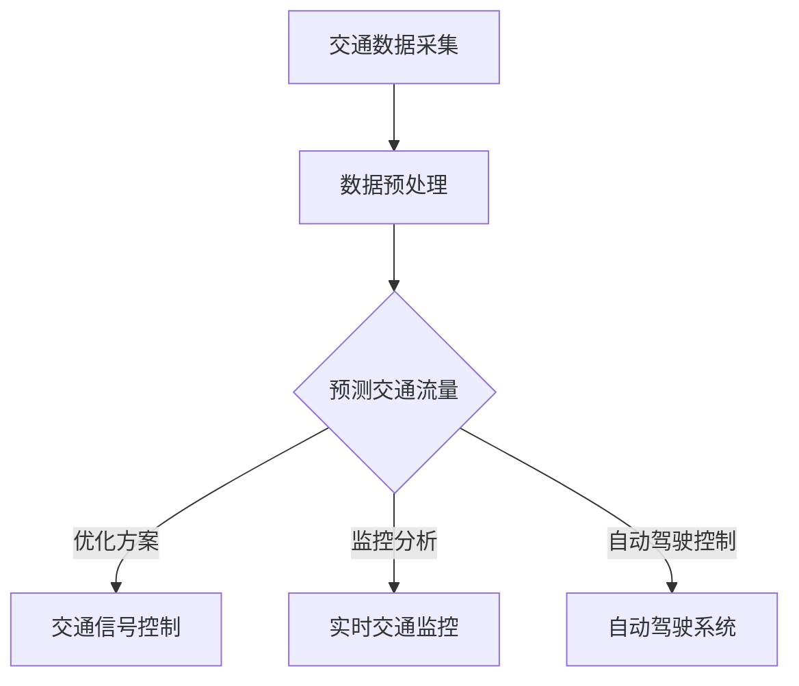

                 

关键词：智能交通管理，AI大模型，深度学习，交通流量预测，交通优化，实时监控，自动驾驶，交通安全性。

摘要：本文将探讨人工智能大模型在智能交通管理中的应用趋势。通过对当前交通管理面临的挑战和需求进行分析，我们介绍了AI大模型的核心概念和应用场景。本文将详细讨论AI大模型在交通流量预测、交通优化、实时监控和自动驾驶等领域的应用，并总结未来的发展趋势与挑战。

## 1. 背景介绍

### 1.1 交通管理的现状

随着城市化进程的加速，交通拥堵、交通事故和环境污染等问题日益严重。传统的交通管理方法已难以应对不断增长的车流量和复杂的交通环境。因此，智能交通管理成为解决当前交通问题的重要途径。

### 1.2 智能交通管理的需求

智能交通管理需要实时监测交通状况，预测交通流量，优化交通信号控制，提高交通效率，减少交通事故和环境污染。为此，需要利用先进的人工智能技术，特别是大模型技术，来实现智能交通管理。

## 2. 核心概念与联系

### 2.1 人工智能大模型

人工智能大模型是指具有极高计算能力和学习能力的神经网络模型。通过大量的数据训练，大模型可以自动学习和发现数据中的复杂模式，从而实现智能决策和预测。

### 2.2 智能交通管理中的核心概念

在智能交通管理中，核心概念包括交通流量预测、交通优化、实时监控和自动驾驶等。

### 2.3 Mermaid流程图

下面是一个描述智能交通管理中AI大模型应用的Mermaid流程图：



## 3. 核心算法原理 & 具体操作步骤

### 3.1 算法原理概述

AI大模型在智能交通管理中的核心算法原理是基于深度学习的神经网络模型。该模型通过大量的交通数据训练，可以自动学习和预测交通流量、优化交通信号控制、实现实时监控和自动驾驶等功能。

### 3.2 算法步骤详解

#### 3.2.1 交通流量预测

1. 数据采集：收集交通流量、车速、交通事件等数据。
2. 数据预处理：对采集到的数据进行清洗、归一化和特征提取。
3. 模型训练：利用预处理后的数据训练深度学习模型，如循环神经网络（RNN）、长短期记忆网络（LSTM）等。
4. 预测交通流量：使用训练好的模型预测未来的交通流量。

#### 3.2.2 交通优化

1. 预测交通流量：利用预测模型获取交通流量数据。
2. 信号控制策略：根据交通流量数据，制定交通信号控制策略，如绿波带、自适应控制等。
3. 实时调整：根据实时交通状况，调整交通信号控制策略。

#### 3.2.3 实时监控

1. 数据采集：收集交通监控数据，如摄像头、传感器等。
2. 数据处理：对采集到的数据进行预处理和特征提取。
3. 监控分析：利用深度学习模型分析交通状况，识别交通事件。
4. 实时反馈：根据分析结果，向交通管理部门提供实时交通信息。

#### 3.2.4 自动驾驶

1. 数据采集：收集车辆传感器数据，如雷达、摄像头、GPS等。
2. 数据处理：对传感器数据预处理和特征提取。
3. 路径规划：利用深度学习模型进行路径规划，实现自动驾驶。
4. 实时控制：根据实时交通状况，调整自动驾驶策略。

### 3.3 算法优缺点

#### 优点：

1. 高效性：AI大模型可以处理大量交通数据，实现快速预测和优化。
2. 智能性：AI大模型具有自学习能力，可以不断优化交通管理策略。
3. 可扩展性：AI大模型可以应用于不同的交通场景和管理需求。

#### 缺点：

1. 计算资源消耗大：训练大模型需要大量的计算资源。
2. 数据依赖性：AI大模型的效果依赖于数据的准确性和多样性。
3. 隐私和安全问题：交通数据涉及个人隐私，需要确保数据安全。

### 3.4 算法应用领域

AI大模型在智能交通管理中的应用领域广泛，包括：

1. 交通流量预测：预测未来的交通流量，优化交通信号控制。
2. 交通优化：优化交通信号控制，减少交通拥堵。
3. 实时监控：监控交通状况，识别交通事件，提供实时交通信息。
4. 自动驾驶：实现自动驾驶，提高交通安全性。

## 4. 数学模型和公式 & 详细讲解 & 举例说明

### 4.1 数学模型构建

AI大模型在智能交通管理中的应用主要基于深度学习模型，其数学模型构建主要包括以下几个部分：

1. 输入层：接收交通数据，如流量、速度、事件等。
2. 隐藏层：通过神经网络对输入数据进行处理，提取特征。
3. 输出层：根据隐藏层的特征进行预测或决策。

### 4.2 公式推导过程

以LSTM模型为例，其数学模型可表示为：

$$
h_t = \sigma(W_h h_{t-1} + W_x x_t + b)
$$

$$
i_t = \sigma(W_i h_{t-1} + W_x x_t + b)
$$

$$
f_t = \sigma(W_f h_{t-1} + W_x x_t + b)
$$

$$
o_t = \sigma(W_o h_{t-1} + W_x x_t + b)
$$

$$
c_t = f_t \odot c_{t-1} + i_t \odot \sigma(W_c h_{t-1} + W_x x_t + b)
$$

$$
h_t = o_t \odot \sigma(c_t)
$$

其中，$h_t$、$c_t$ 分别表示当前时刻的隐藏状态和细胞状态，$x_t$ 表示输入数据，$W_h$、$W_i$、$W_f$、$W_o$、$W_c$ 分别表示权重矩阵，$b$ 表示偏置项，$\sigma$ 表示激活函数，$\odot$ 表示元素乘运算，$\odot$ 表示Hadamard乘积。

### 4.3 案例分析与讲解

以某城市交通流量预测为例，我们利用LSTM模型进行预测。数据集包括过去一周的交通流量数据，输入层包括过去24小时内的交通流量，隐藏层包括10个神经元，输出层包括1个神经元。

1. 数据预处理：对交通流量数据进行归一化处理，将数据缩放到[0,1]之间。
2. 模型训练：利用预处理后的数据训练LSTM模型，设置学习率为0.001，训练100个epoch。
3. 预测交通流量：使用训练好的模型预测未来24小时内的交通流量。

经过训练和预测，LSTM模型能够较好地预测未来交通流量，为交通管理提供参考。

## 5. 项目实践：代码实例和详细解释说明

### 5.1 开发环境搭建

1. 安装Python：版本3.8及以上。
2. 安装TensorFlow：版本2.5及以上。
3. 安装Numpy、Pandas等数据预处理库。

### 5.2 源代码详细实现

以下是一个使用LSTM模型进行交通流量预测的Python代码实例：

```python
import tensorflow as tf
import numpy as np
import pandas as pd

# 数据预处理
def preprocess_data(data):
    # 归一化处理
    data = (data - data.mean()) / data.std()
    # 提取特征
    data = data.values.reshape(-1, 1)
    return data

# 模型训练
def train_model(data, batch_size, epochs):
    # 构建模型
    model = tf.keras.Sequential([
        tf.keras.layers.LSTM(10, input_shape=(24, 1), return_sequences=True),
        tf.keras.layers.LSTM(10, return_sequences=False),
        tf.keras.layers.Dense(1)
    ])

    # 编译模型
    model.compile(optimizer='adam', loss='mse')

    # 训练模型
    model.fit(data, data, batch_size=batch_size, epochs=epochs)

    return model

# 预测交通流量
def predict_traffic(model, data):
    # 预测未来24小时交通流量
    traffic = model.predict(data)
    # 反归一化处理
    traffic = (traffic * data.std()) + data.mean()
    return traffic

# 读取数据
data = pd.read_csv('traffic_data.csv')

# 预处理数据
data = preprocess_data(data)

# 划分训练集和测试集
train_data = data[:24*7]
test_data = data[24*7:]

# 训练模型
model = train_model(train_data, batch_size=32, epochs=100)

# 预测交通流量
traffic = predict_traffic(model, test_data)

# 输出预测结果
print(traffic)
```

### 5.3 代码解读与分析

1. 数据预处理：对交通流量数据进行归一化处理，提取特征。
2. 模型训练：构建LSTM模型，编译模型，训练模型。
3. 预测交通流量：使用训练好的模型预测未来24小时交通流量，并反归一化处理。

### 5.4 运行结果展示

运行代码后，输出未来24小时交通流量预测结果，可以用于交通管理决策。

## 6. 实际应用场景

### 6.1 交通流量预测

AI大模型在交通流量预测中的应用，可以帮助交通管理部门提前了解未来交通状况，制定合理的交通管理策略，缓解交通拥堵。

### 6.2 交通优化

AI大模型可以优化交通信号控制策略，提高交通效率。例如，通过预测交通流量，调整交通信号灯的时序，实现绿波带控制。

### 6.3 实时监控

AI大模型可以实时监控交通状况，识别交通事件，提供实时交通信息。例如，通过摄像头和传感器数据，检测交通事故、道路拥堵等，并向交通管理部门发送预警信息。

### 6.4 自动驾驶

AI大模型在自动驾驶中的应用，可以实现自动驾驶车辆的路径规划、避障和控制。例如，通过深度学习模型，自动驾驶车辆可以实时了解周围交通环境，规划安全、高效的行驶路线。

## 7. 工具和资源推荐

### 7.1 学习资源推荐

1. 《深度学习》（Goodfellow, Bengio, Courville）：深入讲解深度学习的基础理论和应用。
2. 《Python交通数据分析实战》：介绍Python在交通数据分析中的应用。
3. 《智能交通系统》：全面讲解智能交通系统的基本概念、技术和应用。

### 7.2 开发工具推荐

1. TensorFlow：开源深度学习框架，适用于交通流量预测和交通优化。
2. Keras：基于TensorFlow的简洁易用的深度学习库，适合快速实现模型。
3. Pandas：Python数据预处理库，适用于交通数据分析。

### 7.3 相关论文推荐

1. "Deep Learning for Traffic Flow Prediction: A Survey"：对深度学习在交通流量预测领域的应用进行综述。
2. "An Adaptive Traffic Signal Control System Using LSTM Recurrent Neural Networks"：利用LSTM模型优化交通信号控制。
3. "Traffic Flow Prediction Based on Long Short-Term Memory Neural Network"：基于LSTM模型进行交通流量预测。

## 8. 总结：未来发展趋势与挑战

### 8.1 研究成果总结

AI大模型在智能交通管理领域取得了显著的成果，包括交通流量预测、交通优化、实时监控和自动驾驶等。这些成果为智能交通管理提供了有力的技术支持。

### 8.2 未来发展趋势

1. 深度学习模型的发展：未来深度学习模型将更加高效、灵活，适用于不同的交通场景和管理需求。
2. 跨学科研究：智能交通管理需要结合计算机科学、交通工程、数据科学等多个学科，进行跨学科研究。
3. 实时性和鲁棒性提升：提高AI大模型的实时性和鲁棒性，使其能够更好地应对复杂的交通环境。

### 8.3 面临的挑战

1. 数据质量和多样性：AI大模型的效果依赖于数据的准确性和多样性，未来需要解决数据质量和数据来源问题。
2. 隐私和安全问题：交通数据涉及个人隐私，需要确保数据安全，防止数据泄露。
3. 算法解释性和透明度：提高AI大模型的解释性和透明度，使其决策过程更加可信。

### 8.4 研究展望

未来，智能交通管理将朝着更加智能化、自适应化和协同化的方向发展。AI大模型将继续发挥重要作用，为智能交通管理提供技术支持。同时，需要解决数据、隐私和安全等问题，推动智能交通管理的可持续发展。

## 9. 附录：常见问题与解答

### 9.1 如何获取高质量的交通数据？

1. 政府部门：获取交通监控数据、交通事故数据等。
2. 企事业单位：与交通企业合作，获取实时交通流量数据。
3. 开源数据：利用开源数据平台，获取历史交通数据。

### 9.2 AI大模型在交通流量预测中的效果如何？

AI大模型在交通流量预测中具有较好的效果，能够提高预测准确性，但效果取决于数据质量、模型参数和训练数据量。未来需要进一步优化模型结构和训练算法，提高预测效果。

### 9.3 交通数据安全如何保障？

1. 数据加密：对交通数据进行加密处理，确保数据安全。
2. 数据脱敏：对敏感信息进行脱敏处理，保护个人隐私。
3. 权限控制：设置严格的权限控制，确保数据访问权限。

### 9.4 AI大模型在自动驾驶中的应用前景如何？

AI大模型在自动驾驶中具有广阔的应用前景，可以实现自动驾驶车辆的路径规划、避障和控制。未来随着技术的不断发展和完善，自动驾驶将逐步普及，改变人们的出行方式。

作者：禅与计算机程序设计艺术 / Zen and the Art of Computer Programming
----------------------------------------------------------------


