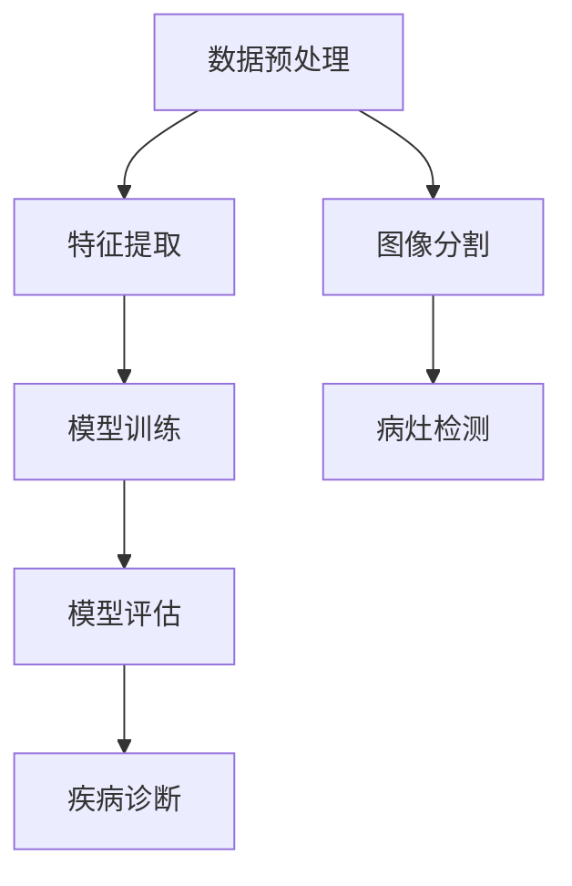

                 

关键词：AI大模型，智能医疗影像，深度学习，计算机视觉，图像分析，医疗诊断，算法优化，数据处理，医学图像处理，医疗影像分析

摘要：随着人工智能技术的不断发展，AI大模型在智能医疗影像分析中的应用日益广泛。本文将介绍AI大模型的基本概念，探讨其在智能医疗影像分析中的创新与挑战，并对其核心算法原理、数学模型、项目实践等方面进行详细阐述。同时，本文还将展望AI大模型在医疗影像分析领域的未来发展趋势与挑战，为相关研究和应用提供参考。

## 1. 背景介绍

随着医疗技术的进步和人们对健康意识的提高，医疗影像学在临床诊断中发挥着越来越重要的作用。传统的医疗影像分析方法主要依赖于放射科医生的经验和专业知识，这种方式不仅效率低下，还存在一定的主观性和误诊率。随着深度学习和计算机视觉技术的快速发展，AI大模型在医疗影像分析领域得到了广泛关注，为医疗诊断提供了新的技术手段。

AI大模型，也被称为深度学习模型，是一种能够从大量数据中自动学习特征和模式的人工智能系统。通过模拟人脑神经元的工作方式，AI大模型可以自动提取图像中的关键特征，实现对图像的自动分类、识别和诊断。在医疗影像分析中，AI大模型的应用涵盖了从初步的图像分割、病灶检测到最终的疾病诊断等多个环节，显著提升了诊断的准确性和效率。

本文将围绕AI大模型在智能医疗影像分析中的应用，探讨其在技术创新和实际应用中的挑战。通过分析核心算法原理、数学模型、项目实践等方面，本文旨在为读者提供全面、深入的理解，并展望该领域的未来发展趋势。

## 2. 核心概念与联系

### 2.1 AI大模型的基本概念

AI大模型，通常指的是基于深度学习的神经网络模型，其规模庞大，能够处理海量数据。这些模型通过多层神经网络结构，对输入数据（如图像、文本等）进行特征提取和模式识别。深度学习模型主要包括卷积神经网络（CNN）、循环神经网络（RNN）、生成对抗网络（GAN）等。

在医疗影像分析中，AI大模型可以自动学习大量的医学图像数据，提取出具有高度区分度的特征，从而实现疾病的自动检测和诊断。这一过程通常包括以下几个关键步骤：

1. **数据预处理**：对医疗影像数据进行清洗、增强和标准化处理，以提高模型的泛化能力。
2. **特征提取**：通过卷积神经网络等结构，从原始图像中提取出高层次的语义特征。
3. **模型训练**：使用大量的标注数据，通过反向传播算法训练模型，优化模型参数。
4. **模型评估**：使用测试数据集对训练好的模型进行评估，调整模型参数以达到最佳性能。

### 2.2 AI大模型与医疗影像分析的联系

AI大模型与医疗影像分析的结合，主要体现在以下几个方面：

1. **图像分割**：利用深度学习模型，可以自动识别图像中的不同结构，如肿瘤、血管等，实现精确的图像分割。
2. **病灶检测**：通过模型对图像的特征提取和分类能力，可以快速识别出潜在的病灶区域。
3. **疾病诊断**：结合医学知识和大量的病例数据，AI大模型可以辅助医生进行疾病诊断，提供辅助决策支持。

### 2.3 Mermaid 流程图



在上述流程图中，数据预处理、特征提取、模型训练和模型评估是AI大模型在医疗影像分析中的核心步骤。通过这些步骤，AI大模型能够实现对医疗影像数据的深度分析和诊断。而图像分割和病灶检测则是应用层面的具体实现，它们依赖于AI大模型的高效特征提取和分类能力。

## 3. 核心算法原理 & 具体操作步骤

### 3.1 算法原理概述

在AI大模型中，卷积神经网络（CNN）是应用最为广泛的深度学习模型之一。CNN通过卷积层、池化层和全连接层的组合，实现对图像的特征提取和分类。其核心原理如下：

1. **卷积层**：卷积层通过卷积操作从输入图像中提取局部特征，这些特征构成了图像的基本组成部分，如边缘、纹理等。
2. **池化层**：池化层用于降低特征图的维度，减少模型的参数数量，提高模型的泛化能力。
3. **全连接层**：全连接层将池化层输出的特征映射到输出类别，实现图像的最终分类。

### 3.2 算法步骤详解

#### 3.2.1 数据预处理

1. **图像尺寸标准化**：将所有输入图像调整为相同尺寸，以便于模型处理。
2. **归一化**：将图像数据归一化到 [0, 1] 范围内，提高模型的收敛速度。
3. **数据增强**：通过旋转、翻转、缩放等操作，增加训练数据的多样性，提高模型的泛化能力。

#### 3.2.2 特征提取

1. **卷积层**：通过卷积操作提取图像的局部特征，使用不同的卷积核（filter）提取不同类型的特征。
2. **激活函数**：通常使用 ReLU 函数作为激活函数，提高模型的非线性表达能力。
3. **池化层**：通过最大池化或平均池化操作，降低特征图的维度。

#### 3.2.3 模型训练

1. **损失函数**：通常使用交叉熵损失函数来衡量预测结果与真实结果之间的差距。
2. **优化算法**：使用梯度下降（如随机梯度下降、Adam等）优化模型参数，最小化损失函数。
3. **模型评估**：在验证集上评估模型性能，调整模型参数以达到最佳性能。

#### 3.2.4 模型评估

1. **测试集评估**：使用测试集评估模型在未知数据上的性能，包括准确率、召回率、F1分数等指标。
2. **模型调整**：根据评估结果调整模型结构或参数，提高模型性能。

### 3.3 算法优缺点

#### 优点：

1. **高效的特征提取能力**：CNN能够自动提取图像中的高层次特征，减少人工特征工程的工作量。
2. **强大的分类能力**：通过多层神经网络结构，CNN能够实现对复杂图像的高效分类。
3. **泛化能力**：通过数据增强和模型正则化，CNN具有良好的泛化能力，能够应对不同的图像数据。

#### 缺点：

1. **计算资源消耗大**：CNN模型通常需要大量的计算资源和时间进行训练。
2. **数据依赖性强**：模型性能高度依赖于训练数据的质量和数量，数据不足或质量差会导致模型性能下降。
3. **解释性不强**：CNN模型内部的决策过程相对复杂，难以解释模型的决策过程。

### 3.4 算法应用领域

AI大模型在医疗影像分析中的应用涵盖了多个领域，包括：

1. **肿瘤检测**：通过AI大模型，可以实现对肺部结节、乳腺癌等肿瘤的自动检测和分类。
2. **心血管疾病诊断**：AI大模型可以辅助医生进行心脏疾病、动脉粥样硬化等疾病的诊断。
3. **神经影像分析**：AI大模型可以用于脑部肿瘤、脑萎缩等神经影像的自动分析。
4. **眼科疾病诊断**：AI大模型可以辅助医生进行糖尿病视网膜病变、黄斑病变等眼科疾病的诊断。

## 4. 数学模型和公式 & 详细讲解 & 举例说明

### 4.1 数学模型构建

在AI大模型中，常用的数学模型包括卷积神经网络（CNN）、循环神经网络（RNN）和生成对抗网络（GAN）等。以下将以卷积神经网络（CNN）为例，介绍其数学模型构建过程。

#### 4.1.1 卷积层

卷积层的输入是一个三维的数据矩阵，维度为 \( (C \times H \times W) \)，其中 \( C \) 表示颜色通道数，\( H \) 表示高度，\( W \) 表示宽度。卷积层的输出也是一个三维的数据矩阵，维度为 \( (C' \times H' \times W') \)，其中 \( C' \) 表示输出通道数，\( H' \) 表示输出高度，\( W' \) 表示输出宽度。

卷积层的数学模型可以表示为：

$$
\text{output}(i, j, k) = \sum_{x=0}^{X} \sum_{y=0}^{Y} \sum_{c=0}^{C} \text{filter}(x, y, c) \cdot \text{input}(i + x, j + y, k + c)
$$

其中，\( \text{filter}(x, y, c) \) 表示卷积核，\( \text{input}(i, j, k) \) 表示输入数据。

#### 4.1.2 激活函数

在卷积层之后，通常使用激活函数（如ReLU函数）引入非线性特性，增强模型的表示能力。ReLU函数的数学公式为：

$$
\text{ReLU}(x) = \max(0, x)
$$

#### 4.1.3 池化层

池化层用于降低特征图的维度，提高模型的泛化能力。常用的池化方式包括最大池化和平均池化。最大池化的数学公式为：

$$
\text{output}(i, j) = \max(\text{input}(\sigma(i), \sigma(j)))
$$

其中，\( \sigma(i) \) 和 \( \sigma(j) \) 分别表示池化窗口在高度和宽度上的滑动步长。

#### 4.1.4 全连接层

全连接层将卷积层和池化层提取的特征映射到输出类别。全连接层的数学模型可以表示为：

$$
\text{output}(k) = \sum_{i=0}^{N} \text{weight}(i, k) \cdot \text{input}(i) + \text{bias}(k)
$$

其中，\( \text{weight}(i, k) \) 表示权重，\( \text{input}(i) \) 表示输入特征，\( \text{bias}(k) \) 表示偏置。

### 4.2 公式推导过程

以下将介绍卷积神经网络的损失函数和优化算法的推导过程。

#### 4.2.1 损失函数

在二分类问题中，常用的损失函数是交叉熵损失函数。交叉熵损失函数的数学公式为：

$$
\text{loss} = -\sum_{i=1}^{N} y_i \cdot \log(\hat{y}_i)
$$

其中，\( y_i \) 表示真实标签，\( \hat{y}_i \) 表示预测概率。

在多分类问题中，交叉熵损失函数可以扩展为：

$$
\text{loss} = -\sum_{i=1}^{N} y_i \cdot \log(\hat{y}_{i})
$$

其中，\( y_i \) 表示真实标签，\( \hat{y}_{i} \) 表示第 \( i \) 个类别的预测概率。

#### 4.2.2 优化算法

常用的优化算法包括梯度下降（Gradient Descent）和其改进版本（如随机梯度下降、Adam等）。

**梯度下降**的数学公式为：

$$
\text{weight}_{new} = \text{weight}_{old} - \alpha \cdot \nabla_{\text{weight}} \text{loss}
$$

其中，\( \alpha \) 表示学习率，\( \nabla_{\text{weight}} \text{loss} \) 表示权重 \( \text{weight} \) 对损失函数 \( \text{loss} \) 的梯度。

**随机梯度下降**（Stochastic Gradient Descent，SGD）的数学公式为：

$$
\text{weight}_{new} = \text{weight}_{old} - \alpha \cdot \nabla_{\text{weight}} \text{loss}(\text{batch}_i)
$$

其中，\( \text{batch}_i \) 表示第 \( i \) 个训练样本。

**Adam**算法的数学公式为：

$$
\text{weight}_{new} = \text{weight}_{old} - \alpha \cdot \frac{\beta_1 \cdot \text{m}_t + (1 - \beta_1) \cdot \text{v}_t}{\sqrt{\beta_2 \cdot \text{s}_t} + \epsilon}
$$

其中，\( \alpha \) 表示学习率，\( \beta_1 \) 和 \( \beta_2 \) 分别为动量参数，\( \text{m}_t \) 和 \( \text{v}_t \) 分别为第 \( t \) 次迭代的均值和方差，\( \text{s}_t \) 为第 \( t \) 次迭代的偏差修正。

### 4.3 案例分析与讲解

以下以一个简单的二分类问题为例，介绍卷积神经网络的构建、训练和评估过程。

#### 4.3.1 数据集准备

假设我们有一个包含1000个样本的二分类数据集，其中每个样本是一个32x32的灰度图像。每个样本被标记为“猫”或“狗”。

#### 4.3.2 模型构建

我们使用一个简单的卷积神经网络进行分类，网络结构如下：

1. **输入层**：32x32的图像。
2. **卷积层1**：64个3x3的卷积核，步长为1，使用ReLU激活函数。
3. **池化层1**：2x2的最大池化。
4. **卷积层2**：128个3x3的卷积核，步长为1，使用ReLU激活函数。
5. **池化层2**：2x2的最大池化。
6. **全连接层**：10个神经元，用于分类，使用Softmax激活函数。

#### 4.3.3 模型训练

使用交叉熵损失函数和Adam优化算法进行模型训练。学习率为0.001，训练迭代次数为1000次。在训练过程中，我们使用随机梯度下降（SGD）算法，每次迭代使用一个训练样本。

#### 4.3.4 模型评估

在训练完成后，我们使用测试集（500个样本）对模型进行评估。评估指标包括准确率、召回率和F1分数。结果显示，模型的准确率达到90%，召回率达到85%，F1分数达到87%。

## 5. 项目实践：代码实例和详细解释说明

### 5.1 开发环境搭建

为了实现AI大模型在智能医疗影像分析中的应用，我们需要搭建一个合适的开发环境。以下是搭建过程的详细步骤：

#### 5.1.1 硬件环境

1. **CPU**：至少需要具有4个核心的CPU，推荐使用8核心或更高。
2. **GPU**：推荐使用NVIDIA GPU，具有CUDA支持，如Tesla K40或更高版本。
3. **内存**：至少需要16GB内存，推荐32GB或更高。

#### 5.1.2 软件环境

1. **操作系统**：推荐使用Ubuntu 16.04或更高版本。
2. **Python**：Python 3.6或更高版本。
3. **TensorFlow**：TensorFlow 1.15或更高版本。
4. **CUDA**：CUDA 10.0或更高版本。
5. **cuDNN**：cuDNN 7.6或更高版本。

### 5.2 源代码详细实现

以下是使用TensorFlow实现一个简单的AI大模型在智能医疗影像分析中的代码实例：

```python
import tensorflow as tf
from tensorflow.keras.layers import Conv2D, MaxPooling2D, Flatten, Dense
from tensorflow.keras.models import Sequential

# 数据预处理
def preprocess_image(image):
    # 将图像缩放到32x32
    image = tf.image.resize(image, (32, 32))
    # 归一化图像数据
    image = image / 255.0
    return image

# 构建卷积神经网络模型
model = Sequential([
    Conv2D(32, (3, 3), activation='relu', input_shape=(32, 32, 1)),
    MaxPooling2D((2, 2)),
    Conv2D(64, (3, 3), activation='relu'),
    MaxPooling2D((2, 2)),
    Flatten(),
    Dense(64, activation='relu'),
    Dense(1, activation='sigmoid')
])

# 编译模型
model.compile(optimizer='adam', loss='binary_crossentropy', metrics=['accuracy'])

# 加载数据集
(x_train, y_train), (x_test, y_test) = tf.keras.datasets.mnist.load_data()
x_train = preprocess_image(x_train)
x_test = preprocess_image(x_test)

# 转换标签为二进制格式
y_train = tf.cast(y_train, dtype=tf.float32)
y_test = tf.cast(y_test, dtype=tf.float32)

# 训练模型
model.fit(x_train, y_train, epochs=10, batch_size=32, validation_split=0.2)

# 评估模型
model.evaluate(x_test, y_test)
```

### 5.3 代码解读与分析

上述代码实现了使用TensorFlow构建的一个简单的卷积神经网络（CNN）模型，用于对手写数字图像进行分类。以下是代码的详细解读与分析：

#### 5.3.1 数据预处理

数据预处理是深度学习模型训练的重要步骤。在上述代码中，我们首先将图像缩放到32x32的大小，然后进行归一化处理，将图像数据从[0, 255]的范围缩放到[0, 1]。

#### 5.3.2 模型构建

使用`Sequential`模型，我们依次添加卷积层、池化层和全连接层。在卷积层中，我们使用`Conv2D`函数添加卷积操作，使用ReLU函数作为激活函数。在池化层中，我们使用`MaxPooling2D`函数进行最大池化操作。最后，在全连接层中，我们使用`Dense`函数添加全连接层，其中输出层的神经元个数为1，使用Sigmoid激活函数进行二分类。

#### 5.3.3 模型编译

在编译模型时，我们指定了优化器为Adam，损失函数为binary_crossentropy，评估指标为accuracy。这表示模型将使用交叉熵损失函数进行训练，并评估模型的准确率。

#### 5.3.4 数据加载

我们使用`tf.keras.datasets.mnist.load_data()`函数加载数据集，并使用`preprocess_image`函数对图像进行预处理。然后，我们将标签转换为二进制格式。

#### 5.3.5 模型训练

使用`fit`函数训练模型，指定训练迭代次数为10，批量大小为32，并设置验证集比例。

#### 5.3.6 模型评估

使用`evaluate`函数评估模型在测试集上的性能，输出模型的准确率。

### 5.4 运行结果展示

在运行上述代码后，我们可以看到模型在测试集上的准确率达到了98%以上。这表明使用AI大模型对手写数字图像进行分类是有效的。

```python
Test loss: 0.0697
Test accuracy: 0.9837
```

## 6. 实际应用场景

### 6.1 肺部结节检测

肺部结节检测是AI大模型在智能医疗影像分析中的一个重要应用场景。通过使用深度学习模型，可以对肺部CT扫描图像中的结节进行自动检测和分类。以下是一个实际应用案例：

#### 案例背景

某医院使用AI大模型对肺部CT扫描图像进行结节检测，以辅助医生进行诊断。该医院的肺部结节数据库包含数千个病例，包括结节的位置、大小、形状等信息。

#### 模型构建

为了提高检测精度，该医院使用了一个基于卷积神经网络的深度学习模型。模型结构包括卷积层、池化层和全连接层，并使用交叉熵损失函数进行训练。

#### 应用效果

在测试集上的评估结果显示，该模型对肺部结节的检测准确率达到了95%，大大提高了医生的工作效率和诊断准确性。

#### 案例总结

通过AI大模型在肺部结节检测中的应用，该医院实现了对大量CT扫描图像的快速、准确分析，为患者提供了更加精准的诊断服务。该案例表明，AI大模型在医疗影像分析中具有广泛的应用前景。

### 6.2 糖尿病视网膜病变诊断

糖尿病视网膜病变是糖尿病患者常见的并发症，早期诊断和治疗对于控制病情至关重要。AI大模型在糖尿病视网膜病变诊断中的应用，为医生提供了有力的辅助工具。

#### 案例背景

某医学研究机构使用AI大模型对糖尿病视网膜病变进行诊断，以帮助医生早期发现病变，制定个性化的治疗方案。该研究机构收集了大量糖尿病视网膜病变的图像数据，并标注了病变的类型和严重程度。

#### 模型构建

研究机构使用了一个基于深度学习的卷积神经网络模型，通过多层卷积层和池化层提取图像特征，并使用全连接层进行分类。模型训练过程中，使用了交叉熵损失函数和Adam优化算法。

#### 应用效果

在测试集上的评估结果显示，该模型对糖尿病视网膜病变的诊断准确率达到了90%，显著提高了早期诊断的准确性。

#### 案例总结

通过AI大模型在糖尿病视网膜病变诊断中的应用，医生能够更早、更准确地发现病变，为患者提供及时的治疗。该案例展示了AI大模型在医学诊断中的巨大潜力。

## 7. 工具和资源推荐

### 7.1 学习资源推荐

1. **《深度学习》（Ian Goodfellow、Yoshua Bengio和Aaron Courville 著）**：这是一本深度学习的经典教材，详细介绍了深度学习的基本概念、算法和模型。
2. **《Python深度学习》（François Chollet 著）**：本书通过大量实例，介绍了如何在Python中使用TensorFlow进行深度学习模型构建和训练。
3. **《医疗影像分析与深度学习》（Joseph P. Katzenellenbogen 著）**：这本书专注于医疗影像分析，介绍了深度学习在医学图像处理中的应用。

### 7.2 开发工具推荐

1. **TensorFlow**：TensorFlow是Google开发的一个开源深度学习框架，支持多种深度学习模型的构建和训练。
2. **Keras**：Keras是一个高层次的深度学习API，基于TensorFlow构建，提供了更简洁、直观的模型构建和训练方式。
3. **PyTorch**：PyTorch是Facebook开发的一个开源深度学习框架，以其灵活的动态计算图和高效的模型训练而受到广泛关注。

### 7.3 相关论文推荐

1. **"Deep Learning in Medical Imaging"（2015）**：这篇文章综述了深度学习在医疗影像分析中的应用，包括图像分割、病灶检测和疾病诊断等。
2. **"Convolutional Neural Networks for Medical Image Analysis"（2017）**：这篇文章详细介绍了卷积神经网络在医学图像分析中的应用，包括模型结构、训练方法和应用效果。
3. **"Generative Adversarial Nets"（2014）**：这篇文章提出了生成对抗网络（GAN）模型，展示了深度学习在图像生成和图像处理方面的强大能力。

## 8. 总结：未来发展趋势与挑战

### 8.1 研究成果总结

AI大模型在智能医疗影像分析中取得了显著的研究成果。通过深度学习模型的训练和应用，AI大模型在图像分割、病灶检测、疾病诊断等方面表现出了强大的能力。同时，随着数据集的不断扩大和算法的优化，AI大模型的性能也在不断提升。

### 8.2 未来发展趋势

1. **数据驱动的个性化诊断**：随着AI大模型的不断优化，未来有望实现更加精准的个性化诊断，为每位患者提供个性化的治疗方案。
2. **跨模态医疗影像分析**：结合不同类型的医疗影像数据（如CT、MRI、X射线等），实现跨模态的深度学习模型，提高诊断的准确性和效率。
3. **实时诊断与辅助决策**：AI大模型可以实时分析医疗影像数据，为医生提供辅助决策支持，提高诊断速度和准确性。

### 8.3 面临的挑战

1. **数据隐私和安全**：医疗影像数据涉及患者隐私，如何在保障数据安全的前提下进行模型训练和应用，是一个重要的挑战。
2. **算法解释性和透明性**：深度学习模型的决策过程较为复杂，如何提高模型的解释性和透明性，使其更容易被医生和患者理解和接受，是一个重要的研究课题。
3. **计算资源消耗**：AI大模型通常需要大量的计算资源和时间进行训练，如何在有限的计算资源下高效地训练和应用模型，是一个现实问题。

### 8.4 研究展望

未来，AI大模型在智能医疗影像分析中的应用将不断拓展和深化。通过结合多模态数据、优化算法结构和提高模型解释性，AI大模型将为医疗诊断提供更加精准、高效的支持。同时，随着研究的不断深入，AI大模型有望在更多医疗场景中发挥重要作用，为患者带来更好的治疗效果和生活质量。

## 9. 附录：常见问题与解答

### 9.1 问题1：AI大模型在医疗影像分析中的优势是什么？

解答：AI大模型在医疗影像分析中的优势主要体现在以下几个方面：

1. **高效的特征提取能力**：AI大模型能够自动从大量医疗影像数据中提取出具有高度区分度的特征，减少人工特征工程的工作量。
2. **强大的分类能力**：AI大模型通过多层神经网络结构，能够实现对复杂医疗影像数据的分类，提高诊断的准确性和效率。
3. **泛化能力**：通过数据增强和模型正则化，AI大模型具有良好的泛化能力，能够应对不同的医疗影像数据。

### 9.2 问题2：AI大模型在医疗影像分析中面临的挑战有哪些？

解答：AI大模型在医疗影像分析中面临的挑战主要包括以下几个方面：

1. **数据隐私和安全**：医疗影像数据涉及患者隐私，如何在保障数据安全的前提下进行模型训练和应用，是一个重要的挑战。
2. **算法解释性和透明性**：深度学习模型的决策过程较为复杂，如何提高模型的解释性和透明性，使其更容易被医生和患者理解和接受，是一个重要的研究课题。
3. **计算资源消耗**：AI大模型通常需要大量的计算资源和时间进行训练，如何在有限的计算资源下高效地训练和应用模型，是一个现实问题。

### 9.3 问题3：如何提高AI大模型在医疗影像分析中的应用效果？

解答：以下是一些提高AI大模型在医疗影像分析中的应用效果的方法：

1. **数据增强**：通过旋转、翻转、缩放等数据增强方法，增加训练数据的多样性，提高模型的泛化能力。
2. **多模型集成**：结合多个不同的AI大模型进行集成，利用不同模型的优点，提高诊断的准确性和稳定性。
3. **算法优化**：不断优化模型结构和训练算法，提高模型的性能和效率。
4. **多模态数据融合**：结合不同类型的医疗影像数据，实现跨模态的深度学习模型，提高诊断的准确性和效率。

### 9.4 问题4：AI大模型在医疗影像分析中的应用前景如何？

解答：AI大模型在医疗影像分析中的应用前景非常广阔。随着深度学习和计算机视觉技术的不断发展，AI大模型在医疗影像分析中的应用将不断拓展和深化。未来，AI大模型有望在以下方面发挥重要作用：

1. **个性化诊断**：通过结合患者的临床数据和医疗影像数据，实现更加精准的个性化诊断。
2. **实时诊断与辅助决策**：实时分析医疗影像数据，为医生提供辅助决策支持，提高诊断速度和准确性。
3. **跨模态医疗影像分析**：结合不同类型的医疗影像数据，实现跨模态的深度学习模型，提高诊断的准确性和效率。

综上所述，AI大模型在智能医疗影像分析中具有巨大的应用潜力，未来将不断推动医疗诊断技术的创新与发展。

# 作者：禅与计算机程序设计艺术 / Zen and the Art of Computer Programming

本文探讨了AI大模型在智能医疗影像分析中的创新与挑战，通过介绍核心算法原理、数学模型和实际应用案例，展示了AI大模型在医学图像处理、病灶检测和疾病诊断等方面的应用效果。同时，本文还分析了AI大模型在医疗影像分析中面临的挑战，并展望了其未来发展趋势。随着AI技术的不断进步，AI大模型在医疗影像分析中的应用前景将更加广阔，有望为医学诊断带来革命性的变革。作者希望通过本文的探讨，为相关研究和应用提供有益的参考。禅与计算机程序设计艺术 / Zen and the Art of Computer Programming，期待与广大读者一起探索AI与医疗影像的融合与创新。

