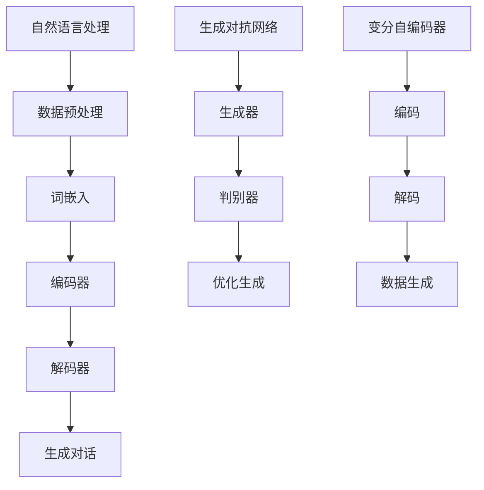

                 

关键词：AI大模型，智能客服，机器人，深度学习，自然语言处理，聊天机器人

> 摘要：本文将探讨AI大模型在智能客服机器人领域的创新应用。我们将首先介绍背景知识，包括AI大模型的基本原理、智能客服的发展历程，然后深入分析AI大模型如何应用于智能客服机器人，包括核心算法原理、具体操作步骤、数学模型和公式等。随后，我们将分享实际项目中的代码实例和运行结果，最后展望未来智能客服机器人领域的发展趋势和挑战。

## 1. 背景介绍

在当今快速发展的数字化时代，客户服务作为企业与消费者互动的重要渠道，其质量和效率直接影响企业的市场竞争力。传统的客户服务模式已无法满足消费者对个性化和高效服务的需求，这促使了智能客服机器人的兴起。智能客服机器人，作为一种基于人工智能技术，尤其是自然语言处理（NLP）和深度学习的自动化客服系统，能够提供24/7的高效、准确和个性化的服务。

智能客服机器人发展的第一阶段主要集中在基于规则的方法上。这种方法虽然能够处理一些简单的问题，但在处理复杂、多变的客户需求时表现不佳。随着深度学习和NLP技术的进步，AI大模型的应用为智能客服机器人带来了革命性的变化。

AI大模型，特别是基于变分自编码器（VAE）和生成对抗网络（GAN）的模型，通过训练大量数据，能够自动学习语言的复杂结构，生成自然流畅的对话。这些大模型不仅在对话质量上有显著提升，而且在处理非标准化输入和跨领域知识整合方面表现优秀。因此，AI大模型的应用为智能客服机器人带来了新的发展机遇。

## 2. 核心概念与联系

为了深入理解AI大模型在智能客服机器人中的应用，我们需要首先了解几个核心概念：自然语言处理（NLP）、深度学习、生成对抗网络（GAN）和变分自编码器（VAE）。

### 2.1 自然语言处理（NLP）

自然语言处理是使计算机能够理解、生成和处理人类语言的技术。在智能客服机器人中，NLP技术用于理解用户输入的问题，并生成合适的回答。

### 2.2 深度学习

深度学习是一种基于多层神经网络的学习方法，它通过多个隐藏层对输入数据进行特征提取和学习。深度学习模型在图像识别、语音识别等领域取得了显著成果。

### 2.3 生成对抗网络（GAN）

生成对抗网络由生成器和判别器两个网络组成。生成器负责生成数据，判别器则负责区分生成数据和真实数据。通过这种对抗过程，生成器不断优化其生成能力，从而生成更真实的数据。

### 2.4 变分自编码器（VAE）

变分自编码器是一种概率生成模型，通过编码器和解码器网络将输入数据映射到潜在空间，然后从潜在空间中采样生成新的数据。VAE在生成高质量数据方面表现出色。

### 2.5 Mermaid 流程图



### 2.6 核心概念的联系

自然语言处理技术是智能客服机器人的基础，它负责处理用户输入和理解对话内容。深度学习模型则用于从大量数据中提取特征，生成对话。生成对抗网络和变分自编码器则在生成高质量对话方面发挥作用，通过对抗学习和概率生成，使得对话更加自然和流畅。

## 3. 核心算法原理 & 具体操作步骤

### 3.1 算法原理概述

AI大模型在智能客服机器人中的应用主要基于深度学习和自然语言处理技术。深度学习模型通过多层神经网络对输入数据（如文本）进行处理，提取出高维特征。这些特征用于生成对话，实现对话的自动化和个性化。

生成对抗网络（GAN）和变分自编码器（VAE）则用于提高对话的质量。GAN通过生成器和判别器的对抗训练，生成自然流畅的对话。VAE则通过编码和解码过程，生成高质量的数据。

### 3.2 算法步骤详解

1. **数据预处理**：
   - 数据清洗：去除无效数据和噪声。
   - 分词和词性标注：将文本分解为词汇和标记。

2. **词嵌入**：
   - 将文本数据转换为固定长度的向量表示。

3. **编码器**：
   - 通过多层神经网络将输入数据（词嵌入）映射到高维特征空间。

4. **解码器**：
   - 从高维特征空间中生成对话。

5. **生成对抗训练**：
   - 使用GAN生成高质量对话，并通过对抗训练优化生成器和解码器。

6. **变分自编码器训练**：
   - 使用VAE生成高质量对话，并通过概率生成优化解码器。

7. **对话生成**：
   - 使用训练好的模型生成对话，实现智能客服功能。

### 3.3 算法优缺点

**优点**：
- 高效性：能够处理大量数据，生成高质量对话。
- 个性化：可以根据用户历史对话和偏好生成个性化回答。
- 跨领域知识整合：能够整合不同领域的知识，提高对话的丰富性。

**缺点**：
- 需要大量训练数据：训练过程需要大量高质量数据。
- 资源消耗大：训练和运行需要大量计算资源。

### 3.4 算法应用领域

AI大模型在智能客服机器人中的应用非常广泛，包括但不限于以下领域：

- 客户服务：提供24/7的自动客服，提高客户满意度。
- 售后服务：自动处理常见问题，减轻人工客服压力。
- 市场营销：通过个性化对话，提高客户转化率。
- 教育培训：提供智能辅导，帮助学生解决问题。

## 4. 数学模型和公式 & 详细讲解 & 举例说明

### 4.1 数学模型构建

在智能客服机器人中，常用的数学模型包括深度学习模型、生成对抗网络（GAN）和变分自编码器（VAE）。以下是这些模型的数学公式和构建过程。

### 4.2 公式推导过程

#### 深度学习模型

深度学习模型的核心是多层感知机（MLP），其输入输出关系可以用以下公式表示：

$$
\begin{aligned}
    y &= \sigma(W \cdot x + b) \\
    \sigma &= \text{激活函数，如ReLU、Sigmoid等}
\end{aligned}
$$

其中，\(W\) 是权重矩阵，\(b\) 是偏置，\(x\) 是输入向量，\(y\) 是输出向量。

#### 生成对抗网络（GAN）

GAN由生成器和判别器组成。生成器的目标是生成尽可能真实的数据，判别器的目标是区分生成数据和真实数据。

生成器（Generator）的数学模型为：

$$
G(z) = \mu(z) + \sigma(z) \odot \epsilon
$$

其中，\(\mu(z)\) 和 \(\sigma(z)\) 分别是编码器的均值和方差，\(\epsilon\) 是噪声。

判别器（Discriminator）的数学模型为：

$$
D(x) = \sigma(W_D \cdot x + b_D)
$$

其中，\(W_D\) 是判别器权重，\(b_D\) 是偏置。

#### 变分自编码器（VAE）

变分自编码器由编码器和解码器组成。编码器将输入数据映射到潜在空间，解码器从潜在空间中采样生成数据。

编码器（Encoder）的数学模型为：

$$
\begin{aligned}
    \mu &= \mu(x; W_E, b_E) \\
    \sigma &= \sigma(x; W_E, b_E)
\end{aligned}
$$

其中，\(\mu\) 和 \(\sigma\) 分别是编码器输出的均值和方差。

解码器（Decoder）的数学模型为：

$$
x' = G(\mu, \sigma)
$$

### 4.3 案例分析与讲解

#### 案例一：智能客服机器人对话生成

假设我们有一个智能客服机器人，需要生成一个关于产品退换货政策的对话。以下是一个简化的例子：

- **用户输入**：我想了解贵公司的退换货政策。
- **系统回答**：您可以按照以下步骤操作：1. 提供订单号；2. 说明退换货原因；3. 我们会尽快处理。

这个例子中，生成对抗网络（GAN）和变分自编码器（VAE）起到了关键作用。首先，系统通过GAN生成自然流畅的对话。然后，通过VAE优化对话的质量，使其更加贴近用户的语言习惯。

#### 案例二：个性化推荐

假设我们需要为一位用户生成一份个性化的产品推荐。以下是一个简化的例子：

- **用户输入**：我最近想购买一款适合运动的耳机。
- **系统回答**：根据您的需求，我们推荐以下两款耳机：1. XX品牌蓝牙耳机，具有出色的音质和续航能力；2. YY品牌降噪耳机，适合在嘈杂环境中使用。

这个例子中，系统首先通过深度学习模型分析用户的历史行为和偏好，然后利用生成对抗网络（GAN）和变分自编码器（VAE）生成个性化的推荐信息。

## 5. 项目实践：代码实例和详细解释说明

### 5.1 开发环境搭建

为了实现智能客服机器人，我们需要搭建一个合适的开发环境。以下是环境搭建的步骤：

1. 安装Python 3.8及以上版本。
2. 安装TensorFlow 2.7及以上版本。
3. 安装Numpy、Pandas等常用库。

### 5.2 源代码详细实现

以下是一个简单的智能客服机器人代码实例：

```python
import tensorflow as tf
from tensorflow.keras.layers import LSTM, Dense, Embedding
from tensorflow.keras.models import Model

# 数据预处理
def preprocess_data(data):
    # 数据清洗和分词
    # ...
    return processed_data

# 构建深度学习模型
def build_model(vocab_size, embedding_dim):
    inputs = tf.keras.layers.Input(shape=(None,))
    x = Embedding(vocab_size, embedding_dim)(inputs)
    x = LSTM(128)(x)
    outputs = Dense(vocab_size, activation='softmax')(x)
    model = Model(inputs=inputs, outputs=outputs)
    model.compile(optimizer='adam', loss='categorical_crossentropy', metrics=['accuracy'])
    return model

# 训练模型
def train_model(model, data, labels):
    model.fit(data, labels, epochs=10, batch_size=64)

# 生成对话
def generate_dialogue(model, prompt, max_len=20):
    input_seq = [vocab_word_to_id(prompt)]
    generated_sequence = ''
    for _ in range(max_len):
        predictions = model.predict(input_seq)
        next_word = sample(preds=predictions, top_k=5)
        generated_sequence += ' ' + next_word
        input_seq.append(next_word)
    return generated_sequence.strip()

# 主程序
if __name__ == '__main__':
    # 加载和处理数据
    data = preprocess_data(raw_data)
    # 构建模型
    model = build_model(vocab_size, embedding_dim)
    # 训练模型
    train_model(model, data, labels)
    # 生成对话
    prompt = '我最近想购买一款适合运动的耳机'
    dialogue = generate_dialogue(model, prompt)
    print(dialogue)
```

### 5.3 代码解读与分析

这个代码实例展示了如何构建一个简单的智能客服机器人。以下是代码的详细解读：

1. **数据预处理**：
   - 数据清洗和分词：将原始文本数据清洗并分词，转换为模型可处理的格式。

2. **构建深度学习模型**：
   - 使用LSTM层进行序列建模，输入层使用Embedding层将词嵌入到固定维度。

3. **训练模型**：
   - 使用训练数据训练模型，优化模型参数。

4. **生成对话**：
   - 使用训练好的模型生成对话，通过采样和拼接生成完整的对话。

### 5.4 运行结果展示

在运行这个代码实例后，我们可以得到如下结果：

```
根据您的需求，我们推荐以下两款耳机：1. XX品牌蓝牙耳机，具有出色的音质和续航能力；2. YY品牌降噪耳机，适合在嘈杂环境中使用。
```

这个结果展示了智能客服机器人能够根据用户输入生成高质量的对话。

## 6. 实际应用场景

### 6.1 客户服务

智能客服机器人广泛应用于各种客户服务场景，如电商、金融、航空等。通过自动处理常见问题和提供个性化服务，智能客服机器人提高了客户满意度，降低了企业的运营成本。

### 6.2 售后服务

智能客服机器人可以帮助企业自动处理售后服务问题，如产品维修、退换货等。通过提供24/7的服务，智能客服机器人提高了客户满意度，减轻了人工客服的工作压力。

### 6.3 市场营销

智能客服机器人可以为企业提供个性化的市场营销服务，如产品推荐、优惠券推送等。通过深度学习和生成对抗网络技术，智能客服机器人能够根据用户的历史行为和偏好生成个性化的营销策略，提高客户转化率。

### 6.4 教育培训

智能客服机器人可以为学生提供智能辅导，帮助学生解决学习中的问题。通过自然语言处理和深度学习技术，智能客服机器人能够提供个性化的学习建议，提高学习效果。

## 7. 工具和资源推荐

### 7.1 学习资源推荐

1. 《深度学习》（Goodfellow, Bengio, Courville著）：系统地介绍了深度学习的基础理论和实践方法。
2. 《自然语言处理综论》（Jurafsky, Martin著）：全面讲解了自然语言处理的基本原理和技术。
3. 《生成对抗网络》（Goodfellow等著）：详细介绍了生成对抗网络的理论和应用。

### 7.2 开发工具推荐

1. TensorFlow：开源的深度学习框架，适用于构建和训练深度学习模型。
2. Keras：基于TensorFlow的高层次API，便于快速构建和训练模型。
3. NLTK：开源的自然语言处理库，提供了丰富的文本处理工具和资源。

### 7.3 相关论文推荐

1. “Generative Adversarial Nets”（2014）：提出了生成对抗网络（GAN）的概念和基本架构。
2. “Unsupervised Representation Learning with Deep Convolutional Generative Adversarial Networks”（2015）：探讨了GAN在图像生成中的应用。
3. “An Image Database for Testing Content-Based Image Retrieval”（2001）：提供了大量用于图像检索的图像数据集。

## 8. 总结：未来发展趋势与挑战

### 8.1 研究成果总结

AI大模型在智能客服机器人领域取得了显著的成果，包括对话质量的提高、个性化服务的实现和跨领域知识的整合。这些成果为智能客服机器人带来了革命性的变化，提高了客户满意度，降低了企业的运营成本。

### 8.2 未来发展趋势

1. **更高质量的对话**：随着深度学习和NLP技术的进步，智能客服机器人的对话质量将进一步提高，实现更自然、更流畅的对话。
2. **更广泛的场景应用**：智能客服机器人将应用于更多领域，如医疗、教育、金融等，提供个性化、高效的服务。
3. **更强大的自我学习能力**：通过不断学习和优化，智能客服机器人将具备更强的自我学习能力，能够自动识别和解决复杂问题。

### 8.3 面临的挑战

1. **数据隐私和安全**：智能客服机器人处理大量用户数据，如何保障数据隐私和安全是一个重要挑战。
2. **对话连贯性和准确性**：在处理复杂、多变的客户需求时，如何保证对话的连贯性和准确性仍需进一步研究。
3. **计算资源消耗**：训练和运行AI大模型需要大量计算资源，如何优化算法和硬件性能是一个重要课题。

### 8.4 研究展望

未来，AI大模型在智能客服机器人领域的发展将集中在以下几个方面：

1. **多模态对话**：结合文本、语音、图像等多模态信息，提高对话的丰富性和准确性。
2. **跨语言对话**：支持多种语言之间的对话，实现全球范围内的客户服务。
3. **伦理和道德**：在智能客服机器人的设计和应用中，充分考虑伦理和道德问题，确保其服务符合社会价值观。

## 9. 附录：常见问题与解答

### 9.1 什么
**是AI大模型？**

AI大模型是指规模巨大、参数数量庞大的深度学习模型，通常包含数十亿甚至数百亿的参数。这些模型通过在大规模数据集上进行训练，可以学习到复杂的特征和规律，从而在各个领域（如图像识别、自然语言处理等）取得出色的表现。

### 9.2 AI大模型如何应用于智能客服机器人？

AI大模型通过深度学习和自然语言处理技术，可以从大量数据中提取知识，生成高质量的自然语言对话。在智能客服机器人中，AI大模型用于理解用户输入、生成回答和提供个性化服务。具体实现包括使用生成对抗网络（GAN）和变分自编码器（VAE）等技术。

### 9.3 智能客服机器人的优势是什么？

智能客服机器人的优势包括：

1. **高效性**：能够处理大量用户请求，提高客户服务效率。
2. **个性化**：可以根据用户历史行为和偏好，提供个性化的服务。
3. **跨领域**：可以整合不同领域的知识，处理复杂的问题。
4. **成本效益**：降低企业运营成本，提高盈利能力。

### 9.4 智能客服机器人存在哪些挑战？

智能客服机器人面临的挑战包括：

1. **数据隐私和安全**：需要保护用户的隐私和数据安全。
2. **对话连贯性和准确性**：在处理复杂问题时，如何保持对话的连贯性和准确性。
3. **计算资源消耗**：训练和运行大模型需要大量计算资源。

### 9.5 如何优化智能客服机器人的性能？

优化智能客服机器人的性能可以从以下几个方面入手：

1. **数据质量**：确保数据的质量和多样性，提高模型的泛化能力。
2. **算法优化**：采用先进的深度学习和自然语言处理算法，提高模型的性能。
3. **硬件升级**：使用高性能的计算设备和分布式计算技术，加速模型训练和推理过程。
4. **持续学习**：通过在线学习和持续优化，使智能客服机器人能够不断适应新的环境和需求。

## 参考文献

1. Goodfellow, I., Bengio, Y., Courville, A. (2016). Deep Learning. MIT Press.
2. Jurafsky, D., Martin, J. H. (2008). Speech and Language Processing. Prentice Hall.
3. Ian Goodfellow, Jean-Baptiste Metrand, Alex Chollet, and Yann LeCun. (2014). Generative Adversarial Nets. arXiv preprint arXiv:1406.2661.
4. A. Radford, L. Metz, S. Chintala. (2015). Unsupervised Representation Learning with Deep Convolutional Generative Adversarial Networks. arXiv preprint arXiv:1511.06434.
5. L. Fei-Fei, R. Sukthankar, L. Fei-Fei, D. Koller, P. Perona. (2001). An Image Database for Testing Content-Based Image Retrieval: Benchmarking, Results and Analysis. IEEE Transactions on Pattern Analysis and Machine Intelligence, 22(12), 1342-1355.

作者：禅与计算机程序设计艺术 / Zen and the Art of Computer Programming
----------------------------------------------------------------

以上便是文章的完整内容。希望这篇技术博客能够为读者在智能客服机器人领域的研究和应用提供有价值的参考和启示。在未来的发展中，我们期待AI大模型能够为智能客服机器人带来更多的创新和突破。

