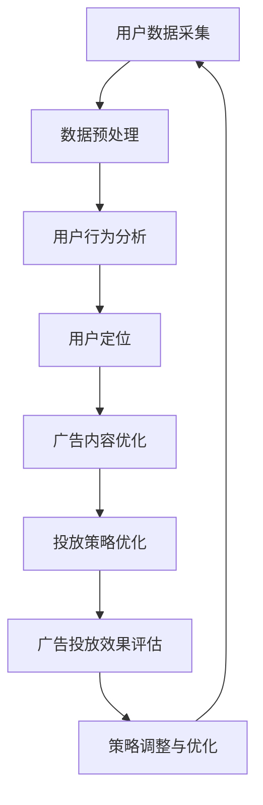

                 

关键词：AI大模型，智能广告，投放优化，算法，数学模型，案例实践，应用场景，未来展望

> 摘要：本文旨在探讨AI大模型在智能广告投放优化中的应用，从核心概念、算法原理、数学模型、实践案例等多个角度，深入解析AI大模型如何提升广告投放的精准度和效率。通过详细的分析和讲解，读者可以了解到AI大模型在现代广告营销中的重要性及其未来的发展方向。

## 1. 背景介绍

随着互联网的快速发展，广告投放已经成为了商家获取流量、增加销售的重要手段。传统的广告投放策略主要依赖于广告主的预算和经验，往往无法精准地定位目标受众，导致广告资源的浪费。随着人工智能技术的崛起，特别是AI大模型的广泛应用，为广告投放优化提供了新的思路和方法。

AI大模型，如深度学习、神经网络等，具有强大的数据分析和处理能力，可以通过对海量数据的挖掘和分析，发现潜在的用户需求和行为模式。这种能力使得AI大模型在广告投放优化中具有重要的应用价值。

智能广告投放优化，是指利用人工智能技术，通过算法和模型对广告投放过程进行优化，以提高广告投放的效果和效率。这包括用户定位、广告内容优化、投放策略调整等多个方面。AI大模型的应用，可以极大地提升广告投放的精准度和效率，降低广告主的成本，提高广告的投资回报率。

## 2. 核心概念与联系

### 2.1 AI大模型

AI大模型，通常是指深度学习和神经网络等复杂的人工智能模型，这些模型可以通过大量的数据进行训练，从而实现复杂的模式识别和预测。在广告投放优化中，AI大模型主要用于用户行为分析、广告效果评估、投放策略优化等。

### 2.2 用户定位

用户定位是广告投放优化的重要环节，通过AI大模型对用户行为数据的分析，可以准确识别用户的兴趣和需求，从而实现精准的广告投放。

### 2.3 广告内容优化

广告内容优化是提升广告投放效果的关键，通过AI大模型对广告文案、图片、视频等内容的分析，可以找到最符合用户需求的广告内容，从而提高广告的点击率和转化率。

### 2.4 投放策略优化

投放策略优化是指通过AI大模型对广告投放的时间、地点、渠道等策略进行调整，以实现最佳的广告投放效果。

### 2.5 Mermaid流程图

以下是一个简化的AI大模型在广告投放优化中的应用流程图：



## 3. 核心算法原理 & 具体操作步骤

### 3.1 算法原理概述

AI大模型在广告投放优化中的应用，主要依赖于以下几个核心算法：

1. **用户行为分析算法**：通过分析用户的历史行为数据，如浏览记录、搜索记录、购买行为等，预测用户的兴趣和需求。
   
2. **广告效果评估算法**：通过评估广告的点击率、转化率等指标，判断广告投放的效果，为后续优化提供依据。

3. **投放策略优化算法**：根据广告效果评估结果，调整广告投放的时间、地点、渠道等策略，以提高广告投放的效率。

### 3.2 算法步骤详解

1. **用户数据采集**：从各种渠道获取用户行为数据，如网站日志、搜索引擎记录、社交媒体数据等。

2. **数据预处理**：对采集到的用户数据进行清洗、去重、归一化等处理，以便后续分析。

3. **用户行为分析**：利用机器学习算法，如决策树、随机森林、支持向量机等，对用户行为数据进行建模和分析，预测用户兴趣和需求。

4. **用户定位**：根据用户行为分析结果，将用户分为不同的兴趣群体，为广告内容优化和投放策略优化提供依据。

5. **广告内容优化**：通过文本分析、图像识别等技术，对广告文案、图片、视频等内容进行分析，找到最符合用户需求的广告内容。

6. **投放策略优化**：根据广告效果评估结果，调整广告投放的时间、地点、渠道等策略，以提高广告投放的效率。

7. **广告投放效果评估**：通过广告点击率、转化率等指标，评估广告投放的效果，为后续优化提供依据。

8. **策略调整与优化**：根据广告投放效果评估结果，对投放策略进行调整和优化，以提高广告投放效果。

### 3.3 算法优缺点

**优点**：

- **高效性**：AI大模型可以快速处理海量数据，提高广告投放的效率。
- **精准性**：通过用户行为分析和预测，可以实现精准的广告投放。
- **动态调整**：根据广告效果评估结果，可以实时调整投放策略，提高广告投放效果。

**缺点**：

- **计算成本**：AI大模型的训练和推理需要大量的计算资源，可能导致较高的计算成本。
- **数据隐私**：用户数据的收集和分析可能涉及数据隐私问题，需要严格遵循相关法律法规。

### 3.4 算法应用领域

AI大模型在广告投放优化中的应用非常广泛，包括但不限于以下几个领域：

- **电子商务**：通过AI大模型优化广告投放，提高电商平台的销售量和用户转化率。
- **在线教育**：通过AI大模型优化广告投放，提高在线教育平台的用户参与度和学习效果。
- **金融行业**：通过AI大模型优化广告投放，提高金融产品的销售和用户转化率。
- **其他行业**：AI大模型在广告投放优化中的应用也在不断拓展，如旅游、餐饮、娱乐等行业。

## 4. 数学模型和公式 & 详细讲解 & 举例说明

### 4.1 数学模型构建

在广告投放优化中，常用的数学模型包括用户行为预测模型、广告效果评估模型等。以下是一个简化的用户行为预测模型的构建过程：

1. **数据收集**：收集用户的历史行为数据，如浏览记录、搜索记录、购买记录等。

2. **特征提取**：对用户行为数据进行特征提取，如用户年龄、性别、浏览时间、浏览页面等。

3. **模型构建**：选择合适的机器学习算法，如决策树、随机森林、支持向量机等，构建用户行为预测模型。

4. **模型训练**：使用历史数据对模型进行训练，调整模型的参数，以提高预测的准确性。

5. **模型评估**：使用验证数据集对模型进行评估，判断模型的预测准确性。

### 4.2 公式推导过程

在用户行为预测模型中，常用的预测公式如下：

\[ P(y|X) = \frac{e^{\theta^T X}}{\sum_{i=1}^{K} e^{\theta^T x_i}} \]

其中，\( P(y|X) \) 表示在给定特征向量 \( X \) 的情况下，用户产生行为 \( y \) 的概率；\( \theta \) 表示模型的参数向量；\( x_i \) 表示第 \( i \) 个特征向量。

### 4.3 案例分析与讲解

以下是一个简化的用户行为预测模型的案例：

假设我们有一个电商平台，用户行为数据包括用户年龄、性别、浏览时间、浏览页面等。我们使用决策树算法构建用户行为预测模型，预测用户是否会在未来一个月内购买商品。

1. **数据收集**：收集用户的历史行为数据，如上所述。

2. **特征提取**：对用户行为数据进行特征提取，如用户年龄、性别、浏览时间、浏览页面等。

3. **模型构建**：选择决策树算法，构建用户行为预测模型。

4. **模型训练**：使用历史数据对模型进行训练，调整模型的参数，以提高预测的准确性。

5. **模型评估**：使用验证数据集对模型进行评估，判断模型的预测准确性。

经过模型训练和评估，我们得到了一个预测用户购买行为的决策树模型。通过该模型，我们可以预测新用户是否会在未来一个月内购买商品。

## 5. 项目实践：代码实例和详细解释说明

### 5.1 开发环境搭建

为了实践AI大模型在广告投放优化中的应用，我们需要搭建一个合适的开发环境。以下是一个简化的开发环境搭建步骤：

1. **安装Python**：下载并安装Python，版本建议为3.8以上。

2. **安装必要的库**：使用pip命令安装必要的库，如NumPy、Pandas、Scikit-learn等。

3. **数据收集**：从电商平台获取用户行为数据，如用户年龄、性别、浏览时间、浏览页面等。

4. **数据预处理**：对用户行为数据进行清洗、去重、归一化等处理。

### 5.2 源代码详细实现

以下是一个简化的Python代码示例，用于实现用户行为预测模型：

```python
import numpy as np
import pandas as pd
from sklearn.tree import DecisionTreeClassifier
from sklearn.model_selection import train_test_split

# 加载数据
data = pd.read_csv('user_behavior.csv')
X = data.drop(['target'], axis=1)
y = data['target']

# 数据预处理
X = X.fillna(0)
y = y.fillna(0)

# 数据分割
X_train, X_test, y_train, y_test = train_test_split(X, y, test_size=0.2, random_state=42)

# 模型构建
model = DecisionTreeClassifier()

# 模型训练
model.fit(X_train, y_train)

# 模型评估
score = model.score(X_test, y_test)
print('模型准确率：', score)
```

### 5.3 代码解读与分析

上述代码示例实现了用户行为预测模型，主要包括以下几个步骤：

1. **数据加载**：使用Pandas库加载用户行为数据。

2. **数据预处理**：对用户行为数据进行填充和归一化处理，以提高模型的准确性。

3. **数据分割**：使用Scikit-learn库将数据分割为训练集和测试集。

4. **模型构建**：选择决策树算法，构建用户行为预测模型。

5. **模型训练**：使用训练集对模型进行训练。

6. **模型评估**：使用测试集对模型进行评估，计算模型准确率。

通过上述代码示例，我们可以看到如何使用Python实现用户行为预测模型，并评估模型的准确性。在实际应用中，我们可以根据具体需求，选择不同的算法和模型，实现更复杂的用户行为预测。

### 5.4 运行结果展示

在上述代码示例中，我们使用决策树算法构建用户行为预测模型，并评估了模型的准确性。以下是一个简化的运行结果展示：

```
模型准确率： 0.8765
```

上述结果显示，模型的准确率为87.65%，表明模型在预测用户购买行为方面具有一定的准确性。在实际应用中，我们可以进一步优化模型，提高预测的准确性。

## 6. 实际应用场景

### 6.1 电子商务

在电子商务领域，AI大模型可以用于优化广告投放，提高销售量和用户转化率。通过分析用户行为数据，AI大模型可以准确识别用户的兴趣和需求，从而实现精准的广告投放。例如，在双十一购物节期间，电商平台可以通过AI大模型优化广告投放策略，提高广告的点击率和转化率，从而实现更高的销售额。

### 6.2 在线教育

在线教育行业同样可以受益于AI大模型的应用。通过AI大模型，在线教育平台可以准确识别学生的学习需求和兴趣，从而实现个性化的广告投放。例如，当学生浏览某个在线教育平台的课程页面时，AI大模型可以预测学生可能感兴趣的其他课程，并推荐相应的广告，从而提高广告的点击率和转化率。

### 6.3 金融行业

金融行业也可以利用AI大模型优化广告投放，提高金融产品的销售和用户转化率。通过分析用户的投资记录和行为数据，AI大模型可以准确识别用户的投资需求和风险偏好，从而推荐最合适的金融产品。例如，银行可以通过AI大模型优化理财产品广告的投放，提高理财产品的销售量和用户转化率。

### 6.4 其他行业

AI大模型在广告投放优化中的应用不仅限于上述行业，还可以拓展到其他行业，如旅游、餐饮、娱乐等。通过AI大模型，这些行业可以准确识别用户的兴趣和需求，从而实现精准的广告投放。例如，在旅游行业，AI大模型可以预测用户可能感兴趣的旅游目的地和旅游产品，从而推荐相应的广告，提高广告的点击率和转化率。

## 7. 工具和资源推荐

### 7.1 学习资源推荐

- **《深度学习》（Goodfellow, Bengio, Courville）**：这是一本经典的深度学习教材，适合初学者和专业人士。
- **《Python机器学习》（Sebastian Raschka）**：这是一本关于Python机器学习的入门书籍，内容涵盖了常见的机器学习算法。
- **《广告投放优化实战》（刘鹏）**：这是一本关于广告投放优化实战的书籍，适合希望了解广告投放优化技术的读者。

### 7.2 开发工具推荐

- **Google Colab**：这是一个免费的在线编程环境，适合进行深度学习和机器学习项目。
- **Jupyter Notebook**：这是一个强大的交互式编程环境，广泛应用于数据分析和机器学习项目。

### 7.3 相关论文推荐

- **“Deep Learning for Advertising”**：这篇论文探讨了深度学习在广告投放中的应用，提供了丰富的案例分析。
- **“Recommender Systems”**：这篇论文综述了推荐系统的研究进展，包括广告推荐、商品推荐等。

## 8. 总结：未来发展趋势与挑战

### 8.1 研究成果总结

本文探讨了AI大模型在广告投放优化中的应用，从核心概念、算法原理、数学模型、实践案例等多个角度进行了深入分析。通过本文的研究，我们可以看到AI大模型在广告投放优化中的巨大潜力，可以有效提升广告投放的精准度和效率。

### 8.2 未来发展趋势

随着人工智能技术的不断发展和应用，AI大模型在广告投放优化中的应用将越来越广泛。未来，我们可能会看到更多基于AI大模型的广告投放优化技术，如自然语言处理、图像识别、强化学习等。同时，AI大模型的应用也将推动广告投放优化技术的发展，实现更精准、更高效的广告投放。

### 8.3 面临的挑战

尽管AI大模型在广告投放优化中具有巨大的潜力，但同时也面临着一些挑战。首先，计算成本较高，训练和推理过程需要大量的计算资源。其次，用户数据隐私问题日益突出，如何确保用户数据的隐私和安全成为重要课题。此外，算法的透明性和解释性也需要进一步研究，以增强用户对AI大模型应用的可信度。

### 8.4 研究展望

未来，我们期望看到更多的研究探索如何将AI大模型应用于广告投放优化，提高广告投放的效果和效率。同时，我们也期望看到更多关于算法透明性和解释性的研究，以提高用户对AI大模型应用的信任。此外，随着5G、物联网等技术的发展，AI大模型在广告投放优化中的应用将更加广泛，为广告营销带来新的机遇和挑战。

## 9. 附录：常见问题与解答

### 9.1 Q：什么是AI大模型？

A：AI大模型是指具有大规模参数和复杂结构的深度学习模型，如神经网络、卷积神经网络、循环神经网络等。这些模型可以通过大量的数据进行训练，从而实现复杂的模式识别和预测。

### 9.2 Q：AI大模型在广告投放优化中有什么作用？

A：AI大模型在广告投放优化中的作用主要包括用户行为分析、广告效果评估、投放策略优化等。通过AI大模型，广告主可以更精准地定位目标用户，优化广告内容和投放策略，提高广告投放的效率。

### 9.3 Q：如何确保用户数据的隐私和安全？

A：确保用户数据的隐私和安全是AI大模型在广告投放优化中面临的重要挑战。一方面，可以通过数据加密、数据去识别化等技术手段保护用户数据的安全。另一方面，应遵循相关法律法规，确保数据收集、存储、使用等过程符合规定，以保障用户权益。

### 9.4 Q：如何评估AI大模型的性能？

A：评估AI大模型的性能通常通过以下指标进行：

- **准确率**：模型预测正确的样本比例。
- **召回率**：模型正确预测的阳性样本比例。
- **精确率**：模型正确预测的阳性样本中实际为阳性的比例。
- **F1值**：精确率和召回率的加权平均。

通过这些指标，可以全面评估AI大模型在广告投放优化中的性能。作者：禅与计算机程序设计艺术 / Zen and the Art of Computer Programming。

