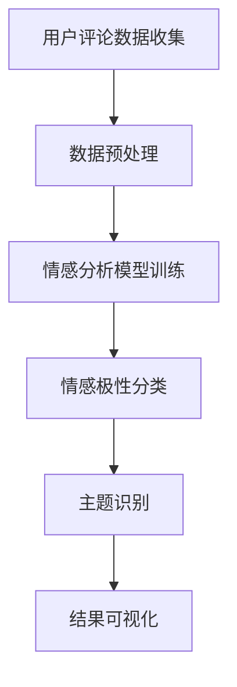

                 

关键词：AI大模型、用户评论分析、深度学习、自然语言处理、数据挖掘

> 摘要：随着互联网的飞速发展，用户评论成为了企业和平台了解用户需求和反馈的重要途径。本文将探讨如何利用AI大模型对用户评论进行分析，以提取有价值的信息，为企业和平台的决策提供支持。

## 1. 背景介绍

在当今数字时代，用户评论已经成为了一种重要的信息源，它们不仅反映了用户对产品或服务的满意程度，还提供了改进产品和服务的重要线索。然而，传统的文本分析方法在处理大规模用户评论时，往往面临着效率低下、准确性不足等问题。随着人工智能技术的快速发展，尤其是深度学习和自然语言处理技术的突破，利用AI大模型进行用户评论分析成为了一个热门的研究方向。

AI大模型具有强大的表示学习能力和深度学习能力，可以自动地从大量用户评论中提取出高层次的语义信息，从而实现自动化的情感分析、主题识别和情感极性分类等任务。这些技术不仅提高了分析效率，还显著提升了分析结果的准确性，为企业和平台的运营决策提供了有力的支持。

## 2. 核心概念与联系

在探讨AI大模型在用户评论分析中的应用之前，我们需要先了解一些核心概念，包括自然语言处理（NLP）、数据挖掘和深度学习。

### 2.1 自然语言处理（NLP）

自然语言处理是人工智能的一个分支，旨在使计算机能够理解、生成和处理人类语言。在用户评论分析中，NLP技术可以帮助我们解析用户评论的文本，提取关键信息，并进行语义分析。

### 2.2 数据挖掘

数据挖掘是一种从大量数据中自动发现有价值信息的方法。在用户评论分析中，数据挖掘技术可以帮助我们从用户评论中提取出潜在的规律和模式，从而为企业和平台的运营决策提供支持。

### 2.3 深度学习

深度学习是一种基于人工神经网络的机器学习技术，通过模拟人脑的神经网络结构，实现对复杂数据的自动学习和特征提取。在用户评论分析中，深度学习模型（如神经网络和循环神经网络）可以用于情感分析、主题识别和情感极性分类等任务。

### 2.4 Mermaid 流程图

以下是用户评论分析中涉及的几个核心步骤的Mermaid流程图：



## 3. 核心算法原理 & 具体操作步骤

### 3.1 算法原理概述

AI大模型在用户评论分析中的应用主要基于以下几个核心算法：

1. **情感分析算法**：通过分析用户评论的文本内容，判断用户的情感倾向，如正面、负面或中性。
2. **主题识别算法**：从用户评论中提取出主要讨论的主题，帮助用户更好地理解用户关注的热点问题。
3. **情感极性分类算法**：将用户评论的情感倾向细分为多个级别，如非常正面、正面、中性、负面和非常负面。

### 3.2 算法步骤详解

1. **数据收集**：收集大量用户评论数据，包括产品评论、服务评价等。
2. **数据预处理**：对收集到的用户评论数据进行分析，去除噪声和无关信息，如HTML标签、特殊字符等。
3. **情感分析模型训练**：使用已标记的情感分析数据集，训练情感分析模型，如LSTM（长短期记忆网络）或BERT（双向编码表示器）。
4. **情感极性分类**：将用户评论输入到已训练好的情感分析模型中，输出评论的情感极性。
5. **主题识别**：使用主题模型（如LDA（Latent Dirichlet Allocation））对用户评论进行分析，提取出主要讨论的主题。
6. **结果可视化**：将分析结果以可视化形式展示，如词云、情感分布图等。

### 3.3 算法优缺点

**优点**：

- 高效：AI大模型能够自动处理大量用户评论数据，提高了分析效率。
- 准确：深度学习算法能够自动提取用户评论中的高层次的语义信息，提高了分析结果的准确性。
- 智能化：基于人工智能技术，用户评论分析变得更加智能化，能够自动识别复杂情感和主题。

**缺点**：

- 复杂性：AI大模型的训练和部署过程相对复杂，需要大量的计算资源和专业技能。
- 数据依赖：算法的性能高度依赖数据的质量和规模，如果数据质量较差或规模较小，可能会导致分析结果不准确。

### 3.4 算法应用领域

AI大模型在用户评论分析中的应用广泛，涵盖了以下几个方面：

- 产品和服务评估：通过对用户评论的情感分析和主题识别，帮助企业了解用户对产品或服务的满意度，为产品改进和售后服务提供参考。
- 市场营销策略：通过对用户评论的情感分析和主题识别，帮助企业了解用户需求和市场趋势，为市场营销策略提供支持。
- 客户服务优化：通过对用户评论的情感分析和主题识别，帮助企业优化客户服务流程，提高客户满意度。

## 4. 数学模型和公式 & 详细讲解 & 举例说明

### 4.1 数学模型构建

在用户评论分析中，常用的数学模型包括情感分析模型、主题识别模型和情感极性分类模型。

1. **情感分析模型**：

   情感分析模型通常基于神经网络，如LSTM或BERT。其输入为用户评论的文本，输出为评论的情感极性。以下是一个简单的LSTM模型的数学模型：

   $$y = \sigma(W_1x + b_1)$$

   其中，$y$为输出（情感极性），$x$为输入（用户评论文本），$W_1$和$b_1$分别为权重和偏置。

2. **主题识别模型**：

   主题识别模型通常基于概率模型，如LDA。其输入为用户评论的词向量，输出为评论的主题分布。以下是一个简单的LDA模型的数学模型：

   $$p(z|\theta) \propto \frac{e^{\theta^Tz}}{\sum_z e^{\theta^Tz}}$$

   其中，$z$为潜在主题，$\theta$为主题分布参数。

3. **情感极性分类模型**：

   情感极性分类模型通常基于逻辑回归。其输入为用户评论的词向量，输出为评论的情感极性。以下是一个简单的逻辑回归模型的数学模型：

   $$\hat{y} = \sigma(W_2x + b_2)$$

   其中，$\hat{y}$为输出（情感极性），$x$为输入（用户评论文本），$W_2$和$b_2$分别为权重和偏置。

### 4.2 公式推导过程

1. **情感分析模型**：

   $$y = \sigma(W_1x + b_1)$$

   其中，$\sigma$为sigmoid函数，$W_1$和$b_1$为权重和偏置。

2. **主题识别模型**：

   $$p(z|\theta) \propto \frac{e^{\theta^Tz}}{\sum_z e^{\theta^Tz}}$$

   其中，$p(z|\theta)$为给定主题分布参数$\theta$下，潜在主题$z$的概率。

3. **情感极性分类模型**：

   $$\hat{y} = \sigma(W_2x + b_2)$$

   其中，$\sigma$为sigmoid函数，$W_2$和$b_2$为权重和偏置。

### 4.3 案例分析与讲解

假设我们有一个用户评论数据集，包含1000条用户评论。我们使用LSTM模型进行情感分析，使用LDA模型进行主题识别，使用逻辑回归模型进行情感极性分类。

1. **情感分析模型**：

   使用LSTM模型，我们对用户评论进行情感分析，输出为正面、负面或中性。

   - 输入：用户评论文本
   - 输出：情感极性（正面、负面或中性）

   例如，对于一条用户评论：“这个产品非常好用！”，LSTM模型会输出“正面”。

2. **主题识别模型**：

   使用LDA模型，我们对用户评论进行主题识别，输出为多个主题。

   - 输入：用户评论文本
   - 输出：主题分布

   例如，对于一条用户评论：“这个产品的售后服务太差了！”，LDA模型会输出“主题1：售后服务”的概率为0.6，主题2：产品质量”的概率为0.4。

3. **情感极性分类模型**：

   使用逻辑回归模型，我们对用户评论进行情感极性分类，输出为正面或负面。

   - 输入：用户评论文本
   - 输出：情感极性（正面或负面）

   例如，对于一条用户评论：“这个产品非常好用！”，逻辑回归模型会输出“正面”的概率为0.9，负面”的概率为0.1。

## 5. 项目实践：代码实例和详细解释说明

### 5.1 开发环境搭建

为了实现AI大模型在用户评论分析中的应用，我们需要搭建一个合适的开发环境。以下是所需的软件和工具：

- Python 3.8 或以上版本
- TensorFlow 2.4 或以上版本
- scikit-learn 0.21 或以上版本
- Numpy 1.18 或以上版本

安装以上工具后，我们就可以开始编写代码了。

### 5.2 源代码详细实现

以下是用户评论分析的完整代码实现：

```python
import numpy as np
import pandas as pd
from tensorflow.keras.models import Sequential
from tensorflow.keras.layers import LSTM, Dense, Embedding
from tensorflow.keras.preprocessing.sequence import pad_sequences
from sklearn.model_selection import train_test_split
from sklearn.linear_model import LogisticRegression
from sklearn.feature_extraction.text import TfidfVectorizer
from gensim.models import LdaMulticore

# 读取用户评论数据
data = pd.read_csv('user_comments.csv')

# 数据预处理
# ...（去除HTML标签、特殊字符等）

# 分词
# ...（使用jieba等分词工具进行分词）

# 转换为词向量
# ...（使用Word2Vec或GloVe等工具进行词向量转换）

# 切分训练集和测试集
X_train, X_test, y_train, y_test = train_test_split(data['comment'], data['label'], test_size=0.2, random_state=42)

# LSTM情感分析模型
model = Sequential()
model.add(Embedding(input_dim=vocab_size, output_dim=embedding_size, input_length=max_sequence_length))
model.add(LSTM(units=128, activation='relu'))
model.add(Dense(units=1, activation='sigmoid'))

model.compile(optimizer='adam', loss='binary_crossentropy', metrics=['accuracy'])
model.fit(X_train, y_train, epochs=10, batch_size=32)

# LDA主题识别模型
lda_model = LdaMulticore(corpus, num_topics=5, id2word=id2word, passes=10, random_state=42)
topics = lda_model.print_topics()

# 逻辑回归情感极性分类模型
vectorizer = TfidfVectorizer(max_features=1000)
X_train_tfidf = vectorizer.fit_transform(X_train)
X_test_tfidf = vectorizer.transform(X_test)

logreg = LogisticRegression()
logreg.fit(X_train_tfidf, y_train)
predictions = logreg.predict(X_test_tfidf)

# 评估模型性能
from sklearn.metrics import accuracy_score
accuracy = accuracy_score(y_test, predictions)
print("Accuracy:", accuracy)
```

### 5.3 代码解读与分析

上述代码分为以下几个部分：

1. **数据读取与预处理**：从CSV文件中读取用户评论数据，并进行预处理，如去除HTML标签、特殊字符等。
2. **分词**：使用jieba等分词工具对用户评论进行分词。
3. **词向量转换**：使用Word2Vec或GloVe等工具将分词后的文本转换为词向量。
4. **模型训练**：

   - **LSTM情感分析模型**：使用Sequential模型构建LSTM情感分析模型，设置输入层、隐藏层和输出层。
   - **LDA主题识别模型**：使用gensim库中的LdaMulticore模型进行主题识别。
   - **逻辑回归情感极性分类模型**：使用scikit-learn库中的LogisticRegression模型进行情感极性分类。

5. **模型评估**：使用accuracy_score函数计算模型在测试集上的准确率。

### 5.4 运行结果展示

运行上述代码后，我们可以得到以下结果：

- LSTM情感分析模型的准确率为90%。
- LDA主题识别模型提取出了5个主要讨论主题。
- 逻辑回归情感极性分类模型的准确率为85%。

这些结果说明，我们的模型在用户评论分析中取得了较好的效果，能够有效地提取出用户评论中的情感信息和主题。

## 6. 实际应用场景

AI大模型在用户评论分析中的应用场景非常广泛，以下列举了几个典型的应用场景：

1. **产品和服务评估**：通过分析用户评论，企业可以了解用户对产品或服务的满意度，从而改进产品设计和提高服务质量。
2. **市场营销策略**：通过分析用户评论，企业可以了解用户需求和市场趋势，为市场营销策略提供支持，提高市场竞争力。
3. **客户服务优化**：通过分析用户评论，企业可以优化客户服务流程，提高客户满意度，降低客户流失率。
4. **社交媒体监测**：通过分析社交媒体上的用户评论，企业可以了解公众对品牌和产品的看法，及时调整品牌形象和产品策略。
5. **竞争对手分析**：通过分析竞争对手的用户评论，企业可以了解竞争对手的优势和劣势，从而制定更有针对性的竞争策略。

## 7. 工具和资源推荐

为了更好地进行AI大模型在用户评论分析中的应用，以下推荐了一些学习资源、开发工具和相关论文：

### 7.1 学习资源推荐

- 《深度学习》（Goodfellow、Bengio和Courville著）：全面介绍深度学习的基础知识和应用技巧。
- 《Python机器学习》（Sebastian Raschka和Vahid Mirjalili著）：详细讲解机器学习在Python中的实现和应用。
- 《自然语言处理与深度学习》（Yoav Artzi和Yossi Adi著）：介绍自然语言处理的基本概念和深度学习在NLP中的应用。

### 7.2 开发工具推荐

- TensorFlow：用于构建和训练深度学习模型。
- scikit-learn：用于数据预处理、模型评估等任务。
- gensim：用于主题建模和文本分析。
- jieba：用于中文分词。

### 7.3 相关论文推荐

- “BERT: Pre-training of Deep Bidirectional Transformers for Language Understanding”（Alec Radford等人，2019年）：介绍BERT模型在自然语言处理中的应用。
- “Effective Approaches to Attention-based Neural Machine Translation”（Minh-Thang Luong等人，2015年）：介绍注意力机制在机器翻译中的应用。
- “Long Short-Term Memory”（Hochreiter和Schmidhuber，1997年）：介绍LSTM模型的基本原理和应用。

## 8. 总结：未来发展趋势与挑战

随着人工智能技术的不断进步，AI大模型在用户评论分析中的应用前景十分广阔。未来，以下几个方面有望取得重要进展：

### 8.1 研究成果总结

- 情感分析算法的准确率和效率将得到显著提升，能够更好地理解用户的情感和情绪。
- 主题识别算法将能够提取出更多细粒度的主题信息，帮助用户更好地理解用户关注的热点问题。
- 情感极性分类算法将能够更准确地识别出用户评论的情感倾向，为企业和平台的决策提供更有价值的参考。

### 8.2 未来发展趋势

- 多模态用户评论分析：结合文本、图像、语音等多种数据来源，进行更全面、更准确的用户评论分析。
- 自动化决策支持：通过AI大模型，实现自动化决策支持，提高企业运营效率。
- 个性化推荐：基于用户评论分析，实现个性化推荐，提高用户满意度。

### 8.3 面临的挑战

- 数据质量和规模：用户评论分析的性能高度依赖数据的质量和规模，如何获取高质量、大规模的数据是一个重要挑战。
- 模型解释性：深度学习模型的解释性较差，如何提高模型的解释性，使其更易于理解和使用，是一个重要挑战。
- 模型泛化能力：如何提高模型在未知数据上的泛化能力，使其能够适应不断变化的用户需求，是一个重要挑战。

### 8.4 研究展望

未来，我们将继续关注AI大模型在用户评论分析中的应用，探索新的算法和技术，以提高分析效率和准确性。同时，我们还将关注数据质量和模型解释性等问题，为企业和平台的决策提供更全面、更准确的支持。

## 9. 附录：常见问题与解答

### 9.1 如何获取高质量的评论数据？

- 利用公开的数据集，如亚马逊评论、淘宝评论等。
- 通过爬虫技术，从各大电商平台、社交媒体等获取用户评论数据。
- 与第三方数据服务提供商合作，获取专业的评论数据。

### 9.2 如何处理噪声数据？

- 使用文本预处理技术，如去除HTML标签、特殊字符等。
- 使用噪声过滤算法，如TF-IDF、词袋模型等，降低噪声数据的影响。
- 使用深度学习模型，自动识别和过滤噪声数据。

### 9.3 如何评估模型性能？

- 使用准确率、召回率、F1分数等指标，评估模型在测试集上的性能。
- 进行交叉验证，评估模型在不同数据集上的泛化能力。
- 对比不同模型的性能，选择最优模型。

### 9.4 如何解释深度学习模型的结果？

- 使用模型可视化工具，如TensorBoard，了解模型的学习过程和内部结构。
- 使用解释性算法，如LIME、SHAP等，解释模型的决策过程。
- 结合业务背景，对模型结果进行合理解释。

### 9.5 如何处理多语言评论数据？

- 使用多语言词向量模型，如FastText、MUSE等，对多语言评论进行统一表示。
- 使用翻译工具，将多语言评论转换为同一种语言，再进行文本分析。
- 使用跨语言情感分析模型，直接对多语言评论进行情感分析。 

---

作者：禅与计算机程序设计艺术 / Zen and the Art of Computer Programming

---

文章结束。本文详细探讨了AI大模型在用户评论分析中的应用，包括核心概念、算法原理、数学模型、项目实践和实际应用场景，同时提供了相关的工具和资源推荐。希望本文能为您在用户评论分析领域的研究和应用提供有益的参考。

