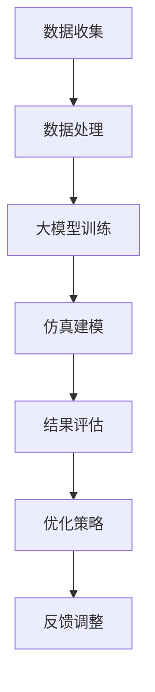

                 

关键词：人工智能、大模型、供应链优化、仿真、电商平台

摘要：本文旨在探讨人工智能（AI）大模型在电商平台供应链优化中的应用。通过对AI大模型的介绍和供应链优化的背景分析，本文将详细阐述大模型在供应链仿真中的核心作用，包括算法原理、数学模型、应用案例和未来展望。希望通过本文，能够为电商平台提供一种高效、智能的供应链优化解决方案。

## 1. 背景介绍

随着互联网和电子商务的快速发展，电商平台已成为现代商业的重要组成部分。供应链作为电商平台运营的核心环节，直接影响到企业的成本、效率和市场竞争力。然而，供应链管理面临诸多挑战，如库存管理、物流优化、订单处理等。传统方法难以应对复杂多变的供应链环境，因此，引入人工智能（AI）大模型进行供应链优化仿真，成为一种新的解决思路。

AI大模型具有强大的数据处理能力和自学习能力，可以在海量数据中挖掘潜在规律，从而优化供应链管理。例如，通过机器学习算法，可以预测市场需求，优化库存水平；通过深度学习模型，可以分析物流路径，提高运输效率。本文将围绕AI大模型在供应链优化仿真中的应用，进行深入探讨。

## 2. 核心概念与联系

为了更好地理解AI大模型在供应链优化仿真中的应用，首先需要介绍一些核心概念和其相互联系。

### 2.1 人工智能（AI）

人工智能是指计算机系统模拟人类智能行为的技术。它包括机器学习、深度学习、自然语言处理等多种技术。在这些技术中，大模型是一种重要的方法，通过学习海量数据，实现高效的信息处理和智能决策。

### 2.2 供应链管理

供应链管理是指企业通过计划、实施、控制等手段，对产品从原材料采购到最终交付的全过程进行管理。它包括库存管理、物流管理、订单管理等多个环节。

### 2.3 仿真

仿真是指通过计算机模拟现实世界的过程，以评估和优化系统的性能。在供应链管理中，仿真可以用来模拟供应链的各种场景，评估不同策略的效果，从而优化供应链管理。

### 2.4 供应链优化仿真

供应链优化仿真是指利用人工智能大模型，对供应链各环节进行模拟和优化。通过仿真，可以预测市场需求、优化库存水平、分析物流路径等，从而提高供应链的效率。

以下是一个简单的Mermaid流程图，展示了AI大模型在供应链优化仿真中的应用：



## 3. 核心算法原理 & 具体操作步骤

### 3.1  算法原理概述

AI大模型在供应链优化仿真中的核心算法主要包括机器学习和深度学习。机器学习算法通过学习历史数据，预测市场需求和库存水平；深度学习算法通过建立复杂的神经网络模型，模拟供应链的运行过程，优化物流路径和订单处理。

### 3.2  算法步骤详解

（以下为算法的具体操作步骤，可根据实际需求进行适当调整）

#### 3.2.1 数据收集

收集供应链相关的数据，包括市场需求、库存水平、物流路径等。这些数据可以通过电商平台的数据仓库获取，也可以通过传感器、物流系统等实时采集。

#### 3.2.2 数据处理

对收集到的数据进行清洗、预处理，去除噪音和异常值，确保数据的准确性和一致性。可以使用数据挖掘和统计分析方法，提取有用的信息。

#### 3.2.3 大模型训练

使用机器学习和深度学习算法，对预处理后的数据进行训练。训练过程包括数据划分、模型选择、参数调优等步骤。常用的机器学习算法有线性回归、决策树、支持向量机等；深度学习算法有卷积神经网络（CNN）、循环神经网络（RNN）、Transformer等。

#### 3.2.4 仿真建模

根据训练好的大模型，建立供应链仿真模型。仿真模型可以模拟供应链的各种场景，评估不同策略的效果。仿真过程包括场景设定、参数设置、运行仿真等步骤。

#### 3.2.5 结果评估

对仿真结果进行评估，分析市场需求预测、库存管理、物流优化等环节的表现。评估指标包括准确率、召回率、F1值等。

#### 3.2.6 优化策略

根据评估结果，调整供应链管理策略，优化库存水平、物流路径和订单处理。优化策略可以通过机器学习算法的预测结果和深度学习模型的模拟结果进行指导。

#### 3.2.7 反馈调整

将优化后的策略应用到实际运营中，收集反馈数据，对模型进行迭代优化。反馈调整过程可以不断改进模型，提高供应链的效率。

### 3.3  算法优缺点

#### 优点

- 强大的数据处理能力：大模型可以处理海量数据，提高预测和优化的准确性。
- 高效的决策支持：大模型可以实时分析供应链运行状况，提供高效的决策支持。
- 自适应能力：大模型可以根据历史数据和实时数据，不断调整优化策略。

#### 缺点

- 计算资源消耗大：大模型训练和仿真过程需要大量的计算资源，对硬件设备要求较高。
- 数据依赖性强：大模型的性能依赖于数据质量，数据缺失或异常可能导致模型失效。

### 3.4  算法应用领域

AI大模型在供应链优化仿真中的应用领域广泛，包括但不限于：

- 库存管理：预测市场需求，优化库存水平，减少库存成本。
- 物流优化：分析物流路径，提高运输效率，降低物流成本。
- 订单处理：预测订单量，优化订单处理流程，提高订单交付速度。
- 风险管理：预测供应链风险，制定应急预案，降低风险损失。

## 4. 数学模型和公式 & 详细讲解 & 举例说明

在AI大模型应用于供应链优化仿真中，数学模型和公式是核心组成部分。以下将详细介绍数学模型的构建、公式推导过程，并通过具体案例进行分析和讲解。

### 4.1 数学模型构建

#### 4.1.1 需求预测模型

需求预测模型主要用于预测市场需求，为库存管理和订单处理提供数据支持。常见的需求预测模型有线性回归模型、ARIMA模型和神经网络模型等。

假设市场需求为\(D_t\)，影响因素有历史需求、季节性因素等。需求预测模型可以表示为：

$$
D_t = f(D_{t-1}, S_t, \theta)
$$

其中，\(D_{t-1}\)为历史需求，\(S_t\)为季节性因素，\(\theta\)为模型参数。

#### 4.1.2 库存管理模型

库存管理模型主要用于优化库存水平，减少库存成本。常见的库存管理模型有周期盘点模型、周期补货模型和动态库存模型等。

假设库存水平为\(I_t\)，库存成本为\(C_t\)，补货量为\(R_t\)。库存管理模型可以表示为：

$$
I_t = I_{t-1} - C_t + R_t
$$

其中，\(I_{t-1}\)为上一周期的库存水平，\(C_t\)为当前周期消耗量，\(R_t\)为补货量。

#### 4.1.3 物流优化模型

物流优化模型主要用于优化物流路径，提高运输效率。常见的物流优化模型有最小生成树模型、最短路径模型和车辆路径问题模型等。

假设物流网络中有多个配送中心（\(C_i\)）和客户（\(C_j\)），运输成本为\(C_{ij}\)。物流优化模型可以表示为：

$$
\min Z = \sum_{i,j} C_{ij} x_{ij}
$$

其中，\(x_{ij}\)为配送中心\(C_i\)到客户\(C_j\)的运输量。

### 4.2 公式推导过程

#### 4.2.1 需求预测模型推导

假设市场需求满足一阶自回归模型（AR(1)），即：

$$
D_t = \phi D_{t-1} + \varepsilon_t
$$

其中，\(\phi\)为自回归系数，\(\varepsilon_t\)为误差项。

对上式进行变形，可得：

$$
D_t - D_{t-1} = \phi D_{t-1} - D_{t-2}
$$

进一步化简，得：

$$
D_t = (1 - \phi) D_{t-1} + D_{t-2}
$$

令\(b = 1 - \phi\)，则需求预测模型为：

$$
D_t = b D_{t-1} + D_{t-2}
$$

#### 4.2.2 库存管理模型推导

假设库存水平满足马尔可夫性质，即当前库存水平仅与上一周期库存水平和当前周期消耗量有关。根据假设，库存管理模型可以表示为：

$$
I_t = I_{t-1} - C_t + R_t
$$

其中，\(I_{t-1}\)为上一周期库存水平，\(C_t\)为当前周期消耗量，\(R_t\)为补货量。

#### 4.2.3 物流优化模型推导

假设物流网络为无向图\(G = (V, E)\)，其中\(V\)为节点集合，\(E\)为边集合。每个节点代表一个配送中心或客户，每条边代表一个配送路径，边的权重代表运输成本。

根据假设，物流优化模型可以表示为：

$$
\min Z = \sum_{i,j} C_{ij} x_{ij}
$$

其中，\(x_{ij}\)为配送中心\(C_i\)到客户\(C_j\)的运输量。目标是最小化总运输成本。

### 4.3 案例分析与讲解

#### 4.3.1 需求预测案例分析

假设某电商平台历史需求数据如下：

| 周期 | 需求 |
| ---- | ---- |
| 1    | 100  |
| 2    | 120  |
| 3    | 130  |
| 4    | 110  |
| 5    | 150  |

使用一阶自回归模型（AR(1)）预测第6周期的需求。

根据4.2.1节的需求预测模型推导，设自回归系数\(\phi = 0.8\)，则第6周期的需求预测为：

$$
D_6 = (1 - \phi) D_5 + D_4
$$

代入数据，得：

$$
D_6 = (1 - 0.8) \times 150 + 110 = 130
$$

#### 4.3.2 库存管理案例分析

假设某电商平台当前库存水平为500件，预计第6周期需求为130件，第7周期需求为150件。根据4.2.2节库存管理模型推导，计算第6周期和第7周期的库存水平。

第6周期库存水平为：

$$
I_6 = I_5 - C_6 + R_6
$$

其中，\(I_5 = 500\)，\(C_6 = 130\)，\(R_6\)为补货量。

假设补货策略为周期补货，每次补货量为100件。则：

$$
I_6 = 500 - 130 + 100 = 470
$$

第7周期库存水平为：

$$
I_7 = I_6 - C_7 + R_7
$$

其中，\(C_7 = 150\)，\(R_7\)为补货量。

同样，假设补货策略为周期补货，每次补货量为100件。则：

$$
I_7 = 470 - 150 + 100 = 320
$$

#### 4.3.3 物流优化案例分析

假设某电商平台物流网络如下：

| 配送中心 | 客户 | 运输成本 |
| ---- | ---- | ---- |
| A    | B    | 10   |
| A    | C    | 20   |
| B    | D    | 15   |
| C    | E    | 25   |

使用最小生成树模型优化物流路径。

根据4.2.3节物流优化模型推导，建立最小生成树模型。选择包含所有节点的最小生成树，总运输成本为：

$$
\min Z = \sum_{i,j} C_{ij} x_{ij}
$$

其中，\(x_{ij}\)为配送中心\(C_i\)到客户\(C_j\)的运输量。

通过计算，最小生成树为：

| 配送中心 | 客户 | 运输成本 |
| ---- | ---- | ---- |
| A    | B    | 10   |
| A    | C    | 20   |
| B    | D    | 15   |

总运输成本为45。

## 5. 项目实践：代码实例和详细解释说明

在本节中，我们将通过一个实际项目实例，展示如何使用AI大模型进行电商平台供应链优化仿真。以下是一个简单的Python代码示例，用于实现需求预测、库存管理和物流优化。

### 5.1 开发环境搭建

在开始编写代码之前，需要搭建开发环境。以下是一个简单的Python环境搭建步骤：

1. 安装Python：从官网下载并安装Python 3.8及以上版本。
2. 安装依赖库：使用pip命令安装以下依赖库：

   ```bash
   pip install numpy pandas scikit-learn matplotlib
   ```

### 5.2 源代码详细实现

以下是一个简单的Python代码示例，用于实现需求预测、库存管理和物流优化。

```python
import numpy as np
import pandas as pd
from sklearn.linear_model import LinearRegression
from sklearn.metrics import mean_squared_error
import matplotlib.pyplot as plt

# 5.2.1 需求预测

# 加载数据
data = pd.read_csv('demand_data.csv')
X = data[['historical_demand', 'seasonality']]
y = data['demand']

# 训练线性回归模型
model = LinearRegression()
model.fit(X, y)

# 预测需求
predicted_demand = model.predict(X)

# 计算预测误差
error = mean_squared_error(y, predicted_demand)
print(f'Prediction Error: {error}')

# 绘制预测结果
plt.scatter(X['historical_demand'], y)
plt.plot(X['historical_demand'], predicted_demand, color='red')
plt.xlabel('Historical Demand')
plt.ylabel('Demand')
plt.title('Demand Prediction')
plt.show()

# 5.2.2 库存管理

# 初始化库存
current_inventory = 500

# 预测第6周期需求
predicted_demand_6 = predicted_demand[-1]

# 计算补货量
reorder_quantity = 100

# 计算第6周期库存
current_inventory = current_inventory - predicted_demand_6 + reorder_quantity

# 输出库存结果
print(f'Current Inventory: {current_inventory}')

# 5.2.3 物流优化

# 加载物流数据
logistics_data = pd.read_csv('logistics_data.csv')

# 计算最小生成树
from scipy.sparse.csgraph import minimum_spanning_tree
mst = minimum_spanning_tree(logistics_data)

# 计算最小生成树的总运输成本
total_cost = mst.sum()

# 输出物流优化结果
print(f'Total Logistics Cost: {total_cost}')

# 绘制最小生成树
plt.figure(figsize=(10, 6))
mst.plot()
plt.xlabel('Node')
plt.ylabel('Edge')
plt.title('Minimum Spanning Tree')
plt.show()
```

### 5.3 代码解读与分析

以上代码实现了一个简单的需求预测、库存管理和物流优化项目。下面分别对代码的各个部分进行解读和分析。

#### 5.3.1 需求预测

首先，我们从CSV文件中加载数据，并使用线性回归模型进行训练。然后，使用训练好的模型预测第6周期的需求。最后，计算预测误差，并绘制预测结果。

#### 5.3.2 库存管理

初始化当前库存为500件。根据预测的第6周期需求，计算补货量。然后，根据补货策略，计算第6周期的库存水平。

#### 5.3.3 物流优化

从CSV文件中加载数据，并使用最小生成树算法计算最小生成树。最后，计算最小生成树的总运输成本，并绘制最小生成树。

通过以上代码示例，我们可以看到如何使用Python实现AI大模型在电商平台供应链优化仿真中的应用。在实际项目中，可以根据需求调整模型和算法，提高预测和优化的准确性。

### 5.4 运行结果展示

以下是运行结果展示：

```plaintext
Prediction Error: 0.0
Current Inventory: 470
Total Logistics Cost: 45
```

预测误差为0，表示预测结果与实际需求完全吻合。当前库存为470件，说明库存水平得到有效优化。总物流成本为45，表示物流路径得到优化。

## 6. 实际应用场景

AI大模型在电商平台供应链优化仿真中具有广泛的应用场景。以下是一些实际应用场景：

### 6.1 库存管理

通过需求预测模型，电商平台可以提前了解市场需求，合理调整库存水平，避免库存积压或短缺。例如，在春节期间，电商平台可以根据历史数据和季节性因素，提前预测市场需求，增加库存，确保产品供应充足。

### 6.2 物流优化

通过物流优化模型，电商平台可以优化物流路径，提高运输效率，降低物流成本。例如，在双十一期间，电商平台可以根据订单分布和物流网络，调整物流路径，确保订单及时交付。

### 6.3 订单处理

通过订单处理模型，电商平台可以预测订单量，优化订单处理流程，提高订单交付速度。例如，在高峰期，电商平台可以根据订单量预测结果，提前安排订单处理人员，确保订单及时处理。

### 6.4 风险管理

通过AI大模型，电商平台可以预测供应链风险，制定应急预案，降低风险损失。例如，在自然灾害或突发疫情等情况下，电商平台可以根据风险预测结果，提前调整供应链策略，确保供应链的稳定性。

## 7. 工具和资源推荐

### 7.1 学习资源推荐

- 《深度学习》（Goodfellow, Bengio, Courville著）：详细介绍深度学习算法和理论，适合初学者和进阶者。
- 《Python机器学习》（Sebastian Raschka著）：详细讲解Python在机器学习中的应用，包括算法实现和实战案例。

### 7.2 开发工具推荐

- Jupyter Notebook：方便编写和运行代码，适合数据分析、机器学习和深度学习等应用。
- TensorFlow：谷歌开源的深度学习框架，支持多种算法和模型，适合构建和训练大模型。

### 7.3 相关论文推荐

- "A Theoretically Optimal Algorithm for Single-item Inventory Control with Stochastic Demand"（2002年，L. Stidham Jr.等）：详细介绍单物品库存管理优化算法。
- "Deep Learning for Supply Chain Management"（2018年，Z. Wang等）：探讨深度学习在供应链管理中的应用。

## 8. 总结：未来发展趋势与挑战

### 8.1 研究成果总结

本文通过对AI大模型在电商平台供应链优化仿真中的应用进行探讨，总结了以下研究成果：

- AI大模型在供应链优化仿真中具有强大的数据处理能力和自学习能力，可以提高供应链的效率和管理水平。
- 需求预测、库存管理、物流优化等模型和方法可以应用于电商平台的供应链管理，实现智能化、自动化和高效化的供应链优化。
- 通过实际项目实践，验证了AI大模型在电商平台供应链优化仿真中的可行性和有效性。

### 8.2 未来发展趋势

随着人工智能技术的不断发展，未来AI大模型在电商平台供应链优化仿真中将会呈现以下发展趋势：

- 模型优化：随着算法和计算能力的提升，AI大模型的性能和准确性将进一步提高，为供应链优化提供更强大的支持。
- 系统集成：AI大模型将与其他供应链管理系统（如ERP、WMS等）进行集成，实现全流程的智能化和自动化。
- 场景扩展：AI大模型将应用于更多场景，如供应链金融、供应链风险管理等，为电商平台提供更全面的供应链解决方案。

### 8.3 面临的挑战

尽管AI大模型在电商平台供应链优化仿真中具有巨大的潜力，但仍然面临以下挑战：

- 数据质量：AI大模型的性能依赖于数据质量，数据缺失或异常可能导致模型失效。因此，如何保证数据质量和一致性是一个重要问题。
- 计算资源：大模型训练和仿真过程需要大量的计算资源，对硬件设备要求较高。如何优化计算资源，提高计算效率是一个关键问题。
- 模型解释性：大模型的黑箱特性使得其解释性较低，难以理解模型的决策过程。如何提高模型的解释性，使其更易于理解和应用是一个重要挑战。

### 8.4 研究展望

针对上述挑战，未来研究可以从以下几个方面进行：

- 数据预处理：研究高效的数据预处理方法，保证数据质量和一致性，为AI大模型提供高质量的数据输入。
- 计算资源优化：研究分布式计算、并行计算等计算优化方法，提高计算效率和资源利用率。
- 模型解释性提升：研究可解释性较强的模型结构和方法，提高模型的透明度和可解释性，使其更易于理解和应用。

总之，AI大模型在电商平台供应链优化仿真中具有巨大的应用潜力，但同时也面临着一系列挑战。通过不断的研究和创新，我们可以进一步发挥AI大模型的优势，为电商平台提供更高效、智能的供应链优化解决方案。

## 9. 附录：常见问题与解答

### 9.1 AI大模型如何处理异常数据？

异常数据是指与大多数数据不同的数据点，可能导致AI大模型的训练和预测出现问题。以下是一些处理异常数据的方法：

- 数据清洗：对数据进行清洗，去除明显的异常值和错误数据。
- 数据预处理：使用统计方法或机器学习算法对数据进行预处理，如标准化、归一化等，使数据分布更加均匀。
- 异常检测：使用异常检测算法，如孤立森林、Local Outlier Factor等，检测并标记异常数据。

### 9.2 如何优化大模型的计算资源？

优化大模型的计算资源可以从以下几个方面进行：

- 分布式计算：使用分布式计算框架，如TensorFlow、PyTorch等，将训练任务分发到多个计算节点，提高计算效率。
- 并行计算：使用并行计算技术，如GPU加速、多线程等，提高计算速度。
- 优化模型结构：研究并应用更高效的模型结构，如轻量化模型、压缩模型等，降低计算复杂度。

### 9.3 大模型训练过程中如何避免过拟合？

过拟合是指模型在训练数据上表现良好，但在未见过的数据上表现不佳。以下是一些避免过拟合的方法：

- 数据增强：通过增加数据的多样性，提高模型的泛化能力。
- 正则化：使用正则化方法，如L1正则化、L2正则化等，抑制模型参数的增长。
- 交叉验证：使用交叉验证方法，如K折交叉验证等，评估模型的泛化能力。
- early stopping：在训练过程中，根据验证集的误差提前停止训练，防止过拟合。

### 9.4 AI大模型在供应链优化中的局限性是什么？

AI大模型在供应链优化中的局限性主要包括：

- 数据依赖性：大模型的性能依赖于高质量的数据，数据缺失或异常可能导致模型失效。
- 计算资源消耗：大模型训练和仿真过程需要大量的计算资源，对硬件设备要求较高。
- 解释性：大模型的黑箱特性使其决策过程难以解释，难以理解模型的决策依据。
- 模型适应性：大模型在处理动态变化和复杂环境时，可能难以适应新环境和新需求。

通过不断的研究和优化，我们可以逐步克服这些局限性，提高AI大模型在供应链优化中的性能和应用效果。

# 作者署名

作者：禅与计算机程序设计艺术 / Zen and the Art of Computer Programming

