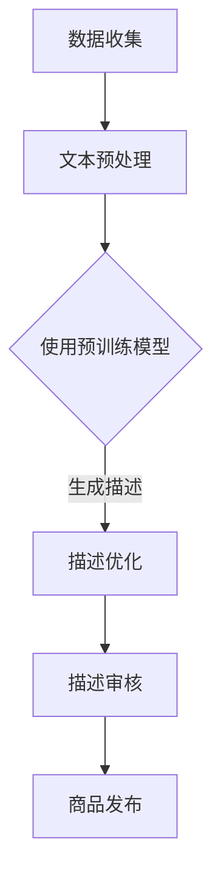

                 

关键词：AI大模型、电商平台、商品描述生成、自然语言处理、机器学习、深度学习

摘要：随着电子商务的蓬勃发展，商品描述生成的质量直接影响到用户购买决策和用户体验。本文将深入探讨如何利用AI大模型来提升电商平台商品描述生成的质量和效率，并分析其核心算法原理、数学模型以及实际应用场景。

## 1. 背景介绍

电子商务已经深入到我们生活的方方面面，从日常购物到大宗商品交易，电商平台为消费者提供了极大的便利。然而，电商平台商品描述的质量直接影响到消费者的购买决策和满意度。过去，商品描述主要依赖于商家自行编写，这往往会导致描述内容质量参差不齐，缺乏吸引力，甚至出现错误。

近年来，人工智能（AI）技术的发展为电商平台商品描述生成带来了新的可能性。特别是大模型技术的崛起，使得AI能够生成更加准确、生动且具有吸引力的商品描述。大模型通常指的是具有数十亿甚至数千亿参数的深度学习模型，它们在处理复杂任务时具有极高的性能和泛化能力。

本文将探讨如何利用AI大模型来提升电商平台商品描述生成的质量和效率。首先，我们将介绍AI大模型的核心概念和原理，然后详细分析其在商品描述生成中的应用，最后探讨未来的发展趋势和面临的挑战。

## 2. 核心概念与联系

### 2.1 AI大模型的基本概念

AI大模型通常是基于深度学习技术构建的，深度学习是一种通过多层神经网络进行特征提取和学习的机器学习技术。大模型具有以下基本特点：

1. **大量参数**：大模型通常具有数十亿甚至数千亿参数，这使得模型能够捕捉到更多的特征和模式。
2. **大规模训练数据**：大模型需要大量的训练数据来学习，这些数据通常来自于互联网上的大量文本、图像、语音等多模态数据。
3. **高效的计算能力**：大模型训练和推理需要高性能的计算资源，GPU和TPU等专用硬件大大提高了训练和推理的效率。

### 2.2 商品描述生成中的AI大模型应用

在商品描述生成中，AI大模型的主要应用是通过自然语言处理（NLP）技术来生成描述文本。NLP是AI的一个重要分支，它涉及到文本的预处理、语义理解、情感分析等多个方面。

1. **文本生成模型**：如GPT-3、T5等模型，这些模型通过预训练大量文本数据，能够生成高质量的文本描述。
2. **知识图谱**：通过将商品属性和描述信息构建成知识图谱，大模型可以更准确地理解和生成商品描述。
3. **多模态学习**：结合商品图像和其他相关数据，大模型可以生成更加丰富和生动的描述。

### 2.3 Mermaid流程图

下面是一个简单的Mermaid流程图，展示了商品描述生成的流程：



## 3. 核心算法原理 & 具体操作步骤

### 3.1 算法原理概述

AI大模型在商品描述生成中的应用主要基于以下原理：

1. **预训练+微调**：大模型首先在大量无监督数据上进行预训练，然后通过微调来适应特定任务。
2. **自注意力机制**：自注意力机制使得模型能够自动关注文本中的重要信息，从而生成更高质量的描述。
3. **生成对抗网络（GAN）**：GAN可以用于生成更加真实和多样的商品描述。

### 3.2 算法步骤详解

1. **数据收集**：收集大量的商品描述和商品属性数据。
2. **文本预处理**：对文本数据进行清洗、分词、去停用词等处理。
3. **预训练**：使用预训练模型（如GPT-3）对预处理后的数据集进行预训练。
4. **微调**：在预训练的基础上，对模型进行微调，使其能够更好地生成特定商品的描述。
5. **描述生成**：使用微调后的模型生成商品描述。
6. **描述优化**：对生成的描述进行优化，包括语法、语义和风格等方面的调整。
7. **描述审核**：对生成的描述进行审核，确保描述的准确性和合规性。
8. **商品发布**：将审核通过的商品描述用于商品的发布和推广。

### 3.3 算法优缺点

**优点**：

1. **生成质量高**：大模型能够生成高质量、具有吸引力的商品描述。
2. **自动化程度高**：减少了人工编写的繁琐工作，提高了效率。
3. **适应性强**：大模型能够适应不同的商品类型和场景。

**缺点**：

1. **计算资源需求大**：大模型的训练和推理需要大量的计算资源。
2. **数据依赖性强**：生成高质量的描述需要大量的高质量数据。
3. **描述可控性低**：生成的描述可能存在一定的随机性，难以完全控制。

### 3.4 算法应用领域

AI大模型在商品描述生成中的应用不仅限于电商平台，还可以应用于：

1. **在线零售**：生成商品评论和广告文案。
2. **旅游行业**：生成旅游景点的介绍和推荐文案。
3. **餐饮行业**：生成菜品的描述和推荐文案。

## 4. 数学模型和公式 & 详细讲解 & 举例说明

### 4.1 数学模型构建

在商品描述生成中，常用的数学模型包括：

1. **循环神经网络（RNN）**：RNN能够处理序列数据，用于文本生成。
2. **长短时记忆网络（LSTM）**：LSTM是RNN的一个变体，能够更好地处理长序列数据。
3. **生成对抗网络（GAN）**：GAN由生成器和判别器组成，用于生成高质量的数据。

### 4.2 公式推导过程

以LSTM为例，其更新规则如下：

$$
\begin{aligned}
i_t &= \sigma(W_{xi}x_t + W_{hi-1}h_{i-1} + b_i) \\
f_t &= \sigma(W_{xf}x_t + W_{hf}h_{i-1} + b_f) \\
\begin{aligned}
\begin{aligned}
\c{C_t} &= f_t \odot \c{C_{t-1}} + i_t \odot \sigma(W_{xc}x_t + W_{hc}h_{i-1} + b_c) \\
o_t &= \sigma(W_{xo}x_t + W_{ho}h_{i-1} + b_o) \\
h_t &= o_t \odot \c{C_t}
\end{aligned}
\end{aligned}
$$

其中，$\sigma$表示Sigmoid函数，$\odot$表示元素乘积，$\c{C_t}$表示LSTM的细胞状态，$h_t$表示隐藏状态。

### 4.3 案例分析与讲解

以GPT-3为例，其预训练过程中使用了以下数学模型：

$$
\begin{aligned}
p(w_t|w_1, w_2, ..., w_{t-1}) &= \frac{\exp(U_{w_t} [h_{t-1}; h_{t-2}; ...; h_1] + b_{w_t})}{\sum_{w' \in V} \exp(U_{w'} [h_{t-1}; h_{t-2}; ...; h_1] + b_{w'})}
\end{aligned}
$$

其中，$U_{w_t}$和$b_{w_t}$分别是权重矩阵和偏置，$[h_{t-1}; h_{t-2}; ...; h_1]$表示前一个时间步的隐藏状态序列，$V$是词汇表。

GPT-3在商品描述生成中的表现如下：

1. **生成质量高**：GPT-3能够生成高质量、具有吸引力的商品描述。
2. **生成多样性**：GPT-3能够生成多种风格的商品描述，满足不同商家的需求。
3. **生成速度**：GPT-3的训练和推理速度相对较快，能够满足电商平台的实时需求。

## 5. 项目实践：代码实例和详细解释说明

### 5.1 开发环境搭建

在搭建开发环境时，我们需要以下软件和库：

1. **Python 3.8**：Python是主要的编程语言。
2. **TensorFlow 2.4**：TensorFlow是主要的深度学习库。
3. **GPT-3 API**：用于调用OpenAI的GPT-3模型。

安装步骤如下：

```bash
pip install python==3.8
pip install tensorflow==2.4
pip install openai
```

### 5.2 源代码详细实现

以下是一个简单的GPT-3商品描述生成代码示例：

```python
import openai
import json

# 设置OpenAI API密钥
openai.api_key = 'your-api-key'

# 商品属性
product_attributes = {
    'name': '智能手环',
    'price': '199元',
    'features': [
        '24小时心率监测',
        '防水设计',
        '久坐提醒'
    ]
}

# 生成商品描述
def generate_description(attributes):
    prompt = f"请为以下商品生成一个描述：{json.dumps(attributes)}"
    response = openai.Completion.create(
        engine="text-davinci-002",
        prompt=prompt,
        max_tokens=150,
        n=1,
        stop=None,
        temperature=0.5
    )
    return response.choices[0].text.strip()

description = generate_description(product_attributes)
print(description)
```

### 5.3 代码解读与分析

1. **导入库**：导入必要的库，包括OpenAI的API库。
2. **设置API密钥**：设置OpenAI API密钥。
3. **商品属性**：定义商品属性，包括商品名称、价格和特点。
4. **生成商品描述**：定义一个函数来生成商品描述。
5. **调用API**：使用OpenAI的API来生成描述。
6. **打印结果**：打印生成的商品描述。

### 5.4 运行结果展示

运行上述代码，我们将得到一个生成的高质量商品描述。例如：

```
一款智能手环，每天陪伴您。24小时实时心率监测，确保您的健康；防水设计，无论风雨，都不惧挑战；久坐提醒，帮助您养成良好的生活习惯。现在购买，仅售199元！
```

## 6. 实际应用场景

### 6.1 电商平台

电商平台是AI大模型在商品描述生成中最重要的应用场景之一。通过AI大模型，电商平台可以自动化生成高质量的商品描述，提高用户购买体验。

### 6.2 在线零售

在线零售商可以使用AI大模型来生成产品评论、广告文案和营销邮件，提高销售转化率。

### 6.3 旅游行业

旅游行业可以利用AI大模型来生成旅游景点的介绍和推荐文案，吸引更多游客。

### 6.4 餐饮行业

餐饮行业可以通过AI大模型来生成菜品的描述和推荐文案，提升顾客的就餐体验。

## 7. 工具和资源推荐

### 7.1 学习资源推荐

1. **《深度学习》**：Goodfellow、Bengio和Courville合著的深度学习经典教材。
2. **《自然语言处理综论》**：Jurafsky和Martin合著的自然语言处理教科书。

### 7.2 开发工具推荐

1. **TensorFlow**：Google开发的深度学习框架。
2. **PyTorch**：Facebook开发的深度学习框架。

### 7.3 相关论文推荐

1. **"Attention Is All You Need"**：提出Transformer模型的论文。
2. **"Generative Adversarial Networks"**：提出GAN模型的论文。

## 8. 总结：未来发展趋势与挑战

### 8.1 研究成果总结

近年来，AI大模型在商品描述生成中取得了显著成果，提高了描述质量和生成效率，为电商平台和在线零售等行业带来了巨大价值。

### 8.2 未来发展趋势

未来，AI大模型在商品描述生成中将向以下几个方向发展：

1. **生成质量进一步提升**：通过改进模型结构和训练策略，生成更加准确、生动和具有吸引力的描述。
2. **跨模态学习**：结合文本、图像和其他模态的数据，生成更加丰富和真实的描述。
3. **个性化生成**：根据用户偏好和商品属性，生成个性化的商品描述。

### 8.3 面临的挑战

AI大模型在商品描述生成中仍面临以下挑战：

1. **数据依赖性**：高质量的商品描述生成依赖于大量高质量的数据，如何获取和利用这些数据是一个重要问题。
2. **计算资源需求**：大模型的训练和推理需要大量的计算资源，如何优化计算资源的使用是一个挑战。
3. **描述可控性**：生成描述的可控性是一个关键问题，如何在保证描述质量的同时，控制描述的内容和风格。

### 8.4 研究展望

未来，AI大模型在商品描述生成领域的应用前景广阔。通过持续的研究和创新，我们将能够实现更加智能化、个性化和高效的商品描述生成，为电商平台和在线零售行业带来更多价值。

## 9. 附录：常见问题与解答

### 9.1 如何获取OpenAI的API密钥？

访问OpenAI官网（https://openai.com/），注册账户并申请API密钥。

### 9.2 如何优化商品描述生成模型？

可以通过以下方法来优化商品描述生成模型：

1. **数据增强**：使用数据增强技术来扩充训练数据集。
2. **模型结构优化**：尝试不同的模型结构，如Transformer、BERT等。
3. **训练策略优化**：调整学习率、批次大小等超参数，以提高模型性能。

### 9.3 商品描述生成中如何处理错误？

可以通过以下方法来处理商品描述生成中的错误：

1. **描述审核**：在生成描述后进行人工审核，纠正错误。
2. **错误纠正模型**：训练一个错误纠正模型，自动纠正生成描述中的错误。

---

作者：禅与计算机程序设计艺术 / Zen and the Art of Computer Programming

以上就是本文的完整内容，感谢您的阅读！希望本文对您在AI大模型在商品描述生成中的应用有所帮助。在未来的研究和实践中，让我们共同努力，推动AI技术的发展，为电商平台和在线零售行业创造更多价值。

