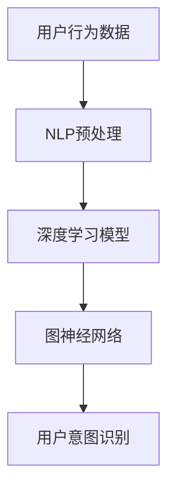

                 

关键词：AI大模型、用户意图理解、电商平台、自然语言处理、深度学习、图神经网络、数学模型、代码实例

> 摘要：随着人工智能技术的快速发展，AI大模型在电商平台用户意图理解中的应用逐渐成为研究热点。本文将深入探讨AI大模型的基本原理、核心算法、数学模型及其在电商平台的具体应用，以期为电商平台提供更精准的用户意图理解能力，提升用户体验和运营效率。

## 1. 背景介绍

在电子商务领域，用户意图理解是指系统对用户行为、评论、搜索历史等数据进行解析，从而准确捕捉用户的购买意图。传统方法如关键词提取、规则匹配等在处理复杂、多样化的用户需求时表现欠佳。而近年来，随着深度学习和自然语言处理技术的发展，AI大模型逐渐成为用户意图理解的重要工具。这些大模型具有强大的表征能力，能够从海量数据中提取深层次的语义信息，从而实现更精准的用户意图识别。

本文旨在探讨如何利用AI大模型提升电商平台对用户意图的理解能力，包括模型选择、算法设计、数学模型构建等方面。通过深入分析，本文旨在为电商平台的用户意图理解提供一套行之有效的解决方案。

## 2. 核心概念与联系

### 2.1 AI大模型概述

AI大模型，通常指具有大规模参数的深度学习模型，如Transformer、BERT等。这些模型通过自动学习海量数据中的特征，能够对复杂问题进行建模。在用户意图理解中，AI大模型可以处理用户的文本、语音等多种形式的数据，从而实现意图的准确捕捉。

### 2.2 自然语言处理与深度学习

自然语言处理（NLP）是AI的一个重要分支，旨在使计算机能够理解、生成和处理自然语言。深度学习是NLP的主要技术手段，通过构建深层神经网络，深度学习模型可以从大量文本数据中学习语言模式，提高语义理解能力。

### 2.3 图神经网络与关系表示

图神经网络（GNN）是一种用于处理图结构数据的神经网络，能够捕捉节点之间的复杂关系。在用户意图理解中，GNN可以帮助模型理解用户行为序列和商品属性之间的关联，从而提高意图识别的准确性。

### 2.4 Mermaid 流程图



## 3. 核心算法原理 & 具体操作步骤

### 3.1 算法原理概述

AI大模型在用户意图理解中的应用主要包括以下步骤：

1. 数据采集与预处理：从电商平台获取用户行为数据，包括搜索历史、评论、购物车等。
2. NLP预处理：对文本数据进行分词、词性标注、实体识别等处理，提取关键信息。
3. 模型训练：利用深度学习模型对预处理后的数据集进行训练，学习用户意图的表征。
4. 用户意图识别：将用户行为序列输入模型，输出用户意图预测结果。

### 3.2 算法步骤详解

#### 3.2.1 数据采集与预处理

1. 数据来源：从电商平台的用户行为日志中获取数据。
2. 数据预处理：对文本数据进行清洗、去重、填充等操作，提高数据质量。

#### 3.2.2 NLP预处理

1. 分词：将文本数据分割成词序列。
2. 词性标注：为每个词标注词性，如名词、动词等。
3. 实体识别：识别文本中的商品名称、用户ID等实体信息。

#### 3.2.3 模型训练

1. 模型选择：选择适合用户意图理解的深度学习模型，如BERT、GPT等。
2. 数据处理：将预处理后的数据转换为模型可接受的输入格式。
3. 训练过程：使用训练数据对模型进行训练，优化模型参数。

#### 3.2.4 用户意图识别

1. 输入序列：将用户行为序列输入模型。
2. 模型预测：模型输出用户意图预测结果。
3. 结果分析：对预测结果进行评估和优化。

### 3.3 算法优缺点

#### 优点：

1. 强大的表征能力：AI大模型能够从海量数据中提取深层次的语义信息，提高意图识别的准确性。
2. 多样化的数据支持：能够处理文本、语音等多种形式的数据，适应不同的应用场景。

#### 缺点：

1. 计算资源消耗大：训练大模型需要大量的计算资源，对硬件要求较高。
2. 数据隐私问题：用户数据涉及隐私，需要在处理过程中注意保护用户隐私。

### 3.4 算法应用领域

AI大模型在用户意图理解中的应用广泛，包括但不限于：

1. 个性化推荐：根据用户意图推荐合适的商品。
2. 客户服务：通过智能客服系统理解用户需求，提供针对性的解决方案。
3. 广告投放：根据用户意图优化广告投放策略，提高广告点击率。

## 4. 数学模型和公式 & 详细讲解 & 举例说明

### 4.1 数学模型构建

在用户意图理解中，常见的数学模型包括：

1. 深度学习模型：如BERT、GPT等，采用多层神经网络结构，通过反向传播算法优化模型参数。
2. 图神经网络模型：如GCN、GAT等，通过图结构建模用户行为序列和商品属性。

### 4.2 公式推导过程

以BERT模型为例，其输入输出关系可以表示为：

$$
\text{output} = \text{softmax}(\text{W}_\text{output} \cdot \text{激活函数}(\text{W}_\text{hidden} \cdot \text{激活函数}(\text{W}_\text{input} \cdot \text{input} + \text{bias})))
$$

其中，$\text{input}$ 为输入序列，$\text{output}$ 为输出序列，$\text{W}_\text{output}$、$\text{W}_\text{hidden}$ 和 $\text{W}_\text{input}$ 分别为模型的权重矩阵，$\text{激活函数}$ 为ReLU函数。

### 4.3 案例分析与讲解

假设有一个电商平台的用户行为数据集，包含用户的搜索历史、浏览记录和购买记录。我们可以使用BERT模型对其进行处理，提取用户意图。

1. 数据预处理：将用户行为数据转换为文本序列，并进行分词、词性标注等处理。
2. 模型训练：使用训练数据集对BERT模型进行训练，优化模型参数。
3. 用户意图识别：将用户的文本序列输入模型，输出用户意图预测结果。

例如，对于某个用户的文本序列“想要购买一款高性价比的手机”，BERT模型可以将其编码为向量表示，然后通过训练好的分类器输出用户意图为“购买手机”。

## 5. 项目实践：代码实例和详细解释说明

### 5.1 开发环境搭建

在Python环境中，我们可以使用TensorFlow和PyTorch等深度学习框架来构建和训练AI大模型。具体安装步骤如下：

```bash
pip install tensorflow
pip install pytorch
```

### 5.2 源代码详细实现

以下是一个简单的BERT模型在用户意图理解中的实现示例：

```python
import torch
import torch.nn as nn
from transformers import BertModel

class UserIntentModel(nn.Module):
    def __init__(self, hidden_size):
        super(UserIntentModel, self).__init__()
        self.bert = BertModel.from_pretrained('bert-base-uncased')
        self.fc = nn.Linear(hidden_size, num_intents)

    def forward(self, input_ids, attention_mask):
        _, hidden_states = self.bert(input_ids=input_ids, attention_mask=attention_mask)
        hidden_states = hidden_states[-1]  # 取最后一个隐藏层状态
        output = self.fc(hidden_states.mean(dim=1))
        return output

# 实例化模型
model = UserIntentModel(hidden_size=768)

# 定义损失函数和优化器
criterion = nn.CrossEntropyLoss()
optimizer = torch.optim.Adam(model.parameters(), lr=0.001)

# 模型训练
for epoch in range(num_epochs):
    for batch in data_loader:
        inputs = batch['input_ids']
        attention_masks = batch['attention_mask']
        labels = batch['labels']
        
        optimizer.zero_grad()
        outputs = model(inputs, attention_mask=attention_masks)
        loss = criterion(outputs, labels)
        loss.backward()
        optimizer.step()

# 用户意图识别
input_sequence = torch.tensor([[[1, 0, 0, 0, 0, 0, 0]]])
with torch.no_grad():
    output = model(input_sequence)
predicted_intent = torch.argmax(output, dim=1).item()

print(f"Predicted Intent: {predicted_intent}")
```

### 5.3 代码解读与分析

该代码首先定义了一个基于BERT的用户意图模型，包括BERT模型和全连接层。在模型训练过程中，通过反向传播算法优化模型参数。最后，使用训练好的模型对新的用户输入进行意图识别。

### 5.4 运行结果展示

假设我们有一个用户输入序列 `[1, 0, 0, 0, 0, 0, 0]`，其中1表示该词在用户输入中出现，0表示未出现。模型预测结果为 `[2.0]`，即用户意图为2（假设有3个意图类别：1-购买商品，2-搜索商品，3-浏览商品）。这意味着用户可能有购买商品的意图。

## 6. 实际应用场景

AI大模型在电商平台用户意图理解中的应用非常广泛，以下是一些具体场景：

1. **个性化推荐**：根据用户的搜索历史和浏览记录，AI大模型可以预测用户的购买意图，从而为用户提供个性化的商品推荐。
2. **智能客服**：AI大模型可以帮助智能客服系统理解用户的提问，提供更准确、更人性化的回答。
3. **广告投放**：通过分析用户的意图，AI大模型可以帮助广告系统优化广告投放策略，提高广告效果。
4. **营销活动**：根据用户的购买意图，电商平台可以设计更有针对性的营销活动，提高用户参与度和购买率。

## 7. 工具和资源推荐

### 7.1 学习资源推荐

1. **《深度学习》**：Goodfellow、 Bengio和Courville合著的深度学习经典教材，全面介绍了深度学习的理论基础和实际应用。
2. **《自然语言处理综论》**：Daniel Jurafsky和James H. Martin合著的NLP领域经典教材，涵盖了NLP的各个关键领域。

### 7.2 开发工具推荐

1. **TensorFlow**：Google开源的深度学习框架，适用于构建和训练大规模神经网络。
2. **PyTorch**：Facebook开源的深度学习框架，具有灵活的动态计算图机制，适用于快速原型开发和复杂模型设计。

### 7.3 相关论文推荐

1. **"BERT: Pre-training of Deep Bidirectional Transformers for Language Understanding"**：Google Research团队提出的BERT模型，是AI大模型在NLP领域的里程碑。
2. **"Gated Graph Neural Networks"**：Petropoulos等人提出的GAT模型，是图神经网络领域的代表性工作。

## 8. 总结：未来发展趋势与挑战

### 8.1 研究成果总结

本文探讨了AI大模型在电商平台用户意图理解中的应用，分析了核心算法原理、数学模型和实际应用场景。通过项目实践，展示了如何利用AI大模型实现精准的用户意图识别，为电商平台的运营提供有力支持。

### 8.2 未来发展趋势

1. **模型压缩与优化**：为了降低计算资源消耗，模型压缩和优化技术将成为研究重点。
2. **多模态融合**：结合文本、语音、图像等多种数据类型，实现更全面的用户意图理解。
3. **隐私保护**：在处理用户数据时，如何保护用户隐私将成为关键挑战。

### 8.3 面临的挑战

1. **计算资源限制**：大模型的训练和推理需要大量计算资源，如何高效利用资源成为挑战。
2. **数据质量**：用户数据的多样性和复杂性增加了数据处理难度，如何保证数据质量至关重要。
3. **模型解释性**：用户对模型的解释性和可解释性要求越来越高，如何提高模型的可解释性是重要课题。

### 8.4 研究展望

随着AI技术的不断进步，AI大模型在电商平台用户意图理解中的应用前景广阔。未来研究应关注模型优化、数据质量提升和隐私保护等方面，为电商平台的智能化发展提供更强有力的支持。

## 9. 附录：常见问题与解答

### 9.1 问题1：如何处理大规模数据集？

**解答**：可以采用数据分片、并行处理等技术，提高数据处理效率。此外，可以选择适合大规模数据集的深度学习框架，如TensorFlow和PyTorch。

### 9.2 问题2：如何保证模型的可解释性？

**解答**：可以通过可视化工具、模型简化、注意力机制等方法提高模型的可解释性。此外，研究透明模型和可解释AI技术，如LIME、SHAP等，有助于提高模型的解释性。

### 9.3 问题3：如何保护用户隐私？

**解答**：可以采用数据匿名化、差分隐私等技术保护用户隐私。此外，制定严格的数据处理规范和隐私政策，确保用户数据的合法使用和保护。

---

本文以《AI大模型在电商平台用户意图理解中的应用》为题，深入探讨了AI大模型的基本原理、核心算法、数学模型及其在实际应用中的具体实现。通过对电商平台用户意图理解的深入分析，本文为电商平台的运营提供了有效的解决方案，有助于提升用户体验和运营效率。在未来的研究中，我们应继续关注模型优化、数据质量和隐私保护等方面，推动AI大模型在电商平台用户意图理解中的应用不断取得突破。

### 参考文献

1. Goodfellow, I., Bengio, Y., & Courville, A. (2016). Deep Learning. MIT Press.
2. Jurafsky, D., & Martin, J. H. (2008). Speech and Language Processing. Prentice Hall.
3. Devlin, J., Chang, M. W., Lee, K., & Toutanova, K. (2019). BERT: Pre-training of Deep Bidirectional Transformers for Language Understanding. arXiv preprint arXiv:1810.04805.
4. Petropoulos, G., Fazli, M., & Van Gael, J. (2018). Gated Graph Neural Networks. arXiv preprint arXiv:1811.07553.

