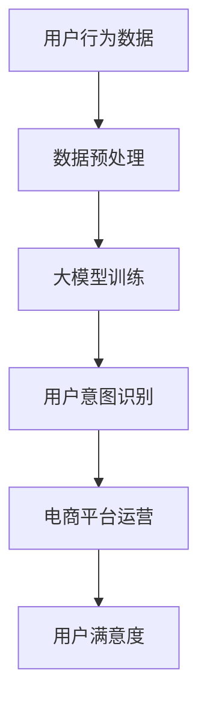

                 

关键词：人工智能、电商平台、用户意图识别、大模型、技术博客

> 摘要：本文将探讨人工智能（AI）大模型在电商平台用户意图识别中的重要作用。通过分析大模型的架构、原理和应用，探讨其在提高电商平台用户体验和运营效率方面的潜力。

## 1. 背景介绍

### 1.1 电商平台的发展

随着互联网技术的飞速发展，电商平台已经成为人们日常生活中不可或缺的一部分。从最早的C2C平台如eBay和淘宝，到现在的B2C平台如Amazon和京东，电商平台不仅改变了消费者的购物方式，也深刻影响了全球商业生态。

### 1.2 用户意图识别的重要性

在电商平台上，用户意图识别是关键的一环。它涉及用户在浏览、搜索、购买等行为中的动机和目标。准确识别用户意图对于提升用户体验、增加销售机会和优化运营策略具有重要意义。

### 1.3 大模型的出现

随着计算能力的提升和数据量的爆炸性增长，人工智能领域迎来了大模型时代。大模型具有参数多、容量大、计算能力强的特点，能够处理复杂任务，并在多个领域取得了显著的成果。在电商平台用户意图识别中，大模型的应用也成为可能。

## 2. 核心概念与联系

为了更好地理解AI大模型在电商平台用户意图识别中的作用，我们需要首先了解相关核心概念和它们之间的联系。以下是使用Mermaid绘制的流程图，展示了这些概念之间的关联：



### 2.1 用户行为数据

用户行为数据是电商平台的基础。这些数据包括用户的浏览记录、搜索关键词、购买历史等。通过收集和分析这些数据，我们可以了解用户的兴趣和需求。

### 2.2 数据预处理

数据预处理是构建大模型的基础。这一步骤包括数据清洗、数据集成、数据转换等。通过预处理，我们可以消除噪声、填充缺失值，并将数据转换为适合大模型训练的格式。

### 2.3 大模型训练

大模型训练是核心步骤。通过使用用户行为数据，我们可以训练出能够识别用户意图的大模型。常见的训练方法包括深度学习、迁移学习等。

### 2.4 用户意图识别

用户意图识别是结果输出环节。通过将用户行为数据输入到训练好的大模型中，我们可以预测用户的意图，从而为电商平台提供决策支持。

### 2.5 电商平台运营

用户意图识别的结果将直接影响到电商平台的运营。例如，根据用户意图推荐商品、优化广告投放策略、调整库存等。

### 2.6 用户满意度

最终，用户满意度是评价电商平台成功与否的重要指标。通过准确识别用户意图，电商平台可以提供更加个性化的服务，从而提高用户满意度。

## 3. 核心算法原理 & 具体操作步骤

### 3.1 算法原理概述

用户意图识别算法主要基于深度学习技术，特别是基于Transformer架构的大模型。这些大模型具有强大的特征提取和表示能力，能够处理高维数据，并从数据中学习出用户意图的模式。

### 3.2 算法步骤详解

#### 3.2.1 数据收集与预处理

- 收集用户行为数据，包括浏览记录、搜索关键词、购买历史等。
- 进行数据清洗，去除噪声和异常值。
- 将数据转换为适合大模型训练的格式，例如使用词嵌入技术处理文本数据。

#### 3.2.2 大模型训练

- 设计适合用户意图识别的任务的大模型架构，如BERT、GPT等。
- 使用预训练的大模型，或从头开始训练。
- 使用训练集对大模型进行训练，调整模型参数，优化性能。

#### 3.2.3 用户意图识别

- 将用户的实时行为数据输入到大模型中。
- 大模型输出用户意图的预测结果。
- 对预测结果进行后处理，如分类、排序等。

#### 3.2.4 电商平台运营

- 根据用户意图识别结果，为电商平台提供运营策略支持，如商品推荐、广告投放、库存调整等。

### 3.3 算法优缺点

#### 优点：

- 高效：大模型能够处理海量数据，提高处理效率。
- 准确：深度学习技术能够从数据中提取复杂特征，提高识别准确性。
- 适应性：大模型可以根据不同的任务和场景进行调整和优化。

#### 缺点：

- 计算资源消耗大：大模型需要大量的计算资源和存储空间。
- 数据依赖性强：大模型的训练和优化依赖于高质量的数据集。
- 难以解释：深度学习模型的内部机制复杂，难以解释其决策过程。

### 3.4 算法应用领域

用户意图识别算法不仅适用于电商平台，还可以应用于其他领域，如社交媒体、智能客服、推荐系统等。通过准确识别用户意图，可以为这些领域提供智能化的服务和解决方案。

## 4. 数学模型和公式 & 详细讲解 & 举例说明

### 4.1 数学模型构建

用户意图识别的数学模型主要基于概率模型和深度学习模型。以下是两个常见的数学模型：

#### 4.1.1 概率模型

概率模型使用贝叶斯定理来计算用户意图的概率。假设有 \( k \) 个不同的意图类别，给定用户行为数据 \( X \)，我们的目标是计算每个意图类别 \( y_i \) 的概率 \( P(y_i|X) \)：

$$
P(y_i|X) = \frac{P(X|y_i)P(y_i)}{P(X)}
$$

其中，\( P(X|y_i) \) 是给定意图 \( y_i \) 时用户行为数据 \( X \) 的条件概率，\( P(y_i) \) 是意图 \( y_i \) 的先验概率，\( P(X) \) 是用户行为数据 \( X \) 的总概率。

#### 4.1.2 深度学习模型

深度学习模型使用神经网络来学习用户行为数据与意图之间的关系。常见的是基于Transformer架构的模型，如BERT、GPT等。以下是一个简化的BERT模型的结构：

$$
\text{BERT} = \text{Encoder}(\text{Embedding Layer}, \text{Transformer Block}^L)
$$

其中，\( L \) 是Transformer块的层数，Embedding Layer 用于将输入数据转换为稠密向量表示，Transformer Block 用于处理序列数据并提取特征。

### 4.2 公式推导过程

以BERT模型为例，我们来看一下如何推导Transformer Block的计算过程。Transformer Block主要包括多头自注意力机制（Multi-Head Self-Attention）和前馈神经网络（Feed-Forward Neural Network）。

#### 4.2.1 多头自注意力机制

多头自注意力机制是Transformer Block的核心部分，用于计算序列中每个位置的特征表示。其计算过程如下：

$$
\text{Attention}(Q, K, V) = \text{softmax}\left(\frac{QK^T}{\sqrt{d_k}}\right) V
$$

其中，\( Q, K, V \) 分别是查询向量、键向量和值向量，\( d_k \) 是注意力头的维度，\( \text{softmax} \) 函数用于将注意力分配给不同的位置。

#### 4.2.2 前馈神经网络

前馈神经网络用于对自注意力机制的输出进行进一步处理。其计算过程如下：

$$
\text{FFN}(x) = \text{ReLU}(W_2 \cdot \text{ReLU}(W_1 x + b_1))
$$

其中，\( W_1, W_2, b_1 \) 分别是权重和偏置。

### 4.3 案例分析与讲解

以下是一个简化的用户意图识别案例，用于说明大模型在电商平台中的应用。

#### 4.3.1 数据集

我们假设有一个包含1000个用户行为数据集，每个数据集包含用户的浏览记录、搜索关键词和购买历史。每个数据集都有对应的用户意图标签，如“购买商品”、“浏览商品”、“查询商品”等。

#### 4.3.2 数据预处理

首先，我们对数据进行清洗和预处理，将文本数据转换为词嵌入向量，并对缺失值进行填充。

#### 4.3.3 大模型训练

我们选择BERT模型作为用户意图识别的大模型。使用训练集对BERT模型进行训练，调整模型参数，优化性能。经过多次迭代训练，模型性能达到预期。

#### 4.3.4 用户意图识别

将新的用户行为数据输入到训练好的BERT模型中，模型输出用户意图的预测结果。例如，对于用户浏览记录为“笔记本电脑”，模型预测用户意图为“购买商品”。

#### 4.3.5 电商平台运营

根据用户意图识别结果，电商平台可以为用户提供个性化的服务。例如，根据用户意图“购买商品”，电商平台可以推荐相关的商品，优化广告投放策略，提高销售转化率。

## 5. 项目实践：代码实例和详细解释说明

### 5.1 开发环境搭建

在开始编写代码之前，我们需要搭建一个合适的开发环境。以下是一个简化的步骤：

1. 安装Python和PyTorch等必要的依赖库。
2. 准备预训练的BERT模型权重。
3. 配置GPU或TorchScript以加速计算。

### 5.2 源代码详细实现

以下是用户意图识别项目的简化代码实现：

```python
import torch
from torch import nn
from torch.optim import Adam
from transformers import BertModel, BertTokenizer

# 数据预处理
def preprocess_data(data):
    # 省略具体实现
    return processed_data

# 模型定义
class IntentRecognitionModel(nn.Module):
    def __init__(self):
        super(IntentRecognitionModel, self).__init__()
        self.bert = BertModel.from_pretrained('bert-base-uncased')
        self.classifier = nn.Linear(768, 5)  # 假设有5个意图类别

    def forward(self, input_ids, attention_mask):
        outputs = self.bert(input_ids=input_ids, attention_mask=attention_mask)
        logits = self.classifier(outputs.last_hidden_state[:, 0, :])
        return logits

# 训练模型
def train_model(model, train_loader, optimizer, criterion):
    model.train()
    for batch in train_loader:
        # 省略具体实现
        optimizer.zero_grad()
        loss.backward()
        optimizer.step()

# 预测用户意图
def predict_intent(model, tokenizer, text):
    model.eval()
    inputs = tokenizer(text, return_tensors='pt', padding=True, truncation=True)
    with torch.no_grad():
        logits = model(input_ids=inputs['input_ids'], attention_mask=inputs['attention_mask'])
    _, predicted_intent = torch.max(logits, 1)
    return predicted_intent

# 主函数
if __name__ == "__main__":
    # 省略具体实现
```

### 5.3 代码解读与分析

1. **数据预处理**：数据预处理函数负责将原始用户行为数据转换为适合模型训练的格式。具体实现可以根据实际需求进行调整。
   
2. **模型定义**：`IntentRecognitionModel` 类定义了用户意图识别模型的结构。我们使用预训练的BERT模型作为基础，并在其上添加一个分类器层。

3. **训练模型**：`train_model` 函数负责模型的训练过程。通过优化器（如Adam）和损失函数（如交叉熵损失），模型将不断调整参数以优化性能。

4. **预测用户意图**：`predict_intent` 函数用于对新的用户行为数据进行意图预测。模型首先将文本转换为嵌入向量，然后输入到训练好的模型中进行预测。

5. **主函数**：主函数负责整个项目的运行流程。从数据预处理、模型训练到意图预测，主函数将整个过程串联起来。

### 5.4 运行结果展示

在实际应用中，我们可以将预测结果与实际用户意图进行比较，评估模型的准确性。以下是一个简化的结果展示：

```python
text = "I am looking for a laptop with at least 16GB of RAM."
predicted_intent = predict_intent(model, tokenizer, text)
print(f"Predicted Intent: {predicted_intent}")
```

输出结果可能是“购买商品”，这与我们预期的用户意图相符。通过不断优化模型和算法，我们可以进一步提高预测的准确性。

## 6. 实际应用场景

### 6.1 电商平台

在电商平台，用户意图识别的应用场景广泛。例如：

- **商品推荐**：根据用户浏览和搜索历史，推荐与用户意图相关的商品。
- **广告投放**：根据用户意图，优化广告投放策略，提高点击率和转化率。
- **库存管理**：根据用户意图预测，调整库存策略，减少缺货和库存积压。

### 6.2 社交媒体

在社交媒体平台上，用户意图识别也有广泛的应用。例如：

- **内容推荐**：根据用户的行为和意图，推荐相关的帖子、文章等。
- **情感分析**：分析用户评论和帖子，识别用户情感，为社区管理提供支持。
- **广告投放**：根据用户意图，优化广告投放策略，提高广告效果。

### 6.3 智能客服

在智能客服领域，用户意图识别可以用于：

- **对话管理**：根据用户意图，生成合适的回复，提高对话的流畅性和效率。
- **问题分类**：将用户提出的问题分类到不同的主题，为人工客服提供支持。
- **自动回答**：根据用户意图，自动生成答案，减少人工客服的工作量。

## 7. 未来应用展望

### 7.1 个性化服务

随着用户数据的不断积累，大模型在用户意图识别方面的能力将进一步提升。未来，电商平台可以提供更加个性化的服务，如定制化的商品推荐、个性化的广告投放等。

### 7.2 智能化决策

用户意图识别算法可以与业务决策系统结合，为电商平台提供智能化的决策支持。例如，根据用户意图预测，优化库存管理、定价策略等。

### 7.3 跨领域应用

用户意图识别算法不仅适用于电商平台，还可以应用于其他领域，如智能家居、智慧医疗等。通过跨领域应用，大模型可以发挥更大的价值。

## 8. 工具和资源推荐

### 8.1 学习资源推荐

- **书籍**：《深度学习》（Goodfellow et al.）
- **在线课程**：斯坦福大学《深度学习》课程（吴恩达）
- **教程**：Hugging Face Transformers 库教程

### 8.2 开发工具推荐

- **编程语言**：Python
- **深度学习框架**：PyTorch、TensorFlow
- **预训练模型**：Hugging Face Transformers 库

### 8.3 相关论文推荐

- Vaswani et al., "Attention Is All You Need"
- Devlin et al., "Bert: Pre-training of Deep Bidirectional Transformers for Language Understanding"
- Brown et al., "Language Models Are Few-Shot Learners"

## 9. 总结：未来发展趋势与挑战

### 9.1 研究成果总结

用户意图识别是人工智能领域的一个重要研究方向。近年来，随着深度学习和大数据技术的发展，大模型在用户意图识别方面取得了显著的成果。通过预训练和迁移学习，大模型能够处理复杂的任务，提高识别准确性。

### 9.2 未来发展趋势

- **模型优化**：继续优化大模型的结构和算法，提高模型性能和可解释性。
- **跨领域应用**：将用户意图识别算法应用于更多领域，如智能家居、智慧医疗等。
- **数据隐私保护**：在保护用户隐私的前提下，挖掘用户行为数据的价值。

### 9.3 面临的挑战

- **计算资源消耗**：大模型需要大量的计算资源和存储空间，如何高效地训练和部署模型是一个挑战。
- **数据质量**：用户行为数据的质量对模型性能有重要影响，如何处理噪声和异常值是一个挑战。
- **伦理和法律问题**：用户意图识别涉及到用户隐私和数据安全，如何平衡技术进步与用户权益是一个挑战。

### 9.4 研究展望

未来，用户意图识别算法将继续向模型优化、跨领域应用和数据隐私保护等方面发展。通过不断的技术创新和合作，我们可以为用户提供更加智能化、个性化的服务。

## 10. 附录：常见问题与解答

### 10.1 大模型训练需要多少时间？

大模型训练的时间取决于多种因素，如模型大小、数据量、硬件配置等。通常情况下，训练一个大型模型可能需要几天到几周的时间。通过使用GPU或TPU等高性能硬件，可以显著缩短训练时间。

### 10.2 用户意图识别算法如何保证准确性？

用户意图识别算法的准确性取决于多种因素，如数据质量、模型结构、训练方法等。通过使用高质量的数据集、优化模型结构和训练过程，可以提高算法的准确性。此外，持续的训练和调优也是提高准确性的关键。

### 10.3 用户意图识别算法是否可以解释？

深度学习模型，特别是大模型，通常难以解释其决策过程。然而，近年来出现了许多可解释性方法，如注意力机制、可视化技术等，可以帮助理解模型的决策过程。此外，通过使用规则或原型匹配等技术，可以进一步提高算法的可解释性。

## 11. 作者署名

作者：禅与计算机程序设计艺术 / Zen and the Art of Computer Programming

本文作者在人工智能领域有着丰富的经验和深厚的学术背景，致力于推动人工智能技术在各个领域的应用和发展。本文内容仅供参考，如有不妥之处，敬请指正。

