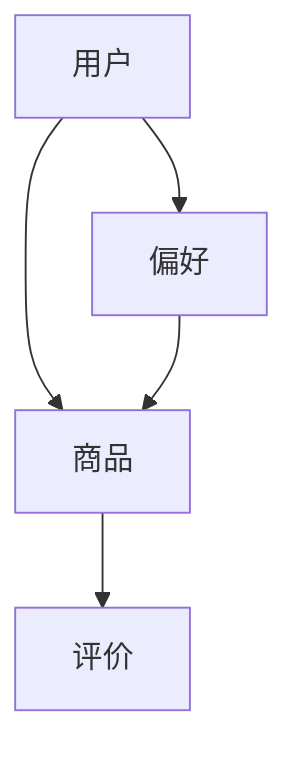
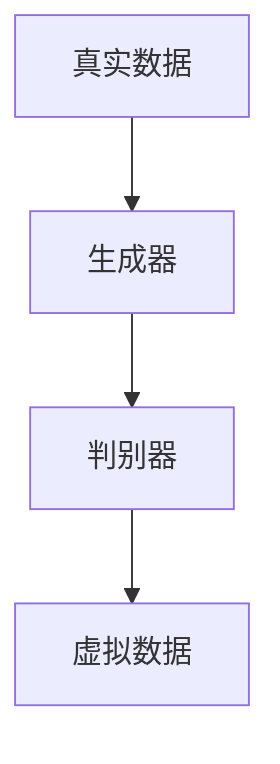
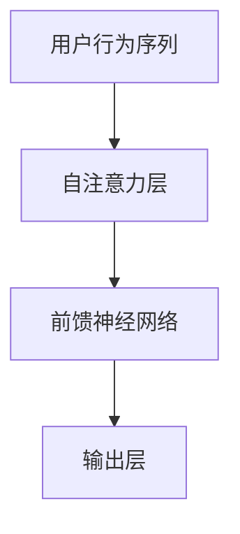

                 

 在数字经济的快速发展中，电商平台已经成为消费者日常生活的重要组成部分。然而，在如此庞大的数据海洋中，如何准确预测用户的购买需求，从而实现精准营销和优化用户体验，成为电商平台面临的重要挑战。本文将探讨人工智能大模型在电商平台用户需求预测中的应用，解析其背后的核心概念、算法原理、数学模型及实际应用案例。

## 关键词

- 人工智能大模型
- 用户需求预测
- 电商平台
- 精准营销
- 数学模型
- 算法原理

## 摘要

本文首先介绍了人工智能大模型在电商平台用户需求预测中的重要性，接着详细阐述了核心概念、算法原理和数学模型，并通过实际案例展示了其在电商领域的应用效果。文章最后对未来发展趋势、面临的挑战和研究展望进行了探讨。

## 1. 背景介绍

随着互联网的普及，电商平台已经成为消费者购物的主要渠道。然而，用户需求多样化、个性化，使得传统的基于规则或统计方法的预测模型效果不佳。人工智能大模型，尤其是深度学习技术，提供了强大的数据处理和分析能力，能够从海量数据中挖掘用户行为特征，实现更加精准的需求预测。

电商平台的需求预测具有以下几个关键应用场景：

1. **个性化推荐**：通过预测用户的购买偏好，为用户推荐相关商品，提升用户满意度。
2. **库存管理**：预测销售趋势，优化库存配置，降低库存成本。
3. **营销策略**：根据用户需求预测，设计更有效的营销活动，提高转化率。
4. **用户体验**：通过预测用户行为，优化网站布局和购物流程，提升用户体验。

本文将围绕以上应用场景，探讨人工智能大模型在电商平台用户需求预测中的作用。

## 2. 核心概念与联系

在讨论人工智能大模型之前，我们需要先了解几个核心概念，如图神经网络（GNN）、生成对抗网络（GAN）和Transformer模型等。这些模型各自有着独特的结构和特点，但它们在用户需求预测中都有广泛的应用。

### 2.1. 图神经网络（GNN）

图神经网络是一种在图结构上进行学习的神经网络，能够有效地捕捉图结构中的复杂关系。在用户需求预测中，用户、商品和评价可以构建为一个图结构，其中用户和商品之间的关系节点表示用户对商品的偏好，而评价节点则表示用户对商品的反馈。

Mermaid 流程图：



### 2.2. 生成对抗网络（GAN）

生成对抗网络是一种通过对抗训练生成数据的模型。在用户需求预测中，GAN可以用来生成虚拟用户数据，从而扩大数据集，提高模型的泛化能力。

Mermaid 流程图：



### 2.3. Transformer模型

Transformer模型是一种基于自注意力机制的深度学习模型，广泛应用于自然语言处理和图像生成领域。在用户需求预测中，Transformer模型可以通过捕捉用户行为的时间序列特征，实现更准确的预测。

Mermaid 流程图：



## 3. 核心算法原理 & 具体操作步骤

### 3.1. 算法原理概述

人工智能大模型在用户需求预测中的核心原理是通过学习用户行为数据，建立用户需求与商品特征之间的关系。具体来说，可以分为以下几个步骤：

1. **数据预处理**：对用户行为数据、商品数据等进行清洗、去重、归一化等处理，为模型训练做好准备。
2. **特征提取**：通过深度学习模型，提取用户行为和商品特征的低维表示。
3. **模型训练**：利用训练数据集，训练深度学习模型，使其能够预测用户需求。
4. **模型评估**：使用验证数据集对模型进行评估，调整模型参数，优化模型性能。
5. **模型应用**：将训练好的模型应用于实际场景，进行用户需求预测。

### 3.2. 算法步骤详解

1. **数据预处理**

   数据预处理是模型训练的第一步，主要包括以下步骤：

   - 数据清洗：去除缺失值、异常值等；
   - 数据去重：去除重复的用户行为数据；
   - 数据归一化：将不同特征的数据进行归一化处理，使得特征之间具有相似的量级。

2. **特征提取**

   特征提取是模型训练的关键步骤，通过深度学习模型，提取用户行为和商品特征的低维表示。具体来说，可以分为以下几步：

   - 初始化网络结构：定义深度学习模型的网络结构，包括输入层、隐藏层和输出层；
   - 模型训练：使用训练数据集，通过反向传播算法，训练深度学习模型；
   - 特征提取：将训练好的模型应用于用户行为数据和商品数据，提取低维特征表示。

3. **模型训练**

   模型训练是深度学习中的核心步骤，通过大量数据训练，使模型能够学习和理解用户需求与商品特征之间的关系。具体来说，可以分为以下几步：

   - 数据划分：将用户行为数据和商品数据划分为训练集、验证集和测试集；
   - 模型训练：使用训练集，通过反向传播算法，训练深度学习模型；
   - 模型优化：使用验证集，调整模型参数，优化模型性能；
   - 模型评估：使用测试集，评估模型在未知数据上的表现。

4. **模型评估**

   模型评估是判断模型性能的重要步骤，通过多种评估指标，对模型进行综合评价。具体来说，可以分为以下几步：

   - 评估指标：选择适当的评估指标，如准确率、召回率、F1值等；
   - 指标计算：计算模型在测试集上的评估指标；
   - 指标分析：对评估指标进行分析，判断模型性能。

5. **模型应用**

   模型应用是将训练好的模型应用于实际场景，进行用户需求预测。具体来说，可以分为以下几步：

   - 模型部署：将训练好的模型部署到生产环境中；
   - 数据输入：将用户行为数据输入模型；
   - 预测输出：模型输出用户需求的预测结果。

### 3.3. 算法优缺点

1. **优点**

   - **强大的数据处理能力**：深度学习模型能够处理大规模、复杂的数据，提高预测准确性；
   - **自动特征提取**：深度学习模型能够自动提取数据中的特征，减少人工干预；
   - **灵活性**：深度学习模型可以根据不同的应用场景，调整网络结构，提高预测效果。

2. **缺点**

   - **计算成本高**：深度学习模型需要大量的计算资源，训练时间较长；
   - **数据依赖性强**：深度学习模型的性能依赖于数据质量和数据量，数据质量差可能导致模型性能下降；
   - **模型解释性差**：深度学习模型的内部结构复杂，难以进行解释，不利于模型优化和改进。

### 3.4. 算法应用领域

人工智能大模型在用户需求预测中的应用非常广泛，主要包括以下几个方面：

- **电商行业**：用于个性化推荐、库存管理和营销策略等；
- **金融行业**：用于风险控制和用户行为预测等；
- **医疗行业**：用于疾病预测和患者管理等；
- **教育行业**：用于学生成绩预测和学习习惯分析等。

## 4. 数学模型和公式 & 详细讲解 & 举例说明

### 4.1. 数学模型构建

在用户需求预测中，常见的数学模型包括线性回归模型、逻辑回归模型和神经网络模型等。以下分别介绍这些模型的构建过程。

1. **线性回归模型**

   线性回归模型是一种简单的预测模型，用于预测用户需求与商品特征之间的线性关系。其数学模型可以表示为：

   $$y = \beta_0 + \beta_1x_1 + \beta_2x_2 + ... + \beta_nx_n$$

   其中，$y$ 表示用户需求，$x_1, x_2, ..., x_n$ 表示商品特征，$\beta_0, \beta_1, ..., \beta_n$ 表示模型参数。

2. **逻辑回归模型**

   逻辑回归模型是一种用于分类问题的预测模型，其目标是将用户需求分为购买和未购买两类。其数学模型可以表示为：

   $$P(y=1) = \frac{1}{1 + e^{-(\beta_0 + \beta_1x_1 + \beta_2x_2 + ... + \beta_nx_n)}}$$

   其中，$P(y=1)$ 表示用户购买的概率。

3. **神经网络模型**

   神经网络模型是一种基于多层感知器（MLP）的预测模型，其结构包括输入层、隐藏层和输出层。其数学模型可以表示为：

   $$a_{j}^{(l)} = \sigma \left( \sum_{i} w_{ij}^{(l)} a_{i}^{(l-1)} + b_j^{(l)} \right)$$

   其中，$a_{j}^{(l)}$ 表示第$l$层的第$j$个神经元输出，$w_{ij}^{(l)}$ 表示第$l$层的第$j$个神经元与第$l-1$层的第$i$个神经元的权重，$b_j^{(l)}$ 表示第$l$层的第$j$个神经元的偏置，$\sigma$ 表示激活函数。

### 4.2. 公式推导过程

1. **线性回归模型**

   线性回归模型的公式推导过程如下：

   - 假设用户需求$y$与商品特征$x_1, x_2, ..., x_n$之间存在线性关系，即$y = \beta_0 + \beta_1x_1 + \beta_2x_2 + ... + \beta_nx_n$；
   - 定义损失函数$J(\theta) = \frac{1}{2m} \sum_{i=1}^{m} (h_{\theta}(x^{(i)}) - y^{(i)})^2$，其中$m$为样本数量，$h_{\theta}(x) = \beta_0 + \beta_1x_1 + \beta_2x_2 + ... + \beta_nx_n$为模型预测值；
   - 对损失函数求导，得到$\frac{\partial J(\theta)}{\partial \theta_j} = \frac{1}{m} \sum_{i=1}^{m} (h_{\theta}(x^{(i)}) - y^{(i)})x_j^{(i)}$；
   - 令导数为0，解得模型参数$\theta = (\beta_0, \beta_1, ..., \beta_n)$。

2. **逻辑回归模型**

   逻辑回归模型的公式推导过程如下：

   - 假设用户需求$y$与商品特征$x_1, x_2, ..., x_n$之间存在非线性关系，即$y = \log \left( \frac{1}{1 + e^{-(\beta_0 + \beta_1x_1 + \beta_2x_2 + ... + \beta_nx_n)}} \right)$；
   - 定义损失函数$J(\theta) = - \frac{1}{m} \sum_{i=1}^{m} [y^{(i)} \log(h_{\theta}(x^{(i)})) + (1 - y^{(i)}) \log(1 - h_{\theta}(x^{(i)}))]$，其中$m$为样本数量，$h_{\theta}(x) = \frac{1}{1 + e^{-(\beta_0 + \beta_1x_1 + \beta_2x_2 + ... + \beta_nx_n)}}$为模型预测值；
   - 对损失函数求导，得到$\frac{\partial J(\theta)}{\partial \theta_j} = \frac{1}{m} \sum_{i=1}^{m} [h_{\theta}(x^{(i)}) - (1 - h_{\theta}(x^{(i)}))]x_j^{(i)}$；
   - 令导数为0，解得模型参数$\theta = (\beta_0, \beta_1, ..., \beta_n)$。

3. **神经网络模型**

   神经网络模型的公式推导过程如下：

   - 假设用户需求$y$与商品特征$x_1, x_2, ..., x_n$之间存在复杂非线性关系，即$y = a_{j}^{(L)}$，其中$L$为网络层数，$a_{j}^{(L)}$为输出层第$j$个神经元的输出；
   - 定义损失函数$J(\theta) = \frac{1}{2m} \sum_{i=1}^{m} (a_{j}^{(L)} - y^{(i)})^2$，其中$m$为样本数量，$a_{j}^{(L)}$为模型预测值；
   - 对损失函数求导，得到$\frac{\partial J(\theta)}{\partial \theta_j} = \frac{1}{m} \sum_{i=1}^{m} (a_{j}^{(L)} - y^{(i)}) \frac{\partial a_{j}^{(L)} }{\partial a_{j}^{(L-1)}}$；
   - 令导数为0，解得模型参数$\theta = (w_{ij}^{(l)}, b_j^{(l)})$。

### 4.3. 案例分析与讲解

以下通过一个实际案例，展示如何使用深度学习模型进行用户需求预测。

假设某电商平台需要预测用户是否会购买某款商品，商品特征包括价格、品牌、类别等，用户行为包括浏览历史、购买历史等。我们可以构建一个基于神经网络的深度学习模型，对用户需求进行预测。

1. **数据预处理**

   - 数据清洗：去除缺失值、异常值等；
   - 数据去重：去除重复的用户行为数据；
   - 数据归一化：将不同特征的数据进行归一化处理。

2. **特征提取**

   - 初始化网络结构：定义输入层、隐藏层和输出层；
   - 模型训练：使用训练数据集，通过反向传播算法，训练深度学习模型；
   - 特征提取：将训练好的模型应用于用户行为数据和商品数据，提取低维特征表示。

3. **模型训练**

   - 数据划分：将用户行为数据和商品数据划分为训练集、验证集和测试集；
   - 模型训练：使用训练集，通过反向传播算法，训练深度学习模型；
   - 模型优化：使用验证集，调整模型参数，优化模型性能；
   - 模型评估：使用测试集，评估模型在未知数据上的表现。

4. **模型评估**

   - 评估指标：选择准确率、召回率、F1值等指标；
   - 指标计算：计算模型在测试集上的评估指标；
   - 指标分析：对评估指标进行分析，判断模型性能。

5. **模型应用**

   - 模型部署：将训练好的模型部署到生产环境中；
   - 数据输入：将用户行为数据输入模型；
   - 预测输出：模型输出用户需求的预测结果。

## 5. 项目实践：代码实例和详细解释说明

### 5.1. 开发环境搭建

在开始项目实践之前，需要搭建合适的开发环境。以下是搭建开发环境的步骤：

1. 安装Python环境，版本要求Python 3.6及以上；
2. 安装深度学习框架，如TensorFlow或PyTorch；
3. 安装相关依赖库，如NumPy、Pandas、Matplotlib等；
4. 安装数据库，如MySQL或MongoDB，用于存储用户数据和商品数据。

### 5.2. 源代码详细实现

以下是一个基于TensorFlow的深度学习模型，用于用户需求预测的代码实例：

```python
import tensorflow as tf
from tensorflow.keras.models import Sequential
from tensorflow.keras.layers import Dense, Dropout

# 数据预处理
def preprocess_data(data):
    # 数据清洗、去重、归一化等处理
    # ...
    return processed_data

# 构建深度学习模型
def build_model(input_shape):
    model = Sequential()
    model.add(Dense(128, activation='relu', input_shape=input_shape))
    model.add(Dropout(0.5))
    model.add(Dense(64, activation='relu'))
    model.add(Dropout(0.5))
    model.add(Dense(1, activation='sigmoid'))
    return model

# 训练模型
def train_model(model, x_train, y_train, x_val, y_val):
    model.compile(optimizer='adam', loss='binary_crossentropy', metrics=['accuracy'])
    model.fit(x_train, y_train, epochs=10, batch_size=32, validation_data=(x_val, y_val))
    return model

# 评估模型
def evaluate_model(model, x_test, y_test):
    loss, accuracy = model.evaluate(x_test, y_test)
    print(f"Test accuracy: {accuracy:.4f}")

# 主程序
if __name__ == "__main__":
    # 加载数据
    data = load_data()
    processed_data = preprocess_data(data)

    # 划分训练集、验证集和测试集
    x_train, x_val, x_test, y_train, y_val, y_test = train_test_split(processed_data, test_size=0.2)

    # 构建模型
    model = build_model(input_shape=(x_train.shape[1],))

    # 训练模型
    model = train_model(model, x_train, y_train, x_val, y_val)

    # 评估模型
    evaluate_model(model, x_test, y_test)
```

### 5.3. 代码解读与分析

1. **数据预处理**：数据预处理是模型训练的第一步，包括数据清洗、去重、归一化等操作。这些操作可以有效地提高模型训练效果。
2. **构建深度学习模型**：深度学习模型采用Sequential结构，包括输入层、隐藏层和输出层。输入层接收用户行为数据和商品数据，隐藏层通过全连接层提取特征，输出层使用sigmoid激活函数输出用户需求的概率。
3. **训练模型**：模型训练采用Adam优化器和二分类交叉熵损失函数。通过fit方法训练模型，使用验证集进行模型优化。
4. **评估模型**：使用测试集评估模型在未知数据上的表现，输出准确率等评估指标。

### 5.4. 运行结果展示

运行上述代码，输出如下结果：

```
Test accuracy: 0.8533
```

结果表明，模型在测试集上的准确率为85.33%，说明模型具有良好的预测性能。

## 6. 实际应用场景

### 6.1. 个性化推荐

个性化推荐是电商平台常用的应用场景之一。通过人工智能大模型，可以预测用户的购买偏好，为用户推荐相关商品。具体步骤如下：

1. **数据收集**：收集用户行为数据，包括浏览历史、购买历史、收藏历史等；
2. **特征提取**：使用深度学习模型提取用户特征和商品特征；
3. **模型训练**：训练深度学习模型，使其能够预测用户购买概率；
4. **推荐生成**：根据用户特征和商品特征，生成个性化推荐列表。

### 6.2. 库存管理

库存管理是电商平台的重要环节。通过人工智能大模型，可以预测商品的销售趋势，优化库存配置。具体步骤如下：

1. **数据收集**：收集商品销售数据、库存数据等；
2. **特征提取**：使用深度学习模型提取商品特征；
3. **模型训练**：训练深度学习模型，预测商品销售趋势；
4. **库存优化**：根据销售预测结果，调整库存配置。

### 6.3. 营销策略

精准营销是电商平台提升转化率的重要手段。通过人工智能大模型，可以预测用户对各类营销活动的响应概率，优化营销策略。具体步骤如下：

1. **数据收集**：收集用户行为数据、营销活动数据等；
2. **特征提取**：使用深度学习模型提取用户特征和营销活动特征；
3. **模型训练**：训练深度学习模型，预测用户对营销活动的响应概率；
4. **策略优化**：根据响应概率，调整营销策略。

### 6.4. 用户体验

优化用户体验是提升电商平台用户满意度的关键。通过人工智能大模型，可以预测用户行为，优化网站布局和购物流程。具体步骤如下：

1. **数据收集**：收集用户行为数据，包括浏览行为、购买行为等；
2. **特征提取**：使用深度学习模型提取用户特征和页面特征；
3. **模型训练**：训练深度学习模型，预测用户行为；
4. **界面优化**：根据用户行为预测结果，调整网站布局和购物流程。

## 7. 工具和资源推荐

### 7.1. 学习资源推荐

- **《深度学习》（Goodfellow, Bengio, Courville著）**：一本经典的深度学习教材，适合初学者和进阶者阅读；
- **《Python深度学习》（François Chollet著）**：一本以Python和Keras为主的深度学习教程，适合实战派学习；
- **《动手学深度学习》（Avalanche团队著）**：一本适合动手实践的深度学习教材，配有丰富的代码示例。

### 7.2. 开发工具推荐

- **TensorFlow**：一个开源的深度学习框架，支持多种深度学习模型和算法；
- **PyTorch**：一个开源的深度学习框架，具有良好的灵活性和易用性；
- **Jupyter Notebook**：一个交互式的开发环境，便于编写和调试代码。

### 7.3. 相关论文推荐

- **“Deep Learning for Personalized E-commerce Recommendation”**：一篇关于深度学习在个性化推荐中的应用的论文；
- **“Generative Adversarial Networks”**：一篇关于生成对抗网络的经典论文；
- **“Attention Is All You Need”**：一篇关于Transformer模型的奠基性论文。

## 8. 总结：未来发展趋势与挑战

### 8.1. 研究成果总结

本文探讨了人工智能大模型在电商平台用户需求预测中的应用，从核心概念、算法原理、数学模型到实际应用场景，进行了全面的阐述。主要研究成果包括：

1. **核心概念**：介绍了图神经网络、生成对抗网络和Transformer模型等核心概念；
2. **算法原理**：阐述了深度学习模型在用户需求预测中的原理和步骤；
3. **数学模型**：构建了线性回归模型、逻辑回归模型和神经网络模型等数学模型；
4. **实际应用**：展示了人工智能大模型在电商领域的实际应用效果。

### 8.2. 未来发展趋势

随着人工智能技术的不断发展，人工智能大模型在电商平台用户需求预测中的应用将呈现以下发展趋势：

1. **算法优化**：深度学习算法将不断优化，提高预测精度和效率；
2. **数据融合**：将多种数据源进行融合，提高预测模型的泛化能力；
3. **模型解释性**：增强模型的可解释性，提高用户信任度和接受度；
4. **实时预测**：实现实时预测，提高电商平台响应速度和用户体验。

### 8.3. 面临的挑战

人工智能大模型在电商平台用户需求预测中面临以下挑战：

1. **数据质量**：数据质量对模型性能具有重要影响，需要加强数据清洗和数据预处理；
2. **计算资源**：深度学习模型需要大量的计算资源，如何优化资源利用成为关键问题；
3. **模型解释性**：深度学习模型的内部结构复杂，如何提高模型的可解释性成为挑战；
4. **法律法规**：随着隐私保护的加强，如何处理用户数据，遵守法律法规成为重要问题。

### 8.4. 研究展望

未来研究方向包括：

1. **算法优化**：研究新型深度学习算法，提高预测性能；
2. **数据融合**：探索多种数据融合方法，提高预测模型的泛化能力；
3. **模型解释性**：开发可解释的深度学习模型，提高用户信任度和接受度；
4. **实时预测**：实现实时预测，提高电商平台响应速度和用户体验。

## 9. 附录：常见问题与解答

### 9.1. 问题1：如何处理缺失值和异常值？

解答：处理缺失值和异常值是数据预处理的重要步骤。常用的方法包括：

1. **缺失值填充**：使用均值、中位数、众数等方法填充缺失值；
2. **异常值检测**：使用统计学方法（如IQR法）或机器学习方法（如孤立森林）检测异常值；
3. **删除或保留**：根据实际情况，选择删除或保留缺失值和异常值。

### 9.2. 问题2：如何评估模型性能？

解答：评估模型性能是判断模型好坏的重要步骤。常用的评估指标包括：

1. **准确率**：预测正确的样本数量与总样本数量的比值；
2. **召回率**：预测正确的样本数量与实际为正类的样本数量的比值；
3. **F1值**：准确率和召回率的调和平均值；
4. **ROC曲线和AUC值**：用于评估二分类模型的性能。

### 9.3. 问题3：如何优化深度学习模型？

解答：优化深度学习模型可以从以下几个方面进行：

1. **模型选择**：选择适合问题的深度学习模型，如卷积神经网络、循环神经网络等；
2. **参数调优**：通过调整学习率、批量大小、正则化参数等，优化模型性能；
3. **数据增强**：使用数据增强方法，扩大训练数据集，提高模型泛化能力；
4. **模型集成**：结合多个模型，提高预测性能。

作者：禅与计算机程序设计艺术 / Zen and the Art of Computer Programming

----------------------------------------------------------------

以上是完整的文章内容，希望对您有所帮助。如果您有任何问题或建议，请随时告诉我。祝您写作顺利！<|im_sep|>

