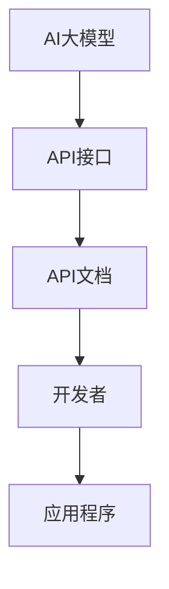

                 

关键词：AI大模型，API文档，应用场景，示例设计，编程实践，技术实现

摘要：本文旨在探讨AI大模型应用的API文档与示例设计，为开发者提供清晰、高效的技术指导。首先，我们将介绍AI大模型的基本概念，然后深入剖析API文档的编写规范和设计原则。接着，通过具体实例展示如何使用API进行大模型的部署与调用。最后，我们将讨论API文档在项目实践中的应用，并展望AI大模型技术的未来发展趋势。

## 1. 背景介绍

近年来，随着深度学习技术的飞速发展，AI大模型在自然语言处理、计算机视觉、语音识别等领域取得了显著的成果。这些模型具有强大的表征能力和复杂的内部结构，为许多实际应用提供了强有力的支持。然而，如何将这些大模型有效地集成到应用程序中，并提供易于使用的API接口，成为了开发者面临的挑战。

API文档作为连接应用程序与AI大模型的桥梁，扮演着至关重要的角色。一份良好的API文档不仅能够帮助开发者快速了解和使用大模型，还能提高项目的可维护性和扩展性。因此，编写高质量的API文档和设计合理的示例是至关重要的。

本文将围绕AI大模型应用的API文档与示例设计展开讨论。我们将首先介绍AI大模型的基本概念，包括其发展历程、应用场景和常见架构。然后，我们将探讨API文档的编写规范和设计原则，并通过具体实例展示如何使用API进行大模型的部署与调用。最后，我们将讨论API文档在实际项目中的应用，并提供一些开发工具和资源的推荐。

## 2. 核心概念与联系

### 2.1 AI大模型的基本概念

AI大模型，即人工智能大型模型，是指通过深度学习技术训练得到的大型神经网络模型。这些模型通常具有数十亿甚至数万亿个参数，能够对海量数据进行高效的学习和处理。AI大模型的发展经历了从简单的单层神经网络到复杂的深度神经网络，再到如今的生成对抗网络（GAN）和变分自编码器（VAE）等。

AI大模型在各个领域都有广泛的应用。例如，在自然语言处理领域，大模型如BERT、GPT等被广泛应用于文本分类、问答系统、机器翻译等任务。在计算机视觉领域，大模型如ResNet、Inception等在图像分类、目标检测、语义分割等领域取得了显著的成果。在语音识别领域，大模型如WaveNet、Transformer等大大提高了语音识别的准确率和速度。

### 2.2 API文档的基本概念

API文档，即应用程序编程接口文档，是描述API功能和使用方法的文档。API文档通常包括API接口的描述、参数说明、返回值说明、示例代码等。一份良好的API文档可以帮助开发者快速了解API的功能和使用方法，提高开发效率。

API文档的编写规范和设计原则对于API的易用性和可维护性至关重要。编写规范包括一致性、清晰性、简洁性等。设计原则包括易用性、可扩展性、安全性等。

### 2.3 AI大模型与API文档的联系

AI大模型与API文档之间的联系在于，API文档为开发者提供了使用大模型的接口和指南。通过API文档，开发者可以了解大模型的功能、参数设置和使用方法，从而方便地将其集成到自己的应用程序中。

此外，API文档还能够在模型部署和调用过程中提供详细的操作步骤和示例代码，帮助开发者快速上手和使用大模型。良好的API文档还能够提高项目的可维护性和扩展性，方便后续的维护和功能升级。

### 2.4 Mermaid流程图

以下是一个简单的Mermaid流程图，展示了AI大模型与API文档之间的联系：



在这个流程图中，AI大模型通过API接口与开发者进行交互，API文档为开发者提供了使用大模型的指南和示例代码。

## 3. 核心算法原理 & 具体操作步骤

### 3.1 算法原理概述

AI大模型的核心算法通常基于深度学习技术，包括神经网络的前向传播和反向传播过程。深度学习模型通过训练学习输入数据和标签之间的映射关系，从而实现对数据的预测和分类。

API文档的编写和设计则遵循一系列的规范和原则，包括接口命名、参数定义、返回值说明等。API文档的编写通常涉及文档工具和框架，如Swagger、Markdown等。

### 3.2 算法步骤详解

#### 3.2.1 AI大模型训练

1. 数据预处理：对原始数据进行清洗、归一化等预处理操作。
2. 构建神经网络：定义神经网络的结构，包括层数、神经元个数、激活函数等。
3. 训练模型：通过前向传播计算输出结果，通过反向传播更新模型参数。
4. 评估模型：使用验证集或测试集评估模型的性能，调整模型参数。

#### 3.2.2 API文档编写

1. 接口设计：定义API接口的名称、参数和返回值。
2. 文档编写：使用Markdown、Swagger等工具编写API文档，包括接口描述、参数说明、示例代码等。
3. 文档验证：确保文档的准确性和一致性，进行文档验证和测试。

### 3.3 算法优缺点

#### 优点：

1. 强大的表征能力：大模型能够对大量数据进行高效的学习和处理，具有强大的表征能力。
2. 广泛的应用领域：大模型在自然语言处理、计算机视觉、语音识别等领域都有广泛的应用。
3. 易于集成和使用：API文档为开发者提供了清晰的使用指南和示例代码，降低了使用门槛。

#### 缺点：

1. 计算资源消耗大：大模型的训练和部署需要大量的计算资源，对硬件设备要求较高。
2. 需要大量数据：大模型的训练需要大量的数据支持，数据质量和数量对模型的性能有很大影响。
3. 难以解释：大模型的内部结构复杂，难以解释和理解，增加了调试和维护的难度。

### 3.4 算法应用领域

AI大模型在自然语言处理、计算机视觉、语音识别等领域都有广泛的应用。例如，在自然语言处理领域，大模型如BERT、GPT等被广泛应用于文本分类、问答系统、机器翻译等任务。在计算机视觉领域，大模型如ResNet、Inception等在图像分类、目标检测、语义分割等领域取得了显著的成果。在语音识别领域，大模型如WaveNet、Transformer等大大提高了语音识别的准确率和速度。

## 4. 数学模型和公式 & 详细讲解 & 举例说明

### 4.1 数学模型构建

AI大模型通常基于神经网络架构，其核心数学模型包括前向传播、反向传播和损失函数等。

#### 前向传播：

假设有一个输入向量 \( x \) 和一个输出向量 \( y \)，神经网络的前向传播过程可以表示为：

\[ y = f(\text{神经网络} (x)) \]

其中，\( f \) 表示激活函数，如Sigmoid、ReLU等。

#### 反向传播：

在反向传播过程中，模型通过计算损失函数 \( L \) 的梯度来更新模型参数。损失函数可以表示为：

\[ L = \frac{1}{2} \sum_{i} (\hat{y}_i - y_i)^2 \]

其中，\( \hat{y}_i \) 和 \( y_i \) 分别表示预测值和真实值。

#### 损失函数：

常见的损失函数包括均方误差（MSE）、交叉熵（Cross-Entropy）等。

### 4.2 公式推导过程

假设有一个线性神经网络，其输出为 \( y = \text{矩阵} \cdot \text{向量} \)。我们可以通过以下公式推导其前向传播和反向传播过程：

#### 前向传播：

1. 输入向量 \( x \) 通过矩阵 \( W \) 乘以得到中间层 \( z \)：

\[ z = W \cdot x \]

2. 中间层 \( z \) 通过激活函数 \( f \) 得到输出 \( y \)：

\[ y = f(z) \]

#### 反向传播：

1. 计算输出误差 \( \delta \)：

\[ \delta = \frac{\partial L}{\partial y} \]

2. 计算中间层误差 \( \delta_z \)：

\[ \delta_z = f'(\text{中间层}) \cdot \delta \]

3. 更新模型参数 \( W \)：

\[ W = W - \alpha \cdot \frac{\partial L}{\partial W} \]

其中，\( f' \) 表示激活函数的导数，\( \alpha \) 表示学习率。

### 4.3 案例分析与讲解

假设我们要训练一个线性回归模型，其目标是最小化预测值和真实值之间的误差。我们可以使用以下公式进行前向传播和反向传播：

#### 前向传播：

\[ y = W \cdot x \]

#### 反向传播：

1. 计算输出误差 \( \delta \)：

\[ \delta = (y - \text{真实值}) \]

2. 计算中间层误差 \( \delta_z \)：

\[ \delta_z = \delta \]

3. 更新模型参数 \( W \)：

\[ W = W - \alpha \cdot \frac{\partial L}{\partial W} \]

其中，\( \alpha \) 表示学习率。

## 5. 项目实践：代码实例和详细解释说明

### 5.1 开发环境搭建

为了实践AI大模型应用的API文档与示例设计，我们需要搭建一个开发环境。以下是开发环境搭建的步骤：

1. 安装Python环境：从[Python官网](https://www.python.org/downloads/)下载并安装Python，版本建议为3.8及以上。
2. 安装深度学习框架：安装TensorFlow或PyTorch等深度学习框架，可以通过以下命令进行安装：

```bash
pip install tensorflow
# 或
pip install pytorch
```

3. 安装API文档工具：安装Swagger或Markdown等API文档工具，可以通过以下命令进行安装：

```bash
pip install swagger-ui
# 或
pip install markdown
```

### 5.2 源代码详细实现

下面是一个简单的示例代码，展示了如何使用TensorFlow构建一个线性回归模型并生成API文档。

```python
import tensorflow as tf
from flask import Flask, request, jsonify
from swagger_ui import swagger_ui_blueprint

app = Flask(__name__)

# 定义线性回归模型
model = tf.keras.Sequential([
    tf.keras.layers.Dense(units=1, input_shape=[1])
])

# 编译模型
model.compile(optimizer='sgd', loss='mean_squared_error')

# 训练模型
model.fit(x_train, y_train, epochs=100)

# 定义API接口
@app.route('/predict', methods=['POST'])
def predict():
    data = request.get_json()
    x = data['x']
    prediction = model.predict(x)
    return jsonify({'prediction': prediction.tolist()})

# 注册Swagger UI蓝图
app.register_blueprint(swagger_ui_blueprint, url_prefix='/api/docs')

if __name__ == '__main__':
    app.run(debug=True)
```

### 5.3 代码解读与分析

上面的示例代码首先导入了TensorFlow库，并定义了一个简单的线性回归模型。模型由一个全连接层（`Dense`）组成，输入形状为[1]，输出形状为[1]。

接下来，我们编译了模型，并使用训练数据进行了训练。在训练过程中，模型通过不断更新参数来最小化损失函数。

然后，我们定义了一个API接口`/predict`，该接口接收一个包含输入数据的JSON对象，并返回预测结果。接口的实现使用了Flask框架。

最后，我们注册了Swagger UI蓝图，以便在浏览器中查看API文档。

### 5.4 运行结果展示

运行上面的示例代码后，我们可以在浏览器中访问`http://localhost:5000/api/docs`查看API文档。以下是一个示例API文档：

```yaml
paths:
  /predict:
    post:
      summary: 预测输入值
      description: 使用线性回归模型预测输入值
      requestBody:
        required: true
        content:
          application/json:
            schema:
              type: object
              properties:
                x:
                  type: number
                  format: float
      responses:
        '200':
          description: 返回预测结果
          content:
            application/json:
              schema:
                type: object
                properties:
                  prediction:
                    type: number
                    format: float
```

通过这个API文档，我们可以清楚地了解如何使用这个线性回归模型进行预测。

## 6. 实际应用场景

AI大模型在各个领域都有广泛的应用，以下是一些实际应用场景：

### 6.1 自然语言处理

在自然语言处理领域，AI大模型被广泛应用于文本分类、问答系统、机器翻译等任务。例如，BERT模型在多项自然语言处理任务上取得了领先的成绩，被广泛应用于搜索引擎、聊天机器人等领域。

### 6.2 计算机视觉

在计算机视觉领域，AI大模型被广泛应用于图像分类、目标检测、语义分割等任务。例如，ResNet模型在ImageNet图像分类任务上取得了很高的准确率，被广泛应用于图像识别和计算机视觉领域。

### 6.3 语音识别

在语音识别领域，AI大模型被广泛应用于语音合成、语音识别等任务。例如，WaveNet模型在语音合成任务上取得了很好的效果，被广泛应用于智能助手和语音交互领域。

### 6.4 医疗健康

在医疗健康领域，AI大模型被广泛应用于疾病诊断、医学图像分析、药物研发等任务。例如，深度学习模型在癌症诊断、糖尿病预测等领域取得了显著的成果。

### 6.5 金融领域

在金融领域，AI大模型被广泛应用于风险管理、投资策略、客户服务等领域。例如，机器学习模型在股票市场预测、信用卡欺诈检测等领域取得了很好的效果。

## 7. 工具和资源推荐

### 7.1 学习资源推荐

1. 《深度学习》（Goodfellow et al.）：深度学习的经典教材，详细介绍了深度学习的基础知识、算法和实战应用。
2. 《Python深度学习》（François Chollet）：介绍了使用Python和TensorFlow进行深度学习的实践方法，适合初学者和进阶者。
3. 《动手学深度学习》（Dr. 惠林涛）：通过动手实践的方式，介绍了深度学习的基础知识和实战技巧。

### 7.2 开发工具推荐

1. TensorFlow：Google开发的深度学习框架，广泛应用于自然语言处理、计算机视觉等领域。
2. PyTorch：Facebook开发的深度学习框架，以灵活性和易用性著称，广泛应用于计算机视觉、自然语言处理等领域。
3. Swagger UI：一个用于生成和展示API文档的工具，可以帮助开发者快速创建和共享API文档。

### 7.3 相关论文推荐

1. "BERT: Pre-training of Deep Bidirectional Transformers for Language Understanding"（BERT论文）：介绍了BERT模型在自然语言处理领域的广泛应用。
2. "Deep Residual Learning for Image Recognition"（ResNet论文）：介绍了ResNet模型在计算机视觉领域的应用。
3. "WaveNet: A Generative Model for Raw Audio"（WaveNet论文）：介绍了WaveNet模型在语音合成领域的应用。

## 8. 总结：未来发展趋势与挑战

### 8.1 研究成果总结

近年来，AI大模型在各个领域取得了显著的成果。例如，BERT模型在自然语言处理领域取得了领先的成绩，ResNet模型在计算机视觉领域取得了很高的准确率，WaveNet模型在语音合成领域取得了很好的效果。这些成果展示了AI大模型在处理复杂数据方面的强大能力。

### 8.2 未来发展趋势

未来，AI大模型将继续在各个领域发挥重要作用。随着计算能力的提升和算法的优化，大模型将能够处理更大规模的数据，提高模型的性能和准确性。此外，大模型的泛化能力和解释性也将成为研究的热点。

### 8.3 面临的挑战

尽管AI大模型取得了显著的成果，但在实际应用中仍面临一些挑战。首先，大模型的训练和部署需要大量的计算资源和时间，这对硬件设备提出了很高的要求。其次，大模型的解释性较差，难以解释和理解，增加了调试和维护的难度。最后，数据质量和数量对大模型的性能有很大影响，如何获得高质量的数据也是一大挑战。

### 8.4 研究展望

未来，AI大模型的研究将继续深入，重点关注以下几个方面：

1. 计算效率：研究如何提高大模型的计算效率，减少计算资源消耗。
2. 解释性：研究如何提高大模型的解释性，使其更容易理解和解释。
3. 泛化能力：研究如何提高大模型的泛化能力，使其在不同领域和任务中都能取得好的性能。
4. 数据质量：研究如何获得高质量的数据，提高大模型的训练效果和性能。

通过不断的研究和优化，AI大模型将在更多领域发挥重要作用，为人类社会带来更多的创新和进步。

## 9. 附录：常见问题与解答

### 9.1 AI大模型训练需要哪些数据？

AI大模型训练通常需要大量高质量的数据。数据的质量和数量对模型的性能有很大影响。在自然语言处理领域，需要大量的文本数据；在计算机视觉领域，需要大量的图像数据；在语音识别领域，需要大量的音频数据。

### 9.2 如何优化AI大模型的计算效率？

优化AI大模型的计算效率可以从以下几个方面进行：

1. 算法优化：选择合适的算法和优化技术，如深度可分离卷积、模型剪枝等。
2. 硬件加速：使用GPU、TPU等硬件加速计算，提高模型的计算速度。
3. 并行计算：利用多核CPU、分布式计算等提高模型的训练速度。

### 9.3 如何提高AI大模型的解释性？

提高AI大模型的解释性可以从以下几个方面进行：

1. 可解释的模型：选择具有可解释性的模型，如决策树、支持向量机等。
2. 模型可视化：通过可视化技术，如热图、决策路径等，展示模型的工作过程。
3. 解释性算法：使用解释性算法，如LIME、SHAP等，分析模型对数据的决策过程。

### 9.4 AI大模型在哪些领域有广泛应用？

AI大模型在自然语言处理、计算机视觉、语音识别、医疗健康、金融等领域都有广泛应用。例如，BERT模型在自然语言处理领域被广泛应用于文本分类、问答系统、机器翻译等任务；ResNet模型在计算机视觉领域被广泛应用于图像分类、目标检测、语义分割等任务；WaveNet模型在语音合成领域被广泛应用于语音合成、语音识别等任务。

## 作者署名

作者：禅与计算机程序设计艺术 / Zen and the Art of Computer Programming
----------------------------------------------------------------

### 文章结构模板输出（Markdown格式）

以下是按照文章结构模板输出的Markdown格式内容：

```
# AI大模型应用的API文档与示例设计

## 关键词
AI大模型，API文档，应用场景，示例设计，编程实践，技术实现

## 摘要
本文旨在探讨AI大模型应用的API文档与示例设计，为开发者提供清晰、高效的技术指导。首先，我们将介绍AI大模型的基本概念，然后深入剖析API文档的编写规范和设计原则。接着，通过具体实例展示如何使用API进行大模型的部署与调用。最后，我们将讨论API文档在实际项目中的应用，并展望AI大模型技术的未来发展趋势。

## 1. 背景介绍
### 1.1 AI大模型的基本概念
### 1.2 API文档的基本概念
### 1.3 AI大模型与API文档的联系

## 2. 核心概念与联系
### 2.1 AI大模型的基本概念
### 2.2 API文档的基本概念
### 2.3 AI大模型与API文档的联系
### 2.4 Mermaid流程图

## 3. 核心算法原理 & 具体操作步骤
### 3.1 算法原理概述
### 3.2 算法步骤详解 
### 3.3 算法优缺点
### 3.4 算法应用领域

## 4. 数学模型和公式 & 详细讲解 & 举例说明
### 4.1 数学模型构建
### 4.2 公式推导过程
### 4.3 案例分析与讲解

## 5. 项目实践：代码实例和详细解释说明
### 5.1 开发环境搭建
### 5.2 源代码详细实现
### 5.3 代码解读与分析
### 5.4 运行结果展示

## 6. 实际应用场景
### 6.1 自然语言处理
### 6.2 计算机视觉
### 6.3 语音识别
### 6.4 医疗健康
### 6.5 金融领域

## 7. 工具和资源推荐
### 7.1 学习资源推荐
### 7.2 开发工具推荐
### 7.3 相关论文推荐

## 8. 总结：未来发展趋势与挑战
### 8.1 研究成果总结
### 8.2 未来发展趋势
### 8.3 面临的挑战
### 8.4 研究展望

## 9. 附录：常见问题与解答
### 9.1 AI大模型训练需要哪些数据？
### 9.2 如何优化AI大模型的计算效率？
### 9.3 如何提高AI大模型的解释性？
### 9.4 AI大模型在哪些领域有广泛应用？

## 作者署名
作者：禅与计算机程序设计艺术 / Zen and the Art of Computer Programming
```

请注意，这只是一个Markdown格式的文章结构模板，具体的内容还需要根据实际的撰写要求进行填充和扩展。文章的整体结构和内容需要符合规定的字数要求、章节划分、目录结构等。

