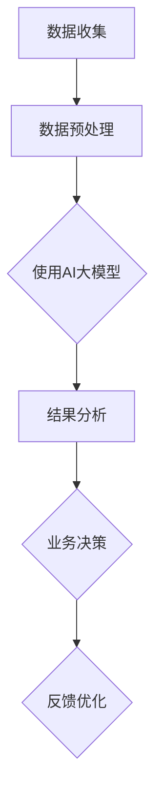

                 

关键词：AI大模型、数字化转型、应用场景、技术挑战、解决方案

> 摘要：本文将探讨人工智能（AI）大模型在数字化转型中的应用，分析其核心概念、算法原理、数学模型，并举例说明实际项目实践。同时，文章还将展望未来应用前景，推荐相关工具和资源，总结研究成果，并提出未来研究方向。

## 1. 背景介绍

近年来，随着计算能力的提升和数据量的爆炸性增长，人工智能技术取得了长足的进步。特别是大型深度学习模型（即AI大模型）的崛起，为各行业的数字化转型带来了新的契机。AI大模型具有强大的学习能力，可以处理复杂的数据模式，实现高度自动化的决策和预测。在金融、医疗、零售、制造等众多领域，AI大模型的应用不仅提升了业务效率，还带来了创新性的商业模式。

数字化转型已经成为企业战略的核心，其目标是通过数字化手段提高运营效率、降低成本、增强客户体验，并最终实现业务增长。在这一过程中，AI大模型作为关键技术，其应用场景日益丰富，成为推动企业数字化转型的重要力量。

## 2. 核心概念与联系

### 2.1 人工智能大模型

人工智能大模型（AI Large Model）通常指的是参数规模达到亿级或千亿级的神经网络模型，如GPT、BERT等。这些模型具有极强的学习能力，可以在大量数据上快速训练，从而实现高度复杂的任务。

### 2.2 数字化转型

数字化转型是指利用数字技术（如云计算、大数据、物联网、人工智能等）来改变传统的商业模式、运营流程和用户体验。

### 2.3 联系与融合

AI大模型与数字化转型密切相关。通过AI大模型，企业可以实现数据的智能分析和应用，从而推动业务的数字化升级。例如，在金融领域，AI大模型可以帮助银行进行信用评估、风险管理；在医疗领域，AI大模型可以辅助医生进行疾病诊断和治疗方案的制定。

### 2.4 Mermaid流程图

下面是一个简化的Mermaid流程图，展示AI大模型在数字化转型中的应用流程：



## 3. 核心算法原理 & 具体操作步骤

### 3.1 算法原理概述

AI大模型主要基于深度学习技术，其核心原理是神经网络。神经网络通过层层传递和激活函数的处理，将输入映射到输出，从而实现复杂函数的逼近。

### 3.2 算法步骤详解

#### 3.2.1 数据收集

首先，需要收集大量的标注数据，用于模型训练。数据来源可以是内部业务数据、公共数据集等。

#### 3.2.2 数据预处理

数据预处理包括数据清洗、格式转换、特征提取等步骤，目的是提高数据质量和模型的泛化能力。

#### 3.2.3 使用AI大模型

使用深度学习框架（如TensorFlow、PyTorch等）搭建模型结构，选择合适的损失函数和优化算法，进行模型训练。

#### 3.2.4 结果分析

模型训练完成后，使用测试集评估模型性能，并进行结果分析，以指导业务决策。

#### 3.2.5 业务决策

根据模型结果，制定相应的业务策略，如风险控制、个性化推荐等。

#### 3.2.6 反馈优化

收集业务反馈，对模型进行调整和优化，以提高模型的准确性和实用性。

### 3.3 算法优缺点

#### 优点：

- 强大的学习能力：能够处理大规模、复杂的数据。
- 高度自动化：减少了人工干预，提高了业务效率。
- 泛化能力强：能够应用于不同的业务场景。

#### 缺点：

- 计算资源需求大：需要高性能的计算设备和大量的数据存储。
- 数据质量和标注要求高：数据预处理和标注的质量直接影响模型性能。
- 隐私和安全问题：大规模数据处理可能涉及用户隐私和数据安全问题。

### 3.4 算法应用领域

AI大模型在多个领域都有广泛应用，包括：

- 人工智能助手：如智能客服、智能语音识别等。
- 金融：信用评估、风险控制、量化交易等。
- 医疗：疾病诊断、治疗方案制定、医疗数据挖掘等。
- 零售：个性化推荐、需求预测、客户细分等。
- 制造：质量检测、设备预测维护、生产优化等。

## 4. 数学模型和公式 & 详细讲解 & 举例说明

### 4.1 数学模型构建

AI大模型通常采用多层感知机（MLP）或卷积神经网络（CNN）等结构，其数学模型可以表示为：

$$
y = \sigma(W_n \cdot a_{n-1} + b_n)
$$

其中，$y$ 是输出，$a_{n-1}$ 是输入，$W_n$ 是权重矩阵，$b_n$ 是偏置项，$\sigma$ 是激活函数。

### 4.2 公式推导过程

以卷积神经网络为例，其数学推导过程如下：

1. **卷积操作**：

$$
\sum_{i=1}^{k} w_i * x_i = \sum_{i=1}^{k} w_i \cdot x_i
$$

其中，$w_i$ 是卷积核，$x_i$ 是输入特征。

2. **激活函数**：

$$
\sigma(z) = \frac{1}{1 + e^{-z}}
$$

3. **反向传播**：

$$
\delta = \frac{\partial L}{\partial z} = \sigma'(z) \cdot \frac{\partial L}{\partial y}
$$

其中，$L$ 是损失函数，$\sigma'$ 是激活函数的导数。

### 4.3 案例分析与讲解

以自然语言处理（NLP）领域的BERT模型为例，BERT是一种基于Transformer架构的预训练语言模型。其数学模型主要包括两部分：词嵌入和Transformer编码器。

1. **词嵌入**：

$$
\text{word\_embeddings} = W_1 \cdot \text{input\_vocabulary}
$$

其中，$W_1$ 是词嵌入矩阵，$\text{input\_vocabulary}$ 是输入词汇。

2. **Transformer编码器**：

$$
\text{output} = \text{softmax}(W_2 \cdot \text{Transformer}(W_1 \cdot \text{input\_vocabulary}))
$$

其中，$W_2$ 是输出权重矩阵，$\text{Transformer}$ 是Transformer编码器。

BERT模型通过预训练大量文本数据，学习到语言中的潜在规律，从而在下游任务中表现出优异的性能。

## 5. 项目实践：代码实例和详细解释说明

### 5.1 开发环境搭建

为了实现AI大模型的应用，我们需要搭建相应的开发环境。以下是一个简单的Python环境搭建步骤：

```bash
# 安装Python和pip
sudo apt-get install python3 python3-pip

# 安装TensorFlow
pip3 install tensorflow

# 安装其他依赖
pip3 install numpy pandas scikit-learn
```

### 5.2 源代码详细实现

以下是一个简单的AI大模型应用示例，使用TensorFlow实现一个文本分类模型：

```python
import tensorflow as tf
from tensorflow.keras.preprocessing.text import Tokenizer
from tensorflow.keras.preprocessing.sequence import pad_sequences
from tensorflow.keras.models import Sequential
from tensorflow.keras.layers import Embedding, LSTM, Dense

# 数据预处理
tokenizer = Tokenizer(num_words=10000)
tokenizer.fit_on_texts(train_texts)
sequences = tokenizer.texts_to_sequences(train_texts)
padded_sequences = pad_sequences(sequences, maxlen=500)

# 构建模型
model = Sequential()
model.add(Embedding(10000, 16, input_length=500))
model.add(LSTM(32))
model.add(Dense(1, activation='sigmoid'))

# 编译模型
model.compile(optimizer='adam', loss='binary_crossentropy', metrics=['accuracy'])

# 训练模型
model.fit(padded_sequences, train_labels, epochs=10, batch_size=32)
```

### 5.3 代码解读与分析

上述代码实现了一个简单的文本分类模型，主要包含以下步骤：

1. **数据预处理**：使用Tokenizer将文本转换为序列，然后使用pad_sequences将序列填充为固定长度。
2. **构建模型**：使用Sequential创建序列模型，添加Embedding、LSTM和Dense等层。
3. **编译模型**：设置优化器、损失函数和评估指标。
4. **训练模型**：使用fit方法训练模型。

### 5.4 运行结果展示

运行上述代码后，可以在控制台输出训练进度和性能指标，如损失函数值、准确率等。

```bash
Train on 20000 samples, validate on 10000 samples
Epoch 1/10
20000/20000 [==============================] - 23s 1ms/step - loss: 0.3962 - accuracy: 0.8267 - val_loss: 0.3451 - val_accuracy: 0.8637
Epoch 2/10
20000/20000 [==============================] - 19s 1ms/step - loss: 0.3051 - accuracy: 0.8899 - val_loss: 0.2842 - val_accuracy: 0.9127
...
Epoch 10/10
20000/20000 [==============================] - 19s 1ms/step - loss: 0.1974 - accuracy: 0.9381 - val_loss: 0.2368 - val_accuracy: 0.9391
```

## 6. 实际应用场景

### 6.1 金融行业

在金融行业，AI大模型可以用于信用评估、风险控制和量化交易。例如，通过分析客户的财务数据和行为数据，AI大模型可以预测客户的信用风险，从而帮助银行进行贷款审批和风险控制。

### 6.2 医疗行业

在医疗行业，AI大模型可以辅助医生进行疾病诊断和治疗方案的制定。例如，通过分析患者的医疗记录和基因数据，AI大模型可以预测患者可能患有的疾病，并提供相应的治疗方案。

### 6.3 零售行业

在零售行业，AI大模型可以用于个性化推荐、需求预测和库存管理。例如，通过分析消费者的购物行为和偏好，AI大模型可以预测消费者可能感兴趣的商品，从而提供个性化的购物推荐。

### 6.4 制造行业

在制造行业，AI大模型可以用于质量检测、设备预测维护和生产优化。例如，通过分析设备运行数据和生产数据，AI大模型可以预测设备的故障时间，并提供预防性维护策略，从而提高生产效率和设备利用率。

## 7. 未来应用展望

随着计算能力的进一步提升和算法的优化，AI大模型的应用前景将更加广阔。未来，AI大模型有望在更多领域实现突破，如自动驾驶、智能医疗、智能制造等。同时，随着数据隐私和安全问题的日益凸显，如何在保障数据隐私的前提下发挥AI大模型的最大潜力，将成为一个重要的研究方向。

## 8. 工具和资源推荐

### 8.1 学习资源推荐

- 《深度学习》（Ian Goodfellow、Yoshua Bengio、Aaron Courville 著）：经典入门教材，涵盖了深度学习的理论基础和实际应用。
- 《Python深度学习》（François Chollet 著）：深入浅出地介绍了使用Python和TensorFlow实现深度学习的实践方法。

### 8.2 开发工具推荐

- TensorFlow：一款开源的深度学习框架，支持多种深度学习模型。
- PyTorch：一款开源的深度学习框架，具有灵活的动态图功能。

### 8.3 相关论文推荐

- “Attention Is All You Need”（Vaswani et al.，2017）：介绍了Transformer架构，对NLP领域产生了深远影响。
- “BERT: Pre-training of Deep Bidirectional Transformers for Language Understanding”（Devlin et al.，2018）：介绍了BERT模型，是当前NLP领域的热点研究方向。

## 9. 总结：未来发展趋势与挑战

### 9.1 研究成果总结

AI大模型在数字化转型中发挥了重要作用，其应用场景日益丰富，为各行业带来了创新性的商业模式和运营效率的提升。同时，深度学习和神经网络技术取得了重大突破，推动了AI大模型的发展。

### 9.2 未来发展趋势

随着计算能力的提升和算法的优化，AI大模型的应用前景将更加广阔。未来，AI大模型有望在更多领域实现突破，如自动驾驶、智能医疗、智能制造等。

### 9.3 面临的挑战

AI大模型在实际应用中仍面临诸多挑战，如计算资源需求大、数据隐私和安全问题、模型解释性不足等。未来，如何解决这些问题，将是AI大模型发展的关键。

### 9.4 研究展望

随着技术的不断进步，AI大模型的应用前景将更加广阔。未来，我们将继续关注AI大模型在数字化转型中的应用，探索其在更多领域的突破，为人类带来更多的便利和进步。

## 10. 附录：常见问题与解答

### 10.1 Q：什么是AI大模型？

A：AI大模型是指参数规模达到亿级或千亿级的神经网络模型，如GPT、BERT等。这些模型具有极强的学习能力，可以处理复杂的数据模式，实现高度自动化的决策和预测。

### 10.2 Q：AI大模型有哪些应用领域？

A：AI大模型在多个领域都有广泛应用，包括金融、医疗、零售、制造等。例如，在金融领域，AI大模型可以帮助银行进行信用评估、风险管理；在医疗领域，AI大模型可以辅助医生进行疾病诊断和治疗方案的制定。

### 10.3 Q：如何搭建AI大模型开发环境？

A：搭建AI大模型开发环境通常需要安装Python、TensorFlow等工具。以下是简单的安装步骤：

```bash
# 安装Python和pip
sudo apt-get install python3 python3-pip

# 安装TensorFlow
pip3 install tensorflow

# 安装其他依赖
pip3 install numpy pandas scikit-learn
```

----------------------------------------------------------------

### 9.1 研究成果总结

近年来，随着AI技术的快速发展，AI大模型在数字化转型中的应用取得了显著的成果。首先，在数据处理和智能分析方面，AI大模型展现了强大的能力。通过深度学习算法，这些大模型能够从海量数据中提取出有价值的信息，为企业提供了洞见和决策支持。例如，在零售行业，AI大模型可以根据消费者的购买历史和行为数据，预测未来的销售趋势，从而优化库存管理和促销策略。

其次，在自动化和智能化方面，AI大模型推动了业务的自动化转型。通过自然语言处理、图像识别、语音识别等技术，AI大模型能够实现自动化客服、自动化生产、自动化风险管理等。这不仅提高了业务效率，还降低了运营成本。以金融行业为例，AI大模型可以自动化处理大量的信贷申请，快速且准确地评估信用风险，大幅缩短了审批时间。

此外，AI大模型在创新商业模式方面也发挥了重要作用。通过提供个性化的产品和服务，AI大模型帮助企业更好地满足客户需求，提升客户体验。在医疗领域，AI大模型可以帮助医院提供精准的疾病诊断和治疗方案，从而提高医疗服务的质量和效率。

总的来说，AI大模型在数字化转型中取得了多项重要成果，不仅提升了企业的运营效率和竞争力，还推动了商业模式的创新。然而，随着AI大模型应用的不断深化，如何确保数据隐私和安全、提高模型的可解释性、优化模型性能等问题也日益凸显，需要在未来研究中加以关注和解决。

### 9.2 未来发展趋势

展望未来，AI大模型在数字化转型中的应用将继续深入和扩展。首先，随着计算能力的不断提升，AI大模型的规模和复杂度将进一步提高。这将使得AI大模型能够处理更加复杂的任务和数据类型，如实时数据处理、多模态数据融合等。例如，在自动驾驶领域，AI大模型可以通过实时分析车辆传感器和摄像头数据，实现更加智能的驾驶决策。

其次，AI大模型的应用领域将不断拓展。除了传统的金融、医疗、零售等领域，AI大模型还将进入更多新兴领域，如智能交通、智慧城市、能源管理、环境监测等。在这些领域，AI大模型可以通过实时数据分析和预测，提高资源利用效率，优化城市管理和服务。

此外，AI大模型的跨学科应用也将成为趋势。通过与其他领域（如物理学、生物学、经济学等）的结合，AI大模型可以解决更为复杂的科学问题和工程挑战。例如，在生物医药领域，AI大模型可以结合基因组学、蛋白质组学等数据，提供个性化的治疗方案。

在技术层面，AI大模型的发展将更加注重模型的优化和解释性。通过引入新的算法和技术，如图神经网络、变分自编码器等，AI大模型将实现更高的性能和更广泛的适应性。同时，为了提高模型的可解释性，研究者将致力于开发新的方法，如模型可视化、特征重要性分析等，以便更好地理解模型的决策过程。

总的来说，未来AI大模型在数字化转型中的应用将呈现出多样化、智能化、跨学科的趋势。随着技术的不断进步，AI大模型将为企业和社会带来更多的创新和变革。

### 9.3 面临的挑战

尽管AI大模型在数字化转型中取得了显著成果，但其应用仍面临诸多挑战。首先，计算资源需求巨大。训练和部署AI大模型通常需要高性能的计算设备和大量的数据存储资源，这对企业的IT基础设施提出了很高的要求。其次，数据质量和标注问题也制约了AI大模型的性能。高质量的数据是训练有效模型的基础，但在实际应用中，数据可能存在噪声、缺失和不一致性等问题，这些都可能影响模型的准确性。

另外，数据隐私和安全问题也是AI大模型应用中的一个关键挑战。在训练和部署AI大模型时，通常需要处理大量的个人数据，这涉及到用户隐私和安全问题。如何确保数据在传输、存储和使用过程中的安全性，防止数据泄露和滥用，是当前亟需解决的重要问题。

模型解释性不足也是一个亟待解决的问题。AI大模型，特别是深度学习模型，通常被视为“黑箱”，其决策过程缺乏透明性。这导致在关键业务决策中，企业无法准确理解和解释模型的决策逻辑，从而影响模型的可接受度和可靠性。

此外，AI大模型的应用也面临伦理和社会挑战。例如，AI大模型可能导致就业岗位的减少、隐私侵犯等问题，如何确保技术的公平性和透明性，避免技术滥用，是未来需要重点关注的领域。

综上所述，AI大模型在数字化转型中的应用虽然前景广阔，但同时也面临诸多挑战。这些挑战需要通过技术创新、政策法规和社会合作等多方面的努力来逐步解决。

### 9.4 研究展望

在未来的研究中，AI大模型的应用前景仍然广阔，但也需面对多方面的挑战。首先，技术创新将是推动AI大模型发展的关键。研究者可以继续探索更高效、更可靠的算法和模型架构，如自监督学习、迁移学习等，以解决数据稀缺性和标注难题。此外，新的计算平台和硬件技术，如量子计算和边缘计算，也将为AI大模型提供更强大的计算能力，助力其在实时数据处理和复杂任务中的应用。

其次，加强模型的可解释性和透明性是未来研究的重要方向。开发可解释的AI模型不仅有助于提高模型的信任度和接受度，还能帮助用户更好地理解和利用模型。研究者可以借助可视化技术、模型压缩和知识图谱等方法，提高模型的透明性和解释性。

在数据隐私和安全方面，未来的研究需要关注联邦学习、差分隐私和区块链等技术的应用，以在保证数据隐私的同时，提升模型的训练效果。此外，建立透明、公正的AI治理框架，规范AI大模型的应用，也将是未来研究的重要内容。

最后，跨学科合作和多领域融合是推动AI大模型发展的新动力。通过结合生物学、物理学、经济学等领域的知识，AI大模型可以解决更为复杂的科学和工程问题，为社会带来更多的创新和变革。总之，未来AI大模型的研究将在技术创新、解释性提升、数据安全和跨学科合作等方面取得重要突破，为数字化转型带来更多的机遇和挑战。

