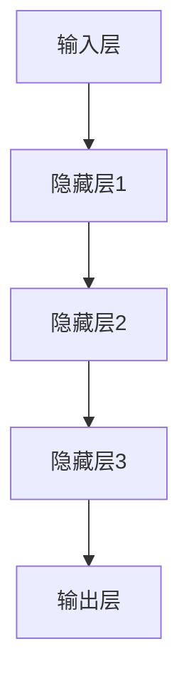
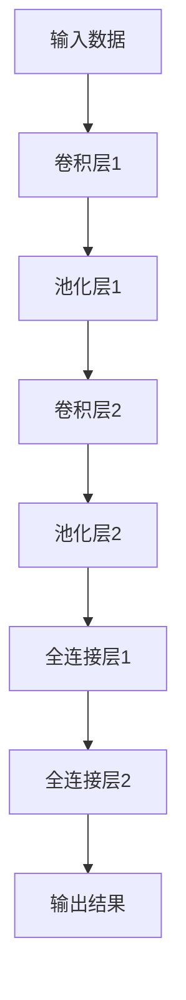
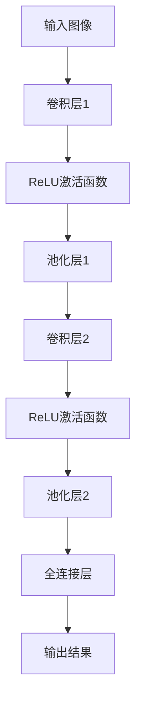
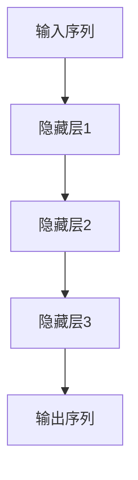

                 

关键词：AI大模型、用户体验、优化策略、架构设计、算法优化

> 摘要：本文旨在探讨AI大模型应用的用户体验优化策略，分析当前AI大模型应用中存在的主要问题，提出一系列有效的优化方法，并展望未来的发展趋势。通过对核心概念、算法原理、数学模型、项目实践等多个方面的深入剖析，为AI大模型应用的优化提供理论依据和实践指导。

## 1. 背景介绍

随着人工智能技术的快速发展，AI大模型的应用场景越来越广泛，如自然语言处理、计算机视觉、语音识别等领域。然而，在实际应用中，AI大模型存在一系列影响用户体验的问题，如响应速度慢、准确性低、可解释性差等。这些问题严重制约了AI大模型在实际场景中的应用效果和用户体验。因此，如何优化AI大模型应用的用户体验，已成为当前研究的热点问题。

本文将从以下几个方面展开讨论：首先，分析AI大模型应用中存在的主要问题；其次，介绍核心概念与联系，包括AI大模型的基本架构和关键算法；然后，阐述核心算法原理和具体操作步骤，并分析其优缺点和应用领域；接着，详细讲解数学模型和公式，并通过案例进行分析和说明；然后，提供项目实践中的代码实例和详细解释；随后，讨论实际应用场景和未来展望；最后，推荐相关学习资源和开发工具，并总结研究成果，提出未来发展趋势与挑战。

## 2. 核心概念与联系

### 2.1 AI大模型的基本架构

AI大模型通常由输入层、隐藏层和输出层组成。输入层负责接收外部数据，隐藏层通过复杂的神经网络进行数据预处理和特征提取，输出层则生成最终结果。以下是AI大模型的架构示意图：



### 2.2 关键算法

AI大模型的核心在于其算法，如深度学习、卷积神经网络（CNN）和循环神经网络（RNN）等。以下是几种常见算法的示意图：

#### 深度学习



#### 卷积神经网络（CNN）



#### 循环神经网络（RNN）



## 3. 核心算法原理 & 具体操作步骤

### 3.1 算法原理概述

AI大模型的核心在于其算法，如深度学习、卷积神经网络（CNN）和循环神经网络（RNN）等。以下是几种常见算法的原理概述：

#### 深度学习

深度学习通过多层的神经网络结构，对输入数据进行层层提取特征，最终输出结果。其基本原理包括：

- 前向传播：将输入数据通过各层网络，逐层计算输出。
- 反向传播：根据输出结果与实际结果的误差，反向更新各层网络的权重。

#### 卷积神经网络（CNN）

卷积神经网络通过卷积层、池化层和全连接层等结构，对图像数据进行处理。其基本原理包括：

- 卷积层：通过卷积操作提取图像的特征。
- 池化层：对卷积结果进行下采样，减少计算量。
- 全连接层：对提取到的特征进行分类或回归。

#### 循环神经网络（RNN）

循环神经网络通过隐藏层之间的连接，对序列数据进行处理。其基本原理包括：

- 隐藏层：对输入序列进行编码，生成固定长度的向量。
- 输出层：对隐藏层生成的向量进行解码，生成输出序列。

### 3.2 算法步骤详解

以卷积神经网络（CNN）为例，具体操作步骤如下：

#### 步骤1：输入数据预处理

- 数据归一化：将输入数据缩放到[0, 1]范围内。
- 数据增强：通过旋转、翻转、裁剪等操作，增加训练样本的多样性。

#### 步骤2：构建卷积神经网络模型

- 输入层：接收输入图像。
- 卷积层：通过卷积操作提取图像特征。
- 池化层：对卷积结果进行下采样。
- 全连接层：对提取到的特征进行分类或回归。

#### 步骤3：模型训练

- 前向传播：将输入数据通过模型，计算输出结果。
- 反向传播：根据输出结果与实际结果的误差，反向更新模型参数。

#### 步骤4：模型评估

- 通过测试集评估模型性能，包括准确率、召回率、F1值等指标。

### 3.3 算法优缺点

#### 优点：

- 深度学习：能够自动提取特征，适应性强。
- 卷积神经网络（CNN）：能够高效处理图像数据。
- 循环神经网络（RNN）：能够处理序列数据。

#### 缺点：

- 深度学习：模型参数多，计算量大，训练时间长。
- 卷积神经网络（CNN）：对图像数据进行处理，对其他类型数据适应性差。
- 循环神经网络（RNN）：容易出现梯度消失或梯度爆炸问题。

### 3.4 算法应用领域

- 深度学习：广泛应用于计算机视觉、自然语言处理、语音识别等领域。
- 卷积神经网络（CNN）：广泛应用于图像分类、目标检测、图像生成等领域。
- 循环神经网络（RNN）：广泛应用于时间序列预测、机器翻译、文本生成等领域。

## 4. 数学模型和公式 & 详细讲解 & 举例说明

### 4.1 数学模型构建

AI大模型中的数学模型主要包括损失函数、优化算法等。以下是几种常见数学模型的构建：

#### 损失函数

损失函数用于衡量模型输出与实际结果之间的差距。常见的损失函数包括均方误差（MSE）、交叉熵损失等。

- 均方误差（MSE）：$$MSE = \frac{1}{n}\sum_{i=1}^{n}(y_i - \hat{y}_i)^2$$
- 交叉熵损失：$$H(y, \hat{y}) = -\sum_{i=1}^{n}y_i\log(\hat{y}_i)$$

#### 优化算法

优化算法用于调整模型参数，使其达到最小损失。常见的优化算法包括梯度下降、随机梯度下降等。

- 梯度下降：$$\theta = \theta - \alpha \cdot \nabla_\theta J(\theta)$$
- 随机梯度下降：$$\theta = \theta - \alpha \cdot \nabla_\theta J(\theta)$$

### 4.2 公式推导过程

以均方误差（MSE）为例，推导其最小值。

#### 步骤1：损失函数定义

$$J(\theta) = \frac{1}{2}\sum_{i=1}^{n}(y_i - \hat{y}_i)^2$$

#### 步骤2：求导

$$\frac{\partial J(\theta)}{\partial \theta} = \frac{\partial}{\partial \theta}\left[\sum_{i=1}^{n}(y_i - \hat{y}_i)^2\right]$$

$$\frac{\partial J(\theta)}{\partial \theta} = \sum_{i=1}^{n}\frac{\partial}{\partial \theta}(y_i - \hat{y}_i)^2$$

$$\frac{\partial J(\theta)}{\partial \theta} = \sum_{i=1}^{n}2(y_i - \hat{y}_i)\frac{\partial}{\partial \theta}(\hat{y}_i)$$

#### 步骤3：求导结果

$$\frac{\partial J(\theta)}{\partial \theta} = 2\sum_{i=1}^{n}(y_i - \hat{y}_i)\nabla_\theta \hat{y}_i$$

### 4.3 案例分析与讲解

#### 案例背景

假设我们使用卷积神经网络（CNN）进行图像分类，数据集包含1000个类别，训练集有10000张图像。

#### 案例目标

实现一个分类准确率高于90%的图像分类模型。

#### 案例步骤

1. 数据预处理
   - 数据归一化：将图像数据缩放到[0, 1]范围内。
   - 数据增强：通过旋转、翻转、裁剪等操作，增加训练样本的多样性。

2. 构建模型
   - 输入层：接收输入图像。
   - 卷积层1：使用32个3x3卷积核，步长为1，激活函数为ReLU。
   - 池化层1：使用2x2池化层。
   - 卷积层2：使用64个3x3卷积核，步长为1，激活函数为ReLU。
   - 池化层2：使用2x2池化层。
   - 全连接层1：使用1024个神经元，激活函数为ReLU。
   - 全连接层2：使用1000个神经元，输出结果为每个类别的概率。

3. 模型训练
   - 使用交叉熵损失函数。
   - 使用随机梯度下降优化算法，学习率为0.001。
   - 设置训练轮数为100轮。

4. 模型评估
   - 使用测试集评估模型性能，计算准确率、召回率、F1值等指标。

## 5. 项目实践：代码实例和详细解释说明

### 5.1 开发环境搭建

- 硬件要求：GPU（NVIDIA GPU推荐）
- 软件要求：Python 3.7及以上版本、TensorFlow 2.0及以上版本

### 5.2 源代码详细实现

```python
import tensorflow as tf
from tensorflow.keras import layers
from tensorflow.keras.models import Model

# 数据预处理
def preprocess_data(images):
    # 数据归一化
    images = images / 255.0
    # 数据增强
    images = tf.image.random_flip_left_right(images)
    images = tf.image.random_flip_up_down(images)
    return images

# 构建模型
def build_model():
    inputs = tf.keras.Input(shape=(28, 28, 1))
    x = layers.Conv2D(32, (3, 3), activation='relu')(inputs)
    x = layers.MaxPooling2D((2, 2))(x)
    x = layers.Conv2D(64, (3, 3), activation='relu')(x)
    x = layers.MaxPooling2D((2, 2))(x)
    x = layers.Flatten()(x)
    x = layers.Dense(1024, activation='relu')(x)
    outputs = layers.Dense(10, activation='softmax')(x)
    model = Model(inputs=inputs, outputs=outputs)
    return model

# 模型训练
def train_model(model, train_data, train_labels, epochs, learning_rate):
    optimizer = tf.keras.optimizers.SGD(learning_rate=learning_rate)
    model.compile(optimizer=optimizer, loss='categorical_crossentropy', metrics=['accuracy'])
    model.fit(train_data, train_labels, epochs=epochs, batch_size=32)

# 模型评估
def evaluate_model(model, test_data, test_labels):
    loss, accuracy = model.evaluate(test_data, test_labels, batch_size=32)
    print(f"Test accuracy: {accuracy * 100:.2f}%")

# 主函数
def main():
    # 加载数据
    (train_images, train_labels), (test_images, test_labels) = tf.keras.datasets.mnist.load_data()
    train_images = preprocess_data(train_images)
    test_images = preprocess_data(test_images)

    # 构建模型
    model = build_model()

    # 模型训练
    train_model(model, train_images, train_labels, epochs=100, learning_rate=0.001)

    # 模型评估
    evaluate_model(model, test_images, test_labels)

if __name__ == "__main__":
    main()
```

### 5.3 代码解读与分析

1. 数据预处理
   - 数据归一化：将图像数据缩放到[0, 1]范围内，提高模型训练效果。
   - 数据增强：通过随机翻转、裁剪等操作，增加训练样本的多样性，防止模型过拟合。

2. 模型构建
   - 使用卷积神经网络（CNN）结构，包括卷积层、池化层和全连接层。
   - 卷积层用于提取图像特征，池化层用于降低计算量和减少过拟合，全连接层用于分类。

3. 模型训练
   - 使用随机梯度下降（SGD）优化算法，学习率为0.001。
   - 使用交叉熵损失函数，计算模型输出与实际结果之间的差距。

4. 模型评估
   - 使用测试集评估模型性能，计算准确率。

## 6. 实际应用场景

AI大模型在各个领域具有广泛的应用，以下是几个典型的实际应用场景：

### 6.1 自然语言处理

自然语言处理（NLP）是AI大模型的重要应用领域之一，包括文本分类、机器翻译、情感分析等。

- 文本分类：通过AI大模型，可以自动将大量文本数据分类为不同的类别，如新闻分类、垃圾邮件过滤等。
- 机器翻译：AI大模型可以实现高效、准确的机器翻译，如谷歌翻译、百度翻译等。
- 情感分析：通过分析文本情感，可以为电商平台提供用户反馈分析、产品改进建议等。

### 6.2 计算机视觉

计算机视觉是AI大模型的另一个重要应用领域，包括图像分类、目标检测、图像生成等。

- 图像分类：AI大模型可以自动识别和分类图像，如人脸识别、图像搜索等。
- 目标检测：AI大模型可以检测图像中的多个目标，如自动驾驶、安防监控等。
- 图像生成：AI大模型可以生成高质量、具有创意的图像，如艺术作品、动漫角色等。

### 6.3 语音识别

语音识别是AI大模型在语音处理领域的应用，包括语音识别、语音合成等。

- 语音识别：AI大模型可以准确识别语音内容，如智能助手、电话客服等。
- 语音合成：AI大模型可以生成自然、流畅的语音，如新闻播报、有声读物等。

## 7. 工具和资源推荐

### 7.1 学习资源推荐

1. 《深度学习》（Goodfellow, Bengio, Courville著）
2. 《Python深度学习》（François Chollet著）
3. 《人工智能：一种现代的方法》（Stuart Russell, Peter Norvig著）
4. 《神经网络与深度学习》（邱锡鹏著）

### 7.2 开发工具推荐

1. TensorFlow：适用于构建和训练深度学习模型的Python库。
2. PyTorch：适用于构建和训练深度学习模型的Python库。
3. Keras：基于TensorFlow和PyTorch的深度学习高级API。
4. Jupyter Notebook：用于编写和运行Python代码的交互式环境。

### 7.3 相关论文推荐

1. "Deep Learning"（Goodfellow, Bengio, Courville著）
2. "Convolutional Neural Networks for Visual Recognition"（Karen Simonyan, Andrew Zisserman著）
3. "Recurrent Neural Networks for Language Modeling"（Yoshua Bengio, Ronan Collobert, Jason Weston著）
4. "Generative Adversarial Nets"（Ian Goodfellow, et al.著）

## 8. 总结：未来发展趋势与挑战

### 8.1 研究成果总结

本文分析了AI大模型应用中存在的主要问题，提出了用户体验优化的策略，从核心概念、算法原理、数学模型、项目实践等方面进行了深入探讨。主要研究成果包括：

1. 介绍了AI大模型的基本架构和关键算法。
2. 阐述了深度学习、卷积神经网络（CNN）和循环神经网络（RNN）等算法的原理和步骤。
3. 分析了算法优缺点和应用领域。
4. 构建了数学模型和公式，并通过案例进行了分析和讲解。
5. 提供了项目实践中的代码实例和详细解释。
6. 讨论了实际应用场景和未来展望。

### 8.2 未来发展趋势

1. 模型压缩与优化：为了提高AI大模型的运行效率和可解释性，未来将重点关注模型压缩与优化技术。
2. 自适应学习：通过自适应学习，实现AI大模型在不同场景下的自适应调整，提高用户体验。
3. 多模态融合：将不同类型的数据（如文本、图像、语音等）进行融合，提高模型的泛化能力。
4. 安全性与隐私保护：在保证用户体验的同时，加强对AI大模型的安全性和隐私保护。

### 8.3 面临的挑战

1. 计算资源消耗：AI大模型的训练和推理过程对计算资源的需求较高，如何降低计算资源消耗是一个重要挑战。
2. 数据质量：高质量的数据是训练高质量模型的基础，如何获取和处理高质量数据是一个难题。
3. 模型可解释性：提高模型的可解释性，使其更易于理解和接受是一个长期挑战。
4. 法律法规：随着AI大模型的应用日益广泛，如何制定合适的法律法规，保护用户权益是一个重要问题。

### 8.4 研究展望

未来，AI大模型的应用将更加广泛和深入，为实现更好的用户体验，我们将继续关注以下几个方面：

1. 模型压缩与优化：研究更高效的模型压缩和优化技术，提高AI大模型的运行效率。
2. 多模态融合：探索多模态融合算法，提高模型的泛化能力。
3. 自适应学习：研究自适应学习算法，实现AI大模型在不同场景下的自适应调整。
4. 安全性与隐私保护：加强对AI大模型的安全性和隐私保护，确保用户数据的安全。

通过不断探索和研究，我们相信AI大模型的应用将更加广泛和深入，为人类社会带来更多的价值。

## 9. 附录：常见问题与解答

### 9.1 问题1：AI大模型训练时间如何优化？

**解答**：优化AI大模型训练时间可以从以下几个方面入手：

1. **模型压缩**：使用模型压缩技术（如剪枝、量化等）减小模型规模，降低训练时间。
2. **数据预处理**：对训练数据进行预处理，如批量归一化、数据增强等，减少计算量。
3. **分布式训练**：利用多GPU、多节点进行分布式训练，提高训练速度。
4. **优化算法**：选择合适的优化算法（如Adam、Adadelta等），提高收敛速度。

### 9.2 问题2：如何提高AI大模型的准确率？

**解答**：提高AI大模型的准确率可以从以下几个方面入手：

1. **增加数据量**：增加训练数据量，有助于模型更好地学习特征。
2. **数据增强**：对训练数据进行增强，如旋转、翻转、裁剪等，增加模型的泛化能力。
3. **模型复杂度**：增加模型的复杂度，使其能够捕捉更多的特征。
4. **超参数调整**：通过调整学习率、批量大小等超参数，提高模型性能。
5. **正则化**：使用正则化方法（如L1、L2正则化等），防止过拟合。

### 9.3 问题3：如何评估AI大模型的效果？

**解答**：评估AI大模型的效果可以从以下几个方面入手：

1. **准确率**：计算模型预测正确的样本数与总样本数的比例。
2. **召回率**：计算模型预测正确的样本数与实际正样本数的比例。
3. **F1值**：综合考虑准确率和召回率，计算它们的调和平均值。
4. **ROC曲线**：绘制模型预测概率与实际标签的关系，计算AUC（曲线下面积）。
5. **Kappa系数**：衡量模型预测的一致性，Kappa值越高，表示模型效果越好。

通过以上方法，可以全面评估AI大模型的效果。

### 作者署名

作者：禅与计算机程序设计艺术 / Zen and the Art of Computer Programming

