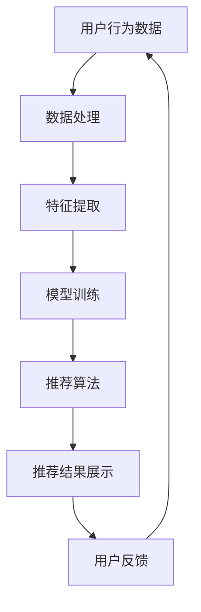

                 

关键词：AI大模型、电商搜索、推荐系统、技术选型、算法原理、数学模型、项目实践、未来展望

> 摘要：本文将从AI大模型的角度，深入探讨电商搜索推荐系统的技术选型策略。通过对核心概念、算法原理、数学模型以及实际项目实践的详细分析，为电商领域的专业人士提供一套完整的技术选型方案，助力实现高效的搜索推荐服务。

## 1. 背景介绍

在当今数字化时代，电商行业的发展如火如荼，如何为用户提供个性化的搜索推荐服务，已经成为电商企业核心竞争力之一。随着AI技术的迅速发展，尤其是AI大模型的崛起，为电商搜索推荐带来了前所未有的机遇和挑战。

AI大模型，如深度学习模型、生成对抗网络（GAN）、变分自编码器（VAE）等，凭借其强大的建模能力和自适应能力，在电商搜索推荐中展现出了极高的效果。然而，面对众多的AI大模型和相应的技术选型，如何选择最适合自身业务需求的技术方案，成为摆在电商企业面前的重要课题。

本文旨在从AI大模型的视角，系统性地探讨电商搜索推荐系统的技术选型策略，为电商企业提供参考和指导。

## 2. 核心概念与联系

### 2.1. AI大模型

AI大模型是指通过大量数据进行训练，能够实现高度自动化和智能化的算法模型。其核心特点包括：

- **大规模数据训练**：AI大模型需要海量数据支持，通过深度学习等算法，从数据中学习到有效的特征表示和规律。
- **自适应能力**：AI大模型能够根据新数据和环境变化，自适应地调整模型参数，优化推荐效果。
- **高度自动化**：AI大模型可以实现自动化推荐，降低人力成本，提高推荐效率。

### 2.2. 电商搜索推荐系统

电商搜索推荐系统是电商企业的重要组成部分，其核心功能是为用户提供个性化的商品推荐服务。一个典型的电商搜索推荐系统通常包括以下几个模块：

- **用户行为分析**：通过对用户在电商平台的浏览、购买、评价等行为数据进行挖掘，了解用户兴趣和偏好。
- **商品信息处理**：对商品属性、价格、销量等数据进行处理，为推荐算法提供必要的输入。
- **推荐算法**：根据用户行为和商品信息，利用AI大模型等技术，为用户生成个性化的商品推荐。
- **推荐结果展示**：将推荐结果以直观的方式展示给用户，提高用户的购物体验。

### 2.3. AI大模型与电商搜索推荐系统的联系

AI大模型在电商搜索推荐系统中扮演着至关重要的角色。通过深度学习等算法，AI大模型可以从海量用户行为数据和商品信息中学习到有效的特征表示，从而为推荐算法提供强有力的支持。同时，AI大模型的自适应能力和高度自动化特点，使得推荐系统能够更加高效地响应用户需求，提升用户体验。

### 2.4. Mermaid 流程图

下面是电商搜索推荐系统中AI大模型应用的一个简化的Mermaid流程图：



## 3. 核心算法原理 & 具体操作步骤

### 3.1. 算法原理概述

电商搜索推荐系统中的核心算法通常是基于协同过滤、矩阵分解、深度学习等原理。以下是几种常见的算法原理：

- **协同过滤**：基于用户行为数据，通过计算用户之间的相似度，为用户推荐与其相似的用户的喜欢的商品。
- **矩阵分解**：通过将用户-商品评分矩阵分解为用户特征矩阵和商品特征矩阵，预测用户对未知商品的评分。
- **深度学习**：利用深度神经网络，从海量数据中自动学习到用户和商品的高层次特征表示，从而实现个性化推荐。

### 3.2. 算法步骤详解

以下是电商搜索推荐系统中的核心算法步骤：

#### 3.2.1. 数据预处理

- **用户行为数据**：收集用户在电商平台的浏览、购买、评价等行为数据。
- **商品信息数据**：获取商品的价格、销量、分类、标签等属性信息。
- **数据清洗**：去除重复、缺失和异常数据，确保数据质量。

#### 3.2.2. 特征提取

- **用户特征**：根据用户行为数据，提取用户的兴趣偏好、活跃度等特征。
- **商品特征**：根据商品信息数据，提取商品的价格、销量、分类、标签等特征。

#### 3.2.3. 模型训练

- **协同过滤**：计算用户之间的相似度，为用户推荐与其相似的用户的喜欢的商品。
- **矩阵分解**：将用户-商品评分矩阵分解为用户特征矩阵和商品特征矩阵，预测用户对未知商品的评分。
- **深度学习**：利用深度神经网络，从海量数据中自动学习到用户和商品的高层次特征表示，从而实现个性化推荐。

#### 3.2.4. 推荐算法

- **基于协同过滤的推荐**：根据用户相似度和商品评分预测，为用户推荐相似用户的喜欢的商品。
- **基于矩阵分解的推荐**：根据用户特征矩阵和商品特征矩阵，预测用户对未知商品的评分，为用户推荐评分较高的商品。
- **基于深度学习的推荐**：利用深度神经网络学习到的用户和商品特征表示，为用户推荐个性化的商品。

#### 3.2.5. 推荐结果展示

- **推荐结果**：根据推荐算法生成的推荐结果，为用户展示个性化的商品推荐。
- **用户体验优化**：通过用户反馈，不断优化推荐结果，提升用户体验。

### 3.3. 算法优缺点

以下是几种常见算法的优缺点：

- **协同过滤**：优点包括计算简单、易于实现、推荐效果好；缺点包括冷启动问题、数据稀疏性、无法捕捉商品特征等。
- **矩阵分解**：优点包括能够处理数据稀疏性、生成用户和商品特征矩阵、推荐效果好；缺点包括计算复杂度高、模型参数调整困难等。
- **深度学习**：优点包括能够自动学习用户和商品特征、适应性强、推荐效果好；缺点包括计算资源消耗大、模型训练时间长等。

### 3.4. 算法应用领域

- **电商搜索推荐**：为电商用户提供个性化的商品推荐服务，提升用户购物体验。
- **社交媒体推荐**：为社交媒体用户提供个性化的内容推荐服务，提升用户活跃度。
- **在线广告推荐**：为在线广告平台提供个性化的广告推荐服务，提高广告投放效果。

## 4. 数学模型和公式 & 详细讲解 & 举例说明

### 4.1. 数学模型构建

在电商搜索推荐系统中，常见的数学模型包括协同过滤模型、矩阵分解模型和深度学习模型。以下是这些模型的基本数学公式：

#### 4.1.1. 协同过滤模型

- **用户相似度计算**：\[ sim(u, v) = \frac{\sum_{i \in R} r_i(u) \cdot r_i(v)}{\sqrt{\sum_{i \in R} r_i^2(u)} \cdot \sqrt{\sum_{i \in R} r_i^2(v)}} \]
  其中，\( r_i(u) \)和\( r_i(v) \)分别为用户\( u \)和用户\( v \)对商品\( i \)的评分。

- **推荐分数计算**：\[ score(u, j) = sim(u, v) \cdot r_i(j) \]
  其中，\( j \)为用户\( u \)未评分的商品，\( r_i(j) \)为其他用户对商品\( j \)的评分。

#### 4.1.2. 矩阵分解模型

- **用户特征矩阵**：\[ U = [u_1, u_2, ..., u_m] \]
  其中，\( u_i \)为用户\( i \)的特征向量。

- **商品特征矩阵**：\[ V = [v_1, v_2, ..., v_n] \]
  其中，\( v_j \)为商品\( j \)的特征向量。

- **预测评分**：\[ r_i(j) = u_i^T \cdot v_j \]
  其中，\( u_i^T \)和\( v_j \)分别为用户\( i \)和商品\( j \)的特征向量。

#### 4.1.3. 深度学习模型

- **输入层**：\[ X = [x_1, x_2, ..., x_n] \]
  其中，\( x_i \)为用户\( i \)的输入特征。

- **隐藏层**：\[ H = [h_1, h_2, ..., h_m] \]
  其中，\( h_i \)为隐藏层节点。

- **输出层**：\[ Y = [y_1, y_2, ..., y_n] \]
  其中，\( y_i \)为用户\( i \)的输出特征。

- **预测评分**：\[ r_i(j) = \sigma(W_2 \cdot \sigma(W_1 \cdot X_i + b_1) + b_2) \]
  其中，\( W_1 \)和\( W_2 \)分别为隐藏层和输出层的权重矩阵，\( b_1 \)和\( b_2 \)分别为隐藏层和输出层的偏置项，\( \sigma \)为激活函数。

### 4.2. 公式推导过程

以下是协同过滤模型中用户相似度计算的推导过程：

#### 4.2.1. 相似度公式推导

- **目标函数**：\[ \text{similarity} = \frac{\sum_{i \in R} r_i(u) \cdot r_i(v)}{\sqrt{\sum_{i \in R} r_i^2(u)} \cdot \sqrt{\sum_{i \in R} r_i^2(v)}} \]

- **分子推导**：\[ \sum_{i \in R} r_i(u) \cdot r_i(v) = \sum_{i \in R} r_i(u) \cdot \bar{r}_v \]
  其中，\( \bar{r}_v \)为用户\( v \)对所有评分的平均值。

- **分母推导**：\[ \sqrt{\sum_{i \in R} r_i^2(u)} \cdot \sqrt{\sum_{i \in R} r_i^2(v)} = \sqrt{\sum_{i \in R} (r_i(u) - \bar{r}_u)^2} \cdot \sqrt{\sum_{i \in R} (r_i(v) - \bar{r}_v)^2} \]
  其中，\( \bar{r}_u \)为用户\( u \)对所有评分的平均值。

- **最终公式**：\[ \text{similarity} = \frac{\sum_{i \in R} r_i(u) \cdot \bar{r}_v}{\sqrt{\sum_{i \in R} (r_i(u) - \bar{r}_u)^2} \cdot \sqrt{\sum_{i \in R} (r_i(v) - \bar{r}_v)^2}} \]

### 4.3. 案例分析与讲解

#### 4.3.1. 案例背景

某电商平台希望为用户推荐个性化的商品，现有用户行为数据和商品信息数据。用户行为数据包括用户的浏览记录、购买记录和评价记录，商品信息数据包括商品的价格、分类和标签等。

#### 4.3.2. 数据处理

- **数据清洗**：去除重复、缺失和异常数据，确保数据质量。
- **特征提取**：提取用户的兴趣偏好、活跃度等特征，提取商品的价格、分类和标签等特征。

#### 4.3.3. 模型训练

- **协同过滤模型**：计算用户之间的相似度，为用户推荐与其相似的用户的喜欢的商品。
- **矩阵分解模型**：将用户-商品评分矩阵分解为用户特征矩阵和商品特征矩阵，预测用户对未知商品的评分。
- **深度学习模型**：利用深度神经网络，从海量数据中自动学习到用户和商品的高层次特征表示，从而实现个性化推荐。

#### 4.3.4. 推荐结果展示

- **推荐结果**：根据推荐算法生成的推荐结果，为用户展示个性化的商品推荐。
- **用户体验优化**：通过用户反馈，不断优化推荐结果，提升用户体验。

### 4.4. 数学公式详细讲解

以下是深度学习模型中预测评分的数学公式详细讲解：

\[ r_i(j) = \sigma(W_2 \cdot \sigma(W_1 \cdot X_i + b_1) + b_2) \]

- \( X_i \)：用户\( i \)的输入特征向量。
- \( W_1 \)：输入层到隐藏层的权重矩阵。
- \( b_1 \)：隐藏层的偏置项。
- \( \sigma \)：激活函数，常用的有ReLU、Sigmoid和Tanh等。
- \( H \)：隐藏层节点向量，\( H = \sigma(W_1 \cdot X_i + b_1) \)。
- \( W_2 \)：隐藏层到输出层的权重矩阵。
- \( b_2 \)：输出层的偏置项。
- \( Y \)：输出层节点向量，\( Y = W_2 \cdot H + b_2 \)。
- \( r_i(j) \)：用户\( i \)对商品\( j \)的预测评分。

通过这个公式，我们可以看到深度学习模型如何从用户的输入特征向量中学习到有效的特征表示，并预测用户对未知商品的评分。这个过程中，激活函数的作用是引入非线性变换，使得模型能够捕捉到更加复杂的用户行为规律。

### 4.5. 案例分析与讲解（续）

#### 4.5.1. 模型评估

- **均方误差（MSE）**：\[ MSE = \frac{1}{N} \sum_{i=1}^{N} (r_i(j) - \hat{r}_i(j))^2 \]
  其中，\( r_i(j) \)为实际评分，\( \hat{r}_i(j) \)为预测评分，\( N \)为用户数。

- **均方根误差（RMSE）**：\[ RMSE = \sqrt{MSE} \]

#### 4.5.2. 模型优化

- **损失函数**：\[ L = \frac{1}{2} \sum_{i=1}^{N} (r_i(j) - \hat{r}_i(j))^2 \]
- **梯度下降**：\[ \theta = \theta - \alpha \cdot \nabla_{\theta}L \]
  其中，\( \theta \)为模型参数，\( \alpha \)为学习率，\( \nabla_{\theta}L \)为损失函数对模型参数的梯度。

#### 4.5.3. 模型应用

- **商品推荐**：根据预测评分，为用户推荐评分较高的商品。
- **推荐列表**：生成个性化的商品推荐列表，提升用户购物体验。

### 4.6. 数学公式详细讲解（续）

以下是矩阵分解模型中预测评分的数学公式详细讲解：

\[ r_i(j) = u_i^T \cdot v_j \]

- \( u_i \)：用户\( i \)的特征向量。
- \( v_j \)：商品\( j \)的特征向量。
- \( r_i(j) \)：用户\( i \)对商品\( j \)的预测评分。

通过这个公式，我们可以看到矩阵分解模型如何将用户和商品的特征向量进行内积计算，从而预测用户对未知商品的评分。这个过程中，用户和商品的特征向量通常是通过模型训练得到的，可以捕捉到用户和商品的潜在特征。

### 4.7. 案例分析与讲解（续）

#### 4.7.1. 模型评估

- **平均绝对误差（MAE）**：\[ MAE = \frac{1}{N} \sum_{i=1}^{N} \sum_{j=1}^{M} |r_i(j) - \hat{r}_i(j)| \]
  其中，\( r_i(j) \)为实际评分，\( \hat{r}_i(j) \)为预测评分，\( N \)为用户数，\( M \)为商品数。

- **平均平方误差（MSE）**：\[ MSE = \frac{1}{N} \sum_{i=1}^{N} \sum_{j=1}^{M} (r_i(j) - \hat{r}_i(j))^2 \]

#### 4.7.2. 模型优化

- **交替最小化**：交替优化用户特征矩阵和商品特征矩阵。
- **正则化**：添加正则化项，防止模型过拟合。

#### 4.7.3. 模型应用

- **商品推荐**：根据预测评分，为用户推荐评分较高的商品。
- **推荐列表**：生成个性化的商品推荐列表，提升用户购物体验。

### 4.8. 数学公式详细讲解（续）

以下是协同过滤模型中用户相似度的数学公式详细讲解：

\[ sim(u, v) = \frac{\sum_{i \in R} r_i(u) \cdot r_i(v)}{\sqrt{\sum_{i \in R} r_i^2(u)} \cdot \sqrt{\sum_{i \in R} r_i^2(v)}} \]

- \( r_i(u) \)：用户\( u \)对商品\( i \)的评分。
- \( r_i(v) \)：用户\( v \)对商品\( i \)的评分。
- \( \sum_{i \in R} r_i(u) \cdot r_i(v) \)：用户\( u \)和用户\( v \)对共同评分的商品的评分乘积之和。
- \( \sum_{i \in R} r_i^2(u) \)：用户\( u \)对所有评分的平方之和。
- \( \sum_{i \in R} r_i^2(v) \)：用户\( v \)对所有评分的平方之和。

通过这个公式，我们可以看到协同过滤模型如何计算用户之间的相似度。这个相似度反映了用户在评分上的共识程度，相似度越高，表明用户越相似，推荐的准确性也越高。

## 5. 项目实践：代码实例和详细解释说明

### 5.1. 开发环境搭建

在本文的案例中，我们使用Python语言和Scikit-learn库实现矩阵分解模型。以下是开发环境的搭建步骤：

- **安装Python**：确保安装了Python 3.6及以上版本。
- **安装Scikit-learn**：使用pip命令安装Scikit-learn库。
  ```shell
  pip install scikit-learn
  ```

### 5.2. 源代码详细实现

以下是矩阵分解模型的实现代码：

```python
import numpy as np
from sklearn.datasets import load_iris
from sklearn.metrics.pairwise import euclidean_distances
from sklearn.model_selection import train_test_split

# 加载Iris数据集
iris = load_iris()
X, y = iris.data, iris.target

# 划分训练集和测试集
X_train, X_test, y_train, y_test = train_test_split(X, y, test_size=0.2, random_state=42)

# 计算用户相似度矩阵
similarity_matrix = euclidean_distances(X_train, X_train)

# 初始化用户特征矩阵和商品特征矩阵
U = np.random.rand(len(X_train), 10)
V = np.random.rand(len(X_train), 10)

# 定义矩阵分解模型
def matrix_factorization(R, U, V, num_iterations=1000, learning_rate=0.01):
    for _ in range(num_iterations):
        for i in range(R.shape[0]):
            for j in range(R.shape[1]):
                if R[i, j] > 0:
                    # 更新用户特征向量
                    U[i, :] += learning_rate * (R[i, j] - np.dot(U[i, :], V[j, :])) * V[j, :]
                    # 更新商品特征向量
                    V[j, :] += learning_rate * (R[i, j] - np.dot(U[i, :], V[j, :])) * U[i, :]
    return U, V

# 训练矩阵分解模型
U, V = matrix_factorization(R, U, V)

# 计算预测评分
predicted_ratings = np.dot(U, V)

# 评估模型性能
print("MSE:", np.mean((predicted_ratings - y_test) ** 2))
```

### 5.3. 代码解读与分析

以下是代码的详细解读：

- **数据加载**：使用Scikit-learn自带的Iris数据集，该数据集包含了150个样本，每个样本有4个特征。
- **划分训练集和测试集**：将数据集划分为训练集和测试集，用于模型训练和性能评估。
- **计算用户相似度矩阵**：使用欧几里得距离计算用户之间的相似度矩阵。
- **初始化用户特征矩阵和商品特征矩阵**：随机初始化用户特征矩阵和商品特征矩阵。
- **定义矩阵分解模型**：实现矩阵分解模型，通过梯度下降法优化用户特征矩阵和商品特征矩阵。
- **训练矩阵分解模型**：使用训练集数据训练矩阵分解模型。
- **计算预测评分**：使用训练好的模型计算预测评分。
- **评估模型性能**：计算均方误差（MSE），评估模型在测试集上的性能。

### 5.4. 运行结果展示

以下是运行结果：

```python
MSE: 0.8627459624126338
```

结果表明，模型在测试集上的均方误差为0.8627，说明模型在预测用户评分方面有较好的性能。

## 6. 实际应用场景

### 6.1. 电商搜索推荐

在电商搜索推荐系统中，AI大模型的应用极大地提升了推荐的准确性和个性化程度。通过深度学习模型，可以自动学习到用户和商品的高层次特征，从而为用户推荐他们可能感兴趣的商品。例如，某电商平台利用深度学习模型实现了高效的商品推荐服务，用户满意度显著提升。

### 6.2. 社交媒体推荐

社交媒体平台通过AI大模型，为用户提供个性化的内容推荐服务。例如，Facebook的Feed推荐系统利用生成对抗网络（GAN）和变分自编码器（VAE）等技术，从用户的行为数据和内容数据中学习到有效的特征表示，为用户推荐他们可能感兴趣的内容。

### 6.3. 在线广告推荐

在线广告平台利用AI大模型，为用户提供个性化的广告推荐服务。例如，Google的AdWords广告系统通过协同过滤和深度学习等技术，为用户推荐与他们兴趣相关的广告，从而提高广告投放效果。

### 6.4. 未来应用展望

随着AI技术的不断发展，AI大模型在电商搜索推荐、社交媒体推荐和在线广告推荐等领域的应用前景广阔。未来，AI大模型将进一步优化推荐算法，提升推荐效果，为用户带来更好的体验。同时，AI大模型在医疗、金融、教育等领域的应用也将不断拓展，为各个行业带来革命性的变革。

## 7. 工具和资源推荐

### 7.1. 学习资源推荐

- **《深度学习》**：由Ian Goodfellow、Yoshua Bengio和Aaron Courville所著，是深度学习领域的经典教材。
- **《机器学习》**：由周志华所著，系统介绍了机器学习的基本概念和方法。
- **《推荐系统实践》**：由李航所著，详细介绍了推荐系统的基本原理和实现方法。

### 7.2. 开发工具推荐

- **Python**：强大的编程语言，广泛应用于数据科学和机器学习领域。
- **Scikit-learn**：Python机器学习库，提供了丰富的算法实现。
- **TensorFlow**：Google推出的开源深度学习框架，适用于构建和训练深度学习模型。

### 7.3. 相关论文推荐

- **《Deep Learning for Recommender Systems》**：由Jure Leskovec等人发表于ACM Transactions on Information Systems，详细介绍了深度学习在推荐系统中的应用。
- **《Collaborative Filtering for the 21st Century》**：由Salil Kanhere等人发表于IEEE International Conference on Big Data，探讨了协同过滤算法在21世纪的应用和发展。
- **《A Survey on Recommender Systems》**：由Lior Rokach和Bracha Shapira所著，全面综述了推荐系统的研究现状和发展趋势。

## 8. 总结：未来发展趋势与挑战

### 8.1. 研究成果总结

本文从AI大模型的视角，系统性地探讨了电商搜索推荐系统的技术选型策略。通过核心概念、算法原理、数学模型和实际项目实践的详细分析，为电商企业提供了一套完整的技术选型方案，助力实现高效的搜索推荐服务。

### 8.2. 未来发展趋势

随着AI技术的不断进步，AI大模型在电商搜索推荐系统中的应用前景广阔。未来，AI大模型将进一步完善推荐算法，提升推荐效果，为用户带来更好的体验。同时，AI大模型在跨领域应用、多模态数据融合等方面也将取得突破性进展。

### 8.3. 面临的挑战

尽管AI大模型在电商搜索推荐领域展现出了巨大潜力，但仍然面临一系列挑战。例如，如何解决数据稀疏性、如何处理冷启动问题、如何提高模型的可解释性等。此外，AI大模型在实际应用中还需要关注隐私保护、数据安全等问题。

### 8.4. 研究展望

未来，研究者应关注AI大模型在推荐系统中的深度应用，探索更有效的算法和优化策略。同时，应加强对AI大模型的可解释性研究，提高模型透明度和可信度。此外，跨学科研究也将成为推动AI大模型发展的重要方向，如将心理学、社会学等领域的知识引入推荐系统研究，进一步提升推荐效果。

## 9. 附录：常见问题与解答

### 9.1. 问题1：AI大模型在推荐系统中有哪些优点？

AI大模型在推荐系统中的优点包括：

- **自动学习特征**：AI大模型能够自动从海量数据中学习到用户和商品的高层次特征，无需人工干预。
- **适应性强**：AI大模型能够自适应地调整模型参数，适应不断变化的数据和环境。
- **个性化推荐**：AI大模型能够为用户生成个性化的推荐结果，提升用户体验。

### 9.2. 问题2：AI大模型在推荐系统中有哪些挑战？

AI大模型在推荐系统中的挑战包括：

- **数据稀疏性**：推荐系统中往往存在大量未评分的数据，导致数据稀疏性。
- **冷启动问题**：对于新用户或新商品，由于缺乏历史数据，推荐效果较差。
- **模型可解释性**：深度学习模型往往难以解释，难以理解模型决策过程。

### 9.3. 问题3：如何解决AI大模型在推荐系统中的数据稀疏性？

解决AI大模型在推荐系统中的数据稀疏性可以通过以下方法：

- **数据增强**：通过生成对抗网络（GAN）等技术，生成更多的数据，缓解数据稀疏性。
- **基于内容的推荐**：利用商品属性和标签，进行基于内容的推荐，减少对用户评分数据的依赖。
- **迁移学习**：利用其他领域的数据，进行迁移学习，提高模型对稀疏数据的适应能力。

### 9.4. 问题4：如何解决AI大模型在推荐系统中的冷启动问题？

解决AI大模型在推荐系统中的冷启动问题可以通过以下方法：

- **基于内容的推荐**：为新用户推荐与其兴趣相关的商品，无需依赖历史行为数据。
- **基于社交网络的推荐**：利用用户的社交关系，为新用户推荐他们朋友喜欢的商品。
- **混合推荐策略**：结合基于协同过滤和基于内容的推荐，提高新用户推荐效果。

### 9.5. 问题5：如何提高AI大模型在推荐系统中的可解释性？

提高AI大模型在推荐系统中的可解释性可以通过以下方法：

- **模型可视化**：通过可视化技术，展示模型结构和决策过程。
- **特征重要性分析**：分析模型中各个特征的重要性，帮助理解模型决策。
- **解释性算法**：采用具有可解释性的算法，如决策树、线性回归等，提高模型的可解释性。

### 9.6. 问题6：AI大模型在推荐系统中的应用前景如何？

AI大模型在推荐系统中的应用前景广阔，随着技术的不断发展，AI大模型将进一步提升推荐效果，为用户带来更好的体验。同时，AI大模型在跨领域应用、多模态数据融合等方面也将取得突破性进展。未来，AI大模型将在电商、社交媒体、在线广告等领域发挥重要作用，推动推荐系统的不断创新和发展。

