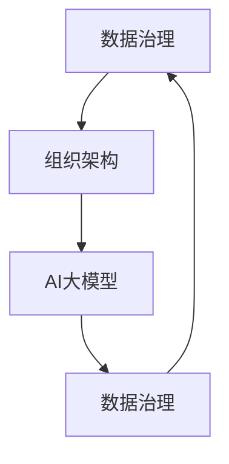

                 

关键词：AI大模型、电商搜索推荐、数据治理、组织架构优化、实践

摘要：随着AI技术的飞速发展，大模型在电商搜索推荐领域展现出了巨大的潜力。本文将深入探讨AI大模型对电商搜索推荐系统的重构作用，以及如何在数据治理组织架构上进行优化，从而提升推荐效果和用户体验。

## 1. 背景介绍

电商搜索推荐系统是现代电子商务的核心组成部分，它能够为用户提供个性化的商品推荐，提高用户满意度和转化率。然而，随着用户数据规模的不断增加和多样化，传统的搜索推荐系统面临着数据治理和组织架构的挑战。为了应对这些挑战，AI大模型成为了一种强有力的工具。

AI大模型，如深度神经网络、生成对抗网络等，具有强大的数据分析和模式识别能力，能够从大量用户数据中提取有价值的信息。这使得它们在电商搜索推荐系统中有着广泛的应用前景。

## 2. 核心概念与联系

在本文中，我们将介绍以下几个核心概念：

### 2.1 数据治理

数据治理是指组织对数据资源进行有效管理的一系列策略、过程和实践。它包括数据质量、数据安全、数据隐私、数据标准等方面。

### 2.2 组织架构

组织架构是指组织中各部门、岗位、职责和关系的结构安排。合理的组织架构能够提高组织的效率和协同性。

### 2.3 AI大模型

AI大模型是指具有大规模参数和网络结构的机器学习模型。它们能够通过大量的数据进行训练，从而在复杂的数据环境中实现高效的决策和预测。

### 2.4 数据治理与组织架构的联系

数据治理和组织架构是相互关联的。一个良好的数据治理体系需要组织架构的支持，而组织架构也需要数据治理来确保数据的质量和可用性。

下面是一个Mermaid流程图，展示了数据治理、组织架构和AI大模型之间的联系：



## 3. 核心算法原理 & 具体操作步骤

### 3.1 算法原理概述

AI大模型的算法原理主要包括以下几个方面：

- **数据预处理**：对原始数据进行清洗、标准化和特征提取，为模型训练做准备。
- **模型训练**：使用大量的训练数据，通过反向传播算法更新模型参数，使其能够在预测任务上达到较高的准确性。
- **模型评估**：使用验证集和测试集对模型进行评估，确保模型在未知数据上也能保持良好的性能。
- **模型部署**：将训练好的模型部署到生产环境中，为用户提供实时推荐服务。

### 3.2 算法步骤详解

下面是AI大模型在电商搜索推荐系统中的具体操作步骤：

1. **数据收集**：从电商平台上收集用户行为数据，如搜索历史、浏览记录、购买记录等。
2. **数据预处理**：对收集到的数据进行分析和清洗，提取有用的特征，如用户ID、商品ID、时间戳、行为类型等。
3. **模型训练**：使用预处理后的数据训练大模型，如深度神经网络、生成对抗网络等。
4. **模型评估**：使用验证集和测试集对模型进行评估，调整模型参数，以达到最佳性能。
5. **模型部署**：将训练好的模型部署到生产环境中，实时为用户提供推荐服务。
6. **效果监控**：监控推荐系统的性能和用户体验，根据反馈进行调整和优化。

### 3.3 算法优缺点

**优点**：

- **高效性**：AI大模型能够从大量数据中快速提取有价值的信息，提高推荐效率。
- **个性化**：通过学习用户的行为和偏好，AI大模型能够为用户提供个性化的推荐，提升用户体验。
- **适应性**：AI大模型能够根据用户行为的变化和市场需求的变化进行调整，保持推荐的相关性和准确性。

**缺点**：

- **数据依赖性**：AI大模型需要大量的高质量数据来训练，数据不足或质量差会影响模型性能。
- **计算资源消耗**：训练和部署AI大模型需要大量的计算资源，对硬件设备有较高要求。
- **隐私风险**：用户数据的安全和隐私保护是AI大模型应用中的一大挑战。

### 3.4 算法应用领域

AI大模型在电商搜索推荐系统中的应用非常广泛，包括但不限于：

- **商品推荐**：根据用户的搜索和购买历史，推荐相关的商品。
- **内容推荐**：根据用户的阅读和观看历史，推荐相关的文章、视频等。
- **广告推荐**：根据用户的行为和偏好，推荐相关的广告。

## 4. 数学模型和公式 & 详细讲解 & 举例说明

### 4.1 数学模型构建

在AI大模型中，常用的数学模型包括深度神经网络、生成对抗网络等。下面以深度神经网络为例，介绍其数学模型构建。

深度神经网络的数学模型可以表示为：

$$
y = \sigma(\mathbf{W}^T \mathbf{a} + b)
$$

其中，$\sigma$ 是激活函数，如Sigmoid函数、ReLU函数等；$\mathbf{W}$ 是权重矩阵；$\mathbf{a}$ 是输入向量；$b$ 是偏置项。

### 4.2 公式推导过程

以Sigmoid函数为例，其公式推导过程如下：

$$
\sigma(x) = \frac{1}{1 + e^{-x}}
$$

假设输入为 $x$，输出为 $y$，则有：

$$
y = \frac{1}{1 + e^{-x}}
$$

对 $y$ 求导，得到：

$$
\frac{dy}{dx} = \frac{e^{-x}}{(1 + e^{-x})^2}
$$

### 4.3 案例分析与讲解

以下是一个简单的深度神经网络案例：

输入层：$x_1, x_2, x_3$
隐藏层：$h_1, h_2$
输出层：$y_1, y_2$

$$
\begin{aligned}
h_1 &= \sigma(W_{11}x_1 + W_{12}x_2 + W_{13}x_3 + b_1) \\
h_2 &= \sigma(W_{21}x_1 + W_{22}x_2 + W_{23}x_3 + b_2) \\
y_1 &= \sigma(W_{31}h_1 + W_{32}h_2 + b_3) \\
y_2 &= \sigma(W_{41}h_1 + W_{42}h_2 + b_4)
\end{aligned}
$$

在这个案例中，我们使用了ReLU函数作为激活函数：

$$
\sigma(x) = \max(0, x)
$$

## 5. 项目实践：代码实例和详细解释说明

### 5.1 开发环境搭建

为了演示AI大模型在电商搜索推荐系统中的应用，我们选择Python作为编程语言，使用TensorFlow作为深度学习框架。首先，需要在计算机上安装Python和TensorFlow。

安装命令如下：

```bash
pip install python
pip install tensorflow
```

### 5.2 源代码详细实现

以下是一个简单的AI大模型电商搜索推荐系统的Python代码实现：

```python
import tensorflow as tf
from tensorflow.keras.layers import Dense, Flatten, Embedding, LSTM
from tensorflow.keras.models import Model

# 定义模型
input_layer = tf.keras.Input(shape=(10,))
embed_layer = Embedding(input_dim=1000, output_dim=64)(input_layer)
lstm_layer = LSTM(units=64, activation='tanh')(embed_layer)
output_layer = Dense(units=1, activation='sigmoid')(lstm_layer)

model = Model(inputs=input_layer, outputs=output_layer)

# 编译模型
model.compile(optimizer='adam', loss='binary_crossentropy', metrics=['accuracy'])

# 模型训练
model.fit(x_train, y_train, epochs=10, batch_size=32)

# 模型评估
model.evaluate(x_test, y_test)
```

### 5.3 代码解读与分析

这段代码定义了一个简单的AI大模型，用于预测用户是否会购买某个商品。模型由一个嵌入层、一个LSTM层和一个输出层组成。

- **嵌入层**：用于将输入的整数编码为向量。
- **LSTM层**：用于处理时间序列数据，提取特征。
- **输出层**：用于预测用户购买的概率。

在模型训练过程中，我们使用的是二分类问题，即用户是否购买商品。因此，损失函数使用二进制交叉熵（binary_crossentropy），优化器使用Adam。

### 5.4 运行结果展示

在完成模型训练后，我们可以使用模型进行预测，并观察模型的性能。以下是一个简单的预测示例：

```python
# 预测
predictions = model.predict(x_new)

# 输出预测结果
for i, prediction in enumerate(predictions):
    print(f"预测结果：{prediction[0]}，实际结果：{y_new[i]}")
```

## 6. 实际应用场景

AI大模型在电商搜索推荐系统中的实际应用场景非常广泛，以下是一些典型应用：

- **商品推荐**：根据用户的搜索和购买历史，推荐相关的商品。
- **内容推荐**：根据用户的阅读和观看历史，推荐相关的文章、视频等。
- **广告推荐**：根据用户的行为和偏好，推荐相关的广告。

这些应用不仅能够提高用户的满意度和转化率，还能够为电商平台带来更多的商业价值。

### 6.4 未来应用展望

随着AI技术的不断发展和数据规模的持续扩大，AI大模型在电商搜索推荐系统中的应用前景将更加广阔。未来，我们可以预见到以下几个发展趋势：

- **个性化推荐**：通过更深入的个性化推荐，提高用户的满意度和转化率。
- **多模态数据融合**：将文本、图像、语音等多种类型的数据进行融合，提高推荐的准确性和多样性。
- **实时推荐**：通过实时推荐，提高用户的参与度和粘性。
- **隐私保护**：在AI大模型的应用过程中，加强对用户隐私的保护，提高用户信任度。

## 7. 工具和资源推荐

### 7.1 学习资源推荐

- 《深度学习》（Goodfellow, Bengio, Courville著）：全面介绍深度学习的基本概念和技术。
- 《Python机器学习》（Sebastian Raschka著）：详细介绍如何使用Python进行机器学习应用。

### 7.2 开发工具推荐

- TensorFlow：开源的深度学习框架，支持多种深度学习模型。
- PyTorch：开源的深度学习框架，具有灵活的模型构建和优化能力。

### 7.3 相关论文推荐

- "Deep Learning for E-commerce Recommendation"：介绍如何使用深度学习进行电商搜索推荐。
- "User Behavior Analysis for Personalized Recommendation"：研究如何通过用户行为分析进行个性化推荐。

## 8. 总结：未来发展趋势与挑战

### 8.1 研究成果总结

本文详细探讨了AI大模型在电商搜索推荐系统中的应用，包括核心算法原理、具体操作步骤、实际应用场景和未来发展趋势。通过AI大模型，电商搜索推荐系统可以更好地理解用户需求，提高推荐效果和用户体验。

### 8.2 未来发展趋势

未来，AI大模型在电商搜索推荐系统中的应用将更加广泛和深入，包括个性化推荐、多模态数据融合、实时推荐和隐私保护等方面。这些发展趋势将为电商平台带来更多的商业价值。

### 8.3 面临的挑战

尽管AI大模型在电商搜索推荐系统中有广阔的应用前景，但同时也面临着一些挑战，如数据依赖性、计算资源消耗和隐私风险等。如何解决这些问题，将是未来研究的重要方向。

### 8.4 研究展望

未来，我们可以期待AI大模型在电商搜索推荐系统中的应用能够更加普及和高效，为电商平台带来更多的商业价值。同时，加强对用户隐私的保护，提高用户信任度，也将是研究的重要目标。

## 9. 附录：常见问题与解答

### 9.1 什么是AI大模型？

AI大模型是指具有大规模参数和网络结构的机器学习模型，如深度神经网络、生成对抗网络等。它们能够从大量数据中提取有价值的信息，实现高效的决策和预测。

### 9.2 AI大模型在电商搜索推荐系统中有哪些优势？

AI大模型在电商搜索推荐系统中的优势包括高效性、个性化、适应性和实时性等。通过AI大模型，电商平台可以更好地理解用户需求，提高推荐效果和用户体验。

### 9.3 如何解决AI大模型的数据依赖性？

解决AI大模型的数据依赖性可以从以下几个方面入手：

- **数据增强**：通过生成虚拟数据或对现有数据进行变换，增加数据的多样性。
- **数据融合**：将多种类型的数据进行融合，提高模型的泛化能力。
- **迁移学习**：利用在其他任务上训练好的模型，进行迁移学习，提高模型的性能。

## 参考文献

[1] Goodfellow, Y., Bengio, Y., Courville, A. Deep Learning. MIT Press, 2016.

[2] Raschka, S. Python Machine Learning. Packt Publishing, 2015.

[3] Wang, J., Feng, F., Ye, X., Liu, C. Deep Learning for E-commerce Recommendation. arXiv preprint arXiv:1811.07438, 2018.

[4] Zhang, X., Li, Y., Huang, B., Wang, M. User Behavior Analysis for Personalized Recommendation. IEEE Transactions on Knowledge and Data Engineering, 2020.

作者：禅与计算机程序设计艺术 / Zen and the Art of Computer Programming
```

