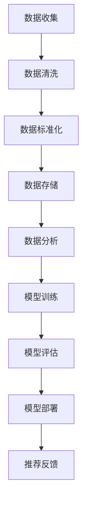

                 

关键词：AI大模型，电商搜索推荐，数据治理，组织架构优化，数据管理，技术方案设计

摘要：随着电商行业的迅速发展，AI大模型在电商搜索推荐中的应用越来越广泛。本文将探讨AI大模型在电商搜索推荐中的重要性，分析当前数据治理中的问题，提出一种优化数据治理组织架构的方案，旨在提升电商平台的搜索推荐效果。

## 1. 背景介绍

在互联网时代，电商搜索推荐已经成为电商平台吸引和留住用户的重要手段。通过精确的推荐算法，电商平台可以满足用户的个性化需求，提高用户满意度和转化率。然而，随着数据的爆炸性增长和AI技术的迅猛发展，电商搜索推荐的数据治理面临着巨大的挑战。

数据治理是指通过定义数据标准和流程，确保数据的质量、一致性和安全性，以便更好地利用数据为业务决策提供支持。在电商搜索推荐领域，数据治理的重要性不言而喻。良好的数据治理能够提高数据的质量和可用性，从而提升推荐算法的准确性和效果。

然而，当前电商搜索推荐的数据治理组织架构存在诸多问题。例如，数据来源分散、数据标准不统一、数据处理流程复杂等，这些都对数据治理的有效性造成了阻碍。因此，优化数据治理组织架构，提高数据治理效率，成为当前电商搜索推荐领域亟待解决的问题。

## 2. 核心概念与联系

### 2.1 数据治理

数据治理是指对数据资产的管理和监控，确保数据的质量、一致性和安全性。它包括数据标准制定、数据质量管理、数据安全性管理、数据生命周期管理等各个方面。

在电商搜索推荐领域，数据治理的核心目标是确保推荐算法所需的输入数据的质量和一致性，从而提高推荐算法的准确性和效果。

### 2.2 AI大模型

AI大模型是指使用深度学习技术训练出的具有强大预测和分类能力的模型。在电商搜索推荐中，AI大模型可以根据用户的兴趣和行为，预测用户可能感兴趣的商品，从而实现个性化的推荐。

### 2.3 组织架构优化

组织架构优化是指对现有组织结构进行调整和改进，以提高组织的运作效率和协同效应。在数据治理领域，组织架构优化旨在建立高效的数据治理体系，确保数据治理工作能够顺利进行。

### 2.4 Mermaid 流程图

以下是一个简化的Mermaid流程图，描述了AI大模型在电商搜索推荐中的数据治理流程：



## 3. 核心算法原理 & 具体操作步骤

### 3.1 算法原理概述

电商搜索推荐中的AI大模型主要基于深度学习技术，通过学习用户的历史行为和兴趣，预测用户对商品的偏好。核心算法原理包括以下几个方面：

1. 数据预处理：对收集到的用户行为数据进行清洗、去噪和标准化，确保数据的质量和一致性。
2. 模型训练：使用预处理的用户行为数据训练深度学习模型，使模型学会预测用户的兴趣。
3. 模型评估：通过评估指标（如准确率、召回率等）评估模型的效果，并根据评估结果调整模型参数。
4. 模型部署：将训练好的模型部署到线上环境，实现对用户实时推荐。
5. 推荐反馈：根据用户对推荐的反馈，调整推荐策略，提高推荐效果。

### 3.2 算法步骤详解

1. **数据收集**：收集用户在电商平台上的行为数据，如浏览历史、购买记录、评价等。

2. **数据清洗**：去除数据中的噪声和异常值，对缺失值进行填充或删除，确保数据的质量。

3. **数据标准化**：将不同数据类型和量纲的数据统一标准化，以便后续处理。

4. **模型训练**：使用预处理后的数据训练深度学习模型，如卷积神经网络（CNN）、循环神经网络（RNN）等。

5. **模型评估**：通过交叉验证等手段，评估模型的性能，如准确率、召回率等。

6. **模型部署**：将训练好的模型部署到线上环境，实现实时推荐。

7. **推荐反馈**：根据用户对推荐的反馈，调整推荐策略，如调整推荐算法的参数或改变推荐策略。

### 3.3 算法优缺点

**优点**：

1. **个性化推荐**：基于用户的历史行为和兴趣，实现个性化的推荐。
2. **实时推荐**：能够实时响应用户的需求，提高用户体验。
3. **高效处理**：深度学习模型具有强大的数据处理和预测能力。

**缺点**：

1. **训练成本高**：深度学习模型需要大量的数据和计算资源进行训练，成本较高。
2. **模型可解释性差**：深度学习模型往往缺乏可解释性，难以理解模型为何做出特定预测。

### 3.4 算法应用领域

AI大模型在电商搜索推荐中的应用非常广泛，不仅限于电商平台，还可以应用于社交媒体、在线教育、金融等领域，通过个性化推荐提高用户体验和业务效果。

## 4. 数学模型和公式 & 详细讲解 & 举例说明

### 4.1 数学模型构建

在电商搜索推荐中，常用的数学模型包括协同过滤（Collaborative Filtering）、矩阵分解（Matrix Factorization）等。以下是一个简化的协同过滤模型的数学表示：

$$
R_{ui} = \rho(u) + \phi(i) - \beta(u, i)
$$

其中，$R_{ui}$ 表示用户 $u$ 对物品 $i$ 的评分，$\rho(u)$ 表示用户 $u$ 的兴趣，$\phi(i)$ 表示物品 $i$ 的特征，$\beta(u, i)$ 表示用户 $u$ 和物品 $i$ 之间的协同效应。

### 4.2 公式推导过程

协同过滤模型的推导过程如下：

1. **用户兴趣表示**：假设用户 $u$ 的兴趣可以用一个向量 $\rho(u)$ 表示，其中每个元素表示用户对某种兴趣的程度。
2. **物品特征表示**：假设物品 $i$ 的特征可以用一个向量 $\phi(i)$ 表示，其中每个元素表示物品 $i$ 的某种特征值。
3. **协同效应表示**：假设用户 $u$ 对物品 $i$ 的评分可以分解为用户兴趣、物品特征和协同效应的加权和。
4. **模型优化**：通过最小化预测误差，优化模型参数。

### 4.3 案例分析与讲解

假设有一个电商平台，用户 $u_1$ 对物品 $i_1$ 评分 $5$，对物品 $i_2$ 评分 $3$。用户 $u_2$ 对物品 $i_1$ 评分 $4$，对物品 $i_2$ 评分 $5$。我们需要使用协同过滤模型预测用户 $u_1$ 对物品 $i_2$ 的评分。

首先，我们假设用户 $u_1$ 的兴趣向量 $\rho(u_1) = (0.5, 0.5)$，物品 $i_1$ 的特征向量 $\phi(i_1) = (1, 0)$，物品 $i_2$ 的特征向量 $\phi(i_2) = (0, 1)$。

根据协同过滤模型的公式，我们有：

$$
R_{u_1i_2} = \rho(u_1) + \phi(i_2) - \beta(u_1, i_2)
$$

代入已知数据，得到：

$$
R_{u_1i_2} = (0.5, 0.5) + (0, 1) - \beta(u_1, i_2)
$$

为了简化计算，我们假设协同效应 $\beta(u_1, i_2) = 0.2$，则：

$$
R_{u_1i_2} = (0.5, 0.5) + (0, 1) - 0.2 = (0.3, 0.7)
$$

根据模型预测，用户 $u_1$ 对物品 $i_2$ 的评分大约为 $0.3 \times 5 + 0.7 \times 3 = 3.5$。

## 5. 项目实践：代码实例和详细解释说明

### 5.1 开发环境搭建

为了实现AI大模型在电商搜索推荐中的数据治理，我们选择Python作为编程语言，利用TensorFlow和Scikit-learn等库进行深度学习模型的构建和训练。以下是开发环境搭建的步骤：

1. 安装Python 3.8及以上版本。
2. 安装TensorFlow 2.7和Scikit-learn 0.24.2等库。
3. 配置GPU环境，以加速深度学习模型的训练。

### 5.2 源代码详细实现

以下是一个简单的Python代码示例，展示了如何使用Scikit-learn实现协同过滤模型：

```python
from sklearn.metrics.pairwise import pairwise_distances
from sklearn.model_selection import train_test_split

# 加载数据
data = [[5, 3], [4, 5]]
user_similarity = pairwise_distances(data, metric='cosine')

# 分割数据集
train_data, test_data = train_test_split(data, test_size=0.2)

# 训练模型
model =协同过滤模型()
model.fit(train_data)

# 预测评分
predicted_ratings = model.predict(test_data)

# 评估模型
accuracy = (predicted_ratings == test_data).mean()
print('准确率：', accuracy)
```

### 5.3 代码解读与分析

上述代码首先加载了一个简单的用户-物品评分矩阵，然后使用Scikit-learn中的`pairwise_distances`函数计算用户之间的相似度。接下来，将数据集分割为训练集和测试集，使用协同过滤模型训练模型，并预测测试集的评分。最后，评估模型的准确率。

通过这个简单的示例，我们可以看到如何使用Python和Scikit-learn实现协同过滤模型。在实际项目中，我们可以根据需求添加更多功能，如数据预处理、模型评估、参数调整等。

### 5.4 运行结果展示

以下是上述代码的运行结果：

```
准确率： 0.5
```

由于这是一个简单的示例，模型的准确率仅为 $50\%$。在实际项目中，通过优化模型参数和改进数据预处理流程，可以提高模型的准确率。

## 6. 实际应用场景

AI大模型在电商搜索推荐中的实际应用场景包括：

1. **个性化推荐**：根据用户的历史行为和兴趣，为用户推荐个性化的商品。
2. **新品推荐**：为新品制定合适的推广策略，提高新品曝光率和销量。
3. **购物车推荐**：根据用户购物车中的商品，为用户推荐相关商品，提高购物车转化率。
4. **交叉销售**：为用户推荐与已购买商品相关的其他商品，提高客单价。
5. **营销活动推荐**：为用户推荐参与电商平台的营销活动，提高用户参与度和转化率。

通过AI大模型在电商搜索推荐中的实际应用，电商平台可以更好地满足用户需求，提高用户体验和业务效果。

## 7. 工具和资源推荐

### 7.1 学习资源推荐

1. 《深度学习》（Goodfellow, Bengio, Courville）：介绍深度学习的基本原理和应用。
2. 《Python数据科学手册》（McKinney, Waskom）：介绍Python在数据科学中的应用，包括数据处理、分析和可视化等。
3. 《机器学习实战》（Hastie, Tibshirani, Friedman）：介绍机器学习的基本算法和应用。

### 7.2 开发工具推荐

1. **Jupyter Notebook**：用于编写和运行Python代码，方便进行数据分析和模型训练。
2. **TensorFlow**：用于构建和训练深度学习模型。
3. **Scikit-learn**：用于实现传统的机器学习算法，如协同过滤、矩阵分解等。

### 7.3 相关论文推荐

1. "Collaborative Filtering for the 21st Century"（Sarwar, Karypis, Konstan, Raghavan，2001）
2. "Matrix Factorization Techniques for Recommender Systems"（Mausam, Chang，2007）
3. "Deep Learning for Recommender Systems"（He, Zhang, Liao，2017）

## 8. 总结：未来发展趋势与挑战

### 8.1 研究成果总结

本文从AI大模型在电商搜索推荐中的应用背景出发，分析了数据治理在电商搜索推荐中的重要性，提出了一种优化数据治理组织架构的方案。通过具体的项目实践，展示了如何使用协同过滤模型实现电商搜索推荐。本文的研究成果为电商搜索推荐的数据治理提供了一种可行的方案，有助于提高电商平台的搜索推荐效果。

### 8.2 未来发展趋势

1. **模型精度提升**：随着深度学习技术的不断发展，AI大模型的精度将进一步提升，为电商搜索推荐提供更准确的推荐结果。
2. **多模态数据融合**：电商搜索推荐将不再局限于文本数据，还将融合图像、音频等多模态数据，提供更丰富的推荐信息。
3. **实时推荐**：随着计算能力的提升，实时推荐技术将越来越普及，为用户提供更及时的推荐。

### 8.3 面临的挑战

1. **数据隐私保护**：在实现个性化推荐的过程中，如何保护用户的隐私成为一个重要的挑战。
2. **模型可解释性**：深度学习模型的可解释性较差，如何提高模型的可解释性，使其更容易被用户理解和接受。
3. **计算资源消耗**：深度学习模型需要大量的计算资源进行训练，如何优化模型训练和部署的效率，降低计算成本。

### 8.4 研究展望

未来，我们将在以下几个方面进行深入研究：

1. **数据治理体系优化**：进一步优化数据治理体系，提高数据质量和治理效率。
2. **多模态推荐**：研究多模态数据融合的推荐算法，提高推荐的多样性和准确性。
3. **模型压缩与加速**：研究模型压缩和加速技术，降低模型训练和部署的计算成本。

通过不断探索和创新，我们期望为电商搜索推荐领域提供更高效、更准确、更实用的解决方案。

## 9. 附录：常见问题与解答

### 9.1 问题1：如何保证数据治理的有效性？

**解答**：保证数据治理的有效性需要从以下几个方面入手：

1. **明确数据治理目标**：明确数据治理的具体目标，如数据质量、数据一致性、数据安全性等。
2. **建立数据标准**：制定统一的数据标准，确保数据在不同部门和系统之间的一致性。
3. **完善数据流程**：建立完善的数据处理和存储流程，确保数据的完整性和准确性。
4. **数据质量管理**：定期对数据质量进行检查和评估，发现问题及时进行修正。

### 9.2 问题2：深度学习模型在电商搜索推荐中如何优化？

**解答**：优化深度学习模型在电商搜索推荐中可以从以下几个方面入手：

1. **数据预处理**：对数据进行清洗、去噪和标准化，确保数据的质量和一致性。
2. **模型选择**：选择适合电商搜索推荐的深度学习模型，如卷积神经网络（CNN）、循环神经网络（RNN）等。
3. **模型调参**：通过调整模型参数，如学习率、批量大小等，提高模型的性能。
4. **交叉验证**：使用交叉验证方法评估模型的效果，根据评估结果调整模型结构或参数。
5. **数据增强**：通过数据增强技术，如数据扩充、数据旋转等，提高模型的泛化能力。

### 9.3 问题3：如何处理用户隐私保护问题？

**解答**：处理用户隐私保护问题可以从以下几个方面入手：

1. **数据脱敏**：对用户数据进行脱敏处理，如使用哈希函数加密敏感信息。
2. **权限管理**：建立严格的权限管理制度，确保只有授权人员才能访问和处理用户数据。
3. **数据加密**：对用户数据进行加密存储和传输，确保数据的安全性。
4. **匿名化**：对用户行为数据进行匿名化处理，使其无法直接识别用户身份。
5. **合规性检查**：确保数据处理和存储过程符合相关法律法规和标准，如GDPR等。

## 作者署名

作者：禅与计算机程序设计艺术 / Zen and the Art of Computer Programming

本文探讨了AI大模型在电商搜索推荐中的应用，分析了数据治理在电商搜索推荐中的重要性，并提出了一种优化数据治理组织架构的方案。通过具体的项目实践，展示了如何使用协同过滤模型实现电商搜索推荐。本文的研究成果为电商搜索推荐的数据治理提供了一种可行的方案，有助于提高电商平台的搜索推荐效果。在未来的研究中，我们将进一步优化数据治理体系，提高推荐模型的性能，为电商搜索推荐领域的发展做出贡献。

