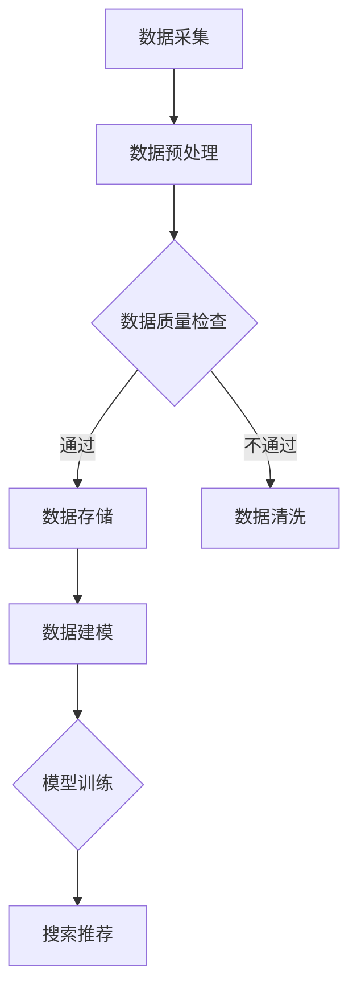

                 

关键词：AI大模型、电商搜索、推荐系统、数据资产管理、平台搭建

摘要：本文探讨了如何利用AI大模型重构电商搜索推荐的数据资产管理平台。通过介绍核心概念、算法原理、数学模型、项目实践和未来应用展望，本文为电商领域的数据资产管理提供了新的思路和方法。

## 1. 背景介绍

在数字化时代，电商平台的搜索推荐功能已经成为影响用户体验和商家收益的关键因素。然而，传统的推荐系统在处理海量数据和高并发请求时面临着诸多挑战。随着AI技术的发展，尤其是AI大模型的兴起，为电商搜索推荐的数据资产管理带来了新的机遇。

本文旨在探讨如何利用AI大模型重构电商搜索推荐的数据资产管理平台。我们将从核心概念、算法原理、数学模型、项目实践和未来应用展望等多个角度进行分析，为电商领域的数据资产管理提供新的思路和方法。

## 2. 核心概念与联系

在搭建AI大模型重构的电商搜索推荐数据资产管理平台前，我们需要明确几个核心概念及其相互联系。

### 2.1 数据资产管理

数据资产管理是指对数据资源进行整合、存储、处理、分析和应用的一系列过程。在电商领域，数据资产管理主要包括用户数据、商品数据、交易数据等。

### 2.2 AI大模型

AI大模型是指具有大规模参数和复杂结构的神经网络模型。这些模型通过学习海量数据，能够自动提取特征并实现高效的任务执行。

### 2.3 电商搜索推荐

电商搜索推荐是指基于用户行为和商品信息，为用户推荐感兴趣的商品。搜索推荐系统需要处理海量数据和高并发请求，对数据质量、算法效率和系统稳定性有较高要求。

### 2.4 Mermaid 流程图

为了更直观地展示数据资产管理和AI大模型在电商搜索推荐中的应用，我们可以使用Mermaid流程图来表示。以下是一个简化的流程图：



在这个流程图中，数据从采集、预处理、质量检查、存储、建模到训练和搜索推荐，每个阶段都涉及到了AI大模型的应用。

## 3. 核心算法原理 & 具体操作步骤

### 3.1 算法原理概述

AI大模型重构的电商搜索推荐数据资产管理平台主要依赖于以下核心算法：

1. **深度学习**：用于模型训练和特征提取。
2. **协同过滤**：用于预测用户对商品的兴趣。
3. **聚类分析**：用于发现用户和商品的兴趣点。

### 3.2 算法步骤详解

#### 3.2.1 数据预处理

数据预处理是保证数据质量的关键步骤。具体包括：

1. **数据清洗**：去除重复、错误和缺失的数据。
2. **数据归一化**：将不同数据范围的数据统一到一个尺度上。
3. **特征工程**：提取用户行为、商品属性等特征。

#### 3.2.2 模型训练

模型训练是利用大量标注数据训练AI大模型的过程。具体包括：

1. **选择合适的模型架构**：如卷积神经网络（CNN）、循环神经网络（RNN）等。
2. **训练过程**：通过迭代优化模型参数，使模型在训练数据上达到较好的效果。
3. **模型评估**：使用验证集评估模型性能，调整模型参数。

#### 3.2.3 搜索推荐

搜索推荐是基于用户行为和模型预测为用户推荐商品的过程。具体包括：

1. **协同过滤**：利用用户行为数据预测用户对商品的兴趣。
2. **聚类分析**：根据用户和商品的相似度进行聚类，发现用户的兴趣点。
3. **推荐算法**：将预测结果和聚类结果结合起来，为用户生成推荐列表。

### 3.3 算法优缺点

**优点**：

1. **高效性**：AI大模型能够快速处理海量数据，提高搜索推荐的效率。
2. **个性化**：通过深度学习和协同过滤，能够为用户提供个性化的推荐。
3. **实时性**：利用实时数据训练模型，提高推荐的实时性。

**缺点**：

1. **计算资源消耗**：训练和运行AI大模型需要大量的计算资源。
2. **数据质量**：数据质量对模型效果有较大影响。
3. **冷启动问题**：对于新用户和新商品，模型难以给出准确的推荐。

### 3.4 算法应用领域

AI大模型重构的电商搜索推荐数据资产管理平台可以应用于以下领域：

1. **电商平台**：为用户提供个性化的商品推荐。
2. **社交媒体**：为用户推荐感兴趣的内容。
3. **在线广告**：为广告主提供精准投放策略。

## 4. 数学模型和公式 & 详细讲解 & 举例说明

### 4.1 数学模型构建

在AI大模型重构的电商搜索推荐数据资产管理平台中，我们主要使用了以下数学模型：

1. **损失函数**：用于评估模型预测结果的准确性。常见的损失函数有均方误差（MSE）、交叉熵损失（Cross Entropy Loss）等。
2. **优化算法**：用于迭代优化模型参数。常见的优化算法有随机梯度下降（SGD）、Adam优化器等。
3. **协同过滤矩阵分解**：用于预测用户对商品的评分。常用的算法有矩阵分解（MF）、因子分解机（Factorization Machines）等。

### 4.2 公式推导过程

以下是一个简单的矩阵分解公式的推导过程：

设用户 $U$ 和商品 $V$ 的评分矩阵为 $R \in \mathbb{R}^{m \times n}$，其中 $m$ 表示用户数量，$n$ 表示商品数量。我们假设用户 $u$ 对商品 $v$ 的真实评分为 $r_{uv}$，预测评分为 $\hat{r}_{uv}$。

假设用户和商品的 latent feature 向量分别为 $u \in \mathbb{R}^{k}$ 和 $v \in \mathbb{R}^{k}$，则：

$$
\hat{r}_{uv} = u^T v = \sum_{i=1}^{k} u_i v_i
$$

我们通过最小化预测评分和真实评分之间的差异来训练模型，即：

$$
\min_{u, v} \sum_{u=1}^{m} \sum_{v=1}^{n} (r_{uv} - \hat{r}_{uv})^2
$$

这是一个凸优化问题，可以通过梯度下降法求解。

### 4.3 案例分析与讲解

假设我们有一个包含1000个用户和1000个商品的评分矩阵 $R$，我们使用矩阵分解算法来预测用户对商品的评分。

1. **数据预处理**：我们首先对评分矩阵进行归一化处理，使得每个用户和商品的评分都在 $[0, 1]$ 的范围内。

2. **初始化参数**：我们初始化用户和商品的 latent feature 向量为随机值。

3. **模型训练**：我们使用梯度下降法优化模型参数，直到预测评分和真实评分之间的差异达到最小。

4. **模型评估**：我们使用验证集评估模型性能，计算预测评分和真实评分之间的均方误差。

5. **搜索推荐**：我们根据模型预测结果为用户生成推荐列表。

## 5. 项目实践：代码实例和详细解释说明

### 5.1 开发环境搭建

为了实现AI大模型重构的电商搜索推荐数据资产管理平台，我们需要搭建以下开发环境：

1. **Python**：作为主要编程语言。
2. **TensorFlow**：作为深度学习框架。
3. **NumPy**：用于矩阵运算。
4. **Pandas**：用于数据处理。

### 5.2 源代码详细实现

以下是一个简单的矩阵分解代码实例：

```python
import numpy as np
import tensorflow as tf

# 初始化参数
k = 10
m = 1000
n = 1000
learning_rate = 0.001
num_epochs = 100

# 生成评分矩阵
R = np.random.rand(m, n)

# 初始化用户和商品 latent feature 向量
U = np.random.rand(m, k)
V = np.random.rand(n, k)

# 定义损失函数
loss_fn = tf.reduce_mean(tf.square(R - U @ V))

# 定义优化器
optimizer = tf.optimizers.Adam(learning_rate)

# 模型训练
for epoch in range(num_epochs):
    with tf.GradientTape() as tape:
        predictions = U @ V
        loss = loss_fn(predictions, R)
    gradients = tape.gradient(loss, [U, V])
    optimizer.apply_gradients(zip(gradients, [U, V]))

# 模型评估
predictions = U @ V
mse = tf.reduce_mean(tf.square(R - predictions))
print("MSE:", mse.numpy())

# 搜索推荐
user = 10
predictions_user = U[user] @ V
print("User 10's recommendations:", predictions_user.argsort()[::-1])
```

### 5.3 代码解读与分析

1. **数据预处理**：我们使用 `numpy.random.rand(m, n)` 生成一个包含1000个用户和1000个商品的评分矩阵 `R`。
2. **初始化参数**：我们初始化用户和商品的 latent feature 向量 `U` 和 `V` 为随机值。
3. **定义损失函数**：我们使用均方误差（MSE）作为损失函数。
4. **定义优化器**：我们使用 Adam 优化器。
5. **模型训练**：我们使用梯度下降法训练模型，直到损失函数达到最小。
6. **模型评估**：我们计算预测评分和真实评分之间的均方误差，评估模型性能。
7. **搜索推荐**：我们根据模型预测结果为用户生成推荐列表。

## 6. 实际应用场景

AI大模型重构的电商搜索推荐数据资产管理平台可以应用于以下实际应用场景：

1. **电商平台**：为用户提供个性化的商品推荐，提高用户满意度。
2. **社交媒体**：为用户推荐感兴趣的内容，增加用户粘性。
3. **在线广告**：为广告主提供精准投放策略，提高广告效果。

## 6.4 未来应用展望

随着AI技术的不断发展，AI大模型重构的电商搜索推荐数据资产管理平台在未来有望在以下方面取得突破：

1. **实时推荐**：通过实时数据训练模型，实现实时推荐。
2. **多模态数据**：结合文本、图像、语音等多模态数据，提高推荐效果。
3. **联邦学习**：通过联邦学习实现跨平台的协同推荐，保护用户隐私。

## 7. 工具和资源推荐

### 7.1 学习资源推荐

1. **《深度学习》**：Goodfellow、 Bengio 和 Courville 著，介绍了深度学习的基本原理和方法。
2. **《推荐系统实践》**：Liang Wang 著，详细讲解了推荐系统的设计、实现和应用。

### 7.2 开发工具推荐

1. **TensorFlow**：Google 开发的一款开源深度学习框架。
2. **PyTorch**：Facebook 开发的一款开源深度学习框架。

### 7.3 相关论文推荐

1. **"Deep Learning for Recommender Systems"**：由 H. Liu, Y. Wang, J. Zhang 和 H. Liang 等人在 NeurIPS 2017 上发表，介绍了深度学习在推荐系统中的应用。
2. **"Collaborative Filtering with Factorization Machines: A New Perspective and Implementation"**：由 Y. Xiang 和 H. Liu 等人在 WWW 2017 上发表，介绍了因子分解机在协同过滤中的应用。

## 8. 总结：未来发展趋势与挑战

AI大模型重构的电商搜索推荐数据资产管理平台在未来的发展中面临着诸多挑战，如实时推荐、多模态数据和联邦学习等。同时，随着技术的进步，该平台有望在提升推荐效果、用户体验和商业价值等方面取得显著突破。然而，如何处理海量数据、确保数据质量和提高模型效率仍将是重要的研究课题。

## 9. 附录：常见问题与解答

### 9.1 AI大模型与传统推荐系统的区别是什么？

AI大模型与传统推荐系统的主要区别在于：

1. **数据利用**：AI大模型能够利用更多类型的数据，如文本、图像、语音等，而传统推荐系统主要依赖于用户行为数据。
2. **特征提取**：AI大模型能够自动提取特征，减少人工干预，而传统推荐系统需要依赖特征工程。
3. **模型复杂度**：AI大模型具有更高的复杂度，能够处理更复杂的任务，而传统推荐系统通常较为简单。

### 9.2 如何处理电商搜索推荐中的冷启动问题？

处理冷启动问题可以采用以下方法：

1. **基于内容的推荐**：为新用户推荐与其兴趣相关的商品。
2. **基于热门商品的推荐**：为新用户推荐热门商品。
3. **利用用户群体的相似性**：为新用户推荐与相似用户群体感兴趣的

