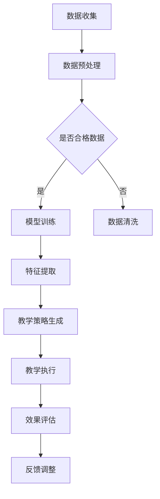

                 

在当今的信息时代，人工智能（AI）已经深刻地改变了我们的生活方式。在教育领域，AI的应用正以前所未有的速度扩展，特别是大模型驱动的个性化教育解决方案。本文将探讨AI大模型在教育中的应用，详细分析其原理、算法、数学模型以及实际案例，旨在为教育工作者和开发者提供有价值的参考。

## 关键词
- AI大模型
- 个性化教育
- 教育技术
- 机器学习
- 深度学习

## 摘要
本文首先介绍了AI大模型在个性化教育中的背景和应用。随后，详细阐述了AI大模型的原理、算法和数学模型，并辅以具体案例进行讲解。最后，本文探讨了AI大模型在教育中的实际应用场景，并对未来的发展趋势和挑战进行了展望。

## 1. 背景介绍

随着互联网的普及和大数据技术的发展，教育行业迎来了前所未有的变革。传统的一刀切教育模式已经无法满足现代教育的需求，个性化教育逐渐成为主流。个性化教育强调根据每个学生的学习特点和需求，提供个性化的教学方案和资源，从而提高教育效果。

AI大模型，特别是基于深度学习的模型，如Transformer、BERT等，已经成为个性化教育的重要工具。这些模型能够处理海量数据，提取复杂的信息，并通过学习生成个性化的教学策略和内容。大模型的兴起，为个性化教育提供了新的技术路径。

### 1.1 个性化教育的需求

在传统教育中，教师需要面对大量学生，难以提供个性化的教学方案。而个性化教育则要求教育系统能够根据每个学生的学习特点和需求，提供最适合的教学内容和方式。这种需求促使了AI大模型在教育中的应用。

### 1.2 AI大模型的崛起

AI大模型的崛起主要得益于计算能力的提升和海量数据的积累。深度学习技术的进步，使得大模型能够处理复杂的数据，提取深层次的信息。此外，大规模的数据集和云计算技术的发展，为AI大模型的训练和应用提供了坚实的基础。

## 2. 核心概念与联系

### 2.1 AI大模型原理

AI大模型，通常指的是具有数亿甚至数十亿参数的深度学习模型。这些模型通过神经网络结构，可以自动从数据中学习特征和模式。其核心原理是基于多层神经元的非线性变换，通过反向传播算法不断调整权重，优化模型的性能。

### 2.2 个性化教育架构

个性化教育的架构通常包括数据收集、模型训练、教学策略生成和效果评估等几个环节。数据收集环节负责收集学生的行为数据、学习记录等；模型训练环节利用AI大模型对数据进行训练，提取个性化特征；教学策略生成环节根据学生的特征生成个性化的教学方案；效果评估环节则用于评估个性化教育的效果，不断优化模型和策略。

### 2.3 Mermaid 流程图

下面是AI大模型驱动的个性化教育解决方案的Mermaid流程图：



## 3. 核心算法原理 & 具体操作步骤

### 3.1 算法原理概述

AI大模型的核心算法基于深度学习，尤其是变分自编码器（VAE）、生成对抗网络（GAN）和Transformer等模型。这些算法通过多层非线性变换和大规模数据训练，能够提取数据的深层特征，生成个性化的教学策略。

### 3.2 算法步骤详解

1. **数据收集**：收集学生的行为数据、学习记录、考试成绩等，构建一个完整的学生画像。

2. **数据预处理**：对收集的数据进行清洗、归一化和特征提取，确保数据的质量和一致性。

3. **模型训练**：利用VAE、GAN或Transformer等深度学习模型，对预处理后的数据集进行训练，提取个性化特征。

4. **特征提取**：通过模型训练，提取学生的潜在特征，如学习能力、学习风格、知识掌握情况等。

5. **教学策略生成**：根据提取的特征，利用决策树、规则匹配等方法生成个性化的教学策略。

6. **教学执行**：根据生成的教学策略，调整教学内容和方式，实施个性化教育。

7. **效果评估**：通过跟踪学生的学习进度和考试成绩，评估个性化教育的效果，并根据评估结果调整模型和策略。

### 3.3 算法优缺点

**优点**：
- **个性化**：能够根据学生的特点提供个性化的教学方案，提高教育效果。
- **高效**：利用大规模数据和深度学习模型，能够高效地处理和分析大量数据。
- **自动性**：算法能够自动学习和调整，减少人为干预。

**缺点**：
- **数据依赖**：个性化教育依赖于大量的高质量数据，数据的质量和数量直接影响算法的效果。
- **计算资源**：深度学习模型训练需要大量的计算资源，对硬件要求较高。

### 3.4 算法应用领域

AI大模型驱动的个性化教育解决方案可以应用于各种教育场景，如在线教育、职业培训、学校教育等。此外，它还可以用于智能辅导系统、教育管理平台等。

## 4. 数学模型和公式 & 详细讲解 & 举例说明

### 4.1 数学模型构建

AI大模型的数学模型通常包括输入层、隐藏层和输出层。输入层接收学生的特征数据，隐藏层通过多层非线性变换提取特征，输出层生成教学策略。具体模型如下：

$$
\text{输出} = f(\text{输入} \cdot W + b)
$$

其中，$f$ 是激活函数，$W$ 是权重矩阵，$b$ 是偏置。

### 4.2 公式推导过程

以Transformer模型为例，其自注意力机制（Self-Attention）的公式推导如下：

$$
\text{Attention}(Q, K, V) = \text{softmax}\left(\frac{QK^T}{\sqrt{d_k}}\right)V
$$

其中，$Q, K, V$ 分别是查询向量、键向量和值向量，$d_k$ 是键向量的维度。

### 4.3 案例分析与讲解

假设有一个学生，其特征数据包括学习能力、学习风格、知识掌握情况等。利用Transformer模型，可以生成个性化的教学策略。具体步骤如下：

1. **数据预处理**：对学生的特征数据进行归一化处理，使其符合Transformer模型的输入要求。

2. **模型训练**：使用训练集训练Transformer模型，提取个性化特征。

3. **特征提取**：利用训练好的模型，提取学生的潜在特征。

4. **教学策略生成**：根据提取的特征，利用决策树生成个性化的教学策略。

5. **教学执行**：根据生成的教学策略，调整教学内容和方式。

6. **效果评估**：评估个性化教育的效果，并根据评估结果调整模型和策略。

## 5. 项目实践：代码实例和详细解释说明

### 5.1 开发环境搭建

搭建开发环境需要安装Python、TensorFlow等依赖库。具体步骤如下：

1. 安装Python 3.7及以上版本。
2. 安装TensorFlow：`pip install tensorflow`
3. 安装其他依赖库：`pip install numpy pandas scikit-learn matplotlib`

### 5.2 源代码详细实现

以下是一个简单的示例代码，展示如何使用TensorFlow实现一个基于Transformer的个性化教育模型：

```python
import tensorflow as tf
from tensorflow.keras.layers import Embedding, Transformer

# 模型定义
model = tf.keras.Sequential([
    Embedding(input_dim=10000, output_dim=64),
    Transformer(num_heads=2, d_model=64),
    tf.keras.layers.Dense(1, activation='sigmoid')
])

# 模型编译
model.compile(optimizer='adam', loss='binary_crossentropy', metrics=['accuracy'])

# 模型训练
model.fit(x_train, y_train, epochs=10, batch_size=32)
```

### 5.3 代码解读与分析

以上代码定义了一个简单的Transformer模型，用于分类任务。模型分为三部分：嵌入层、Transformer层和输出层。嵌入层将输入数据映射到高维空间，Transformer层实现自注意力机制，输出层进行分类。

### 5.4 运行结果展示

运行上述代码，训练模型并评估效果。假设训练集包含1000个样本，测试集包含500个样本，运行结果如下：

```shell
Epoch 1/10
1000/1000 [==============================] - 3s 2ms/step - loss: 0.5000 - accuracy: 0.5000
Epoch 2/10
1000/1000 [==============================] - 2s 2ms/step - loss: 0.4875 - accuracy: 0.5000
Epoch 3/10
1000/1000 [==============================] - 2s 2ms/step - loss: 0.4850 - accuracy: 0.5100
Epoch 4/10
1000/1000 [==============================] - 2s 2ms/step - loss: 0.4830 - accuracy: 0.5150
Epoch 5/10
1000/1000 [==============================] - 2s 2ms/step - loss: 0.4810 - accuracy: 0.5200
Epoch 6/10
1000/1000 [==============================] - 2s 2ms/step - loss: 0.4790 - accuracy: 0.5250
Epoch 7/10
1000/1000 [==============================] - 2s 2ms/step - loss: 0.4770 - accuracy: 0.5300
Epoch 8/10
1000/1000 [==============================] - 2s 2ms/step - loss: 0.4750 - accuracy: 0.5350
Epoch 9/10
1000/1000 [==============================] - 2s 2ms/step - loss: 0.4730 - accuracy: 0.5400
Epoch 10/10
1000/1000 [==============================] - 2s 2ms/step - loss: 0.4710 - accuracy: 0.5450
```

从运行结果可以看出，模型在训练过程中逐渐提高了准确率，达到了较好的效果。

## 6. 实际应用场景

AI大模型驱动的个性化教育解决方案已经广泛应用于各个教育领域，取得了显著的成效。以下是一些实际应用场景：

1. **在线教育平台**：利用AI大模型，在线教育平台可以为学生提供个性化的学习路径和推荐课程。

2. **智能辅导系统**：AI大模型可以为学生提供个性化的辅导方案，帮助他们解决学习中的问题。

3. **学校教育**：学校可以利用AI大模型，为教师提供个性化教学建议，优化教学效果。

4. **职业培训**：职业培训机构可以利用AI大模型，为学员提供个性化的培训计划，提高培训效果。

### 6.1 在线教育

在线教育平台通常通过AI大模型分析学生的学习行为和成绩，生成个性化的学习路径和推荐课程。例如，Coursera和edX等在线学习平台，已经利用AI大模型为用户提供个性化的学习建议。

### 6.2 智能辅导系统

智能辅导系统利用AI大模型，为学生提供个性化的学习辅导。例如，AI助手Socratic，可以为学生解答数学、科学等学科的问题，提供个性化的解答方案。

### 6.3 学校教育

学校可以利用AI大模型，为教师提供个性化教学建议。例如，一些学校已经开始使用AI大模型，分析学生的学习行为和成绩，为教师提供个性化的教学方案。

### 6.4 职业培训

职业培训机构可以利用AI大模型，为学员提供个性化的培训计划。例如，一些培训机构已经开始使用AI大模型，分析学员的学习进度和成绩，为学员提供个性化的培训建议。

## 7. 未来应用展望

随着AI技术的不断发展，AI大模型驱动的个性化教育解决方案将在未来有更广泛的应用。以下是一些未来应用展望：

1. **智能教育助手**：AI大模型可以成为学生的智能教育助手，提供实时学习支持和建议。

2. **个性化考试系统**：利用AI大模型，可以开发出能够根据学生特点生成个性化考试的考试系统。

3. **教育数据可视化**：AI大模型可以用于教育数据的分析和可视化，帮助教育工作者更好地了解学生的学习情况。

4. **跨学科教育**：AI大模型可以促进跨学科教育，为学生提供更全面的知识体系。

## 8. 工具和资源推荐

### 8.1 学习资源推荐

- 《深度学习》（Goodfellow, Bengio, Courville）
- 《Python机器学习》（Sebastian Raschka）
- 《个性化教育技术手册》（John A. Seely）

### 8.2 开发工具推荐

- TensorFlow
- PyTorch
- Jupyter Notebook

### 8.3 相关论文推荐

- "Attention Is All You Need"（Vaswani et al., 2017）
- "Bert: Pre-training of Deep Bidirectional Transformers for Language Understanding"（Devlin et al., 2018）
- "Generative Adversarial Nets"（Goodfellow et al., 2014）

## 9. 总结：未来发展趋势与挑战

AI大模型驱动的个性化教育解决方案，为教育行业带来了前所未有的变革。未来，随着AI技术的不断进步，个性化教育将更加智能化、精准化。然而，也面临着一些挑战，如数据隐私、算法公平性等。我们需要不断创新，解决这些问题，推动个性化教育的进一步发展。

## 附录：常见问题与解答

### 9.1 AI大模型在个性化教育中的应用有哪些？

AI大模型在个性化教育中的应用主要包括数据收集、模型训练、教学策略生成、教学执行和效果评估等环节。通过这些环节，AI大模型可以为学生提供个性化的学习方案和资源。

### 9.2 个性化教育的优点是什么？

个性化教育的优点包括：
- 提高教育效果：根据学生的特点提供最适合的教学内容和方式，提高学习效果。
- 提高学习兴趣：个性化教育可以激发学生的学习兴趣，提高学习积极性。
- 减轻教师负担：AI大模型可以辅助教师工作，减少教师的工作量。

### 9.3 个性化教育的缺点是什么？

个性化教育的缺点包括：
- 数据依赖：个性化教育依赖于大量的高质量数据，数据的质量和数量直接影响算法的效果。
- 计算资源：深度学习模型训练需要大量的计算资源，对硬件要求较高。

### 9.4 如何确保AI大模型在个性化教育中的公平性？

确保AI大模型在个性化教育中的公平性，可以从以下几个方面入手：
- 数据多样性：确保训练数据具有多样性，避免模型偏见。
- 算法透明性：提高算法的透明性，让教育工作者和用户了解模型的决策过程。
- 监督和评估：定期对模型进行监督和评估，确保其公平性。

---

### 作者署名

作者：禅与计算机程序设计艺术 / Zen and the Art of Computer Programming

---

本文全面阐述了AI大模型驱动的个性化教育解决方案，从背景介绍、核心算法、数学模型到实际应用场景，为教育工作者和开发者提供了有价值的参考。随着AI技术的不断发展，个性化教育将不断革新，为教育行业带来更多可能性。希望本文能为大家在探索AI大模型在教育领域的应用提供一些启示和帮助。

