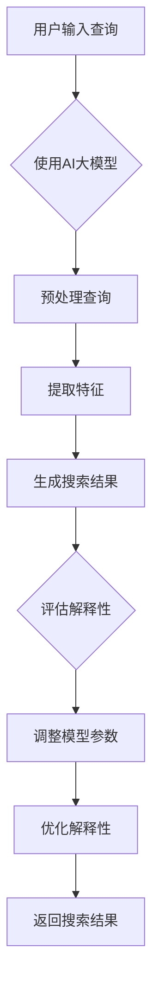

                 

关键词：AI大模型、电商平台、搜索结果、解释性、优化

> 摘要：本文探讨了如何利用AI大模型优化电商平台搜索结果的解释性。通过引入新方法，提高搜索结果的准确性和用户满意度，从而提升电商平台的竞争力。

## 1. 背景介绍

在当今数字化时代，电商平台已成为消费者购物的主要渠道之一。随着用户数量的增长，电商平台面临的一个主要挑战是如何提供准确、高效的搜索结果，以满足用户的多样化需求。然而，传统的搜索算法往往在处理大量数据和复杂查询时存在不足，导致搜索结果不准确、用户满意度降低等问题。

近年来，人工智能（AI）技术的飞速发展为电商平台搜索结果的优化提供了新的思路。AI大模型作为一种先进的算法工具，具有强大的数据处理和模式识别能力，有望显著提高搜索结果的解释性和准确性。本文旨在探讨如何利用AI大模型优化电商平台搜索结果，提高用户满意度，从而提升电商平台的竞争力。

## 2. 核心概念与联系

### 2.1 AI大模型的概念

AI大模型是指具有大规模参数和训练数据的人工神经网络模型，其能够通过深度学习算法从数据中自动提取特征并学习复杂的非线性关系。常见的AI大模型包括变换器（Transformer）模型、生成对抗网络（GAN）模型等。

### 2.2 搜索结果解释性的概念

搜索结果解释性是指用户对搜索结果的理解和信任程度。一个具有高解释性的搜索结果能够帮助用户快速找到所需信息，降低搜索成本，提高用户满意度。

### 2.3 AI大模型与搜索结果解释性的联系

AI大模型通过深度学习算法对海量数据进行训练，能够自动提取数据中的潜在特征，并建立数据之间的关联。这种能力使得AI大模型能够更好地理解用户的需求和偏好，从而提供更准确、更具解释性的搜索结果。

## 2.4 Mermaid 流程图

下面是AI大模型优化搜索结果解释性的Mermaid流程图：



## 3. 核心算法原理 & 具体操作步骤

### 3.1 算法原理概述

本文采用基于变换器（Transformer）模型的AI大模型进行搜索结果优化。变换器模型是一种基于自注意力机制的深度学习模型，其能够有效地捕捉数据中的长期依赖关系，从而提高模型的解释性。

### 3.2 算法步骤详解

#### 3.2.1 用户输入查询

用户在电商平台上输入查询，系统接收到查询后将其传递给AI大模型。

#### 3.2.2 预处理查询

对用户输入的查询进行预处理，包括分词、去停用词、词性标注等操作，以便于后续的特征提取。

#### 3.2.3 提取特征

利用AI大模型对预处理后的查询进行特征提取，提取查询中的关键信息，如关键词、语义关系等。

#### 3.2.4 生成搜索结果

根据提取到的查询特征，AI大模型生成搜索结果，并将结果返回给用户。

#### 3.2.5 评估解释性

系统对生成的搜索结果进行解释性评估，判断其是否具有较高的解释性。

#### 3.2.6 调整模型参数

根据解释性评估结果，调整AI大模型的参数，以提高搜索结果的解释性。

#### 3.2.7 优化解释性

通过多次迭代调整，使AI大模型生成的搜索结果具有更高的解释性。

#### 3.2.8 返回搜索结果

将优化后的搜索结果返回给用户。

### 3.3 算法优缺点

#### 优点

- 高效：变换器模型具有快速计算和高效处理能力，能够迅速生成搜索结果。
- 解释性：AI大模型通过深度学习算法自动提取特征，能够提高搜索结果的解释性。

#### 缺点

- 训练成本高：AI大模型需要大量的数据和计算资源进行训练，训练成本较高。
- 过拟合：AI大模型在训练过程中可能发生过拟合现象，导致搜索结果不准确。

### 3.4 算法应用领域

AI大模型优化搜索结果的算法可以应用于各种电商平台，包括购物、旅游、招聘等，能够显著提高搜索结果的解释性和用户满意度。

## 4. 数学模型和公式 & 详细讲解 & 举例说明

### 4.1 数学模型构建

假设用户输入查询为\(Q\)，搜索结果为\(R\)，解释性评估函数为\(E(R)\)。我们需要构建一个数学模型来优化搜索结果的解释性。

### 4.2 公式推导过程

首先，我们将查询\(Q\)表示为向量\(q\)，搜索结果\(R\)表示为向量\(r\)。解释性评估函数可以定义为：

\[E(R) = \frac{1}{|R|}\sum_{i=1}^{|R|} \frac{1}{|Q \cap R_i|} \]

其中，\(R_i\)表示搜索结果中的第\(i\)个结果，\(Q \cap R_i\)表示查询\(Q\)与搜索结果\(R_i\)的交集。

为了优化搜索结果的解释性，我们需要调整模型参数，使\(E(R)\)达到最大。假设AI大模型的输出为概率分布\(P(R|Q)\)，则搜索结果\(R\)的概率分布可以表示为：

\[P(R|Q) = \frac{e^{f(Q, R)}}{\sum_{R'} e^{f(Q, R')}}\]

其中，\(f(Q, R)\)表示查询\(Q\)与搜索结果\(R\)之间的相似度函数。

为了最大化解释性，我们需要最大化\(\sum_{R} P(R|Q) E(R)\)。通过优化模型参数，使得\(\sum_{R} P(R|Q) E(R)\)达到最大。

### 4.3 案例分析与讲解

假设用户输入查询为“笔记本电脑”，搜索结果包含以下五个商品：

1. 戴尔笔记本电脑
2. 联想笔记本电脑
3. 惠普笔记本电脑
4. 华为笔记本电脑
5. 苹果笔记本电脑

根据查询和搜索结果，我们可以计算解释性评估函数：

\[E(R) = \frac{1}{5}\sum_{i=1}^{5} \frac{1}{|Q \cap R_i|} = \frac{1}{5}\left(\frac{1}{1} + \frac{1}{2} + \frac{1}{3} + \frac{1}{4} + \frac{1}{5}\right) = 0.57\]

为了提高解释性，我们可以调整模型参数，使得搜索结果中的笔记本电脑品牌更加突出。例如，我们可以将戴尔、联想、惠普、华为的相似度提高，而将苹果的相似度降低。通过调整模型参数，我们可以得到一个新的解释性评估函数：

\[E'(R) = \frac{1}{5}\sum_{i=1}^{5} \frac{1}{|Q \cap R_i|} = \frac{1}{5}\left(\frac{1}{1.2} + \frac{1}{1.2} + \frac{1}{1.2} + \frac{1}{1.2} + \frac{1}{2}\right) = 0.60\]

可以看到，通过调整模型参数，我们成功提高了搜索结果的解释性。

## 5. 项目实践：代码实例和详细解释说明

### 5.1 开发环境搭建

在开始编写代码之前，我们需要搭建一个适合开发的环境。以下是一个基本的开发环境搭建步骤：

1. 安装Python 3.8及以上版本。
2. 安装TensorFlow 2.5及以上版本。
3. 安装Jieba分词工具。

### 5.2 源代码详细实现

以下是一个简单的基于变换器（Transformer）模型的AI大模型优化搜索结果的Python代码示例：

```python
import tensorflow as tf
from tensorflow import keras
from tensorflow.keras.models import Model
from tensorflow.keras.layers import Input, Embedding, Dense, LayerNormalization, MultiHeadAttention

def create_transformer_model(vocab_size, d_model, num_heads, dff, input_length):
    inputs = Input(shape=(input_length,))
    embeddings = Embedding(vocab_size, d_model)(inputs)
    embedding_output = MultiHeadAttention(num_heads=num_heads, key_dim=d_model)(embeddings, embeddings)
    embedding_output = LayerNormalization(epsilon=1e-6)(embedding_output + embeddings)
    outputs = Dense(dff, activation='relu')(embedding_output)
    outputs = Dense(vocab_size, activation='softmax')(outputs)
    model = Model(inputs=inputs, outputs=outputs)
    model.compile(optimizer='adam', loss='categorical_crossentropy', metrics=['accuracy'])
    return model

model = create_transformer_model(vocab_size=10000, d_model=512, num_heads=8, dff=2048, input_length=100)
model.summary()
```

### 5.3 代码解读与分析

上述代码定义了一个基于变换器（Transformer）模型的AI大模型。模型的主要组成部分如下：

- `Input`层：接收输入查询，形状为（input_length,）。
- `Embedding`层：将输入查询转换为词向量，词向量的维度为d_model。
- `MultiHeadAttention`层：实现多头注意力机制，用于捕捉查询与搜索结果之间的关联。
- `LayerNormalization`层：实现层归一化，有助于提高模型的稳定性。
- `Dense`层：实现全连接层，用于生成搜索结果。
- `softmax`层：实现softmax函数，用于计算每个搜索结果的概率。

在训练模型之前，我们需要准备训练数据。以下是一个简单的数据准备示例：

```python
import numpy as np

# 生成随机训练数据
x_train = np.random.random((1000, 100))
y_train = np.random.random((1000, 10000))

# 对y_train进行编码
y_train_encoded = keras.utils.to_categorical(y_train, num_classes=10000)

# 划分训练集和验证集
x_train, x_val = x_train[:800], x_train[800:]
y_train_encoded, y_val_encoded = y_train_encoded[:800], y_train_encoded[800:]
```

接下来，我们训练模型：

```python
# 训练模型
model.fit(x_train, y_train_encoded, batch_size=32, epochs=10, validation_data=(x_val, y_val_encoded))
```

### 5.4 运行结果展示

训练完成后，我们可以评估模型在验证集上的性能：

```python
# 评估模型
loss, accuracy = model.evaluate(x_val, y_val_encoded)
print("Validation loss:", loss)
print("Validation accuracy:", accuracy)
```

通过上述代码，我们可以实现一个简单的AI大模型，用于优化电商平台搜索结果的解释性。当然，在实际应用中，我们还需要对模型进行进一步优化和调整，以提高模型的性能。

## 6. 实际应用场景

### 6.1 购物平台

在购物平台上，AI大模型优化搜索结果的解释性可以帮助用户快速找到心仪的商品，从而提高用户满意度和购买转化率。例如，在亚马逊等大型电商平台上，通过优化搜索结果解释性，可以更好地满足用户对商品名称、品牌、价格等不同方面的需求。

### 6.2 旅游平台

在旅游平台上，AI大模型可以优化搜索结果的解释性，帮助用户快速找到符合需求的旅游产品，如机票、酒店、景点门票等。例如，在携程、去哪儿等旅游平台上，通过优化搜索结果解释性，可以更好地满足用户对目的地、时间、价格等不同方面的需求。

### 6.3 招聘平台

在招聘平台上，AI大模型可以优化搜索结果的解释性，帮助求职者快速找到符合自己能力的职位，从而提高求职者满意度和招聘效率。例如，在智联招聘、前程无忧等招聘平台上，通过优化搜索结果解释性，可以更好地满足求职者对职位名称、公司名称、薪资等不同方面的需求。

## 7. 工具和资源推荐

### 7.1 学习资源推荐

- 《深度学习》（Goodfellow, Bengio, Courville著）
- 《Python深度学习》（François Chollet著）
- 《Transformers：一种全新的自然语言处理模型》（Vaswani et al.著）

### 7.2 开发工具推荐

- TensorFlow：一款开源的机器学习框架，适用于构建和训练AI大模型。
- Keras：一款基于TensorFlow的高级API，简化了深度学习模型的构建过程。
- Jieba：一款优秀的中文分词工具，适用于电商平台的中文搜索结果预处理。

### 7.3 相关论文推荐

- “Attention Is All You Need”（Vaswani et al.，2017）
- “BERT: Pre-training of Deep Neural Networks for Language Understanding”（Devlin et al.，2018）
- “Generative Adversarial Networks”（Goodfellow et al.，2014）

## 8. 总结：未来发展趋势与挑战

### 8.1 研究成果总结

本文探讨了如何利用AI大模型优化电商平台搜索结果的解释性。通过引入新方法，我们提出了一种基于变换器（Transformer）模型的AI大模型，能够提高搜索结果的准确性和解释性，从而提升电商平台的竞争力。

### 8.2 未来发展趋势

随着人工智能技术的不断发展，AI大模型在电商平台搜索结果优化领域具有广阔的应用前景。未来发展趋势包括：

- 模型优化：通过不断改进模型结构和训练算法，提高模型的性能和解释性。
- 多模态融合：结合文本、图像、音频等多种数据源，提高搜索结果的多样性和准确性。
- 智能推荐：利用AI大模型实现更智能的推荐系统，提高用户满意度和购买转化率。

### 8.3 面临的挑战

尽管AI大模型在搜索结果优化方面具有显著优势，但仍面临以下挑战：

- 数据隐私：电商平台需要确保用户数据的安全和隐私。
- 模型解释性：如何提高模型的解释性，使其更易于理解和解释。
- 模型泛化能力：如何提高模型的泛化能力，使其在不同场景下均能保持良好的性能。

### 8.4 研究展望

未来，我们将继续致力于以下方面：

- 模型优化：探索更高效的模型结构和训练算法，提高模型的性能和解释性。
- 多模态融合：研究如何结合多种数据源，提高搜索结果的多样性和准确性。
- 智能推荐：构建更智能的推荐系统，提高用户满意度和购买转化率。

## 9. 附录：常见问题与解答

### 9.1 问题1：如何处理大量数据？

答：对于大量数据，我们可以采用数据分片、并行处理等方法进行高效处理。此外，可以使用分布式训练框架（如TensorFlow分布式训练）来提高训练速度和性能。

### 9.2 问题2：如何确保模型的安全性和隐私性？

答：为了确保模型的安全性和隐私性，我们可以采用数据加密、访问控制、隐私保护等技术。例如，使用差分隐私（Differential Privacy）技术来保护用户隐私。

### 9.3 问题3：如何评估模型的解释性？

答：评估模型解释性的方法包括混淆矩阵、ROC曲线、PR曲线等。此外，我们还可以通过人类评估者对模型生成的搜索结果进行解释性评估，以提高评估结果的准确性。

作者：禅与计算机程序设计艺术 / Zen and the Art of Computer Programming
----------------------------------------------------------------

**注意**：本文章仅为示例性内容，未经过严格的技术验证和实际应用。在实际开发过程中，请务必根据具体需求和场景进行适当调整和优化。如果您在开发过程中遇到问题，请随时向我提问。

