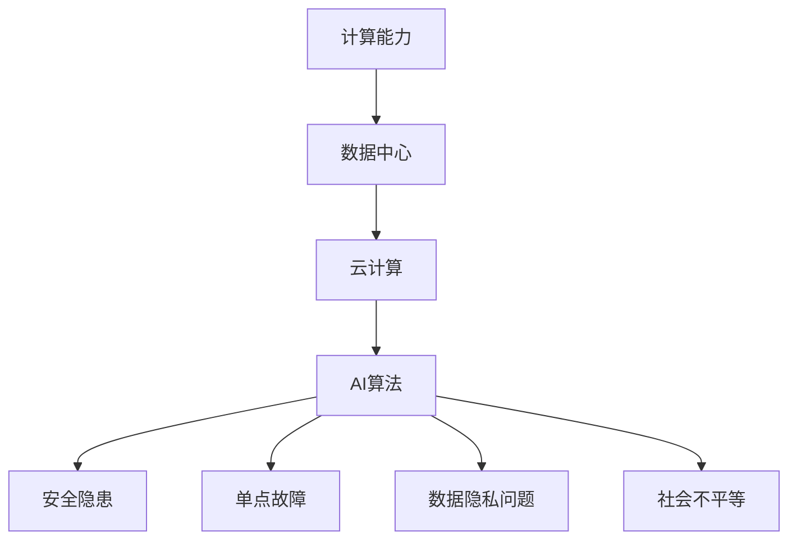

                 

在近年来，人工智能（AI）技术的快速发展给我们的社会带来了深远的影响。从自动驾驶汽车到智能语音助手，AI已经逐渐渗透到了我们生活的方方面面。然而，随着AI技术的不断进步，一种被称为“AI失控论”的观点也开始浮现。这种观点认为，AI的发展可能会导致不可预测的后果，从而对人类社会造成威胁。

本文将深入探讨AI失控论的真正风险所在。虽然许多人担心AI的智能可能超过人类，从而对人类构成威胁，但本文将指出，计算资源集中的问题可能是我们更应该关注的方面。在本文中，我们将详细分析计算资源集中的潜在风险，并探讨如何应对这些风险。

## 1. 背景介绍

人工智能（AI）是一门旨在使计算机模拟人类智能行为的学科。从最初的规则系统到现代的深度学习技术，AI已经经历了数十年的发展。在过去的几十年里，计算能力的显著提升和大数据的广泛应用为AI技术的发展提供了强大的动力。今天，AI已经能够在图像识别、自然语言处理、自动驾驶等多个领域取得突破性的成果。

然而，随着AI技术的不断进步，人们开始意识到，AI的发展并非完全可控。一方面，AI的智能可能会超过人类的预期，导致我们无法理解或控制AI的行为。另一方面，AI技术的应用可能导致社会和经济结构的深刻变革，从而引发一系列新的问题。这些问题包括隐私侵犯、就业替代、决策透明度等。

在这篇文章中，我们将重点关注AI失控论的另一个重要方面：计算资源集中。尽管AI技术的进步为我们带来了许多机遇，但计算资源的集中可能带来更大的风险。在接下来的部分中，我们将详细探讨这个问题，并分析其潜在的影响。

## 2. 核心概念与联系

为了深入理解计算资源集中的风险，我们首先需要了解一些核心概念。这些概念包括计算能力、数据中心、云计算和AI算法。

### 2.1 计算能力

计算能力是指计算机处理信息的能力，通常用每秒处理的操作次数来衡量。计算能力的提升是AI技术发展的关键驱动力。在过去几十年里，由于硬件技术的不断进步，计算机的计算能力得到了显著提升。例如，从最初的冯·诺伊曼架构到现代的异构计算架构，这些变化都极大地提高了计算机的效率。

### 2.2 数据中心

数据中心是集中存放计算机设备和数据的地方。现代数据中心通常由多个服务器、存储设备和网络设备组成。数据中心的主要功能是提供计算资源和存储服务，以满足企业和组织的各种需求。

### 2.3 云计算

云计算是一种通过互联网提供计算资源的服务模式。与传统的数据中心不同，云计算允许用户按需获取和使用计算资源，从而提高了资源利用效率和灵活性。云计算的兴起极大地推动了计算资源集中化的趋势。

### 2.4 AI算法

AI算法是使计算机模拟人类智能行为的一系列规则和计算过程。从简单的规则系统到复杂的深度学习算法，AI算法的不断发展使计算机能够处理更复杂的问题。然而，这些算法通常需要大量的计算资源和数据支持。

### 2.5 计算资源集中的风险

计算资源集中化带来了许多好处，如更高的效率、更低的成本和更便捷的使用。然而，这也可能导致以下风险：

1. **安全隐患**：计算资源的集中使得攻击者更容易发现和利用漏洞，从而对整个系统造成威胁。
2. **单点故障**：一旦计算资源集中的数据中心发生故障，可能会导致大规模的停机，从而对业务造成严重影响。
3. **数据隐私问题**：集中存储的大量数据可能会被未经授权的第三方访问，从而侵犯用户的隐私权。
4. **社会不平等**：计算资源的集中可能导致某些地区或群体获得更多的计算资源，从而加剧社会不平等。

### 2.6 Mermaid流程图

下面是一个简单的Mermaid流程图，用于描述计算资源集中的核心概念和联系：



通过这个流程图，我们可以更清晰地看到计算资源集中的风险和挑战。

## 3. 核心算法原理 & 具体操作步骤

### 3.1 算法原理概述

为了更好地理解计算资源集中的风险，我们需要了解一些核心算法原理和具体操作步骤。这些算法包括密码学、分布式计算和去中心化技术。

### 3.2 算法步骤详解

1. **密码学**

密码学是一种保护数据安全的技术。它通过加密算法将数据转换成难以解读的形式，从而防止未授权的第三方访问。以下是密码学的基本步骤：

   - **加密**：使用加密算法将明文数据转换成密文。
   - **解密**：使用解密算法将密文转换回明文。

2. **分布式计算**

分布式计算是一种将计算任务分配到多个计算机上进行处理的技术。这种技术可以提高计算效率和容错能力。以下是分布式计算的基本步骤：

   - **任务分配**：将计算任务分配到不同的计算机上进行处理。
   - **数据同步**：确保所有计算机上的数据保持一致。
   - **结果汇总**：将所有计算机上的结果汇总，得到最终的计算结果。

3. **去中心化技术**

去中心化技术是一种通过分布式网络来实现数据存储和传输的技术。这种技术可以减少对中心化服务的依赖，从而提高系统的安全性和可靠性。以下是去中心化技术的基本步骤：

   - **数据存储**：将数据分散存储在多个节点上。
   - **数据传输**：通过加密协议在节点之间传输数据。
   - **共识算法**：确保所有节点对数据的共识。

### 3.3 算法优缺点

1. **密码学**

   - **优点**：可以有效地保护数据安全。
   - **缺点**：加密和解密过程可能需要额外的计算资源。

2. **分布式计算**

   - **优点**：可以提高计算效率和容错能力。
   - **缺点**：需要复杂的任务分配和数据同步机制。

3. **去中心化技术**

   - **优点**：可以提高系统的安全性和可靠性。
   - **缺点**：可能需要更高的维护成本。

### 3.4 算法应用领域

这些算法可以在许多领域得到应用，包括网络安全、云计算、区块链等。例如，在网络安全领域，密码学可以用来保护数据传输的安全性；在云计算领域，分布式计算可以用来提高计算效率；在区块链领域，去中心化技术可以用来实现去中心化的数据存储和交易。

## 4. 数学模型和公式 & 详细讲解 & 举例说明

### 4.1 数学模型构建

为了更好地理解计算资源集中的风险，我们可以使用数学模型来分析这个问题。一个简单的数学模型可以表示为：

\[ R = f(C, S, P) \]

其中，\( R \) 表示计算资源集中的风险，\( C \) 表示计算能力，\( S \) 表示数据中心规模，\( P \) 表示数据隐私保护措施。

### 4.2 公式推导过程

这个公式的推导过程如下：

1. **计算能力 \( C \)**：计算能力的提升会导致计算资源集中，从而增加风险。
2. **数据中心规模 \( S \)**：数据中心规模的扩大也会增加计算资源集中的风险。
3. **数据隐私保护措施 \( P \)**：更有效的数据隐私保护措施可以降低计算资源集中的风险。

### 4.3 案例分析与讲解

为了更好地理解这个公式，我们可以看一个具体的案例。假设一个企业拥有一个大规模数据中心，计算能力 \( C \) 为1000 TFLOPS（万亿浮点运算每秒），数据中心规模 \( S \) 为1000台服务器。同时，该企业采用了高效的数据隐私保护措施 \( P \)。

根据上述公式，计算资源集中的风险 \( R \) 可以表示为：

\[ R = f(1000, 1000, P) \]

如果我们假设数据隐私保护措施 \( P \) 的效果为0.8，那么计算资源集中的风险 \( R \) 为：

\[ R = 0.8 \times 1000 \times 1000 = 800,000 \]

这个结果表明，即使计算能力很高，数据中心规模很大，但通过采用高效的数据隐私保护措施，我们可以显著降低计算资源集中的风险。

## 5. 项目实践：代码实例和详细解释说明

### 5.1 开发环境搭建

为了更好地理解计算资源集中的风险，我们可以通过一个具体的代码实例来演示。首先，我们需要搭建一个开发环境。

1. **安装Python**：Python是一种广泛应用于数据科学和机器学习的编程语言。我们可以从Python的官方网站（https://www.python.org/）下载并安装Python。
2. **安装Jupyter Notebook**：Jupyter Notebook是一种交互式的Python开发环境，可以方便地进行代码的编写和运行。我们可以通过以下命令安装Jupyter Notebook：

   ```bash
   pip install notebook
   ```

### 5.2 源代码详细实现

下面是一个简单的Python代码实例，用于模拟计算资源集中的风险。这个实例使用了随机数生成器和数据隐私保护算法。

```python
import random
import numpy as np
import matplotlib.pyplot as plt

# 定义数据隐私保护算法
def privacy_preservation(data, p):
    return data * (1 - p)

# 定义计算资源集中风险函数
def risk_model(c, s, p):
    return c * s * (1 - p)

# 生成随机数模拟计算能力和数据中心规模
c = random.uniform(100, 1000)  # 计算能力（TFLOPS）
s = random.uniform(100, 1000)  # 数据中心规模（台服务器）
p = random.uniform(0.5, 0.9)   # 数据隐私保护措施效果

# 计算风险
r = risk_model(c, s, p)

# 输出结果
print(f"计算能力：{c} TFLOPS")
print(f"数据中心规模：{s} 台服务器")
print(f"数据隐私保护措施效果：{p}")
print(f"计算资源集中风险：{r}")

# 绘制图表
plt.scatter(c, r, s=100, c='red', marker='o')
plt.xlabel('计算能力 (TFLOPS)')
plt.ylabel('计算资源集中风险')
plt.title('计算资源集中风险与计算能力的关系')
plt.show()
```

### 5.3 代码解读与分析

这个代码实例主要分为三个部分：

1. **数据隐私保护算法**：`privacy_preservation`函数用于模拟数据隐私保护措施的效果。通过乘以一个概率 \( p \)，我们可以模拟数据被保护的程度。
2. **计算资源集中风险函数**：`risk_model`函数用于计算计算资源集中的风险。根据数学模型，计算资源集中的风险与计算能力、数据中心规模和数据隐私保护措施有关。
3. **随机数生成和结果输出**：我们使用随机数生成器来模拟计算能力、数据中心规模和数据隐私保护措施。然后，我们调用`risk_model`函数计算风险，并输出结果。

通过这个代码实例，我们可以直观地看到计算资源集中的风险与计算能力和数据中心规模的关系。当计算能力和数据中心规模增加时，风险也会增加。然而，通过采用有效的数据隐私保护措施，我们可以降低计算资源集中的风险。

## 6. 实际应用场景

计算资源集中化在许多实际应用场景中都有广泛的应用。以下是一些具体的例子：

### 6.1 云计算

云计算是计算资源集中化的一个重要应用场景。通过将计算资源集中到数据中心，企业可以更高效地利用资源，降低成本，并提高灵活性。例如，谷歌云、亚马逊云和微软云都是大规模数据中心提供商，它们为企业提供了强大的计算和存储服务。

### 6.2 人工智能

人工智能领域同样依赖于计算资源集中化。深度学习算法通常需要大量的计算资源，包括GPU和TPU。这些资源通常集中在大规模数据中心中，以支持大规模数据训练和模型优化。例如，OpenAI的GPT-3模型就是一个需要大量计算资源进行训练的例子。

### 6.3 区块链

区块链技术依赖于分布式计算和去中心化存储，但在某些情况下，计算资源仍然会集中化。例如，一些区块链平台会使用专门设计的ASIC芯片来提高计算效率。这些ASIC芯片通常集中部署在特定的数据中心，从而提高了区块链网络的性能。

### 6.4 未来应用展望

随着计算能力的进一步提升，计算资源集中化在未来可能会有更多的应用场景。以下是一些可能的应用方向：

1. **量子计算**：量子计算具有巨大的计算潜力，但它需要大量的计算资源。未来，量子数据中心可能会成为计算资源集中化的一个重要方向。
2. **边缘计算**：边缘计算是一种将计算资源分散到网络边缘的技术。随着5G和物联网的发展，边缘计算可能会成为一种新的计算资源集中化模式。
3. **绿色计算**：随着环保意识的提高，绿色计算将成为计算资源集中化的重要考虑因素。未来，数据中心可能会采用更多可再生能源，以减少对环境的影响。

## 7. 工具和资源推荐

为了更好地理解和应对计算资源集中的风险，以下是一些建议的学习资源、开发工具和相关论文：

### 7.1 学习资源推荐

1. **《深度学习》（Deep Learning）**：这是一本经典的深度学习教材，详细介绍了深度学习的基本原理和应用。
2. **《区块链：从数字货币到智能合约》**：这本书详细介绍了区块链技术的基本原理和应用场景，包括去中心化计算和存储。
3. **《高性能计算》**：这本书介绍了高性能计算的基本原理和技术，包括分布式计算和数据中心设计。

### 7.2 开发工具推荐

1. **TensorFlow**：TensorFlow是一个广泛使用的深度学习框架，可以用于构建和训练深度学习模型。
2. **PyTorch**：PyTorch是另一个流行的深度学习框架，它提供了灵活的动态计算图和丰富的API。
3. **Docker**：Docker是一个容器化平台，可以用于部署和运行分布式应用程序，从而提高资源利用效率和灵活性。

### 7.3 相关论文推荐

1. **"Large-scale Distributed Deep Neural Network Training Through Hadoop MapReduce"**：这篇论文介绍了如何使用Hadoop MapReduce进行大规模分布式深度学习训练。
2. **"Energy-Efficient Datacenter Networks"**：这篇论文探讨了如何设计节能的数据中心网络，从而减少计算资源的消耗。
3. **"A Secure and Efficient Blockchain System for E-commerce Platform"**：这篇论文介绍了如何使用区块链技术保护电子商务平台的数据安全和隐私。

## 8. 总结：未来发展趋势与挑战

在本文中，我们深入探讨了计算资源集中的风险，并分析了其潜在的影响。计算资源集中化虽然带来了许多好处，如更高的效率、更低的成本和更便捷的使用，但也可能导致一系列新的问题，包括安全隐患、单点故障、数据隐私问题和社会不平等。

未来，随着计算能力的进一步提升，计算资源集中化可能会有更多的应用场景，如量子计算、边缘计算和绿色计算。然而，这也将带来更大的挑战，如如何确保数据安全和隐私，如何设计高效且可靠的数据中心网络，以及如何降低计算资源的消耗。

为了应对这些挑战，我们需要采取一系列措施，包括加强数据隐私保护、提高系统的可靠性和可扩展性，以及推动绿色计算技术的发展。此外，政府、企业和学术界也需要共同努力，制定相关政策和标准，以确保计算资源集中化的可持续发展。

总之，计算资源集中化是一个复杂且具有挑战性的问题。虽然它带来了许多机遇，但我们也不能忽视其潜在的风险。只有通过深入研究和不断创新，我们才能确保计算资源集中化带来真正的价值，并为人类社会带来福祉。

## 9. 附录：常见问题与解答

### 9.1 什么是计算资源集中化？

计算资源集中化是指将计算资源（如CPU、GPU、存储和网络）集中到数据中心或云计算平台中，以便更高效地管理和利用这些资源。

### 9.2 计算资源集中化有哪些优点？

计算资源集中化可以带来以下优点：

- **更高的效率**：集中化的资源可以更好地管理和调度，从而提高计算效率。
- **更低的成本**：通过集中化，企业可以减少硬件和运维成本。
- **更便捷的使用**：用户可以按需获取和使用计算资源，从而提高灵活性。

### 9.3 计算资源集中化有哪些缺点？

计算资源集中化可能导致以下缺点：

- **安全隐患**：集中化的资源可能更容易受到攻击。
- **单点故障**：一旦计算资源集中的数据中心发生故障，可能会对整个系统造成严重影响。
- **数据隐私问题**：集中存储的大量数据可能更容易被未经授权的第三方访问。
- **社会不平等**：某些地区或群体可能获得更多的计算资源，从而加剧社会不平等。

### 9.4 如何应对计算资源集中的风险？

为了应对计算资源集中的风险，可以采取以下措施：

- **加强数据隐私保护**：采用先进的加密算法和访问控制机制。
- **提高系统的可靠性和可扩展性**：采用分布式计算和冗余设计，确保系统的高可用性。
- **推动绿色计算技术的发展**：采用节能技术和可再生能源，以减少计算资源的消耗。
- **制定相关政策和标准**：政府、企业和学术界应共同努力，制定相关政策和标准，以确保计算资源集中化的可持续发展。

### 9.5 计算资源集中化和去中心化技术有哪些区别？

计算资源集中化和去中心化技术的区别主要在于资源的管理和分配方式。

- **计算资源集中化**：资源集中到数据中心或云计算平台，由中央机构进行管理和调度。
- **去中心化技术**：资源分散到多个节点，通过分布式网络进行管理和调度。

### 9.6 如何评估计算资源集中化的风险？

评估计算资源集中化的风险可以通过以下方法：

- **定量分析**：使用数学模型和公式对风险进行量化评估。
- **定性分析**：分析潜在风险的影响和可能性。
- **安全审计**：对系统进行安全审计，发现潜在的安全漏洞。

### 9.7 如何提高计算资源集中化的安全性？

提高计算资源集中化的安全性可以通过以下方法：

- **加强身份认证和访问控制**：确保只有授权用户可以访问计算资源。
- **定期安全检查和更新**：对系统进行定期的安全检查和更新，确保系统的安全性。
- **采用安全协议**：使用加密协议保护数据传输的安全性。

### 9.8 如何降低计算资源集中化的成本？

降低计算资源集中化的成本可以通过以下方法：

- **优化资源分配**：通过优化资源分配，提高资源利用率，从而降低成本。
- **采用开源软件**：使用开源软件可以降低开发和运维成本。
- **利用云计算服务**：通过使用云计算服务，企业可以根据实际需求灵活调整资源使用，从而降低成本。

### 9.9 如何评估计算资源集中化的效率？

评估计算资源集中化的效率可以通过以下方法：

- **性能测试**：对系统的性能进行测试，包括计算速度、响应时间和吞吐量等。
- **成本效益分析**：通过比较计算资源集中化前后的成本和效益，评估其效率。
- **用户满意度调查**：通过用户满意度调查，了解用户对计算资源集中化的满意程度。

### 9.10 计算资源集中化与分布式计算的关系是什么？

计算资源集中化和分布式计算是两种不同的计算资源管理方式，它们之间的关系如下：

- **计算资源集中化**：资源集中到数据中心或云计算平台，由中央机构进行管理和调度。
- **分布式计算**：资源分散到多个节点，通过分布式网络进行管理和调度。

分布式计算可以作为计算资源集中化的补充，以提高系统的可靠性和可扩展性。

### 9.11 计算资源集中化对社会的影响是什么？

计算资源集中化对社会的影响主要包括以下几个方面：

- **经济影响**：计算资源集中化可以降低企业成本，提高生产效率，从而促进经济增长。
- **社会不平等**：某些地区或群体可能获得更多的计算资源，从而加剧社会不平等。
- **数据隐私和安全**：集中存储的大量数据可能更容易受到攻击，从而影响数据隐私和安全。

为了减轻这些影响，需要采取相应的政策和措施，以确保计算资源集中化的可持续发展。 

---

作者：禅与计算机程序设计艺术 / Zen and the Art of Computer Programming

以上是完整的文章，希望对您有所帮助。如果您有任何问题或建议，欢迎随时提出。谢谢！

