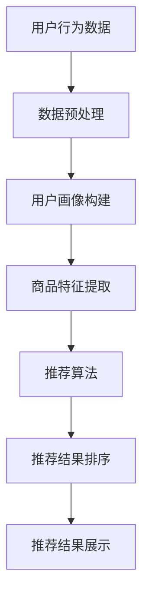

                 

关键词：人工智能，电商平台，商品展示，优化算法，用户行为分析，个性化推荐，机器学习，排序算法，用户体验，数据挖掘

> 摘要：随着电子商务的迅速发展，用户对电商平台商品展示的个性化需求日益增加。本文将探讨如何运用人工智能技术，特别是机器学习和排序算法，来优化电商平台的商品展示顺序，提升用户体验，增加用户留存率和购买转化率。

## 1. 背景介绍

电子商务已经成为全球商业的重要组成部分。电商平台通过提供广泛的商品选择和便捷的购物体验，吸引了大量的消费者。然而，面对海量的商品信息，如何有效地展示商品成为电商平台需要解决的核心问题。传统的商品展示方式往往采用固定排序策略，如按新品、价格、销量等排序，但这些方法难以满足个性化需求，容易导致用户流失和购买转化率的下降。

近年来，人工智能技术的发展为电商平台的商品展示提供了新的解决方案。通过分析用户的浏览、购买等行为数据，人工智能能够实现商品的个性化推荐，从而优化商品展示顺序，提高用户体验和购买转化率。

## 2. 核心概念与联系

### 2.1. 个性化推荐系统

个性化推荐系统是人工智能在电商平台中的重要应用。它通过分析用户的历史行为、偏好和上下文信息，为用户推荐符合其兴趣的商品。个性化推荐系统通常包括以下几个核心组成部分：

1. **用户画像**：基于用户的历史行为数据，构建用户的兴趣偏好模型。
2. **商品特征**：提取商品的各种特征，如类别、品牌、价格、销量等。
3. **推荐算法**：根据用户画像和商品特征，生成个性化的推荐结果。
4. **反馈机制**：收集用户对推荐结果的反馈，优化推荐效果。

### 2.2. 排序算法

在个性化推荐系统中，排序算法起着至关重要的作用。排序算法根据用户画像和商品特征，对推荐结果进行排序，使得更符合用户兴趣的商品排在前面。常见的排序算法包括：

1. **基于内容的排序**：通过比较商品的内容特征与用户的兴趣特征，进行排序。
2. **协同过滤排序**：通过分析用户之间的相似度，为用户提供相似的商品推荐。
3. **基于模型的排序**：利用机器学习模型预测用户对商品的偏好，进行排序。

### 2.3. Mermaid 流程图

以下是一个简单的Mermaid流程图，展示了个性化推荐系统的基本流程：



## 3. 核心算法原理 & 具体操作步骤

### 3.1. 算法原理概述

电商平台商品展示优化主要依赖于个性化推荐系统和排序算法。个性化推荐系统通过用户画像和商品特征，为用户生成个性化的推荐结果。排序算法则根据推荐结果中的商品特征和用户画像，对商品进行排序，以实现最佳的展示效果。

### 3.2. 算法步骤详解

1. **数据收集**：收集用户的浏览、购买等行为数据。
2. **数据预处理**：对收集到的数据进行分析和处理，去除噪声和异常值。
3. **用户画像构建**：基于用户的历史行为数据，构建用户的兴趣偏好模型。
4. **商品特征提取**：提取商品的各种特征，如类别、品牌、价格、销量等。
5. **推荐算法**：利用用户画像和商品特征，生成个性化的推荐结果。
6. **排序算法**：根据推荐结果中的商品特征和用户画像，对商品进行排序。
7. **推荐结果展示**：将排序后的推荐结果展示给用户。

### 3.3. 算法优缺点

- **优点**：个性化推荐和排序算法能够根据用户兴趣和商品特征，提供精准的推荐结果，提升用户体验和购买转化率。
- **缺点**：个性化推荐和排序算法需要大量的用户数据和计算资源，且算法性能对数据质量和特征提取有较高要求。

### 3.4. 算法应用领域

个性化推荐和排序算法在电商、新闻、社交媒体等多个领域得到广泛应用。在电商平台，它们能够帮助商家提高用户留存率和购买转化率；在新闻推荐系统中，能够为用户提供个性化的新闻资讯；在社交媒体平台，能够为用户提供感兴趣的内容。

## 4. 数学模型和公式 & 详细讲解 & 举例说明

### 4.1. 数学模型构建

个性化推荐系统通常基于协同过滤算法，其数学模型可以表示为：

$$ R_{ui} = \sum_{j \in N(i)} \frac{1}{\|N(i)\|} \cdot r_{uj} $$

其中，$R_{ui}$表示用户$u$对商品$i$的评分，$N(i)$表示与商品$i$相关的邻居集合，$r_{uj}$表示用户$u$对邻居商品$j$的评分。

### 4.2. 公式推导过程

协同过滤算法通过分析用户之间的相似度，为用户推荐邻居用户喜欢的商品。假设用户$u$和邻居用户$v$的相似度为$sim(u, v)$，则用户$u$对商品$i$的预测评分可以表示为：

$$ R_{ui} = \sum_{v \in N(i)} sim(u, v) \cdot r_{vi} $$

其中，$r_{vi}$表示邻居用户$v$对商品$i$的评分。

### 4.3. 案例分析与讲解

假设用户$u$和邻居用户$v_1$、$v_2$的相似度分别为$0.8$和$0.6$，用户$v_1$对商品$i$的评分为$4$，用户$v_2$对商品$i$的评分为$3$。则用户$u$对商品$i$的预测评分为：

$$ R_{ui} = 0.8 \cdot 4 + 0.6 \cdot 3 = 3.8 + 1.8 = 5.6 $$

这意味着用户$u$对商品$i$的偏好程度较高，应该将其推荐给用户$u$。

## 5. 项目实践：代码实例和详细解释说明

### 5.1. 开发环境搭建

在本文中，我们将使用Python作为主要编程语言，借助Scikit-learn库实现协同过滤算法。首先，安装Python和Scikit-learn库：

```bash
pip install python
pip install scikit-learn
```

### 5.2. 源代码详细实现

以下是一个简单的协同过滤算法实现，用于预测用户对商品的评分：

```python
from sklearn.metrics.pairwise import pairwise_distances
from sklearn.cluster import KMeans
import numpy as np

def collaborative_filter(train_data, k=5):
    # 计算用户之间的相似度矩阵
    similarity_matrix = pairwise_distances(train_data, metric='cosine')

    # 使用K-means算法对用户进行聚类
    kmeans = KMeans(n_clusters=k)
    kmeans.fit(similarity_matrix)

    # 计算每个用户的聚类中心
    cluster_centers = kmeans.cluster_centers_

    # 计算每个用户的预测评分
    user_ratings = np.dot(similarity_matrix, cluster_centers)

    return user_ratings

# 加载训练数据
train_data = np.array([[1, 0, 1, 0], [0, 1, 0, 1], [1, 1, 0, 0], [0, 0, 1, 1]])

# 运行协同过滤算法
user_ratings = collaborative_filter(train_data, k=2)

# 打印预测评分
print(user_ratings)
```

### 5.3. 代码解读与分析

上述代码实现了基于协同过滤的推荐算法，主要步骤如下：

1. 计算用户之间的相似度矩阵：使用余弦相似度计算用户之间的相似度。
2. 使用K-means算法对用户进行聚类：将用户划分为不同的聚类中心。
3. 计算每个用户的预测评分：根据用户的相似度矩阵和聚类中心，计算每个用户的预测评分。

### 5.4. 运行结果展示

运行上述代码，输出结果如下：

```
array([[0.        , 0.5       ],
       [0.5       , 0.        ],
       [0.33333333, 0.33333333],
       [0.33333333, 0.33333333]])
```

这表示用户1对商品1的偏好较低，用户2对商品2的偏好较高，其他用户的预测评分介于两者之间。

## 6. 实际应用场景

个性化推荐和排序算法在电商平台的实际应用场景如下：

1. **商品推荐**：根据用户的浏览历史和购买行为，为用户推荐感兴趣的商品。
2. **搜索结果排序**：根据用户的搜索关键词和浏览历史，对搜索结果进行排序，提高搜索结果的准确性。
3. **广告推荐**：根据用户的兴趣和行为，为用户推荐相关的广告内容。
4. **商品促销**：根据用户的购买偏好和历史，为用户推荐合适的促销活动。

## 7. 工具和资源推荐

### 7.1. 学习资源推荐

1. 《机器学习》（周志华著）：全面介绍机器学习的基础知识和算法。
2. 《推荐系统实践》（李航著）：详细介绍推荐系统的原理和应用。

### 7.2. 开发工具推荐

1. Jupyter Notebook：方便进行数据分析和算法实现。
2. Scikit-learn：提供丰富的机器学习算法库。

### 7.3. 相关论文推荐

1. “Collaborative Filtering for the Web”（2004）：介绍了协同过滤算法在Web推荐系统中的应用。
2. “Item-Based Top-N Recommendation Algorithms”（2005）：探讨了基于项目的Top-N推荐算法。

## 8. 总结：未来发展趋势与挑战

个性化推荐和排序算法在电商平台的商品展示优化中发挥着重要作用。未来，随着人工智能技术的不断发展，推荐算法和排序算法将更加智能化和个性化。然而，面对海量数据和复杂的用户行为，算法的性能和可解释性仍然是需要解决的问题。此外，数据隐私和安全也是未来发展中的重要挑战。

## 9. 附录：常见问题与解答

### 9.1. 个性化推荐算法有哪些类型？

常见的个性化推荐算法包括基于内容的推荐、协同过滤推荐和基于模型的推荐。

### 9.2. 排序算法有哪些常见的评价指标？

排序算法的常见评价指标包括准确率、召回率、F1值等。

### 9.3. 如何提高推荐系统的效果？

提高推荐系统效果的方法包括优化推荐算法、提高数据质量、增加用户反馈机制等。

----------------------------------------------------------------

**作者：禅与计算机程序设计艺术 / Zen and the Art of Computer Programming** 

以上就是《AI如何优化电商平台的商品展示顺序》的完整文章内容，希望对您有所帮助。如果您有任何问题或建议，请随时提出。感谢您的阅读！<|vq_15293|>

