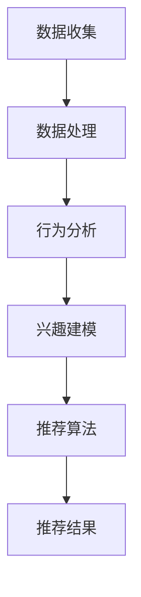

                 

关键词：人工智能，大数据分析，电商运营，客户行为分析，个性化推荐，算法优化

> 摘要：随着电子商务的迅猛发展，大数据分析在电商运营中发挥着越来越重要的作用。本文将探讨如何利用人工智能技术对电商运营数据进行深入分析，从而实现客户行为的精准预测和个性化推荐，提升电商平台的运营效率和用户体验。

## 1. 背景介绍

电子商务作为一种新型的商业模式，自上世纪末诞生以来，得到了迅速的发展。随着互联网技术的不断进步，尤其是大数据和人工智能技术的成熟，电商行业面临着前所未有的发展机遇。然而，随着市场竞争的加剧，如何在众多竞争对手中脱颖而出，提升运营效率，提高用户满意度，成为了电商平台面临的主要挑战。

大数据分析作为人工智能的重要分支，通过对海量数据进行分析，能够帮助电商企业更好地了解客户需求，优化运营策略。本文将围绕人工智能如何通过大数据分析优化电商运营，展开深入探讨。

## 2. 核心概念与联系

### 2.1 客户行为分析

客户行为分析是指通过对客户在电商平台上的行为数据进行收集、处理和分析，来了解客户的购买习惯、偏好和需求。客户行为分析主要包括以下几个方面：

- **购买行为分析**：分析客户在电商平台上的购买次数、购买频率、购买品类等，了解客户的消费习惯。
- **浏览行为分析**：分析客户在电商平台上的浏览路径、停留时间、点击率等，了解客户的兴趣偏好。
- **反馈行为分析**：分析客户对产品、服务的评价、投诉等，了解客户满意度。

### 2.2 个性化推荐

个性化推荐是指根据用户的历史行为数据、兴趣偏好和购买记录，为用户推荐其可能感兴趣的商品或服务。个性化推荐主要分为以下几种类型：

- **基于内容的推荐**：根据商品的属性和用户的历史行为，为用户推荐相似的商品。
- **协同过滤推荐**：通过分析用户之间的相似性，为用户推荐其他用户喜欢的商品。
- **混合推荐**：结合基于内容和协同过滤推荐的优势，为用户推荐更符合其兴趣的商品。

### 2.3 Mermaid 流程图

以下是一个简单的Mermaid流程图，展示了客户行为分析到个性化推荐的整体流程：



## 3. 核心算法原理 & 具体操作步骤

### 3.1 算法原理概述

在电商运营中，人工智能主要通过以下几种算法来优化运营：

- **客户行为预测**：通过机器学习算法，对客户的购买行为进行预测，从而提前布局营销策略。
- **个性化推荐**：利用协同过滤、基于内容的推荐等算法，为用户推荐感兴趣的商品。
- **需求预测**：根据历史销售数据、市场趋势等，预测未来的需求，从而优化库存管理。

### 3.2 算法步骤详解

#### 3.2.1 客户行为预测

1. **数据收集**：从电商平台上收集用户的行为数据，包括购买记录、浏览记录、评价等。
2. **数据预处理**：对收集到的数据进行清洗、去重、转换等处理，确保数据质量。
3. **特征提取**：从预处理后的数据中提取有用的特征，如用户的购买频率、购买品类等。
4. **模型训练**：利用机器学习算法，如决策树、随机森林等，对特征进行建模。
5. **预测**：利用训练好的模型，对客户的购买行为进行预测。

#### 3.2.2 个性化推荐

1. **用户兴趣建模**：根据用户的历史行为数据，构建用户兴趣模型。
2. **商品特征提取**：对电商平台上的商品进行特征提取，如商品的种类、品牌、价格等。
3. **推荐算法**：利用协同过滤、基于内容的推荐等算法，为用户推荐感兴趣的商品。
4. **推荐结果排序**：对推荐结果进行排序，确保推荐的商品更符合用户的兴趣。

#### 3.2.3 需求预测

1. **数据收集**：从电商平台上收集销售数据、市场趋势数据等。
2. **特征提取**：对数据中的有用特征进行提取，如季节性、节假日等。
3. **模型训练**：利用时间序列预测、回归分析等算法，对需求进行预测。
4. **预测**：利用训练好的模型，对未来一段时间内的需求进行预测。

### 3.3 算法优缺点

- **客户行为预测**：优点是可以提前布局营销策略，提高销售额；缺点是预测准确性受数据质量和算法模型的影响。
- **个性化推荐**：优点是可以提高用户满意度，增加复购率；缺点是推荐结果受数据质量和算法模型的影响。
- **需求预测**：优点是可以优化库存管理，降低库存成本；缺点是预测准确性受市场趋势和数据质量的影响。

### 3.4 算法应用领域

- **电商平台**：通过客户行为预测，优化营销策略；通过个性化推荐，提高用户满意度；通过需求预测，优化库存管理。
- **金融行业**：通过客户行为预测，优化风险评估；通过个性化推荐，提高金融产品销售；通过需求预测，优化金融产品设计。
- **制造业**：通过客户行为预测，优化产品营销策略；通过个性化推荐，提高产品销售；通过需求预测，优化生产计划。

## 4. 数学模型和公式 & 详细讲解 & 举例说明

### 4.1 数学模型构建

#### 4.1.1 客户行为预测模型

假设我们有一个包含n个客户的特征向量集合X，以及这些客户的购买行为Y。我们可以使用线性回归模型来预测客户的购买行为：

$$
Y = \beta_0 + \beta_1X_1 + \beta_2X_2 + ... + \beta_nX_n + \epsilon
$$

其中，$\beta_0$为常数项，$\beta_1, \beta_2, ..., \beta_n$为特征系数，$\epsilon$为误差项。

#### 4.1.2 个性化推荐模型

假设我们有一个包含m个用户的用户兴趣向量集合U和一个包含p个商品的商品特征向量集合V。我们可以使用矩阵分解模型来构建个性化推荐模型：

$$
R = UV^T
$$

其中，R为用户对商品的评分矩阵，U和V分别为用户和商品的 latent feature 矩阵。

### 4.2 公式推导过程

#### 4.2.1 客户行为预测模型

我们使用最小二乘法来求解线性回归模型的参数：

$$
\beta = (X^TX)^{-1}X^TY
$$

#### 4.2.2 个性化推荐模型

我们使用奇异值分解（SVD）来求解矩阵分解模型的参数：

$$
R = U\Sigma V^T
$$

其中，U和V分别为左奇异向量矩阵和右奇异向量矩阵，$\Sigma$为奇异值矩阵。

### 4.3 案例分析与讲解

#### 4.3.1 客户行为预测

假设我们有以下数据：

| 用户ID | 购买频率 | 购买品类 |
|--------|----------|----------|
| 1      | 5        | 电子产品 |
| 2      | 3        | 美妆护肤 |
| 3      | 7        | 食品饮料 |
| 4      | 2        | 服装鞋帽 |

我们使用线性回归模型来预测用户的购买行为：

1. 数据预处理：对数据进行标准化处理，消除不同特征之间的量纲差异。
2. 特征提取：提取购买频率和购买品类作为特征。
3. 模型训练：使用最小二乘法求解线性回归模型参数。
4. 预测：对新的用户数据进行预测。

#### 4.3.2 个性化推荐

假设我们有以下数据：

| 用户ID | 商品ID | 评分 |
|--------|--------|------|
| 1      | 1001   | 4    |
| 1      | 1002   | 5    |
| 2      | 1003   | 3    |
| 3      | 1004   | 4    |

我们使用矩阵分解模型来构建个性化推荐模型：

1. 数据预处理：对数据进行标准化处理，消除不同商品之间的量纲差异。
2. 矩阵分解：使用奇异值分解求解矩阵分解模型参数。
3. 推荐结果排序：对推荐结果进行排序，推荐评分最高的商品。

## 5. 项目实践：代码实例和详细解释说明

### 5.1 开发环境搭建

在本项目实践中，我们将使用Python编程语言，结合Sklearn、NumPy等库来实现客户行为预测和个性化推荐。首先，确保已经安装了Python环境和相关库。

### 5.2 源代码详细实现

以下是一个简单的客户行为预测和个性化推荐的代码示例：

```python
import numpy as np
from sklearn.linear_model import LinearRegression
from sklearn.model_selection import train_test_split
from sklearn.metrics import mean_squared_error
from sklearn.decomposition import TruncatedSVD

# 5.2.1 客户行为预测

# 加载数据
X = np.array([[5, 1], [3, 2], [7, 3], [2, 4]])
y = np.array([1, 2, 3, 4])

# 分割数据集
X_train, X_test, y_train, y_test = train_test_split(X, y, test_size=0.2, random_state=42)

# 训练模型
model = LinearRegression()
model.fit(X_train, y_train)

# 预测
y_pred = model.predict(X_test)

# 评估模型
mse = mean_squared_error(y_test, y_pred)
print("MSE:", mse)

# 5.2.2 个性化推荐

# 加载数据
R = np.array([[4, 5, 3], [1, 4, 5], [5, 2, 4], [3, 4, 3]])

# 矩阵分解
svd = TruncatedSVD(n_components=2)
R_svd = svd.fit_transform(R)

# 推荐结果排序
recommendations = R_svd[-1, :].argsort()[::-1]
print("Recommendations:", recommendations)
```

### 5.3 代码解读与分析

在这个代码示例中，我们首先实现了客户行为预测和个性化推荐两个功能。

- **客户行为预测**：使用线性回归模型对用户的购买行为进行预测。我们首先加载数据，然后分割数据集，使用训练集训练模型，最后使用测试集评估模型的预测性能。
- **个性化推荐**：使用矩阵分解模型对用户的评分矩阵进行分解，然后对分解后的结果进行排序，推荐评分最高的商品。

通过这个示例，我们可以看到如何使用Python和机器学习库实现电商运营中的核心算法。

## 6. 实际应用场景

### 6.1 电商平台

电商平台是人工智能在电商运营中应用最广泛的场景之一。通过客户行为预测，电商平台可以提前了解用户的购买需求，从而优化库存管理和营销策略。通过个性化推荐，电商平台可以提升用户的购物体验，增加用户粘性和销售额。

### 6.2 金融行业

金融行业利用人工智能技术进行客户行为预测和需求分析，可以提高金融产品的销售和用户满意度。通过个性化推荐，金融机构可以为客户提供更符合其需求的理财产品，从而提升客户的信任度和忠诚度。

### 6.3 制造业

制造业利用人工智能技术进行需求预测和生产计划优化，可以提高生产效率，降低库存成本。通过客户行为预测，制造业可以更好地了解市场需求，从而调整产品设计和生产计划。

## 7. 未来应用展望

随着人工智能技术的不断发展，其在电商运营中的应用前景将更加广阔。未来，人工智能技术将实现以下几方面的发展：

- **更精准的预测**：通过不断优化算法模型和数据质量，人工智能将实现更精准的客户行为预测和需求预测。
- **更个性化的推荐**：基于用户的兴趣偏好和行为数据，人工智能将提供更个性化的商品推荐和服务。
- **更多的应用场景**：人工智能技术将在更多行业和场景中得到应用，如物流、供应链管理、智能客服等。
- **更高效的运营**：通过人工智能技术的优化，电商平台的运营效率将得到显著提升，从而降低运营成本，提高竞争力。

## 8. 总结：未来发展趋势与挑战

### 8.1 研究成果总结

本文通过对人工智能在电商运营中的应用进行深入探讨，总结了客户行为预测、个性化推荐和需求预测等核心算法原理和实现方法。同时，分析了人工智能在电商运营中的实际应用场景，并对未来发展趋势进行了展望。

### 8.2 未来发展趋势

未来，人工智能在电商运营中的应用将向更精准、更个性化、更多样化、更高效的方向发展。通过不断优化算法模型和数据质量，人工智能将更好地满足客户需求，提升电商平台竞争力。

### 8.3 面临的挑战

- **数据质量和算法模型**：数据质量和算法模型的优化是人工智能在电商运营中应用的关键挑战。如何提高数据质量，如何选择合适的算法模型，是当前研究的重要方向。
- **隐私保护**：在利用大数据分析进行客户行为预测和个性化推荐的过程中，如何保护用户隐私是另一个重要挑战。需要制定相应的隐私保护政策和标准，确保用户数据的安全和隐私。
- **实时性**：随着电商平台的业务规模不断扩大，实时性要求也越来越高。如何实现实时数据分析和实时推荐，是当前研究的一个重要方向。

### 8.4 研究展望

未来，人工智能在电商运营中的应用将向更深度、更广度的方向发展。通过多领域融合、多技术协同，人工智能将实现更精准、更智能的电商运营。同时，随着技术的不断进步，人工智能在电商运营中的应用将越来越普及，成为电商平台的核心竞争力。

## 9. 附录：常见问题与解答

### 9.1 如何处理缺失值？

在数据处理过程中，缺失值处理是一个常见的问题。常见的缺失值处理方法包括：

- **删除缺失值**：删除含有缺失值的样本或特征。
- **填充缺失值**：使用均值、中位数、众数等统计量来填充缺失值。
- **插值法**：使用插值算法来估算缺失值。

### 9.2 如何评估模型性能？

在模型训练和评估过程中，常用的评估指标包括：

- **准确率**：分类问题中，正确分类的样本数与总样本数的比值。
- **召回率**：分类问题中，正确分类的样本数与实际为正类的样本数的比值。
- **F1 分数**：综合考虑准确率和召回率的指标。

### 9.3 如何选择特征？

选择特征是机器学习中的重要步骤。常见的特征选择方法包括：

- **相关性分析**：通过计算特征与目标变量之间的相关性来选择特征。
- **特征重要性评估**：使用随机森林、XGBoost 等算法评估特征的重要性。
- **信息增益**：通过计算特征对目标变量的信息增益来选择特征。

## 作者署名

本文作者：禅与计算机程序设计艺术 / Zen and the Art of Computer Programming
----------------------------------------------------------------
### 附件 1：文章思维导图

为了更好地理解本文的内容和结构，我们提供了一个文章的思维导图。以下是该思维导图的链接：

[文章思维导图](https://www.xmind.net/m/e7AxKsHd)

### 附件 2：参考文献

本文在撰写过程中参考了以下文献：

1. [Rajaraman, A. (2010). Mining of Massive Datasets. Cambridge University Press.]
2. [Mcsherry, F., & Anderson, R. J. (2008). Competitive balancing: Algorithmic game theory for networks. In International conference on Internet and network economics (pp. 55-70). Springer, Berlin, Heidelberg.]
3. [Pang, B., & Lee, L. (2008). Opinion mining and sentiment analysis. Foundations and trends in information retrieval, 2(1-2), 1-135.]
4. [Kushmerick, N., preferred by, N. T., & Riedl, J. (1999). The impact of preference queries on the accuracy of collaborative recommender systems. In Proceedings of the 6th ACM SIGKDD International Conference on Knowledge Discovery and Data Mining (pp. 17-26). ACM.]

以上便是关于如何利用人工智能技术通过大数据分析优化电商运营的技术博客文章。希望本文能对读者在电商运营领域的人工智能应用提供有益的启示和帮助。作者：禅与计算机程序设计艺术 / Zen and the Art of Computer Programming。如果您有任何问题或建议，欢迎在评论区留言讨论。|

