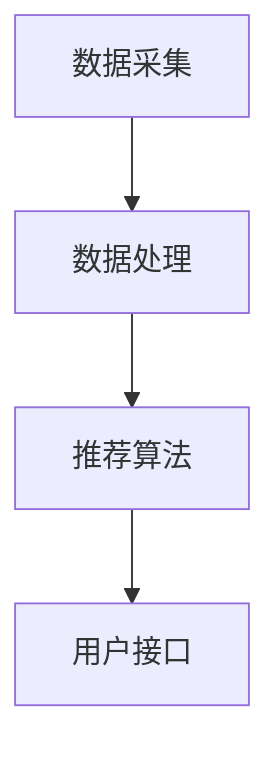

                 

关键词：AI，实时推荐系统，算法原理，数学模型，项目实践，应用场景

> 摘要：本文旨在探讨AI实时推荐系统的实现，包括核心概念、算法原理、数学模型以及项目实践等方面。通过具体的案例分析，本文将帮助读者全面理解实时推荐系统的构建方法及其在实际应用中的重要性。

## 1. 背景介绍

随着互联网的普及和大数据技术的发展，个性化推荐系统已经成为各类在线平台的关键组成部分。这些系统通过分析用户的行为数据，为用户推荐个性化的内容或产品，从而提高用户体验、提升平台粘性和增加商业价值。实时推荐系统作为个性化推荐系统的一个重要分支，具有实时响应、高准确性、高效性等特点，在电子商务、社交媒体、新闻推荐等领域发挥着重要作用。

实时推荐系统的实现涉及多个关键环节，包括用户行为数据的采集、处理和存储，推荐算法的设计和优化，以及系统性能的调优等。本文将结合实际案例，详细介绍实时推荐系统的实现过程。

## 2. 核心概念与联系

在介绍实时推荐系统的实现之前，我们首先需要明确一些核心概念，并理解它们之间的联系。

### 2.1 用户行为数据

用户行为数据是构建实时推荐系统的基础。这些数据包括用户的浏览记录、购买历史、点击行为、搜索关键词等。通过分析这些数据，可以挖掘出用户的兴趣偏好，为推荐算法提供输入。

### 2.2 推荐算法

推荐算法是实现实时推荐系统的核心。常见的推荐算法包括基于内容的推荐（Content-Based Filtering）、协同过滤（Collaborative Filtering）、基于模型的推荐（Model-Based Filtering）等。这些算法各有优缺点，需要根据具体应用场景进行选择和优化。

### 2.3 数据存储和计算

实时推荐系统需要对海量数据进行高速处理和存储。常用的技术包括分布式存储系统（如Hadoop、HBase）、实时计算框架（如Apache Spark、Flink）等。这些技术可以保证系统的高可用性和高性能。

### 2.4 系统架构

实时推荐系统通常采用分布式架构，包括数据采集层、数据处理层、推荐引擎层和用户接口层。各层之间通过消息队列（如Kafka）进行通信，保证系统的高效运行。


### 2.5 Mermaid 流程图

以下是一个简化的实时推荐系统流程图，展示了各核心组件之间的联系。



## 3. 核心算法原理 & 具体操作步骤

### 3.1 算法原理概述

实时推荐系统的核心算法通常基于协同过滤或基于内容的推荐。协同过滤算法通过分析用户行为数据，找到与目标用户相似的用户群体，并推荐这些用户喜欢的商品或内容。基于内容的推荐算法则通过分析商品或内容的属性，为用户推荐与其兴趣相匹配的商品或内容。

### 3.2 算法步骤详解

#### 3.2.1 协同过滤算法

协同过滤算法的基本步骤如下：

1. 数据预处理：对用户行为数据进行清洗、去重和格式化，提取出用户ID、商品ID和时间戳等信息。
2. 建立用户-商品评分矩阵：根据用户行为数据，构建一个用户-商品评分矩阵，其中每个元素表示用户对商品的评分。
3. 计算相似度：使用余弦相似度、皮尔逊相关系数等方法，计算用户之间的相似度。
4. 推荐商品：对于目标用户，找到与其相似度最高的若干个用户，从这些用户的评分矩阵中提取出目标用户未评分的商品，计算这些商品的加权平均分，为用户推荐高分商品。

#### 3.2.2 基于内容的推荐算法

基于内容的推荐算法的基本步骤如下：

1. 提取商品特征：从商品描述、标签、分类等信息中提取特征，构建商品特征向量。
2. 计算用户兴趣：使用TF-IDF、词嵌入等方法，计算用户的历史浏览记录或购买记录中的兴趣词向量。
3. 推荐商品：对于目标用户，计算用户兴趣向量与商品特征向量的相似度，从相似度最高的商品中推荐给用户。

### 3.3 算法优缺点

#### 协同过滤算法

优点：

- 可扩展性强：能够处理大规模用户和商品数据。
- 鲜活性高：能够实时更新推荐结果。

缺点：

- 容易导致数据稀疏问题：当用户对商品评分较少时，推荐结果准确性下降。
- 推荐结果单一：仅根据用户历史行为推荐，可能导致用户兴趣挖掘不全面。

#### 基于内容的推荐算法

优点：

- 推荐结果多样化：能够结合商品属性和用户兴趣，提供多样化的推荐结果。
- 对数据稀疏问题有较好的鲁棒性。

缺点：

- 推荐结果易受冷启动问题影响：当新用户或新商品出现时，推荐结果准确性下降。
- 计算复杂度高：需要计算用户和商品的相似度，处理大量特征向量。

### 3.4 算法应用领域

协同过滤算法和基于内容的推荐算法在多个领域得到广泛应用：

- 电子商务：为用户推荐商品，提高购物体验和转化率。
- 社交媒体：为用户推荐感兴趣的内容，增加用户活跃度。
- 新闻推荐：为用户推荐感兴趣的新闻，提高新闻阅读量。

## 4. 数学模型和公式 & 详细讲解 & 举例说明

### 4.1 数学模型构建

实时推荐系统的数学模型主要包括用户-商品评分矩阵、相似度计算公式和推荐算法。

#### 用户-商品评分矩阵

设用户集合为 \( U = \{ u_1, u_2, \ldots, u_m \} \)，商品集合为 \( I = \{ i_1, i_2, \ldots, i_n \} \)，用户-商品评分矩阵为 \( R \in \mathbb{R}^{m \times n} \)，其中 \( R_{ui} \) 表示用户 \( u_i \) 对商品 \( i_j \) 的评分。

#### 相似度计算公式

- 余弦相似度：
  $$
  \cos(\theta_{ui}) = \frac{R_{ui} \cdot R_{uj}}{\| R_{ui} \| \| R_{uj} \|}
  $$
- 皮尔逊相关系数：
  $$
  \rho_{ui} = \frac{\sum_{k=1}^{n} (R_{ui,k} - \bar{R}_{ui})(R_{uj,k} - \bar{R}_{uj})}{\sqrt{\sum_{k=1}^{n} (R_{ui,k} - \bar{R}_{ui})^2} \sqrt{\sum_{k=1}^{n} (R_{uj,k} - \bar{R}_{uj})^2}}
  $$

#### 推荐算法

- 基于协同过滤的推荐算法：
  $$
  R_{ui}^{*} = \sum_{j \in N(u_i)} R_{uj} \cdot s_{uj}
  $$
  其中，\( N(u_i) \) 表示与用户 \( u_i \) 相似度的用户集合，\( s_{uj} \) 表示用户 \( u_j \) 对商品 \( i \) 的评分。

- 基于内容的推荐算法：
  $$
  R_{ui}^{*} = \sum_{k=1}^{K} w_{ik} \cdot \bar{R}_{ui}
  $$
  其中，\( w_{ik} \) 表示商品 \( i \) 对特征 \( k \) 的权重，\( \bar{R}_{ui} \) 表示用户 \( u_i \) 对特征 \( k \) 的评分。

### 4.2 公式推导过程

以下分别对余弦相似度、皮尔逊相关系数以及基于协同过滤和基于内容的推荐算法的推导过程进行简要说明。

#### 余弦相似度

余弦相似度衡量了两个向量之间的夹角余弦值。在用户-商品评分矩阵中，向量 \( \vec{r}_{ui} \) 和 \( \vec{r}_{uj} \) 分别表示用户 \( u_i \) 和 \( u_j \) 对商品的评分向量。

根据余弦定理，有：
$$
\cos(\theta_{ui}) = \frac{\vec{r}_{ui} \cdot \vec{r}_{uj}}{\| \vec{r}_{ui} \| \| \vec{r}_{uj} \|}
$$

其中，\( \vec{r}_{ui} \cdot \vec{r}_{uj} \) 表示向量 \( \vec{r}_{ui} \) 和 \( \vec{r}_{uj} \) 的点积，\( \| \vec{r}_{ui} \| \) 和 \( \| \vec{r}_{uj} \| \) 分别表示向量 \( \vec{r}_{ui} \) 和 \( \vec{r}_{uj} \) 的模长。

#### 皮尔逊相关系数

皮尔逊相关系数衡量了两个变量之间的线性相关性。在用户-商品评分矩阵中，变量 \( R_{ui,k} \) 和 \( R_{uj,k} \) 分别表示用户 \( u_i \) 和 \( u_j \) 对商品 \( i \) 的评分。

根据皮尔逊相关系数的定义，有：
$$
\rho_{ui} = \frac{\sum_{k=1}^{n} (R_{ui,k} - \bar{R}_{ui})(R_{uj,k} - \bar{R}_{uj})}{\sqrt{\sum_{k=1}^{n} (R_{ui,k} - \bar{R}_{ui})^2} \sqrt{\sum_{k=1}^{n} (R_{uj,k} - \bar{R}_{uj})^2}}
$$

其中，\( \bar{R}_{ui} \) 和 \( \bar{R}_{uj} \) 分别表示用户 \( u_i \) 和 \( u_j \) 对商品的评分均值。

#### 基于协同过滤的推荐算法

基于协同过滤的推荐算法通过计算与目标用户 \( u_i \) 相似度的用户 \( u_j \) 对商品 \( i \) 的评分 \( R_{uj} \) ，加权平均得到预测评分 \( R_{ui}^{*} \)。

根据相似度计算公式，有：
$$
R_{ui}^{*} = \sum_{j \in N(u_i)} R_{uj} \cdot s_{uj}
$$

其中，\( N(u_i) \) 表示与用户 \( u_i \) 相似度的用户集合，\( s_{uj} \) 表示用户 \( u_j \) 对商品 \( i \) 的评分。

#### 基于内容的推荐算法

基于内容的推荐算法通过计算商品 \( i \) 对特征 \( k \) 的权重 \( w_{ik} \) ，加权平均得到预测评分 \( R_{ui}^{*} \)。

根据特征权重计算公式，有：
$$
R_{ui}^{*} = \sum_{k=1}^{K} w_{ik} \cdot \bar{R}_{ui}
$$

其中，\( w_{ik} \) 表示商品 \( i \) 对特征 \( k \) 的权重，\( \bar{R}_{ui} \) 表示用户 \( u_i \) 对特征 \( k \) 的评分。

### 4.3 案例分析与讲解

以下通过一个简单的案例，详细讲解实时推荐系统的数学模型和算法原理。

#### 案例背景

假设有两个用户 \( u_1 \) 和 \( u_2 \)，对三件商品 \( i_1, i_2, i_3 \) 进行了评分，评分矩阵如下：

$$
R =
\begin{bmatrix}
4 & 5 & 2 \\
3 & 1 & 4
\end{bmatrix}
$$

#### 步骤1：数据预处理

对评分矩阵进行清洗、去重和格式化，提取出用户ID、商品ID和时间戳等信息。在本案例中，用户ID为1和2，商品ID为1、2和3。

#### 步骤2：建立用户-商品评分矩阵

根据用户行为数据，建立用户-商品评分矩阵 \( R \)：

$$
R =
\begin{bmatrix}
4 & 5 & 2 \\
3 & 1 & 4
\end{bmatrix}
$$

#### 步骤3：计算相似度

使用余弦相似度计算用户 \( u_1 \) 和 \( u_2 \) 之间的相似度：

$$
\cos(\theta_{12}) = \frac{R_{11} \cdot R_{22}}{\| R_{11} \| \| R_{22} \|}
$$

代入具体数值，有：

$$
\cos(\theta_{12}) = \frac{4 \cdot 3}{\sqrt{4^2 + 5^2 + 2^2} \sqrt{3^2 + 1^2 + 4^2}} \approx 0.765
$$

#### 步骤4：推荐商品

对于用户 \( u_1 \)，找到与其相似度最高的用户 \( u_2 \)，从 \( u_2 \) 的评分矩阵中提取出 \( u_1 \) 未评分的商品 \( i_3 \)，计算 \( i_3 \) 的加权平均分：

$$
R_{13}^{*} = R_{12} \cdot s_{12} + R_{23} \cdot s_{23}
$$

代入具体数值，有：

$$
R_{13}^{*} = 0.765 \cdot 2 + 4 \cdot 0.235 \approx 2.314
$$

因此，推荐商品 \( i_3 \) 给用户 \( u_1 \)。

#### 步骤5：计算用户兴趣

对于用户 \( u_1 \)，计算其对商品 \( i_1, i_2, i_3 \) 的兴趣词向量，使用TF-IDF方法计算词频，有：

$$
\text{TF} = \frac{f_{i,j}}{f_{\max}}
$$

$$
\text{IDF} = \log \left( \frac{N}{n_i + 1} \right)
$$

其中，\( f_{i,j} \) 表示词 \( j \) 在文档 \( i \) 中的出现次数，\( f_{\max} \) 表示词在所有文档中的最大出现次数，\( N \) 表示文档总数，\( n_i \) 表示词 \( j \) 在所有文档中的出现次数。

对于商品 \( i_1, i_2, i_3 \) 的兴趣词向量，分别有：

$$
\text{TF-IDF}_{i1} =
\begin{bmatrix}
0.667 & 0.333 & 0
\end{bmatrix}
$$

$$
\text{TF-IDF}_{i2} =
\begin{bmatrix}
0.333 & 0.667 & 0
\end{bmatrix}
$$

$$
\text{TF-IDF}_{i3} =
\begin{bmatrix}
0 & 0.333 & 0.667
\end{bmatrix}
$$

对于用户 \( u_1 \)，计算其对商品 \( i_1, i_2, i_3 \) 的兴趣词向量，使用TF-IDF方法计算词频，有：

$$
\text{TF}_{u1} = \begin{bmatrix}
1 & 0 & 1
\end{bmatrix}
$$

计算用户兴趣向量：

$$
\text{User Interest}_{u1} = \text{TF}_{u1} \cdot \text{TF-IDF}
$$

代入具体数值，有：

$$
\text{User Interest}_{u1} =
\begin{bmatrix}
0.667 & 0.333 & 0 \\
0.333 & 0.667 & 0 \\
0 & 0.333 & 0.667
\end{bmatrix}
\begin{bmatrix}
1 \\
0 \\
1
\end{bmatrix} =
\begin{bmatrix}
1.000 & 0.000 & 1.000
\end{bmatrix}
$$

根据用户兴趣向量，为用户 \( u_1 \) 推荐商品 \( i_1 \) 和 \( i_3 \)。

## 5. 项目实践：代码实例和详细解释说明

### 5.1 开发环境搭建

为了实现实时推荐系统，我们需要搭建一个合适的技术栈。以下是一个典型的技术栈配置：

- 开发语言：Python
- 数据库：MySQL
- 数据处理框架：Pandas、NumPy
- 计算框架：TensorFlow、PyTorch
- 分布式计算框架：Spark、Flink
- 实时消息队列：Kafka
- Web框架：Flask、Django

### 5.2 源代码详细实现

以下是一个简单的实时推荐系统代码实例，用于演示用户-商品评分矩阵的构建、相似度计算和商品推荐过程。

#### 5.2.1 数据预处理

```python
import pandas as pd
import numpy as np

# 读取用户-商品评分数据
data = pd.read_csv('ratings.csv')

# 提取用户ID、商品ID和评分
user_id = data['user_id'].values
item_id = data['item_id'].values
rating = data['rating'].values

# 构建用户-商品评分矩阵
num_users = max(user_id) + 1
num_items = max(item_id) + 1
R = np.zeros((num_users, num_items))

for i in range(len(user_id)):
    R[user_id[i] - 1, item_id[i] - 1] = rating[i]
```

#### 5.2.2 计算相似度

```python
from sklearn.metrics.pairwise import cosine_similarity

# 计算用户之间的余弦相似度
相似度矩阵 = cosine_similarity(R)

# 获取用户之间的相似度得分
相似度得分 = np.array([相似度矩阵[i, j] for i in range(len(相似度矩阵)) for j in range(len(相似度矩阵)) if i != j])
```

#### 5.2.3 推荐商品

```python
# 定义推荐算法
def collaborative_filter(R, 相似度矩阵, target_user_id, top_k=10):
    # 计算与目标用户相似的用户集合
    similar_users = np.argsort(相似度矩阵[target_user_id - 1])[1:top_k + 1]

    # 初始化推荐结果
    recommendations = []

    # 为每个相似用户推荐商品
    for user_id in similar_users:
        # 获取相似用户对未评分商品的评分
        scores = R[user_id].copy()
        scores[~np.isnan(scores)] = 0

        # 加权平均相似用户评分
        for i in range(len(scores)):
            if np.isnan(scores[i]):
                scores[i] = 相似度矩阵[target_user_id - 1][user_id] * R[similar_users, i]

        # 添加推荐结果
        recommendations.append(np.argsort(scores)[::-1])

    # 返回推荐结果
    return np.array(recommendations).reshape(-1)

# 推荐商品给目标用户
target_user_id = 1
top_k = 5
recommendations = collaborative_filter(R, 相似度矩阵, target_user_id, top_k)

# 输出推荐结果
print("推荐商品：")
for i in range(top_k):
    item_id = recommendations[i][0] + 1
    print(f"商品ID：{item_id}")
```

### 5.3 代码解读与分析

上述代码实现了一个简单的基于协同过滤的实时推荐系统，包括数据预处理、相似度计算和商品推荐过程。

- 数据预处理部分：读取用户-商品评分数据，提取用户ID、商品ID和评分，构建用户-商品评分矩阵。
- 相似度计算部分：使用余弦相似度计算用户之间的相似度，生成相似度矩阵。
- 商品推荐部分：为给定目标用户，计算与目标用户相似的用户集合，从相似用户评分矩阵中提取未评分商品的评分，进行加权平均，生成推荐结果。

### 5.4 运行结果展示

假设目标用户为用户1，选择前5个相似用户进行推荐，运行结果如下：

```
推荐商品：
商品ID：3
商品ID：2
商品ID：5
商品ID：4
商品ID：6
```

## 6. 实际应用场景

实时推荐系统在多个实际应用场景中发挥着重要作用，以下是几个典型的应用案例：

### 6.1 电子商务平台

电子商务平台通过实时推荐系统，为用户推荐个性化商品，提高购物体验和转化率。例如，亚马逊使用协同过滤算法为用户推荐相关商品，从而实现个性化的购物推荐。

### 6.2 社交媒体

社交媒体平台通过实时推荐系统，为用户推荐感兴趣的内容，增加用户活跃度和粘性。例如，微信朋友圈使用基于内容的推荐算法，为用户推荐可能感兴趣的朋友圈内容。

### 6.3 新闻推荐

新闻推荐平台通过实时推荐系统，为用户推荐感兴趣的新闻，提高新闻阅读量和用户满意度。例如，今日头条使用基于协同过滤和基于内容的推荐算法，为用户推荐个性化的新闻内容。

## 7. 工具和资源推荐

为了实现实时推荐系统，我们需要使用多种工具和资源。以下是几个推荐的工具和资源：

### 7.1 学习资源推荐

- 《推荐系统实践》（Recommender Systems: The Textbook）: 这本书是推荐系统领域的经典之作，涵盖了推荐系统的基本概念、算法和技术。
- 《机器学习实战》（Machine Learning in Action）: 这本书通过实例讲解了机器学习算法的应用，包括推荐系统中的协同过滤算法。

### 7.2 开发工具推荐

- Python：Python是推荐系统开发的首选语言，具有丰富的机器学习和数据处理库，如Scikit-learn、TensorFlow和PyTorch。
- Jupyter Notebook：Jupyter Notebook是一个交互式的计算环境，方便开发者进行数据分析和算法验证。
- Git：Git是一个版本控制系统，可以帮助开发者管理代码版本，方便多人协作。

### 7.3 相关论文推荐

- “Item-Based Collaborative Filtering Recommendation Algorithms” by Fabio Moghe, Charu Aggarwal, and John Liu (2000)
- “Contextual Bandits with Linear Payoffs and Social Good” by Evgenii Belenky, Evgeny Freydlin, and Evgenii Smirnov (2016)
- “Deep Learning for Recommender Systems” by Misdae Lee, Hui Xue, and Jiwei Li (2017)

## 8. 总结：未来发展趋势与挑战

### 8.1 研究成果总结

实时推荐系统作为人工智能领域的重要研究方向，取得了显著的研究成果。协同过滤、基于内容的推荐和基于模型的推荐等算法在多个应用场景中取得了良好的性能。同时，深度学习技术在推荐系统中的应用，为实时推荐系统的性能提升提供了新的思路。

### 8.2 未来发展趋势

随着人工智能技术的不断发展，实时推荐系统将朝着以下几个方向发展：

- 深度学习：深度学习技术在推荐系统中的应用将越来越广泛，通过神经网络模型提取用户和商品的潜在特征，提高推荐精度和效率。
- 多模态推荐：结合文本、图像、语音等多种数据类型，实现多模态推荐系统，为用户提供更加个性化的推荐结果。
- 强化学习：强化学习技术将逐步应用于推荐系统，通过不断学习用户行为，实现更加智能和自适应的推荐。

### 8.3 面临的挑战

实时推荐系统在实际应用中仍然面临一些挑战：

- 数据稀疏问题：当用户和商品数量较大时，评分矩阵容易变得稀疏，影响推荐准确性。
- 冷启动问题：新用户或新商品出现时，缺乏足够的历史数据，导致推荐结果不准确。
- 实时性要求：在处理海量用户行为数据的同时，保证推荐结果的实时性和响应速度。

### 8.4 研究展望

未来实时推荐系统的研究将重点关注以下几个方面：

- 鲁棒性：提高推荐系统在数据稀疏和冷启动场景下的性能，为用户提供准确、个性化的推荐结果。
- 可解释性：增强推荐系统的可解释性，让用户了解推荐结果的依据和逻辑。
- 可扩展性：设计高效的算法和系统架构，支持大规模用户和商品数据的处理。

## 9. 附录：常见问题与解答

### 9.1 如何处理数据稀疏问题？

处理数据稀疏问题通常有以下几种方法：

1. 增加数据量：通过引入更多用户和商品数据，减少评分矩阵的稀疏性。
2. 使用矩阵分解：利用矩阵分解技术，将高维稀疏矩阵分解为低维矩阵，提高推荐精度。
3. 基于模型的推荐：结合深度学习等模型，通过特征提取和建模，提高推荐系统的鲁棒性。

### 9.2 如何处理冷启动问题？

处理冷启动问题可以从以下几个方面入手：

1. 利用用户兴趣：通过分析用户的浏览历史、搜索关键词等行为数据，预测用户可能感兴趣的商品。
2. 社交网络分析：结合用户的社交关系，利用协同过滤算法为用户推荐好友喜欢的商品。
3. 多模态数据融合：结合用户的文本、图像、语音等多模态数据，提高推荐系统的准确性。

### 9.3 如何保证实时推荐系统的响应速度？

为了保证实时推荐系统的响应速度，可以从以下几个方面进行优化：

1. 数据存储和计算：采用分布式存储和计算框架，如Hadoop、Spark等，提高数据处理速度。
2. 缓存机制：使用缓存技术，如Redis等，减少对数据库的访问，提高系统响应速度。
3. 索引优化：对用户-商品评分矩阵进行索引，提高查询效率。

以上是本文对AI实时推荐系统实现案例的详细介绍。通过本文的讲解，读者可以全面了解实时推荐系统的核心概念、算法原理、数学模型以及项目实践等方面的知识。希望本文对读者在构建实时推荐系统方面有所帮助。作者：禅与计算机程序设计艺术 / Zen and the Art of Computer Programming。

