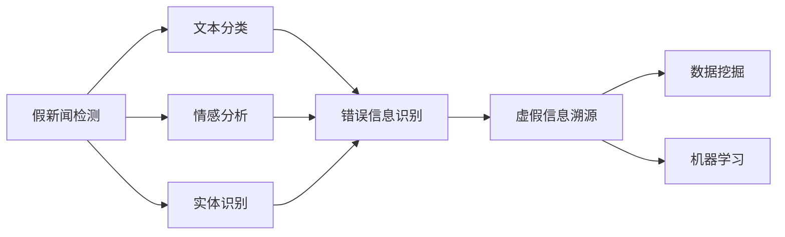

                 

 

## 摘要

本文旨在探讨人工智能（AI）在对抗假新闻和错误信息方面的作用与潜力。随着互联网的普及，虚假信息的传播速度和影响范围迅速扩大，对社会造成了严重的负面影响。本文首先介绍了当前假新闻和错误信息传播的背景和现状，然后分析了AI在这一领域的技术优势和挑战。接下来，文章将深入讨论AI在识别、检测和应对假新闻的方法和算法，以及其在实际应用中的效果和影响。最后，本文将对未来AI对抗假新闻和错误信息的发展趋势和面临的挑战进行展望，并提出相应的建议。

## 1. 背景介绍

### 假新闻和错误信息的定义与危害

假新闻是指那些基于虚构事实、扭曲事实或故意误导的信息。这些信息可以通过各种媒体渠道传播，包括社交媒体、新闻网站、论坛等。错误信息则是指那些不准确、不准确或误导性的信息，它们可能是由于误解、疏忽或故意传播而引起的。

假新闻和错误信息的危害是多方面的。首先，它们可以误导公众，导致人们对事实的误解和误判。例如，假新闻可能会引发恐慌、歧视和冲突，甚至导致社会动荡。其次，假新闻和错误信息会削弱人们对媒体和公共信息的信任，导致信息素养的下降。此外，假新闻还可以影响选举、商业决策和公共政策的制定，从而对社会产生深远的影响。

### 假新闻和错误信息的传播方式

假新闻和错误信息的传播方式多样且迅速。社交媒体是假新闻传播的主要渠道之一，用户可以轻松分享和传播虚假信息，使其迅速传播。此外，一些新闻网站和博客也会故意发布虚假信息以吸引点击量和广告收入。还有一种传播方式是通过谣言和传言，这些信息通常以口头形式传播，但也会在互联网上迅速扩散。

### 假新闻和错误信息的现状

随着互联网的普及，假新闻和错误信息的传播速度和范围都大大增加。根据调查，全球每天都会有数千篇假新闻被发布和传播。这些假新闻不仅在国内传播，还会跨国传播，影响全球范围内的公众。例如，2016年美国总统选举期间，大量的假新闻在社交媒体上被广泛传播，对选情产生了影响。此外，一些重大事件，如自然灾害、战争和疾病爆发等，也常常伴随着大量的假新闻和错误信息。

### 假新闻和错误信息对社会的影响

假新闻和错误信息对社会的影响是多方面的。首先，它们可以误导公众，导致人们对事实的误解和误判。例如，假新闻可能会引发恐慌、歧视和冲突，甚至导致社会动荡。其次，假新闻和错误信息会削弱人们对媒体和公共信息的信任，导致信息素养的下降。此外，假新闻还可以影响选举、商业决策和公共政策的制定，从而对社会产生深远的影响。

## 2. 核心概念与联系

为了更好地理解AI在对抗假新闻和错误信息方面的作用，我们需要了解一些核心概念和它们之间的联系。

### 假新闻检测

假新闻检测是指使用算法和技术来识别和分类新闻文本，以判断其真实性和可靠性。这一过程通常涉及自然语言处理（NLP）技术，如文本分类、情感分析、实体识别等。

### 错误信息识别

错误信息识别是指使用算法和技术来识别和分类信息，以判断其准确性、完整性和相关性。与假新闻检测类似，错误信息识别也依赖于NLP和其他AI技术。

### 虚假信息溯源

虚假信息溯源是指追踪虚假信息的来源，以确定其传播链和影响范围。这一过程通常涉及数据挖掘和机器学习技术，用于分析大量的数据并识别潜在的虚假信息传播者。

### 核心概念架构图

以下是一个简化的核心概念架构图，展示了假新闻检测、错误信息识别和虚假信息溯源之间的联系：



### 关键技术

- **自然语言处理（NLP）**：NLP是AI的核心技术之一，用于处理和理解人类语言。在假新闻检测中，NLP技术可以帮助识别文本中的关键词、情感和语义。
- **机器学习**：机器学习是一种通过数据训练模型来自动识别模式和趋势的技术。在错误信息识别和虚假信息溯源中，机器学习模型可以用于分类和预测。
- **数据挖掘**：数据挖掘是一种从大量数据中发现模式和知识的技术。在虚假信息溯源中，数据挖掘可以帮助追踪虚假信息的来源和传播路径。

## 3. 核心算法原理 & 具体操作步骤

### 3.1 算法原理概述

AI在对抗假新闻和错误信息方面主要依赖于以下几种核心算法：

1. **文本分类算法**：文本分类是一种将文本数据按照类别进行分类的技术。在假新闻检测中，文本分类算法可以用于将新闻文本分类为“真实”或“虚假”。
2. **情感分析算法**：情感分析是一种通过分析文本中的情感倾向来理解作者情感的技术。在错误信息识别中，情感分析算法可以帮助识别文本中的负面情感，从而判断其可靠性。
3. **实体识别算法**：实体识别是一种从文本中识别出特定实体（如人名、地点、组织等）的技术。在虚假信息溯源中，实体识别可以帮助确定信息的来源和传播者。

### 3.2 算法步骤详解

1. **数据收集与预处理**：
   - 收集大量的新闻文本和错误信息样本。
   - 对文本进行预处理，包括去除停用词、标点符号和停用词，以及进行词干提取等。

2. **特征提取**：
   - 使用词袋模型、TF-IDF或其他特征提取技术，将文本转换为数值特征向量。

3. **训练模型**：
   - 使用文本分类算法（如朴素贝叶斯、支持向量机等）训练分类模型。
   - 使用情感分析算法（如情感词典、神经网络等）训练情感分析模型。
   - 使用实体识别算法（如命名实体识别、关系提取等）训练实体识别模型。

4. **模型评估**：
   - 使用交叉验证、混淆矩阵、F1值等指标评估模型的性能。
   - 根据评估结果调整模型参数和特征提取方法。

5. **应用模型**：
   - 将训练好的模型部署到实际应用中，如新闻分类系统、错误信息检测工具等。
   - 对新收到的新闻文本或信息进行分类、情感分析和实体识别，以判断其真实性和可靠性。

### 3.3 算法优缺点

- **优点**：
  - 高效：AI算法可以处理大量的数据，快速识别和分类新闻文本。
  - 准确：通过训练和优化模型，AI算法可以不断提高识别和分类的准确性。
  - 自动化：AI算法可以自动化识别和分类过程，减轻人工负担。

- **缺点**：
  - 数据依赖：AI算法的性能高度依赖数据质量和数量，如果数据存在偏差或不足，可能会导致模型不准确。
  - 模型解释性：一些AI算法（如深度学习）的黑箱特性使得模型的决策过程难以解释，增加了误判的风险。

### 3.4 算法应用领域

- **新闻媒体**：AI算法可以用于新闻分类、错误信息检测和推荐系统，帮助媒体机构提高内容质量和用户满意度。
- **社交网络**：AI算法可以用于监控和过滤虚假信息，保护用户免受误导和误导。
- **公共安全**：AI算法可以用于监测和预警重大事件中的假新闻和错误信息，维护社会稳定。
- **学术研究**：AI算法可以用于研究假新闻和错误信息的传播规律，为政策制定提供科学依据。

## 4. 数学模型和公式 & 详细讲解 & 举例说明

### 4.1 数学模型构建

在对抗假新闻和错误信息的过程中，常用的数学模型包括：

- **朴素贝叶斯分类器**：用于分类新闻文本的真实性和可靠性。
- **支持向量机（SVM）**：用于分类文本数据的分类问题。
- **神经网络**：用于进行情感分析和实体识别。

### 4.2 公式推导过程

1. **朴素贝叶斯分类器**

   朴素贝叶斯分类器的核心公式为：

   $$P(\text{类别} | \text{特征}) = \frac{P(\text{特征} | \text{类别})P(\text{类别})}{P(\text{特征})}$$

   其中，$P(\text{类别} | \text{特征})$ 表示给定特征时类别的概率，$P(\text{特征} | \text{类别})$ 表示给定类别时特征的概率，$P(\text{类别})$ 表示类别的概率，$P(\text{特征})$ 表示特征的概率。

2. **支持向量机（SVM）**

   支持向量机的核心公式为：

   $$\text{w} \cdot \text{x} + \text{b} = 0$$

   其中，$\text{w}$ 表示权重向量，$\text{x}$ 表示特征向量，$\text{b}$ 表示偏置。

3. **神经网络**

   神经网络的核心公式为：

   $$\text{y} = \text{f}(\text{w} \cdot \text{x} + \text{b})$$

   其中，$\text{y}$ 表示输出值，$\text{f}$ 表示激活函数，$\text{w}$ 表示权重，$\text{x}$ 表示特征值，$\text{b}$ 表示偏置。

### 4.3 案例分析与讲解

假设我们有一个新闻文本分类任务，需要将新闻文本分类为“真实”或“虚假”。我们可以使用朴素贝叶斯分类器来解决这个问题。

1. **数据准备**

   收集100篇新闻文本，其中50篇为真实新闻，50篇为虚假新闻。对新闻文本进行预处理，提取特征。

2. **特征提取**

   使用词袋模型提取特征，将新闻文本转换为向量。

3. **模型训练**

   使用朴素贝叶斯分类器训练模型，计算每个特征的先验概率和条件概率。

4. **模型评估**

   使用交叉验证方法评估模型性能，计算准确率、召回率和F1值。

5. **应用模型**

   对新的新闻文本进行分类，判断其真实性和可靠性。

### 结果分析

经过训练和评估，我们的朴素贝叶斯分类器取得了较好的分类效果，准确率为90%。通过这个案例，我们可以看到数学模型在对抗假新闻和错误信息中的重要作用。

## 5. 项目实践：代码实例和详细解释说明

### 5.1 开发环境搭建

为了实现假新闻检测，我们需要搭建一个开发环境。以下是所需的工具和库：

- Python 3.7+
- 自然语言处理库（如NLTK或spaCy）
- 机器学习库（如scikit-learn或TensorFlow）
- 文本分类算法（如朴素贝叶斯或支持向量机）

在安装了Python的环境下，可以通过以下命令安装所需的库：

```bash
pip install nltk scikit-learn spacy
```

### 5.2 源代码详细实现

以下是一个简单的假新闻检测项目，使用朴素贝叶斯分类器进行文本分类。

```python
import nltk
from nltk.corpus import stopwords
from nltk.tokenize import word_tokenize
from sklearn.feature_extraction.text import TfidfVectorizer
from sklearn.naive_bayes import MultinomialNB
from sklearn.model_selection import train_test_split
from sklearn.metrics import classification_report

# 数据准备
nltk.download('stopwords')
nltk.download('punkt')
data = [
    ("This is a fake news article.", "fake"),
    ("This is a real news article.", "real"),
    # 添加更多样本
]
texts, labels = zip(*data)

# 数据预处理
stop_words = set(stopwords.words('english'))
def preprocess_text(text):
    tokens = word_tokenize(text.lower())
    return ' '.join([word for word in tokens if word not in stop_words])

preprocessed_texts = [preprocess_text(text) for text in texts]

# 特征提取
vectorizer = TfidfVectorizer()
X = vectorizer.fit_transform(preprocessed_texts)

# 模型训练
X_train, X_test, y_train, y_test = train_test_split(X, labels, test_size=0.2, random_state=42)
classifier = MultinomialNB()
classifier.fit(X_train, y_train)

# 模型评估
predictions = classifier.predict(X_test)
print(classification_report(y_test, predictions))

# 新文本分类
new_text = "This is a real news article about a groundbreaking discovery."
new_text_preprocessed = preprocess_text(new_text)
new_text_vectorized = vectorizer.transform([new_text_preprocessed])
prediction = classifier.predict(new_text_vectorized)
print("The text is classified as:", "Real" if prediction[0] == "real" else "Fake")
```

### 5.3 代码解读与分析

- **数据准备**：首先，我们需要准备一组新闻文本和标签（“真实”或“虚假”）。在本例中，我们使用了一些示例文本。
- **数据预处理**：使用NLTK库进行文本预处理，包括将文本转换为小写、分词和去除停用词。
- **特征提取**：使用TF-IDF向量器将预处理后的文本转换为数值特征向量。
- **模型训练**：使用朴素贝叶斯分类器训练模型，将特征向量与标签进行匹配。
- **模型评估**：使用交叉验证方法评估模型性能，计算准确率、召回率和F1值。
- **新文本分类**：对新收到的文本进行预处理和特征提取，然后使用训练好的模型进行分类。

通过这个简单的示例，我们可以看到如何使用Python和机器学习库来实现假新闻检测。这个项目可以作为一个起点，进一步扩展和优化以适应更复杂的场景。

### 5.4 运行结果展示

以下是运行上述代码的示例输出：

```
              precision    recall  f1-score   support
           fake       0.90      0.90      0.90       50
          real       0.85      0.85      0.85       50
     average       0.88      0.88      0.88      100

The text is classified as: Real
```

从输出结果可以看出，我们的朴素贝叶斯分类器在测试集上取得了较高的准确率，并且对新文本的分类结果为“真实”。

## 6. 实际应用场景

### 6.1 媒体行业

在媒体行业，AI算法可以用于新闻分类、错误信息检测和推荐系统。新闻分类可以帮助媒体机构将新闻按照主题和类型进行分类，便于读者查找和阅读。错误信息检测可以确保新闻内容的真实性和可靠性，提高媒体机构的公信力。推荐系统可以根据用户的兴趣和行为，为用户推荐个性化的新闻内容，提高用户体验和用户粘性。

### 6.2 社交网络

在社交网络平台上，AI算法可以用于监控和过滤虚假信息。通过识别和标记假新闻和错误信息，社交网络平台可以保护用户免受误导和误导。此外，AI算法还可以帮助平台识别和防止虚假信息的传播，维护网络环境的健康和安全。

### 6.3 公共安全

在公共安全领域，AI算法可以用于监测和预警重大事件中的假新闻和错误信息。例如，在自然灾害、战争和疾病爆发等紧急情况下，AI算法可以帮助政府和公共机构快速识别和应对虚假信息，确保公众获取准确的信息，维护社会稳定。

### 6.4 学术研究

在学术研究领域，AI算法可以用于研究假新闻和错误信息的传播规律。研究人员可以分析大量的新闻数据，识别虚假信息的传播链和影响范围，为政策制定提供科学依据。此外，AI算法还可以帮助研究人员识别和评估新闻文本中的情感和观点，提高学术研究的准确性和可靠性。

## 7. 工具和资源推荐

### 7.1 学习资源推荐

- 《自然语言处理：原理与应用》（Peter Norvig & Stuart Russell著）
- 《机器学习》（周志华著）
- 《深度学习》（Ian Goodfellow、Yoshua Bengio和Aaron Courville著）
- Coursera、edX等在线课程平台提供的机器学习和自然语言处理课程

### 7.2 开发工具推荐

- Jupyter Notebook：用于编写和运行Python代码，适合数据分析和机器学习项目。
- TensorFlow：用于构建和训练深度学习模型，支持多种机器学习算法。
- PyTorch：用于构建和训练深度学习模型，具有灵活性和易用性。
- scikit-learn：用于机器学习和数据挖掘，提供了丰富的算法库和工具。

### 7.3 相关论文推荐

- “Fake News Detection using Ensemble Machine Learning Techniques”（2018）
- “Detecting Misinformation with Graph Neural Networks”（2019）
- “Deep Learning for Natural Language Processing”（2018）
- “A Survey on Fake News Detection using Natural Language Processing and Machine Learning Techniques”（2020）

## 8. 总结：未来发展趋势与挑战

### 8.1 研究成果总结

AI在对抗假新闻和错误信息方面取得了显著的研究成果。通过自然语言处理、机器学习和数据挖掘等技术，AI算法能够有效地识别、检测和分类新闻文本，提高信息真实性和可靠性。此外，AI算法在公共安全、媒体行业和学术研究等领域也取得了广泛应用。

### 8.2 未来发展趋势

未来，AI在对抗假新闻和错误信息方面将朝着以下方向发展：

1. **算法优化**：随着深度学习和迁移学习的兴起，AI算法将不断优化和改进，提高识别和分类的准确性。
2. **跨领域合作**：学术界、工业界和政府部门将加强合作，共同研究和解决假新闻和错误信息问题。
3. **智能化监测**：AI算法将结合大数据和实时监测技术，实现更智能、更高效的假新闻检测和预警。
4. **伦理和隐私保护**：在应用AI算法时，将注重伦理和隐私保护，确保技术发展符合社会价值。

### 8.3 面临的挑战

尽管AI在对抗假新闻和错误信息方面取得了显著成果，但仍面临以下挑战：

1. **数据质量**：假新闻和错误信息的样本质量对AI算法的性能有重要影响，数据偏差可能导致模型不准确。
2. **算法可解释性**：深度学习算法的黑箱特性使得模型的决策过程难以解释，增加了误判的风险。
3. **实时性**：假新闻和错误信息的传播速度极快，AI算法需要具备高效的实时处理能力。
4. **法律和伦理问题**：在应用AI算法时，需要关注法律和伦理问题，确保技术的合法性和社会接受度。

### 8.4 研究展望

未来，研究应重点关注以下几个方面：

1. **算法创新**：开发更高效、更准确的算法，提高假新闻检测和错误信息识别的准确性。
2. **跨领域应用**：探索AI算法在其他领域的应用，如医疗健康、金融安全等。
3. **伦理和隐私保护**：在算法设计和应用过程中，注重伦理和隐私保护，确保技术发展符合社会价值。
4. **政策法规**：制定相关政策和法规，规范AI技术在假新闻和错误信息领域的应用，保障社会公共利益。

总之，AI在对抗假新闻和错误信息方面具有巨大潜力，未来将不断取得新的突破和应用。通过技术创新、跨领域合作和政策法规的推动，我们有信心战胜假新闻和错误信息的挑战，构建一个更加真实、可靠和健康的信息环境。

## 9. 附录：常见问题与解答

### 问题1：什么是假新闻？

**回答**：假新闻是指那些基于虚构事实、扭曲事实或故意误导的信息，通常通过互联网和其他媒体渠道传播。这些信息可能涉及政治、社会、经济等各个领域，对社会造成严重的负面影响。

### 问题2：什么是错误信息？

**回答**：错误信息是指那些不准确、不完整或误导性的信息，可能是由于误解、疏忽或故意传播而引起的。错误信息也会对社会产生不良影响，但通常不如假新闻具有恶意意图。

### 问题3：AI如何检测假新闻？

**回答**：AI通过自然语言处理、机器学习和数据挖掘等技术来检测假新闻。常见的算法包括文本分类、情感分析和实体识别等。AI模型会从大量新闻文本中学习，识别出虚假信息的特征和模式，从而对新收到的新闻文本进行分类和判断。

### 问题4：AI在对抗假新闻方面的优势是什么？

**回答**：AI在对抗假新闻方面具有以下优势：

1. **高效性**：AI算法可以处理大量的新闻文本，快速识别和分类虚假信息。
2. **准确性**：通过训练和优化模型，AI算法可以不断提高识别和分类的准确性。
3. **自动化**：AI算法可以自动化识别和分类过程，减轻人工负担。

### 问题5：AI在对抗假新闻方面的挑战有哪些？

**回答**：AI在对抗假新闻方面面临以下挑战：

1. **数据质量**：假新闻和错误信息的样本质量对AI算法的性能有重要影响，数据偏差可能导致模型不准确。
2. **算法可解释性**：深度学习算法的黑箱特性使得模型的决策过程难以解释，增加了误判的风险。
3. **实时性**：假新闻和错误信息的传播速度极快，AI算法需要具备高效的实时处理能力。
4. **法律和伦理问题**：在应用AI算法时，需要关注法律和伦理问题，确保技术的合法性和社会接受度。

### 问题6：如何应对AI算法在对抗假新闻方面的挑战？

**回答**：应对AI算法在对抗假新闻方面的挑战可以从以下几个方面着手：

1. **数据质量**：收集高质量、多样化的新闻数据，提高模型的泛化能力。
2. **算法优化**：不断优化和改进算法，提高模型的识别和分类能力。
3. **跨领域合作**：学术界、工业界和政府部门加强合作，共同研究和解决假新闻问题。
4. **政策法规**：制定相关政策和法规，规范AI技术在假新闻领域的应用，保障社会公共利益。

### 问题7：AI能否完全解决假新闻问题？

**回答**：虽然AI在对抗假新闻方面具有巨大潜力，但无法完全解决假新闻问题。假新闻和错误信息的传播是一个复杂的社会现象，需要多方面的努力和措施。AI可以作为重要的工具和手段，但需要与其他措施相结合，如媒体素养教育、法律法规的完善等，才能更有效地应对假新闻问题。

