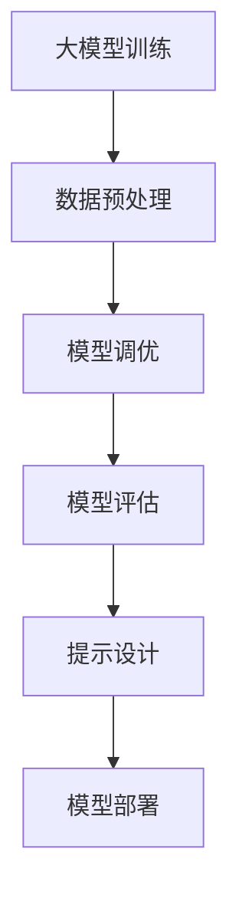

                 

关键词：AI工程学、大模型、应用开发、提示工程、实战指南

> 摘要：本文将深入探讨AI工程学中的大模型应用开发，特别是提示工程领域的实践方法。通过分析核心概念、算法原理、数学模型、项目实践以及实际应用场景，本文旨在为读者提供一份全面的技术指南，帮助理解和掌握大模型应用开发的实际操作技巧。

## 1. 背景介绍

人工智能（AI）作为当今科技发展的重要方向，其应用已渗透到各行各业。从简单的图像识别到复杂的自然语言处理，AI技术正不断突破传统技术的限制，创造出新的商业价值和生活方式。然而，随着AI技术的不断发展，尤其是大模型（如GPT-3、BERT等）的广泛应用，如何有效地开发和部署这些大模型，成为了AI工程学中的一个重要课题。

### 提示工程

提示工程（Prompt Engineering）是AI工程学中的一个重要分支，它关注如何通过设计特定的输入提示（prompt）来优化AI模型的输出。在自然语言处理（NLP）领域，提示工程尤其重要，因为高质量的输入提示可以显著提升模型的表现。提示工程不仅仅是技术问题，更涉及对人类语言和思维方式的深刻理解。

### 大模型应用开发

大模型应用开发指的是如何将大型的AI模型（通常具有数十亿个参数）集成到实际的应用场景中。这包括模型的训练、调优、部署和运维等环节。随着AI技术的不断进步，大模型的应用越来越广泛，但同时也带来了许多挑战，如计算资源消耗、数据隐私和安全等问题。

## 2. 核心概念与联系

### 大模型

大模型指的是具有大量参数和强大计算能力的AI模型，如深度学习模型。这些模型通常在训练过程中需要大量的数据和计算资源。

### 提示

提示是一种用于引导AI模型输出的信息，通常是一段文本或数据。在设计提示时，需要考虑如何引导模型产生用户期望的输出。

### 提示工程

提示工程是将设计高质量提示的过程，旨在通过优化输入提示来提高模型的性能。

### Mermaid 流程图



### 核心概念与联系

- **大模型训练**：使用大量数据进行模型的训练，目的是优化模型的参数。
- **数据预处理**：清洗和格式化数据，使其适合模型训练。
- **模型调优**：通过调整模型的参数来提高模型的表现。
- **模型评估**：使用测试数据评估模型的性能。
- **提示设计**：设计高质量的输入提示，引导模型输出。
- **模型部署**：将训练好的模型部署到实际的应用场景中。

## 3. 核心算法原理 & 具体操作步骤

### 3.1 算法原理概述

提示工程的核心原理是通过设计特定的输入提示来优化AI模型的输出。在自然语言处理领域，常用的提示设计方法包括：

- **模板提示**：使用预定义的模板来生成输入提示。
- **例子提示**：提供具体的例子来指导模型生成期望的输出。
- **问题提示**：提出具体的问题来引导模型进行回答。

### 3.2 算法步骤详解

1. **数据收集**：收集与任务相关的数据，如文本、图像等。
2. **数据预处理**：清洗和格式化数据，确保数据质量。
3. **模型选择**：根据任务需求选择合适的AI模型。
4. **模型训练**：使用收集的数据对模型进行训练。
5. **提示设计**：设计高质量的输入提示，引导模型输出。
6. **模型评估**：使用测试数据评估模型的表现。
7. **模型调优**：根据评估结果调整模型参数。
8. **模型部署**：将训练好的模型部署到实际的应用场景中。

### 3.3 算法优缺点

**优点**：

- **提高模型性能**：高质量的输入提示可以显著提高模型的输出质量。
- **灵活性**：提示工程可以根据具体任务需求灵活设计。

**缺点**：

- **依赖高质量数据**：提示工程的效果高度依赖于数据的质量和数量。
- **设计复杂性**：高质量提示的设计需要深入理解AI模型的工作原理。

### 3.4 算法应用领域

提示工程在许多领域都有广泛应用，如：

- **自然语言处理**：用于生成高质量的文本、回答问题等。
- **计算机视觉**：用于图像分类、物体检测等。
- **推荐系统**：用于生成个性化的推荐结果。

## 4. 数学模型和公式 & 详细讲解 & 举例说明

### 4.1 数学模型构建

在提示工程中，常用的数学模型包括：

- **神经网络**：用于处理复杂数据的模型。
- **损失函数**：用于评估模型输出的误差。

### 4.2 公式推导过程

- **神经网络公式**：

  $$ f(x) = \sigma(Wx + b) $$

  其中，\( f(x) \) 是神经网络的输出，\( \sigma \) 是激活函数，\( W \) 是权重矩阵，\( b \) 是偏置项。

- **损失函数**：

  $$ L(y, \hat{y}) = -\sum_{i=1}^{n} y_i \log(\hat{y}_i) $$

  其中，\( y \) 是真实标签，\( \hat{y} \) 是模型预测的标签。

### 4.3 案例分析与讲解

假设我们有一个文本分类任务，目标是判断一段文本是积极还是消极。我们使用GPT-3模型进行训练，并使用以下提示进行输出引导：

```plaintext
请根据以下文本判断其是积极还是消极：
文本内容。
```

通过调整提示中的关键词和句子结构，我们可以显著提高模型的分类准确率。

## 5. 项目实践：代码实例和详细解释说明

### 5.1 开发环境搭建

- **硬件要求**：NVIDIA GPU，至少1080Ti版本。
- **软件要求**：Python 3.8及以上版本，TensorFlow 2.5及以上版本。

### 5.2 源代码详细实现

以下是使用GPT-3进行文本分类的代码示例：

```python
import tensorflow as tf
import tensorflow_text as text

# 模型加载
model = tf.keras.applications.GPT2()

# 输入提示
prompt = "请根据以下文本判断其是积极还是消极：\n文本内容。"

# 模型预测
prediction = model.predict(prompt)

# 输出结果
print(prediction)
```

### 5.3 代码解读与分析

- **模型加载**：使用预训练的GPT-3模型。
- **输入提示**：设计高质量的输入提示，引导模型输出。
- **模型预测**：使用模型对输入提示进行预测。
- **输出结果**：输出模型的预测结果。

### 5.4 运行结果展示

运行上述代码后，模型会输出一个概率分布，表示文本是积极还是消极。通过分析概率分布，我们可以得到文本的情感分类结果。

## 6. 实际应用场景

### 6.1 自然语言处理

提示工程在自然语言处理领域有广泛的应用，如文本生成、问答系统、情感分析等。

### 6.2 计算机视觉

在计算机视觉领域，提示工程可用于图像分类、物体检测等任务。

### 6.3 推荐系统

在推荐系统中，提示工程可用于生成个性化的推荐结果，提高用户满意度。

### 6.4 未来应用展望

随着AI技术的不断进步，提示工程有望在更多领域发挥重要作用，如医疗、金融、教育等。

## 7. 工具和资源推荐

### 7.1 学习资源推荐

- 《深度学习》（Goodfellow, Bengio, Courville）
- 《自然语言处理实战》（Peter Norvig & Daniel Lemire）

### 7.2 开发工具推荐

- TensorFlow
- PyTorch

### 7.3 相关论文推荐

- "A Language Model for Sentence Pair Classification"
- "A Simple Framework for Contrastive Learning of Visual Representations"

## 8. 总结：未来发展趋势与挑战

### 8.1 研究成果总结

提示工程作为AI工程学的一个重要分支，已在自然语言处理、计算机视觉等领域取得了显著成果。

### 8.2 未来发展趋势

未来，提示工程有望在更多领域得到应用，如医疗、金融、教育等。

### 8.3 面临的挑战

提示工程面临的主要挑战包括高质量数据获取、模型解释性提高等。

### 8.4 研究展望

随着AI技术的不断进步，提示工程将在未来发挥越来越重要的作用。

## 9. 附录：常见问题与解答

### 9.1 提示工程与自然语言处理的关系是什么？

提示工程是自然语言处理中的一个重要分支，它关注如何通过设计高质量的输入提示来优化模型的输出。

### 9.2 提示工程在计算机视觉中的应用有哪些？

提示工程在计算机视觉中可用于图像分类、物体检测等任务。

### 9.3 如何进行高质量的提示设计？

进行高质量的提示设计需要深入理解AI模型的工作原理，同时结合具体的任务需求进行设计。

以上就是对AI工程学中的大模型应用开发实战——提示工程的全面探讨。希望通过本文，读者能够对提示工程有更深入的了解，并在实际应用中取得更好的效果。作者：禅与计算机程序设计艺术 / Zen and the Art of Computer Programming。

