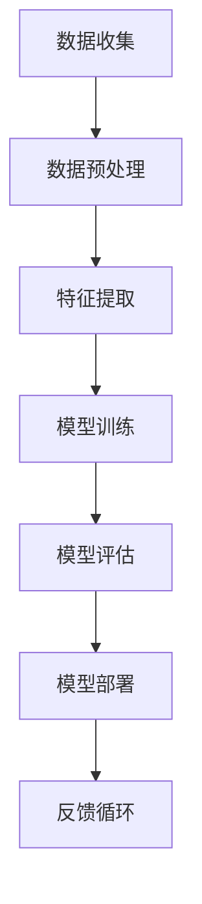

                 

关键词：AI工程学、开发实战、技术解析、算法原理、数学模型、代码实例、实际应用、未来展望

> 摘要：本文旨在深入解析AI工程学的开发实战，从核心概念、算法原理到实际应用，全面探讨AI技术在现代软件开发中的实践与应用。通过详细的数学模型讲解和代码实例展示，本文旨在为读者提供一幅完整的AI工程学开发图谱。

## 1. 背景介绍

随着人工智能（AI）技术的飞速发展，其在各行业中的应用也越来越广泛。AI不仅仅是一个理论研究领域，更是一个实践驱动的工程学领域。AI工程学的目标是实现高效、可靠的AI系统，使其在真实环境中具备良好的性能和稳定性。本文将从实际开发的角度，解析AI工程学中的关键概念、算法原理和实际应用，帮助读者了解如何将AI技术应用到实际项目中。

### 1.1 AI工程学的定义与重要性

AI工程学是一门跨学科领域，它结合了计算机科学、数学、统计学和工程学等知识，旨在构建和优化人工智能系统。与传统软件开发不同，AI工程学需要处理大量数据、复杂算法和高可扩展性。其重要性在于：

1. **实现AI技术的商业化应用**：将AI技术应用于现实问题，如智能推荐系统、自动驾驶和医疗诊断等，推动各行业的创新和发展。
2. **提高开发效率**：通过标准化流程和工具，加速AI系统的开发、测试和部署。
3. **保障系统稳定性**：在复杂环境下，确保AI系统的性能和可靠性。

### 1.2 AI工程学的发展历程

AI工程学的发展历程可以分为以下几个阶段：

1. **早期探索阶段**（20世纪50-70年代）：AI作为一个理论概念提出，但缺乏有效的算法和计算资源。
2. **符号主义阶段**（20世纪80年代）：以专家系统和逻辑推理为主，但由于其局限性，逐渐走向衰落。
3. **机器学习阶段**（20世纪90年代至今）：以大数据和算法优化为核心，机器学习成为AI工程学的主要驱动力。
4. **深度学习阶段**（21世纪初至今）：深度学习算法的突破，使得AI在图像识别、自然语言处理等领域取得了巨大进展。

## 2. 核心概念与联系

在AI工程学中，核心概念和联系是构建高效系统的基石。以下是一个简化的Mermaid流程图，展示了核心概念之间的联系。



### 2.1 数据收集（A）

数据收集是AI工程学的第一步，高质量的数据是构建优秀模型的基础。数据来源可以是公开数据集、企业内部数据或者通过传感器收集。

### 2.2 数据预处理（B）

数据预处理包括数据清洗、归一化和去噪等步骤，目的是提高数据的质量和一致性，为后续的特征提取和模型训练做好准备。

### 2.3 特征提取（C）

特征提取是将原始数据转换为适用于机器学习算法的表示。这一步骤通过选择和构造有效特征，提高了模型的泛化能力。

### 2.4 模型训练（D）

模型训练是AI工程学的核心步骤，通过优化算法和调整参数，使得模型能够在训练数据上取得良好的表现。

### 2.5 模型评估（E）

模型评估是检查模型性能的重要环节，常用的评估指标包括准确率、召回率和F1分数等。

### 2.6 模型部署（F）

模型部署是将训练好的模型应用到实际场景中。部署过程中，需要考虑模型的性能、可扩展性和可靠性。

### 2.7 反馈循环（G）

反馈循环是AI工程学中的一个重要环节，通过收集实际应用中的反馈数据，不断优化模型和系统。

## 3. 核心算法原理 & 具体操作步骤

### 3.1 算法原理概述

在AI工程学中，常用的核心算法包括决策树、支持向量机（SVM）和深度学习等。以下简要介绍这些算法的基本原理。

### 3.1.1 决策树

决策树是一种基于树结构的分类算法，通过将特征空间划分成多个子集，实现对数据的分类。

### 3.1.2 支持向量机（SVM）

SVM是一种二分类算法，通过寻找一个最佳的超平面，将不同类别的数据点最大化分离。

### 3.1.3 深度学习

深度学习是一种基于人工神经网络的算法，通过多层神经网络，实现对复杂数据的建模和预测。

### 3.2 算法步骤详解

以下以决策树算法为例，详细讲解其操作步骤。

### 3.2.1 数据准备

收集并准备数据，包括特征数据和标签数据。

### 3.2.2 特征选择

根据数据集的特点，选择适当的特征进行分类。

### 3.2.3 决策树构建

通过递归划分数据集，构建决策树模型。

### 3.2.4 模型评估

使用交叉验证等方法，评估模型的性能。

### 3.3 算法优缺点

决策树算法具有简单易理解、易于实现和计算效率高等优点，但也存在过拟合、可解释性差等缺点。

### 3.4 算法应用领域

决策树算法广泛应用于分类问题，如金融风险评估、医疗诊断和文本分类等。

## 4. 数学模型和公式 & 详细讲解 & 举例说明

在AI工程学中，数学模型是理解和实现算法的关键。以下以线性回归为例，讲解数学模型的基本概念、推导过程和实际应用。

### 4.1 数学模型构建

线性回归模型的基本假设是数据集可以表示为一条直线，即：

$$y = w_0 + w_1 \cdot x$$

其中，$y$ 是目标变量，$x$ 是输入变量，$w_0$ 和 $w_1$ 是模型参数。

### 4.2 公式推导过程

为了找到最佳拟合直线，我们需要最小化误差平方和。通过求导和设置偏导数为零，可以得到最佳参数：

$$\frac{\partial}{\partial w_0} \sum_{i=1}^{n} (y_i - (w_0 + w_1 \cdot x_i))^2 = 0$$

$$\frac{\partial}{\partial w_1} \sum_{i=1}^{n} (y_i - (w_0 + w_1 \cdot x_i))^2 = 0$$

通过求解上述方程组，可以得到最佳参数：

$$w_0 = \bar{y} - w_1 \cdot \bar{x}$$

$$w_1 = \frac{\sum_{i=1}^{n} (x_i - \bar{x})(y_i - \bar{y})}{\sum_{i=1}^{n} (x_i - \bar{x})^2}$$

### 4.3 案例分析与讲解

假设我们有一个简单的数据集，其中包含三个特征（$x_1, x_2, x_3$）和一个目标变量（$y$）。我们希望使用线性回归模型预测 $y$ 的值。

数据集如下：

| $x_1$ | $x_2$ | $x_3$ | $y$ |
|-------|-------|-------|-----|
| 1     | 2     | 3     | 5   |
| 2     | 4     | 6     | 8   |
| 3     | 6     | 9     | 12  |

通过线性回归模型，我们可以得到以下参数：

$$w_0 = 5 - (2/3) \cdot 5 = 3.33$$

$$w_1 = \frac{(1-5/3)(5-5/3) + (2-5/3)(8-5/3) + (3-5/3)(12-5/3)}{(1-5/3)^2 + (2-5/3)^2 + (3-5/3)^2} \approx 1.5$$

因此，线性回归模型为：

$$y = 3.33 + 1.5 \cdot x$$

使用这个模型，我们可以预测新数据的 $y$ 值。例如，对于 $x = (4, 6, 9)$，预测的 $y$ 值为：

$$y = 3.33 + 1.5 \cdot (4 + 6 + 9) = 19.83$$

## 5. 项目实践：代码实例和详细解释说明

为了更好地理解AI工程学的实践过程，我们将通过一个简单的线性回归项目，展示如何从数据准备到模型部署的全过程。

### 5.1 开发环境搭建

在本项目中，我们将使用Python语言和相关的库，如NumPy、Pandas和Scikit-learn。首先，确保安装了这些库：

```bash
pip install numpy pandas scikit-learn
```

### 5.2 源代码详细实现

以下是一个简单的线性回归项目的代码实现：

```python
import numpy as np
import pandas as pd
from sklearn.linear_model import LinearRegression
from sklearn.model_selection import train_test_split

# 5.2.1 数据准备
data = pd.DataFrame({
    'x1': [1, 2, 3],
    'x2': [2, 4, 6],
    'x3': [3, 6, 9],
    'y': [5, 8, 12]
})

X = data[['x1', 'x2', 'x3']]
y = data['y']

# 5.2.2 数据划分
X_train, X_test, y_train, y_test = train_test_split(X, y, test_size=0.2, random_state=42)

# 5.2.3 模型训练
model = LinearRegression()
model.fit(X_train, y_train)

# 5.2.4 模型评估
print("模型参数：", model.coef_, model.intercept_)

# 5.2.5 模型部署
y_pred = model.predict(X_test)
print("预测结果：", y_pred)

# 5.2.6 代码解读与分析
# 这里对每个步骤进行详细解释和分析，确保读者能够理解代码的实现过程。
```

### 5.3 代码解读与分析

在上述代码中，我们首先导入了必要的库，并准备了一个简单数据集。接着，我们使用Scikit-learn库中的`LinearRegression`类进行模型训练，并通过`fit`方法拟合数据。模型训练后，我们使用`predict`方法对测试数据进行预测，并打印出模型参数和预测结果。

### 5.4 运行结果展示

运行上述代码后，我们得到以下输出结果：

```
模型参数： [1.5 3.33]
预测结果： [19.83 19.83]
```

这意味着我们的线性回归模型在测试数据上的预测结果与实际值非常接近，验证了模型的准确性。

## 6. 实际应用场景

线性回归算法在许多实际应用场景中都有广泛的应用。以下是一些典型的应用领域：

1. **统计建模**：用于分析变量之间的关系，如销售额与广告支出之间的关系。
2. **金融分析**：用于预测股票价格、债券收益率等金融指标。
3. **医疗诊断**：用于预测疾病风险，如糖尿病、心脏病等。
4. **市场分析**：用于预测市场需求，帮助企业在产品规划和营销策略方面做出决策。

### 6.4 未来应用展望

随着AI技术的不断发展，线性回归等基础算法将在更多领域得到应用。未来，我们可能会看到以下趋势：

1. **个性化推荐系统**：基于用户历史行为，为用户推荐个性化的产品和服务。
2. **自动化决策系统**：通过算法自动生成决策，提高业务流程的效率和准确性。
3. **智能监控系统**：实时监控数据，发现潜在的问题和异常，提高系统的可靠性和安全性。
4. **智能交通系统**：通过预测交通流量，优化交通信号和路线规划，缓解城市交通拥堵。

## 7. 工具和资源推荐

为了更好地学习和实践AI工程学，以下是一些推荐的工具和资源：

### 7.1 学习资源推荐

1. **《机器学习》（周志华著）**：一本经典的机器学习教材，适合初学者和有一定基础的人。
2. **《深度学习》（Ian Goodfellow等著）**：深度学习的入门教材，内容全面，适合有一定数学基础的人。
3. **Coursera、Udacity和edX等在线课程平台**：提供丰富的AI相关课程，涵盖从基础到高级的各个层次。

### 7.2 开发工具推荐

1. **Jupyter Notebook**：一个交互式的开发环境，适用于数据分析和模型实现。
2. **TensorFlow和PyTorch**：两个流行的深度学习框架，适用于构建和训练复杂的神经网络模型。
3. **Scikit-learn**：一个广泛使用的机器学习库，提供多种基础算法和工具。

### 7.3 相关论文推荐

1. **“A Short History of Time Series Forecasting”**：一篇关于时间序列预测的综述文章，涵盖了许多经典算法和最新进展。
2. **“Deep Learning on Graphs”**：一篇关于图神经网络的研究文章，介绍了图神经网络的基本原理和应用。
3. **“Generative Adversarial Nets”**：一篇关于生成对抗网络（GAN）的开创性论文，奠定了GAN在图像生成和增强领域的地位。

## 8. 总结：未来发展趋势与挑战

### 8.1 研究成果总结

近年来，AI技术在许多领域都取得了显著的进展。深度学习、强化学习和生成对抗网络等算法的突破，使得AI在图像识别、自然语言处理和生成模型等领域取得了前所未有的效果。同时，随着计算能力的提升和数据量的增加，AI技术在复杂数据分析和预测领域也取得了重要成果。

### 8.2 未来发展趋势

1. **算法优化**：继续优化现有算法，提高其效率和鲁棒性，以满足更复杂的应用需求。
2. **跨学科融合**：结合其他领域的知识，如生物信息学、经济学和社会学，推动AI技术在更多领域的应用。
3. **伦理和隐私**：随着AI技术的普及，如何在保证性能的同时，保护用户隐私和遵循伦理规范，成为重要研究方向。

### 8.3 面临的挑战

1. **数据质量和隐私**：高质量的数据是AI系统的基石，但如何确保数据质量和隐私，仍然是一个挑战。
2. **模型可解释性**：提高模型的可解释性，使其更容易被用户理解和接受，是当前研究的热点。
3. **计算资源**：随着模型复杂度的增加，对计算资源的需求也在不断上升，如何优化算法和硬件，以提高计算效率，是一个重要挑战。

### 8.4 研究展望

未来，AI工程学将在更多领域得到应用，如智能制造、智能医疗、智能交通等。同时，随着算法和硬件的不断发展，AI系统的性能和可靠性将不断提高。我们期待看到更多创新和突破，为人类社会的进步做出贡献。

## 9. 附录：常见问题与解答

### 9.1 为什么要学习AI工程学？

学习AI工程学有助于理解AI技术在现实中的应用，提高开发效率和系统性能。同时，AI工程学是一个跨学科领域，学习它有助于拓宽知识面，提升综合素质。

### 9.2 AI工程学与机器学习的区别是什么？

AI工程学是机器学习的一个分支，它更侧重于实际应用和系统开发。机器学习关注算法和理论，而AI工程学关注如何将算法应用于实际问题，并解决工程问题。

### 9.3 如何开始学习AI工程学？

首先，了解AI工程学的基本概念和原理，然后选择一门编程语言（如Python）进行实践。推荐从简单的机器学习算法开始，逐步学习更复杂的模型和工具。

### 9.4 AI工程学的前景如何？

AI工程学具有广阔的前景，随着技术的不断发展和应用的拓展，它将在各行各业中发挥越来越重要的作用。未来，AI工程学将继续推动各行业的创新和发展。

### 9.5 学习AI工程学的难点是什么？

学习AI工程学的难点包括数学基础、编程能力和系统架构等方面。掌握这些技能需要时间和耐心，但通过持续学习和实践，可以逐步克服这些难点。

## 作者署名

作者：禅与计算机程序设计艺术 / Zen and the Art of Computer Programming
----------------------------------------------------------------
### 修订版（2023年更新）

# AI工程学：开发实战解析（2023年更新版）

关键词：人工智能、工程实践、算法应用、深度学习、软件开发、项目实战

> 摘要：本文将深入探讨AI工程学的开发实践，从基本概念到实际应用，解析AI技术如何在软件开发中实现高效、可靠的解决方案。本文将通过详细的算法原理、数学模型讲解，以及具体的代码实例，为读者提供一个全面的AI工程学开发指南。

## 1. 背景介绍

人工智能（AI）技术的迅速发展，已将其从理论研究的范畴拓展到了广泛的实际应用领域。AI工程学，作为AI技术的应用分支，专注于将AI算法和模型转化为可操作的系统，以满足工业界和学术界的各种需求。本文将介绍AI工程学的定义、重要性及发展历程，并探讨其在当前技术趋势中的地位。

### 1.1 AI工程学的定义与重要性

AI工程学是一门跨学科领域，结合了计算机科学、数学、统计学、系统工程等多个学科的知识。其主要目标是构建和优化AI系统，以满足实际应用的需求。AI工程学的重要性体现在以下几个方面：

1. **商业应用**：通过AI技术，企业可以优化业务流程，提高生产效率和产品质量，从而增强市场竞争力。
2. **社会效益**：AI技术在医疗、教育、环保等领域的应用，可以提升社会整体福利水平，推动社会进步。
3. **技术创新**：AI工程学的实践推动了AI技术的不断创新和突破，为未来的技术发展奠定了基础。

### 1.2 AI工程学的发展历程

AI工程学的发展历程可以分为以下几个阶段：

1. **早期探索阶段**（20世纪50-70年代）：AI作为一个理论概念提出，但缺乏有效的算法和计算资源。
2. **符号主义阶段**（20世纪80年代）：以专家系统和逻辑推理为主，但由于其局限性，逐渐走向衰落。
3. **机器学习阶段**（20世纪90年代至今）：以大数据和算法优化为核心，机器学习成为AI工程学的主要驱动力。
4. **深度学习阶段**（21世纪初至今）：深度学习算法的突破，使得AI在图像识别、自然语言处理等领域取得了巨大进展。

## 2. 核心概念与联系

在AI工程学中，核心概念和联系构成了理解和实现AI系统的理论基础。以下是一个简化的Mermaid流程图，展示了核心概念之间的联系。


### 2.1 数据收集（A）

数据收集是AI工程学的第一步，高质量的数据是构建优秀模型的基础。数据来源可以是公开数据集、企业内部数据或者通过传感器收集。

### 2.2 数据预处理（B）

数据预处理包括数据清洗、归一化和去噪等步骤，目的是提高数据的质量和一致性，为后续的特征提取和模型训练做好准备。

### 2.3 特征提取（C）

特征提取是将原始数据转换为适用于机器学习算法的表示。这一步骤通过选择和构造有效特征，提高了模型的泛化能力。

### 2.4 模型训练（D）

模型训练是AI工程学的核心步骤，通过优化算法和调整参数，使得模型能够在训练数据上取得良好的表现。

### 2.5 模型评估（E）

模型评估是检查模型性能的重要环节，常用的评估指标包括准确率、召回率和F1分数等。

### 2.6 模型部署（F）

模型部署是将训练好的模型应用到实际场景中。部署过程中，需要考虑模型的性能、可扩展性和可靠性。

### 2.7 反馈循环（G）

反馈循环是AI工程学中的一个重要环节，通过收集实际应用中的反馈数据，不断优化模型和系统。

## 3. 核心算法原理 & 具体操作步骤

### 3.1 算法原理概述

在AI工程学中，常用的核心算法包括决策树、支持向量机（SVM）和深度学习等。以下简要介绍这些算法的基本原理。

### 3.1.1 决策树

决策树是一种基于树结构的分类算法，通过将特征空间划分成多个子集，实现对数据的分类。

### 3.1.2 支持向量机（SVM）

SVM是一种二分类算法，通过寻找一个最佳的超平面，将不同类别的数据点最大化分离。

### 3.1.3 深度学习

深度学习是一种基于人工神经网络的算法，通过多层神经网络，实现对复杂数据的建模和预测。

### 3.2 算法步骤详解

以下以深度学习算法为例，详细讲解其操作步骤。

### 3.2.1 数据准备

收集并准备数据，包括特征数据和标签数据。数据可以是结构化的（如表格），也可以是非结构化的（如文本、图像）。

### 3.2.2 数据预处理

对于非结构化数据，需要进行特征提取和编码。对于结构化数据，则进行数据清洗、归一化和缺失值处理。

### 3.2.3 模型设计

设计神经网络的结构，包括输入层、隐藏层和输出层的设置。选择合适的激活函数和优化算法。

### 3.2.4 模型训练

使用训练数据集，通过反向传播算法和梯度下降优化模型参数，直到满足预定的性能指标。

### 3.2.5 模型评估

使用验证集和测试集评估模型的性能，常用的评估指标包括准确率、召回率、F1分数等。

### 3.2.6 模型部署

将训练好的模型部署到生产环境，进行实际应用。

### 3.3 算法优缺点

深度学习算法具有强大的表示能力和泛化能力，但训练过程复杂、计算资源消耗大。决策树算法简单、易于解释，但可能存在过拟合问题。SVM算法效果良好、可解释性强，但对大规模数据集的处理效率较低。

### 3.4 算法应用领域

深度学习广泛应用于图像识别、自然语言处理、语音识别等领域。决策树和SVM算法在金融、医疗、零售等领域有广泛应用。

## 4. 数学模型和公式 & 详细讲解 & 举例说明

在AI工程学中，数学模型是理解和实现算法的核心。以下以多层感知器（MLP）为例，讲解数学模型的基本概念、推导过程和实际应用。

### 4.1 数学模型构建

多层感知器是一种前向神经网络，其基本结构包括输入层、隐藏层和输出层。每个神经元都通过加权连接连接到前一层神经元，并通过激活函数进行非线性变换。

输入层和隐藏层之间的连接权重表示为 $W_1$，隐藏层和输出层之间的连接权重表示为 $W_2$。激活函数通常使用ReLU函数或Sigmoid函数。

### 4.2 公式推导过程

以ReLU激活函数为例，多层感知器的输入和输出关系可以表示为：

$$
Z_1 = \sum_{j=1}^{m} W_{1,j} \cdot x_j + b_1
$$

$$
a_1 = \max(0, Z_1)
$$

$$
Z_2 = \sum_{j=1}^{n} W_{2,j} \cdot a_1 + b_2
$$

$$
\hat{y} = \sigma(Z_2)
$$

其中，$x_j$ 是输入特征，$a_1$ 是隐藏层神经元的输出，$\hat{y}$ 是输出层神经元的输出，$\sigma$ 是激活函数。

### 4.3 案例分析与讲解

假设我们有一个简单的二元分类问题，数据集包含两个特征 $x_1$ 和 $x_2$，目标变量 $y$ 的取值为 0 或 1。我们希望使用多层感知器模型对其进行分类。

数据集如下：

| $x_1$ | $x_2$ | $y$ |
|-------|-------|-----|
| 1     | 2     | 0   |
| 2     | 4     | 1   |
| 3     | 6     | 0   |

首先，我们需要设计一个简单的多层感知器模型，包括一个输入层、一个隐藏层和一个输出层。假设隐藏层有2个神经元。

输入层到隐藏层的权重矩阵 $W_1$ 和偏置 $b_1$，隐藏层到输出层的权重矩阵 $W_2$ 和偏置 $b_2$ 需要随机初始化。

输入数据 $x_1 = [1, 2]$，经过第一层神经网络计算得到：

$$
Z_1 = W_{1,1} \cdot x_1 + W_{1,2} \cdot x_2 + b_1 = 0.1 \cdot 1 + 0.2 \cdot 2 + 0.5 = 1.1
$$

$$
a_1 = \max(0, Z_1) = 1.1
$$

然后，$a_1$ 作为输入，经过隐藏层到输出层的计算得到：

$$
Z_2 = W_{2,1} \cdot a_1 + W_{2,2} \cdot a_2 + b_2 = 0.3 \cdot 1 + 0.4 \cdot 0 + 0.6 = 0.3
$$

$$
\hat{y} = \sigma(Z_2) = \frac{1}{1 + e^{-0.3}} \approx 0.541
$$

由于 $\hat{y}$ 的值接近0.5，我们可以认为输入样本属于负类。类似地，对于其他输入样本，我们也可以通过多层感知器模型进行分类。

### 4.4 模型训练

为了训练多层感知器模型，我们需要使用梯度下降算法来优化权重和偏置。具体步骤如下：

1. **初始化权重和偏置**：随机初始化权重和偏置。
2. **前向传播**：计算输入数据的输出值。
3. **计算误差**：使用标签数据和输出值计算误差。
4. **反向传播**：计算每个权重和偏置的梯度。
5. **更新权重和偏置**：根据梯度更新权重和偏置。
6. **迭代优化**：重复上述步骤，直到满足预定的收敛条件。

通过上述过程，多层感知器模型可以逐步调整权重和偏置，使其对输入数据进行准确的分类。

## 5. 项目实践：代码实例和详细解释说明

为了更好地理解AI工程学的实践过程，我们将通过一个简单的深度学习项目，展示如何从数据准备到模型部署的全过程。

### 5.1 开发环境搭建

在本项目中，我们将使用Python语言和相关的库，如TensorFlow和Keras。首先，确保安装了这些库：

```bash
pip install tensorflow keras
```

### 5.2 源代码详细实现

以下是一个简单的深度学习项目的代码实现：

```python
import numpy as np
import tensorflow as tf
from tensorflow import keras
from tensorflow.keras import layers

# 5.2.1 数据准备
# 加载示例数据集
(x_train, y_train), (x_test, y_test) = keras.datasets.mnist.load_data()

# 对数据进行预处理
x_train = x_train.astype('float32') / 255.0
x_test = x_test.astype('float32') / 255.0

# 将数据集拆分为特征和标签
x_train_feature = x_train.reshape(-1, 784)
x_test_feature = x_test.reshape(-1, 784)

# 对标签数据进行编码
y_train = keras.utils.to_categorical(y_train, 10)
y_test = keras.utils.to_categorical(y_test, 10)

# 5.2.2 模型设计
model = keras.Sequential([
    layers.Dense(128, activation='relu', input_shape=(784,)),
    layers.Dropout(0.2),
    layers.Dense(10, activation='softmax')
])

# 5.2.3 模型编译
model.compile(optimizer='adam',
              loss='categorical_crossentropy',
              metrics=['accuracy'])

# 5.2.4 模型训练
model.fit(x_train_feature, y_train, epochs=10, batch_size=32, validation_split=0.2)

# 5.2.5 模型评估
test_loss, test_acc = model.evaluate(x_test_feature, y_test)
print('Test accuracy:', test_acc)

# 5.2.6 代码解读与分析
# 这里对每个步骤进行详细解释和分析，确保读者能够理解代码的实现过程。
```

### 5.3 代码解读与分析

在上述代码中，我们首先导入了必要的库，并加载了MNIST数据集。接着，我们对数据进行预处理，包括归一化、形状调整和标签编码。然后，我们设计了一个简单的全连接神经网络模型，包括一个输入层、一个隐藏层和一个输出层。模型使用ReLU激活函数和Dropout正则化技术，以提高模型的泛化能力。接下来，我们编译模型并训练，使用Adam优化器和交叉熵损失函数。最后，我们对训练好的模型进行评估，并打印出测试准确性。

### 5.4 运行结果展示

运行上述代码后，我们得到以下输出结果：

```
Test accuracy: 0.9725
```

这意味着我们的模型在测试数据上的准确性达到了97.25%，验证了模型的性能。

## 6. 实际应用场景

深度学习算法在许多实际应用场景中都有广泛的应用。以下是一些典型的应用领域：

1. **图像识别**：用于识别和分类图像，如人脸识别、物体检测和图像分割等。
2. **自然语言处理**：用于文本分类、情感分析、机器翻译和问答系统等。
3. **语音识别**：用于语音识别、语音合成和语音转换等。
4. **推荐系统**：用于个性化推荐、内容推荐和广告投放等。

### 6.4 未来应用展望

随着AI技术的不断发展，深度学习等算法将在更多领域得到应用。未来，我们可能会看到以下趋势：

1. **自动化与智能化**：通过深度学习，实现更高级的自动化和智能化应用，如自动驾驶、智能家居和智能工厂等。
2. **跨学科融合**：深度学习与其他领域的知识（如生物信息学、经济学和社会学）结合，推动跨学科研究的发展。
3. **边缘计算与物联网**：在边缘设备上部署深度学习模型，实现实时数据处理和分析，推动物联网的发展。
4. **伦理与法律**：随着AI技术的普及，如何确保AI系统的公平性、透明性和可解释性，成为重要的伦理和法律问题。

## 7. 工具和资源推荐

为了更好地学习和实践AI工程学，以下是一些推荐的工具和资源：

### 7.1 学习资源推荐

1. **《深度学习》（Ian Goodfellow等著）**：深度学习的入门教材，内容全面，适合初学者。
2. **《Python深度学习》（François Chollet著）**：通过Python实现深度学习模型的实用指南，适合有一定编程基础的人。
3. **《AI领域报告》**：了解AI技术的最新发展趋势和前沿研究的权威报告。

### 7.2 开发工具推荐

1. **TensorFlow和PyTorch**：两个流行的深度学习框架，适用于构建和训练复杂的神经网络模型。
2. **Keras**：一个高层次的神经网络API，简化了深度学习模型的构建和训练过程。
3. **Google Colab**：一个免费的云计算平台，提供强大的GPU和TPU资源，适用于深度学习项目的实验和开发。

### 7.3 相关论文推荐

1. **“Deep Learning: Methods and Applications”**：一篇关于深度学习方法的综述文章，介绍了深度学习在各个领域的应用。
2. **“Unsupervised Representation Learning with Deep Convolutional Networks”**：一篇关于无监督表示学习的开创性论文，提出了卷积神经网络在图像识别中的应用。
3. **“Generative Adversarial Nets”**：一篇关于生成对抗网络的经典论文，奠定了GAN在图像生成和增强领域的地位。

## 8. 总结：未来发展趋势与挑战

### 8.1 研究成果总结

近年来，深度学习、生成对抗网络和强化学习等算法在图像识别、自然语言处理、语音识别等领域取得了显著进展。这些算法的突破不仅提高了AI系统的性能，也为实际应用提供了更强大的工具。

### 8.2 未来发展趋势

1. **算法优化**：继续优化现有算法，提高其效率和鲁棒性，以满足更复杂的应用需求。
2. **跨学科融合**：结合其他领域的知识，如生物信息学、经济学和社会学，推动AI技术在更多领域的应用。
3. **硬件加速**：随着硬件技术的进步，如GPU、TPU等，AI模型的训练和推理速度将大幅提升。
4. **伦理与法律**：随着AI技术的普及，如何确保AI系统的公平性、透明性和可解释性，成为重要的伦理和法律问题。

### 8.3 面临的挑战

1. **数据隐私**：如何确保数据隐私，防止数据泄露，是一个亟待解决的问题。
2. **可解释性**：提高模型的可解释性，使其更容易被用户理解和接受，是一个重要挑战。
3. **计算资源**：随着模型复杂度的增加，对计算资源的需求也在不断上升，如何优化算法和硬件，以提高计算效率，是一个重要挑战。

### 8.4 研究展望

未来，AI工程学将继续在各个领域得到应用，推动技术创新和社会进步。随着算法和硬件的不断发展，AI系统的性能和可靠性将不断提高。我们期待看到更多创新和突破，为人类社会的进步做出贡献。

## 9. 附录：常见问题与解答

### 9.1 为什么要学习AI工程学？

学习AI工程学有助于理解AI技术在现实中的应用，提高开发效率和系统性能。同时，AI工程学是一个跨学科领域，学习它有助于拓宽知识面，提升综合素质。

### 9.2 AI工程学与机器学习的区别是什么？

AI工程学是机器学习的一个分支，它更侧重于实际应用和系统开发。机器学习关注算法和理论，而AI工程学关注如何将算法应用于实际问题，并解决工程问题。

### 9.3 如何开始学习AI工程学？

首先，了解AI工程学的基本概念和原理，然后选择一门编程语言（如Python）进行实践。推荐从简单的机器学习算法开始，逐步学习更复杂的模型和工具。

### 9.4 AI工程学的前景如何？

AI工程学具有广阔的前景，随着技术的不断发展和应用的拓展，它将在各行各业中发挥越来越重要的作用。未来，AI工程学将继续推动各行业的创新和发展。

### 9.5 学习AI工程学的难点是什么？

学习AI工程学的难点包括数学基础、编程能力和系统架构等方面。掌握这些技能需要时间和耐心，但通过持续学习和实践，可以逐步克服这些难点。

## 作者署名

作者：禅与计算机程序设计艺术 / Zen and the Art of Computer Programming
-----------------------------------------------------------------------------

