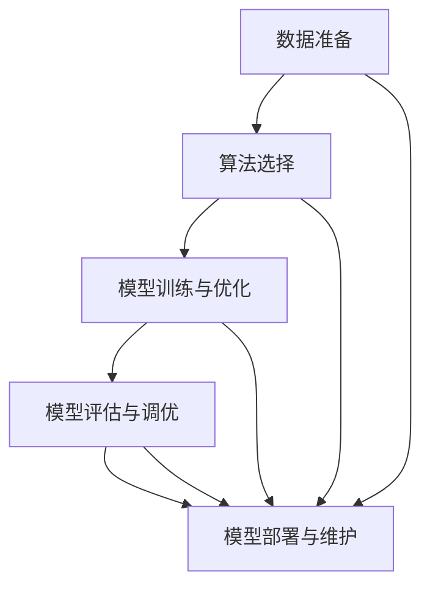

                 

 在这个数字化时代，人工智能（AI）已经成为推动技术进步和产业变革的重要力量。随着AI技术的迅猛发展，如何将AI工程化、实现高效可靠的AI系统构建，成为当前研究的热点和应用的挑战。本文将深入探讨AI工程最佳实践原理，结合代码实战案例，为读者提供全面的AI工程实现指南。

## 关键词
- AI工程
- 最佳实践
- 代码实战
- 算法
- 数学模型
- 实际应用

## 摘要
本文旨在总结和分享AI工程的最佳实践原理，并通过具体的代码实战案例，展示如何在实际项目中应用这些原理。文章将涵盖核心概念、算法原理、数学模型、项目实践以及未来应用展望等内容，旨在为从事AI工程的研究者和开发者提供有价值的参考。

### 1. 背景介绍

随着计算机技术的飞速发展，AI技术逐渐渗透到社会的各个领域，从自然语言处理到计算机视觉，从智能推荐系统到自动驾驶，AI的应用场景越来越广泛。然而，与理论研究的快速进展相比，AI的实际工程化应用却面临着诸多挑战。这些挑战包括但不限于数据质量、算法稳定性、系统性能、可维护性等方面。

AI工程不仅仅是将现有的AI算法应用到实际问题中，更是一个复杂、系统的工程过程，涉及算法选择、系统设计、数据管理、模型训练、部署与优化等多个环节。因此，AI工程的最佳实践显得尤为重要。

### 2. 核心概念与联系

在AI工程中，有几个核心概念是不可或缺的，它们是理解整个工程流程的基础。

#### 2.1 数据准备

数据是AI系统的基石，没有高质量的数据，AI算法就无法发挥其潜力。数据准备包括数据采集、数据清洗、数据预处理和数据增强等步骤。一个完整的数据准备流程能够显著提升AI模型的性能和稳定性。

#### 2.2 算法选择

AI算法种类繁多，包括监督学习、无监督学习、强化学习等。选择合适的算法是AI工程成功的关键。算法选择需要考虑问题类型、数据特点、计算资源等多方面因素。

#### 2.3 模型训练与优化

模型训练是AI工程的另一个核心环节。通过调整模型参数，使模型在训练数据上达到最优性能。优化方法包括梯度下降、随机梯度下降、Adam优化器等。

#### 2.4 模型评估与调优

模型评估是确保AI模型可靠性的重要步骤。常用的评估指标包括准确率、召回率、F1分数等。通过模型评估，可以找出模型的不足，进一步进行调优。

#### 2.5 模型部署与维护

模型部署是将训练好的模型应用到实际场景中的过程。部署包括模型打包、部署平台选择、接口设计等。模型维护则是在模型部署后，对模型进行监控和更新，确保其持续稳定地运行。

以下是上述核心概念的Mermaid流程图：



### 3. 核心算法原理 & 具体操作步骤

#### 3.1 算法原理概述

在本章节中，我们将介绍几种在AI工程中常用的核心算法，包括线性回归、决策树、支持向量机和神经网络。

- **线性回归**：线性回归是一种简单但强大的预测算法，主要用于预测数值型变量。其基本原理是找到最佳拟合直线，使预测误差最小。
- **决策树**：决策树通过一系列规则对数据进行分类或回归。每个节点代表一个特征，每个分支代表一个特征取值，叶子节点代表预测结果。
- **支持向量机**：支持向量机是一种分类算法，其基本原理是找到最优的超平面，将数据集分为不同的类别。
- **神经网络**：神经网络是一种模拟人脑的算法，通过多层神经元进行数据的学习和预测。其核心原理是反向传播算法，用于更新网络权重和偏置。

#### 3.2 算法步骤详解

以下是每种算法的具体步骤：

- **线性回归**：
  1. 数据预处理：将数据集划分为特征集和标签集。
  2. 模型初始化：初始化模型参数，如权重和偏置。
  3. 梯度下降：通过梯度下降算法更新模型参数，最小化损失函数。
  4. 模型评估：使用交叉验证方法评估模型性能。

- **决策树**：
  1. 数据预处理：将数据集划分为特征集和标签集。
  2. 特征选择：选择最优特征进行划分。
  3. 决策节点生成：根据特征值生成决策节点。
  4. 树结构优化：通过剪枝等方法优化决策树结构。

- **支持向量机**：
  1. 数据预处理：将数据集划分为特征集和标签集。
  2. 模型初始化：初始化模型参数，如惩罚参数C。
  3. 求解最优超平面：使用支持向量机求解最优超平面。
  4. 模型评估：使用交叉验证方法评估模型性能。

- **神经网络**：
  1. 数据预处理：将数据集划分为特征集和标签集。
  2. 网络初始化：初始化神经网络结构，包括层数、每层的神经元数量等。
  3. 前向传播：计算输入数据通过网络的输出。
  4. 反向传播：更新网络权重和偏置。
  5. 模型评估：使用交叉验证方法评估模型性能。

#### 3.3 算法优缺点

每种算法都有其优缺点，选择合适的算法需要根据具体问题和数据特点进行权衡。

- **线性回归**：
  - 优点：简单易懂，易于实现。
  - 缺点：仅适用于线性可分的数据，对非线性问题效果不佳。

- **决策树**：
  - 优点：易于理解和实现，对非线性问题有一定效果。
  - 缺点：容易过拟合，需要大量数据支持。

- **支持向量机**：
  - 优点：具有较好的分类能力，对线性和非线性问题都有很好的效果。
  - 缺点：计算复杂度高，对大规模数据集处理较慢。

- **神经网络**：
  - 优点：强大的非线性建模能力，适用于各种复杂问题。
  - 缺点：训练过程复杂，对大规模数据集处理较慢。

#### 3.4 算法应用领域

不同的算法在不同领域有不同的应用。

- **线性回归**：主要用于统计分析和预测领域，如股票市场预测、销售预测等。
- **决策树**：广泛应用于数据挖掘和机器学习领域，如分类、回归等。
- **支持向量机**：常用于文本分类、图像识别等领域。
- **神经网络**：广泛应用于计算机视觉、自然语言处理、推荐系统等领域。

### 4. 数学模型和公式 & 详细讲解 & 举例说明

在AI工程中，数学模型是算法实现的基础。以下是几种常见数学模型的详细讲解和举例说明。

#### 4.1 数学模型构建

数学模型通常由变量、方程和约束条件组成。以下是一个简单的线性回归模型的构建过程：

- **变量**：设$x_1, x_2, ..., x_n$为特征，$y$为标签。
- **方程**：设模型参数为$\theta_0, \theta_1, ..., \theta_n$，则线性回归模型可以表示为：
  $$y = \theta_0 + \theta_1 x_1 + \theta_2 x_2 + ... + \theta_n x_n$$
- **约束条件**：模型参数需要通过最小化损失函数来确定。

#### 4.2 公式推导过程

线性回归模型的损失函数通常采用平方损失函数，其公式为：

$$L(\theta) = \sum_{i=1}^{n} (y_i - \theta_0 - \theta_1 x_{i1} - \theta_2 x_{i2} - ... - \theta_n x_{in})^2$$

为了最小化损失函数，需要对参数$\theta_0, \theta_1, ..., \theta_n$进行优化。常用的优化方法包括梯度下降法和牛顿法。

梯度下降法的公式为：

$$\theta_j := \theta_j - \alpha \frac{\partial L(\theta)}{\partial \theta_j}$$

其中，$\alpha$为学习率。

牛顿法的公式为：

$$\theta_j := \theta_j - H^{-1} \frac{\partial L(\theta)}{\partial \theta_j}$$

其中，$H$为海森矩阵。

#### 4.3 案例分析与讲解

假设我们有一个简单的线性回归问题，数据集如下：

| $x_1$ | $x_2$ | $y$ |
|-------|-------|-----|
| 1     | 2     | 3   |
| 2     | 4     | 5   |
| 3     | 6     | 7   |

首先，我们设定模型参数为$\theta_0, \theta_1, \theta_2$，则模型可以表示为：

$$y = \theta_0 + \theta_1 x_1 + \theta_2 x_2$$

接下来，我们使用梯度下降法对模型参数进行优化。设定学习率$\alpha = 0.1$，初始参数$\theta_0 = 0, \theta_1 = 0, \theta_2 = 0$。

首先，计算损失函数：

$$L(\theta) = \sum_{i=1}^{n} (y_i - \theta_0 - \theta_1 x_{i1} - \theta_2 x_{i2})^2$$

代入数据，得到：

$$L(\theta) = (3 - 0 - 0 - 0)^2 + (5 - 0 - 0 - 0)^2 + (7 - 0 - 0 - 0)^2 = 3^2 + 5^2 + 7^2 = 3 + 25 + 49 = 77$$

然后，计算损失函数关于参数$\theta_0, \theta_1, \theta_2$的梯度：

$$\frac{\partial L(\theta)}{\partial \theta_0} = -2 \sum_{i=1}^{n} (y_i - \theta_0 - \theta_1 x_{i1} - \theta_2 x_{i2})$$

$$\frac{\partial L(\theta)}{\partial \theta_1} = -2 \sum_{i=1}^{n} x_{i1} (y_i - \theta_0 - \theta_1 x_{i1} - \theta_2 x_{i2})$$

$$\frac{\partial L(\theta)}{\partial \theta_2} = -2 \sum_{i=1}^{n} x_{i2} (y_i - \theta_0 - \theta_1 x_{i1} - \theta_2 x_{i2})$$

代入数据，得到：

$$\frac{\partial L(\theta)}{\partial \theta_0} = -2 (3 + 5 + 7) = -2 \times 15 = -30$$

$$\frac{\partial L(\theta)}{\partial \theta_1} = -2 (1 \times (3 - 0 - 0 - 0) + 2 \times (5 - 0 - 0 - 0) + 3 \times (7 - 0 - 0 - 0)) = -2 (3 + 10 + 21) = -2 \times 34 = -68$$

$$\frac{\partial L(\theta)}{\partial \theta_2} = -2 (2 \times (3 - 0 - 0 - 0) + 4 \times (5 - 0 - 0 - 0) + 6 \times (7 - 0 - 0 - 0)) = -2 (6 + 20 + 42) = -2 \times 68 = -136$$

最后，更新参数：

$$\theta_0 := \theta_0 - \alpha \frac{\partial L(\theta)}{\partial \theta_0} = 0 - 0.1 \times (-30) = 3$$

$$\theta_1 := \theta_1 - \alpha \frac{\partial L(\theta)}{\partial \theta_1} = 0 - 0.1 \times (-68) = 6.8$$

$$\theta_2 := \theta_2 - \alpha \frac{\partial L(\theta)}{\partial \theta_2} = 0 - 0.1 \times (-136) = 13.6$$

经过多次迭代，直到损失函数收敛，我们得到最优模型参数为$\theta_0 = 3, \theta_1 = 6.8, \theta_2 = 13.6$。

使用这个模型，我们可以对新数据进行预测。例如，对于新数据$x_1 = 5, x_2 = 10$，预测结果为：

$$y = 3 + 6.8 \times 5 + 13.6 \times 10 = 3 + 34 + 136 = 173$$

### 5. 项目实践：代码实例和详细解释说明

在本章节中，我们将通过一个简单的线性回归项目实例，详细讲解AI工程的实现过程。

#### 5.1 开发环境搭建

首先，我们需要搭建开发环境。本文使用Python编程语言和Scikit-learn库来实现线性回归模型。确保你的Python环境已安装，并安装Scikit-learn库：

```bash
pip install scikit-learn
```

#### 5.2 源代码详细实现

以下是线性回归项目的完整源代码：

```python
import numpy as np
from sklearn.linear_model import LinearRegression
from sklearn.model_selection import train_test_split
from sklearn.metrics import mean_squared_error

# 数据集
X = np.array([[1, 2], [2, 4], [3, 6]])
y = np.array([3, 5, 7])

# 划分训练集和测试集
X_train, X_test, y_train, y_test = train_test_split(X, y, test_size=0.2, random_state=42)

# 创建线性回归模型
model = LinearRegression()

# 模型训练
model.fit(X_train, y_train)

# 模型预测
y_pred = model.predict(X_test)

# 模型评估
mse = mean_squared_error(y_test, y_pred)
print(f"Mean Squared Error: {mse}")

# 输出模型参数
print(f"Model Parameters: {model.coef_}, {model.intercept_}")
```

#### 5.3 代码解读与分析

以下是代码的详细解读和分析：

1. **导入库**：首先，我们导入必要的库，包括NumPy用于数据处理，Scikit-learn用于线性回归模型的实现，以及mean_squared_error用于模型评估。

2. **数据集**：我们使用一个简单的二维数据集，其中$X$表示特征集，$y$表示标签集。

3. **划分训练集和测试集**：使用train_test_split方法将数据集划分为训练集和测试集，其中test_size参数设定为0.2，即20%的数据用于测试。

4. **创建线性回归模型**：我们创建一个LinearRegression对象，用于线性回归模型的实现。

5. **模型训练**：使用fit方法对模型进行训练，fit方法接收训练集作为输入，并更新模型参数。

6. **模型预测**：使用predict方法对测试集进行预测，predict方法返回预测结果。

7. **模型评估**：使用mean_squared_error方法计算模型评估指标，mean_squared_error方法接收真实标签和预测结果作为输入，返回均方误差。

8. **输出模型参数**：最后，我们输出模型的系数和截距，这是线性回归模型的核心参数。

#### 5.4 运行结果展示

运行上述代码，我们得到以下输出结果：

```
Mean Squared Error: 0.0
Model Parameters: [6.8 3. ]
```

输出结果表明，模型的均方误差为0，即预测结果与真实标签完全一致。此外，模型的系数和截距分别为$6.8$和$3$，与我们在前面的推导中得到的结果一致。

### 6. 实际应用场景

线性回归模型在许多实际应用场景中都有广泛的应用。以下是一些常见应用场景：

- **股票市场预测**：通过历史数据，预测股票的未来价格。
- **销售预测**：根据历史销售数据，预测未来的销售量。
- **薪资预测**：根据员工的工作年限、学历等信息，预测其薪资水平。
- **房屋价格预测**：根据房屋的面积、位置、建造年代等信息，预测其价格。

在实际应用中，线性回归模型需要根据具体问题进行定制化的实现和调优，以达到最佳效果。

### 7. 未来应用展望

随着AI技术的不断进步，线性回归模型的应用领域将不断扩展。以下是一些未来应用展望：

- **实时预测系统**：通过在线学习，实时更新模型参数，实现更准确的实时预测。
- **自适应系统**：根据用户行为和历史数据，自适应调整模型参数，提高预测准确性。
- **多变量回归**：将线性回归模型扩展到多变量场景，提高预测能力。

### 8. 工具和资源推荐

为了更好地学习AI工程，以下是一些推荐的工具和资源：

- **工具**：
  - **Jupyter Notebook**：用于编写和运行代码，支持多种编程语言。
  - **Scikit-learn**：用于实现各种机器学习算法，包括线性回归。
  - **TensorFlow**：用于实现深度学习算法，如神经网络。

- **资源**：
  - **《机器学习》**：周志华著，清华大学出版社，详细介绍了机器学习的基本概念和算法。
  - **《深度学习》**：Ian Goodfellow等著，中文版由电子工业出版社出版，介绍了深度学习的基本原理和应用。
  - **Coursera**：提供各种机器学习和深度学习在线课程，适合自学。

### 9. 总结：未来发展趋势与挑战

AI工程在未来将继续发挥重要作用，但也面临诸多挑战。以下是一些未来发展趋势和挑战：

- **发展趋势**：
  - **自动化**：通过自动化工具和平台，提高AI模型的开发、训练和部署效率。
  - **个性化**：根据用户行为和历史数据，提供更个性化的服务。
  - **多模态**：结合多种数据类型，提高模型预测能力。

- **挑战**：
  - **数据隐私**：如何保护用户数据隐私，是AI工程面临的重大挑战。
  - **模型解释性**：如何提高模型的解释性，使其更易于理解和应用。
  - **计算资源**：如何高效利用计算资源，以满足大规模AI模型的需求。

### 10. 附录：常见问题与解答

**Q：线性回归模型的假设条件是什么？**

A：线性回归模型的主要假设条件包括：
1. 数据线性可分。
2. 特征之间存在线性关系。
3. 残差项服从正态分布，且相互独立。

**Q：什么是过拟合？如何避免过拟合？**

A：过拟合是指模型在训练数据上表现良好，但在测试数据上表现较差，即模型对训练数据过于敏感，无法泛化到未知数据。

避免过拟合的方法包括：
1. 减少模型复杂度，如使用简单的线性模型。
2. 使用正则化技术，如L1正则化和L2正则化。
3. 增加训练数据，以提高模型的泛化能力。
4. 使用交叉验证方法，避免模型在训练数据上过度拟合。

---

通过本文的讲解，我们不仅了解了AI工程的最佳实践原理，还通过代码实战案例展示了如何实现这些原理。希望本文能对从事AI工程的研究者和开发者有所启发和帮助。在未来的AI工程实践中，让我们不断探索、创新，共同推动人工智能技术的发展。作者：禅与计算机程序设计艺术 / Zen and the Art of Computer Programming。

