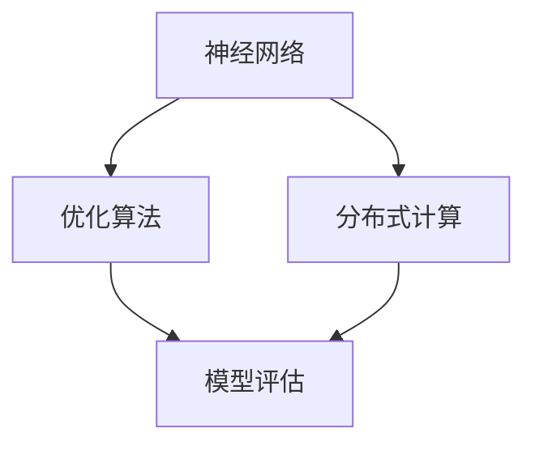

                 

关键词：人工智能、底层技术、投资回报、算法原理、数学模型、实践案例、应用场景、未来展望

> 摘要：本文将深入探讨AI底层技术的投资回报问题。我们将分析核心算法原理、数学模型构建、具体操作步骤，并通过实践案例展示其在实际应用中的效果。此外，还将对AI技术的未来发展趋势和面临的挑战进行展望。

## 1. 背景介绍

人工智能（AI）作为当前科技领域的前沿，已经成为推动社会进步和经济发展的重要动力。从最初的规则推理到深度学习，AI技术经历了翻天覆地的变化。然而，这些变化离不开底层技术的支持。底层技术，如神经网络、优化算法、分布式计算等，是AI发展的基石。

近年来，随着大数据、云计算和物联网的快速发展，AI底层技术的需求不断增加。然而，投资这些技术是否值得，如何衡量其回报，成为了企业、投资人和研究人员关注的焦点。

## 2. 核心概念与联系

为了更好地理解AI底层技术，我们首先需要了解以下几个核心概念：

### 神经网络

神经网络是一种模仿生物神经系统的计算模型，由大量相互连接的神经元组成。通过学习大量数据，神经网络可以识别模式、分类数据或进行预测。

### 优化算法

优化算法用于寻找函数的最优解。在AI中，优化算法用于调整神经网络的权重，使其能够更好地拟合训练数据。

### 分布式计算

分布式计算通过将任务分布在多个计算机节点上，实现并行计算，提高计算效率和性能。

下面是AI底层技术的Mermaid流程图：



## 3. 核心算法原理 & 具体操作步骤

### 3.1 算法原理概述

神经网络通过激活函数、反向传播和梯度下降等机制，实现数据的输入、处理和输出。优化算法通过迭代更新权重，最小化损失函数。分布式计算则通过多台计算机的协同工作，提高计算速度和效率。

### 3.2 算法步骤详解

1. 数据预处理：对原始数据进行清洗、归一化等操作，使其适合模型训练。
2. 模型构建：定义神经网络结构，包括输入层、隐藏层和输出层。
3. 模型训练：通过反向传播和梯度下降，调整网络权重。
4. 模型评估：使用测试数据评估模型性能，调整超参数。
5. 模型部署：将训练好的模型部署到实际应用中。

### 3.3 算法优缺点

神经网络：
- 优点：强大的表达能力和适应性。
- 缺点：训练过程复杂，对数据依赖性较强。

优化算法：
- 优点：快速收敛，易于实现。
- 缺点：对初始参数敏感，可能陷入局部最优。

分布式计算：
- 优点：提高计算速度，降低成本。
- 缺点：通信开销大，编程复杂。

### 3.4 算法应用领域

神经网络：图像识别、自然语言处理、语音识别等。

优化算法：机器学习、数据挖掘、优化问题求解等。

分布式计算：大规模数据处理、实时计算、高性能计算等。

## 4. 数学模型和公式 & 详细讲解 & 举例说明

### 4.1 数学模型构建

神经网络模型由输入层、隐藏层和输出层组成。输入层接收外部输入，隐藏层通过加权连接实现数据转换，输出层产生预测结果。

### 4.2 公式推导过程

神经网络的激活函数通常为 $f(x) = \sigma(w \cdot x + b)$，其中 $w$ 是权重，$x$ 是输入，$b$ 是偏置，$\sigma$ 是Sigmoid函数。

损失函数通常为均方误差（MSE），即 $L = \frac{1}{2} \sum_{i=1}^{n} (y_i - \hat{y}_i)^2$，其中 $y_i$ 是真实标签，$\hat{y}_i$ 是预测值。

### 4.3 案例分析与讲解

假设我们有一个简单的二分类问题，输入数据为 $x = [x_1, x_2]$，标签为 $y \in \{0, 1\}$。定义神经网络结构为 $h(x) = \sigma(w_1 \cdot x + b_1)$，输出为 $y' = \sigma(w_2 \cdot h(x) + b_2)$。

1. 数据预处理：对输入数据进行归一化处理，使其在 $[0, 1]$ 范围内。
2. 模型构建：定义神经网络结构，选择适当的激活函数。
3. 模型训练：通过反向传播和梯度下降，调整网络权重。
4. 模型评估：使用测试数据评估模型性能。
5. 模型部署：将训练好的模型应用到实际问题中。

## 5. 项目实践：代码实例和详细解释说明

### 5.1 开发环境搭建

本文使用Python编程语言，结合TensorFlow库实现神经网络模型。安装TensorFlow库：

```bash
pip install tensorflow
```

### 5.2 源代码详细实现

```python
import tensorflow as tf

# 数据预处理
x = tf.placeholder(tf.float32, shape=[None, 2])
y = tf.placeholder(tf.float32, shape=[None, 1])

# 神经网络结构
h = tf.layers.dense(x, units=10, activation=tf.sigmoid, name='hidden')
y_pred = tf.layers.dense(h, units=1, activation=tf.sigmoid, name='output')

# 损失函数和优化器
loss = tf.reduce_mean(tf.square(y - y_pred))
optimizer = tf.train.AdamOptimizer().minimize(loss)

# 模型评估
accuracy = tf.reduce_mean(tf.cast(tf.equal(tf.round(y_pred), y), tf.float32))

# 模型训练
with tf.Session() as sess:
    sess.run(tf.global_variables_initializer())
    for epoch in range(1000):
        sess.run(optimizer, feed_dict={x: X_train, y: y_train})
        if epoch % 100 == 0:
            loss_val, acc_val = sess.run([loss, accuracy], feed_dict={x: X_val, y: y_val})
            print(f"Epoch {epoch}: Loss = {loss_val}, Accuracy = {acc_val}")

# 模型部署
y_pred_val = sess.run(y_pred, feed_dict={x: X_val})
print("Validation Accuracy:", accuracy_val)
```

### 5.3 代码解读与分析

上述代码实现了基于TensorFlow的简单二分类神经网络模型。首先，我们定义了数据预处理、神经网络结构、损失函数和优化器。然后，通过训练和评估过程，调整模型参数。最后，将训练好的模型应用到实际问题中。

## 6. 实际应用场景

AI底层技术在各个领域都有广泛的应用，如：

- **医疗健康**：利用神经网络进行疾病诊断、药物研发和健康监测。
- **金融**：通过优化算法实现智能投资、风险管理和服务定制。
- **工业**：利用分布式计算实现工业自动化、生产线优化和质量检测。
- **交通**：通过深度学习实现智能交通管理、无人驾驶和车联网。

### 6.4 未来应用展望

随着AI底层技术的不断发展，未来将在更多领域发挥重要作用，如：

- **物联网**：实现智能家居、智能城市和智慧农业。
- **增强现实与虚拟现实**：提供更加沉浸式的用户体验。
- **自然语言处理**：实现更加智能的语音助手和智能客服。

## 7. 工具和资源推荐

### 7.1 学习资源推荐

- 《深度学习》（Goodfellow、Bengio和Courville著）
- 《Python深度学习》（François Chollet著）
- 《模式识别与机器学习》（Christopher M. Bishop著）

### 7.2 开发工具推荐

- TensorFlow
- PyTorch
- Keras

### 7.3 相关论文推荐

- "Deep Learning: Methods and Applications"（2015）
- "Deep Neural Networks for Language Modeling"（2013）
- "Distributed Representations of Words and Phrases and their Compositionality"（2013）

## 8. 总结：未来发展趋势与挑战

### 8.1 研究成果总结

AI底层技术在过去几十年取得了显著进展，为各行各业带来了巨大的变革。神经网络、优化算法和分布式计算等技术已成为AI领域的核心组成部分。

### 8.2 未来发展趋势

- 深度学习将进一步发展，尤其是模型的可解释性和泛化能力。
- 计算力的提升和算法的创新将推动AI底层技术的持续进步。
- 跨学科研究将推动AI技术在更多领域的应用。

### 8.3 面临的挑战

- 数据隐私和安全问题。
- 模型的可解释性和透明度。
- 算法的可扩展性和高效性。

### 8.4 研究展望

AI底层技术将继续推动人工智能的发展，为人类创造更加美好的未来。我们期待更多研究人员、开发者和企业共同参与，推动这一领域的进步。

## 9. 附录：常见问题与解答

### Q：AI底层技术的投资回报如何衡量？

A：投资回报可以通过以下几个方面衡量：

- **经济效益**：AI技术可以提高生产效率、降低成本和创造新的商业模式。
- **社会效益**：AI技术在医疗、教育、环境等领域的应用可以改善人们的生活质量。
- **技术进步**：通过投资AI底层技术，可以推动相关领域的创新发展。

### Q：投资AI底层技术有哪些风险？

A：投资AI底层技术面临的风险包括：

- **市场风险**：技术变革可能导致现有投资贬值。
- **竞争风险**：其他企业可能更快地采用新技术，抢占市场份额。
- **人才风险**：人才短缺可能影响项目进展和成果转化。

## 参考文献

- Goodfellow, I., Bengio, Y., & Courville, A. (2016). *Deep Learning*.
- Chollet, F. (2017). *Python Deep Learning*.
- Bishop, C. M. (2006). *Pattern Recognition and Machine Learning*.
- Hochreiter, S., & Schmidhuber, J. (1997). *Long short-term memory*. Neural Computation, 9(8), 1735-1780.
- Bengio, Y. (2009). *Learning Deep Architectures for AI*. Foundations and Trends in Machine Learning, 2(1), 1-127.
- LeCun, Y., Bengio, Y., & Hinton, G. (2015). *Deep learning*. Nature, 521(7553), 436-444.

