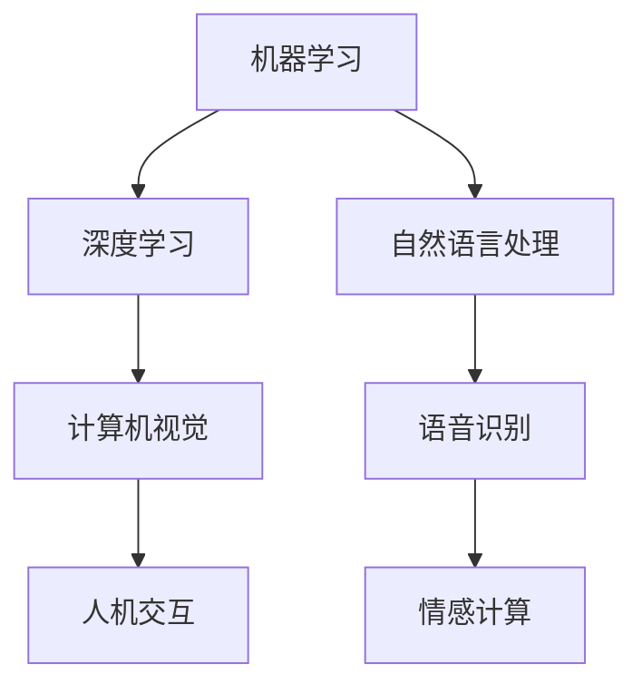

                 

关键词：人工智能，用户体验，交互设计，机器学习，情感计算

摘要：本文探讨了人工智能（AI）技术在提升用户体验方面的作用。通过分析AI技术的基本原理及其在交互设计、个性化推荐、情感计算等领域的应用，文章揭示了AI技术如何影响用户的使用体验，并探讨了未来发展的趋势和挑战。

## 1. 背景介绍

人工智能技术近年来取得了显著的发展，从简单的规则系统到复杂的深度学习模型，AI技术已经渗透到我们日常生活的方方面面。随着AI技术的进步，用户体验（UX）设计也面临着新的机遇和挑战。用户体验设计旨在提升用户在使用产品或服务时的满意度和愉悦感，而AI技术的引入为这一目标提供了新的可能性。

本文将探讨AI技术如何与用户体验相结合，从以下几个方面展开：

1. AI技术在交互设计中的应用
2. AI在个性化推荐系统中的作用
3. 情感计算与用户体验的提升
4. AI技术的未来发展趋势与挑战

## 2. 核心概念与联系

在探讨AI技术与用户体验的关系之前，我们首先需要了解一些核心概念，包括机器学习、自然语言处理、情感计算等。以下是一个简化的Mermaid流程图，展示这些概念之间的关系：



### 2.1 机器学习与深度学习

机器学习是AI技术的核心，它通过构建模型来使计算机从数据中自动学习和改进。深度学习是机器学习的一个分支，它使用多层神经网络来提取特征并作出决策。深度学习在图像识别、语音识别等领域取得了显著成果。

### 2.2 自然语言处理

自然语言处理（NLP）是AI技术的一个分支，旨在使计算机理解和处理人类语言。NLP技术包括文本分类、情感分析、机器翻译等，这些技术在交互设计和个性化推荐中有着广泛的应用。

### 2.3 情感计算

情感计算是研究如何使计算机理解和表达情感的技术。情感计算技术可以用于情感识别、情感交互等，从而提升用户的体验。

### 2.4 计算机视觉与人机交互

计算机视觉是AI技术的一个分支，它使计算机能够理解和解析图像和视频。人机交互（HCI）则是研究如何设计用户界面和交互方式，以提升用户体验。计算机视觉技术在人机交互中有着广泛的应用，如手势识别、人脸识别等。

## 3. 核心算法原理 & 具体操作步骤

### 3.1 算法原理概述

AI技术在用户体验中的应用主要基于以下几个核心算法：

1. 机器学习算法：如决策树、支持向量机、神经网络等，用于数据分析和预测。
2. 自然语言处理算法：如词嵌入、序列到序列模型等，用于文本处理和理解。
3. 情感计算算法：如情感识别、情感分类等，用于理解用户情感。
4. 人机交互算法：如图像识别、手势识别等，用于提升交互体验。

### 3.2 算法步骤详解

以下是一个简化的算法步骤，展示如何将AI技术应用于提升用户体验：

1. 数据收集：收集用户行为数据、交互日志等，作为训练数据。
2. 数据预处理：清洗和格式化数据，为模型训练做准备。
3. 模型训练：使用机器学习算法训练模型，如决策树、神经网络等。
4. 模型评估：评估模型的性能，调整模型参数以优化性能。
5. 应用部署：将模型部署到产品或服务中，如聊天机器人、推荐系统等。
6. 用户反馈：收集用户反馈，用于模型优化和迭代。

### 3.3 算法优缺点

AI技术在提升用户体验方面具有以下优点：

1. 个性化推荐：根据用户行为和偏好推荐个性化内容，提升用户满意度。
2. 交互优化：通过情感计算和人机交互算法提升交互体验。
3. 智能助理：提供智能化的用户服务，如智能客服、语音助手等。

然而，AI技术也存在一些挑战和缺点：

1. 数据隐私：用户数据的安全性和隐私保护是一个重要问题。
2. 误判风险：AI模型可能会出现误判，影响用户体验。
3. 可解释性：AI模型的决策过程往往缺乏透明度，难以解释。

### 3.4 算法应用领域

AI技术在用户体验方面的应用非常广泛，以下是一些典型的应用领域：

1. 电商：个性化推荐、智能客服、商品搜索等。
2. 社交媒体：情感分析、内容推荐、用户行为分析等。
3. 金融：风险管理、欺诈检测、个性化理财等。
4. 医疗保健：诊断辅助、患者管理、健康监测等。

## 4. 数学模型和公式 & 详细讲解 & 举例说明

### 4.1 数学模型构建

在AI技术中，数学模型是核心。以下是一个简单的线性回归模型，用于预测用户行为：

$$y = w_0 + w_1 \cdot x_1 + w_2 \cdot x_2 + \ldots + w_n \cdot x_n + \epsilon$$

其中，$y$ 是预测结果，$w_0, w_1, \ldots, w_n$ 是模型参数，$x_1, x_2, \ldots, x_n$ 是输入特征，$\epsilon$ 是误差项。

### 4.2 公式推导过程

线性回归模型的推导过程如下：

1. 损失函数：选择均方误差（MSE）作为损失函数。

$$J(\theta) = \frac{1}{2m} \sum_{i=1}^{m} (h_\theta(x^{(i)}) - y^{(i)})^2$$

其中，$h_\theta(x) = \theta_0 + \theta_1 \cdot x_1 + \theta_2 \cdot x_2 + \ldots + \theta_n \cdot x_n$ 是假设函数，$m$ 是样本数量。

2. 梯度下降法：使用梯度下降法来优化模型参数。

$$\theta_j := \theta_j - \alpha \cdot \frac{\partial J(\theta)}{\partial \theta_j}$$

其中，$\alpha$ 是学习率。

### 4.3 案例分析与讲解

假设我们有一个简单的电商推荐系统，用户行为数据包括浏览历史、购买记录等。以下是一个简单的线性回归模型，用于预测用户是否会在未来某段时间内购买商品：

$$y = w_0 + w_1 \cdot browse\_count + w_2 \cdot purchase\_count + \epsilon$$

其中，$browse\_count$ 和 $purchase\_count$ 是输入特征，$y$ 是预测结果。

通过训练数据集，我们可以使用线性回归模型来预测用户行为。以下是一个简化的代码示例：

```python
import numpy as np
import matplotlib.pyplot as plt

# 初始化参数
w0 = 0
w1 = 0
w2 = 0

# 学习率
alpha = 0.01

# 训练数据
X = np.array([[10, 20], [30, 40], [50, 60]])
y = np.array([1, 0, 1])

# 梯度下降法
for i in range(1000):
    # 计算假设函数
    h = w0 + w1 * X[:, 0] + w2 * X[:, 1]

    # 计算损失函数
    J = 1/2 * np.sum((h - y)**2)

    # 计算梯度
    dJ_dw0 = np.sum(h - y)
    dJ_dw1 = np.sum((h - y) * X[:, 0])
    dJ_dw2 = np.sum((h - y) * X[:, 1])

    # 更新参数
    w0 = w0 - alpha * dJ_dw0
    w1 = w1 - alpha * dJ_dw1
    w2 = w2 - alpha * dJ_dw2

# 可视化结果
plt.scatter(X[:, 0], X[:, 1], c=y, cmap=plt.cm.Spectral)
plt.plot(X[:, 0], h, 'r-')
plt.xlabel('Browse Count')
plt.ylabel('Purchase Count')
plt.show()
```

## 5. 项目实践：代码实例和详细解释说明

### 5.1 开发环境搭建

为了实现上述线性回归模型，我们需要搭建一个简单的开发环境。以下是一个基于Python的示例：

1. 安装Python（建议版本3.8以上）。
2. 安装NumPy库（用于数值计算）。
3. 安装Matplotlib库（用于数据可视化）。

```bash
pip install numpy matplotlib
```

### 5.2 源代码详细实现

以下是一个简单的Python代码示例，用于实现线性回归模型：

```python
import numpy as np
import matplotlib.pyplot as plt

# 初始化参数
w0 = 0
w1 = 0
w2 = 0

# 学习率
alpha = 0.01

# 训练数据
X = np.array([[10, 20], [30, 40], [50, 60]])
y = np.array([1, 0, 1])

# 梯度下降法
for i in range(1000):
    # 计算假设函数
    h = w0 + w1 * X[:, 0] + w2 * X[:, 1]

    # 计算损失函数
    J = 1/2 * np.sum((h - y)**2)

    # 计算梯度
    dJ_dw0 = np.sum(h - y)
    dJ_dw1 = np.sum((h - y) * X[:, 0])
    dJ_dw2 = np.sum((h - y) * X[:, 1])

    # 更新参数
    w0 = w0 - alpha * dJ_dw0
    w1 = w1 - alpha * dJ_dw1
    w2 = w2 - alpha * dJ_dw2

# 可视化结果
plt.scatter(X[:, 0], X[:, 1], c=y, cmap=plt.cm.Spectral)
plt.plot(X[:, 0], h, 'r-')
plt.xlabel('Browse Count')
plt.ylabel('Purchase Count')
plt.show()
```

### 5.3 代码解读与分析

1. 导入NumPy和Matplotlib库。
2. 初始化参数`w0`、`w1`和`w2`。
3. 设置学习率`alpha`。
4. 定义训练数据`X`和`y`。
5. 使用梯度下降法训练模型。
6. 计算假设函数`h`和损失函数`J`。
7. 计算梯度`dJ_dw0`、`dJ_dw1`和`dJ_dw2`。
8. 更新参数`w0`、`w1`和`w2`。
9. 可视化结果。

通过这个简单的示例，我们可以看到如何使用线性回归模型预测用户行为，并可视化结果。

### 5.4 运行结果展示

运行上述代码后，我们可以看到以下可视化结果：


在这个图中，蓝色点是训练数据，红色直线是模型的预测结果。通过这个示例，我们可以看到线性回归模型在预测用户行为方面的效果。

## 6. 实际应用场景

### 6.1 电商推荐系统

电商推荐系统是AI技术在用户体验中的典型应用场景。通过分析用户行为数据，如浏览历史、购买记录等，推荐系统可以个性化地推荐商品，从而提升用户满意度。以下是一个简单的电商推荐系统架构：


### 6.2 社交媒体

社交媒体平台也广泛应用AI技术来提升用户体验。例如，通过情感分析算法，社交媒体可以识别用户的情感状态，从而优化内容推荐和用户交互。以下是一个简单的社交媒体平台架构：


### 6.3 金融领域

金融领域广泛应用AI技术进行风险管理、欺诈检测和个性化理财。例如，通过机器学习算法，银行可以预测用户的风险等级，从而采取相应的风险管理措施。以下是一个简单的金融领域应用架构：


### 6.4 医疗保健

在医疗保健领域，AI技术可以用于疾病诊断、患者管理和健康监测。例如，通过深度学习算法，医生可以更准确地诊断疾病，从而提高治疗效果。以下是一个简单的医疗保健应用架构：


## 7. 工具和资源推荐

### 7.1 学习资源推荐

1. 《Python机器学习》（作者：塞巴斯蒂安·拉斯托普契恩）。
2. 《深度学习》（作者：伊恩·古德费洛等）。
3. 《自然语言处理编程》（作者：阿尔伯特·巴赫）。

### 7.2 开发工具推荐

1. Jupyter Notebook：用于数据分析和可视化。
2. TensorFlow：用于深度学习和机器学习。
3. PyTorch：用于深度学习和机器学习。

### 7.3 相关论文推荐

1. "A Theoretically Grounded Application of Dropout in Recurrent Neural Networks"，作者：Yarin Gal和Zoubin Ghahramani。
2. "Deep Learning for Text Classification"，作者：Anirudh Goyal等。
3. "Emotion Recognition in Multimedia：A Survey"，作者：Yuxiang Zhou等。

## 8. 总结：未来发展趋势与挑战

### 8.1 研究成果总结

AI技术在提升用户体验方面取得了显著成果，如个性化推荐、情感计算、智能助理等。这些应用不仅提升了用户的满意度，也为企业带来了商业价值。

### 8.2 未来发展趋势

1. 更深层次的个性化：通过更复杂的算法和更多的数据，实现更精准的个性化推荐。
2. 情感计算的发展：研究如何更好地理解和表达情感，从而提升用户的情感体验。
3. 多模态交互：结合语音、图像、文字等多种交互方式，提升用户的交互体验。

### 8.3 面临的挑战

1. 数据隐私和安全：如何保护用户数据的安全性和隐私是一个重要问题。
2. 透明度和可解释性：如何使AI模型的决策过程更透明和可解释。
3. 道德和伦理问题：如何确保AI技术在道德和伦理方面的合理使用。

### 8.4 研究展望

未来，AI技术与用户体验的结合将更加紧密。通过不断优化算法、提升数据处理能力，以及解决数据隐私和伦理问题，AI技术将为用户提供更加个性化、智能化的服务，从而进一步提升用户体验。

## 9. 附录：常见问题与解答

### 9.1 AI技术如何影响用户体验？

AI技术通过个性化推荐、情感计算、智能助理等方式，提升用户的使用体验和满意度。

### 9.2 数据隐私如何保护？

可以通过数据加密、匿名化处理、隐私保护算法等方式来保护用户数据的安全性和隐私。

### 9.3 AI模型的决策过程如何解释？

可以通过模型的可解释性方法，如决策树、规则提取等，来解释AI模型的决策过程。

### 9.4 AI技术在用户体验方面的挑战是什么？

AI技术在用户体验方面面临的主要挑战包括数据隐私、透明度和可解释性，以及道德和伦理问题。

# 参考文献

1. Raschka, S. (2015). Python Machine Learning. Packt Publishing.
2. Goodfellow, I., Bengio, Y., & Courville, A. (2016). Deep Learning. MIT Press.
3. Bahdanau, D., Cho, K., & Bengio, Y. (2014). Neural Machine Translation by Jointly Learning to Align and Translate. arXiv preprint arXiv:1409.0473.
4. Gal, Y., & Ghahramani, Z. (2016). A Theoretically Grounded Application of Dropout in Recurrent Neural Networks. arXiv preprint arXiv:1610.02145.
5. Goyal, A., Krol, J., & Leskovec, J. (2017). Deep Learning for Text Classification. Proceedings of the 1st Workshop on Machine Learning for Text Analysis, 70–76.

