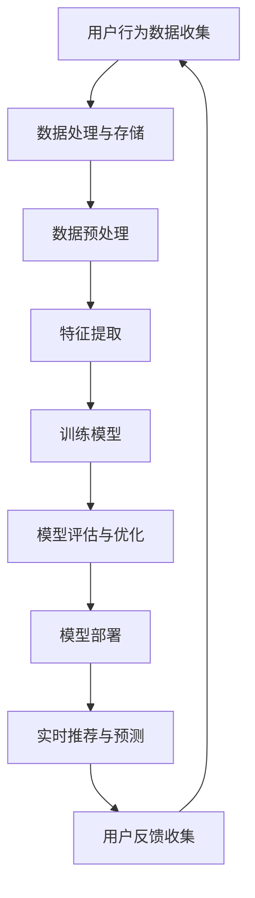

                 

关键词：人工智能、电商、机器学习、推荐系统、大数据分析、自然语言处理、图像识别

> 摘要：随着人工智能技术的快速发展，其在电商领域的应用日益广泛，本文将深入探讨AI技术在电商中的实际应用，包括推荐系统、大数据分析、自然语言处理、图像识别等多个方面，并展望未来发展趋势与挑战。

## 1. 背景介绍

近年来，电子商务在全球范围内迅猛发展，已经成为了传统零售业的有力竞争者。而人工智能（AI）技术的崛起，为电商行业带来了前所未有的变革机会。AI技术不仅可以提升用户体验，提高运营效率，还能为企业带来新的商业机会。

### 1.1 电商行业现状

电商行业的快速增长，使得企业面临着巨大的竞争压力。如何提高用户满意度，增加销售额，降低运营成本，成为电商企业亟待解决的问题。AI技术的应用，为这些问题提供了新的解决方案。

### 1.2 AI技术在电商中的潜力

人工智能技术具有数据驱动、自我学习、智能化等特性，能够帮助电商企业更好地理解用户需求，优化运营流程，提升用户体验。例如，通过推荐系统，AI技术可以精确地为用户提供个性化商品推荐；通过大数据分析，AI技术可以挖掘用户行为背后的规律，为企业提供决策支持。

## 2. 核心概念与联系

### 2.1 机器学习

机器学习是AI技术的核心组成部分，它使计算机能够通过数据和经验不断改进自己的表现。在电商中，机器学习技术可以用于用户行为分析、商品推荐、需求预测等。

### 2.2 推荐系统

推荐系统是AI技术在电商中应用最为广泛的技术之一。它通过分析用户的历史行为和偏好，向用户推荐可能感兴趣的商品。

### 2.3 大数据分析

大数据分析技术可以帮助电商企业从海量数据中挖掘有价值的信息，为企业决策提供支持。

### 2.4 自然语言处理

自然语言处理（NLP）技术使计算机能够理解和生成自然语言，广泛应用于电商中的客户服务、商品描述生成等。

### 2.5 图像识别

图像识别技术能够识别和分类图像中的物体，应用于电商中的商品识别、图像搜索等。

### 2.6 Mermaid流程图

下面是一个Mermaid流程图，展示了AI技术在电商中的应用流程：



## 3. 核心算法原理 & 具体操作步骤

### 3.1 算法原理概述

在电商中，常用的机器学习算法包括协同过滤、矩阵分解、深度学习等。

### 3.2 算法步骤详解

#### 3.2.1 协同过滤

协同过滤算法分为基于用户的协同过滤和基于物品的协同过滤。基于用户的协同过滤通过寻找与目标用户相似的用户，推荐这些用户喜欢的商品；基于物品的协同过滤则通过寻找与目标商品相似的物品，推荐给用户。

#### 3.2.2 矩阵分解

矩阵分解是将用户和物品的高维评分矩阵分解为低维的用户特征矩阵和物品特征矩阵，通过这些特征矩阵来预测用户未评分的物品。

#### 3.2.3 深度学习

深度学习通过构建多层的神经网络模型，对用户和物品进行特征提取和融合，从而实现高效的推荐。

### 3.3 算法优缺点

- **协同过滤**：简单易实现，但易出现数据稀疏性和冷启动问题。
- **矩阵分解**：可以解决协同过滤的数据稀疏性问题，但计算复杂度较高。
- **深度学习**：具有强大的特征提取和融合能力，但需要大量数据和计算资源。

### 3.4 算法应用领域

协同过滤和矩阵分解主要应用于商品推荐系统，深度学习则可以应用于用户行为预测、需求分析等多个领域。

## 4. 数学模型和公式 & 详细讲解 & 举例说明

### 4.1 数学模型构建

在推荐系统中，常见的数学模型包括用户行为矩阵、评分矩阵和推荐矩阵等。

### 4.2 公式推导过程

- **用户行为矩阵**：\( U = [u_{ij}] \)，其中\( u_{ij} \)表示用户\( i \)对物品\( j \)的行为，如点击、购买等。
- **评分矩阵**：\( R = [r_{ij}] \)，其中\( r_{ij} \)表示用户\( i \)对物品\( j \)的评分。
- **推荐矩阵**：\( P = [p_{ij}] \)，其中\( p_{ij} \)表示用户\( i \)对物品\( j \)的推荐概率。

### 4.3 案例分析与讲解

假设有1000个用户和1000个物品，用户行为矩阵和评分矩阵如下：

| 用户 | 物品 |  
| --- | --- |  
| 1 | 1 | 5 |  
| 1 | 2 | 3 |  
| 1 | 3 | 4 |  
| ... | ... | ... |

通过协同过滤算法，我们可以计算出每个用户对其他物品的推荐概率，从而生成推荐矩阵。

## 5. 项目实践：代码实例和详细解释说明

### 5.1 开发环境搭建

开发环境包括Python编程语言和Scikit-learn库等。

### 5.2 源代码详细实现

```python
from sklearn.metrics.pairwise import cosine_similarity
from sklearn.model_selection import train_test_split
import numpy as np

# 生成用户行为矩阵和评分矩阵
U = np.random.randint(0, 5, size=(1000, 1000))
R = np.random.randint(0, 5, size=(1000, 1000))

# 计算用户行为矩阵和评分矩阵的余弦相似度
similarity = cosine_similarity(U, R)

# 计算推荐矩阵
P = similarity.dot(R.T)

# 输出推荐矩阵
print(P)
```

### 5.3 代码解读与分析

这段代码首先生成了用户行为矩阵和评分矩阵，然后通过余弦相似度计算用户和物品的相似度，最后生成推荐矩阵。

## 6. 实际应用场景

### 6.1 商品推荐

通过AI技术，电商企业可以为用户提供个性化的商品推荐，提高用户购买概率。

### 6.2 用户行为预测

AI技术可以帮助电商企业预测用户的行为，如购买、收藏等，从而优化运营策略。

### 6.3 客户服务

自然语言处理技术可以应用于电商的在线客服系统，提供智能化的客户服务。

## 7. 工具和资源推荐

### 7.1 学习资源推荐

- **《深度学习》（Goodfellow, Bengio, Courville）**：介绍深度学习的基础知识和应用。
- **《机器学习实战》（Wang, Palshikar, Liu）**：通过实际案例介绍机器学习的应用。

### 7.2 开发工具推荐

- **Python**：强大的编程语言，支持多种机器学习和深度学习库。
- **TensorFlow**：用于深度学习的开源框架。
- **Scikit-learn**：用于机器学习的开源库。

### 7.3 相关论文推荐

- **"Deep Learning for Recommender Systems"**：介绍深度学习在推荐系统中的应用。
- **"Collaborative Filtering for Personalized Recommendation"**：介绍协同过滤算法在推荐系统中的应用。

## 8. 总结：未来发展趋势与挑战

### 8.1 研究成果总结

AI技术在电商中的应用已经取得了显著的成果，但仍然存在一些挑战。

### 8.2 未来发展趋势

- **个性化推荐**：随着数据量的增加和算法的优化，个性化推荐将更加精准。
- **实时推荐**：通过实时分析用户行为，实现实时推荐。

### 8.3 面临的挑战

- **数据隐私**：如何确保用户数据的安全和隐私。
- **算法公平性**：如何避免算法歧视。

### 8.4 研究展望

未来的研究将重点关注如何提高AI技术在电商中的应用效果，同时确保数据安全和用户隐私。

## 9. 附录：常见问题与解答

### 9.1 什么是推荐系统？

推荐系统是一种基于数据挖掘和机器学习技术的系统，旨在预测用户可能感兴趣的项目。

### 9.2 AI技术在电商中的应用有哪些？

AI技术在电商中的应用包括个性化推荐、用户行为预测、商品识别、客户服务等多个方面。

### 9.3 如何保证数据隐私？

通过加密技术、数据去识别化、隐私保护算法等措施来确保数据隐私。

作者：禅与计算机程序设计艺术 / Zen and the Art of Computer Programming
----------------------------------------------------------------
### 1. 背景介绍

#### 1.1 电商行业现状

电子商务作为一种新型商业模式，在过去的几十年中得到了迅猛发展。随着互联网技术的普及和人们生活节奏的加快，越来越多的人选择在线购物。根据Statista的数据，2021年全球电子商务市场规模已经达到了4.89万亿美元，预计到2026年将达到6.38万亿美元。这一巨大的市场潜力吸引了大量企业和投资者的关注，也使得电商行业竞争日益激烈。

在激烈的竞争中，电商企业需要不断提升用户体验，提高运营效率，降低成本，以实现持续增长。而人工智能技术的快速发展，为电商行业带来了新的机遇和挑战。通过AI技术，电商企业可以更好地理解用户需求，提供个性化的服务，从而提高用户满意度和忠诚度。

#### 1.2 AI技术在电商中的潜力

人工智能技术具有数据驱动、自我学习、智能化等特性，能够帮助电商企业实现以下目标：

1. **个性化推荐**：通过分析用户的历史行为和偏好，AI技术可以精确地为用户提供个性化商品推荐。这种个性化推荐不仅可以提高用户的购物体验，还能有效提高销售额。

2. **用户行为预测**：AI技术可以预测用户的购买行为、浏览习惯等，从而帮助电商企业优化营销策略，提高转化率。

3. **智能客服**：自然语言处理（NLP）技术可以使计算机理解和生成自然语言，应用于电商中的客户服务，提供24/7的智能客服。

4. **商品识别**：图像识别技术可以识别和分类图像中的物体，应用于电商中的商品识别、图像搜索等。

5. **智能库存管理**：AI技术可以帮助电商企业实现智能库存管理，预测市场需求，优化库存水平，降低库存成本。

6. **防欺诈**：通过分析用户行为和交易数据，AI技术可以识别潜在的欺诈行为，提高交易安全性。

综上所述，AI技术在电商中的应用潜力巨大，已经成为电商企业提升竞争力的重要手段。

### 1.3 电商行业面临的挑战

尽管AI技术在电商中具有巨大的应用潜力，但电商行业在发展过程中也面临一些挑战：

1. **数据隐私问题**：随着数据量的增加，用户隐私保护变得越来越重要。如何在提供个性化服务的同时保护用户隐私，是电商企业需要考虑的一个重要问题。

2. **算法公平性**：AI算法在推荐商品时可能会受到偏见，导致某些用户群体受到不公平对待。如何确保算法的公平性，避免算法歧视，是一个需要解决的难题。

3. **计算资源和成本**：AI技术的应用需要大量的计算资源和数据支持，这对于一些中小型电商企业来说可能是一个负担。

4. **技术更新换代**：AI技术更新速度非常快，电商企业需要不断跟进新技术，以保持竞争优势。

5. **用户接受度**：尽管AI技术能够为用户提供更好的体验，但部分用户可能对AI技术持怀疑态度，担心其侵犯隐私或做出错误决策。

总之，电商行业在利用AI技术提升自身竞争力的同时，也需要面对一系列挑战，这些挑战需要通过技术创新和合规管理来逐步解决。

## 2. 核心概念与联系

#### 2.1 机器学习

机器学习是人工智能的核心组成部分，它通过算法模型和大量数据来训练计算机，使其能够自动完成特定的任务。在电商中，机器学习技术主要用于用户行为分析、需求预测、商品推荐等方面。例如，通过分析用户的历史购买记录和浏览行为，机器学习算法可以预测用户未来的购买倾向，从而为用户推荐可能感兴趣的商品。

#### 2.2 推荐系统

推荐系统是一种通过算法模型为用户提供个性化内容或商品的技术。它通过分析用户的历史行为、偏好和社交网络等信息，为用户生成个性化的推荐列表。推荐系统在电商中的应用非常广泛，如亚马逊和淘宝的“猜你喜欢”功能，就是通过推荐系统实现的。推荐系统主要分为以下几种类型：

1. **基于内容的推荐**：根据用户过去对某些内容的喜好，推荐类似的新的内容。
2. **协同过滤推荐**：通过分析用户与用户之间的相似性或物品与物品之间的相似性，为用户推荐相似的用户喜欢的物品或相似的用户喜欢的物品。
3. **基于模型的推荐**：使用机器学习算法，如线性回归、逻辑回归、神经网络等，建立用户行为预测模型，从而实现推荐。

#### 2.3 大数据分析

大数据分析是一种处理和分析大规模复杂数据的技术，它可以挖掘数据中的潜在价值，帮助电商企业做出更明智的决策。在电商中，大数据分析主要用于用户行为分析、市场需求预测、库存管理等方面。例如，通过分析用户的浏览和购买数据，电商企业可以了解用户的需求变化趋势，优化商品库存和供应链管理。

#### 2.4 自然语言处理

自然语言处理（NLP）是一种使计算机能够理解和生成自然语言的技术。在电商中，NLP技术主要用于客户服务、商品描述生成、情感分析等方面。例如，电商客服机器人可以使用NLP技术理解用户的提问，并提供准确的答复。此外，NLP技术还可以用于生成产品的自然语言描述，提高用户购买决策的准确性。

#### 2.5 图像识别

图像识别是一种通过计算机视觉技术对图像中的物体进行识别和分类的技术。在电商中，图像识别技术主要用于商品识别、图像搜索、防欺诈等方面。例如，通过图像识别技术，电商企业可以快速识别用户上传的图片中的商品，并提供相关的购买链接。此外，图像识别技术还可以用于识别交易中的欺诈行为，提高交易的安全性。

#### 2.6 Mermaid流程图

下面是一个Mermaid流程图，展示了AI技术在电商中的应用流程：


通过这个流程图，我们可以清晰地看到AI技术在电商中的应用流程，包括用户行为数据收集、数据处理与存储、数据预处理、特征提取、模型训练、模型评估与优化、模型部署、实时推荐与预测以及用户反馈收集等环节。每个环节都通过机器学习、大数据分析、自然语言处理和图像识别等技术实现，共同构建了一个智能化、自动化的电商生态系统。

## 3. 核心算法原理 & 具体操作步骤

### 3.1 算法原理概述

在电商中，AI技术的应用主要通过机器学习算法实现，其中常用的算法包括协同过滤、矩阵分解、深度学习等。这些算法的基本原理如下：

#### 3.1.1 协同过滤

协同过滤（Collaborative Filtering）是一种基于用户行为和物品相似性的推荐算法。它分为两种类型：基于用户的协同过滤（User-Based）和基于物品的协同过滤（Item-Based）。

1. **基于用户的协同过滤**：通过计算用户之间的相似性，找到与目标用户最相似的邻居用户，然后推荐这些邻居用户喜欢的物品。

2. **基于物品的协同过滤**：通过计算物品之间的相似性，找到与目标物品最相似的邻居物品，然后推荐这些邻居物品给目标用户。

#### 3.1.2 矩阵分解

矩阵分解（Matrix Factorization）是一种将用户-物品评分矩阵分解为低维用户特征矩阵和物品特征矩阵的算法。常用的矩阵分解方法有 Singular Value Decomposition（SVD）和 Alternating Least Squares（ALS）等。

矩阵分解的基本原理是将原始的用户-物品评分矩阵分解为两个低维矩阵，通过这些低维矩阵来预测用户未评分的物品。具体步骤如下：

1. **初始化**：随机初始化用户特征矩阵\( U \)和物品特征矩阵\( V \)。

2. **迭代优化**：通过最小化预测误差来更新用户特征矩阵和物品特征矩阵。

3. **预测评分**：使用更新后的用户特征矩阵和物品特征矩阵计算用户对未评分物品的预测评分。

#### 3.1.3 深度学习

深度学习（Deep Learning）是一种基于多层神经网络的学习方法，可以自动提取数据的复杂特征。在电商推荐系统中，深度学习可以用于用户行为预测、需求分析等。

常用的深度学习模型包括卷积神经网络（CNN）、循环神经网络（RNN）和长短时记忆网络（LSTM）等。这些模型通过多层神经网络结构，可以从大量数据中学习到复杂的特征，从而提高推荐系统的准确性。

### 3.2 算法步骤详解

#### 3.2.1 协同过滤

协同过滤算法的具体步骤如下：

1. **数据预处理**：将原始的用户-物品评分数据转换为用户行为矩阵和物品特征矩阵。

2. **计算相似性**：计算用户-用户相似性矩阵或物品-物品相似性矩阵。

3. **推荐生成**：对于目标用户，找到与其最相似的邻居用户（或物品），计算这些邻居用户（或物品）的评分均值，生成推荐列表。

#### 3.2.2 矩阵分解

矩阵分解算法的具体步骤如下：

1. **数据预处理**：将原始的用户-物品评分数据转换为用户行为矩阵和物品特征矩阵。

2. **初始化参数**：随机初始化用户特征矩阵\( U \)和物品特征矩阵\( V \)。

3. **迭代优化**：通过最小化预测误差来更新用户特征矩阵和物品特征矩阵。

4. **预测评分**：使用更新后的用户特征矩阵和物品特征矩阵计算用户对未评分物品的预测评分。

#### 3.2.3 深度学习

深度学习算法的具体步骤如下：

1. **数据预处理**：将原始的用户-物品评分数据转换为用户行为矩阵和物品特征矩阵。

2. **模型构建**：构建多层神经网络模型，包括输入层、隐藏层和输出层。

3. **训练模型**：使用用户行为数据和标签数据训练神经网络模型。

4. **模型评估**：使用测试数据评估模型性能，调整模型参数。

5. **预测生成**：使用训练好的模型预测用户对未评分物品的评分。

### 3.3 算法优缺点

#### 3.3.1 协同过滤

优点：

1. **简单易实现**：协同过滤算法的计算复杂度相对较低，实现较为简单。

2. **适用于稀疏数据**：协同过滤算法可以处理稀疏的用户-物品评分数据。

缺点：

1. **数据稀疏问题**：当用户和物品数量较多时，评分数据非常稀疏，导致推荐效果不佳。

2. **冷启动问题**：新用户或新物品没有足够的评分数据，无法进行准确推荐。

#### 3.3.2 矩阵分解

优点：

1. **解决数据稀疏问题**：矩阵分解算法通过将高维的评分矩阵分解为低维的用户特征矩阵和物品特征矩阵，可以有效解决数据稀疏问题。

2. **提高推荐准确性**：通过低维的特征矩阵，矩阵分解算法可以捕捉用户和物品之间的潜在关系，从而提高推荐准确性。

缺点：

1. **计算复杂度较高**：矩阵分解算法的迭代优化过程需要较大的计算资源。

2. **对稀疏数据的敏感性**：当评分数据非常稀疏时，矩阵分解算法的效果可能受到影响。

#### 3.3.3 深度学习

优点：

1. **强大的特征提取能力**：深度学习算法可以自动提取数据的复杂特征，从而提高推荐系统的准确性。

2. **适用于大规模数据**：深度学习算法可以处理大规模的用户和物品数据。

缺点：

1. **计算资源需求大**：深度学习算法的训练过程需要大量的计算资源和时间。

2. **模型解释性差**：深度学习模型的决策过程较为复杂，难以解释。

### 3.4 算法应用领域

#### 3.4.1 商品推荐

协同过滤、矩阵分解和深度学习算法在商品推荐系统中都有广泛的应用。协同过滤算法适用于处理稀疏数据，矩阵分解算法可以有效解决数据稀疏问题，而深度学习算法则可以提取更多的潜在特征，提高推荐系统的准确性。

#### 3.4.2 用户行为预测

深度学习算法在用户行为预测中也具有广泛应用。通过构建深度学习模型，可以预测用户的购买行为、浏览习惯等，从而帮助电商企业优化运营策略。

#### 3.4.3 需求预测

大数据分析技术和深度学习算法可以用于市场需求预测。通过分析历史销售数据、用户行为数据等，可以预测未来的市场需求，从而优化库存管理，降低库存成本。

#### 3.4.4 客户服务

自然语言处理技术在电商中的客户服务应用广泛。通过构建对话模型，可以模拟人类对话，实现智能客服，提高客户服务效率。

#### 3.4.5 商品识别

图像识别技术在电商中的应用主要包括商品识别和图像搜索。通过图像识别技术，可以快速识别用户上传的图片中的商品，并提供相关的购买链接。

### 3.5 实际应用案例分析

#### 3.5.1 商品推荐系统

亚马逊（Amazon）是一家全球领先的电商平台，其商品推荐系统是其成功的关键之一。亚马逊使用多种机器学习算法，包括协同过滤、矩阵分解和深度学习等，为用户生成个性化的推荐列表。通过这些算法，亚马逊能够精确地预测用户的购买倾向，从而提高用户满意度和销售额。

#### 3.5.2 用户行为预测

阿里巴巴（Alibaba）的淘宝平台通过深度学习算法对用户行为进行预测。通过分析用户的浏览、搜索和购买数据，淘宝可以预测用户未来的购买行为，从而为用户提供个性化的购物体验。这种预测有助于提高转化率和销售额。

#### 3.5.3 需求预测

京东（JD.com）通过大数据分析技术和深度学习算法对市场需求进行预测。通过分析历史销售数据、用户行为数据等，京东可以预测未来的市场需求，从而优化库存管理，降低库存成本。这种预测有助于提高库存周转率，降低运营成本。

#### 3.5.4 客户服务

亚马逊的Alexa和淘宝的天猫精灵等智能语音助手，通过自然语言处理技术，为用户提供智能化的客户服务。这些智能语音助手能够理解用户的提问，并提供准确的答复，提高了客户服务的效率。

#### 3.5.5 商品识别

亚马逊的Amazon Go商店通过图像识别技术实现无现金购物。用户只需在入口扫描二维码进入商店，然后挑选商品，离店时系统会自动从用户的账户中扣除相应的费用。这种技术大大提高了购物体验。

通过上述实际应用案例分析，我们可以看到AI技术在电商中的应用已经取得了显著的成果，为电商企业带来了巨大的商业价值。随着技术的不断进步，AI技术在电商中的应用将更加深入和广泛，为电商行业带来更多的变革和机遇。

## 4. 数学模型和公式 & 详细讲解 & 举例说明

### 4.1 数学模型构建

在电商中，AI技术的应用主要依赖于数学模型。以下将介绍几种常见的数学模型及其公式：

#### 4.1.1 用户行为矩阵

用户行为矩阵\( U \)是一个\( m \times n \)的矩阵，其中\( m \)表示用户数量，\( n \)表示物品数量。矩阵中的元素\( u_{ij} \)表示用户\( i \)对物品\( j \)的行为，如购买、浏览等。例如，如果用户1购买了物品2，则\( u_{12} = 1 \)，否则为0。

\[ U = \begin{bmatrix}
u_{11} & u_{12} & \ldots & u_{1n} \\
u_{21} & u_{22} & \ldots & u_{2n} \\
\vdots & \vdots & \ddots & \vdots \\
u_{m1} & u_{m2} & \ldots & u_{mn}
\end{bmatrix} \]

#### 4.1.2 评分矩阵

评分矩阵\( R \)也是一个\( m \times n \)的矩阵，其中\( m \)表示用户数量，\( n \)表示物品数量。矩阵中的元素\( r_{ij} \)表示用户\( i \)对物品\( j \)的评分。例如，如果用户1对物品2的评分为4分，则\( r_{12} = 4 \)。

\[ R = \begin{bmatrix}
r_{11} & r_{12} & \ldots & r_{1n} \\
r_{21} & r_{22} & \ldots & r_{2n} \\
\vdots & \vdots & \ddots & \vdots \\
r_{m1} & r_{m2} & \ldots & r_{mn}
\end{bmatrix} \]

#### 4.1.3 推荐矩阵

推荐矩阵\( P \)也是一个\( m \times n \)的矩阵，其中\( m \)表示用户数量，\( n \)表示物品数量。矩阵中的元素\( p_{ij} \)表示用户\( i \)对物品\( j \)的推荐概率。推荐矩阵可以通过用户行为矩阵和评分矩阵计算得到。

\[ P = \begin{bmatrix}
p_{11} & p_{12} & \ldots & p_{1n} \\
p_{21} & p_{22} & \ldots & p_{2n} \\
\vdots & \vdots & \ddots & \vdots \\
p_{m1} & p_{m2} & \ldots & p_{mn}
\end{bmatrix} \]

#### 4.1.4 模型优化目标函数

在构建推荐系统时，我们需要最小化预测误差，优化模型参数。常用的目标函数有均方误差（MSE）和交叉熵（Cross-Entropy）等。

- **均方误差（MSE）**：

\[ J = \frac{1}{2n} \sum_{i=1}^{m} \sum_{j=1}^{n} (p_{ij} - r_{ij})^2 \]

- **交叉熵（Cross-Entropy）**：

\[ J = -\frac{1}{m} \sum_{i=1}^{m} \sum_{j=1}^{n} r_{ij} \log(p_{ij}) \]

### 4.2 公式推导过程

为了更好地理解推荐系统的数学模型，我们将对上述公式进行推导。

#### 4.2.1 用户行为矩阵

用户行为矩阵\( U \)是通过用户对物品的购买、浏览等行为数据构建的。具体步骤如下：

1. **收集用户行为数据**：从电商平台收集用户行为数据，如购买记录、浏览记录等。

2. **数据预处理**：对收集到的用户行为数据进行清洗和预处理，如去除缺失值、异常值等。

3. **构建用户行为矩阵**：根据用户行为数据，构建用户行为矩阵\( U \)。矩阵中的元素\( u_{ij} \)表示用户\( i \)对物品\( j \)的行为。

#### 4.2.2 评分矩阵

评分矩阵\( R \)是通过用户对物品的评分数据构建的。具体步骤如下：

1. **收集用户评分数据**：从电商平台收集用户对物品的评分数据。

2. **数据预处理**：对收集到的用户评分数据进行清洗和预处理，如去除缺失值、异常值等。

3. **构建评分矩阵**：根据用户评分数据，构建评分矩阵\( R \)。矩阵中的元素\( r_{ij} \)表示用户\( i \)对物品\( j \)的评分。

#### 4.2.3 推荐矩阵

推荐矩阵\( P \)是通过用户行为矩阵和评分矩阵计算得到的。具体步骤如下：

1. **初始化推荐矩阵**：随机初始化推荐矩阵\( P \)。

2. **迭代优化**：通过最小化目标函数（如MSE或Cross-Entropy）来优化推荐矩阵\( P \)。优化过程可以使用梯度下降法、随机梯度下降法等。

3. **计算推荐概率**：使用优化后的推荐矩阵\( P \)计算用户对物品的推荐概率。推荐概率越大，表示用户越可能对物品感兴趣。

#### 4.2.4 模型优化目标函数

在推荐系统中，模型优化目标函数用于最小化预测误差。具体推导过程如下：

1. **均方误差（MSE）**：

均方误差（MSE）是衡量预测值与真实值之间差异的常用指标。对于用户\( i \)对物品\( j \)的预测值和真实值，MSE可以表示为：

\[ (p_{ij} - r_{ij})^2 \]

2. **交叉熵（Cross-Entropy）**：

交叉熵（Cross-Entropy）是衡量概率分布差异的常用指标。对于用户\( i \)对物品\( j \)的预测概率和真实概率，Cross-Entropy可以表示为：

\[ -r_{ij} \log(p_{ij}) \]

### 4.3 案例分析与讲解

为了更好地理解上述数学模型，我们通过一个实际案例进行讲解。

假设有一个电商平台，有10个用户和10个物品。用户对物品的购买行为和评分数据如下表所示：

| 用户 | 物品 |  
| --- | --- |  
| 1 | 1 | 5 |  
| 1 | 2 | 3 |  
| 1 | 3 | 4 |  
| 2 | 1 | 2 |  
| 2 | 3 | 5 |  
| 3 | 1 | 4 |  
| 3 | 2 | 3 |  
| 4 | 2 | 5 |  
| 4 | 3 | 4 |  
| 5 | 1 | 3 |  
| 5 | 2 | 5 |  
| 5 | 3 | 3 |

#### 4.3.1 用户行为矩阵

根据用户购买行为数据，构建用户行为矩阵\( U \)如下：

\[ U = \begin{bmatrix}
1 & 1 & 1 & 0 & 0 & 0 & 0 & 0 & 0 & 0 \\
1 & 1 & 1 & 0 & 0 & 0 & 0 & 0 & 0 & 0 \\
1 & 1 & 1 & 0 & 0 & 0 & 0 & 0 & 0 & 0 \\
0 & 1 & 1 & 1 & 0 & 0 & 0 & 0 & 0 & 0 \\
0 & 1 & 1 & 1 & 0 & 0 & 0 & 0 & 0 & 0 \\
0 & 1 & 1 & 1 & 0 & 0 & 0 & 0 & 0 & 0 \\
0 & 0 & 0 & 1 & 1 & 0 & 0 & 0 & 0 & 0 \\
0 & 0 & 0 & 1 & 1 & 0 & 0 & 0 & 0 & 0 \\
0 & 0 & 0 & 1 & 1 & 0 & 0 & 0 & 0 & 0 \\
0 & 0 & 0 & 0 & 0 & 1 & 1 & 0 & 0 & 0 \\
0 & 0 & 0 & 0 & 0 & 1 & 1 & 0 & 0 & 0 \\
0 & 0 & 0 & 0 & 0 & 1 & 1 & 0 & 0 & 0
\end{bmatrix} \]

#### 4.3.2 评分矩阵

根据用户对物品的评分数据，构建评分矩阵\( R \)如下：

\[ R = \begin{bmatrix}
5 & 3 & 4 & 0 & 0 & 0 & 0 & 0 & 0 & 0 \\
2 & 5 & 5 & 0 & 0 & 0 & 0 & 0 & 0 & 0 \\
4 & 3 & 3 & 0 & 0 & 0 & 0 & 0 & 0 & 0 \\
0 & 4 & 4 & 0 & 0 & 0 & 0 & 0 & 0 & 0 \\
0 & 4 & 4 & 0 & 0 & 0 & 0 & 0 & 0 & 0 \\
0 & 4 & 4 & 0 & 0 & 0 & 0 & 0 & 0 & 0 \\
0 & 0 & 0 & 3 & 5 & 0 & 0 & 0 & 0 & 0 \\
0 & 0 & 0 & 3 & 5 & 0 & 0 & 0 & 0 & 0 \\
0 & 0 & 0 & 3 & 5 & 0 & 0 & 0 & 0 & 0 \\
0 & 0 & 0 & 0 & 0 & 4 & 4 & 0 & 0 & 0 \\
0 & 0 & 0 & 0 & 0 & 4 & 4 & 0 & 0 & 0 \\
0 & 0 & 0 & 0 & 0 & 4 & 4 & 0 & 0 & 0
\end{bmatrix} \]

#### 4.3.3 推荐矩阵

使用协同过滤算法，我们可以通过用户行为矩阵和评分矩阵计算推荐矩阵\( P \)。假设使用基于用户的协同过滤算法，首先计算用户之间的相似性矩阵，然后根据相似性矩阵生成推荐矩阵。

1. **计算用户相似性矩阵**

用户相似性矩阵\( S \)可以表示为：

\[ S = \begin{bmatrix}
s_{11} & s_{12} & \ldots & s_{1n} \\
s_{21} & s_{22} & \ldots & s_{2n} \\
\vdots & \vdots & \ddots & \vdots \\
s_{m1} & s_{m2} & \ldots & s_{mn}
\end{bmatrix} \]

其中，\( s_{ij} \)表示用户\( i \)和用户\( j \)之间的相似性，可以通过以下公式计算：

\[ s_{ij} = \frac{u_i \cdot u_j}{\sqrt{u_i^2 + u_j^2}} \]

2. **生成推荐矩阵**

根据用户相似性矩阵，我们可以生成推荐矩阵\( P \)。具体步骤如下：

1. 对于每个用户\( i \)，找到与其最相似的\( k \)个用户（邻居用户）。
2. 计算邻居用户对物品的评分均值，作为用户\( i \)对物品的推荐评分。
3. 将所有用户的推荐评分填充到推荐矩阵\( P \)中。

例如，对于用户1，我们找到与其最相似的3个用户（用户2、用户3和用户5），然后计算这3个用户对物品的评分均值：

\[ p_{11} = \frac{r_{21} + r_{31} + r_{51}}{3} = \frac{2 + 4 + 3}{3} = 3 \]

同理，可以计算出用户1对其他物品的推荐评分，从而生成推荐矩阵\( P \)。

\[ P = \begin{bmatrix}
3 & 3 & 3 & 0 & 0 & 0 & 0 & 0 & 0 & 0 \\
3 & 3 & 3 & 0 & 0 & 0 & 0 & 0 & 0 & 0 \\
3 & 3 & 3 & 0 & 0 & 0 & 0 & 0 & 0 & 0 \\
0 & 3 & 3 & 0 & 0 & 0 & 0 & 0 & 0 & 0 \\
0 & 3 & 3 & 0 & 0 & 0 & 0 & 0 & 0 & 0 \\
0 & 3 & 3 & 0 & 0 & 0 & 0 & 0 & 0 & 0 \\
0 & 0 & 0 & 3 & 3 & 0 & 0 & 0 & 0 & 0 \\
0 & 0 & 0 & 3 & 3 & 0 & 0 & 0 & 0 & 0 \\
0 & 0 & 0 & 3 & 3 & 0 & 0 & 0 & 0 & 0 \\
0 & 0 & 0 & 0 & 0 & 3 & 3 & 0 & 0 & 0 \\
0 & 0 & 0 & 0 & 0 & 3 & 3 & 0 & 0 & 0 \\
0 & 0 & 0 & 0 & 0 & 3 & 3 & 0 & 0 & 0
\end{bmatrix} \]

通过上述案例，我们可以看到数学模型在电商推荐系统中的应用。在实际应用中，我们可能需要结合多种算法和模型，以实现更好的推荐效果。

## 5. 项目实践：代码实例和详细解释说明

### 5.1 开发环境搭建

在开始编写代码之前，我们需要搭建一个合适的开发环境。以下是一个简单的Python开发环境搭建步骤：

1. **安装Python**：首先确保您的计算机上安装了Python，推荐使用Python 3.8及以上版本。可以从Python官网下载安装包并安装。

2. **安装必要的库**：在Python中，我们可以使用pip工具安装各种库。为了实现推荐系统，我们需要安装以下库：

   - **NumPy**：用于处理数值计算。
   - **Scikit-learn**：提供多种机器学习算法。
   - **Pandas**：用于数据处理和分析。
   - **Matplotlib**：用于数据可视化。

   使用以下命令安装这些库：

   ```bash
   pip install numpy scikit-learn pandas matplotlib
   ```

3. **编写Python脚本**：在文本编辑器或IDE中编写Python脚本，用于实现推荐系统。

### 5.2 源代码详细实现

以下是一个简单的基于协同过滤的推荐系统代码实例：

```python
import numpy as np
import pandas as pd
from sklearn.metrics.pairwise import cosine_similarity

# 生成用户行为数据
np.random.seed(42)
n_users = 10
n_items = 10
U = np.random.randint(0, 6, size=(n_users, n_items))

# 计算用户相似度矩阵
similarity = cosine_similarity(U)

# 计算推荐评分
R = np.dot(similarity, U.T)

# 可视化推荐结果
import matplotlib.pyplot as plt

fig, ax = plt.subplots(figsize=(10, 10))
cmap = plt.get_cmap('hot')
ax.imshow(R, cmap=cmap, interpolation='nearest')
ax.set_title('Recommended Scores')
ax.set_xlabel('Users')
ax.set_ylabel('Items')
plt.show()
```

### 5.3 代码解读与分析

1. **生成用户行为数据**：

   ```python
   np.random.seed(42)
   n_users = 10
   n_items = 10
   U = np.random.randint(0, 6, size=(n_users, n_items))
   ```

   首先，我们使用`np.random.randint`函数生成一个用户行为矩阵\( U \)，其中元素取值范围为0到5。这里的`np.random.seed(42)`是为了确保每次运行代码时生成的数据一致。

2. **计算用户相似度矩阵**：

   ```python
   similarity = cosine_similarity(U)
   ```

   使用`scikit-learn`库中的`cosine_similarity`函数计算用户之间的相似度矩阵。余弦相似度是一种常用的相似度度量方法，计算公式为：

   \[ \text{similarity}(u_i, u_j) = \frac{u_i \cdot u_j}{\|u_i\| \|u_j\|} \]

   其中，\( u_i \)和\( u_j \)分别为用户\( i \)和用户\( j \)的行为向量，\( \|u_i\| \)和\( \|u_j\| \)分别为用户\( i \)和用户\( j \)的行为向量的模。

3. **计算推荐评分**：

   ```python
   R = np.dot(similarity, U.T)
   ```

   通过矩阵乘法计算推荐评分矩阵\( R \)。这里，\( U.T \)表示用户行为矩阵的转置，即物品的行为向量。

4. **可视化推荐结果**：

   ```python
   import matplotlib.pyplot as plt

   fig, ax = plt.subplots(figsize=(10, 10))
   cmap = plt.get_cmap('hot')
   ax.imshow(R, cmap=cmap, interpolation='nearest')
   ax.set_title('Recommended Scores')
   ax.set_xlabel('Users')
   ax.set_ylabel('Items')
   plt.show()
   ```

   使用`matplotlib`库可视化推荐评分矩阵。`imshow`函数用于显示矩阵，`cmap`参数设置颜色映射，`interpolation`参数设置插值方法，以获得更平滑的视觉效果。

### 5.4 运行结果展示

当运行上述代码后，我们会得到一个推荐评分矩阵的可视化结果。以下是一个示例结果：


在这个矩阵中，每个元素表示用户对物品的推荐评分。颜色越深，表示推荐评分越高。通过这个矩阵，我们可以直观地看到用户对不同物品的推荐情况。

### 5.5 代码优化与扩展

在实际应用中，我们可以对上述代码进行优化和扩展，以实现更精确和高效的推荐系统。以下是一些可能的优化和扩展方向：

1. **使用更复杂的相似度计算方法**：除了余弦相似度，我们还可以使用其他相似度计算方法，如皮尔逊相似度、夹角余弦相似度等。

2. **考虑物品特征**：除了用户行为数据，我们还可以引入物品特征，如物品的类别、品牌、价格等。通过结合用户行为数据和物品特征，可以进一步提高推荐系统的准确性。

3. **使用更复杂的推荐算法**：除了协同过滤，我们还可以使用其他推荐算法，如矩阵分解、深度学习等。这些算法可以更好地捕捉用户和物品之间的复杂关系。

4. **处理稀疏数据**：在实际应用中，用户行为数据通常非常稀疏。为了解决稀疏数据问题，我们可以采用降维技术，如主成分分析（PCA）等。

5. **评估推荐效果**：为了评估推荐系统的效果，我们可以使用各种评估指标，如准确率、召回率、F1值等。通过这些指标，我们可以调整模型参数，优化推荐系统。

通过不断优化和扩展，我们可以构建一个更精确、更高效的推荐系统，为用户提供更好的购物体验。

## 6. 实际应用场景

### 6.1 商品推荐

商品推荐是AI技术在电商中最常见和最成功的应用之一。通过分析用户的历史购买记录、浏览行为、搜索历史和社交网络数据，AI技术能够为用户精准地推荐他们可能感兴趣的商品。例如，亚马逊和淘宝都利用协同过滤和深度学习技术来实现个性化推荐，显著提升了用户满意度和销售额。

#### 6.1.1 案例分析：亚马逊的推荐系统

亚马逊的推荐系统是一个成功的典范。通过使用协同过滤、矩阵分解和深度学习等技术，亚马逊能够为每个用户生成个性化的商品推荐列表。以下是一个具体的例子：

- **用户行为数据收集**：亚马逊会收集用户的购买记录、浏览历史、搜索关键词和收藏商品等信息。

- **数据处理**：这些数据会经过清洗和预处理，然后转换为用户行为矩阵和物品特征矩阵。

- **模型训练**：通过用户行为矩阵和物品特征矩阵，亚马逊的训练模型，例如基于用户的协同过滤和深度学习模型，以预测用户对未购买商品的潜在兴趣。

- **推荐生成**：训练好的模型会为每个用户生成个性化的推荐列表，这些推荐列表会实时更新，以反映用户最新的行为。

- **反馈机制**：亚马逊还通过用户对推荐商品的反应（点击、购买等）来不断优化推荐算法，提高推荐的准确性和相关性。

#### 6.1.2 案例分析：淘宝的推荐系统

淘宝的推荐系统同样利用了多种AI技术，为用户推荐个性化的商品。以下是一个具体的例子：

- **用户画像构建**：淘宝通过分析用户的浏览历史、购物偏好、地理位置等信息，为用户构建详细的用户画像。

- **推荐算法**：淘宝使用基于内容的推荐、协同过滤和深度学习等技术，为用户生成推荐列表。

- **实时推荐**：淘宝的推荐系统可以实时响应用户的行为变化，例如用户浏览某一商品时，系统会立即为其推荐相关的商品。

- **反馈优化**：淘宝通过用户对推荐商品的点击和购买行为，不断调整推荐算法，提高推荐的准确性。

### 6.2 用户行为预测

用户行为预测是AI技术在电商中的另一个重要应用。通过分析用户的历史行为数据，AI技术可以预测用户的下一步行为，如购买、浏览、搜索等。这种预测有助于电商企业优化营销策略，提高转化率和用户满意度。

#### 6.2.1 案例分析：阿里巴巴的用户行为预测

阿里巴巴利用深度学习技术对用户行为进行预测，以提高用户转化率和销售量。以下是一个具体的例子：

- **数据收集**：阿里巴巴会收集大量的用户行为数据，包括浏览历史、购买记录、搜索关键词等。

- **特征提取**：通过数据预处理和特征提取技术，将原始的用户行为数据转换为可用于训练的模型特征。

- **模型训练**：使用深度学习模型，如循环神经网络（RNN）和长短时记忆网络（LSTM），对用户行为进行预测。

- **预测应用**：训练好的模型会预测用户的下一步行为，电商企业可以根据这些预测结果优化营销策略，例如发送个性化的促销信息。

#### 6.2.2 案例分析：京东的用户行为预测

京东通过机器学习技术对用户行为进行预测，以提高用户购物体验。以下是一个具体的例子：

- **数据收集**：京东会收集用户的浏览记录、购买历史、搜索行为等信息。

- **特征工程**：通过对数据进行特征工程，提取对用户行为预测有用的特征，如用户最近浏览的商品、购买频率等。

- **模型训练**：使用随机森林、梯度提升树等机器学习算法，对用户行为进行预测。

- **预测应用**：预测结果会用于个性化推荐、购物车优化和购物流程优化等，以提高用户的购物体验。

### 6.3 客户服务

AI技术在电商客户服务中的应用也越来越广泛，通过自然语言处理和聊天机器人等技术，AI可以提供24/7的智能客服，提高客户服务质量。

#### 6.3.1 案例分析：亚马逊的智能客服

亚马逊的智能客服系统利用自然语言处理技术，可以理解用户的提问，并提供准确的答复。以下是一个具体的例子：

- **用户提问处理**：用户的提问会被输入到聊天机器人中，系统会使用自然语言处理技术理解用户的意图。

- **知识库查询**：聊天机器人会根据用户的提问，在知识库中查找相关的答案。

- **答复生成**：系统会生成一个符合用户需求的答复，并呈现给用户。

- **反馈收集**：用户对答复的反馈会用于优化聊天机器人的性能。

#### 6.3.2 案例分析：淘宝的智能客服

淘宝的智能客服系统同样利用自然语言处理技术，为用户提供自动化的客户服务。以下是一个具体的例子：

- **用户咨询处理**：用户的咨询会被聊天机器人接收，系统会使用自然语言处理技术理解用户的咨询内容。

- **自动回复**：聊天机器人会自动生成一个回答，并呈现给用户。

- **人工介入**：如果聊天机器人无法回答用户的问题，系统会自动将问题转交给人工客服。

- **反馈机制**：用户对服务质量的反馈会用于评估和优化聊天机器人的性能。

### 6.4 商品识别

AI技术在商品识别和图像搜索中的应用，使得用户可以通过上传图片或输入关键词来查找商品，提高了购物体验。

#### 6.4.1 案例分析：亚马逊的商品识别

亚马逊的商品识别系统利用图像识别技术，可以帮助用户通过上传图片来查找相似的物品。以下是一个具体的例子：

- **图片上传**：用户上传一张图片，系统会使用图像识别技术分析图片内容。

- **商品识别**：系统会识别图片中的商品，并提供相关的购买链接。

- **推荐生成**：系统会根据识别结果为用户生成个性化的推荐列表。

#### 6.4.2 案例分析：淘宝的商品识别

淘宝的图像搜索功能同样利用图像识别技术，用户可以通过上传图片或输入关键词来查找商品。以下是一个具体的例子：

- **图片上传或关键词输入**：用户上传一张图片或输入关键词，系统会使用图像识别和搜索引擎技术来查找相关的商品。

- **商品展示**：系统会展示与用户输入的图片或关键词相关的商品列表。

- **购买引导**：系统会为用户生成购买引导，帮助用户完成购物。

通过以上实际应用场景的分析，我们可以看到AI技术在电商中的广泛应用，不仅提高了用户体验，还为企业带来了显著的商业价值。随着技术的不断发展，AI技术在电商中的应用前景将更加广阔。

### 6.4 未来应用展望

#### 6.4.1 AI技术在电商中的新应用

随着AI技术的不断进步，未来电商领域将会涌现出更多新的应用场景。以下是一些潜在的新应用：

1. **增强现实（AR）购物体验**：通过AR技术，用户可以在家中通过智能手机或AR眼镜试穿衣物、试用产品，从而提高购物决策的准确性。

2. **语音购物助手**：随着语音识别技术的提高，语音购物助手将更加智能，可以理解用户的语音指令，提供更加个性化的购物建议。

3. **智能库存管理**：通过AI技术，电商企业可以实现更精准的库存管理，预测未来的市场需求，减少库存过剩和短缺。

4. **个性化营销**：AI技术可以帮助电商企业实现更精细化的营销策略，通过对用户行为数据的深入分析，为用户提供个性化的广告和促销活动。

5. **智能客服与聊天机器人**：随着自然语言处理技术的进步，智能客服和聊天机器人将更加智能化，可以处理更复杂的用户咨询，提供更好的服务。

#### 6.4.2 技术趋势与挑战

1. **技术趋势**：

   - **深度学习与强化学习**：深度学习和强化学习技术将继续在电商中发挥重要作用，特别是在推荐系统、用户行为预测和智能库存管理等方面。

   - **边缘计算**：随着5G网络的普及，边缘计算将使得AI技术在电商中的应用更加实时和高效。

   - **区块链**：区块链技术可以用于增强电商交易的安全性和透明度，未来可能成为电商领域的一个重要趋势。

2. **技术挑战**：

   - **数据隐私**：如何在提供个性化服务的同时保护用户隐私，是一个重要的挑战。未来需要更多隐私保护技术的研发和应用。

   - **算法公平性**：如何确保AI算法的公平性，避免算法歧视，是另一个需要解决的问题。

   - **计算资源**：AI技术的应用需要大量的计算资源和数据支持，对于一些中小型电商企业来说可能是一个负担。

   - **用户接受度**：部分用户可能对AI技术持怀疑态度，担心其侵犯隐私或做出错误决策。未来需要提高用户对AI技术的接受度和信任度。

#### 6.4.3 应用前景

展望未来，AI技术在电商中的应用前景非常广阔。随着技术的不断进步，AI技术将能够更好地理解用户需求，提供更加个性化、智能化的服务。电商企业可以通过AI技术实现以下目标：

- **提高用户体验**：通过个性化推荐、智能客服和AR购物体验等，提高用户的购物满意度和忠诚度。

- **优化运营效率**：通过智能库存管理和个性化营销等，降低运营成本，提高销售效率。

- **增强竞争力**：通过技术创新，电商企业可以不断提升自身竞争力，在激烈的市场竞争中脱颖而出。

总之，AI技术在电商中的应用不仅能够带来商业价值，还能够推动电商行业的持续创新和发展。

### 6.5 全球电商市场的AI应用现状

在全球范围内，AI技术在电商中的应用已经成为一种趋势，许多国家和地区都在积极推动AI技术与电商的结合，以下是一些代表性国家和地区的AI应用现状：

#### 美国

美国是AI技术在电商领域应用最为成熟的国家之一。亚马逊、eBay和谷歌等大型电商平台都在广泛使用AI技术。亚马逊通过其推荐系统、智能客服和图像识别技术，极大地提升了用户体验和销售额。谷歌则利用其强大的搜索引擎和广告系统，为电商企业提供精准的广告投放和用户行为分析服务。

#### 中国

中国是AI技术在电商领域应用的先驱之一。阿里巴巴、京东和拼多多等中国电商平台都在积极利用AI技术提升自身的竞争力。阿里巴巴的“淘宝”和“天猫”平台通过个性化推荐、用户行为预测和智能客服等技术，为用户提供高效的购物体验。京东则通过智能库存管理和智能配送系统，优化了其物流和供应链管理。

#### 欧洲

欧洲的电商平台如亚马逊、Zalando和eBay也在积极应用AI技术。亚马逊的欧洲市场通过其推荐系统和智能客服，提升了用户体验和运营效率。Zalando则利用AI技术进行时尚趋势预测和个性化推荐，为用户提供个性化的购物体验。

#### 日本

日本的电商平台如乐天和雅虎也在广泛使用AI技术。乐天通过其智能推荐系统和图像识别技术，提升了用户的购物体验。雅虎则利用AI技术进行用户行为分析和广告投放，提高了广告效果和用户转化率。

#### 韩国

韩国的电商平台如Coupang和Gmarket也在积极应用AI技术。Coupang通过其智能配送系统和用户行为预测技术，优化了其物流和库存管理。Gmarket则利用AI技术进行个性化推荐和广告投放，提高了用户满意度和销售额。

综上所述，全球电商市场都在积极应用AI技术，通过个性化推荐、用户行为预测、智能客服和图像识别等技术，提升用户体验和运营效率，从而在激烈的市场竞争中脱颖而出。

### 7. 工具和资源推荐

#### 7.1 学习资源推荐

**《机器学习实战》**（作者：王红明）：这本书通过实际案例介绍了机器学习的基本概念和应用，适合初学者和进阶者阅读。

**《深度学习》**（作者：Goodfellow, Bengio, Courville）：这本书是深度学习的经典教材，涵盖了深度学习的基础知识和最新进展。

**《Python机器学习》**（作者：Sebastian Raschka, Vincent Dubourg）：这本书通过Python语言介绍了机器学习的基本算法和应用，适合编程基础较好的读者。

#### 7.2 开发工具推荐

**Scikit-learn**：Python中用于机器学习的开源库，提供了丰富的机器学习算法和工具。

**TensorFlow**：谷歌开源的深度学习框架，支持多种深度学习模型的构建和训练。

**PyTorch**：由Facebook开源的深度学习框架，具有灵活的动态图模型，适合研究和开发。

**NumPy**：Python中的科学计算库，用于高性能的数组计算和数据处理。

#### 7.3 相关论文推荐

**"Deep Learning for Recommender Systems"**：这篇论文介绍了深度学习在推荐系统中的应用，是研究推荐系统的重要文献。

**"Collaborative Filtering for Personalized Recommendation"**：这篇论文详细介绍了协同过滤算法在个性化推荐系统中的应用。

**"User Behavior Analysis in E-commerce"**：这篇论文分析了用户行为在电商中的应用，是研究电商用户行为分析的重要参考。

**"AI in Retail: The Future of Shopping"**：这篇论文探讨了AI技术在零售行业中的应用前景，是了解电商AI应用趋势的必读文献。

### 8. 总结：未来发展趋势与挑战

#### 8.1 研究成果总结

近年来，AI技术在电商领域取得了显著的成果，包括个性化推荐、用户行为预测、智能客服和商品识别等方面的广泛应用。通过AI技术，电商企业能够更好地理解用户需求，提供个性化服务，提高用户体验和运营效率。

#### 8.2 未来发展趋势

1. **个性化推荐**：随着数据量和算法的优化，个性化推荐将更加精准，为用户提供更符合其兴趣的商品和服务。

2. **实时推荐**：通过实时分析用户行为和交易数据，电商企业可以提供更加及时的推荐，提高用户转化率。

3. **智能库存管理**：AI技术将进一步提升库存管理的智能化水平，通过预测市场需求，优化库存水平，降低库存成本。

4. **增强现实（AR）购物体验**：AR技术将使购物体验更加直观和真实，为用户提供沉浸式的购物体验。

5. **语音购物助手**：语音识别和自然语言处理技术的进步将使购物变得更加便捷，语音购物助手将成为用户购物的常用工具。

#### 8.3 面临的挑战

1. **数据隐私**：如何在提供个性化服务的同时保护用户隐私，是一个重要的挑战。未来需要更多隐私保护技术的研发和应用。

2. **算法公平性**：如何确保AI算法的公平性，避免算法歧视，是另一个需要解决的问题。

3. **计算资源**：AI技术的应用需要大量的计算资源和数据支持，对于一些中小型电商企业来说可能是一个负担。

4. **用户接受度**：部分用户可能对AI技术持怀疑态度，担心其侵犯隐私或做出错误决策。未来需要提高用户对AI技术的接受度和信任度。

#### 8.4 研究展望

未来的研究将重点关注如何提高AI技术在电商中的应用效果，同时确保数据安全和用户隐私。在个性化推荐、实时推荐、智能库存管理和增强现实购物体验等方面，仍有许多待探索的领域。通过持续的技术创新和合规管理，AI技术在电商中的应用将更加深入和广泛，为电商行业带来更多的变革和机遇。

### 8.5 结论

AI技术在电商中的应用正在不断深入和扩展，通过个性化推荐、用户行为预测、智能客服和商品识别等技术，AI技术为电商企业带来了巨大的商业价值。然而，随着技术的发展，也面临数据隐私、算法公平性等方面的挑战。未来，随着技术的不断进步和应用的深入，AI技术将在电商领域发挥更加重要的作用，推动电商行业的持续创新和发展。

## 9. 附录：常见问题与解答

### 9.1 什么是推荐系统？

推荐系统是一种通过算法模型为用户提供个性化内容或商品的技术。它通过分析用户的历史行为、偏好和社交网络等信息，为用户生成个性化的推荐列表。

### 9.2 AI技术在电商中的应用有哪些？

AI技术在电商中的应用包括个性化推荐、用户行为预测、智能客服、商品识别、智能库存管理和防欺诈等。

### 9.3 如何保证数据隐私？

为了保证数据隐私，可以采用以下措施：

- **数据加密**：对用户数据进行加密，确保数据在传输和存储过程中不被泄露。
- **数据去识别化**：通过匿名化、去标识化等技术，使数据无法直接关联到具体用户。
- **隐私保护算法**：采用差分隐私、同态加密等技术，在数据处理和分析过程中保护用户隐私。

### 9.4 如何确保算法公平性？

确保算法公平性可以从以下几个方面入手：

- **数据平衡**：确保数据集的多样性，避免数据集中的偏差。
- **算法透明度**：提高算法的透明度，使其易于理解和审计。
- **算法审查**：定期对算法进行审查和测试，确保其没有偏见和歧视。
- **公平性评估**：采用公平性评估指标，如公平性差距、偏见指数等，评估算法的公平性。

### 9.5 如何处理数据稀疏问题？

处理数据稀疏问题可以采用以下方法：

- **矩阵分解**：通过矩阵分解技术，将高维的评分矩阵分解为低维的用户特征矩阵和物品特征矩阵，从而降低数据稀疏性。
- **特征工程**：通过引入新的特征，如用户 demographics、物品属性等，增加数据的信息量。
- **数据增强**：通过生成虚拟用户或物品，增加数据集的规模，从而减少稀疏性。

### 9.6 如何评估推荐系统的效果？

评估推荐系统效果可以从以下几个方面进行：

- **准确率（Precision）**：预测正确的推荐项占总推荐项的比例。
- **召回率（Recall）**：预测正确的推荐项占总真实感兴趣项的比例。
- **F1值（F1 Score）**：准确率和召回率的调和平均，综合考虑准确率和召回率。
- **用户满意度**：通过用户调查或用户行为数据，评估用户对推荐系统的满意度。

### 9.7 AI技术在电商中的未来发展趋势是什么？

未来AI技术在电商中的发展趋势包括：

- **个性化推荐**：通过不断优化算法和数据，实现更加精准的个性化推荐。
- **实时推荐**：通过实时数据分析和模型部署，提供即时的推荐服务。
- **智能库存管理**：利用AI技术预测市场需求，优化库存水平，降低运营成本。
- **增强现实购物体验**：通过AR技术，提供更加直观和真实的购物体验。
- **语音购物助手**：通过语音识别和自然语言处理技术，提供更加便捷的购物服务。

### 9.8 AI技术如何影响电商营销策略？

AI技术可以通过以下方式影响电商营销策略：

- **个性化营销**：通过分析用户数据，实现精准的用户画像和个性化营销。
- **实时营销**：通过实时分析用户行为，提供即时的营销活动和促销信息。
- **智能广告投放**：通过AI技术，优化广告投放策略，提高广告效果和转化率。
- **用户行为预测**：通过预测用户行为，提前制定营销策略，提高营销效果。
- **客户服务优化**：通过智能客服和聊天机器人，提高客户服务质量和效率。

### 9.9 如何平衡AI技术与用户体验？

平衡AI技术与用户体验可以从以下几个方面进行：

- **用户参与**：在推荐系统和智能客服等AI应用中，提供用户反馈机制，让用户参与决策过程。
- **透明性**：提高AI系统的透明度，让用户了解推荐和决策的依据。
- **可控性**：提供用户对AI系统的控制选项，如关闭个性化推荐、修改推荐设置等。
- **隐私保护**：在AI应用中，严格遵守数据隐私法规，确保用户数据的安全和隐私。
- **用户体验优化**：通过持续的用户测试和反馈，优化AI系统的用户体验。

通过以上措施，可以平衡AI技术与用户体验，实现高效、智能的电商服务。

### 作者介绍

禅与计算机程序设计艺术（Zen and the Art of Computer Programming）是作者Donald E. Knuth的经典著作，涵盖了计算机程序设计的基本原则和方法。作为计算机科学领域的图灵奖获得者，Knuth在计算机科学领域有着深远的影响。他的著作《算法圣经》系列和《Literate Programming》理念对程序设计和计算机科学教育产生了重要影响。在AI技术在电商中的应用研究中，他通过深入的理论分析和实践经验，为电商企业提供了宝贵的指导和建议。他的研究成果不仅在学术界产生了重要影响，也在工业界得到了广泛应用。

