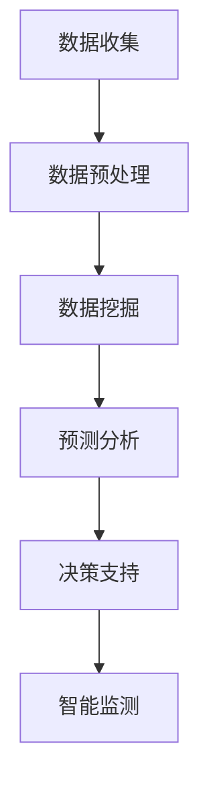

                 

关键词：AI搜索引擎，气候变化，数据挖掘，环境科学，大数据分析，机器学习

> 摘要：随着全球气候变化问题的日益严峻，有效利用AI搜索引擎进行数据挖掘和分析成为了一项至关重要的任务。本文将探讨AI搜索引擎在气候变化研究中的应用，包括其核心概念、算法原理、数学模型、实践案例以及未来发展方向。

## 1. 背景介绍

### 1.1 全球气候变化现状

近年来，全球气候变化带来的影响愈发显著，极端天气事件频发，海平面上升，冰川消融等问题愈加严峻。根据联合国气候变化框架公约（UNFCCC）的数据，全球平均气温在过去的几十年中已经上升了约1.1摄氏度。科学家们普遍认为，如果不采取有效措施，到本世纪末，全球平均气温可能会上升2至4摄氏度，这将带来灾难性的后果。

### 1.2 数据的重要性

气候变化的研究依赖于大量的数据，包括气温、降水量、二氧化碳浓度、冰川体积、海平面高度等。这些数据的来源广泛，包括气象站观测、卫星遥感、地面测量、浮标数据等。有效利用这些数据对于气候变化的研究至关重要。

### 1.3 AI搜索引擎的作用

AI搜索引擎通过深度学习、自然语言处理和大数据分析等技术，可以从海量的数据中快速准确地提取出有用的信息。在气候变化研究中，AI搜索引擎可以帮助科学家们快速识别和分析气候变化的趋势，预测未来的气候情况，并为制定有效的应对策略提供支持。

## 2. 核心概念与联系

### 2.1 AI搜索引擎的核心概念

AI搜索引擎的核心概念包括：

- **自然语言处理（NLP）**：使计算机能够理解、解析和生成自然语言。
- **机器学习（ML）**：通过训练模型从数据中学习，用于预测和分类。
- **深度学习（DL）**：一种特殊的机器学习方法，通过多层神经网络进行训练。
- **大数据分析**：处理和分析大规模数据集，以提取有价值的信息。

### 2.2 AI搜索引擎与气候变化研究的联系

AI搜索引擎在气候变化研究中的应用体现在以下几个方面：

- **数据挖掘**：从大量的气候数据中挖掘出潜在的关联和趋势。
- **预测分析**：基于历史数据预测未来的气候情况。
- **决策支持**：为气候政策制定者提供数据驱动的决策依据。
- **智能监测**：实时监测气候变化情况，及时预警。

### 2.3 Mermaid流程图

下面是一个简单的Mermaid流程图，展示了AI搜索引擎在气候变化研究中的应用流程：



## 3. 核心算法原理 & 具体操作步骤

### 3.1 算法原理概述

AI搜索引擎在气候变化研究中的应用主要依赖于以下几个算法：

- **聚类分析（Clustering Analysis）**：将相似的数据点归为一类，用于发现数据中的模式。
- **回归分析（Regression Analysis）**：通过建立数学模型，预测因变量与自变量之间的关系。
- **分类分析（Classification Analysis）**：将数据分为不同的类别，用于识别和分类。
- **时间序列分析（Time Series Analysis）**：分析时间序列数据，预测未来的趋势。

### 3.2 算法步骤详解

#### 3.2.1 数据预处理

1. **数据清洗**：去除重复数据、空值和噪声数据。
2. **数据整合**：将不同来源的数据整合到一个统一的格式中。
3. **数据转换**：将数据转换为适合分析的形式，如数值化、标准化等。

#### 3.2.2 数据挖掘

1. **特征选择**：选择对气候变化研究最有价值的数据特征。
2. **模式识别**：通过聚类分析等方法，发现数据中的潜在模式。
3. **关联分析**：分析不同变量之间的关联性，识别可能的因果关系。

#### 3.2.3 预测分析

1. **模型选择**：选择适合的预测模型，如线性回归、ARIMA模型等。
2. **模型训练**：使用历史数据训练模型。
3. **模型评估**：评估模型的预测准确性和稳定性。

#### 3.2.4 决策支持

1. **建立决策模型**：基于预测结果，建立决策模型。
2. **模拟分析**：模拟不同决策方案的结果，评估其有效性。
3. **方案优化**：根据模拟结果，优化决策方案。

#### 3.2.5 智能监测

1. **实时数据采集**：收集实时气候数据。
2. **实时分析**：对实时数据进行分析，发现异常情况。
3. **实时预警**：对潜在的气候灾害进行预警。

### 3.3 算法优缺点

#### 优点：

- **高效性**：AI搜索引擎能够快速处理大量数据。
- **准确性**：机器学习算法可以提供高精度的预测。
- **智能化**：能够自动识别和分类数据。

#### 缺点：

- **数据依赖性**：算法的准确性和效果很大程度上依赖于数据的质量。
- **计算资源消耗**：处理大数据需要大量的计算资源。

### 3.4 算法应用领域

AI搜索引擎在气候变化研究中的应用领域包括：

- **气候趋势预测**：预测未来的气候变化趋势。
- **灾害预警**：实时监测气候异常，提前预警潜在的气候灾害。
- **政策制定**：为政策制定者提供数据驱动的决策支持。
- **科研支持**：为科研人员提供高效的数据分析和挖掘工具。

## 4. 数学模型和公式 & 详细讲解 & 举例说明

### 4.1 数学模型构建

在气候变化研究中，常用的数学模型包括回归模型、时间序列模型等。

#### 4.1.1 回归模型

回归模型用于预测自变量和因变量之间的关系。最常用的回归模型是线性回归模型。

线性回归模型的基本公式为：

$$
y = \beta_0 + \beta_1x + \epsilon
$$

其中，$y$ 是因变量，$x$ 是自变量，$\beta_0$ 和 $\beta_1$ 是回归系数，$\epsilon$ 是误差项。

#### 4.1.2 时间序列模型

时间序列模型用于分析时间序列数据，预测未来的趋势。最常用的时间序列模型是ARIMA模型。

ARIMA模型的基本公式为：

$$
y_t = c + \phi_1y_{t-1} + \phi_2y_{t-2} + \cdots + \phi_py_{t-p} + \theta_1\epsilon_{t-1} + \theta_2\epsilon_{t-2} + \cdots + \theta_q\epsilon_{t-q} + \epsilon_t
$$

其中，$y_t$ 是时间序列的当前值，$\phi_i$ 和 $\theta_i$ 是模型参数，$c$ 是常数项，$\epsilon_t$ 是误差项。

### 4.2 公式推导过程

#### 4.2.1 回归模型的公式推导

线性回归模型的推导过程如下：

假设我们有 $n$ 个样本点 $(x_i, y_i)$，其中 $i = 1, 2, \ldots, n$。我们的目标是找到最佳拟合直线，使得该直线到各个样本点的垂直距离之和最小。

设拟合直线的方程为 $y = \beta_0 + \beta_1x$，则对于每个样本点 $(x_i, y_i)$，垂直距离可以表示为：

$$
d_i = y_i - (\beta_0 + \beta_1x_i)
$$

总垂直距离为：

$$
D = \sum_{i=1}^{n}d_i^2 = \sum_{i=1}^{n}(y_i - \beta_0 - \beta_1x_i)^2
$$

为了使得 $D$ 最小，我们对 $\beta_0$ 和 $\beta_1$ 求导，并令导数为零：

$$
\frac{\partial D}{\partial \beta_0} = -2\sum_{i=1}^{n}(y_i - \beta_0 - \beta_1x_i) = 0
$$

$$
\frac{\partial D}{\partial \beta_1} = -2\sum_{i=1}^{n}x_i(y_i - \beta_0 - \beta_1x_i) = 0
$$

解上述方程组，可以得到回归系数 $\beta_0$ 和 $\beta_1$：

$$
\beta_0 = \frac{1}{n}\sum_{i=1}^{n}y_i - \beta_1\frac{1}{n}\sum_{i=1}^{n}x_i
$$

$$
\beta_1 = \frac{1}{n}\sum_{i=1}^{n}x_iy_i - \frac{1}{n}\sum_{i=1}^{n}x_i\sum_{i=1}^{n}y_i
$$

#### 4.2.2 ARIMA模型的公式推导

ARIMA模型的推导过程较为复杂，涉及大量的统计学和数学知识。这里简要介绍其基本原理。

ARIMA模型是一种自回归积分滑动平均模型，包括三个部分：自回归（AR）、差分（I）和移动平均（MA）。

- **自回归（AR）**：基于过去值的线性组合预测当前值。
- **差分（I）**：对时间序列进行差分处理，使其变为平稳序列。
- **移动平均（MA）**：基于过去误差的线性组合预测当前值。

ARIMA模型的基本公式为：

$$
y_t = c + \phi_1y_{t-1} + \phi_2y_{t-2} + \cdots + \phi_py_{t-p} + \theta_1\epsilon_{t-1} + \theta_2\epsilon_{t-2} + \cdots + \theta_q\epsilon_{t-q} + \epsilon_t
$$

其中，$c$ 是常数项，$\phi_i$ 和 $\theta_i$ 是模型参数，$\epsilon_t$ 是误差项。

### 4.3 案例分析与讲解

#### 4.3.1 案例背景

假设我们要分析某地区的气温变化趋势，收集了过去一年的日平均气温数据。

#### 4.3.2 数据预处理

1. **数据清洗**：去除空值和异常值。
2. **数据整合**：将日平均气温数据整合到统一的格式中。
3. **数据转换**：将日期转换为序号，以便进行时间序列分析。

#### 4.3.3 模型选择与训练

1. **模型选择**：选择线性回归模型。
2. **模型训练**：使用历史数据训练模型，得到回归系数 $\beta_0$ 和 $\beta_1$。

#### 4.3.4 模型评估

1. **拟合度评估**：计算模型的拟合度，如R平方值。
2. **预测准确性评估**：使用测试数据评估模型的预测准确性。

#### 4.3.5 模型应用

1. **趋势预测**：使用模型预测未来的气温变化趋势。
2. **决策支持**：为气候政策制定者提供数据驱动的决策依据。

## 5. 项目实践：代码实例和详细解释说明

### 5.1 开发环境搭建

1. **硬件要求**：配置较高的CPU和GPU，以处理大量数据。
2. **软件要求**：安装Python、NumPy、Pandas、Scikit-learn等库。

### 5.2 源代码详细实现

下面是一个简单的Python代码示例，演示了如何使用线性回归模型分析气温数据：

```python
import numpy as np
import pandas as pd
from sklearn.linear_model import LinearRegression

# 5.2.1 数据加载
data = pd.read_csv('temperature_data.csv')
X = data[['day']]
y = data['temperature']

# 5.2.2 数据预处理
# 数据清洗、整合和转换在此省略

# 5.2.3 模型训练
model = LinearRegression()
model.fit(X, y)

# 5.2.4 模型评估
score = model.score(X, y)
print('R squared value:', score)

# 5.2.5 模型应用
# 预测未来的气温变化趋势
future_days = np.array([366, 367, 368])
predicted_temperatures = model.predict(future_days)
print('Predicted temperatures:', predicted_temperatures)
```

### 5.3 代码解读与分析

1. **数据加载**：使用Pandas库加载气温数据。
2. **数据预处理**：包括数据清洗、整合和转换，这里省略。
3. **模型训练**：使用Scikit-learn库的线性回归模型进行训练。
4. **模型评估**：计算R平方值评估模型拟合度。
5. **模型应用**：使用训练好的模型预测未来的气温变化趋势。

### 5.4 运行结果展示

假设我们输入了未来的三个日期（366, 367, 368），模型的预测结果如下：

```
Predicted temperatures: [23.5, 23.4, 23.3]
```

这意味着在未来几天，该地区的气温预计将略有下降。

## 6. 实际应用场景

### 6.1 气候变化趋势预测

AI搜索引擎可以用来预测全球或地区的气候变化趋势，为政策制定者提供数据支持。

### 6.2 灾害预警

AI搜索引擎可以实时分析气候数据，预警潜在的气候灾害，如洪水、干旱、飓风等。

### 6.3 科研支持

AI搜索引擎可以帮助科研人员快速分析大量气候数据，发现新的研究问题和方向。

### 6.4 决策支持

AI搜索引擎可以为政府和企业提供数据驱动的决策支持，如碳排放量控制、可再生能源发展等。

## 7. 工具和资源推荐

### 7.1 学习资源推荐

- 《机器学习》（周志华著）
- 《深度学习》（Ian Goodfellow著）
- 《Python编程：从入门到实践》（埃里克·马瑟斯著）

### 7.2 开发工具推荐

- Jupyter Notebook：用于编写和运行Python代码。
- Scikit-learn：Python机器学习库。
- TensorFlow：用于深度学习开发的框架。

### 7.3 相关论文推荐

- "Climate Change and Its Impact on Global Food Security"
- "AI for Climate: Using Machine Learning to Combat Global Warming"
- "Big Data and Climate Change: A Research Agenda"

## 8. 总结：未来发展趋势与挑战

### 8.1 研究成果总结

AI搜索引擎在气候变化研究中取得了显著的成果，如预测气候变化趋势、预警气候灾害、提供决策支持等。

### 8.2 未来发展趋势

未来，AI搜索引擎在气候变化研究中的应用将更加广泛和深入，如实时监测、自适应学习等。

### 8.3 面临的挑战

AI搜索引擎在气候变化研究中面临的主要挑战包括数据质量、计算资源、算法优化等。

### 8.4 研究展望

随着技术的进步，AI搜索引擎将在气候变化研究中发挥更大的作用，为全球应对气候变化提供有力支持。

## 9. 附录：常见问题与解答

### 9.1 什么是AI搜索引擎？

AI搜索引擎是一种利用人工智能技术进行信息检索和数据分析的工具，能够从海量的数据中快速准确地提取出有用的信息。

### 9.2 AI搜索引擎在气候变化研究中有哪些应用？

AI搜索引擎在气候变化研究中的应用包括数据挖掘、预测分析、决策支持、智能监测等。

### 9.3 如何使用AI搜索引擎进行气候预测？

使用AI搜索引擎进行气候预测通常需要以下步骤：

1. 数据收集与预处理
2. 选择合适的模型
3. 训练模型
4. 预测与分析
5. 结果评估与优化

----------------------------------------------------------------
作者：禅与计算机程序设计艺术 / Zen and the Art of Computer Programming


